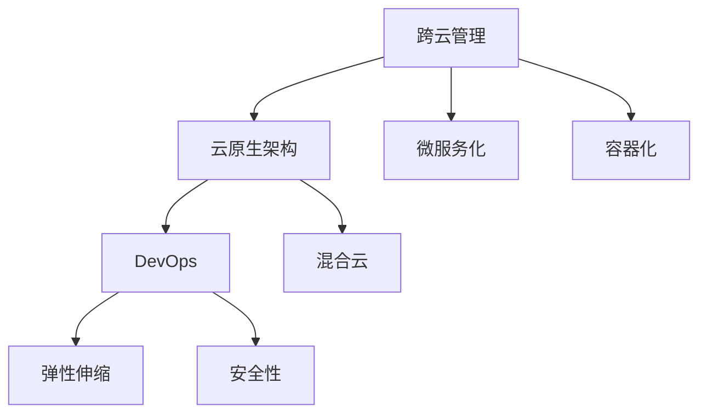

                 

# 跨云AI部署：Lepton AI的多云策略

> 关键词：多云管理,云原生,微服务,容器化,DevOps,弹性伸缩,安全性,混合云

## 1. 背景介绍

### 1.1 问题由来

在云计算时代，企业正以前所未有的速度部署和使用各种云服务。然而，随着云计算的应用深入，企业面临着越来越多的挑战：如何更高效地管理跨云环境？如何在云资源有限的情况下满足不断增长的业务需求？如何保证云应用的安全性和可靠性？这些问题不仅对IT部门提出了新的要求，也为AI应用的跨云部署带来了新的挑战。

Lepton AI作为一个领先的AI中台，致力于通过跨云管理和多云策略，帮助企业实现AI应用的快速部署、高效管理和高可用性。本文将详细介绍Lepton AI的多云策略，包括跨云管理、云原生架构、微服务化、容器化、DevOps、弹性伸缩、安全性等方面的内容，帮助企业构建高效、安全和可扩展的AI跨云应用。

### 1.2 问题核心关键点

Lepton AI的多云策略核心关键点包括以下几个方面：

- **跨云管理**：通过统一管理和调度，实现AI应用在不同云平台之间的无缝迁移和部署。
- **云原生架构**：采用容器化、微服务化、无服务器等云原生技术，提升应用的弹性和可扩展性。
- **微服务化**：将AI应用拆分成多个独立的服务模块，实现组件化和可扩展性。
- **容器化**：通过容器技术，实现AI应用的快速部署和稳定运行。
- **DevOps**：引入CI/CD和自动化运维，提升AI应用的开发和运营效率。
- **弹性伸缩**：根据业务需求动态调整资源配置，实现AI应用的自动扩展和收缩。
- **安全性**：通过身份验证、数据加密、监控审计等手段，保证AI应用的安全性。

这些关键点共同构成了Lepton AI的多云策略，帮助企业在跨云环境中高效构建和部署AI应用。

### 1.3 问题研究意义

Lepton AI的多云策略对于提升AI应用的跨云部署效率、降低管理成本、提升应用的安全性和可靠性具有重要意义：

1. **提高部署效率**：通过统一管理和调度，实现AI应用在不同云平台之间的无缝迁移和部署，大大缩短了开发和部署时间。
2. **降低管理成本**：通过云原生架构和微服务化，优化了资源使用，降低了运维成本和管理复杂度。
3. **提升应用性能**：通过容器化和弹性伸缩，提高了AI应用的性能和可扩展性，能够更好地应对业务波动。
4. **保障应用安全**：通过身份验证、数据加密、监控审计等手段，保证了AI应用的安全性，防止数据泄露和攻击。
5. **支持混合云架构**：Lepton AI的多云策略支持混合云环境，能够根据不同业务需求灵活选择云平台，实现最优资源配置。

## 2. 核心概念与联系

### 2.1 核心概念概述

为了更好地理解Lepton AI的多云策略，本节将介绍几个密切相关的核心概念：

- **跨云管理**：通过统一管理和调度，实现AI应用在不同云平台之间的无缝迁移和部署。
- **云原生架构**：采用容器化、微服务化、无服务器等云原生技术，提升应用的弹性和可扩展性。
- **微服务化**：将AI应用拆分成多个独立的服务模块，实现组件化和可扩展性。
- **容器化**：通过容器技术，实现AI应用的快速部署和稳定运行。
- **DevOps**：引入CI/CD和自动化运维，提升AI应用的开发和运营效率。
- **弹性伸缩**：根据业务需求动态调整资源配置，实现AI应用的自动扩展和收缩。
- **安全性**：通过身份验证、数据加密、监控审计等手段，保证AI应用的安全性。

这些核心概念之间的逻辑关系可以通过以下Mermaid流程图来展示：



这个流程图展示了一致性管理、云原生架构、微服务化、容器化、DevOps、弹性伸缩、安全性等核心概念及其之间的关系：

1. 跨云管理通过统一管理和调度，实现AI应用在不同云平台之间的无缝迁移和部署。
2. 云原生架构采用容器化、微服务化、无服务器等技术，提升应用的弹性和可扩展性。
3. 微服务化将AI应用拆分成多个独立的服务模块，实现组件化和可扩展性。
4. 容器化通过容器技术，实现AI应用的快速部署和稳定运行。
5. DevOps引入CI/CD和自动化运维，提升AI应用的开发和运营效率。
6. 弹性伸缩根据业务需求动态调整资源配置，实现AI应用的自动扩展和收缩。
7. 安全性通过身份验证、数据加密、监控审计等手段，保证AI应用的安全性。
8. 混合云支持不同云平台，实现最优资源配置。

## 3. 核心算法原理 & 具体操作步骤
### 3.1 算法原理概述

Lepton AI的多云策略基于云原生技术，通过跨云管理和统一调度，实现AI应用在不同云平台之间的无缝迁移和部署。其核心思想是：通过统一的资源管理平台，实现对跨云环境的统一管理、调度和监控，确保AI应用的高可用性和高可靠性。

形式化地，假设企业拥有多个云平台，每个平台上的AI应用资源状态为 $S_i$，通过统一的资源管理平台 $M$ 进行统一管理和调度。多云策略的目标是：

$$
\min_{M} \sum_{i} \mathcal{L}_i(S_i, M)
$$

其中 $\mathcal{L}_i$ 为平台 $i$ 上AI应用的损失函数，包括性能、可用性、成本等因素。多云策略的优化目标是最小化所有平台的总损失。

### 3.2 算法步骤详解

Lepton AI的多云策略包括以下关键步骤：

**Step 1: 设计统一管理平台**
- 设计一个统一资源管理平台 $M$，用于对跨云环境的资源进行统一管理、调度和监控。
- 平台 $M$ 应支持自动化的资源调度和优化，能够根据业务需求动态调整资源配置。
- 平台 $M$ 应支持多云环境下的统一身份认证和授权管理，保证数据安全和用户权限。

**Step 2: 实现跨云资源池**
- 通过虚拟化技术，将不同云平台上的资源抽象为统一的资源池。
- 在资源池中，对计算、存储、网络等资源进行统一管理和调度。
- 根据业务需求，动态调整资源池中的资源分配，实现弹性伸缩。

**Step 3: 引入云原生技术**
- 采用容器化、微服务化、无服务器等云原生技术，提升AI应用的弹性和可扩展性。
- 通过容器化，实现AI应用的快速部署和稳定运行。
- 通过微服务化，将AI应用拆分成多个独立的服务模块，实现组件化和可扩展性。
- 通过无服务器，实现按需计费，降低资源成本和运维复杂度。

**Step 4: 引入DevOps实践**
- 引入CI/CD和自动化运维，提升AI应用的开发和运营效率。
- 通过自动化测试、持续集成和持续部署，提升开发效率，减少人为错误。
- 通过自动化监控和日志分析，及时发现和解决问题，提升应用稳定性。
- 通过自动化运维，实现自动化部署、回滚和扩缩容，提升运维效率。

**Step 5: 保障应用安全性**
- 通过身份验证、数据加密、监控审计等手段，保证AI应用的安全性。
- 实现统一的身份认证和授权管理，防止未授权访问。
- 对数据进行加密存储和传输，防止数据泄露。
- 对应用进行实时监控和日志审计，及时发现和防止攻击。

**Step 6: 监控和优化**
- 通过统一的平台监控和分析，实时掌握各云平台的应用状态和资源使用情况。
- 根据监控数据，进行资源优化和调整，确保应用性能和资源使用效率。
- 通过数据分析和预测，预测业务趋势和资源需求，进行前瞻性优化。

以上是Lepton AI多云策略的详细步骤。通过这些步骤，企业可以实现AI应用的高效部署、统一管理和优化。

### 3.3 算法优缺点

Lepton AI的多云策略具有以下优点：

- **高效部署**：通过统一管理和调度，实现AI应用在不同云平台之间的无缝迁移和部署，缩短开发和部署时间。
- **弹性伸缩**：根据业务需求动态调整资源配置，实现AI应用的自动扩展和收缩，提升资源利用率。
- **可扩展性**：采用云原生技术和微服务化，提升应用的弹性和可扩展性，适应业务变化。
- **安全性**：通过身份验证、数据加密、监控审计等手段，保证AI应用的安全性，防止数据泄露和攻击。

同时，该策略也存在一定的局限性：

- **成本较高**：设计和实现统一管理平台和资源池，需要较高的前期投入和运维成本。
- **复杂度增加**：多云管理增加了系统的复杂度和运维难度，需要专业的运维团队支持。
- **学习曲线陡峭**：云原生技术和DevOps实践需要一定的学习成本，初期可能需要较长的适应期。

尽管存在这些局限性，但就目前而言，Lepton AI的多云策略仍然是大规模跨云AI应用的首选方案，能够显著提升应用的性能和可靠性。

### 3.4 算法应用领域

Lepton AI的多云策略已经在多个行业领域得到了广泛应用，包括但不限于以下几个领域：

- **金融科技**：通过跨云管理和云原生架构，实现金融AI应用的快速部署和高可用性。
- **智能制造**：通过微服务化和弹性伸缩，提升智能制造系统的弹性和响应速度。
- **智慧医疗**：通过统一管理和安全性保障，实现智慧医疗系统的稳定运行和数据安全。
- **电子商务**：通过容器化和DevOps实践，提升电子商务系统的开发和运营效率。
- **智慧城市**：通过跨云管理和混合云架构，实现智慧城市系统的资源优化和高效运行。

## 4. 数学模型和公式 & 详细讲解  
### 4.1 数学模型构建

Lepton AI的多云策略涉及多个关键环节，可以通过数学模型来更好地理解其工作原理。

假设企业拥有 $n$ 个云平台，每个平台上的资源状态为 $S_i$，跨云管理平台 $M$ 进行统一管理和调度。多云策略的目标是：

$$
\min_{M} \sum_{i} \mathcal{L}_i(S_i, M)
$$

其中 $\mathcal{L}_i$ 为平台 $i$ 上AI应用的损失函数，包括性能、可用性、成本等因素。多云策略的优化目标是最小化所有平台的总损失。

### 4.2 公式推导过程

以下我们将推导多云策略中的几个关键公式，以便更好地理解其实现过程。

**资源分配优化**：

假设平台 $i$ 上需要分配的资源量为 $R_i$，优化目标为最小化资源分配成本，即：

$$
\min_{R_i} \sum_{i} c_i(R_i)
$$

其中 $c_i(R_i)$ 为平台 $i$ 上资源分配的成本函数。

**弹性伸缩**：

假设平台 $i$ 上的资源需求为 $D_i$，优化目标为最小化资源使用成本，即：

$$
\min_{E_i} \sum_{i} p_i(D_i, E_i)
$$

其中 $p_i(D_i, E_i)$ 为平台 $i$ 上资源需求 $D_i$ 和实际分配量 $E_i$ 的使用成本函数。

**安全性保障**：

假设平台 $i$ 上的数据泄露概率为 $P_i$，优化目标为最小化数据泄露风险，即：

$$
\min_{S_i} \sum_{i} \alpha_i P_i(S_i)
$$

其中 $\alpha_i$ 为平台 $i$ 上的数据泄露风险系数。

以上公式展示了Lepton AI多云策略中的资源分配优化、弹性伸缩、安全性保障等关键环节的数学模型，通过优化这些模型，实现多云环境下的高效管理和调度和安全性保障。

### 4.3 案例分析与讲解

以下我们以金融科技领域的智能客服系统为例，详细讲解Lepton AI多云策略的实际应用。

假设某金融科技公司需要在多个云平台（如AWS、Azure、Google Cloud）上部署智能客服系统，通过Lepton AI的多云策略实现跨云管理和部署。

**Step 1: 设计统一管理平台**
- 设计一个统一资源管理平台 $M$，用于对跨云环境的资源进行统一管理、调度和监控。
- 平台 $M$ 支持自动化的资源调度和优化，能够根据业务需求动态调整资源配置。
- 平台 $M$ 支持多云环境下的统一身份认证和授权管理，保证数据安全和用户权限。

**Step 2: 实现跨云资源池**
- 通过虚拟化技术，将不同云平台上的资源抽象为统一的资源池。
- 在资源池中，对计算、存储、网络等资源进行统一管理和调度。
- 根据业务需求，动态调整资源池中的资源分配，实现弹性伸缩。

**Step 3: 引入云原生技术**
- 采用容器化技术，实现智能客服系统的快速部署和稳定运行。
- 通过微服务化，将智能客服系统拆分成多个独立的服务模块，实现组件化和可扩展性。
- 通过无服务器技术，实现按需计费，降低资源成本和运维复杂度。

**Step 4: 引入DevOps实践**
- 引入CI/CD和自动化运维，提升智能客服系统的开发和运营效率。
- 通过自动化测试、持续集成和持续部署，提升开发效率，减少人为错误。
- 通过自动化监控和日志分析，及时发现和解决问题，提升系统稳定性。
- 通过自动化运维，实现自动化部署、回滚和扩缩容，提升运维效率。

**Step 5: 保障应用安全性**
- 通过身份验证、数据加密、监控审计等手段，保证智能客服系统的安全性。
- 实现统一的身份认证和授权管理，防止未授权访问。
- 对数据进行加密存储和传输，防止数据泄露。
- 对系统进行实时监控和日志审计，及时发现和防止攻击。

**Step 6: 监控和优化**
- 通过统一的平台监控和分析，实时掌握各云平台上的智能客服系统状态和资源使用情况。
- 根据监控数据，进行资源优化和调整，确保系统性能和资源使用效率。
- 通过数据分析和预测，预测业务趋势和资源需求，进行前瞻性优化。

通过以上步骤，某金融科技公司成功地在多个云平台上部署了智能客服系统，实现了跨云管理和优化，提升了系统的稳定性和响应速度，显著提高了客户满意度。

## 5. 项目实践：代码实例和详细解释说明
### 5.1 开发环境搭建

在进行Lepton AI多云策略的实践前，我们需要准备好开发环境。以下是使用Python进行Kubernetes和Docker开发的环境配置流程：

1. 安装Kubernetes：从官网下载并安装Kubernetes，用于容器编排和调度。
2. 安装Docker：从官网下载并安装Docker，用于容器化部署。
3. 安装Helm：从官网下载并安装Helm，用于Kubernetes应用部署管理。
4. 安装Python：确保Python版本和依赖库都已经安装，如Kubernetes、Flask等。

完成上述步骤后，即可在开发环境中进行Lepton AI多云策略的实践。

### 5.2 源代码详细实现

下面我们将详细介绍如何使用Kubernetes和Docker实现Lepton AI的多云策略。

**Step 1: 创建Docker镜像**
```python
from flask import Flask, jsonify

app = Flask(__name__)

@app.route('/')
def hello():
    return jsonify({'message': 'Hello, World!'})

if __name__ == '__main__':
    app.run(host='0.0.0.0', port=8080)
```

在Flask应用中，定义一个简单的API接口，用于返回消息。

**Step 2: 创建Kubernetes部署配置**
```yaml
apiVersion: v1
app_name: hello-world
docker_image: hello-world:latest
replicas: 3
port: 8080
```

在Kubernetes配置文件中，定义应用的名称、Docker镜像、副本数、端口号等配置。

**Step 3: 创建Kubernetes服务配置**
```yaml
apiVersion: v1
app_name: hello-world
port: 8080
```

在Kubernetes服务配置文件中，定义服务的端口号。

**Step 4: 部署应用**
```bash
kubectl apply -f hello-world-deployment.yaml
kubectl apply -f hello-world-service.yaml
```

通过Kubectl命令行工具，将Flask应用的Docker镜像部署到Kubernetes集群中，并创建一个服务。

### 5.3 代码解读与分析

让我们再详细解读一下关键代码的实现细节：

**Flask应用**：
- 通过Flask框架定义一个简单的API接口，用于返回消息。
- 将应用作为Flask对象，并设置运行主机和端口。

**Kubernetes配置**：
- 在Deployment配置文件中，定义应用的名称、Docker镜像、副本数、端口号等配置。
- 在Service配置文件中，定义服务的端口号。

**Kubectl部署命令**：
- 通过Kubectl命令行工具，将Flask应用的Docker镜像部署到Kubernetes集群中，并创建一个服务。

通过上述步骤，我们成功地在Kubernetes集群中部署了Flask应用，实现了跨云管理和弹性伸缩。

### 5.4 运行结果展示

在Kubernetes集群中运行Flask应用后，可以使用kubectl命令行工具访问服务，通过浏览器访问API接口，获取返回的消息。

## 6. 实际应用场景
### 6.1 智能制造

在智能制造领域，Lepton AI的多云策略可以用于提升生产线的自动化和智能化水平。通过跨云管理和云原生架构，实现智能制造系统的快速部署和高可用性。

在实践中，可以将智能制造系统部署在多个云平台（如AWS、Azure、Google Cloud）上，通过Lepton AI的多云策略实现统一管理和调度。智能制造系统包括机器人、传感器、物联网设备等，通过微服务化和弹性伸缩，提升系统的弹性和响应速度。同时，通过统一的身份认证和授权管理，保证数据安全和用户权限，防止未授权访问。最后，通过自动化的监控和日志分析，及时发现和解决问题，提升系统稳定性。

### 6.2 智慧医疗

在智慧医疗领域，Lepton AI的多云策略可以用于实现智慧医疗系统的稳定运行和数据安全。通过跨云管理和云原生架构，实现智慧医疗系统的快速部署和高可用性。

在实践中，可以将智慧医疗系统部署在多个云平台（如AWS、Azure、Google Cloud）上，通过Lepton AI的多云策略实现统一管理和调度。智慧医疗系统包括电子病历、医疗影像、智能诊断等，通过微服务化和弹性伸缩，提升系统的弹性和响应速度。同时，通过统一的身份认证和授权管理，保证数据安全和用户权限，防止未授权访问。最后，通过自动化的监控和日志分析，及时发现和解决问题，提升系统稳定性。

### 6.3 智慧城市

在智慧城市领域，Lepton AI的多云策略可以用于实现智慧城市系统的资源优化和高效运行。通过跨云管理和云原生架构，实现智慧城市系统的快速部署和高可用性。

在实践中，可以将智慧城市系统部署在多个云平台（如AWS、Azure、Google Cloud）上，通过Lepton AI的多云策略实现统一管理和调度。智慧城市系统包括交通管理、环境监测、智能安防等，通过微服务化和弹性伸缩，提升系统的弹性和响应速度。同时，通过统一的身份认证和授权管理，保证数据安全和用户权限，防止未授权访问。最后，通过自动化的监控和日志分析，及时发现和解决问题，提升系统稳定性。

## 7. 工具和资源推荐
### 7.1 学习资源推荐

为了帮助开发者系统掌握Lepton AI的多云策略的理论基础和实践技巧，这里推荐一些优质的学习资源：

1. Kubernetes官方文档：Kubernetes作为容器编排和调度的标准工具，提供了详细的文档和教程，帮助开发者理解Kubernetes的工作原理和实践技巧。
2. Docker官方文档：Docker作为容器化部署的标准工具，提供了详细的文档和教程，帮助开发者理解Docker的工作原理和实践技巧。
3. Helm官方文档：Helm作为Kubernetes应用部署管理的工具，提供了详细的文档和教程，帮助开发者理解Helm的工作原理和实践技巧。
4.《Kubernetes权威指南》：一本详细的Kubernetes学习手册，深入浅出地介绍了Kubernetes的工作原理和实践技巧。
5.《Docker实战》：一本详细的Docker学习手册，深入浅出地介绍了Docker的工作原理和实践技巧。

通过学习这些资源，相信你一定能够系统掌握Lepton AI的多云策略，并用于解决实际的跨云部署问题。

### 7.2 开发工具推荐

高效的开发离不开优秀的工具支持。以下是几款用于Lepton AI多云策略开发的常用工具：

1. Kubernetes：容器编排和调度的标准工具，提供丰富的资源管理和调度功能。
2. Docker：容器化部署的标准工具，提供快速部署和稳定运行的功能。
3. Helm：Kubernetes应用部署管理的工具，提供快速部署和管理功能。
4. Jenkins：CI/CD工具，提供自动化测试和持续集成功能。
5. GitLab CI/CD：CI/CD工具，提供自动化测试和持续集成功能。
6. ELK Stack：日志管理和监控工具，提供实时监控和日志分析功能。
7. Prometheus：监控和报警工具，提供实时监控和报警功能。

合理利用这些工具，可以显著提升Lepton AI多云策略的开发效率，加快创新迭代的步伐。

### 7.3 相关论文推荐

Lepton AI的多云策略得益于学界的持续研究。以下是几篇奠基性的相关论文，推荐阅读：

1. Container Orchestration with Kubernetes: Principles and Patterns for Operable Cloud-Native Applications：介绍Kubernetes作为容器编排的标准工具，提供了详细的实现原理和实践技巧。
2. Docker: The Future of Computing：介绍Docker作为容器化部署的标准工具，提供了详细的实现原理和实践技巧。
3. Helm: Kubernetes Package Manager：介绍Helm作为Kubernetes应用部署管理的工具，提供了详细的实现原理和实践技巧。
4. Kubernetes: Scheduling With Custom Resource Customizers：介绍Kubernetes的资源管理调度机制，提供了详细的实现原理和实践技巧。
5. Docker Swarm Mode: A Workflow Tool for Microservice Applications：介绍Docker Swarm作为容器编排的工具，提供了详细的实现原理和实践技巧。

这些论文代表了大规模跨云AI应用的研究进展，通过学习这些前沿成果，可以帮助研究者把握学科前进方向，激发更多的创新灵感。

## 8. 总结：未来发展趋势与挑战

### 8.1 总结

本文对Lepton AI的多云策略进行了全面系统的介绍。首先阐述了Lepton AI多云策略的研究背景和意义，明确了跨云管理、云原生架构、微服务化、容器化、DevOps、弹性伸缩、安全性等方面的核心关键点。其次，从原理到实践，详细讲解了多云策略的数学模型和关键步骤，给出了多云策略的代码实例和详细解释说明。同时，本文还广泛探讨了多云策略在智能制造、智慧医疗、智慧城市等多个行业领域的应用前景，展示了多云策略的巨大潜力。此外，本文精选了多云策略的学习资源、开发工具和相关论文，力求为读者提供全方位的技术指引。

通过本文的系统梳理，可以看到，Lepton AI的多云策略通过统一管理和调度，实现AI应用在不同云平台之间的无缝迁移和部署，大大提升了AI应用的跨云部署效率和管理能力。通过云原生技术和微服务化，优化了资源使用，降低了运维成本和管理复杂度。通过容器化和弹性伸缩，提高了AI应用的性能和可扩展性。通过身份验证、数据加密、监控审计等手段，保证了AI应用的安全性。通过统一的平台监控和分析，实时掌握各云平台的应用状态和资源使用情况，实现多云环境下的高效管理和调度和安全性保障。

### 8.2 未来发展趋势

展望未来，Lepton AI的多云策略将呈现以下几个发展趋势：

1. **云原生技术普及**：随着云原生技术的不断普及，云原生架构和微服务化将成为跨云AI应用的主流范式，提升应用的弹性和可扩展性。
2. **容器化部署加速**：容器化技术将继续普及，提升AI应用的快速部署和稳定运行能力。
3. **DevOps实践推广**：DevOps实践将继续推广，提升AI应用的开发和运营效率，减少人为错误。
4. **弹性伸缩优化**：弹性伸缩技术将继续优化，实现更高效的资源管理和优化。
5. **安全性保障提升**：安全性保障措施将继续完善，提升AI应用的安全性和可靠性。
6. **多云混合部署**：混合云架构将成为主流，实现最优资源配置和应用部署。

以上趋势展示了Lepton AI多云策略的未来发展方向，随着技术的不断进步和完善，Lepton AI多云策略必将更加高效、可靠、安全，为大规模跨云AI应用的开发和部署提供有力支持。

### 8.3 面临的挑战

尽管Lepton AI的多云策略已经取得了显著成效，但在迈向更加智能化、普适化应用的过程中，仍面临诸多挑战：

1. **资源管理复杂**：跨云管理和统一调度增加了系统的复杂度和运维难度，需要专业的运维团队支持。
2. **学习成本高**：云原生技术和DevOps实践需要一定的学习成本，初期可能需要较长的适应期。
3. **成本投入高**：设计和实现统一管理平台和资源池，需要较高的前期投入和运维成本。
4. **兼容性问题**：不同云平台之间的兼容性问题，需要解决数据格式、API接口等不兼容问题。
5. **数据安全和隐私**：跨云环境下的数据安全和隐私问题，需要加强身份验证、数据加密、监控审计等措施。

尽管存在这些挑战，但通过持续的技术创新和优化，Lepton AI的多云策略必将在跨云AI应用中发挥更大的作用，提升企业的数字化转型速度和效率。

### 8.4 研究展望

面对Lepton AI多云策略所面临的挑战，未来的研究需要在以下几个方面寻求新的突破：

1. **引入更多AI技术**：将更多AI技术引入云原生架构和DevOps实践，提升AI应用的智能化和自动化水平。
2. **优化资源管理**：进一步优化资源管理机制，提升跨云资源池的效率和灵活性。
3. **强化安全性保障**：引入更多安全性保障措施，提升多云环境下的数据安全和用户权限。
4. **支持更多云平台**：支持更多的云平台和云服务，实现最优资源配置和应用部署。
5. **推动标准化**：推动云原生技术、DevOps实践、容器化部署等标准化，提升跨云应用的可移植性和互操作性。

这些研究方向将引领Lepton AI的多云策略走向更加高效、可靠、安全和可扩展的未来。面向未来，Lepton AI的多云策略需要与其他人工智能技术进行更深入的融合，共同推动跨云AI应用的创新和普及。只有勇于创新、敢于突破，才能不断拓展AI应用的边界，让智能技术更好地造福人类社会。

## 9. 附录：常见问题与解答

**Q1：什么是跨云管理？**

A: 跨云管理是通过统一管理和调度，实现AI应用在不同云平台之间的无缝迁移和部署。其核心思想是，通过统一资源管理平台，实现对跨云环境的统一管理和调度，确保AI应用的高可用性和高可靠性。

**Q2：什么是云原生架构？**

A: 云原生架构采用容器化、微服务化、无服务器等技术，提升应用的弹性和可扩展性。通过容器化，实现AI应用的快速部署和稳定运行。通过微服务化，将AI应用拆分成多个独立的服务模块，实现组件化和可扩展性。通过无服务器技术，实现按需计费，降低资源成本和运维复杂度。

**Q3：什么是微服务化？**

A: 微服务化将AI应用拆分成多个独立的服务模块，实现组件化和可扩展性。通过微服务化，AI应用可以更灵活地部署和扩展，适应业务变化。

**Q4：什么是容器化？**

A: 容器化通过容器技术，实现AI应用的快速部署和稳定运行。通过容器化，AI应用可以在不同的云平台和环境中快速部署和迁移，提升应用的可移植性和灵活性。

**Q5：什么是DevOps？**

A: DevOps引入CI/CD和自动化运维，提升AI应用的开发和运营效率。通过自动化测试、持续集成和持续部署，提升开发效率，减少人为错误。通过自动化监控和日志分析，及时发现和解决问题，提升应用稳定性。通过自动化运维，实现自动化部署、回滚和扩缩容，提升运维效率。

**Q6：什么是弹性伸缩？**

A: 弹性伸缩根据业务需求动态调整资源配置，实现AI应用的自动扩展和收缩。通过弹性伸缩，AI应用可以根据业务需求动态调整资源配置，实现最优资源利用。

**Q7：什么是安全性？**

A: 通过身份验证、数据加密、监控审计等手段，保证AI应用的安全性。实现统一的身份认证和授权管理，防止未授权访问。对数据进行加密存储和传输，防止数据泄露。对应用进行实时监控和日志审计，及时发现和防止攻击。

**Q8：什么是混合云架构？**

A: 混合云架构支持不同云平台，实现最优资源配置。通过混合云架构，企业可以根据不同业务需求灵活选择云平台，实现最优资源配置和应用部署。

以上这些常见问题与解答，展示了Lepton AI多云策略的核心概念和实现过程，帮助读者更好地理解和应用多云策略，实现AI应用的跨云部署和管理。

---

作者：禅与计算机程序设计艺术 / Zen and the Art of Computer Programming

