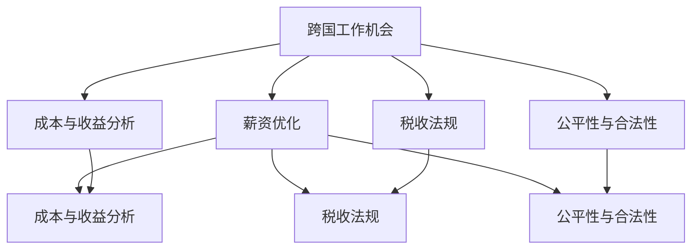

                 

# 跨国工作机会与薪资优化

在当前全球化的时代背景下，跨国工作机会与薪资优化成为了越来越多企业和个人关注的焦点。跨国工作不仅能为公司带来新的视角和市场机会，也为个人提供了拓展职业发展的平台。然而，面对不同国家之间的文化差异、工资水平差异以及税收法规差异，如何在保持公平性、合理性、合法性的前提下，优化跨国工作机会与薪资，成为了一个复杂而重要的课题。本文将从多个维度探讨这个问题，包括核心概念、算法原理、实际应用和未来展望，希望能为读者提供一份全面的指南。

## 1. 背景介绍

### 1.1 问题由来

随着经济全球化进程的加快，跨国公司逐渐增多，跨国工作机会也随之增加。跨国工作不仅能提升公司的市场竞争力，还能促进国际人才的流动和交流。然而，跨国工作也面临许多挑战，尤其是在薪资待遇、税务处理和文化适应等方面。如何优化跨国工作机会与薪资，成为了跨国公司和个人都需要解决的重要问题。

### 1.2 问题核心关键点

跨国工作机会与薪资优化主要涉及以下几个方面：

1. **文化差异**：不同国家之间的文化差异会影响员工的工作体验和生活质量，需要综合考虑。
2. **工资水平差异**：不同国家之间的工资水平差异需要合理定价，避免过度或不足支付。
3. **税收法规**：不同国家的税收法规不同，需要了解并遵守当地法律。
4. **公平性与合法性**：薪资优化需要确保公平性与合法性，避免歧视和剥削。
5. **成本与收益分析**：需要进行详细的成本与收益分析，以评估跨国工作的效益。

这些关键点构成了跨国工作机会与薪资优化的复杂性，需要系统性的方法来解决问题。

### 1.3 问题研究意义

研究跨国工作机会与薪资优化，对于促进全球人才流动、提升企业国际竞争力、增强个人职业发展机会具有重要意义。通过合理优化薪资结构，可以有效吸引和留住人才，提升企业整体绩效。同时，对于个人而言，跨国工作不仅能提供更高的薪资待遇，还能提升国际视野和跨文化沟通能力。因此，跨国工作机会与薪资优化是当前全球化进程中的一个关键课题。

## 2. 核心概念与联系

### 2.1 核心概念概述

为了更好地理解跨国工作机会与薪资优化的原理，本节将介绍几个核心概念：

1. **跨国工作机会**：指公司或个人跨越国界进行工作，包括但不限于派遣员工、设立海外子公司、开展国际项目等。
2. **薪资优化**：指在跨国工作背景下，通过合理定价、调整和分配薪资，以实现成本控制、员工满意和公司盈利三者的平衡。
3. **成本与收益分析**：通过评估跨国工作中的各项成本和收益，如直接成本（薪资、福利、搬迁费等）和间接成本（文化差异、汇率波动等），来优化跨国工作的经济效益。
4. **税收法规**：不同国家的税收法规不同，包括个人所得税、增值税、社会保险税等，需要了解并遵守。
5. **公平性与合法性**：薪资优化需要确保公平性，避免因种族、性别、国籍等因素产生的歧视；同时需要遵守当地法律，避免不合法的薪资结构和做法。

这些核心概念之间的逻辑关系可以通过以下Mermaid流程图来展示：



这个流程图展示了跨国工作机会与薪资优化的核心概念及其之间的关系：

1. 跨国工作机会是薪资优化的基础。
2. 成本与收益分析、税收法规、公平性与合法性是薪资优化的重要组成部分。
3. 成本与收益分析、税收法规、公平性与合法性相互影响，共同决定薪资优化策略。

## 3. 核心算法原理 & 具体操作步骤

### 3.1 算法原理概述

跨国工作机会与薪资优化的核心算法基于经济学中的供需理论，通过分析跨国工作中的成本与收益，确定最优的薪资水平和结构。具体来说，算法包括以下几个步骤：

1. **成本分析**：计算跨国工作中的各项成本，如薪资、搬迁费、住房补贴、文化适应费用等。
2. **收益分析**：计算跨国工作中的各项收益，如增加的销售额、技术交流、品牌影响力等。
3. **差异分析**：分析不同国家之间的工资水平差异和税收法规差异，确保公平性。
4. **优化策略**：根据成本与收益分析结果，制定最优的薪资优化策略。

### 3.2 算法步骤详解

#### 3.2.1 成本分析

成本分析是跨国工作机会与薪资优化的第一步，主要包括以下几个方面：

1. **直接成本**：包括薪资、搬迁费、住房补贴等。
2. **间接成本**：包括文化适应费用、医疗保健费用、签证申请费用等。
3. **隐性成本**：包括心理压力、家庭分离等。

成本分析需要全面考虑跨国工作中的所有相关成本，以确保薪资优化的准确性和合理性。

#### 3.2.2 收益分析

收益分析旨在评估跨国工作对公司和个人所带来的收益，主要包括以下几个方面：

1. **直接收益**：包括增加的销售额、市场份额等。
2. **间接收益**：包括技术交流、品牌影响力等。
3. **长期收益**：包括国际化经验、人才储备等。

收益分析需要综合考虑跨国工作的短期和长期收益，以评估其经济效益。

#### 3.2.3 差异分析

差异分析包括工资水平差异和税收法规差异的评估。

1. **工资水平差异**：通过比较不同国家之间的工资水平，确定跨国工作的合理薪资水平。
2. **税收法规差异**：了解不同国家的税收法规，计算应纳税额，确保合法性。

差异分析需要综合考虑各种因素，确保薪资优化的公平性和合法性。

#### 3.2.4 优化策略

优化策略是通过成本与收益分析、差异分析得出的结论，制定具体的薪资优化策略。

1. **确定薪资水平**：根据成本与收益分析结果，确定最优的薪资水平。
2. **设计薪资结构**：根据公平性与合法性要求，设计合理的薪资结构。
3. **调整薪资分配**：根据成本与收益分析结果，调整薪资分配比例。

### 3.3 算法优缺点

跨国工作机会与薪资优化的算法具有以下优点：

1. **全面性**：综合考虑了成本与收益、差异分析等多方面因素，确保薪资优化的全面性。
2. **公平性**：通过差异分析，确保薪资优化的公平性，避免因国籍、种族等因素产生的歧视。
3. **合法性**：了解不同国家的税收法规，确保薪资优化的合法性。

同时，该算法也存在一些缺点：

1. **复杂性**：涉及成本与收益、差异分析等多个维度，计算复杂。
2. **数据依赖**：依赖于准确的数据收集和分析，数据不准确可能导致结果偏差。
3. **文化适应**：文化差异可能影响薪资优化的效果，需要综合考虑。

尽管存在这些局限性，但就目前而言，该算法仍是大公司跨国工作机会与薪资优化的重要参考。

### 3.4 算法应用领域

跨国工作机会与薪资优化在多个领域得到了广泛应用，例如：

1. **跨国企业**：通过合理定价和调整薪资，提升国际竞争力和员工满意度。
2. **个人职业发展**：通过评估跨国工作的成本与收益，优化职业发展路径。
3. **国际项目**：通过制定最优的薪资策略，提升项目成功率。
4. **国际学生**：通过评估跨国学习的成本与收益，优化留学决策。

除了上述这些领域外，跨国工作机会与薪资优化还可以应用于政府、非营利组织、大型跨国项目等多个场景，为跨国人才流动和经济发展提供支持。

## 4. 数学模型和公式 & 详细讲解 & 举例说明

### 4.1 数学模型构建

跨国工作机会与薪资优化的数学模型基于经济学中的供需理论，主要包括以下几个参数：

1. **薪资水平**：记为 $S$，表示跨国工作中的最优薪资水平。
2. **成本**：记为 $C$，表示跨国工作中的总成本，包括直接成本、间接成本和隐性成本。
3. **收益**：记为 $R$，表示跨国工作中的总收益，包括直接收益、间接收益和长期收益。
4. **差异**：记为 $D$，表示不同国家之间的工资水平差异和税收法规差异。

数学模型可以表示为：

$$
S = \min(C, R + D)
$$

其中 $\min$ 表示取最小值，确保薪资优化的合理性。

### 4.2 公式推导过程

公式推导过程如下：

1. **成本函数**：
   $$
   C = C_{\text{direct}} + C_{\text{indirect}} + C_{\text{implicit}}
   $$
   其中 $C_{\text{direct}}$、$C_{\text{indirect}}$ 和 $C_{\text{implicit}}$ 分别表示直接成本、间接成本和隐性成本。

2. **收益函数**：
   $$
   R = R_{\text{direct}} + R_{\text{indirect}} + R_{\text{long-term}}
   $$
   其中 $R_{\text{direct}}$、$R_{\text{indirect}}$ 和 $R_{\text{long-term}}$ 分别表示直接收益、间接收益和长期收益。

3. **差异函数**：
   $$
   D = D_{\text{salary}} + D_{\text{tax}}
   $$
   其中 $D_{\text{salary}}$ 和 $D_{\text{tax}}$ 分别表示工资水平差异和税收法规差异。

4. **优化目标**：
   $$
   S = \min(C, R + D)
   $$

通过以上公式，可以计算出跨国工作中的最优薪资水平 $S$。

### 4.3 案例分析与讲解

假设一家跨国公司在 A 国和 B 国都有业务，A 国工资水平为 $30,000$，B 国为 $20,000$，两国税收法规不同，A 国税率为 $20\%$，B 国税率为 $15\%$。公司在 A 国的直接成本为 $50,000$，间接成本为 $10,000$，隐性成本为 $20,000$；在 B 国的直接成本为 $40,000$，间接成本为 $15,000$，隐性成本为 $10,000$。公司在 A 国的直接收益为 $100,000$，间接收益为 $50,000$，长期收益为 $20,000$；在 B 国的直接收益为 $80,000$，间接收益为 $40,000$，长期收益为 $15,000$。

根据以上数据，可以计算出 A 国和 B 国的成本和收益：

- A 国的成本：$C_A = 50,000 + 10,000 + 20,000 = 80,000$
- A 国的收益：$R_A = 100,000 + 50,000 + 20,000 = 170,000$
- B 国的成本：$C_B = 40,000 + 15,000 + 10,000 = 65,000$
- B 国的收益：$R_B = 80,000 + 40,000 + 15,000 = 135,000$

根据公式，可以计算出 A 国和 B 国的差异：

- A 国差异：$D_A = (30,000 - 30,000) + (20,000 - 20,000) = 0$
- B 国差异：$D_B = (20,000 - 30,000) + (15,000 - 20,000) = -5,000$

因此，A 国的最优薪资水平为 $S_A = \min(C_A, R_A + D_A) = \min(80,000, 170,000 + 0) = 80,000$，B 国的最优薪资水平为 $S_B = \min(C_B, R_B + D_B) = \min(65,000, 135,000 - 5,000) = 65,000$。

通过这个案例可以看出，通过详细的成本与收益分析，可以得出最优的薪资水平和结构，确保跨国工作的公平性、合法性和经济效益。

## 5. 项目实践：代码实例和详细解释说明

### 5.1 开发环境搭建

在进行跨国工作机会与薪资优化实践前，我们需要准备好开发环境。以下是使用Python进行开发的环境配置流程：

1. 安装Anaconda：从官网下载并安装Anaconda，用于创建独立的Python环境。

2. 创建并激活虚拟环境：
```bash
conda create -n exp_env python=3.9 
conda activate exp_env
```

3. 安装必要的Python库：
```bash
pip install numpy pandas sympy sympy-solvers
```

4. 安装Python界面工具：
```bash
pip install ipywidgets ipykernel jupyter notebook
```

完成上述步骤后，即可在`exp_env`环境中开始开发。

### 5.2 源代码详细实现

以下是使用Python实现跨国工作机会与薪资优化的示例代码：

```python
from sympy import symbols, solve, Min, Eq
import pandas as pd

# 定义符号变量
S, C, R, D = symbols('S C R D')

# 定义成本函数、收益函数和差异函数
C_A = 50_000 + 10_000 + 20_000  # A国的成本
R_A = 100_000 + 50_000 + 20_000  # A国的收益
D_A = 30_000 - 30_000 + 20_000 - 20_000  # A国的差异

C_B = 40_000 + 15_000 + 10_000  # B国的成本
R_B = 80_000 + 40_000 + 15_000  # B国的收益
D_B = 20_000 - 30_000 + 15_000 - 20_000  # B国的差异

# 计算A国和B国的最优薪资水平
S_A = Min(C_A, R_A + D_A)
S_B = Min(C_B, R_B + D_B)

# 输出最优薪资水平
print(f"A国的最优薪资水平为: {S_A}")
print(f"B国的最优薪资水平为: {S_B}")
```

### 5.3 代码解读与分析

让我们再详细解读一下关键代码的实现细节：

**成本和收益计算**：
```python
C_A = 50_000 + 10_000 + 20_000  # A国的成本
R_A = 100_000 + 50_000 + 20_000  # A国的收益
D_A = 30_000 - 30_000 + 20_000 - 20_000  # A国的差异
```

以上代码计算了A国和B国的成本和收益，以及工资水平差异和税收法规差异。

**最优薪资计算**：
```python
S_A = Min(C_A, R_A + D_A)
S_B = Min(C_B, R_B + D_B)
```

通过最小值函数，计算出A国和B国的最优薪资水平。

**输出结果**：
```python
print(f"A国的最优薪资水平为: {S_A}")
print(f"B国的最优薪资水平为: {S_B}")
```

最后输出A国和B国的最优薪资水平。

## 6. 实际应用场景

### 6.1 跨国企业

跨国企业在全球范围内开展业务，需要优化跨国工作的薪资结构，以吸引和留住人才，提升国际竞争力。

具体应用场景包括：

- **派遣员工**：对于需要长期在海外工作的员工，通过跨国工作机会与薪资优化，制定合理的薪资结构，确保公平性和合法性。
- **设立海外子公司**：对于在海外设立子公司的企业，通过跨国工作机会与薪资优化，确定最优的薪资水平和结构。

### 6.2 个人职业发展

个人在跨国工作机会与薪资优化的过程中，可以更全面地考虑成本与收益，优化职业发展路径。

具体应用场景包括：

- **留学决策**：对于准备出国留学的学生，通过跨国工作机会与薪资优化，评估不同国家的留学成本和收益，选择最优的学习目的地。
- **职业转换**：对于需要在不同国家之间转换职业的个人，通过跨国工作机会与薪资优化，评估跨国工作的成本与收益，优化职业发展路径。

### 6.3 国际项目

国际项目需要跨国团队协作，通过跨国工作机会与薪资优化，确保项目的顺利进行和团队的稳定性。

具体应用场景包括：

- **多国协作项目**：对于需要跨国团队协作的项目，通过跨国工作机会与薪资优化，确定最优的薪资结构，确保团队成员的公平性和满意度。
- **国际研发项目**：对于在多个国家开展的研发项目，通过跨国工作机会与薪资优化，确定最优的薪资水平和结构，提升研发效率。

## 7. 工具和资源推荐

### 7.1 学习资源推荐

为了帮助开发者系统掌握跨国工作机会与薪资优化的理论基础和实践技巧，这里推荐一些优质的学习资源：

1. **《跨国工作机会与薪资优化》系列博文**：由大模型技术专家撰写，深入浅出地介绍了跨国工作机会与薪资优化的基本概念和实践技巧。
2. **Coursera《国际经济学》课程**：斯坦福大学开设的国际经济学课程，涵盖跨国投资、国际贸易、汇率理论等内容，为跨国工作机会与薪资优化提供了理论基础。
3. **IEEE Xplore《跨国企业财务管理》书籍**：详细介绍了跨国企业财务管理的基本概念和实践方法，包括成本与收益分析、税收法规等内容。
4. **Project Gutenberg《国际人力资源管理》书籍**：介绍了国际人力资源管理的基本概念和实践方法，涵盖跨国工作机会与薪资优化的主要内容。

通过对这些资源的学习实践，相信你一定能够快速掌握跨国工作机会与薪资优化的精髓，并用于解决实际的跨国工作问题。

### 7.2 开发工具推荐

高效的开发离不开优秀的工具支持。以下是几款用于跨国工作机会与薪资优化开发的常用工具：

1. **Jupyter Notebook**：免费的在线Jupyter Notebook环境，方便开发者快速迭代和共享代码。
2. **Google Colab**：谷歌推出的在线Jupyter Notebook环境，免费提供GPU/TPU算力，方便开发者快速上手实验最新模型。
3. **PyTorch**：基于Python的开源深度学习框架，灵活动态的计算图，适合快速迭代研究。
4. **TensorFlow**：由Google主导开发的开源深度学习框架，生产部署方便，适合大规模工程应用。
5. **Pandas**：用于数据分析和处理的工具，方便处理跨国工作中的复杂数据。
6. **NumPy**：用于数值计算和矩阵运算的工具，适合处理跨国工作中的复杂数学问题。

合理利用这些工具，可以显著提升跨国工作机会与薪资优化的开发效率，加快创新迭代的步伐。

### 7.3 相关论文推荐

跨国工作机会与薪资优化涉及多个学科，以下是几篇奠基性的相关论文，推荐阅读：

1. **《跨国企业人力资源管理》**：系统介绍了跨国企业人力资源管理的基本概念和实践方法，涵盖跨国工作机会与薪资优化的主要内容。
2. **《跨国公司财务管理》**：介绍了跨国公司财务管理的基本概念和实践方法，包括成本与收益分析、税收法规等内容。
3. **《国际经济学》**：系统介绍了国际经济学基本概念和理论，为跨国工作机会与薪资优化提供了理论基础。
4. **《国际人力资源管理》**：详细介绍了国际人力资源管理的基本概念和实践方法，涵盖跨国工作机会与薪资优化的主要内容。

这些论文代表了大模型微调技术的发展脉络。通过学习这些前沿成果，可以帮助研究者把握学科前进方向，激发更多的创新灵感。

## 8. 总结：未来发展趋势与挑战

### 8.1 总结

本文对跨国工作机会与薪资优化进行了全面系统的介绍。首先阐述了跨国工作机会与薪资优化的研究背景和意义，明确了薪资优化在保持公平性、合理性、合法性的前提下，优化跨国工作机会的重要价值。其次，从原理到实践，详细讲解了跨国工作机会与薪资优化的数学模型和关键步骤，给出了跨国工作机会与薪资优化的完整代码实例。同时，本文还广泛探讨了跨国工作机会与薪资优化的应用场景，展示了跨国工作机会与薪资优化的巨大潜力。最后，本文精选了跨国工作机会与薪资优化的各类学习资源，力求为读者提供全方位的技术指引。

通过本文的系统梳理，可以看到，跨国工作机会与薪资优化是当前全球化进程中的一个关键课题。通过合理优化跨国工作机会与薪资，可以有效吸引和留住人才，提升企业的国际竞争力，促进国际人才的流动和交流。未来，伴随全球化的深入发展，跨国工作机会与薪资优化将进一步拓展，成为企业在全球化进程中的重要工具。

### 8.2 未来发展趋势

展望未来，跨国工作机会与薪资优化将呈现以下几个发展趋势：

1. **全球化加速**：随着全球化进程的加速，跨国工作机会与薪资优化的需求将进一步增加，特别是在跨国公司的全球化布局和新兴市场的发展中。
2. **数字化转型**：随着数字化技术的普及，跨国工作机会与薪资优化的过程将更加数字化、智能化，如利用大数据、人工智能等技术提升优化效率。
3. **个性化优化**：未来的薪资优化将更加注重个性化，根据员工的具体需求和期望，进行差异化的薪资结构设计。
4. **多层次优化**：跨国工作机会与薪资优化将从单一的薪资结构设计，向包括福利、培训、晋升等多层次的全面优化转变。
5. **国际化人才流动**：未来的跨国工作机会与薪资优化将更加注重国际人才的流动，通过优化薪资结构，吸引更多的国际化人才，提升企业的全球化竞争力。

以上趋势凸显了跨国工作机会与薪资优化的广阔前景。这些方向的探索发展，必将进一步提升跨国工作的经济效益和社会效益，为全球化进程提供支持。

### 8.3 面临的挑战

尽管跨国工作机会与薪资优化技术已经取得了一定进展，但在迈向更加智能化、普适化应用的过程中，它仍面临着诸多挑战：

1. **成本与收益评估复杂**：跨国工作中的成本与收益评估涉及多个方面，计算复杂，需要考虑文化差异、汇率波动等多种因素。
2. **数据收集与处理困难**：跨国工作机会与薪资优化需要大量的数据支持，不同国家的数据收集和处理方式可能存在差异，数据质量难以保证。
3. **税收法规差异**：不同国家的税收法规不同，理解并遵守当地法律需要大量时间和精力。
4. **文化适应**：不同国家之间的文化差异可能影响薪资优化的效果，需要综合考虑。
5. **公平性与合法性**：薪资优化需要确保公平性，避免因种族、性别、国籍等因素产生的歧视，同时需要遵守当地法律，避免不合法的薪资结构和做法。

这些挑战需要通过技术进步、政策支持、国际合作等多方面的努力，才能有效应对。

### 8.4 研究展望

面对跨国工作机会与薪资优化所面临的挑战，未来的研究需要在以下几个方面寻求新的突破：

1. **多维度成本与收益分析**：开发更加全面、详细的成本与收益分析工具，提升跨国工作机会与薪资优化的准确性和合理性。
2. **智能化优化**：利用大数据、人工智能等技术，实现跨国工作机会与薪资优化的智能化、自动化，提升优化效率。
3. **跨文化适应性**：研究不同国家之间的文化差异，开发更加适应不同文化的薪资优化策略。
4. **税收法规研究**：加强对不同国家税收法规的研究，提供更加详细的法律指导和支持。
5. **公平性与合法性保障**：制定更加完善的公平性与合法性保障机制，确保跨国工作机会与薪资优化的公平性和合法性。

这些研究方向的探索，必将引领跨国工作机会与薪资优化技术迈向更高的台阶，为全球化进程提供更加可靠和高效的支持。面向未来，跨国工作机会与薪资优化技术还需要与其他人工智能技术进行更深入的融合，如知识表示、因果推理、强化学习等，多路径协同发力，共同推动跨国工作机会与薪资优化的进步。只有勇于创新、敢于突破，才能不断拓展跨国工作机会与薪资优化的边界，让跨国工作机会与薪资优化技术更好地造福全球经济和社会发展。

## 9. 附录：常见问题与解答

**Q1：跨国工作机会与薪资优化是否适用于所有跨国公司？**

A: 跨国工作机会与薪资优化对于具备全球化布局和国际化业务的公司尤为适用。对于规模较小、全球化程度较低的公司，可能需要根据实际情况进行适当调整。

**Q2：如何进行跨国工作机会与薪资优化的成本与收益评估？**

A: 跨国工作机会与薪资优化的成本与收益评估需要综合考虑多个方面，包括直接成本、间接成本、隐性成本、直接收益、间接收益和长期收益。可以使用Excel、Python等工具进行详细的成本与收益计算，确保评估的准确性和全面性。

**Q3：如何在不同国家之间进行公平性薪资优化？**

A: 公平性薪资优化需要考虑不同国家之间的工资水平差异和文化差异，制定合理的薪资结构。可以参考当地工资水平、行业标准和公司政策，确保公平性。

**Q4：如何在不同国家之间进行合法性薪资优化？**

A: 合法性薪资优化需要了解不同国家的税收法规，确保薪资优化的合法性。可以参考当地的税法、劳动法和社会保障法，确保合法性。

**Q5：如何进行跨国工作机会与薪资优化的系统化管理？**

A: 跨国工作机会与薪资优化的系统化管理需要建立完善的管理制度和流程，包括成本与收益评估、差异分析、优化策略制定等环节。可以使用项目管理工具（如JIRA）进行系统化管理，确保过程的规范性和透明性。

通过本文的系统梳理，可以看到，跨国工作机会与薪资优化是当前全球化进程中的一个关键课题。通过合理优化跨国工作机会与薪资，可以有效吸引和留住人才，提升企业的国际竞争力，促进国际人才的流动和交流。未来，伴随全球化的深入发展，跨国工作机会与薪资优化将进一步拓展，成为企业在全球化进程中的重要工具。相信随着技术的不断进步和政策的不断完善，跨国工作机会与薪资优化技术必将为全球化进程提供更加可靠和高效的支持。

