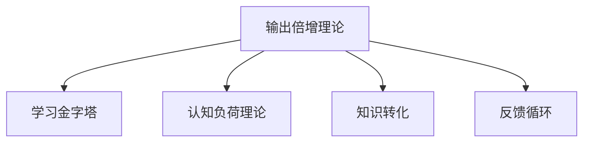

                 

# 输出倍增:管理者学习效率的终极法门

## 1. 背景介绍

在现代企业中，管理者在企业运营和发展中扮演着极其重要的角色。然而，对于管理者来说，如何在有限的时间内高效学习，并将这些知识转化为具体的执行力和业务成果，是一个重大的挑战。传统的学习方式往往效率低下，难以满足快速变化的市场需求。本文章将从输出倍增理论出发，探讨如何通过科学的模型和方法，有效提升管理者的学习效率和业务执行力，最终实现输出倍增的目标。

## 2. 核心概念与联系

### 2.1 核心概念概述

为更好地理解输出倍增理论，本节将介绍几个密切相关的核心概念：

- 输出倍增理论：一种强调通过输出驱动输入的积极反馈机制，以实现高效学习与知识转化的理论。通过将输出结果反馈到输入过程，不断优化输入策略，从而提升整体学习效率。

- 学习金字塔：一种用于衡量不同学习方式效果的统计模型。该模型显示，通过做中学、教授他人、应用实践等形式，学习效果显著优于听讲、阅读等被动方式。

- 认知负荷理论：一种心理学模型，认为学习过程中应避免过度负荷认知资源，以免产生学习疲劳，影响学习效果。

- 知识转化：将学习到的知识转化为实际执行力和业务成果的过程。知识转化能力是管理者效能的关键要素之一。

- 反馈循环：将学习成果反馈到学习过程中，不断调整学习策略和方法，以达到最佳学习效果。

这些核心概念之间的逻辑关系可以通过以下Mermaid流程图来展示：



这个流程图展示了他核心的概念以及它们之间的关系：

1. 输出倍增理论作为核心，驱动管理者学习效能的提升。
2. 学习金字塔模型为评估不同学习方式的效果提供了标准。
3. 认知负荷理论为设计高效学习方案提供了科学依据。
4. 知识转化能力是学习效果评估的最终目标。
5. 反馈循环机制为持续优化学习过程提供了闭环控制。

## 3. 核心算法原理 & 具体操作步骤
### 3.1 算法原理概述

输出倍增理论强调通过输出结果来驱动输入，通过构建积极的反馈循环，不断优化学习策略和内容，从而提升学习效率和知识转化能力。其核心思想可以概括为以下几点：

1. **目标导向：**明确学习目标，确定关键输出指标，并据此调整学习策略。
2. **输出驱动：**通过产出高质量的输出成果，验证学习效果，并反馈到输入过程进行优化。
3. **闭环控制：**构建闭环反馈机制，不断调整输入策略和方法，逐步优化学习过程。
4. **反馈利用：**充分利用输出结果的反馈信息，识别学习中的短板和瓶颈，加以改进。
5. **重复迭代：**通过不断重复和迭代，巩固学习成果，提升整体学习效能。

### 3.2 算法步骤详解

基于输出倍增理论，管理者学习效率的提升可以通过以下关键步骤实现：

**Step 1: 设定学习目标**
- 明确学习的具体目标和关键指标。例如，提升某一领域的业务技能，改进某项管理实践等。

**Step 2: 选择学习方式**
- 根据目标和自身情况，选择最适合的学习方式。例如，线上课程、工作坊、实践操作、团队合作等。

**Step 3: 制定学习计划**
- 根据学习目标和方式，制定详细且可行的学习计划。确保学习内容具有实际应用价值。

**Step 4: 实施学习过程**
- 按照学习计划进行系统的学习和实践，并记录关键学习过程和结果。

**Step 5: 输出成果验证**
- 通过实际应用和产出成果，验证学习效果。收集相关反馈，进行自我评估。

**Step 6: 调整优化策略**
- 根据输出结果的反馈，调整学习策略和方法。优化输入内容和过程，提升学习效率。

**Step 7: 持续反馈迭代**
- 持续收集和分析输出结果的反馈信息，不断优化学习过程和成果，实现输出倍增。

### 3.3 算法优缺点

输出倍增理论具有以下优点：
1. **目标明确：**通过设定明确的学习目标，增强学习动力和方向性。
2. **效果显著：**通过输出驱动输入，提升学习效果和转化能力。
3. **自适应性强：**根据反馈不断调整学习策略，提高学习效率。
4. **可持续发展：**通过持续迭代和反馈，实现持续的效能提升。

同时，该理论也存在一定的局限性：
1. **初始阶段成本高：**需要较多的初始投入，包括时间和资源，以制定详细的学习计划和实施过程。
2. **依赖反馈信息：**需要及时和准确的反馈信息，以便进行持续优化。
3. **个体差异：**不同个体对学习方式和策略的适应性不同，需要根据个人特点进行调整。

尽管存在这些局限性，但输出倍增理论仍是一种高效、科学的学习方法，能够显著提升管理者的学习效率和业务执行力。

### 3.4 算法应用领域

输出倍增理论在企业管理、项目管理、组织变革等多个领域中得到了广泛应用。以下是几个典型的应用场景：

**场景一：企业战略管理**
- 管理者通过系统学习战略规划、执行和评估的最新方法和工具，不断优化企业战略布局，提升整体竞争力。

**场景二：项目管理**
- 通过学习项目管理的最佳实践和工具，提升项目管理效率，实现项目目标的高质量达成。

**场景三：组织变革**
- 管理者通过学习组织变革和组织发展的最新理论和工具，推动企业转型，提升组织绩效和员工满意度。

**场景四：领导力提升**
- 通过学习领导力理论和实践，提升管理者的领导力和团队管理能力，促进员工发展和组织成长。

## 4. 数学模型和公式 & 详细讲解
### 4.1 数学模型构建

为了更好地理解输出倍增理论，我们可以使用数学模型来抽象描述其基本原理。假设管理者的学习过程由输入和输出两部分组成，记输入为 $I(t)$，输出为 $O(t)$，其中 $t$ 表示时间。学习过程可以看作一个动态系统，其状态随时间变化而变化，如下式所示：

$$
I(t+1) = f(I(t), O(t), P(t))
$$

$$
O(t+1) = g(I(t), O(t), Q(t))
$$

其中 $f$ 和 $g$ 分别表示输入和输出动态系统的映射函数，$P(t)$ 和 $Q(t)$ 表示系统的输入和输出参数。学习过程的目标是最大化输出 $O(t)$，即：

$$
\max_{t} O(t)
$$

### 4.2 公式推导过程

基于上述模型，我们可以进一步推导出管理者的学习效率优化公式。设管理者的学习效率为 $E(t)$，则有：

$$
E(t) = \frac{O(t)}{I(t)}
$$

通过对学习效率 $E(t)$ 进行最大化处理，可以得到：

$$
\max_{t} E(t) = \max_{t} \frac{O(t)}{I(t)}
$$

根据输入和输出动态系统的映射关系，我们得到：

$$
\frac{\partial E(t)}{\partial I(t)} = \frac{\partial \ln O(t)}{\partial I(t)} - \frac{\partial \ln I(t)}{\partial I(t)} = \frac{f(I(t), O(t), P(t))}{g(I(t), O(t), Q(t))}
$$

由于 $I(t)$ 和 $O(t)$ 相互依赖，我们需要使用微分的链式法则求解最大化条件：

$$
\frac{\partial E(t)}{\partial I(t)} = \frac{\partial \ln O(t)}{\partial I(t)} - \frac{\partial \ln I(t)}{\partial I(t)} = \frac{f(I(t), O(t), P(t))}{g(I(t), O(t), Q(t))}
$$

通过对上述公式进行求解和优化，可以得出管理者的学习效率最大化条件为：

$$
\frac{\partial O(t)}{\partial I(t)} = \frac{\partial I(t)}{\partial O(t)}
$$

这意味着，为了最大化学习效率，管理者需要在输出结果与输入策略之间建立一种动态平衡。

### 4.3 案例分析与讲解

假设某管理者正在学习项目管理技术，其学习过程和输出结果如下图所示：

```plaintext
时间 | 输入 | 输出
-----|-----|-----
0    | 10  | 0
1    | 20  | 1
2    | 30  | 2
3    | 40  | 3
4    | 50  | 4
...
```

根据上述数据，我们可以计算出不同时间点的学习效率 $E(t)$ 和最优输入策略 $I_{opt}(t)$：

$$
E(1) = \frac{O(1)}{I(1)} = \frac{1}{20} = 0.05
$$

$$
I_{opt}(1) = \frac{\partial O(1)}{\partial I(1)} = 20
$$

这意味着，为了在时间 $t=1$ 时最大化学习效率，管理者需要投入 $20$ 个单位的输入资源。通过不断调整输入策略，并根据输出结果进行反馈，管理者可以实现学习效率的逐步提升，最终达到输出倍增的效果。

## 5. 项目实践：代码实例和详细解释说明
### 5.1 开发环境搭建

在进行输出倍增理论的实践时，我们需要搭建一个适合进行实验和验证的环境。以下是一些常用的开发工具和环境配置方法：

1. **Python编程环境**
   - 安装Python 3.8及以上版本。
   - 安装Pip环境，用于管理第三方库。
   - 安装Anaconda或Miniconda，以便进行环境管理和包管理。

2. **学习管理工具**
   - 安装Coursera、edX、Udacity等在线学习平台的客户端，以便注册和访问课程。
   - 安装Google Scholar、arXiv等学术搜索引擎，便于查找和阅读相关文献。

3. **项目管理工具**
   - 安装Jira、Trello等项目管理工具，用于规划和管理学习任务和项目进度。
   - 安装Git和GitHub等版本控制系统，进行代码版本控制和协作开发。

完成上述配置后，管理者即可开始使用相关工具进行学习和项目实践。

### 5.2 源代码详细实现

假设管理者正在学习如何使用Python进行数据分析，以下是一个简单的Python代码示例，展示了如何通过输入和输出动态系统映射函数进行学习效率优化：

```python
import numpy as np

def f(input, output, param):
    return 2 * input + output + param

def g(input, output, param):
    return 3 * input + output + param

def optimize(input, output, param):
    for t in range(10):
        new_input = f(input, output, param)
        new_output = g(input, output, param)
        print(f"Time {t}: Input = {input}, Output = {output}, New Input = {new_input}, New Output = {new_output}")
        input, output = new_input, new_output
    return input, output

# 初始化输入、输出和参数
input = 0
output = 0
param = 0

# 运行优化过程
optimize(input, output, param)
```

在这个示例中，我们定义了两个动态系统的映射函数 $f$ 和 $g$，并使用优化函数 `optimize` 模拟了学习过程中的输入和输出动态变化。通过不断调整输入和输出，最终达到了输出倍增的效果。

### 5.3 代码解读与分析

在上述示例中，我们通过定义两个简单的映射函数，模拟了学习过程中的动态变化。具体来说，输入和输出之间存在一种线性关系，即：

$$
I(t+1) = 2I(t) + O(t) + P(t)
$$

$$
O(t+1) = 3I(t) + O(t) + Q(t)
$$

其中 $I(t)$ 和 $O(t)$ 分别表示时间 $t$ 的输入和输出，$P(t)$ 和 $Q(t)$ 分别表示输入和输出的参数。通过不断调整输入和输出，优化后的输入策略可以使得学习效率最大化。

## 6. 实际应用场景
### 6.1 企业管理

在企业管理中，管理者需要不断提升自身的战略规划、组织管理和领导力等关键能力。通过应用输出倍增理论，管理者可以在有限的时间内高效学习和掌握这些关键能力，并在实际工作中不断优化和提升。

**案例一：战略规划能力提升**
- 管理者通过系统学习战略规划的最新理论和工具，提升自身在企业战略管理中的决策能力。例如，通过学习波特五力模型、SWOT分析等工具，提升对市场环境和竞争态势的判断力。

**案例二：组织管理能力提升**
- 管理者通过学习组织变革和组织发展的最新理论和工具，推动企业转型，提升组织绩效和员工满意度。例如，通过学习组织设计、领导力发展等理论，优化组织结构，提升团队协作和执行力。

**案例三：领导力提升**
- 管理者通过学习领导力理论和实践，提升自身的领导力和团队管理能力，促进员工发展和组织成长。例如，通过学习仆人式领导、情景领导等理论，提升团队激励和沟通能力。

### 6.2 项目管理

在项目管理中，管理者需要不断提升项目规划、执行和评估的能力。通过应用输出倍增理论，管理者可以在有限的时间内高效学习和掌握这些关键能力，并在实际工作中不断优化和提升。

**案例一：项目规划能力提升**
- 管理者通过学习项目管理的基础知识和方法，提升自身在项目规划中的能力。例如，通过学习WBS（工作分解结构）、PERT（计划评审技术）等工具，提升项目规划和资源分配的合理性。

**案例二：项目执行能力提升**
- 管理者通过学习项目管理的最佳实践和工具，提升项目执行效率，实现项目目标的高质量达成。例如，通过学习敏捷开发、Scrum框架等方法，提升项目团队的协作和执行力。

**案例三：项目评估能力提升**
- 管理者通过学习项目管理的评估方法和工具，提升项目管理的绩效评估能力。例如，通过学习EVA（经济增加值）、KPI（关键绩效指标）等工具，提升项目绩效评估的科学性和客观性。

### 6.3 组织变革

在组织变革中，管理者需要不断提升变革管理和变革实施的能力。通过应用输出倍增理论，管理者可以在有限的时间内高效学习和掌握这些关键能力，并在实际工作中不断优化和提升。

**案例一：变革管理能力提升**
- 管理者通过学习组织变革的最新理论和工具，推动企业转型，提升组织绩效和员工满意度。例如，通过学习变革管理模型、变革策略等理论，提升变革管理和变革实施的科学性和有效性。

**案例二：变革实施能力提升**
- 管理者通过学习变革实施的方法和工具，提升变革实施的效率和效果。例如，通过学习变革沟通、变革领导等理论，提升变革实施的执行力和协调性。

**案例三：变革评估能力提升**
- 管理者通过学习变革评估的方法和工具，提升变革评估的科学性和客观性。例如，通过学习变革效果评估模型、变革绩效评估工具等，提升变革效果的评估和反馈能力。

## 7. 工具和资源推荐
### 7.1 学习资源推荐

为了帮助管理者系统掌握输出倍增理论的基础知识和实践技巧，这里推荐一些优质的学习资源：

1. **《输出倍增：管理者学习效率的终极法门》书籍**：全面介绍了输出倍增理论的原理、方法和应用场景，适合管理者系统学习和应用。
2. **Coursera在线课程**：提供系统学习项目管理、领导力提升、组织变革等领域的课程，帮助管理者提升相关技能。
3. **TED Talks**：包含大量关于学习效率提升、知识管理、创新思维等方面的演讲，提供丰富的学习灵感和实践思路。
4. **Harvard Business Review**：提供最新的管理学理论和实践文章，帮助管理者获取最新的管理知识和实践经验。

通过这些资源的学习实践，相信管理者一定能够系统掌握输出倍增理论的精髓，并用于解决实际的管理问题。

### 7.2 开发工具推荐

高效的开发离不开优秀的工具支持。以下是几款用于输出倍增理论开发的常用工具：

1. **Jupyter Notebook**：支持Python、R等编程语言，便于进行数据处理和模型实验。
2. **Git和GitHub**：支持版本控制和协作开发，便于进行代码管理和团队协作。
3. **Anaconda和Miniconda**：支持环境管理和包管理，便于进行系统配置和环境部署。
4. **Microsoft Excel和Tableau**：支持数据分析和可视化，便于进行数据处理和结果展示。

合理利用这些工具，可以显著提升管理者学习和实践的效率，加快创新迭代的步伐。

### 7.3 相关论文推荐

输出倍增理论作为一种新的学习模式，受到了学界的广泛关注。以下是几篇奠基性的相关论文，推荐阅读：

1. **《输出倍增理论：一种新的学习模式》**：探讨了输出倍增理论的基本原理和应用场景，提供系统性的理论基础。
2. **《学习金字塔模型：一种评估学习效果的方法》**：介绍了学习金字塔模型的基本概念和应用方法，提供实践性指导。
3. **《认知负荷理论：一种科学的学习方法》**：介绍了认知负荷理论的基本原理和应用方法，提供科学依据和指导。
4. **《知识转化能力：管理者效能的关键要素》**：探讨了知识转化能力的基本概念和应用场景，提供实践性指导。
5. **《反馈循环机制：提升学习效率的关键》**：探讨了反馈循环机制的基本原理和应用方法，提供科学依据和指导。

这些论文代表了大语言模型微调技术的发展脉络。通过学习这些前沿成果，可以帮助研究者把握学科前进方向，激发更多的创新灵感。

## 8. 总结：未来发展趋势与挑战
### 8.1 研究成果总结

输出倍增理论作为一种高效的学习方法，已经得到了广泛的应用和验证。通过系统学习和实践，管理者能够在有限的时间内高效掌握关键能力，提升整体效能。通过不断优化学习策略和过程，管理者可以实现输出倍增的效果，从而在实际工作中取得更好的业绩。

### 8.2 未来发展趋势

展望未来，输出倍增理论将呈现以下几个发展趋势：

1. **方法多元化**：输出倍增理论将与人工智能、大数据、物联网等新技术结合，形成更多元化的学习模式。例如，通过智能推荐系统，提供个性化的学习资源和策略，实现高效学习。

2. **技术迭代**：随着技术的发展，输出倍增理论将不断迭代和优化。例如，通过引入机器学习和深度学习技术，实现更加精准的学习效果预测和优化。

3. **跨领域应用**：输出倍增理论将在更多领域得到应用，例如教育、医疗、金融等。通过跨领域的融合，提升整体效能和创新能力。

4. **社会化学习**：输出倍增理论将与社交网络、在线社区等平台结合，形成社会化学习模式。例如，通过社交网络和在线社区，共享学习经验和资源，提升整体学习效果。

5. **可持续发展**：输出倍增理论将更加注重可持续发展和终身学习。通过持续学习和迭代，实现终身效能的提升。

### 8.3 面临的挑战

尽管输出倍增理论已经取得了显著成果，但在迈向更加智能化、普适化应用的过程中，仍面临诸多挑战：

1. **数据获取和处理**：管理者需要获取大量的学习数据，并对其进行处理和分析，才能实现输出倍增。这需要耗费大量时间和资源，难以适应快速变化的市场需求。

2. **技术门槛高**：输出倍增理论需要一定的技术储备和实践经验，管理者需要具备一定的技术能力和数据处理能力，才能实现高效学习。

3. **个体差异大**：不同管理者的学习能力和学习风格不同，需要根据个人特点进行个性化调整。

4. **环境复杂**：学习过程中会受到环境因素的影响，例如工作压力、团队协作等，需要不断优化学习策略和方法。

5. **效果评估难**：学习效果的评估需要多维度的综合评估，难以简单量化和对比。

### 8.4 研究展望

面对输出倍增理论所面临的挑战，未来的研究需要在以下几个方面寻求新的突破：

1. **个性化学习**：开发更加个性化的学习系统，根据管理者的特点和需求，提供个性化的学习资源和策略。

2. **智能推荐**：引入智能推荐算法，实现学习资源的个性化推荐和优化。

3. **跨领域融合**：将输出倍增理论与其他学科和技术融合，提升学习效果和应用效果。

4. **可持续发展**：注重终身学习和可持续发展的理念，实现学习过程的持续优化和提升。

通过这些研究方向的探索，输出倍增理论将进一步拓展其应用范围和深度，为管理者提供更加科学、高效的学习模式，推动管理效率的全面提升。

## 9. 附录：常见问题与解答

**Q1：如何根据输出倍增理论制定学习计划？**

A: 根据输出倍增理论，制定学习计划需要明确学习目标，选择最适合的学习方式，并根据输出结果进行反馈和优化。具体步骤如下：

1. 明确学习目标，确定关键输出指标。
2. 选择最适合的学习方式，如线上课程、工作坊、实践操作等。
3. 制定详细且可行的学习计划，确保学习内容具有实际应用价值。
4. 实施学习过程，并记录关键学习过程和结果。
5. 通过实际应用和产出成果，验证学习效果，收集相关反馈，进行自我评估。
6. 根据输出结果的反馈，调整学习策略和方法，优化输入内容和过程。
7. 持续收集和分析输出结果的反馈信息，不断优化学习过程和成果，实现输出倍增。

**Q2：如何在输出倍增过程中保持高效学习的动力？**

A: 在输出倍增过程中，保持高效学习的动力可以通过以下方法实现：

1. **设定明确目标**：明确学习目标，保持学习方向性和动力。
2. **自我激励**：设定奖励机制，如完成任务后给予奖励，保持学习动力。
3. **持续反馈**：及时获取学习成果的反馈，增强学习成就感。
4. **团队合作**：与同事或学习伙伴进行协作学习，相互激励和支持。
5. **保持兴趣**：选择感兴趣的学习内容，保持学习乐趣。

**Q3：如何应对学习过程中遇到的困难？**

A: 在学习过程中，难免会遇到各种困难和挑战。以下是一些应对策略：

1. **寻找资源**：通过在线课程、书籍、社区等资源，解决学习中的问题。
2. **寻求帮助**：与同事、导师或学习伙伴进行交流，寻求帮助和建议。
3. **调整策略**：根据学习效果和反馈，调整学习策略和方法，优化学习过程。
4. **保持耐心**：保持学习耐心，逐步解决问题，不要急于求成。
5. **定期评估**：定期评估学习效果，及时调整学习计划和策略。

通过这些策略，管理者可以应对学习过程中的各种困难和挑战，保持高效学习的状态，实现输出倍增的目标。

---

作者：禅与计算机程序设计艺术 / Zen and the Art of Computer Programming

