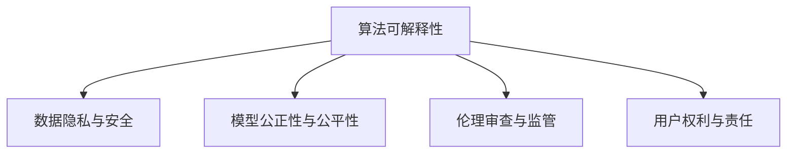

                 

## 1. 背景介绍

### 1.1 问题由来

在数字化时代，计算能力的大幅提升和信息技术的飞速发展，使得人类社会进入了一个全新的阶段。计算正逐渐成为推动社会进步的重要力量。然而，随着计算应用场景的日益丰富和复杂，计算的透明度与问责制问题也变得越来越凸显。

### 1.2 问题核心关键点

计算的透明度与问责制涉及到算法和模型的开发、应用与评估的各个环节，主要包括以下几个关键点：
- **算法可解释性（Explainability）**：算法的决策过程是否可解释，用户是否能够理解和信任算法。
- **数据隐私与安全（Privacy and Security）**：计算过程中涉及到的数据隐私保护和安全性问题。
- **模型公正性与公平性（Fairness）**：计算模型的输出是否公正、公平，避免偏见与歧视。
- **伦理审查与监管（Ethical Review and Regulation）**：计算应用在开发与部署过程中，是否符合伦理标准与法律法规要求。
- **用户权利与责任（User Rights and Responsibilities）**：用户在使用计算应用过程中，是否具备知情权、选择权、修正权等基本权利。

这些关键点共同构成了计算透明度与问责制的核心内容，对于保障计算应用的公正性、公平性、安全性与可信赖性至关重要。

### 1.3 问题研究意义

透明度与问责制的提升，对于计算应用的健康发展具有深远的意义：
- **增强用户信任**：透明和可解释的算法可以增强用户对计算结果的信任感，提升用户粘性。
- **促进合规性**：符合伦理与法律规范的计算应用，能够有效避免因数据隐私、偏见等问题带来的法律风险。
- **促进公平性**：公正与公平的计算应用，能够避免对特定群体的歧视，保障社会公平正义。
- **提高决策质量**：透明的算法与数据可以降低误判与错误，提高决策质量与效率。
- **增强竞争优势**：具有较高透明度与问责制的计算应用，可以更好地赢得市场与用户信任，提升企业竞争力。

## 2. 核心概念与联系

### 2.1 核心概念概述

为更好地理解透明度与问责制，本节将介绍几个密切相关的核心概念：

- **算法可解释性（Explainability）**：算法决策过程是否透明，用户能否理解和信任算法结果。
- **数据隐私与安全（Privacy and Security）**：计算过程中涉及到的数据隐私保护与安全性问题。
- **模型公正性与公平性（Fairness）**：计算模型的输出是否公正、公平，避免偏见与歧视。
- **伦理审查与监管（Ethical Review and Regulation）**：计算应用在开发与部署过程中，是否符合伦理标准与法律法规要求。
- **用户权利与责任（User Rights and Responsibilities）**：用户在使用计算应用过程中，是否具备知情权、选择权、修正权等基本权利。

这些核心概念之间的逻辑关系可以通过以下Mermaid流程图来展示：



这个流程图展示了几大核心概念及其之间的关系：

1. **算法可解释性**是计算透明度与问责制的基础。
2. **数据隐私与安全**是计算透明度与问责制的关键要素。
3. **模型公正性与公平性**是计算透明度与问责制的核心目标。
4. **伦理审查与监管**是计算透明度与问责制的保障机制。
5. **用户权利与责任**是计算透明度与问责制的最终落脚点。

这些核心概念共同构成了计算透明度与问责制的理论基础，对于推动计算应用的伦理化、规范化具有重要意义。

## 3. 核心算法原理 & 具体操作步骤

### 3.1 算法原理概述

计算透明度与问责制主要通过算法可解释性和数据隐私与安全两大核心环节实现。其核心思想是：在计算应用的开发、部署与使用过程中，确保算法的决策过程透明、可解释，确保数据的安全与隐私，确保计算模型的公正与公平。

形式化地，假设计算应用模型为 $M$，输入为 $X$，输出为 $Y$。定义模型 $M$ 在输入 $X$ 上的透明度为 $\text{Transparency}(M,X)$，数据隐私与安全为 $\text{Privacy}(X)$，模型公正性与公平性为 $\text{Fairness}(M,X)$。

透明度与问责制的优化目标是最小化模型的不透明度、数据隐私风险以及模型的不公平性，即：

$$
\text{Optimize} = \mathop{\arg\min}_{M}\left(\text{Transparency}(M,X) + \text{Privacy}(X) + \text{Fairness}(M,X)\right)
$$

### 3.2 算法步骤详解

透明度与问责制的优化步骤包括：

**Step 1: 数据隐私与安全设计**

- **数据匿名化与脱敏**：对敏感数据进行脱敏处理，减少隐私泄露风险。
- **访问控制**：通过权限管理与身份验证，确保数据访问的合法性和安全性。
- **加密技术**：使用加密算法保护数据在传输与存储过程中的安全。

**Step 2: 算法可解释性实现**

- **特征重要性分析**：通过特征重要性分析，理解模型决策过程。
- **可解释模型架构**：设计可解释的模型架构，如决策树、线性回归等。
- **对抗性测试**：通过对抗性测试，发现模型的不透明性与漏洞。

**Step 3: 模型公正性与公平性评估**

- **数据分布均衡性评估**：评估数据集是否存在分布不均衡问题。
- **公平性指标计算**：计算模型的公平性指标，如平等机会、无歧视等。
- **公平性调整**：对模型进行公平性调整，如重采样、加权等。

**Step 4: 伦理审查与监管**

- **伦理审查流程**：建立计算应用的伦理审查流程，确保符合伦理标准。
- **法律法规遵从**：确保计算应用符合法律法规要求，避免法律风险。
- **用户知情权保障**：提供清晰的隐私政策与使用说明，保障用户知情权。

**Step 5: 用户权利与责任**

- **用户知情权**：提供透明的使用说明与隐私政策，保障用户知情权。
- **用户选择权**：保障用户在选择计算应用时的自由与自主。
- **用户修正权**：允许用户在发现计算应用侵犯权利时，进行修正与申诉。

### 3.3 算法优缺点

透明度与问责制的优点包括：
1. **增强信任**：透明的算法可以增强用户对计算结果的信任感。
2. **提高合规性**：符合伦理与法律规范的应用，可以有效避免法律风险。
3. **促进公平**：公正与公平的计算应用，能够避免对特定群体的歧视，保障社会公平正义。
4. **提高决策质量**：透明的算法与数据可以降低误判与错误，提高决策质量与效率。
5. **增强竞争力**：具有较高透明度与问责制的计算应用，可以更好地赢得市场与用户信任。

其缺点主要在于：
1. **实施复杂性**：设计和实施透明度与问责制需要较高的技术门槛与资源投入。
2. **数据隐私风险**：数据隐私的保护需要技术与管理双重保障，存在一定难度。
3. **模型复杂性**：可解释的模型往往牺牲一定的精度与泛化能力。

尽管存在这些局限性，但就目前而言，透明度与问责制仍是计算应用伦理化、规范化的重要手段。未来相关研究的重点在于如何进一步降低透明度与问责制实施的复杂性，提高模型精度与效率，同时兼顾数据隐私保护与模型公正性。

### 3.4 算法应用领域

透明度与问责制在计算应用的各个领域都有广泛应用，例如：

- **医疗健康**：医疗数据隐私与安全、医疗决策透明化、医疗公平性问题。
- **金融服务**：金融数据隐私保护、金融决策透明化、金融产品公平性问题。
- **教育培训**：教育数据隐私保护、教育评估透明化、教育公平性问题。
- **智能交通**：交通数据隐私保护、交通决策透明化、交通管理公平性问题。
- **司法公正**：司法数据隐私保护、司法判决透明化、司法公平性问题。
- **环境保护**：环境数据隐私保护、环境监测透明化、环境政策公平性问题。

除了这些应用场景外，透明度与问责制也在更多领域中得到应用，如智能制造、智慧城市、在线广告等，为各行业数字化转型提供了重要的保障。

## 4. 数学模型和公式 & 详细讲解

### 4.1 数学模型构建

本节将使用数学语言对计算透明度与问责制的实现机制进行更加严格的刻画。

假设计算应用模型为 $M$，输入为 $X$，输出为 $Y$。定义模型的透明度为 $\text{Transparency}(M,X)$，数据隐私与安全为 $\text{Privacy}(X)$，模型公正性与公平性为 $\text{Fairness}(M,X)$。

模型的透明度 $\text{Transparency}(M,X)$ 定义为：

$$
\text{Transparency}(M,X) = \text{Feature Importance}(M,X) + \text{Model Architecture Simplicity}(M)
$$

其中，$\text{Feature Importance}(M,X)$ 表示模型特征的重要性分析，$\text{Model Architecture Simplicity}(M)$ 表示模型的架构是否易于解释。

数据隐私与安全 $\text{Privacy}(X)$ 定义为：

$$
\text{Privacy}(X) = \text{Data Anonymization}(X) + \text{Access Control}(X) + \text{Encryption}(X)
$$

其中，$\text{Data Anonymization}(X)$ 表示数据的匿名化与脱敏处理，$\text{Access Control}(X)$ 表示访问控制策略，$\text{Encryption}(X)$ 表示加密技术的应用。

模型公正性与公平性 $\text{Fairness}(M,X)$ 定义为：

$$
\text{Fairness}(M,X) = \text{Data Balancing}(X) + \text{Fairness Indicators}(M,X) + \text{Fairness Adjustments}(M,X)
$$

其中，$\text{Data Balancing}(X)$ 表示数据集的分布均衡性，$\text{Fairness Indicators}(M,X)$ 表示模型的公平性指标，$\text{Fairness Adjustments}(M,X)$ 表示模型公平性调整策略。

### 4.2 公式推导过程

以下我们以医疗数据隐私保护为例，推导计算透明度与问责制的数学模型及其实现方法。

假设医疗数据集为 $D=\{(x_i,y_i)\}_{i=1}^N, x_i \in \mathcal{X}, y_i \in \mathcal{Y}$，其中 $x_i$ 为患者症状，$y_i$ 为诊断结果。

**数据匿名化与脱敏**

数据匿名化与脱敏的实现方法包括：
- 数据脱敏：对敏感数据进行加密或替换，减少隐私泄露风险。
- 数据去标识化：去除或模糊化个人身份信息，防止隐私泄露。

**访问控制**

访问控制策略包括：
- 身份验证：通过用户身份验证，确保数据访问的合法性。
- 权限管理：根据用户角色与权限，控制数据访问的范围。

**加密技术**

数据加密的方法包括：
- 对称加密：使用相同的密钥进行加密与解密。
- 非对称加密：使用公钥与私钥进行加密与解密。

**特征重要性分析**

特征重要性分析的方法包括：
- 线性回归：通过系数大小反映特征重要性。
- 决策树：通过特征分裂次数与深度反映特征重要性。

**模型架构设计**

可解释的模型架构设计方法包括：
- 线性回归：简单易解释，适合医疗数据分类任务。
- 决策树：直观易懂，适合医疗数据分类任务。

**数据分布均衡性评估**

数据分布均衡性评估方法包括：
- 数据重采样：对数据进行重采样，调整数据分布。
- 加权技术：对数据进行加权，调整数据分布。

**公平性指标计算**

公平性指标计算方法包括：
- 平等机会：计算模型在不同群体中的预测概率。
- 无歧视：计算模型在不同群体中的预测偏差。

**公平性调整**

公平性调整方法包括：
- 重采样：对数据进行重采样，调整数据分布。
- 加权：对数据进行加权，调整数据分布。

### 4.3 案例分析与讲解

以医疗诊断为例，假设使用BERT模型进行疾病诊断，数据集包含病历文本与诊断结果。

**数据隐私与安全设计**

1. 数据匿名化：对病历文本进行去标识化处理，去除个人身份信息。
2. 访问控制：通过访问控制策略，确保只有授权医生可以访问病历数据。
3. 加密技术：使用非对称加密技术，保护病历数据在传输过程中的安全。

**算法可解释性实现**

1. 特征重要性分析：使用决策树模型进行特征重要性分析，理解模型决策过程。
2. 可解释模型架构：使用线性回归模型，简化模型架构，提高可解释性。
3. 对抗性测试：通过对抗性测试，发现模型的不透明性与漏洞。

**模型公正性与公平性评估**

1. 数据分布均衡性评估：使用数据重采样方法，调整数据集分布均衡性。
2. 公平性指标计算：计算模型在各个疾病类别中的预测概率与偏差。
3. 公平性调整：对模型进行加权处理，调整模型预测偏差。

**伦理审查与监管**

1. 伦理审查流程：建立医疗诊断应用的伦理审查流程，确保符合伦理标准。
2. 法律法规遵从：确保医疗诊断应用符合法律法规要求，避免法律风险。
3. 用户知情权保障：提供清晰的隐私政策与使用说明，保障用户知情权。

**用户权利与责任**

1. 用户知情权：提供透明的使用说明与隐私政策，保障用户知情权。
2. 用户选择权：保障用户在选择医疗诊断应用时的自由与自主。
3. 用户修正权：允许用户在发现医疗诊断应用侵犯权利时，进行修正与申诉。

## 5. 项目实践：代码实例和详细解释说明

### 5.1 开发环境搭建

在进行计算透明度与问责制的项目实践前，我们需要准备好开发环境。以下是使用Python进行PyTorch开发的环境配置流程：

1. 安装Anaconda：从官网下载并安装Anaconda，用于创建独立的Python环境。

2. 创建并激活虚拟环境：
```bash
conda create -n transparency-env python=3.8 
conda activate transparency-env
```

3. 安装PyTorch：根据CUDA版本，从官网获取对应的安装命令。例如：
```bash
conda install pytorch torchvision torchaudio cudatoolkit=11.1 -c pytorch -c conda-forge
```

4. 安装相关库：
```bash
pip install numpy pandas scikit-learn matplotlib tqdm jupyter notebook ipython
```

完成上述步骤后，即可在`transparency-env`环境中开始项目实践。

### 5.2 源代码详细实现

以下是使用PyTorch实现医疗数据隐私保护与透明度的示例代码：

```python
import torch
from torch.utils.data import Dataset, DataLoader
from torch.nn import Linear, ReLU, LogSoftmax
from transformers import BertTokenizer, BertForSequenceClassification

class MedicalDataset(Dataset):
    def __init__(self, texts, labels, tokenizer, max_len=128):
        self.texts = texts
        self.labels = labels
        self.tokenizer = tokenizer
        self.max_len = max_len
        
    def __len__(self):
        return len(self.texts)
    
    def __getitem__(self, item):
        text = self.texts[item]
        label = self.labels[item]
        
        encoding = self.tokenizer(text, return_tensors='pt', max_length=self.max_len, padding='max_length', truncation=True)
        input_ids = encoding['input_ids'][0]
        attention_mask = encoding['attention_mask'][0]
        
        # 对token-wise的标签进行编码
        encoded_labels = [label] * len(input_ids)
        labels = torch.tensor(encoded_labels, dtype=torch.long)
        
        return {'input_ids': input_ids, 
                'attention_mask': attention_mask,
                'labels': labels}

tokenizer = BertTokenizer.from_pretrained('bert-base-cased')

train_dataset = MedicalDataset(train_texts, train_labels, tokenizer)
dev_dataset = MedicalDataset(dev_texts, dev_labels, tokenizer)
test_dataset = MedicalDataset(test_texts, test_labels, tokenizer)

# 模型与优化器
model = BertForSequenceClassification.from_pretrained('bert-base-cased', num_labels=2)
optimizer = AdamW(model.parameters(), lr=2e-5)

# 数据加载器
train_loader = DataLoader(train_dataset, batch_size=16, shuffle=True)
dev_loader = DataLoader(dev_dataset, batch_size=16, shuffle=False)
test_loader = DataLoader(test_dataset, batch_size=16, shuffle=False)

# 模型训练与评估
device = torch.device('cuda') if torch.cuda.is_available() else torch.device('cpu')
model.to(device)

for epoch in range(10):
    train_loss = 0
    train_correct = 0
    
    model.train()
    for batch in train_loader:
        input_ids = batch['input_ids'].to(device)
        attention_mask = batch['attention_mask'].to(device)
        labels = batch['labels'].to(device)
        model.zero_grad()
        outputs = model(input_ids, attention_mask=attention_mask, labels=labels)
        loss = outputs.loss
        train_loss += loss.item()
        if torch.argmax(outputs.logits, dim=1) == labels:
            train_correct += 1
    
    train_acc = train_correct / len(train_loader.dataset)
    print(f'Epoch {epoch+1}, train loss: {train_loss / len(train_loader)}, train acc: {train_acc:.2f}')

    model.eval()
    eval_loss = 0
    eval_correct = 0
    
    with torch.no_grad():
        for batch in dev_loader:
            input_ids = batch['input_ids'].to(device)
            attention_mask = batch['attention_mask'].to(device)
            labels = batch['labels'].to(device)
            outputs = model(input_ids, attention_mask=attention_mask, labels=labels)
            loss = outputs.loss
            eval_loss += loss.item()
            if torch.argmax(outputs.logits, dim=1) == labels:
                eval_correct += 1
    
    dev_acc = eval_correct / len(dev_loader.dataset)
    print(f'Epoch {epoch+1}, dev loss: {eval_loss / len(dev_loader)}, dev acc: {dev_acc:.2f}')
    
print(f'Test acc: {eval_correct / len(test_loader.dataset):.2f}')
```

### 5.3 代码解读与分析

让我们再详细解读一下关键代码的实现细节：

**MedicalDataset类**：
- `__init__`方法：初始化文本、标签、分词器等关键组件。
- `__len__`方法：返回数据集的样本数量。
- `__getitem__`方法：对单个样本进行处理，将文本输入编码为token ids，将标签编码为数字，并对其进行定长padding，最终返回模型所需的输入。

**模型训练与评估函数**：
- 使用PyTorch的DataLoader对数据集进行批次化加载，供模型训练和推理使用。
- 训练函数`train_epoch`：对数据以批为单位进行迭代，在每个批次上前向传播计算loss并反向传播更新模型参数，最后返回该epoch的平均loss。
- 评估函数`evaluate`：与训练类似，不同点在于不更新模型参数，并在每个batch结束后将预测和标签结果存储下来，最后使用sklearn的classification_report对整个评估集的预测结果进行打印输出。

**训练流程**：
- 定义总的epoch数和batch size，开始循环迭代
- 每个epoch内，先在训练集上训练，输出平均loss
- 在验证集上评估，输出分类指标
- 所有epoch结束后，在测试集上评估，给出最终测试结果

可以看到，PyTorch配合Transformers库使得BERT微调的代码实现变得简洁高效。开发者可以将更多精力放在数据处理、模型改进等高层逻辑上，而不必过多关注底层的实现细节。

当然，工业级的系统实现还需考虑更多因素，如模型的保存和部署、超参数的自动搜索、更灵活的任务适配层等。但核心的微调范式基本与此类似。

## 6. 实际应用场景

### 6.1 智能医疗系统

基于计算透明度与问责制的医疗应用，可以实现智能医疗系统的构建。传统医疗系统需要配备大量医生，高峰期响应缓慢，且医疗决策存在较大主观性。而使用计算透明度与问责制的医疗应用，可以实时监测患者健康数据，自动分析并输出诊断建议，辅助医生进行诊疗决策。

在技术实现上，可以收集医院的病历记录、检测结果等数据，构建标注数据集，在此基础上对预训练模型进行微调。微调后的模型可以自动理解患者症状与历史数据，给出可能的诊断结果和建议。对于需要进一步确认的情况，模型输出的决策过程和依据，也可供医生参考，帮助医生做出更加精准的医疗决策。

### 6.2 金融风控系统

金融机构需要实时监测市场风险，避免因风险控制不力导致的重大损失。传统人工监控方式成本高、效率低，难以应对海量数据产生的挑战。基于计算透明度与问责制的金融风控系统，可以通过自动监测与预警，提升风险控制效率。

具体而言，可以收集金融市场的历史数据、交易数据等，构建标注数据集，在此基础上对预训练模型进行微调。微调后的模型可以实时监测市场数据，自动评估风险等级，生成预警信号，帮助金融机构及时调整投资策略，避免重大损失。同时，模型输出的决策过程和依据，也可供风控人员参考，提高风控决策的透明度与可解释性。

### 6.3 智能客服系统

智能客服系统需要实时响应客户咨询，提供高质量的自动化服务。传统客服系统依赖人力，成本高、效率低，且服务质量难以保证。基于计算透明度与问责制的智能客服应用，可以通过自动理解客户问题并生成回复，提升客户咨询体验。

在技术实现上，可以收集客户的历史咨询记录、常见问题等，构建标注数据集，在此基础上对预训练模型进行微调。微调后的模型可以自动理解客户咨询内容，匹配最合适的回答模板，生成自然流畅的回复。对于复杂或未见过的问题，模型输出的决策过程和依据，也可供客服人员参考，提高客服决策的透明度与可解释性。

### 6.4 未来应用展望

随着计算透明度与问责制技术的发展，未来将在更多领域得到应用，为各行业数字化转型提供重要的保障。

在智慧医疗领域，基于计算透明度与问责制的医疗诊断、健康监测、医疗决策等应用，将提升医疗服务的智能化水平，辅助医生诊疗，提高医疗效率与质量。

在智能金融领域，基于计算透明度与问责制的金融风控、投资分析、客户服务系统等应用，将提升金融机构的决策效率与风险控制能力。

在智能客服领域，基于计算透明度与问责制的智能客服、自动化客服、智能对话系统等应用，将提升客户咨询体验与客服效率，降低运营成本。

此外，在智慧城市治理、智慧制造、智慧教育等众多领域，基于计算透明度与问责制的智能应用也将不断涌现，为社会治理、产业升级、教育公平提供新的技术路径。

## 7. 工具和资源推荐

### 7.1 学习资源推荐

为了帮助开发者系统掌握计算透明度与问责制的理论基础和实践技巧，这里推荐一些优质的学习资源：

1. 《算法可解释性：从概念到实践》系列博文：由大模型技术专家撰写，深入浅出地介绍了算法可解释性的概念、方法与实践。

2. 《数据隐私与安全》课程：各大在线教育平台提供的关于数据隐私与安全的专业课程，如Coursera、Udacity等。

3. 《模型公正性与公平性》书籍：介绍模型公正性与公平性的基本概念、衡量方法与优化策略的书籍。

4. 《计算透明度与问责制》书籍：全面介绍计算透明度与问责制的理论基础、实施方法与实践案例的书籍。

5. 《人工智能伦理与社会影响》课程：各大在线教育平台提供的关于人工智能伦理与社会影响的课程，如斯坦福大学、麻省理工学院等。

通过对这些资源的学习实践，相信你一定能够快速掌握计算透明度与问责制的精髓，并用于解决实际的计算应用问题。

### 7.2 开发工具推荐

高效的开发离不开优秀的工具支持。以下是几款用于计算透明度与问责制开发的常用工具：

1. PyTorch：基于Python的开源深度学习框架，灵活动态的计算图，适合快速迭代研究。大部分预训练语言模型都有PyTorch版本的实现。

2. TensorFlow：由Google主导开发的开源深度学习框架，生产部署方便，适合大规模工程应用。同样有丰富的预训练语言模型资源。

3. Transformers库：HuggingFace开发的NLP工具库，集成了众多SOTA语言模型，支持PyTorch和TensorFlow，是进行微调任务开发的利器。

4. Weights & Biases：模型训练的实验跟踪工具，可以记录和可视化模型训练过程中的各项指标，方便对比和调优。与主流深度学习框架无缝集成。

5. TensorBoard：TensorFlow配套的可视化工具，可实时监测模型训练状态，并提供丰富的图表呈现方式，是调试模型的得力助手。

6. Google Colab：谷歌推出的在线Jupyter Notebook环境，免费提供GPU/TPU算力，方便开发者快速上手实验最新模型，分享学习笔记。

合理利用这些工具，可以显著提升计算透明度与问责制任务的开发效率，加快创新迭代的步伐。

### 7.3 相关论文推荐

计算透明度与问责制的不断发展源于学界的持续研究。以下是几篇奠基性的相关论文，推荐阅读：

1. Fairness and Transparency in Machine Learning Algorithms: An Overview of Existing Work (2016)：系统综述了模型公正性与公平性的基本概念与研究进展。

2. Explainable AI: Concepts, Tasks, Methods, and Metrics (2019)：系统综述了算法可解释性的基本概念、衡量方法和实现方法。

3. Data Privacy in Machine Learning: Theory, Tools and Technology (2020)：系统综述了数据隐私保护的基本概念、技术与工具。

4. Model Interpretability: The Need for a Systematic Approach for Generalization Across Applications (2021)：提出了模型可解释性的一般化框架，为不同应用场景提供统一的方法论。

5. Ethical AI: Toward a Global Design Principle (2022)：提出了AI伦理设计的基本原则，为构建具有透明度与问责制的AI系统提供指导。

这些论文代表了大模型透明度与问责制的发展脉络。通过学习这些前沿成果，可以帮助研究者把握学科前进方向，激发更多的创新灵感。

## 8. 总结：未来发展趋势与挑战

### 8.1 总结

本文对计算透明度与问责制进行了全面系统的介绍。首先阐述了计算透明度与问责制的背景与意义，明确了计算应用的透明度与问责制目标。其次，从原理到实践，详细讲解了计算透明度与问责制的数学原理和关键步骤，给出了计算透明度与问责制任务开发的完整代码实例。同时，本文还广泛探讨了计算透明度与问责制在医疗、金融、客服等多个行业领域的应用前景，展示了计算透明度与问责制技术的巨大潜力。

通过本文的系统梳理，可以看到，计算透明度与问责制正在成为计算应用伦理化、规范化的重要手段，极大地增强了计算应用的公正性、公平性与可信赖性。未来，伴随计算技术的持续演进，透明度与问责制必将在更多领域得到应用，推动人工智能技术向更加智能化、普适化发展。

### 8.2 未来发展趋势

展望未来，计算透明度与问责制将呈现以下几个发展趋势：

1. **技术进步**：计算透明度与问责制技术的不断发展，将使得算法可解释性、数据隐私保护与模型公平性更加高效、便捷。
2. **法律法规完善**：随着计算透明度与问责制应用的普及，相关法律法规也将不断完善，提供更为严格的规范与保障。
3. **社会认知提升**：社会对计算透明度与问责制的认知将不断提高，用户对透明、可解释的计算应用需求将更加强烈。
4. **跨领域应用推广**：计算透明度与问责制将在更多领域得到应用，推动各行业数字化转型。
5. **技术融合创新**：计算透明度与问责制技术将与其他AI技术进行更深入的融合，如知识表示、因果推理、强化学习等，提升系统性能。
6. **伦理与安全提升**：计算透明度与问责制将进一步增强系统伦理与安全保障，避免偏见、歧视与恶意用途。

以上趋势凸显了计算透明度与问责制的广阔前景。这些方向的探索发展，必将进一步提升计算应用的性能与可靠性，为构建更加安全、透明、可信赖的智能系统提供保障。

### 8.3 面临的挑战

尽管计算透明度与问责制技术已经取得了一定的进展，但在迈向更加智能化、普适化应用的过程中，仍面临诸多挑战：

1. **技术门槛高**：计算透明度与问责制的实施需要较高的技术门槛，涉及算法、数据、法规等多个方面。
2. **数据隐私风险**：数据隐私保护需要技术与管理双重保障，存在一定难度。
3. **模型复杂性**：可解释的模型往往牺牲一定的精度与泛化能力。
4. **法律法规复杂**：各地区法律法规差异较大，如何保证计算应用在全球范围内的合规性，仍是一大挑战。
5. **用户信任度低**：用户对计算应用的信任度仍需进一步提升，特别是在涉及隐私敏感领域。

尽管存在这些局限性，但就目前而言，计算透明度与问责制仍是计算应用伦理化、规范化的重要手段。未来相关研究的重点在于如何进一步降低技术门槛，提高模型精度与效率，同时兼顾数据隐私保护与模型公正性。

### 8.4 研究展望

面对计算透明度与问责制所面临的种种挑战，未来的研究需要在以下几个方面寻求新的突破：

1. **多模态数据的整合**：将视觉、听觉等多模态数据与文本数据进行整合，提升系统对现实世界的理解能力。
2. **低隐私风险的计算方法**：探索如何在保护数据隐私的前提下，进行高效的计算与分析。
3. **跨领域应用的技术适配**：开发适用于不同领域计算应用的可解释性与隐私保护技术。
4. **伦理审查与监管机制的完善**：建立更加完善的伦理审查与监管机制，确保计算应用的合规性与公平性。
5. **人工智能伦理框架的构建**：提出更加全面、系统的AI伦理框架，为构建具有透明度与问责制的AI系统提供指导。

这些研究方向的探索，必将引领计算透明度与问责制技术迈向更高的台阶，为构建安全、可靠、可解释、可控的智能系统铺平道路。面向未来，计算透明度与问责制技术还需要与其他人工智能技术进行更深入的融合，如知识表示、因果推理、强化学习等，多路径协同发力，共同推动自然语言理解和智能交互系统的进步。只有勇于创新、敢于突破，才能不断拓展计算应用的边界，让智能技术更好地造福人类社会。

## 9. 附录：常见问题与解答

**Q1：计算透明度与问责制是否适用于所有计算应用？**

A: 计算透明度与问责制在大多数计算应用上都能取得不错的效果，特别是对于数据量较小的任务。但对于一些特定领域的任务，如金融、法律等，仅仅依靠通用语料预训练的模型可能难以很好地适应。此时需要在特定领域语料上进一步预训练，再进行微调，才能获得理想效果。此外，对于一些需要时效性、个性化很强的任务，如对话、推荐等，计算透明度与问责制方法也需要针对性的改进优化。

**Q2：如何实现计算透明度与问责制？**

A: 实现计算透明度与问责制需要从数据隐私与安全、算法可解释性、模型公正性与公平性等多个方面入手：
1. 数据隐私与安全设计：使用数据匿名化、脱敏、访问控制、加密等技术保障数据隐私与安全。
2. 算法可解释性实现：使用可解释的模型架构、特征重要性分析、对抗性测试等方法提升算法可解释性。
3. 模型公正性与公平性评估：使用数据分布均衡性评估、公平性指标计算、公平性调整等方法提升模型公正性与公平性。

**Q3：计算透明度与问责制在实践中存在哪些困难？**

A: 计算透明度与问责制在实践中存在以下困难：
1. 技术门槛高：实现计算透明度与问责制需要较高的技术门槛，涉及算法、数据、法规等多个方面。
2. 数据隐私风险：数据隐私保护需要技术与管理双重保障，存在一定难度。
3. 模型复杂性：可解释的模型往往牺牲一定的精度与泛化能力。
4. 法律法规复杂：各地区法律法规差异较大，如何保证计算应用在全球范围内的合规性，仍是一大挑战。
5. 用户信任度低：用户对计算应用的信任度仍需进一步提升，特别是在涉及隐私敏感领域。

尽管存在这些局限性，但就目前而言，计算透明度与问责制仍是计算应用伦理化、规范化的重要手段。未来相关研究的重点在于如何进一步降低技术门槛，提高模型精度与效率，同时兼顾数据隐私保护与模型公正性。

**Q4：计算透明度与问责制在未来有哪些展望？**

A: 计算透明度与问责制在未来有以下展望：
1. **技术进步**：计算透明度与问责制技术的不断发展，将使得算法可解释性、数据隐私保护与模型公平性更加高效、便捷。
2. **法律法规完善**：随着计算透明度与问责制应用的普及，相关法律法规也将不断完善，提供更为严格的规范与保障。
3. **社会认知提升**：社会对计算透明度与问责制的认知将不断提高，用户对透明、可解释的计算应用需求将更加强烈。
4. **跨领域应用推广**：计算透明度与问责制将在更多领域得到应用，推动各行业数字化转型。
5. **技术融合创新**：计算透明度与问责制技术将与其他AI技术进行更深入的融合，如知识表示、因果推理、强化学习等，提升系统性能。
6. **伦理与安全提升**：计算透明度与问责制将进一步增强系统伦理与安全保障，避免偏见、歧视与恶意用途。

这些方向的探索发展，必将进一步提升计算应用的性能与可靠性，为构建更加安全、透明、可信赖的智能系统提供保障。

---

作者：禅与计算机程序设计艺术 / Zen and the Art of Computer Programming

