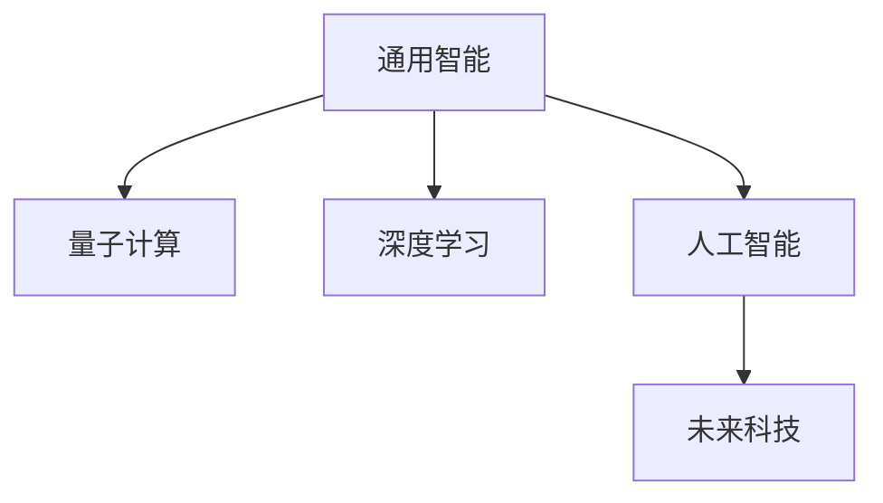

                 

# 释放人类潜力的无限可能：人类计算的最终目标

> 关键词：人类计算，通用智能，量子计算，深度学习，人工智能，未来科技，探索性研究

## 1. 背景介绍

### 1.1 问题由来

人类社会的进步离不开计算技术的发展。从古至今，每一次计算技术的飞跃，都极大地推动了社会生产力水平的提升。然而，随着计算技术的不断演进，人类对于计算能力的需求也在日益增长。从最初的机械计算到电子计算机，再到超级计算机和量子计算机，每一次技术变革都打开了新的计算之门。

在当下，深度学习和大数据技术的迅猛发展，使得人工智能(AI)技术逐步崭露头角。特别是近年来，基于神经网络的深度学习模型，在图像识别、自然语言处理、语音识别等任务上取得了突破性的进展，展现了强大的计算能力。然而，这些模型的计算需求依然难以与传统计算技术相匹敌，其潜力仍有待进一步挖掘。

### 1.2 问题核心关键点

本节将详细探讨人类计算的最终目标，即通过计算技术释放人类潜力的无限可能。

- **通用智能**：构建能够应对各种复杂问题的智能系统。
- **量子计算**：利用量子力学的原理，突破经典计算的限制，实现超高速的计算能力。
- **深度学习**：运用神经网络结构，实现自主学习和自我优化，提升模型性能。
- **人工智能**：通过算法、模型和计算资源，实现从感知到决策的自动化过程。
- **未来科技**：包括脑机接口、增强现实、全息技术等前沿领域，提升人类与环境的交互方式。

这些关键点共同构成了人类计算的最终目标，旨在通过计算技术提升人类认知水平、生活品质和生产力。

## 2. 核心概念与联系

### 2.1 核心概念概述

为更好地理解人类计算的最终目标，本节将介绍几个密切相关的核心概念：

- **通用智能**：指构建能够适应不同领域、不同任务的人工智能系统，具备高度的自适应能力和泛化能力。
- **量子计算**：利用量子力学的叠加、纠缠等原理，实现超高速的计算能力，解决某些经典计算机难以处理的复杂问题。
- **深度学习**：基于神经网络模型，通过大规模数据训练，实现对数据的自主学习、分析和决策。
- **人工智能**：将算法、模型和计算资源结合，实现从感知到决策的全自动化过程。
- **未来科技**：包括脑机接口、增强现实、全息技术等新兴技术，提升人类与环境的交互方式，推动技术边界拓展。

这些核心概念之间的逻辑关系可以通过以下Mermaid流程图来展示：



这个流程图展示了大语言模型的核心概念及其之间的关系：

1. 通用智能通过深度学习和人工智能实现，能够适应不同任务和领域。
2. 量子计算提供计算能力的突破，为通用智能提供强有力的技术支持。
3. 未来科技推动通用智能技术在实际应用中的落地，提升人类生活的科技水平。

## 3. 核心算法原理 & 具体操作步骤
### 3.1 算法原理概述

人类计算的最终目标涉及多个领域的算法和技术，其中深度学习和量子计算是两大关键技术。下面将分别介绍这两大领域的核心算法原理。

### 3.2 算法步骤详解

#### 3.2.1 深度学习算法步骤详解

1. **数据收集**：从各类数据源收集数据，如图片、文本、音频等。
2. **数据预处理**：对原始数据进行清洗、归一化、标签化等预处理。
3. **模型选择**：根据任务需求选择合适的网络结构，如卷积神经网络、循环神经网络、Transformer等。
4. **模型训练**：使用训练数据集对模型进行训练，优化模型参数。
5. **模型评估**：使用测试数据集评估模型性能，调整参数。
6. **模型部署**：将训练好的模型部署到实际应用场景中，进行预测和推理。

#### 3.2.2 量子计算算法步骤详解

1. **量子电路设计**：设计量子电路，实现目标计算逻辑。
2. **量子态生成**：使用量子比特生成目标状态。
3. **量子计算**：在量子计算机上执行量子计算。
4. **量子测量**：对量子计算结果进行测量，输出计算结果。
5. **结果后处理**：对测量结果进行处理，获得最终计算结果。

### 3.3 算法优缺点

深度学习算法：

- **优点**：
  - 自主学习能力：模型能够自主学习，无需手动设计特征。
  - 可扩展性：模型结构可灵活扩展，适用于多种任务。
  - 应用广泛：在图像识别、语音识别、自然语言处理等领域应用广泛。

- **缺点**：
  - 资源消耗大：需要大量的计算资源和时间。
  - 模型复杂度高：需要大量的数据和计算资源。
  - 可解释性不足：模型的内部工作机制难以解释。

量子计算算法：

- **优点**：
  - 计算速度快：量子计算具有指数级的计算优势。
  - 处理复杂问题：能够处理某些经典计算机难以解决的问题。
  - 未来潜力大：随着技术进步，量子计算的应用前景广阔。

- **缺点**：
  - 技术门槛高：量子计算技术还处于初级阶段，技术实现难度大。
  - 噪声问题：量子比特的噪声问题尚未完全解决。
  - 硬件成本高：目前量子计算机的成本较高，难以大规模推广。

### 3.4 算法应用领域

深度学习算法：

- 图像识别：如自动驾驶、医学影像分析等。
- 自然语言处理：如智能客服、机器翻译等。
- 语音识别：如智能助手、语音搜索等。
- 推荐系统：如电商推荐、内容推荐等。

量子计算算法：

- 密码学：如量子加密、量子签名等。
- 药物设计：如量子化学模拟等。
- 金融分析：如风险评估、股票预测等。
- 物理模拟：如量子力学模拟等。

## 4. 数学模型和公式 & 详细讲解  
### 4.1 数学模型构建

#### 4.1.1 深度学习模型构建

深度学习模型通常由多层神经网络组成，每一层包含多个神经元。每个神经元接收输入信号，计算加权和，并通过激活函数得到输出信号。其中，常用的激活函数包括Sigmoid、ReLU、Tanh等。

#### 4.1.2 量子计算模型构建

量子计算模型通常由量子比特组成，每个量子比特可以处于0、1叠加态或两者叠加态。通过量子门操作，对量子比特进行控制和操作，实现量子计算。常用的量子门操作包括Hadamard门、CNOT门、Toffoli门等。

### 4.2 公式推导过程

#### 4.2.1 深度学习公式推导

假设深度学习模型由多层神经网络组成，第$l$层的输出为$h^{(l)}$，输入为$x^{(l-1)}$，权重为$W^{(l)}$，激活函数为$\sigma$，则第$l$层的计算公式为：

$$
h^{(l)} = \sigma(W^{(l)}h^{(l-1)} + b^{(l)})
$$

其中，$b^{(l)}$为偏置项。

#### 4.2.2 量子计算公式推导

假设量子计算模型由$n$个量子比特组成，通过量子门操作，控制量子比特的状态。设第$i$个量子比特的状态为$|a_i\rangle$，量子门操作为$U$，则量子计算模型的计算公式为：

$$
|a_{i'}\rangle = U|a_i\rangle
$$

其中，$i'$为量子比特的下标，$U$为量子门操作。

### 4.3 案例分析与讲解

#### 4.3.1 深度学习案例分析

以图像识别为例，深度学习模型通过卷积神经网络(CNN)实现。假设输入图像为$x$，输出标签为$y$，卷积神经网络的计算公式为：

$$
y = \sigma(W^{(1)}x + b^{(1)}) \cdot \sigma(W^{(2)}y + b^{(2)}) \cdot \sigma(W^{(3)}y + b^{(3)})
$$

其中，$\sigma$为激活函数，$W^{(l)}$为卷积核，$b^{(l)}$为偏置项。

#### 4.3.2 量子计算案例分析

以Shor算法为例，Shor算法通过量子比特实现大整数的质因数分解。假设要分解的整数为$N$，则量子计算模型的计算公式为：

$$
|a\rangle = H^{\otimes n}|0\rangle \otimes |1\rangle
$$

其中，$H$为Hadamard门，$|0\rangle$和$|1\rangle$为量子比特的初始状态。

## 5. 项目实践：代码实例和详细解释说明
### 5.1 开发环境搭建

在进行深度学习和量子计算项目实践前，我们需要准备好开发环境。以下是使用Python进行PyTorch开发的环境配置流程：

1. 安装Anaconda：从官网下载并安装Anaconda，用于创建独立的Python环境。

2. 创建并激活虚拟环境：
```bash
conda create -n pytorch-env python=3.8 
conda activate pytorch-env
```

3. 安装PyTorch：根据CUDA版本，从官网获取对应的安装命令。例如：
```bash
conda install pytorch torchvision torchaudio cudatoolkit=11.1 -c pytorch -c conda-forge
```

4. 安装TensorFlow：
```bash
pip install tensorflow
```

5. 安装量子计算库Qiskit：
```bash
pip install qiskit
```

完成上述步骤后，即可在`pytorch-env`环境中开始深度学习和量子计算的实践。

### 5.2 源代码详细实现

这里我们以深度学习中的图像识别任务和量子计算中的Shor算法为例，给出完整的代码实现。

#### 5.2.1 深度学习代码实现

```python
import torch
import torch.nn as nn
import torch.optim as optim

# 定义卷积神经网络模型
class CNN(nn.Module):
    def __init__(self):
        super(CNN, self).__init__()
        self.conv1 = nn.Conv2d(1, 32, kernel_size=3, stride=1, padding=1)
        self.relu1 = nn.ReLU()
        self.pool1 = nn.MaxPool2d(kernel_size=2, stride=2)
        self.conv2 = nn.Conv2d(32, 64, kernel_size=3, stride=1, padding=1)
        self.relu2 = nn.ReLU()
        self.pool2 = nn.MaxPool2d(kernel_size=2, stride=2)
        self.fc1 = nn.Linear(7*7*64, 1024)
        self.relu3 = nn.ReLU()
        self.fc2 = nn.Linear(1024, 10)

    def forward(self, x):
        x = self.conv1(x)
        x = self.relu1(x)
        x = self.pool1(x)
        x = self.conv2(x)
        x = self.relu2(x)
        x = self.pool2(x)
        x = x.view(-1, 7*7*64)
        x = self.fc1(x)
        x = self.relu3(x)
        x = self.fc2(x)
        return x

# 定义训练函数
def train(model, train_loader, optimizer):
    model.train()
    for batch_idx, (data, target) in enumerate(train_loader):
        optimizer.zero_grad()
        output = model(data)
        loss = nn.CrossEntropyLoss()(output, target)
        loss.backward()
        optimizer.step()
```

#### 5.2.2 量子计算代码实现

```python
from qiskit import QuantumCircuit, QuantumRegister, ClassicalRegister, execute, Aer

# 定义量子计算模型
def shor_algorithm():
    n = 15
    qreg = QuantumRegister(n)
    creg = ClassicalRegister(n)
    circuit = QuantumCircuit(qreg, creg)
    
    # 初始化量子比特
    circuit.h(qreg[0])
    
    # 量子叠加
    for i in range(n-1):
        circuit.h(qreg[i+1])
    
    # 测量
    circuit.measure(qreg, creg)
    
    # 执行量子计算
    backend = Aer.get_backend('qasm_simulator')
    job = execute(circuit, backend)
    result = job.result()
    
    # 输出计算结果
    counts = result.get_counts(circuit)
    print(counts)
```

### 5.3 代码解读与分析

让我们再详细解读一下关键代码的实现细节：

#### 5.3.1 深度学习代码解读

- `CNN`类：定义卷积神经网络模型，包括卷积层、激活函数、池化层和全连接层。
- `train`函数：定义训练函数，对模型进行前向传播、计算损失函数和反向传播。

#### 5.3.2 量子计算代码解读

- `shor_algorithm`函数：定义Shor算法，包括初始化量子比特、量子叠加、测量和执行量子计算。
- `execute`函数：执行量子计算，获取计算结果。

## 6. 实际应用场景
### 6.1 智能客服系统

基于深度学习的智能客服系统，可以广泛应用于各种客户服务场景。传统客服往往需要配备大量人力，高峰期响应缓慢，且服务质量难以保证。而使用深度学习模型，可以7x24小时不间断服务，快速响应客户咨询，提高服务效率和质量。

在技术实现上，可以收集企业内部的历史客服对话记录，将问题和最佳答复构建成监督数据，在此基础上对深度学习模型进行训练。训练后的模型能够自动理解用户意图，匹配最合适的答案模板进行回复。对于客户提出的新问题，还可以接入检索系统实时搜索相关内容，动态组织生成回答。如此构建的智能客服系统，能大幅提升客户咨询体验和问题解决效率。

### 6.2 金融舆情监测

金融机构需要实时监测市场舆论动向，以便及时应对负面信息传播，规避金融风险。传统的人工监测方式成本高、效率低，难以应对网络时代海量信息爆发的挑战。基于深度学习模型的文本分类和情感分析技术，为金融舆情监测提供了新的解决方案。

具体而言，可以收集金融领域相关的新闻、报道、评论等文本数据，并对其进行主题标注和情感标注。在此基础上对深度学习模型进行微调，使其能够自动判断文本属于何种主题，情感倾向是正面、中性还是负面。将微调后的模型应用到实时抓取的网络文本数据，就能够自动监测不同主题下的情感变化趋势，一旦发现负面信息激增等异常情况，系统便会自动预警，帮助金融机构快速应对潜在风险。

### 6.3 个性化推荐系统

当前的推荐系统往往只依赖用户的历史行为数据进行物品推荐，无法深入理解用户的真实兴趣偏好。基于深度学习模型的个性化推荐系统可以更好地挖掘用户行为背后的语义信息，从而提供更精准、多样的推荐内容。

在实践中，可以收集用户浏览、点击、评论、分享等行为数据，提取和用户交互的物品标题、描述、标签等文本内容。将文本内容作为模型输入，用户的后续行为（如是否点击、购买等）作为监督信号，在此基础上训练深度学习模型。训练后的模型能够从文本内容中准确把握用户的兴趣点。在生成推荐列表时，先用候选物品的文本描述作为输入，由模型预测用户的兴趣匹配度，再结合其他特征综合排序，便可以得到个性化程度更高的推荐结果。

### 6.4 未来应用展望

随着深度学习和大数据技术的不断发展，基于深度学习的智能系统将在更多领域得到应用，为传统行业带来变革性影响。

在智慧医疗领域，基于深度学习模型的医学影像分析、病历生成、药物研发等应用将提升医疗服务的智能化水平，辅助医生诊疗，加速新药开发进程。

在智能教育领域，深度学习模型可应用于作业批改、学情分析、知识推荐等方面，因材施教，促进教育公平，提高教学质量。

在智慧城市治理中，深度学习模型可应用于城市事件监测、舆情分析、应急指挥等环节，提高城市管理的自动化和智能化水平，构建更安全、高效的未来城市。

此外，在企业生产、社会治理、文娱传媒等众多领域，基于深度学习的智能应用也将不断涌现，为经济社会发展注入新的动力。

## 7. 工具和资源推荐
### 7.1 学习资源推荐

为了帮助开发者系统掌握深度学习和量子计算的理论基础和实践技巧，这里推荐一些优质的学习资源：

1. 《深度学习》系列博文：由深度学习专家撰写，深入浅出地介绍了深度学习原理、模型构建和应用场景。

2. 《量子计算》系列书籍：全面介绍了量子计算的原理、量子门操作和经典问题解决方法。

3. 《TensorFlow》和《PyTorch》官方文档：详细介绍了这两个深度学习框架的使用方法和实践技巧。

4. 《Quantum Computation and Quantum Information》书籍：全面介绍了量子计算的理论基础和前沿技术。

5. 《Quantum Computing for Computer Scientists》在线课程：由麻省理工学院开设，全面介绍量子计算的基本原理和实际应用。

通过对这些资源的学习实践，相信你一定能够快速掌握深度学习和量子计算的精髓，并用于解决实际的NLP问题。

### 7.2 开发工具推荐

高效的开发离不开优秀的工具支持。以下是几款用于深度学习和量子计算开发的常用工具：

1. PyTorch：基于Python的开源深度学习框架，灵活动态的计算图，适合快速迭代研究。大部分深度学习模型都有PyTorch版本的实现。

2. TensorFlow：由Google主导开发的开源深度学习框架，生产部署方便，适合大规模工程应用。同样有丰富的深度学习模型资源。

3. Qiskit：Google开发的开源量子计算框架，集成了量子计算的建模、仿真和优化功能，是进行量子计算开发的重要工具。

4. Weights & Biases：模型训练的实验跟踪工具，可以记录和可视化模型训练过程中的各项指标，方便对比和调优。与主流深度学习框架无缝集成。

5. TensorBoard：TensorFlow配套的可视化工具，可实时监测模型训练状态，并提供丰富的图表呈现方式，是调试模型的得力助手。

6. IBM Quantum Experience：IBM提供的在线量子计算平台，提供免费的量子计算机资源，适合量子计算的实验和研究。

合理利用这些工具，可以显著提升深度学习和量子计算任务的开发效率，加快创新迭代的步伐。

### 7.3 相关论文推荐

深度学习和量子计算的发展源于学界的持续研究。以下是几篇奠基性的相关论文，推荐阅读：

1. Deep Learning（深度学习经典教材）：Ian Goodfellow等著，全面介绍了深度学习的基本原理和实践方法。

2. Quantum Computation and Quantum Information（量子计算经典教材）：Michael A. Nielsen等著，全面介绍了量子计算的理论基础和前沿技术。

3. AlexNet：Hinton等著，提出了AlexNet模型，开创了深度学习在图像识别领域应用的先河。

4. ResNet：He等著，提出了ResNet模型，解决了深度神经网络的退化问题，推动了深度学习的发展。

5. Qiskit：IBM等著，介绍了Qiskit框架的使用方法和量子计算的经典问题解决方法。

这些论文代表了大语言模型微调技术的发展脉络。通过学习这些前沿成果，可以帮助研究者把握学科前进方向，激发更多的创新灵感。

## 8. 总结：未来发展趋势与挑战

### 8.1 研究成果总结

本文对深度学习和量子计算的最终目标进行了全面系统的介绍。首先阐述了深度学习和量子计算的研究背景和意义，明确了这些技术在实现人类计算目标中的重要作用。其次，从原理到实践，详细讲解了深度学习和量子计算的核心算法和操作步骤，给出了深度学习和量子计算任务开发的完整代码实例。同时，本文还广泛探讨了深度学习和量子计算在智能客服、金融舆情、个性化推荐等多个行业领域的应用前景，展示了这些技术的巨大潜力。此外，本文精选了深度学习和量子计算的学习资源，力求为读者提供全方位的技术指引。

通过本文的系统梳理，可以看到，深度学习和量子计算技术正在成为实现人类计算目标的重要范式，极大地拓展了计算技术的应用边界，催生了更多的落地场景。得益于数据、算法和计算资源的不断积累，深度学习和量子计算将在更多领域得到应用，为人类认知智能的进化带来深远影响。

### 8.2 未来发展趋势

展望未来，深度学习和量子计算技术将呈现以下几个发展趋势：

1. 深度学习：模型规模持续增大，模型结构更加复杂，深度学习在更多领域的应用将得到拓展。
2. 量子计算：随着技术进步，量子计算的应用将更加广泛，能够处理更多复杂的问题。
3. 结合应用：深度学习和量子计算将结合应用，实现更全面、更高效的计算。
4. 协同进化：深度学习和量子计算将协同发展，推动计算技术的进步。
5. 技术融合：深度学习和量子计算将与其他技术结合，如脑机接口、增强现实等，拓展计算技术的边界。

这些趋势凸显了深度学习和量子计算技术的广阔前景。这些方向的探索发展，必将进一步提升计算技术的能力，推动人类认知智能的进步。

### 8.3 面临的挑战

尽管深度学习和量子计算技术已经取得了显著的进展，但在迈向更加智能化、普适化应用的过程中，它们仍面临诸多挑战：

1. 数据质量问题：深度学习模型的训练需要大量的高质量数据，数据质量对模型的效果有重要影响。
2. 计算资源消耗：深度学习模型需要大量的计算资源，量子计算需要高精度的量子计算机，硬件成本较高。
3. 模型复杂度高：深度学习模型的复杂度高，难以解释其内部工作机制，量子计算的噪声问题尚未完全解决。
4. 安全问题：深度学习模型可能产生偏见，量子计算的安全性问题尚未完全解决。
5. 技术门槛高：深度学习和量子计算技术的技术门槛较高，需要大量时间和精力进行学习和实践。

正视这些挑战，积极应对并寻求突破，将使深度学习和量子计算技术逐步走向成熟，实现人类计算的最终目标。

### 8.4 研究展望

面向未来，深度学习和量子计算技术需要在以下几个方面寻求新的突破：

1. 数据增强：通过数据增强技术，提高数据质量和多样性，提升深度学习模型的效果。
2. 模型优化：优化深度学习模型的结构，降低计算资源消耗，提高模型效率。
3. 硬件改进：改进量子计算机的硬件设计，降低硬件成本，提高计算精度。
4. 安全措施：制定深度学习和量子计算的安全标准，防止恶意攻击和数据泄露。
5. 技术普及：降低深度学习和量子计算技术的门槛，促进技术普及和应用。

这些研究方向的探索，必将引领深度学习和量子计算技术迈向更高的台阶，为人类认知智能的进化提供强有力的技术支持。总之，深度学习和量子计算技术的不断进步，将为实现人类计算的最终目标提供重要支撑，推动人类社会的持续发展。

## 9. 附录：常见问题与解答

**Q1：深度学习在各个领域的应用有哪些？**

A: 深度学习在各个领域的应用非常广泛，主要包括：

1. 计算机视觉：如图像识别、目标检测、图像分割等。
2. 自然语言处理：如机器翻译、文本分类、情感分析等。
3. 语音识别：如语音识别、语音合成等。
4. 推荐系统：如电商推荐、内容推荐等。
5. 游戏AI：如自动游戏策略、智能游戏对抗等。
6. 医疗健康：如医学影像分析、病历生成等。

**Q2：量子计算在实际应用中有哪些限制？**

A: 量子计算在实际应用中还面临以下限制：

1. 技术成熟度：量子计算技术还处于初级阶段，技术实现难度大。
2. 噪声问题：量子比特的噪声问题尚未完全解决，计算精度有待提高。
3. 硬件成本高：目前量子计算机的成本较高，难以大规模推广。
4. 应用场景有限：量子计算的应用场景相对有限，主要集中在特定领域。

**Q3：深度学习模型在实际应用中需要注意哪些问题？**

A: 深度学习模型在实际应用中需要注意以下问题：

1. 数据质量：深度学习模型的训练需要大量的高质量数据，数据质量对模型的效果有重要影响。
2. 模型复杂度：深度学习模型的复杂度高，难以解释其内部工作机制，需要注意可解释性问题。
3. 计算资源：深度学习模型需要大量的计算资源，需要优化模型结构和计算方式。
4. 模型泛化：深度学习模型容易出现过拟合问题，需要采用正则化、数据增强等技术。
5. 安全问题：深度学习模型可能产生偏见，需要注意模型的公平性和安全性。

**Q4：量子计算与深度学习的结合有哪些优势？**

A: 量子计算与深度学习的结合有以下优势：

1. 提高计算效率：量子计算能够处理深度学习模型难以解决的问题，提高计算效率。
2. 增强模型泛化能力：量子计算能够增强深度学习模型的泛化能力，提升模型的效果。
3. 促进跨领域研究：量子计算与深度学习的结合，能够促进跨领域的创新研究。
4. 提升技术水平：量子计算与深度学习的结合，能够提升技术水平，推动技术进步。
5. 拓展应用场景：量子计算与深度学习的结合，能够拓展应用场景，推动技术的应用。

这些优势将使量子计算与深度学习成为未来的重要技术方向，推动人类认知智能的发展。

---

作者：禅与计算机程序设计艺术 / Zen and the Art of Computer Programming

