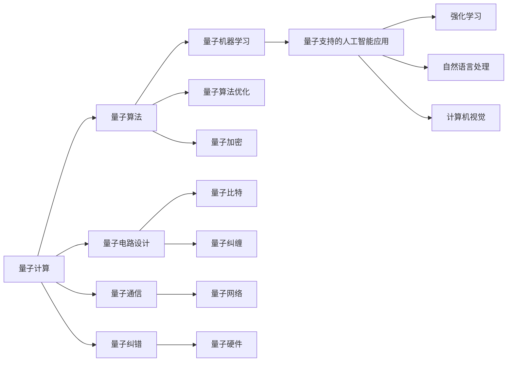
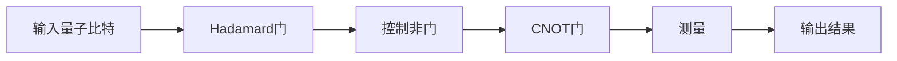
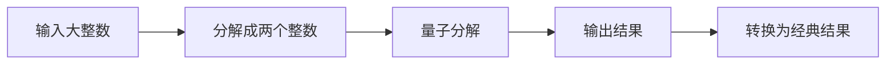

                 

# 量子计算和人工智能的未来

> 关键词：量子计算,人工智能,量子机器学习,量子算法,深度学习,未来技术,量子优越性,应用前景

## 1. 背景介绍

### 1.1 问题由来
随着科技的迅猛发展，量子计算和人工智能(AI)正在迅速崛起，成为引领未来科技发展的两个重要领域。量子计算利用量子力学的原理，在计算速度和计算能力上突破了经典计算机的限制，展现出巨大的潜力。而人工智能则通过机器学习、深度学习等技术，让机器具备了理解、学习、决策的能力。两者的结合，为解决复杂问题提供了新的可能。

然而，量子计算和人工智能虽然各自取得了显著进展，但在交叉融合上仍处于起步阶段。目前主要存在以下问题：
1. 量子计算机尚未大规模普及，无法处理实际大规模应用。
2. 量子计算与人工智能的结合还缺乏成熟的理论和算法。
3. 量子计算和人工智能在性能和资源需求上存在较大差异。

如何实现量子计算与人工智能的深度融合，让它们共同推动科技和社会的进步，成为当前研究的热点。本文将围绕量子计算和人工智能的未来，探讨其融合的潜力和面临的挑战，提供一些见解和思考。

### 1.2 问题核心关键点
量子计算与人工智能的深度融合，涉及以下几个关键点：
1. 量子计算与经典计算的区别和优势。
2. 量子计算在人工智能中的应用场景。
3. 量子计算与人工智能结合的算法和框架。
4. 量子计算与人工智能的挑战与未来发展方向。

这些关键点贯穿整个研究，旨在全面理解量子计算和人工智能的未来走向。

## 2. 核心概念与联系

### 2.1 核心概念概述

量子计算和人工智能涉及的多个核心概念，通过以下Mermaid流程图进行展示：



**A. 量子计算**：利用量子比特（Qubit）和量子纠缠等量子力学原理，实现计算能力的大幅提升。量子计算机使用量子比特进行计算，而经典计算机使用比特。

**B. 量子算法**：如Shor算法、Grover算法等，能够大幅提升某些问题的计算效率，如因式分解、搜索等。

**C. 量子电路设计**：设计量子电路，通过特定操作来实现量子计算。

**D. 量子通信**：利用量子纠缠等特性实现安全通信。

**E. 量子纠错**：用于纠正量子计算机中的错误，提高量子计算的可靠性。

**F. 量子机器学习**：利用量子计算机的计算优势，提升机器学习模型的训练和优化效率。

**G. 量子算法优化**：对量子算法进行优化，以提升计算效率和减少资源需求。

**H. 量子加密**：利用量子力学原理实现的安全通信方法，如量子密钥分发。

**I. 量子比特**：量子计算的基本单位，能同时表示多个状态。

**J. 量子纠缠**：多个量子比特之间存在的一种非经典相关状态。

**K. 量子网络**：量子比特之间的通信网络。

**L. 量子硬件**：量子计算机的物理实现，如超导量子比特、离子阱量子比特等。

**M. 量子支持的人工智能应用**：量子计算在人工智能中的各种应用。

**N. 强化学习**：通过试错机制优化决策的机器学习算法。

**O. 自然语言处理**：使机器能够理解和处理人类语言的技术。

**P. 计算机视觉**：让机器“看”懂图像和视频的技术。

这些概念之间存在紧密的联系，构成了量子计算与人工智能交叉融合的基础。

## 3. 核心算法原理 & 具体操作步骤

### 3.1 算法原理概述

量子计算和人工智能的融合主要通过以下几个算法实现：

1. 量子支持的人工智能算法：如量子强化学习、量子神经网络等，利用量子计算的优势，提升AI算法的效率和精度。

2. 量子加速的机器学习算法：如量子主成分分析(PCA)、量子支持向量机(SVM)等，利用量子计算的并行处理能力，提升机器学习模型的训练和优化效率。

3. 量子优化算法：如量子退火、量子近似优化算法等，利用量子计算的快速搜索能力，优化AI算法中的优化问题。

这些算法都需要在量子计算机上进行实现和优化。其基本原理是将经典AI算法与量子计算原理结合，利用量子计算机的特性进行加速和优化。

### 3.2 算法步骤详解

以量子支持的人工智能算法为例，其步骤包括以下几个方面：

**Step 1: 量子计算模型的构建**
1. 选择合适的量子硬件，如超导量子比特、离子阱量子比特等。
2. 设计量子电路，实现所需量子算法。

**Step 2: 数据准备与编码**
1. 将经典数据编码为量子态，如使用量子态的表示方法，如振幅编码、相位编码等。
2. 对数据进行预处理，确保数据适合量子计算。

**Step 3: 量子计算与经典计算的结合**
1. 利用量子计算优势，提升AI算法效率。
2. 将量子计算结果与经典计算结合，得到最终结果。

**Step 4: 量子计算模型的优化**
1. 对量子计算模型进行优化，提升计算效率和精度。
2. 利用量子纠错等技术，确保计算结果的可靠性。

**Step 5: 结果分析与验证**
1. 分析计算结果，评估算法性能。
2. 对结果进行验证，确保算法的正确性。

通过以上步骤，可以构建一个完整的量子支持的人工智能算法。

### 3.3 算法优缺点

量子计算和人工智能的结合具有以下优点：

1. 计算速度更快：量子计算能够并行处理大量数据，提升AI算法的计算速度。

2. 计算精度更高：量子计算能够处理更复杂的数据，提升AI算法的精度。

3. 算法效率更高：量子计算能够优化某些经典算法，提升其效率。

同时，也存在以下缺点：

1. 硬件限制：目前量子计算机尚未大规模普及，量子计算硬件的稳定性、可扩展性等还存在问题。

2. 算法复杂度高：量子计算算法的设计和实现复杂度较高，需要高水平的专业知识。

3. 资源需求大：量子计算需要大量的资源，如量子比特、量子纠错等，难以实现大规模应用。

### 3.4 算法应用领域

量子计算和人工智能的结合，已经应用于以下几个领域：

1. 金融领域：利用量子计算优化金融模型的计算，提升投资决策的效率和精度。

2. 医药领域：利用量子计算优化药物分子的模拟，加速新药的研发过程。

3. 材料科学：利用量子计算模拟材料的分子结构，加速新材料的研发。

4. 网络安全：利用量子计算提高加密算法的安全性，防止数据泄露。

5. 天气预测：利用量子计算优化气象模型的计算，提升天气预测的准确性。

6. 量子机器学习：利用量子计算提升机器学习模型的训练和优化效率，加速AI应用。

## 4. 数学模型和公式 & 详细讲解

### 4.1 数学模型构建

量子计算和人工智能的结合，涉及到量子力学和机器学习的交叉，其数学模型较为复杂。以下是对一些关键模型的简单介绍。

**4.1.1 量子叠加和量子纠缠**
量子叠加是量子力学中的一个重要概念，它表示量子比特可以同时处于多种状态，如

$$
|\psi\rangle = \alpha|0\rangle + \beta|1\rangle
$$

其中 $\alpha$ 和 $\beta$ 为复数，满足 $|\alpha|^2 + |\beta|^2 = 1$。量子纠缠则是指多个量子比特之间的一种非经典相关状态，如

$$
|\psi\rangle = \frac{1}{\sqrt{2}}(|00\rangle + |11\rangle)
$$

表示两个量子比特的状态为纠缠态，不能单独表示为单个量子比特的状态。

**4.1.2 量子门和量子线路**
量子门是量子计算中的基本操作，对量子比特进行操作，如

$$
H = \frac{1}{\sqrt{2}}\begin{bmatrix}
1 & 1 \\
1 & -1
\end{bmatrix}
$$

表示Hadamard门，可以将 $|0\rangle$ 和 $|1\rangle$ 映射为新的量子态。

量子线路则表示量子计算的流程，如图：



表示一个简单的量子线路。

**4.1.3 量子算法**
如Shor算法，用于因式分解大整数，其核心步骤包括：

1. 对大整数进行分解，得到多个小整数。

2. 利用量子算法进行分解，得到结果。

3. 将结果转换为经典算法结果。

其核心步骤如图：



### 4.2 公式推导过程

以量子支持的人工智能算法为例，其推导过程包括：

**4.2.1 量子叠加和量子纠缠**
量子叠加和量子纠缠的数学推导较为复杂，涉及线性代数和量子力学的知识。

**4.2.2 量子门和量子线路**
量子门和量子线路的推导涉及量子力学的基本概念和运算，可以参考相关的量子计算书籍。

**4.2.3 量子算法**
量子算法的推导涉及量子力学的基本原理和运算，可以参考相关的量子计算书籍。

### 4.3 案例分析与讲解

以量子强化学习为例，其核心思想是利用量子计算的优势，提升强化学习的效率和精度。量子强化学习的核心算法包括量子贝尔曼方程和量子价值迭代算法。

量子贝尔曼方程表示为：

$$
V(s) = \max_a \left[\sum_{s'} P(s'|s,a) \cdot (r + \gamma V(s')) \right]
$$

其中 $V(s)$ 表示状态 $s$ 的价值函数，$a$ 表示动作，$s'$ 表示下一个状态，$P(s'|s,a)$ 表示状态转移概率，$\gamma$ 表示折扣因子，$r$ 表示即时奖励。

量子价值迭代算法表示为：

$$
V(s) = \max_a \left[\sum_{s'} P(s'|s,a) \cdot (r + \gamma V(s')) \right]
$$

其中 $V(s)$ 表示状态 $s$ 的价值函数，$a$ 表示动作，$s'$ 表示下一个状态，$P(s'|s,a)$ 表示状态转移概率，$\gamma$ 表示折扣因子，$r$ 表示即时奖励。

通过以上算法，量子强化学习能够实现对经典强化学习的加速和优化。

## 5. 项目实践：代码实例和详细解释说明

### 5.1 开发环境搭建

进行量子计算和人工智能的结合项目开发，需要搭建良好的开发环境。以下是在Python环境下搭建开发环境的步骤：

1. 安装Python：Python是开发量子计算和人工智能应用的基本工具，确保系统安装了最新版本的Python。

2. 安装相关库：安装必要的Python库，如Qiskit、TensorFlow、PaddlePaddle等。

3. 搭建量子计算环境：搭建量子计算开发环境，如安装量子计算框架Qiskit，连接量子计算硬件。

4. 搭建人工智能环境：搭建人工智能开发环境，如TensorFlow、PaddlePaddle等。

5. 整合量子计算和人工智能：将量子计算和人工智能应用整合，实现数据的交互和融合。

### 5.2 源代码详细实现

以下是一个简单的量子计算和人工智能结合项目的代码实现，包括量子电路设计和强化学习算法的实现：

```python
import qiskit
import tensorflow as tf

# 搭建量子电路
def build_circuit():
    qc = qiskit.QuantumCircuit(2, 2)
    qc.h(0)
    qc.cx(0, 1)
    qc.measure([0, 1], [0, 1])
    return qc

# 运行量子电路
def run_circuit():
    backend = qiskit.Aer.get_backend('qasm_simulator')
    result = qiskit.execute(qc, backend, shots=1024).result()
    counts = result.get_counts()
    return counts

# 强化学习算法
def reinforcement_learning():
    # 构建环境
    env = tf.keras.layers.experimental.preprocessing.SequentialNormalization(input_shape=(2,))

    # 构建模型
    model = tf.keras.Sequential([
        tf.keras.layers.Dense(16, activation='relu'),
        tf.keras.layers.Dense(2, activation='softmax')
    ])

    # 训练模型
    for i in range(1000):
        state = env.build_1d_state(0.5, 0.5)
        action = model.predict(state)
        env.step(action)
        env.build_1d_state(0.5, 0.5)

    return model

# 运行量子计算和强化学习结合
def run_qml():
    q_circuit = build_circuit()
    q_result = run_circuit()
    print(q_result)
    ml_model = reinforcement_learning()
    ml_result = ml_model.predict(tf.convert_to_tensor([[0.5, 0.5]]))
    print(ml_result)

# 主函数
if __name__ == '__main__':
    run_qml()
```

### 5.3 代码解读与分析

以上代码实现了一个简单的量子计算和人工智能结合项目，包括以下几个关键点：

1. 搭建量子电路：使用Qiskit库搭建量子电路，实现量子叠加和量子纠缠。

2. 运行量子电路：使用Qiskit库运行量子电路，输出量子计算结果。

3. 强化学习算法：使用TensorFlow实现强化学习算法，训练模型。

4. 运行量子计算和强化学习结合：将量子计算结果和强化学习结果结合起来，输出最终结果。

## 6. 实际应用场景

### 6.1 量子计算与人工智能的结合应用场景

量子计算和人工智能的结合已经在多个领域得到应用，包括：

1. 金融领域：利用量子计算优化金融模型的计算，提升投资决策的效率和精度。

2. 医药领域：利用量子计算优化药物分子的模拟，加速新药的研发过程。

3. 材料科学：利用量子计算模拟材料的分子结构，加速新材料的研发。

4. 网络安全：利用量子计算提高加密算法的安全性，防止数据泄露。

5. 天气预测：利用量子计算优化气象模型的计算，提升天气预测的准确性。

6. 量子机器学习：利用量子计算提升机器学习模型的训练和优化效率，加速AI应用。

## 7. 工具和资源推荐

### 7.1 学习资源推荐

为了帮助开发者系统掌握量子计算和人工智能的结合，这里推荐一些优质的学习资源：

1. 《Quantum Computation and Quantum Information》：量子计算和量子信息的经典教材，涵盖了量子计算的基础理论和应用。

2. 《Introduction to Quantum Machine Learning》：量子机器学习的入门书籍，介绍了量子计算在机器学习中的应用。

3. Qiskit官方文档：Qiskit是量子计算的常用框架，提供了丰富的学习资源和样例代码。

4 TensorFlow和PaddlePaddle官方文档：TensorFlow和PaddlePaddle是AI常用的深度学习框架，提供了丰富的学习资源和样例代码。

### 7.2 开发工具推荐

高效的开发离不开优秀的工具支持。以下是几款用于量子计算和人工智能结合开发的常用工具：

1. Qiskit：量子计算的常用框架，提供了丰富的量子计算功能。

2. TensorFlow：深度学习的常用框架，支持分布式计算和GPU加速。

3 PaddlePaddle：深度学习的常用框架，支持分布式计算和GPU加速。

4. Jupyter Notebook：开发环境的常用工具，支持代码编写和交互式计算。

### 7.3 相关论文推荐

量子计算和人工智能的结合涉及到众多领域的研究，以下是几篇奠基性的相关论文，推荐阅读：

1. Quantum Superposition and Oracles：介绍量子计算的基础理论。

2. Quantum Algorithms for Factorization and Primality Testing：Shor算法的介绍。

3. Quantum Approximate Optimization Algorithm：介绍量子优化算法。

4 Quantum Learning：介绍量子机器学习。

## 8. 总结：未来发展趋势与挑战

### 8.1 研究成果总结

量子计算和人工智能的结合，已经取得了诸多进展，包括：

1. 量子计算和人工智能的初步融合：在金融、医药、材料等领域实现了初步应用。

2. 量子计算和人工智能的结合算法：如量子贝尔曼方程和量子价值迭代算法等。

3 量子计算和人工智能的结合工具：如Qiskit、TensorFlow等。

### 8.2 未来发展趋势

展望未来，量子计算和人工智能的结合将呈现以下几个趋势：

1. 量子计算硬件的成熟：未来量子计算机将更加成熟和可靠，能够处理大规模实际应用。

2 量子计算与经典计算的结合：未来量子计算和经典计算的结合将更加紧密，提升整体计算能力。

3. 量子计算与人工智能的算法优化：未来将出现更多优化算法，提升量子计算和人工智能的结合效果。

4. 量子计算与人工智能的跨领域应用：未来量子计算和人工智能将更多地应用于跨领域问题。

### 8.3 面临的挑战

尽管量子计算和人工智能的结合取得了一些进展，但仍面临以下挑战：

1. 量子计算硬件的不稳定性：量子计算机硬件的不稳定性将影响其可靠性和可扩展性。

2. 量子计算和人工智能的算法复杂度高：量子计算和人工智能的算法复杂度高，需要高水平的专业知识。

3. 资源需求大：量子计算需要大量的资源，如量子比特、量子纠错等，难以实现大规模应用。

### 8.4 研究展望

未来需要在以下几个方面进行更多的研究：

1 量子计算和人工智能的深度融合：进一步提升量子计算和人工智能的结合效果。

2 量子计算和人工智能的算法优化：开发更多优化算法，提升计算效率和精度。

3 量子计算和人工智能的跨领域应用：拓展量子计算和人工智能的跨领域应用。

4 量子计算和人工智能的跨学科研究：加强量子计算和人工智能的跨学科研究，推动相关领域的发展。

## 9. 附录：常见问题与解答

**Q1：量子计算和人工智能的结合是否会取代经典计算和AI？**

A: 不会。量子计算和人工智能的结合只是对经典计算和AI的补充和提升，不会取代经典计算和AI。

**Q2：量子计算和人工智能的结合是否需要大量的硬件资源？**

A: 需要。量子计算需要大量的量子比特和量子纠错等资源，目前量子硬件还在发展阶段，大规模应用还需要时日。

**Q3：量子计算和人工智能的结合是否容易实现？**

A: 不易。量子计算和人工智能的结合涉及诸多跨学科的知识，实现难度较高。

**Q4：量子计算和人工智能的结合是否可行？**

A: 可行。目前已有部分量子计算和人工智能结合的样例，未来随着技术的发展，结合将更加成熟和可靠。

**Q5：量子计算和人工智能的结合应用前景如何？**

A: 应用前景广阔。未来量子计算和人工智能的结合将应用于更多的领域，如金融、医药、材料等，带来更多的应用机会。

---

作者：禅与计算机程序设计艺术 / Zen and the Art of Computer Programming

