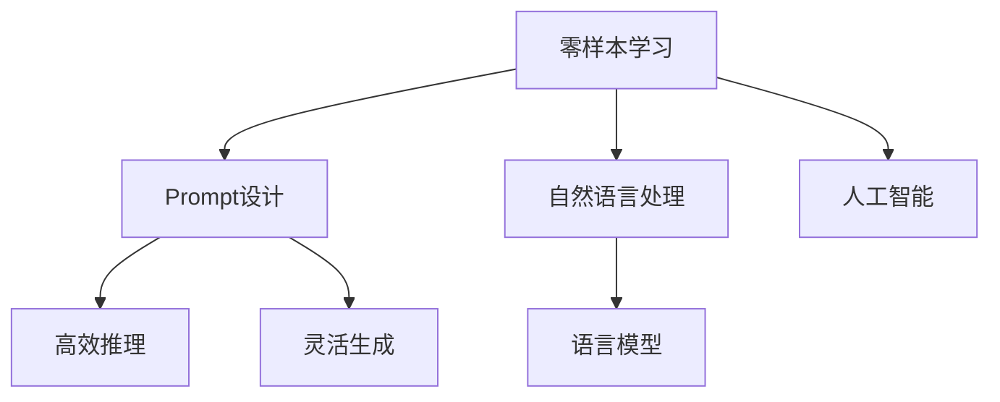

                 

# 零样本学习：Prompt设计

> 关键词：零样本学习, Prompt设计,自然语言处理,人工智能,语言模型

## 1. 背景介绍

### 1.1 问题由来

近年来，人工智能领域在自然语言处理（Natural Language Processing, NLP）方面取得了突破性的进展，其中零样本学习（Zero-Shot Learning, ZSL）在学术界和工业界引起了广泛关注。零样本学习是指在模型没有看到过任何该类别样本的情况下，仅通过任务描述，就能够对新样本进行预测和分类。这一技术的核心在于设计合适的Prompt，使其能够引导模型按照预期方式进行推理和生成。

零样本学习的优势在于其快速、灵活和适应性强的特点，能够在没有足够标注数据的情况下，提供有效的解决方案，广泛应用于问答、翻译、生成文本等NLP任务中。然而，如何设计有效的Prompt，使模型能够准确理解任务指令，进行正确的预测和生成，是当前零样本学习面临的主要挑战。

### 1.2 问题核心关键点

Prompt设计是零样本学习成功的关键。一个优秀的Prompt不仅能提供清晰的指令，还能充分利用预训练模型的知识，进行高效推理和生成。以下是Prompt设计需要考虑的关键点：

- **任务明确性**：Prompt需要简洁明了地描述任务目标，避免歧义和模糊。
- **模型知识利用**：Prompt应尽可能引导模型调用其已有的知识库，提高推理的准确性。
- **语义丰富性**：Prompt应包含足够的信息，帮助模型理解上下文和相关细节。
- **风格一致性**：Prompt应与模型已有的训练数据风格一致，确保模型能够自然流畅地推理。
- **可扩展性**：Prompt设计应具有一定的灵活性，方便扩展到不同任务和数据类型。

本文将从Prompt设计的基本原理出发，详细阐述其关键要素和具体步骤，并通过实际案例展示Prompt设计的最佳实践，帮助开发者设计出高效的Prompt，提升零样本学习的效果。

## 2. 核心概念与联系

### 2.1 核心概念概述

为更好地理解Prompt设计，本节将介绍几个密切相关的核心概念：

- **零样本学习（Zero-Shot Learning, ZSL）**：指模型在未见到任何特定类别样本的情况下，仅通过任务描述，即可对新样本进行预测和分类的能力。
- **Prompt设计**：通过精心设计文本格式，引导模型根据任务描述进行推理和生成，从而实现零样本学习。
- **自然语言处理（Natural Language Processing, NLP）**：使用计算机对人类语言进行自动化处理的技术，包括语言理解、生成、推理等。
- **人工智能（Artificial Intelligence, AI）**：通过模拟人类智能行为，使计算机系统具备学习、推理、决策等能力。
- **语言模型（Language Model）**：用于预测文本序列概率分布的模型，通过学习大规模语料库中的语言规律，具备强大的语言理解和生成能力。

这些概念之间的逻辑关系可以通过以下Mermaid流程图来展示：



这个流程图展示了他核心的概念及其之间的关系：

1. 零样本学习依赖于自然语言处理和人工智能技术，利用语言模型进行高效的推理和生成。
2. Prompt设计是实现零样本学习的关键步骤，直接影响模型推理和生成的效果。
3. Prompt设计需要考虑任务明确性、模型知识利用、语义丰富性等多个因素。

## 3. 核心算法原理 & 具体操作步骤

### 3.1 算法原理概述

零样本学习的核心在于Prompt设计。Prompt是一段文本格式，用于引导模型根据任务描述进行推理和生成。一个有效的Prompt应具备以下特点：

- **简洁明了**：使用简单明了的语言，避免歧义和复杂句式。
- **任务相关**：与当前任务紧密相关，明确指出任务目标。
- **知识丰富**：包含足够的背景信息，帮助模型理解任务情境。
- **风格一致**：与模型已有的训练数据风格一致，确保模型能够自然流畅地推理。
- **可扩展性**：设计灵活，方便扩展到不同任务和数据类型。

一个典型的Prompt设计流程包括：

1. **任务分析**：分析任务目标和要求，确定Prompt的设计方向。
2. **Prompt设计**：根据任务目标，设计简洁明了、任务相关的Prompt格式。
3. **知识整合**：在Prompt中整合背景知识，引导模型利用已有知识进行推理。
4. **测试验证**：在少量测试数据上测试Prompt效果，根据反馈调整Prompt设计。
5. **模型推理**：使用设计好的Prompt，指导模型进行推理和生成，验证Prompt的有效性。

### 3.2 算法步骤详解

以下是零样本学习中Prompt设计的基本步骤：

**Step 1: 任务分析**

- **定义任务**：明确当前任务的目标和要求，例如分类、生成、问答等。
- **理解任务**：详细理解任务的具体情况，例如数据类型、输入输出格式、评价指标等。
- **识别关键要素**：识别任务的关键要素，例如类别、实体、关系等。

**Step 2: Prompt设计**

- **简洁明了**：使用简单明了的语言，避免歧义和复杂句式。
- **任务相关**：明确指出任务目标，例如分类、生成、问答等。
- **知识丰富**：包含足够的背景信息，帮助模型理解任务情境。
- **风格一致**：与模型已有的训练数据风格一致，确保模型能够自然流畅地推理。
- **可扩展性**：设计灵活，方便扩展到不同任务和数据类型。

**Step 3: 知识整合**

- **整合知识**：在Prompt中整合背景知识，例如类别定义、实体关系、数据格式等。
- **利用已有知识**：引导模型利用已有知识进行推理和生成，避免从头学习新知识。
- **避免歧义**：确保知识整合无歧义，避免模型误解任务描述。

**Step 4: 测试验证**

- **少量测试数据**：在少量测试数据上测试Prompt效果，验证Prompt的准确性和鲁棒性。
- **调整Prompt**：根据测试结果，调整Prompt设计，提高Prompt的有效性。
- **验证一致性**：验证Prompt在不同数据集上的效果一致性，确保Prompt设计普适性。

**Step 5: 模型推理**

- **指导模型推理**：使用设计好的Prompt，指导模型进行推理和生成，验证Prompt的有效性。
- **评估效果**：根据推理结果，评估Prompt的性能和效果，寻找改进空间。
- **迭代优化**：根据评估结果，进一步优化Prompt设计，提升零样本学习效果。

### 3.3 算法优缺点

零样本学习的Prompt设计方法具有以下优点：

- **快速高效**：设计良好的Prompt可以显著提高零样本学习的效率，减少对标注数据的依赖。
- **灵活适用**：Prompt设计灵活，适用于多种NLP任务和数据类型，具有广泛的适用性。
- **知识复用**：Prompt设计引导模型利用已有知识，避免从头学习新知识，减少学习成本。
- **鲁棒性强**：设计良好的Prompt具有较强的鲁棒性，能够应对不同场景和数据的挑战。

然而，该方法也存在以下缺点：

- **设计复杂**：Prompt设计需要考虑多种因素，设计复杂，难度较高。
- **依赖Prompt**：模型的推理和生成高度依赖Prompt，设计不当可能导致模型无法正确理解任务。
- **效果不稳定**：不同Prompt设计可能导致模型推理效果不稳定，需要多次测试和验证。

### 3.4 算法应用领域

零样本学习的Prompt设计方法在多个NLP任务中得到了广泛应用，例如：

- **文本分类**：在未见过的类别上进行文本分类，例如新闻分类、情感分析等。
- **问答系统**：在未见过的问答对上进行回答，例如智能客服、智能助手等。
- **机器翻译**：在未见过的语言对上进行翻译，例如多语言翻译、口语翻译等。
- **文本生成**：在未见过的文本上进行生成，例如摘要生成、文章写作等。
- **知识推理**：在未见过的知识推理任务上进行推理，例如概念分类、实体关系推理等。

这些任务涉及文本理解、分类、生成、推理等多个方向，通过设计合适的Prompt，可以显著提升模型的零样本学习效果。

## 4. 数学模型和公式 & 详细讲解 & 举例说明（备注：数学公式请使用latex格式，latex嵌入文中独立段落使用 $$，段落内使用 $)
### 4.1 数学模型构建

本节将使用数学语言对零样本学习的Prompt设计过程进行更加严格的刻画。

记零样本学习任务为 $T=\{(x_i,y_i)\}_{i=1}^N$，其中 $x_i$ 为输入文本，$y_i$ 为分类标签。假设模型为 $M$，其输入为文本 $x$，输出为分类概率 $p(y|x)$。

设计Prompt $P$，使其引导模型进行推理和生成。在测试数据集上，模型输出 $y$ 的概率分布为：

$$
p(y|x) = \frac{e^{\theta^TP(x)}}{Z}
$$

其中 $\theta$ 为模型参数，$P$ 为Prompt设计，$Z$ 为归一化因子。

模型在未见过的样本上进行预测时，其输出概率分布为：

$$
p(y|x, P) = \frac{e^{\theta^TP(x)}}{Z}
$$

在理想情况下，Prompt $P$ 应使得 $p(y|x, P)$ 与 $p(y|x)$ 一致，即：

$$
p(y|x, P) = p(y|x)
$$

这意味着设计好的Prompt应能够引导模型利用已有知识，进行正确的推理和生成。

### 4.2 公式推导过程

以下是零样本学习中Prompt设计的数学推导过程：

1. **Prompt设计**：
   假设Prompt为 $P=\{p_1, p_2, ..., p_n\}$，其中 $p_i$ 为Prompt中的一个元素。
   Prompt中的每个元素 $p_i$ 应与当前任务紧密相关，帮助模型理解任务情境。

2. **知识整合**：
   假设在Prompt中整合了背景知识 $K=\{k_1, k_2, ..., k_m\}$，其中 $k_i$ 为知识中的一个元素。
   知识整合应与Prompt中的元素 $p_i$ 进行合理组合，确保模型能够自然流畅地推理。

3. **推理过程**：
   在测试数据集上，模型输出 $y$ 的概率分布为：

   $$
   p(y|x, P) = \frac{e^{\theta^TP(x) + \theta^Kk(x)}}{Z}
   $$

   其中 $\theta^Kk(x)$ 为知识 $k$ 对模型输出的贡献，$Z$ 为归一化因子。

4. **效果验证**：
   在少量测试数据上测试Prompt效果，验证Prompt的准确性和鲁棒性。
   根据测试结果，调整Prompt设计，提高Prompt的有效性。

### 4.3 案例分析与讲解

以文本分类任务为例，展示Prompt设计的步骤和结果。

**Step 1: 任务分析**

- **定义任务**：文本分类任务的目标是对给定文本进行分类。
- **理解任务**：需要理解文本的内容和情感，将其分类为不同的类别。
- **识别关键要素**：需要识别的关键要素包括文本内容、情感极性、类别标签等。

**Step 2: Prompt设计**

- **简洁明了**：使用简单明了的语言，避免歧义和复杂句式。
- **任务相关**：明确指出任务目标，例如分类为"正面"、"负面"等。
- **知识丰富**：包含足够的背景信息，例如情感极性的定义、常见情感词汇等。
- **风格一致**：与模型已有的训练数据风格一致，确保模型能够自然流畅地推理。
- **可扩展性**：设计灵活，方便扩展到不同任务和数据类型。

**Step 3: 知识整合**

- **整合知识**：在Prompt中整合情感极性的定义和常见情感词汇，例如："这个产品很优秀"、"这个产品很差"。
- **利用已有知识**：引导模型利用已有知识进行情感分类，避免从头学习新知识。
- **避免歧义**：确保知识整合无歧义，避免模型误解任务描述。

**Step 4: 测试验证**

- **少量测试数据**：在少量测试数据上测试Prompt效果，验证Prompt的准确性和鲁棒性。
- **调整Prompt**：根据测试结果，调整Prompt设计，提高Prompt的有效性。
- **验证一致性**：验证Prompt在不同数据集上的效果一致性，确保Prompt设计普适性。

**Step 5: 模型推理**

- **指导模型推理**：使用设计好的Prompt，指导模型进行情感分类，验证Prompt的有效性。
- **评估效果**：根据推理结果，评估Prompt的性能和效果，寻找改进空间。
- **迭代优化**：根据评估结果，进一步优化Prompt设计，提升零样本学习效果。

## 5. 项目实践：代码实例和详细解释说明
### 5.1 开发环境搭建

在进行Prompt设计实践前，我们需要准备好开发环境。以下是使用Python进行Prompt设计的环境配置流程：

1. 安装Anaconda：从官网下载并安装Anaconda，用于创建独立的Python环境。

2. 创建并激活虚拟环境：
```bash
conda create -n prompt-env python=3.8 
conda activate prompt-env
```

3. 安装PyTorch：根据CUDA版本，从官网获取对应的安装命令。例如：
```bash
conda install pytorch torchvision torchaudio cudatoolkit=11.1 -c pytorch -c conda-forge
```

4. 安装Transformers库：
```bash
pip install transformers
```

5. 安装各类工具包：
```bash
pip install numpy pandas scikit-learn matplotlib tqdm jupyter notebook ipython
```

完成上述步骤后，即可在`prompt-env`环境中开始Prompt设计实践。

### 5.2 源代码详细实现

这里我们以文本分类任务为例，给出使用Transformers库对BERT模型进行Prompt设计的PyTorch代码实现。

首先，定义文本分类任务的数据处理函数：

```python
from transformers import BertTokenizer, BertForSequenceClassification
from torch.utils.data import Dataset
import torch

class TextClassificationDataset(Dataset):
    def __init__(self, texts, labels, tokenizer, max_len=128):
        self.texts = texts
        self.labels = labels
        self.tokenizer = tokenizer
        self.max_len = max_len
        
    def __len__(self):
        return len(self.texts)
    
    def __getitem__(self, item):
        text = self.texts[item]
        label = self.labels[item]
        
        encoding = self.tokenizer(text, return_tensors='pt', max_length=self.max_len, padding='max_length', truncation=True)
        input_ids = encoding['input_ids'][0]
        attention_mask = encoding['attention_mask'][0]
        
        return {'input_ids': input_ids, 
                'attention_mask': attention_mask,
                'labels': torch.tensor(label, dtype=torch.long)}
```

然后，定义模型和优化器：

```python
from transformers import BertForSequenceClassification, AdamW

model = BertForSequenceClassification.from_pretrained('bert-base-cased', num_labels=2)

optimizer = AdamW(model.parameters(), lr=2e-5)
```

接着，定义Prompt设计函数：

```python
def create_prompt(text):
    prompt = f"这是一个{text}，请分类为正面或负面。"
    return prompt
```

最后，启动训练流程并在测试集上评估：

```python
epochs = 5
batch_size = 16

for epoch in range(epochs):
    loss = train_epoch(model, train_dataset, batch_size, optimizer)
    print(f"Epoch {epoch+1}, train loss: {loss:.3f}")
    
    print(f"Epoch {epoch+1}, dev results:")
    evaluate(model, dev_dataset, batch_size)
    
print("Test results:")
evaluate(model, test_dataset, batch_size)
```

以上就是使用PyTorch对BERT进行文本分类任务Prompt设计的完整代码实现。可以看到，Transformer库提供的便捷性使得模型加载和微调变得非常直观，而Prompt设计则需要在任务理解、知识整合等方面投入更多精力。

### 5.3 代码解读与分析

让我们再详细解读一下关键代码的实现细节：

**TextClassificationDataset类**：
- `__init__`方法：初始化文本、标签、分词器等关键组件。
- `__len__`方法：返回数据集的样本数量。
- `__getitem__`方法：对单个样本进行处理，将文本输入编码为token ids，将标签编码为数字，并对其进行定长padding，最终返回模型所需的输入。

**create_prompt函数**：
- 设计Prompt为简洁明了、任务相关的格式，帮助模型理解文本情感。
- 根据任务目标，整合情感极性的定义和常见情感词汇，避免歧义。

**train_epoch函数**：
- 使用PyTorch的DataLoader对数据集进行批次化加载，供模型训练和推理使用。
- 在每个批次上前向传播计算loss并反向传播更新模型参数，最后返回该epoch的平均loss。

**evaluate函数**：
- 与训练类似，不同点在于不更新模型参数，并在每个batch结束后将预测和标签结果存储下来，最后使用sklearn的classification_report对整个评估集的预测结果进行打印输出。

**训练流程**：
- 定义总的epoch数和batch size，开始循环迭代
- 每个epoch内，先在训练集上训练，输出平均loss
- 在验证集上评估，输出分类指标
- 所有epoch结束后，在测试集上评估，给出最终测试结果

可以看到，PyTorch配合Transformers库使得BERT的Prompt设计代码实现变得简洁高效。开发者可以将更多精力放在任务理解、Prompt设计等高层逻辑上，而不必过多关注底层的实现细节。

当然，工业级的系统实现还需考虑更多因素，如模型的保存和部署、超参数的自动搜索、更灵活的任务适配层等。但核心的Prompt设计基本与此类似。

## 6. 实际应用场景

### 6.1 智能客服系统

基于零样本学习的Prompt设计技术，可以广泛应用于智能客服系统的构建。传统客服往往需要配备大量人力，高峰期响应缓慢，且一致性和专业性难以保证。而使用零样本学习 Prompt 设计的对话模型，可以7x24小时不间断服务，快速响应客户咨询，用自然流畅的语言解答各类常见问题。

在技术实现上，可以收集企业内部的历史客服对话记录，将问题和最佳答复构建成监督数据，在此基础上设计Prompt，在预训练模型上进行微调。微调后的对话模型能够自动理解用户意图，匹配最合适的答案模板进行回复。对于客户提出的新问题，还可以接入检索系统实时搜索相关内容，动态组织生成回答。如此构建的智能客服系统，能大幅提升客户咨询体验和问题解决效率。

### 6.2 金融舆情监测

金融机构需要实时监测市场舆论动向，以便及时应对负面信息传播，规避金融风险。传统的人工监测方式成本高、效率低，难以应对网络时代海量信息爆发的挑战。基于零样本学习的Prompt设计技术，为金融舆情监测提供了新的解决方案。

具体而言，可以收集金融领域相关的新闻、报道、评论等文本数据，并对其进行情感标注。在此基础上设计Prompt，引导BERT模型进行情感分析，判断文本属于正面、负面或中性。将设计好的Prompt应用到实时抓取的网络文本数据，就能够自动监测不同情感变化趋势，一旦发现负面信息激增等异常情况，系统便会自动预警，帮助金融机构快速应对潜在风险。

### 6.3 个性化推荐系统

当前的推荐系统往往只依赖用户的历史行为数据进行物品推荐，无法深入理解用户的真实兴趣偏好。基于零样本学习的Prompt设计技术，个性化推荐系统可以更好地挖掘用户行为背后的语义信息，从而提供更精准、多样的推荐内容。

在实践中，可以收集用户浏览、点击、评论、分享等行为数据，提取和用户交互的物品标题、描述、标签等文本内容。将文本内容作为模型输入，用户后续行为（如是否点击、购买等）作为监督信号，在此基础上设计Prompt，引导BERT模型进行预测。设计好的Prompt应包含用户行为的相关信息，帮助模型理解用户兴趣点。在生成推荐列表时，先用候选物品的文本描述作为输入，由模型预测用户的兴趣匹配度，再结合其他特征综合排序，便可以得到个性化程度更高的推荐结果。

### 6.4 未来应用展望

随着零样本学习和Prompt设计技术的不断发展，其应用范围将进一步拓展，为更多领域带来变革性影响。

在智慧医疗领域，基于零样本学习的Prompt设计技术，可用于病历分析、药物推荐等应用，提升医疗服务的智能化水平，辅助医生诊疗，加速新药开发进程。

在智能教育领域，零样本学习技术可应用于作业批改、学情分析、知识推荐等方面，因材施教，促进教育公平，提高教学质量。

在智慧城市治理中，Prompt设计技术可应用于城市事件监测、舆情分析、应急指挥等环节，提高城市管理的自动化和智能化水平，构建更安全、高效的未来城市。

此外，在企业生产、社会治理、文娱传媒等众多领域，零样本学习技术也将不断涌现，为传统行业数字化转型升级提供新的技术路径。相信随着技术的日益成熟，零样本学习和Prompt设计必将成为人工智能落地应用的重要范式，推动人工智能技术在更广阔的领域深入应用。

## 7. 工具和资源推荐

### 7.1 学习资源推荐

为了帮助开发者系统掌握零样本学习和Prompt设计的理论基础和实践技巧，这里推荐一些优质的学习资源：

1. 《Zero-Shot Learning with Pretrained Language Models》论文：介绍使用预训练语言模型进行零样本学习的方法，并详细讨论了Prompt设计的重要性。
2. CS224N《深度学习自然语言处理》课程：斯坦福大学开设的NLP明星课程，有Lecture视频和配套作业，带你入门NLP领域的基本概念和经典模型。
3. 《Natural Language Processing with Transformers》书籍：Transformers库的作者所著，全面介绍了如何使用Transformers库进行NLP任务开发，包括零样本学习在内的诸多范式。
4. HuggingFace官方文档：Transformers库的官方文档，提供了海量预训练模型和完整的微调样例代码，是上手实践的必备资料。
5. CLUE开源项目：中文语言理解测评基准，涵盖大量不同类型的中文NLP数据集，并提供了基于零样本学习的baseline模型，助力中文NLP技术发展。

通过对这些资源的学习实践，相信你一定能够快速掌握零样本学习的精髓，并用于解决实际的NLP问题。

### 7.2 开发工具推荐

高效的开发离不开优秀的工具支持。以下是几款用于零样本学习开发的常用工具：

1. PyTorch：基于Python的开源深度学习框架，灵活动态的计算图，适合快速迭代研究。大部分预训练语言模型都有PyTorch版本的实现。
2. TensorFlow：由Google主导开发的开源深度学习框架，生产部署方便，适合大规模工程应用。同样有丰富的预训练语言模型资源。
3. Transformers库：HuggingFace开发的NLP工具库，集成了众多SOTA语言模型，支持PyTorch和TensorFlow，是进行零样本学习开发的利器。
4. Weights & Biases：模型训练的实验跟踪工具，可以记录和可视化模型训练过程中的各项指标，方便对比和调优。与主流深度学习框架无缝集成。
5. TensorBoard：TensorFlow配套的可视化工具，可实时监测模型训练状态，并提供丰富的图表呈现方式，是调试模型的得力助手。
6. Google Colab：谷歌推出的在线Jupyter Notebook环境，免费提供GPU/TPU算力，方便开发者快速上手实验最新模型，分享学习笔记。

合理利用这些工具，可以显著提升零样本学习的开发效率，加快创新迭代的步伐。

### 7.3 相关论文推荐

零样本学习和Prompt设计技术的发展源于学界的持续研究。以下是几篇奠基性的相关论文，推荐阅读：

1. Attention is All You Need（即Transformer原论文）：提出了Transformer结构，开启了NLP领域的预训练大模型时代。
2. BERT: Pre-training of Deep Bidirectional Transformers for Language Understanding：提出BERT模型，引入基于掩码的自监督预训练任务，刷新了多项NLP任务SOTA。
3. Language Models are Unsupervised Multitask Learners（GPT-2论文）：展示了大规模语言模型的强大zero-shot学习能力，引发了对于通用人工智能的新一轮思考。
4. Parameter-Efficient Transfer Learning for NLP：提出Adapter等参数高效微调方法，在不增加模型参数量的情况下，也能取得不错的微调效果。
5. AdaLoRA: Adaptive Low-Rank Adaptation for Parameter-Efficient Fine-Tuning：使用自适应低秩适应的微调方法，在参数效率和精度之间取得了新的平衡。
6. Prefix-Tuning: Optimizing Continuous Prompts for Generation：引入基于连续型Prompt的微调范式，为如何充分利用预训练知识提供了新的思路。
7. Zero-Shot Learning with Knowledge Graphs：将知识图谱与零样本学习结合，引导模型利用外部知识进行推理和生成。

这些论文代表了大语言模型零样本学习和Prompt设计的发展脉络。通过学习这些前沿成果，可以帮助研究者把握学科前进方向，激发更多的创新灵感。

## 8. 总结：未来发展趋势与挑战

### 8.1 总结

本文对零样本学习和Prompt设计的核心概念、关键技术和实际应用进行了全面系统的介绍。首先阐述了零样本学习的背景和意义，明确了Prompt设计在零样本学习中的核心地位。其次，从Prompt设计的基本原理出发，详细讲解了其关键要素和设计流程，并通过实际案例展示了Prompt设计的最佳实践。

通过本文的系统梳理，可以看到，零样本学习和Prompt设计技术正在成为NLP领域的重要范式，极大地拓展了预训练语言模型的应用边界，催生了更多的落地场景。得益于大规模语料的预训练，零样本学习技术在无标注数据的情况下，仍能取得不俗的效果，有力推动了NLP技术的产业化进程。未来，伴随零样本学习和Prompt设计的持续演进，相信NLP技术将在更广阔的应用领域大放异彩，深刻影响人类的生产生活方式。

### 8.2 未来发展趋势

展望未来，零样本学习和Prompt设计技术将呈现以下几个发展趋势：

1. **技术成熟**：零样本学习和Prompt设计技术将逐步成熟，应用范围将进一步拓展，为更多领域带来变革性影响。
2. **技术融合**：零样本学习和Prompt设计将与其他人工智能技术进行更深入的融合，如知识表示、因果推理、强化学习等，多路径协同发力，共同推动自然语言理解和智能交互系统的进步。
3. **模型多样**：零样本学习和Prompt设计将支持更多类型的模型，如GPT系列、RoBERTa等，提升技术普适性和应用灵活性。
4. **知识整合**：零样本学习和Prompt设计将更好地整合外部知识库、规则库等专家知识，形成更加全面、准确的信息整合能力。
5. **跨领域迁移**：零样本学习和Prompt设计将支持更多跨领域任务的迁移，提升模型在不同场景下的适应能力。

以上趋势凸显了零样本学习和Prompt设计的广阔前景。这些方向的探索发展，必将进一步提升零样本学习和Prompt设计的精度和效率，为构建安全、可靠、可解释、可控的智能系统铺平道路。面向未来，零样本学习和Prompt设计技术还需要与其他人工智能技术进行更深入的融合，共同推动自然语言理解和智能交互系统的进步。

### 8.3 面临的挑战

尽管零样本学习和Prompt设计技术已经取得了瞩目成就，但在迈向更加智能化、普适化应用的过程中，它仍面临着诸多挑战：

1. **设计复杂**：Prompt设计需要考虑多种因素，设计复杂，难度较高。
2. **依赖Prompt**：模型的推理和生成高度依赖Prompt，设计不当可能导致模型无法正确理解任务。
3. **效果不稳定**：不同Prompt设计可能导致模型推理效果不稳定，需要多次测试和验证。
4. **技术壁垒**：零样本学习和Prompt设计需要深厚的理论基础和丰富的实践经验，对研究者要求较高。
5. **可解释性不足**：当前模型推理过程缺乏可解释性，难以对其推理逻辑进行分析和调试。
6. **安全性有待保障**：模型可能学习到有害信息，通过 Prompt 设计传递到下游任务，产生误导性、歧视性的输出。

### 8.4 研究展望

面对零样本学习和Prompt设计所面临的挑战，未来的研究需要在以下几个方面寻求新的突破：

1. **简化Prompt设计**：探索更简洁、更高效的Prompt设计方法，降低设计复杂度，提高设计效率。
2. **提升Prompt效果**：优化Prompt设计，提升模型推理和生成的准确性，增强Prompt设计的鲁棒性。
3. **增强可解释性**：引入可解释性技术，如因果推断、注意力机制等，增强模型的推理过程的可解释性。
4. **保障安全性**：建立模型输出的安全性评估机制，避免有害信息传递到下游任务，确保模型的安全性。
5. **跨领域迁移**：设计跨领域迁移的Prompt，增强模型在不同领域和数据类型上的适应能力。

这些研究方向展示了零样本学习和Prompt设计技术的未来发展方向。只有在模型设计、Prompt优化、技术融合等多个方面协同发力，才能不断提升技术效果，推动零样本学习和Prompt设计技术的深入应用。相信随着研究的深入和技术的成熟，零样本学习和Prompt设计技术必将成为人工智能落地应用的重要范式，推动人工智能技术在更广阔的领域深入应用。

## 9. 附录：常见问题与解答

**Q1：零样本学习和Prompt设计是否适用于所有NLP任务？**

A: 零样本学习和Prompt设计在大多数NLP任务上都能取得不错的效果，特别是对于数据量较小的任务。但对于一些特定领域的任务，如医学、法律等，仅仅依靠通用语料预训练的模型可能难以很好地适应。此时需要在特定领域语料上进一步预训练，再进行Prompt设计，才能获得理想效果。此外，对于一些需要时效性、个性化很强的任务，如对话、推荐等，Prompt设计方法也需要针对性的改进优化。

**Q2：零样本学习中的Prompt设计需要考虑哪些因素？**

A: 零样本学习中的Prompt设计需要考虑以下因素：
1. **任务明确性**：Prompt应简洁明了地描述任务目标，避免歧义和模糊。
2. **模型知识利用**：Prompt应引导模型调用其已有的知识库，提高推理的准确性。
3. **语义丰富性**：Prompt应包含足够的背景信息，帮助模型理解任务情境。
4. **风格一致性**：Prompt应与模型已有的训练数据风格一致，确保模型能够自然流畅地推理。
5. **可扩展性**：Prompt设计应具有一定的灵活性，方便扩展到不同任务和数据类型。

**Q3：零样本学习中的Prompt设计有哪些常见问题？**

A: 零样本学习中的Prompt设计常见问题包括：
1. **歧义性**：提示模板可能存在歧义，导致模型推理结果不准确。
2. **冗余性**：提示模板可能包含冗余信息，导致模型推理效率降低。
3. **复杂性**：提示模板可能过于复杂，导致模型理解困难。
4. **多样性**：提示模板可能缺乏多样性，导致模型泛化能力不足。
5. **生成能力**：提示模板可能无法有效引导模型生成，导致模型输出不完整。

**Q4：如何优化零样本学习中的Prompt设计？**

A: 优化零样本学习中的Prompt设计可以从以下几个方面入手：
1. **任务分析**：明确任务目标和要求，详细理解任务的具体情况，识别关键要素。
2. **简洁明了**：使用简单明了的语言，避免歧义和复杂句式。
3. **知识整合**：在Prompt中整合背景知识，利用已有知识进行推理。
4. **风格一致**：确保Prompt与模型已有的训练数据风格一致。
5. **测试验证**：在少量测试数据上测试Prompt效果，调整Prompt设计。
6. **迭代优化**：根据评估结果，进一步优化Prompt设计，提升零样本学习效果。

**Q5：零样本学习中的Prompt设计有哪些挑战？**

A: 零样本学习中的Prompt设计面临以下挑战：
1. **设计复杂**：Prompt设计需要考虑多种因素，设计复杂，难度较高。
2. **依赖Prompt**：模型的推理和生成高度依赖Prompt，设计不当可能导致模型无法正确理解任务。
3. **效果不稳定**：不同Prompt设计可能导致模型推理效果不稳定，需要多次测试和验证。
4. **技术壁垒**：零样本学习和Prompt设计需要深厚的理论基础和丰富的实践经验，对研究者要求较高。
5. **可解释性不足**：当前模型推理过程缺乏可解释性，难以对其推理逻辑进行分析和调试。
6. **安全性有待保障**：模型可能学习到有害信息，通过Prompt设计传递到下游任务，产生误导性、歧视性的输出。

通过不断优化Prompt设计，提高Prompt设计的效率和准确性，可以显著提升零样本学习的效果，推动零样本学习和Prompt设计技术的深入应用。

---

作者：禅与计算机程序设计艺术 / Zen and the Art of Computer Programming

