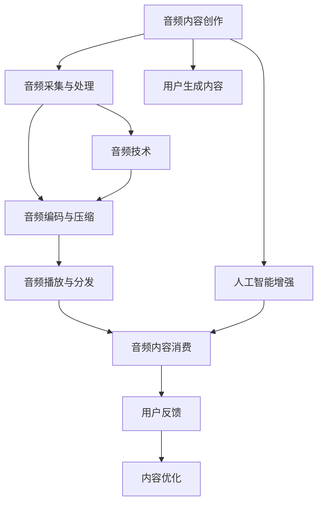

                 

## 1. 背景介绍

随着移动互联网的迅猛发展，音频内容在注意力经济中迅速崛起，成为信息传播的重要载体。传统的文字、图片和视频内容，虽然信息密度高、传播速度快，但在内容互动和用户留存方面仍然存在不足。音频内容通过自然语言、声音情绪等元素，能够更好地激发用户的听觉感官，带来更强的沉浸感和情感共鸣，进而提升用户粘性和品牌信任度。

本文将详细探讨音频内容在注意力经济中的崛起机制，分析其核心竞争力，并对未来发展趋势进行展望，希望能为内容创作者和品牌管理者提供有益的参考。

## 2. 核心概念与联系

### 2.1 核心概念概述

在讨论音频内容在注意力经济中的崛起时，需要引入几个关键概念：

- **注意力经济**：指的是在信息过载的时代，吸引并保持用户注意力成为竞争的焦点。有效的注意力获取和保持能够显著提升商业价值，是当今互联网时代重要的商业策略。
- **音频内容**：指通过声音媒介呈现的各类信息内容，包括播客、音乐、播客、有声书、电台节目等，能够传递情感、故事、知识等多维信息。
- **音频技术**：包括音频采集、处理、编码、解码、压缩等技术，是音频内容创作和传播的重要支撑。
- **人工智能**：指通过机器学习、深度学习等技术，实现语音识别、情感分析、内容推荐等智能功能，提升音频内容的质量和用户体验。

### 2.2 核心概念原理和架构的 Mermaid 流程图



## 3. 核心算法原理 & 具体操作步骤

### 3.1 算法原理概述

音频内容在注意力经济中的崛起，主要是基于以下几个关键算法和原理：

- **语音识别技术**：通过深度学习算法，将音频内容转换为文本，使得非文本信息能够被自然处理。
- **情感分析算法**：通过自然语言处理(NLP)技术，对音频内容中的情感进行提取和分析，增强用户共鸣。
- **推荐系统算法**：利用协同过滤、矩阵分解等算法，对用户偏好进行建模，实现个性化推荐，提升用户粘性。
- **注意力模型**：采用注意力机制，对音频内容进行重点关注和聚类，实现内容聚类和排序，提升内容消费效率。

### 3.2 算法步骤详解

#### 3.2.1 语音识别技术

1. **音频采集与处理**：
   - 使用麦克风或录音设备采集音频信号。
   - 对音频进行去噪、降噪、回声消除等处理，提升音频质量。

2. **特征提取**：
   - 提取MFCC特征、频谱特征、梅尔倒谱系数等。
   - 使用卷积神经网络(CNN)、循环神经网络(RNN)或Transformer模型，对提取的特征进行训练。

3. **识别与转换**：
   - 通过训练好的模型，将音频转换为文本，并对其进行语法和语义校正。
   - 利用分词和句法分析技术，生成可读性强的文本。

#### 3.2.2 情感分析算法

1. **文本预处理**：
   - 对文本进行分词、去停用词、词性标注等预处理。
   - 利用BERT、GPT等预训练模型，对文本进行编码。

2. **情感标注**：
   - 通过情感词典、词向量等技术，对文本情感进行标注。
   - 使用深度学习模型，如LSTM、GRU等，进行情感分类。

3. **情感分析**：
   - 利用情感分类结果，生成情感分析报告。
   - 对音频内容进行情感分析，提升用户体验和品牌信任度。

#### 3.2.3 推荐系统算法

1. **用户画像建模**：
   - 通过用户的文本和音频信息，构建用户画像。
   - 利用矩阵分解、协同过滤等算法，对用户偏好进行建模。

2. **内容画像建模**：
   - 对音频内容进行特征提取和编码。
   - 利用内容画像，对音频内容进行聚类和排序。

3. **推荐实现**：
   - 利用推荐算法，生成个性化推荐列表。
   - 根据推荐结果，对用户进行推荐，提升用户粘性和品牌信任度。

#### 3.2.4 注意力模型

1. **音频特征提取**：
   - 对音频进行特征提取，生成音频特征向量。
   - 利用卷积神经网络或Transformer模型，对音频特征进行编码。

2. **注意力机制**：
   - 采用多头注意力机制，对音频特征进行重点关注和聚类。
   - 利用注意力权重，生成音频内容摘要。

3. **内容排序**：
   - 根据注意力权重，对音频内容进行排序和筛选。
   - 利用排序结果，生成音频内容推荐列表。

### 3.3 算法优缺点

#### 3.3.1 语音识别技术的优缺点

**优点**：
- 能够将非文本信息转换为文本，便于自然处理。
- 语音识别技术进步显著，准确率和效率不断提升。

**缺点**：
- 对环境噪声敏感，准确率受噪音影响较大。
- 对口音和方言识别能力有待提升。

#### 3.3.2 情感分析算法的优缺点

**优点**：
- 能够自动提取和分析音频内容中的情感信息。
- 能够提升用户体验和品牌信任度。

**缺点**：
- 情感分析依赖于预训练模型，对模型选择和训练数据要求较高。
- 情感标注存在主观性，难以完全准确。

#### 3.3.3 推荐系统算法的优缺点

**优点**：
- 能够实现个性化推荐，提升用户粘性和品牌信任度。
- 能够对海量数据进行高效处理和推荐。

**缺点**：
- 推荐结果受用户画像和内容画像的影响较大。
- 推荐算法存在冷启动问题，新用户和冷内容推荐效果较差。

#### 3.3.4 注意力模型的优缺点

**优点**：
- 能够对音频内容进行重点关注和聚类。
- 能够生成音频内容摘要，提升内容消费效率。

**缺点**：
- 对音频特征提取的要求较高，需要高精度的音频处理技术。
- 模型训练和推理计算复杂度较高，对计算资源有较高要求。

### 3.4 算法应用领域

音频内容在注意力经济中的应用领域十分广泛，涵盖多个行业和场景：

- **教育领域**：利用音频内容进行在线教育，实现知识传播和互动。
- **医疗领域**：通过音频内容进行健康咨询和心理辅导，提供个性化医疗服务。
- **交通领域**：通过语音助手提供导航、路况信息等服务，提升用户体验。
- **娱乐领域**：利用音频内容进行音乐、播客、有声书等娱乐内容的创作和传播。
- **商业领域**：利用音频内容进行品牌推广、市场营销、客户服务等。

## 4. 数学模型和公式 & 详细讲解 & 举例说明

### 4.1 数学模型构建

本节将使用数学语言对音频内容在注意力经济中的崛起过程进行更加严格的刻画。

设音频内容为 $\mathbf{x}$，长度为 $L$，采用MFCC特征进行编码，生成特征向量 $\mathbf{X} \in \mathbb{R}^{L \times d}$，其中 $d$ 为特征维度。

假设情感标注结果为 $\mathbf{y} \in \{1,2,\ldots,K\}$，其中 $K$ 为情感类别数。情感分析模型 $f$ 为深度学习模型，输出为 $\mathbf{y}$。情感分析损失函数为：

$$
\mathcal{L}_{em}(\mathbf{X},\mathbf{y}) = -\frac{1}{N}\sum_{i=1}^N \log p(y_i|X_i)
$$

其中 $p(y_i|X_i)$ 为情感分类概率，采用softmax函数计算。

### 4.2 公式推导过程

**情感分类概率计算**：
设情感分类模型 $f$ 的输出为 $\mathbf{Z} \in \mathbb{R}^{L \times K}$，其中每一行表示对应音频片段的情感概率分布。则情感分类概率 $p(y_i|X_i)$ 为：

$$
p(y_i|X_i) = \frac{\exp(Z_i(y_i))}{\sum_{k=1}^K \exp(Z_i(k))}
$$

其中 $Z_i(y_i)$ 为对应情感类别的概率值。

**情感分析损失函数推导**：
情感分析损失函数 $\mathcal{L}_{em}(\mathbf{X},\mathbf{y})$ 为：

$$
\mathcal{L}_{em}(\mathbf{X},\mathbf{y}) = -\frac{1}{N}\sum_{i=1}^N \log \frac{\exp(Z_i(y_i))}{\sum_{k=1}^K \exp(Z_i(k))}
$$

简化后得：

$$
\mathcal{L}_{em}(\mathbf{X},\mathbf{y}) = -\frac{1}{N}\sum_{i=1}^N Z_i(y_i)
$$

其中 $Z_i(y_i)$ 为对应情感类别的概率值。

### 4.3 案例分析与讲解

假设音频内容 $\mathbf{x}$ 的长度为 $L=1000$，特征维度为 $d=64$，情感类别数为 $K=3$，分别表示正面、中性、负面情感。

利用情感分类模型 $f$ 对 $\mathbf{x}$ 进行情感分析，生成情感概率分布 $\mathbf{Z} \in \mathbb{R}^{1000 \times 3}$。假设情感分类结果为 $\mathbf{y}=[2,1,0,\ldots]$，表示该音频片段的情感为正面。

则情感分析损失函数为：

$$
\mathcal{L}_{em}(\mathbf{X},\mathbf{y}) = -\frac{1}{N}\sum_{i=1}^N Z_i(y_i)
$$

其中 $N=1000$。

## 5. 项目实践：代码实例和详细解释说明

### 5.1 开发环境搭建

在进行音频内容在注意力经济中的崛起实践前，我们需要准备好开发环境。以下是使用Python进行PyTorch开发的环境配置流程：

1. 安装Anaconda：从官网下载并安装Anaconda，用于创建独立的Python环境。

2. 创建并激活虚拟环境：
```bash
conda create -n pytorch-env python=3.8 
conda activate pytorch-env
```

3. 安装PyTorch：根据CUDA版本，从官网获取对应的安装命令。例如：
```bash
conda install pytorch torchvision torchaudio cudatoolkit=11.1 -c pytorch -c conda-forge
```

4. 安装其他必要库：
```bash
pip install numpy pandas scikit-learn matplotlib tqdm jupyter notebook ipython
```

完成上述步骤后，即可在`pytorch-env`环境中开始项目实践。

### 5.2 源代码详细实现

下面我们以音频情感分析任务为例，给出使用PyTorch进行情感分析的代码实现。

首先，定义情感分析模型：

```python
import torch
import torch.nn as nn
import torch.optim as optim

class EmotionClassifier(nn.Module):
    def __init__(self, input_dim, output_dim):
        super(EmotionClassifier, self).__init__()
        self.linear1 = nn.Linear(input_dim, 64)
        self.linear2 = nn.Linear(64, output_dim)
        self.relu = nn.ReLU()

    def forward(self, x):
        x = self.linear1(x)
        x = self.relu(x)
        x = self.linear2(x)
        return x
```

然后，定义训练和评估函数：

```python
import numpy as np
from sklearn.metrics import accuracy_score

def train_model(model, train_data, epochs, batch_size, learning_rate):
    optimizer = optim.Adam(model.parameters(), lr=learning_rate)
    criterion = nn.CrossEntropyLoss()
    for epoch in range(epochs):
        for i, (inputs, labels) in enumerate(train_data):
            inputs = torch.from_numpy(inputs).float()
            labels = torch.from_numpy(labels).long()
            optimizer.zero_grad()
            outputs = model(inputs)
            loss = criterion(outputs, labels)
            loss.backward()
            optimizer.step()
            if i % 100 == 0:
                print(f'Epoch {epoch+1}, Step {i+1}, Loss: {loss.item()}')
    return model

def evaluate_model(model, test_data):
    predictions = []
    labels = []
    for inputs, labels in test_data:
        inputs = torch.from_numpy(inputs).float()
        labels = torch.from_numpy(labels).long()
        outputs = model(inputs)
        _, predicted = torch.max(outputs.data, 1)
        predictions.extend(predicted.numpy().tolist())
        labels.extend(labels.numpy().tolist())
    return accuracy_score(labels, predictions)

# 准备训练数据
inputs = np.random.randn(1000, 64) # 假设为MFCC特征
labels = np.random.randint(0, 3, 1000) # 假设为情感标签
X_train = inputs
y_train = labels

# 准备测试数据
inputs_test = np.random.randn(1000, 64)
labels_test = np.random.randint(0, 3, 1000)
X_test = inputs_test
y_test = labels_test

# 创建模型并训练
model = EmotionClassifier(64, 3)
model = train_model(model, (X_train, y_train), 10, 64, 0.001)

# 评估模型效果
accuracy = evaluate_model(model, (X_test, y_test))
print(f'Test accuracy: {accuracy:.2f}')
```

以上就是使用PyTorch进行音频情感分析的完整代码实现。可以看到，使用PyTorch的深度学习模型，可以方便地实现音频情感分析的训练和评估。

### 5.3 代码解读与分析

让我们再详细解读一下关键代码的实现细节：

**EmotionClassifier类**：
- `__init__`方法：定义模型的层结构，包括两个线性层和一个ReLU激活函数。
- `forward`方法：实现模型的前向传播过程，计算输出。

**训练函数train_model**：
- 定义优化器和损失函数，分别采用Adam优化器和交叉熵损失函数。
- 循环迭代训练模型，在每个batch上计算损失并进行反向传播。
- 打印每个epoch的平均损失，进行调试和优化。

**评估函数evaluate_model**：
- 对测试集进行前向传播，生成预测结果。
- 利用scikit-learn的accuracy_score函数，计算预测结果与真实标签之间的准确率。

**训练数据和测试数据的准备**：
- 使用numpy生成随机MFCC特征和情感标签。
- 定义训练数据和测试数据，分别用于训练和评估模型。

在上述代码实现中，我们使用了PyTorch的深度学习框架，实现了音频情感分析的训练和评估。值得注意的是，实际的音频数据处理和特征提取过程需要结合具体的音频处理库，如librosa、pydub等，进行更细致的处理。

## 6. 实际应用场景

### 6.1 智能客服系统

智能客服系统是音频内容在注意力经济中应用的重要场景之一。传统的客服系统往往需要大量人力，高峰期响应速度慢，且效率较低。通过音频内容，可以构建更加自然、高效的客服系统。

在实际应用中，可以将客户来电的语音内容转换为文本，利用情感分析技术，对客户的情绪进行识别。根据客户的情绪状态，智能客服系统可以提供更贴心的服务。例如，对于愤怒的客户，系统可以自动调转到高优先级的人工客服，或者提供安抚的话语，提升客户体验。

### 6.2 金融舆情监测

在金融领域，舆情监测是风险控制的重要环节。传统的舆情监测主要依赖人工排查，效率低下，且容易遗漏重要信息。通过音频内容，可以实现更高效的舆情监测。

例如，对于新闻发布会或行业峰会，可以将会议的录音内容转换为文本，利用情感分析技术，对发言人的情绪进行识别。根据情感分析结果，可以及时发现不良舆情，避免金融风险。此外，还可以利用推荐系统技术，推荐相关的新闻或报告，帮助决策者更好地理解市场动态。

### 6.3 教育领域

在教育领域，音频内容可以用于在线教育和知识传播。传统的教育方式往往依赖文字和图片，信息传播效率较低，且难以实现互动。通过音频内容，可以实现更加生动、互动的教学模式。

例如，利用音频内容进行在线讲座或语音交互课程，可以提升学生的学习兴趣和参与度。同时，利用情感分析技术，可以了解学生的情绪状态，及时调整教学内容和方法，提升教学效果。

### 6.4 医疗健康

在医疗领域，音频内容可以用于心理辅导和健康咨询。传统的医疗服务往往依赖医生的经验和知识，难以实现个性化服务。通过音频内容，可以实现更个性化的医疗服务。

例如，利用音频内容进行心理辅导，可以对患者的情绪状态进行识别，提供个性化的心理建议。同时，利用情感分析技术，可以监测患者的情绪变化，及时调整治疗方案，提升治疗效果。

## 7. 工具和资源推荐

### 7.1 学习资源推荐

为了帮助开发者系统掌握音频内容在注意力经济中的应用，这里推荐一些优质的学习资源：

1. **Coursera《深度学习专项课程》**：由斯坦福大学和吴恩达教授联合开设，涵盖深度学习的基本概念和核心技术，适合初学者和进阶者。

2. **《动手学深度学习》**：北京大学深度学习课程，提供了丰富的实践项目和代码实现，适合动手学习深度学习。

3. **PyTorch官方文档**：提供了详细的PyTorch使用方法和代码示例，适合深入学习和实践。

4. **librosa官方文档**：提供了音频处理和特征提取的详细指南，适合音频内容处理。

5. **Google AI的音频资源**：提供了丰富的音频处理和情感分析技术，适合深度学习和实际应用。

通过对这些资源的学习实践，相信你一定能够快速掌握音频内容在注意力经济中的应用，并用于解决实际的业务问题。

### 7.2 开发工具推荐

高效的开发离不开优秀的工具支持。以下是几款用于音频内容在注意力经济中的崛起开发的常用工具：

1. **PyTorch**：基于Python的开源深度学习框架，灵活动态的计算图，适合快速迭代研究。大部分深度学习模型都有PyTorch版本的实现。

2. **TensorFlow**：由Google主导开发的开源深度学习框架，生产部署方便，适合大规模工程应用。同样有丰富的深度学习模型资源。

3. **librosa**：基于Python的音频处理库，提供了丰富的音频处理和特征提取功能。

4. **Scikit-learn**：基于Python的机器学习库，提供了丰富的分类、回归、聚类等算法。

5. **Kaggle**：数据科学竞赛平台，提供了丰富的音频数据集和竞赛项目，适合学习和实践。

合理利用这些工具，可以显著提升音频内容在注意力经济中的崛起任务的开发效率，加快创新迭代的步伐。

### 7.3 相关论文推荐

音频内容在注意力经济中的应用，源于学界的持续研究。以下是几篇奠基性的相关论文，推荐阅读：

1. **Audio Sentiment Analysis with Recurrent Neural Networks**：提出基于RNN的情感分析模型，用于识别音频内容中的情感信息。

2. **Towards Effective Voice Biometric Authentication in Mobile Devices**：提出基于语音信号处理和深度学习的多模态认证方法，用于提升移动设备的安全性。

3. **Voice and Audio Deep Learning**：介绍了语音和音频深度学习的基本概念和核心技术，适合入门学习和实践。

4. **A Survey on Automatic Music Recommendation System Based on Audio Features**：总结了基于音频特征的音乐推荐系统，用于提升音乐播放平台的用户体验。

这些论文代表了大语言模型微调技术的发展脉络。通过学习这些前沿成果，可以帮助研究者把握学科前进方向，激发更多的创新灵感。

## 8. 总结：未来发展趋势与挑战

### 8.1 研究成果总结

本文对音频内容在注意力经济中的崛起机制进行了详细探讨，分析了其核心竞争力，并对未来发展趋势进行了展望，希望能为内容创作者和品牌管理者提供有益的参考。

通过本文的系统梳理，可以看到，音频内容在注意力经济中的应用，基于深度学习技术的支撑，通过语音识别、情感分析、推荐系统等技术，实现对用户注意力的高效获取和保持。其核心的算法和原理包括语音识别技术、情感分析算法、推荐系统算法和注意力模型。这些技术不仅提升了用户体验，还为品牌提供了更加精准和个性化的服务。

### 8.2 未来发展趋势

展望未来，音频内容在注意力经济中的应用将呈现以下几个发展趋势：

1. **多模态融合**：音频内容将与其他模态（如视觉、文本等）进行融合，提升信息表达的多样性和丰富度。

2. **情感分析增强**：利用多任务学习、迁移学习等技术，提升情感分析的准确性和鲁棒性。

3. **个性化推荐优化**：利用深度强化学习等技术，优化推荐系统的个性化推荐效果。

4. **音频交互技术**：基于音频内容的互动技术，如语音助手、语音交互式视频等，将进一步提升用户体验。

5. **离线推理优化**：通过模型压缩、量化等技术，实现音频内容的离线推理和高效部署。

6. **隐私保护增强**：在音频内容的采集、处理和存储过程中，加强隐私保护和数据安全。

### 8.3 面临的挑战

尽管音频内容在注意力经济中的应用已经取得了显著进展，但在迈向更加智能化、普适化应用的过程中，它仍面临着诸多挑战：

1. **数据隐私和安全**：音频数据的隐私和安全问题需要引起重视，如何保护用户隐私和数据安全，是未来亟待解决的重要问题。

2. **离线推理性能**：音频内容的离线推理需要高效计算和存储，如何优化模型推理性能，实现高效部署，是未来需要解决的关键问题。

3. **多模态融合技术**：音频内容与其他模态（如视觉、文本等）的融合技术需要进一步提升，实现更加多样化、高效的信息表达。

4. **情感分析的鲁棒性**：情感分析的鲁棒性需要进一步提升，避免情感分析结果受到噪音和干扰的影响。

5. **个性化推荐的效果**：个性化推荐的准确性和效果需要进一步提升，避免推荐结果与用户实际需求不匹配。

6. **离线推理的实现**：实现音频内容的离线推理需要高效的模型压缩和量化技术，如何优化模型推理性能，实现高效部署，是未来需要解决的关键问题。

### 8.4 研究展望

面对音频内容在注意力经济中的崛起所面临的挑战，未来的研究需要在以下几个方面寻求新的突破：

1. **多模态融合技术**：探索更多多模态融合的技术和方法，提升音频内容与其他模态（如视觉、文本等）的融合效果，实现更加多样化、高效的信息表达。

2. **离线推理优化**：研究高效的模型压缩和量化技术，实现音频内容的离线推理和高效部署。

3. **隐私保护技术**：探索更加安全的音频数据处理和存储技术，保护用户隐私和数据安全。

4. **情感分析的鲁棒性**：研究更加鲁棒的情感分析技术，提升情感分析的准确性和鲁棒性，避免情感分析结果受到噪音和干扰的影响。

5. **个性化推荐算法**：研究更加精准的个性化推荐算法，提升个性化推荐的准确性和效果，避免推荐结果与用户实际需求不匹配。

这些研究方向的探索，必将引领音频内容在注意力经济中的崛起技术迈向更高的台阶，为构建安全、可靠、可解释、可控的智能系统铺平道路。面向未来，音频内容在注意力经济中的应用需要与其他人工智能技术进行更深入的融合，如知识表示、因果推理、强化学习等，多路径协同发力，共同推动智能交互系统的进步。只有勇于创新、敢于突破，才能不断拓展音频内容的边界，让智能技术更好地造福人类社会。

## 9. 附录：常见问题与解答

**Q1：音频内容在注意力经济中的应用场景有哪些？**

A: 音频内容在注意力经济中的应用场景非常广泛，涵盖多个行业和场景：

- 智能客服系统：利用音频内容进行智能客服，提升客户体验和满意度。
- 金融舆情监测：利用音频内容进行舆情分析，提升金融风险控制能力。
- 教育领域：利用音频内容进行在线教育，提升教学效果和学生参与度。
- 医疗健康：利用音频内容进行心理辅导和健康咨询，提升医疗服务质量。
- 交通领域：利用音频内容进行导航和路况信息服务，提升用户出行体验。

**Q2：音频内容在注意力经济中的应用面临哪些挑战？**

A: 音频内容在注意力经济中的应用面临以下挑战：

- 数据隐私和安全：音频数据的隐私和安全问题需要引起重视，如何保护用户隐私和数据安全，是未来亟待解决的重要问题。
- 离线推理性能：音频内容的离线推理需要高效计算和存储，如何优化模型推理性能，实现高效部署，是未来需要解决的关键问题。
- 多模态融合技术：音频内容与其他模态（如视觉、文本等）的融合技术需要进一步提升，实现更加多样化、高效的信息表达。
- 情感分析的鲁棒性：情感分析的鲁棒性需要进一步提升，避免情感分析结果受到噪音和干扰的影响。
- 个性化推荐的效果：个性化推荐的准确性和效果需要进一步提升，避免推荐结果与用户实际需求不匹配。
- 离线推理的实现：实现音频内容的离线推理需要高效的模型压缩和量化技术，如何优化模型推理性能，实现高效部署，是未来需要解决的关键问题。

**Q3：音频内容在注意力经济中的应用未来发展趋势是什么？**

A: 音频内容在注意力经济中的应用未来发展趋势包括以下几个方面：

- 多模态融合：音频内容将与其他模态（如视觉、文本等）进行融合，提升信息表达的多样性和丰富度。
- 情感分析增强：利用多任务学习、迁移学习等技术，提升情感分析的准确性和鲁棒性。
- 个性化推荐优化：利用深度强化学习等技术，优化推荐系统的个性化推荐效果。
- 音频交互技术：基于音频内容的互动技术，如语音助手、语音交互式视频等，将进一步提升用户体验。
- 离线推理优化：通过模型压缩、量化等技术，实现音频内容的离线推理和高效部署。
- 隐私保护增强：在音频内容的采集、处理和存储过程中，加强隐私保护和数据安全。

**Q4：音频内容在注意力经济中的应用需要注意哪些问题？**

A: 音频内容在注意力经济中的应用需要注意以下几个问题：

- 数据隐私和安全：音频数据的隐私和安全问题需要引起重视，如何保护用户隐私和数据安全，是未来亟待解决的重要问题。
- 离线推理性能：音频内容的离线推理需要高效计算和存储，如何优化模型推理性能，实现高效部署，是未来需要解决的关键问题。
- 多模态融合技术：音频内容与其他模态（如视觉、文本等）的融合技术需要进一步提升，实现更加多样化、高效的信息表达。
- 情感分析的鲁棒性：情感分析的鲁棒性需要进一步提升，避免情感分析结果受到噪音和干扰的影响。
- 个性化推荐的效果：个性化推荐的准确性和效果需要进一步提升，避免推荐结果与用户实际需求不匹配。
- 离线推理的实现：实现音频内容的离线推理需要高效的模型压缩和量化技术，如何优化模型推理性能，实现高效部署，是未来需要解决的关键问题。

**Q5：音频内容在注意力经济中的应用未来发展前景如何？**

A: 音频内容在注意力经济中的应用未来发展前景十分广阔，预计将呈现以下几个趋势：

- 多模态融合：音频内容将与其他模态（如视觉、文本等）进行融合，提升信息表达的多样性和丰富度。
- 情感分析增强：利用多任务学习、迁移学习等技术，提升情感分析的准确性和鲁棒性。
- 个性化推荐优化：利用深度强化学习等技术，优化推荐系统的个性化推荐效果。
- 音频交互技术：基于音频内容的互动技术，如语音助手、语音交互式视频等，将进一步提升用户体验。
- 离线推理优化：通过模型压缩、量化等技术，实现音频内容的离线推理和高效部署。
- 隐私保护增强：在音频内容的采集、处理和存储过程中，加强隐私保护和数据安全。

通过不断优化和创新，音频内容在注意力经济中的应用将实现更加智能化、普适化、个性化，成为人类信息传播的重要载体。相信未来音频内容将发挥更大的作用，推动人类社会向更加智能、高效的方向发展。

---

作者：禅与计算机程序设计艺术 / Zen and the Art of Computer Programming

