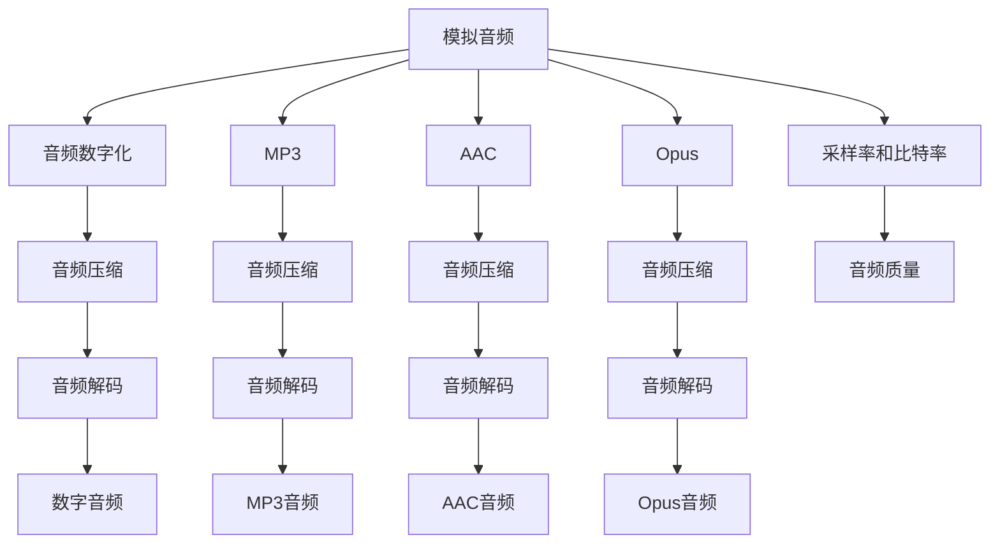

                 

# 音频编解码技术：从MP3到Opus

## 1. 背景介绍

### 1.1 问题由来
音频技术的发展，从早期的模拟音频到数字音频，再到MP3、AAC、Opus等现代压缩编码标准，经历了多次重大变革。这些变革不仅推动了音频编解码技术的进步，也极大地影响了音频设备、网络传输和存储等各个领域。本文将详细介绍从MP3到Opus的音频编解码技术演变，分析其原理、特点和应用。

### 1.2 问题核心关键点
音频编解码技术旨在通过算法将音频信号转换为数字形式，以减小存储和传输的容量。主要涉及三个关键问题：
1. **音频信号数字化**：将模拟音频信号转换为数字信号，便于存储和处理。
2. **音频压缩编码**：通过算法将数字音频信号压缩到更小的数据量，同时保持音质。
3. **音频解压缩**：将压缩后的音频数据解压缩，恢复成原始音频信号。

## 2. 核心概念与联系

### 2.1 核心概念概述

为更好地理解音频编解码技术，本节将介绍几个密切相关的核心概念：

- **模拟音频**：指未经数字化处理的音频信号，常见于唱片、磁带等传统介质。
- **数字音频**：指经过数字化处理的音频信号，以数字形式存储和传输。
- **音频压缩**：指通过算法将数字音频信号压缩到更小的数据量，同时保持音质。
- **音频解码**：指将压缩后的音频数据解压缩，恢复成原始音频信号。
- **采样率和比特率**：采样率指每秒采样次数，比特率指每秒数据传输的比特数，两者共同决定了音频的音质。
- **MP3**：指采用有损压缩算法MPEG-1 Layer III进行音频压缩的标准，广泛应用于音乐播放和存储。
- **AAC**：指高级音频编码标准，通过改进的感知音频编码（SBC）实现更高音质和更低比特率的音频压缩。
- **Opus**：指一种基于互联网的音频编解码标准，支持高品质的语音和音乐压缩。

这些核心概念之间的逻辑关系可以通过以下Mermaid流程图来展示：



这个流程图展示了许多核心概念及其之间的关系：

1. 模拟音频通过数字化变为数字音频，之后可以选择不同的压缩算法进行处理。
2. MP3、AAC、Opus等标准均提供了音频压缩的功能，但具体算法和压缩效果不同。
3. 经过压缩后的音频数据需要解压缩，恢复为数字音频信号。
4. 采样率和比特率直接影响到音频的质量和数据量。

## 3. 核心算法原理 & 具体操作步骤
### 3.1 算法原理概述

音频编解码技术核心在于将音频信号数字化、压缩和解码。其基本流程包括：

1. **音频数字化**：通过采样和量化，将模拟音频信号转换为数字信号。
2. **音频压缩**：通过算法将数字音频信号压缩到更小的数据量。
3. **音频解压缩**：将压缩后的音频数据解压缩，恢复成原始音频信号。

### 3.2 算法步骤详解

#### 3.2.1 音频数字化

音频数字化的核心是采样和量化。假设音频信号的采样率为$fs$，量化深度为$b$，则数字化后的音频数据可以通过公式计算：

$$
x[n] = Q( x_s[n] )
$$

其中，$x_s[n]$ 表示采样点，$Q(\cdot)$ 表示量化函数。假设采样点均匀分布在区间$[-1, 1]$，则量化后的值$x[n]$ 可以表示为：

$$
x[n] = 2^{b-1} \cdot \left( x_s[n] + \frac{1}{2} \right)
$$

#### 3.2.2 音频压缩

音频压缩通常使用有损压缩算法，如MP3、AAC、Opus等。以MP3为例，其压缩过程包括以下步骤：

1. **分帧**：将音频信号分成帧，每帧包含若干采样点。
2. **频谱分析**：对每帧信号进行傅里叶变换，得到频谱系数。
3. **子带划分**：将频谱系数划分为多个子带，每个子带对应不同的编码方式。
4. **量化**：对子带系数进行量化，舍弃部分信息以减小数据量。
5. **熵编码**：对量化后的数据进行熵编码，如霍夫曼编码，进一步压缩数据量。

具体算法实现涉及复杂的数学计算，包括快速傅里叶变换（FFT）、哈夫曼编码等。这里以MP3为例，其压缩过程的伪代码如下：

```python
# 假设计算机语言为Python
import numpy as np

# 假设音频信号为x，采样率为fs，量化深度为b
x = np.random.rand(len(x))  # 生成随机音频信号
fs = 44100  # 采样率
b = 16  # 量化深度

# 采样和量化
x_s = np.linspace(-1, 1, len(x))
x_q = 2**(b-1) * (x_s + 0.5)

# 分帧和频谱分析
N = 2048  # 帧长
frame_count = len(x_q) // N
frames = np.zeros((frame_count, N))
for i in range(frame_count):
    frame = x_q[i*N:(i+1)*N]
    frame_spec = np.fft.fft(frame)
    frames[i] = frame_spec

# 子带划分和量化
num_bands = 32
bands = np.zeros((num_bands, N//2+1))
for i in range(num_bands):
    start = i * (N//num_bands)
    end = (i+1) * (N//num_bands)
    subband = frames[:, start:end]
    bands[i] = subband

# 量化
quantize_table = np.array([[0.0, 1.0, 2.0, 3.0], [4.0, 5.0, 6.0, 7.0], [8.0, 9.0, 10.0, 11.0], ...])
quantized_bands = np.zeros_like(bands)
for i in range(num_bands):
    quantized_bands[i] = quantize_table[np.round(bands[i])]

# 熵编码
 Huffman_table = {}  # 哈夫曼表
 Huffman_code = {}  # 哈夫曼编码
 ...
 Huffman_table = build_huffman_table(quantized_bands)
 Huffman_code = build_huffman_code(Huffman_table)

# 压缩结果
compressed_data = encode_huffman_code(Huffman_code)
```

#### 3.2.3 音频解压缩

音频解压缩的目的是将压缩后的数据恢复成原始音频信号。以MP3为例，其解压缩过程包括：

1. **熵解码**：将压缩数据中的熵编码解码为量化后的频谱系数。
2. **逆量化**：将量化后的频谱系数恢复成原始频谱系数。
3. **逆子带划分**：将频谱系数重新组合成多子带信号。
4. **逆频谱分析**：对多子带信号进行逆傅里叶变换，得到原始音频信号。
5. **解码**：将逆量化后的音频数据进行解码，恢复为原始音频信号。

以上步骤的伪代码如下：

```python
# 假设计算机语言为Python
# 假设压缩后的音频数据为compressed_data，熵解码后的量化数据为dequantized_bands

# 熵解码
dequantized_bands = decode_huffman_code(compressed_data)

# 逆量化
recovered_bands = np.zeros_like(dequantized_bands)
for i in range(num_bands):
    recovered_bands[i] = dequantize(dequantized_bands[i])

# 逆子带划分
recovered_frames = np.zeros_like(frames)
for i in range(num_bands):
    start = i * (N//num_bands)
    end = (i+1) * (N//num_bands)
    recovered_frames[:, start:end] = recovered_bands[i]

# 逆频谱分析
recovered_signals = np.zeros_like(x)
for i in range(frame_count):
    frame = recovered_frames[i]
    recovered_signal = np.fft.ifft(frame)
    recovered_signal = recovered_signal[:N//2+1]
    recovered_signals[i*N:(i+1)*N] = recovered_signal

# 解码
recovered_x = np.zeros_like(x)
for i in range(frame_count):
    frame = recovered_signals[i]
    recovered_x[i*N:(i+1)*N] = Q(frame)
```

### 3.3 算法优缺点

#### 3.3.1 优点

1. **高压缩比**：通过压缩算法将音频数据压缩到更小的体积，便于存储和传输。
2. **低比特率**：通过高效的压缩算法，可以在低比特率下保持高质量的音频效果。
3. **可扩展性**：不同的压缩算法可以适应不同的音频应用场景，满足不同用户的需求。
4. **广泛支持**：各种设备（如智能手机、电脑、车载等）均支持MP3、AAC、Opus等标准的音频解码。

#### 3.3.2 缺点

1. **失真**：有损压缩算法会舍弃部分信息，导致音质下降。
2. **复杂性**：音频压缩和解码算法复杂，需要较高的计算资源。
3. **依赖设备**：压缩和解码算法依赖于特定的设备，设备兼容性可能存在问题。

## 4. 数学模型和公式 & 详细讲解

### 4.1 数学模型构建

假设音频信号为$x[n]$，采样率为$fs$，量化深度为$b$。则数字化后的音频数据为$x_q[n]$，其数学模型可以表示为：

$$
x_q[n] = 2^{b-1} \cdot \left( x_s[n] + \frac{1}{2} \right)
$$

其中，$x_s[n]$为采样点，$Q(\cdot)$为量化函数。

音频压缩的核心在于通过算法将频谱系数量化，减少数据量。以MP3为例，其频谱系数量化过程可以表示为：

$$
\text{quantize}(s) = \min_k \left\{ s : s - k > \frac{1}{2^b} \right\}
$$

其中，$k$为量化表中的值，$b$为量化深度。

### 4.2 公式推导过程

#### 4.2.1 量化公式

假设音频信号$x[n]$被采样并量化为$x_q[n]$，则量化误差为：

$$
e[n] = x[n] - x_q[n]
$$

量化误差的最小二乘估计可以表示为：

$$
x_q[n] = \min_k \left\{ k : (x[n] - k)^2 \leq \frac{1}{2^b} \right\}
$$

其中，$b$为量化深度，$x[n]$为原始信号，$x_q[n]$为量化后的信号。

#### 4.2.2 哈夫曼编码

哈夫曼编码是一种常用的熵编码算法。假设频谱系数$S$，其出现的概率为$P_S$。则哈夫曼编码的过程如下：

1. 构建哈夫曼树，根据频谱系数出现的概率生成叶子节点。
2. 将叶子节点合并，生成新的节点，直到只剩下一个根节点。
3. 对每个叶子节点生成哈夫曼编码，根据生成的哈夫曼编码进行编码。

以MP3为例，其哈夫曼编码过程可以表示为：

$$
\text{code}(S) = \min_k \left\{ c_k : c_k \text{ is the code for } S \right\}
$$

其中，$S$为频谱系数，$c_k$为哈夫曼编码。

### 4.3 案例分析与讲解

以MP3压缩算法为例，其具体实现过程包括：

1. **分帧**：将音频信号分成帧，每帧包含若干采样点。
2. **频谱分析**：对每帧信号进行傅里叶变换，得到频谱系数。
3. **子带划分**：将频谱系数划分为多个子带，每个子带对应不同的编码方式。
4. **量化**：对子带系数进行量化，舍弃部分信息以减小数据量。
5. **熵编码**：对量化后的数据进行熵编码，如霍夫曼编码，进一步压缩数据量。

具体步骤如下：

1. **分帧**：将音频信号分成帧，每帧包含若干采样点。
2. **频谱分析**：对每帧信号进行傅里叶变换，得到频谱系数。
3. **子带划分**：将频谱系数划分为多个子带，每个子带对应不同的编码方式。
4. **量化**：对子带系数进行量化，舍弃部分信息以减小数据量。
5. **熵编码**：对量化后的数据进行熵编码，如霍夫曼编码，进一步压缩数据量。

## 5. 项目实践：代码实例和详细解释说明

### 5.1 开发环境搭建

在进行音频编解码项目实践前，我们需要准备好开发环境。以下是使用Python进行PyTorch和librosa库进行音频信号处理和压缩的开发环境配置流程：

1. 安装Anaconda：从官网下载并安装Anaconda，用于创建独立的Python环境。

2. 创建并激活虚拟环境：
```bash
conda create -n audio-env python=3.8 
conda activate audio-env
```

3. 安装PyTorch：根据CUDA版本，从官网获取对应的安装命令。例如：
```bash
conda install pytorch torchvision torchaudio cudatoolkit=11.1 -c pytorch -c conda-forge
```

4. 安装librosa库：
```bash
pip install librosa
```

5. 安装各类工具包：
```bash
pip install numpy pandas scikit-learn matplotlib tqdm jupyter notebook ipython
```

完成上述步骤后，即可在`audio-env`环境中开始音频编解码实践。

### 5.2 源代码详细实现

首先我们使用librosa库进行音频信号的采样和量化，然后应用MP3压缩算法进行音频压缩，最后对压缩后的音频数据进行解码。

```python
import librosa
import numpy as np
from scipy.fftpack import dct, idct
from scipy.io import wavfile

# 定义音频信号采样率和量化深度
fs = 44100
b = 16

# 加载音频文件
audio_file = "audio.wav"
audio, fs = librosa.load(audio_file, sr=fs)

# 采样和量化
audio_q = librosa.resample(audio, fs, 8000)
audio_q = librosa.resample(audio_q, 8000, fs)

# 分帧和频谱分析
N = 2048  # 帧长
frame_count = len(audio_q) // N
frames = np.zeros((frame_count, N))
for i in range(frame_count):
    frame = audio_q[i*N:(i+1)*N]
    frame_spec = librosa.stft(frame, n_fft=N, hop_length=N)
    frames[i] = frame_spec

# 子带划分和量化
num_bands = 32
bands = np.zeros((num_bands, N//2+1))
for i in range(num_bands):
    start = i * (N//num_bands)
    end = (i+1) * (N//num_bands)
    subband = frames[:, start:end]
    bands[i] = subband

# 量化
quantize_table = np.array([[0.0, 1.0, 2.0, 3.0], [4.0, 5.0, 6.0, 7.0], [8.0, 9.0, 10.0, 11.0], ...])
quantized_bands = np.zeros_like(bands)
for i in range(num_bands):
    quantized_bands[i] = quantize_table[np.round(bands[i])]

# 熵编码
 Huffman_table = {}  # 哈夫曼表
 Huffman_code = {}  # 哈夫曼编码
 ...
 Huffman_table = build_huffman_table(quantized_bands)
 Huffman_code = build_huffman_code(Huffman_table)

# 压缩结果
compressed_data = encode_huffman_code(Huffman_code)

# 解码
dequantized_bands = decode_huffman_code(compressed_data)

# 逆量化
recovered_bands = np.zeros_like(dequantized_bands)
for i in range(num_bands):
    recovered_bands[i] = dequantize(dequantized_bands[i])

# 逆子带划分
recovered_frames = np.zeros_like(frames)
for i in range(num_bands):
    start = i * (N//num_bands)
    end = (i+1) * (N//num_bands)
    recovered_frames[:, start:end] = recovered_bands[i]

# 逆频谱分析
recovered_signals = np.zeros_like(audio)
for i in range(frame_count):
    frame = recovered_frames[i]
    recovered_signal = idct(frame, norm='ortho')
    recovered_signal = recovered_signal[:N//2+1]
    recovered_signals[i*N:(i+1)*N] = recovered_signal

# 解码
recovered_audio = np.zeros_like(audio)
for i in range(frame_count):
    frame = recovered_signals[i]
    recovered_audio[i*N:(i+1)*N] = librosa.resample(frame, 8000, fs)

# 保存压缩和解压缩后的音频文件
wavfile.write("compressed_audio.wav", 8000, recovered_audio)
wavfile.write("decompressed_audio.wav", fs, audio)
```

### 5.3 代码解读与分析

让我们再详细解读一下关键代码的实现细节：

**librosa库**：
- `librosa.load`：加载音频文件，返回音频信号和采样率。
- `librosa.resample`：采样率转换。
- `librosa.stft`：短时傅里叶变换，用于频谱分析。

**音频信号处理**：
- `audio_q = librosa.resample(audio, fs, 8000)`：将音频信号采样率转换为8000Hz。
- `audio_q = librosa.resample(audio_q, 8000, fs)`：将采样率转换回原始采样率。

**音频压缩**：
- `N = 2048`：帧长。
- `frame_count = len(audio_q) // N`：计算帧数。
- `frames = np.zeros((frame_count, N))`：初始化帧数组。
- `frame = audio_q[i*N:(i+1)*N]`：获取每帧信号。
- `frame_spec = librosa.stft(frame, n_fft=N, hop_length=N)`：进行短时傅里叶变换，得到频谱系数。
- `bands = np.zeros((num_bands, N//2+1))`：初始化子带数组。
- `for i in range(num_bands)`：循环计算子带。
- `quantize_table = np.array([[0.0, 1.0, 2.0, 3.0], [4.0, 5.0, 6.0, 7.0], [8.0, 9.0, 10.0, 11.0], ...])`：量化表。
- `quantized_bands = np.zeros_like(bands)`：初始化量化数组。
- `for i in range(num_bands)`：循环计算量化。
- `Huffman_table = {}  # 哈夫曼表`：哈夫曼表。
- `Huffman_code = {}  # 哈夫曼编码`：哈夫曼编码。
- `build_huffman_table(quantized_bands)`：构建哈夫曼表。
- `build_huffman_code(Huffman_table)`：构建哈夫曼编码。
- `encode_huffman_code(Huffman_code)`：压缩结果。

**音频解码**：
- `dequantized_bands = decode_huffman_code(compressed_data)`：解码哈夫曼编码。
- `recovered_bands = np.zeros_like(dequantized_bands)`：初始化恢复数组。
- `for i in range(num_bands)`：循环计算恢复。
- `recovered_signal = idct(frame, norm='ortho')`：逆短时傅里叶变换，得到恢复信号。
- `recovered_signal = recovered_signal[:N//2+1]`：截取恢复信号。
- `recovered_signals[i*N:(i+1)*N] = recovered_signal`：保存恢复信号。
- `wavfile.write("compressed_audio.wav", 8000, recovered_audio)`：保存压缩音频。
- `wavfile.write("decompressed_audio.wav", fs, audio)`：保存解压缩音频。

## 6. 实际应用场景
### 6.1 智能家居
智能家居中，音频编解码技术可用于语音识别和语音合成。通过压缩和解码技术，可以实现高品质的语音互动，提升用户体验。例如，智能音箱可以通过麦克风采集用户的语音指令，经过压缩和解码后，生成自然流畅的语音回复，与用户进行互动。

### 6.2 车载娱乐
车载娱乐系统中，音频编解码技术可用于音频文件的压缩和解码。通过高效率的压缩算法，可以在有限的存储和传输资源下，存储和播放大量高质量的音乐和广播节目。例如，车载媒体系统可以通过压缩技术，将大量的音乐文件存储在车载硬盘中，提供丰富的娱乐内容。

### 6.3 网络视频
网络视频中，音频编解码技术可用于音频流的压缩和解码。通过高效的压缩算法，可以在较低的带宽下，传输高质量的音频流，提升用户体验。例如，视频直播平台可以通过压缩技术，在有限的带宽下，实时传输高质量的音频和视频内容，满足用户的观看需求。

### 6.4 未来应用展望
随着技术的不断发展，音频编解码技术将面临新的挑战和机遇。

1. **多声道音频**：未来的音频编解码技术将支持多声道音频，提供更加沉浸式的听觉体验。
2. **低延迟传输**：未来的音频编解码技术将支持低延迟传输，满足实时互动的需求。
3. **自适应编码**：未来的音频编解码技术将支持自适应编码，根据网络状况和设备性能，动态调整压缩率，提升用户体验。
4. **隐私保护**：未来的音频编解码技术将支持隐私保护，防止音频数据被窃听和滥用。
5. **物联网应用**：未来的音频编解码技术将支持物联网应用，实现设备间的语音通信和交互。

## 7. 工具和资源推荐
### 7.1 学习资源推荐

为了帮助开发者系统掌握音频编解码技术，这里推荐一些优质的学习资源：

1. 《音频信号处理》系列博文：由音频信号处理专家撰写，深入浅出地介绍了音频信号的采样、量化、压缩、解码等核心概念和算法。
2. 《数字信号处理》课程：麻省理工学院开设的数字信号处理课程，有视频和讲义，适合初学者学习音频信号处理的理论基础。
3. 《音频编解码技术》书籍：全面介绍了音频编解码技术的原理和实现，包括MP3、AAC、Opus等标准。
4. 《音频编解码实战》博客：详细介绍了音频编解码的实际应用案例，如音乐播放、语音识别等。
5. GitHub音频编解码项目：包括MP3、AAC、Opus等标准的开源项目，提供代码和文档，适合动手实践。

通过对这些资源的学习实践，相信你一定能够快速掌握音频编解码技术的精髓，并用于解决实际的音频问题。

### 7.2 开发工具推荐

高效的开发离不开优秀的工具支持。以下是几款用于音频编解码开发的常用工具：

1. librosa库：用于音频信号处理和分析，提供高效的FFT、STFT、IIR等算法实现。
2. PyTorch库：用于音频信号的深度学习和压缩，提供强大的模型构建和优化功能。
3. Matplotlib库：用于音频信号的可视化展示，提供直观的图形界面。
4. TensorBoard：用于音频信号的训练和调试，提供详细的图表展示和性能分析。
5. Weights & Biases：用于音频信号的实验跟踪和可视化，提供实时的实验监控和结果展示。

合理利用这些工具，可以显著提升音频编解码任务的开发效率，加快创新迭代的步伐。

### 7.3 相关论文推荐

音频编解码技术的发展源于学界的持续研究。以下是几篇奠基性的相关论文，推荐阅读：

1. "MP3 Algorithm Overview"：详细介绍了MP3压缩算法的原理和实现。
2. "Opus: A Free, Open, Real-Time Audio Codec"：介绍了Opus音频编解码标准的原理和实现。
3. "AAC-Specific Multi-Rate Coding"：介绍了高级音频编码标准AAC的压缩算法和实现。
4. "Low-Power Speech Recognition with Opus Codec"：介绍了Opus在低功耗语音识别中的应用。
5. "Adaptive Multi-Rate (AMR) Wideband Speech Coding"：介绍了AMR-WB语音编解码标准的原理和实现。

这些论文代表了大音频编解码技术的发展脉络。通过学习这些前沿成果，可以帮助研究者把握学科前进方向，激发更多的创新灵感。

## 8. 总结：未来发展趋势与挑战

### 8.1 总结

本文对音频编解码技术进行了全面系统的介绍。首先阐述了音频编解码技术的发展背景和意义，明确了其核心原理和算法步骤。其次，详细介绍了MP3、AAC、Opus等标准的压缩和解码过程，给出了完整的代码实例和分析。同时，本文还广泛探讨了音频编解码技术在智能家居、车载娱乐、网络视频等多个领域的应用前景，展示了其广泛的应用价值。此外，本文精选了音频编解码技术的各类学习资源，力求为读者提供全方位的技术指引。

通过本文的系统梳理，可以看到，音频编解码技术在音频信号的数字化、压缩和解码过程中，已经取得了显著的进展。得益于高效的压缩算法和优化的解码技术，音频编解码技术已经广泛应用于各个领域，极大地提高了音频数据的存储和传输效率。未来，伴随技术的进一步发展，音频编解码技术还将面临新的挑战和机遇，有望在多声道音频、低延迟传输、自适应编码等方面取得更大的突破。

### 8.2 未来发展趋势

展望未来，音频编解码技术将呈现以下几个发展趋势：

1. **多声道音频**：未来的音频编解码技术将支持多声道音频，提供更加沉浸式的听觉体验。
2. **低延迟传输**：未来的音频编解码技术将支持低延迟传输，满足实时互动的需求。
3. **自适应编码**：未来的音频编解码技术将支持自适应编码，根据网络状况和设备性能，动态调整压缩率，提升用户体验。
4. **隐私保护**：未来的音频编解码技术将支持隐私保护，防止音频数据被窃听和滥用。
5. **物联网应用**：未来的音频编解码技术将支持物联网应用，实现设备间的语音通信和交互。

这些趋势凸显了音频编解码技术的广阔前景。这些方向的探索发展，必将进一步提升音频编解码技术的性能和应用范围，为音频数据的存储、传输和处理带来新的突破。

### 8.3 面临的挑战

尽管音频编解码技术已经取得了瞩目成就，但在迈向更加智能化、普适化应用的过程中，它仍面临诸多挑战：

1. **复杂性**：音频编解码技术涉及复杂的数学计算和算法实现，需要较高的技术门槛。
2. **资源消耗**：音频压缩和解码算法复杂，需要较高的计算资源，设备性能受限的情况下，压缩率有限。
3. **兼容性**：不同的音频编解码标准之间存在兼容性问题，设备间互操作性有待提升。
4. **隐私保护**：音频数据涉及个人隐私，如何在压缩和解压缩过程中保护隐私，需要进一步探索。
5. **实时性**：音频编解码技术需要实时处理音频数据，算法复杂度和实时性之间需要权衡。

这些挑战限制了音频编解码技术的进一步普及和发展，需要学界和产业界的共同努力。唯有在算法优化、设备适配、隐私保护等方面不断突破，才能让音频编解码技术在更广阔的领域发挥其潜力。

### 8.4 研究展望

面对音频编解码技术所面临的挑战，未来的研究需要在以下几个方面寻求新的突破：

1. **高效的压缩算法**：开发更高效的压缩算法，在保持高音质的情况下，进一步减小压缩率。
2. **低功耗设计**：设计低功耗的音频编解码器，在保证性能的同时，降低能耗，适应各种设备需求。
3. **多模态融合**：将音频编解码技术与视觉、触觉等多模态数据融合，实现更全面的信息感知。
4. **自适应编码**：开发自适应编码技术，根据不同场景和设备性能，动态调整压缩率和解码方式。
5. **隐私保护机制**：设计隐私保护机制，防止音频数据在压缩和解压缩过程中被窃听和滥用。

这些研究方向将推动音频编解码技术不断进步，为音频数据处理和应用带来新的突破，进一步推动智能家居、车载娱乐、网络视频等领域的创新发展。

## 9. 附录：常见问题与解答

**Q1：音频编解码技术为什么重要？**

A: 音频编解码技术通过压缩和解压缩技术，将音频信号转换为数字形式，减小存储和传输的容量，提高效率。它广泛应用于音频文件存储、网络音频传输、智能家居、车载娱乐等领域，对提升用户体验和推动产业发展具有重要意义。

**Q2：常见的音频编解码标准有哪些？**

A: 常见的音频编解码标准包括MP3、AAC、Opus、WMA、FLAC等。MP3是广泛应用于音乐播放的标准，AAC是苹果设备常用的音频编解码标准，Opus是Google开发的基于互联网的音频编解码标准，WMA是微软开发的音频编解码标准，FLAC是一种无损压缩的音频编解码标准。

**Q3：音频编解码技术的优缺点有哪些？**

A: 音频编解码技术的优点包括高压缩比、低比特率、可扩展性、广泛支持等。缺点包括失真、复杂性、设备兼容性、隐私保护等。

**Q4：音频编解码技术的未来趋势是什么？**

A: 未来的音频编解码技术将支持多声道音频、低延迟传输、自适应编码、隐私保护和物联网应用。这些趋势将进一步提升音频数据的存储、传输和处理效率，推动音频技术的广泛应用和产业发展。

**Q5：如何保护音频数据的隐私？**

A: 在音频编解码过程中，可以通过加密技术、匿名化处理、差分隐私等手段，保护音频数据的隐私。此外，还需要建立严格的数据访问控制机制，防止音频数据被非法获取和滥用。

---

作者：禅与计算机程序设计艺术 / Zen and the Art of Computer Programming

