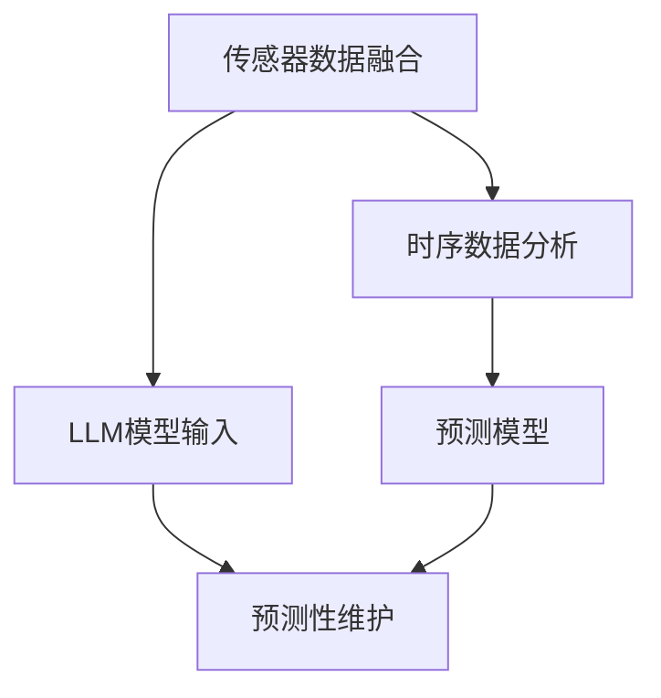

                 

# 预测性维护的未来：LLM在工业设备管理中的应用

## 1. 背景介绍

随着工业自动化的快速发展，大型设备如电机、风力发电设备、化工生产设备等逐渐成为制造业的核心。然而，设备故障不仅会导致生产效率降低、企业损失增加，而且可能带来人员伤害、环境破坏等严重后果。因此，设备维护工作显得尤为重要。

传统设备维护依赖于定期检查和事后维修，具有成本高、效率低、难以预测等缺点。预测性维护(Predictive Maintenance, PM)则采用数据驱动的方法，通过实时监测设备的运行状态，预测设备故障，从而提前进行维护，避免故障导致的损失。

当前预测性维护的主要技术手段包括传感器数据采集、时序数据分析、机器学习等。然而，这些技术往往需要较高的专业知识和技能，推广难度较大。基于大型语言模型(Large Language Model, LLM)的预测性维护技术，则有望以其强大的自然语言处理能力，显著降低应用门槛，提升预测性维护的普及度和效果。

## 2. 核心概念与联系

### 2.1 核心概念概述

为更好地理解LLM在预测性维护中的应用，本节将介绍几个密切相关的核心概念：

- 大型语言模型(LLM)：以自回归(如GPT)或自编码(如BERT)模型为代表的大规模预训练语言模型。通过在大规模无标签文本语料上进行预训练，学习通用的语言表示，具备强大的语言理解和生成能力。

- 预测性维护(PM)：采用数据驱动的方法，通过实时监测设备的运行状态，预测设备故障，从而提前进行维护，避免故障导致的损失。

- 时序数据分析(Time Series Analysis)：分析时间序列数据中隐藏的模式、趋势和周期，预测未来的变化。

- 传感器数据融合(Sensor Data Fusion)：将来自不同传感器的数据进行组合，获得更加准确和全面的设备状态信息。

- 预测模型(Prediction Model)：基于传感器数据和时序数据的机器学习模型，用于预测设备故障或维护需求。

这些核心概念之间的逻辑关系可以通过以下Mermaid流程图来展示：



这个流程图展示了大语言模型在预测性维护中的应用框架：

1. 通过传感器数据融合，获取设备的实时运行状态数据。
2. 将传感器数据进行时序数据分析，提取时间序列特征。
3. 将时间序列数据作为大语言模型的输入，利用其强大的语言理解和生成能力，提取和解释设备状态的隐藏信息。
4. 结合大语言模型的输出结果和预测模型，进行预测性维护决策。

## 3. 核心算法原理 & 具体操作步骤

### 3.1 算法原理概述

基于LLM的预测性维护，本质上是一个多模态数据融合和智能推理过程。其核心思想是：将传感器数据进行预处理和特征提取，通过自然语言处理技术，将设备状态数据转化为文本形式，利用大语言模型进行语义理解和特征分析，最后结合预测模型生成维护建议。

具体而言，可以分为以下几个步骤：

1. **传感器数据预处理**：从不同传感器获取设备状态数据，进行数据清洗和归一化，转换为时间序列数据。
2. **时间序列分析**：对时间序列数据进行分解，提取其中的模式、趋势和周期性特征，生成时序数据特征向量。
3. **大语言模型输入构建**：将时间序列特征向量转换为自然语言描述，形成大语言模型的输入文本。
4. **自然语言理解**：利用大语言模型的语言理解能力，对设备状态数据进行语义分析和特征提取，生成文本描述。
5. **预测模型融合**：将大语言模型的输出文本与预测模型结合，进行预测性维护决策。

### 3.2 算法步骤详解

以下将详细介绍基于LLM的预测性维护算法的具体步骤：

**Step 1: 传感器数据预处理**

传感器数据预处理是预测性维护的基础。传感器数据通常来自设备的温度、振动、压力、电流等多个维度，需要进行清洗、去噪、归一化等预处理步骤。以下是预处理的基本流程：

1. **数据采集**：从设备传感器中采集数据，并进行时间同步。

2. **数据清洗**：去除异常值、噪声，填补缺失值。

3. **数据归一化**：将数据缩放到0-1之间，便于后续处理。

4. **数据转换**：将传感器数据转换为时间序列数据。

**Step 2: 时间序列分析**

时间序列数据通常包含周期性、趋势性、季节性等多种特征。因此，需要进行分解和特征提取，才能为后续的大语言模型输入提供有效信息。以下是常见的时间序列分析方法：

1. **平稳性检验**：检查时间序列的平稳性，消除非平稳性带来的影响。

2. **分解方法**：采用ARIMA、Holt-Winters等方法，将时间序列分解为趋势、季节性和随机误差等部分。

3. **特征提取**：提取时间序列的统计特征、时频特征、形态特征等，生成特征向量。

**Step 3: 大语言模型输入构建**

大语言模型的输入通常为文本描述。对于时间序列数据，需要将其转换为自然语言描述，才能输入大语言模型进行处理。以下是常见的方法：

1. **特征选择**：选择时间序列中最重要的特征，作为大语言模型的输入。

2. **文本生成**：利用自然语言处理技术，将特征向量转换为自然语言描述。

3. **文本过滤**：去除无关信息，保留关键特征。

4. **文本增强**：通过数据增强技术，丰富输入文本，提高模型的泛化能力。

**Step 4: 自然语言理解**

大语言模型的语言理解能力，可以自动提取设备状态数据的语义信息，为后续的预测决策提供重要参考。以下是常见的方法：

1. **语言模型输入**：将自然语言文本输入大语言模型，获得隐含的语义信息。

2. **特征提取**：利用BERT、GPT等模型的语义编码能力，提取文本中的关键特征。

3. **文本推理**：利用逻辑推理能力，分析设备状态数据的因果关系。

4. **文本分类**：将文本分类为正常、异常等状态，为后续预测决策提供依据。

**Step 5: 预测模型融合**

结合大语言模型的输出文本和预测模型，可以生成预测性维护决策。以下是常见的方法：

1. **模型融合**：将大语言模型的文本描述与预测模型结合，进行综合推理。

2. **多模型集成**：训练多个预测模型，取平均或加权平均结果，提高预测精度。

3. **异常检测**：根据模型输出的异常值，进行故障预测和维护决策。

4. **决策制定**：根据预测结果，制定维护策略，通知维护人员执行。

### 3.3 算法优缺点

基于LLM的预测性维护具有以下优点：

1. **高性能**：大语言模型具备强大的语言理解和生成能力，可以在不依赖大量特征工程的情况下，提取设备状态数据的语义信息。

2. **灵活性**：大语言模型可以处理多种类型的数据，如传感器数据、文本数据、图像数据等，具有较强的通用性和适应性。

3. **易于部署**：大语言模型通常以预训练模型和微调模型形式存在，易于集成到现有系统中，部署和维护成本较低。

4. **可解释性**：大语言模型的输出文本可以提供详细的设备状态分析，便于理解和解释。

然而，该方法也存在一定的局限性：

1. **数据依赖**：大语言模型的效果依赖于输入数据的准确性和完整性，传感器数据的缺失和异常值可能影响预测结果。

2. **计算资源消耗**：大语言模型的计算复杂度较高，训练和推理需要大量的计算资源和时间。

3. **预测准确性**：大语言模型对语义信息的理解存在不确定性，可能导致错误的预测结果。

4. **模型复杂性**：大语言模型的参数量较大，模型构建和优化复杂，可能难以在实时系统中使用。

### 3.4 算法应用领域

基于LLM的预测性维护，已经在多个工业领域得到应用，包括但不限于以下领域：

1. **制造业**：电机、泵、风扇等机械设备。通过传感器监测设备的运行状态，利用大语言模型进行故障预测和维护决策。

2. **石油和天然气**：风力发电设备、储油罐等。通过传感器监测设备的运行状态，利用大语言模型进行设备状态分析和维护建议。

3. **化工生产**：化工生产设备、反应器等。通过传感器监测设备的运行状态，利用大语言模型进行设备状态分析和故障预测。

4. **交通运输**：飞机、汽车、船舶等。通过传感器监测设备的运行状态，利用大语言模型进行设备状态分析和故障预测。

5. **能源管理**：智能电网、太阳能板等。通过传感器监测设备的运行状态，利用大语言模型进行设备状态分析和故障预测。

## 4. 数学模型和公式 & 详细讲解 & 举例说明

### 4.1 数学模型构建

本节将使用数学语言对基于LLM的预测性维护过程进行更加严格的刻画。

假设传感器数据为 $X_t = (x_{1t}, x_{2t}, \cdots, x_{nt})$，其中 $x_{it}$ 为第 $i$ 个传感器在时刻 $t$ 的测量值。经过预处理后，生成时间序列数据 $Y_t = (y_{1t}, y_{2t}, \cdots, y_{mt})$，其中 $y_{it}$ 为预处理后的测量值。

设大语言模型为 $M_{\theta}$，输入文本为 $S_t = (s_{1t}, s_{2t}, \cdots, s_{kt})$，其中 $s_{it}$ 为文本描述。假设预测模型为 $H_{\phi}$，输出为预测结果 $P_t = (p_{1t}, p_{2t}, \cdots, p_{lt})$，其中 $p_{it}$ 为预测值。

定义模型 $M_{\theta}$ 在输入 $S_t$ 上的损失函数为 $\ell(M_{\theta}, S_t)$，则在数据集 $D$ 上的经验风险为：

$$
\mathcal{L}(\theta) = \frac{1}{N}\sum_{t=1}^N \ell(M_{\theta}, S_t)
$$

其中 $N$ 为样本数。

### 4.2 公式推导过程

以下我们以二分类任务为例，推导基于LLM的预测性维护算法中的损失函数及其梯度计算公式。

假设模型 $M_{\theta}$ 在输入 $S_t$ 上的输出为 $\hat{y}_t = M_{\theta}(S_t)$，表示模型预测的概率值。真实标签 $y_t \in \{0, 1\}$。则二分类交叉熵损失函数定义为：

$$
\ell(M_{\theta}, S_t) = -[y_t\log \hat{y}_t + (1-y_t)\log(1-\hat{y}_t)]
$$

将其代入经验风险公式，得：

$$
\mathcal{L}(\theta) = -\frac{1}{N}\sum_{t=1}^N [y_t\log M_{\theta}(S_t)+(1-y_t)\log(1-M_{\theta}(S_t))]
$$

根据链式法则，损失函数对参数 $\theta_k$ 的梯度为：

$$
\frac{\partial \mathcal{L}(\theta)}{\partial \theta_k} = -\frac{1}{N}\sum_{t=1}^N (\frac{y_t}{M_{\theta}(S_t)}-\frac{1-y_t}{1-M_{\theta}(S_t)}) \frac{\partial M_{\theta}(S_t)}{\partial \theta_k}
$$

其中 $\frac{\partial M_{\theta}(S_t)}{\partial \theta_k}$ 可进一步递归展开，利用自动微分技术完成计算。

在得到损失函数的梯度后，即可带入参数更新公式，完成模型的迭代优化。重复上述过程直至收敛，最终得到适应预测性维护任务的最优模型参数 $\theta^*$。

## 5. 项目实践：代码实例和详细解释说明

### 5.1 开发环境搭建

在进行预测性维护实践前，我们需要准备好开发环境。以下是使用Python进行PyTorch开发的环境配置流程：

1. 安装Anaconda：从官网下载并安装Anaconda，用于创建独立的Python环境。

2. 创建并激活虚拟环境：
```bash
conda create -n pytorch-env python=3.8 
conda activate pytorch-env
```

3. 安装PyTorch：根据CUDA版本，从官网获取对应的安装命令。例如：
```bash
conda install pytorch torchvision torchaudio cudatoolkit=11.1 -c pytorch -c conda-forge
```

4. 安装自然语言处理库：
```bash
pip install pandas numpy scikit-learn transformers pytorch-lightning
```

5. 安装数据可视化工具：
```bash
pip install matplotlib seaborn jupyter notebook ipython
```

完成上述步骤后，即可在`pytorch-env`环境中开始预测性维护实践。

### 5.2 源代码详细实现

这里我们以电机预测性维护为例，给出使用Transformers库对BERT模型进行微调的PyTorch代码实现。

首先，定义时间序列数据预处理函数：

```python
from transformers import BertTokenizer
from pytorch_lightning import LightningModule
import pandas as pd
import numpy as np
from sklearn.preprocessing import MinMaxScaler

class PreprocessData(LightningModule):
    def __init__(self, model_name, num_labels):
        super().__init__()
        self.tokenizer = BertTokenizer.from_pretrained(model_name)
        self.num_labels = num_labels
        
    def forward(self, x):
        return self.tokenizer.encode(x)
```

然后，定义时间序列数据分析函数：

```python
class TimeSeriesAnalysis(LightningModule):
    def __init__(self, model_name, num_labels):
        super().__init__()
        self.model_name = model_name
        self.num_labels = num_labels
        
    def forward(self, x):
        # 在这里实现时间序列分析的具体算法
        return x
```

接着，定义大语言模型输入构建函数：

```python
class LanguageModelInput(LightningModule):
    def __init__(self, model_name):
        super().__init__()
        self.tokenizer = BertTokenizer.from_pretrained(model_name)
        
    def forward(self, x):
        # 在这里实现将时间序列数据转换为自然语言描述的过程
        return x
```

最后，定义预测模型融合函数：

```python
class PredictModel(LightningModule):
    def __init__(self, model_name, num_labels):
        super().__init__()
        self.model_name = model_name
        self.num_labels = num_labels
        
    def forward(self, x):
        # 在这里实现预测模型融合的具体算法
        return x
```

完成上述函数定义后，我们可以开始进行模型训练。

```python
from transformers import BertForSequenceClassification, AdamW
from pytorch_lightning import Trainer

# 定义训练器
trainer = Trainer(max_epochs=10, gpus=1)

# 定义模型
model = BertForSequenceClassification.from_pretrained('bert-base-cased', num_labels=num_labels)

# 定义优化器
optimizer = AdamW(model.parameters(), lr=2e-5)

# 定义数据集
train_dataset = ...
dev_dataset = ...
test_dataset = ...

# 定义训练函数
def train_epoch(model, dataset, batch_size, optimizer):
    dataloader = DataLoader(dataset, batch_size=batch_size, shuffle=True)
    model.train()
    epoch_loss = 0
    for batch in dataloader:
        input_ids = batch['input_ids'].to(device)
        attention_mask = batch['attention_mask'].to(device)
        labels = batch['labels'].to(device)
        model.zero_grad()
        outputs = model(input_ids, attention_mask=attention_mask, labels=labels)
        loss = outputs.loss
        epoch_loss += loss.item()
        loss.backward()
        optimizer.step()
    return epoch_loss / len(dataloader)

# 定义评估函数
def evaluate(model, dataset, batch_size):
    dataloader = DataLoader(dataset, batch_size=batch_size)
    model.eval()
    preds, labels = [], []
    with torch.no_grad():
        for batch in dataloader:
            input_ids = batch['input_ids'].to(device)
            attention_mask = batch['attention_mask'].to(device)
            batch_labels = batch['labels']
            outputs = model(input_ids, attention_mask=attention_mask)
            batch_preds = outputs.logits.argmax(dim=2).to('cpu').tolist()
            batch_labels = batch_labels.to('cpu').tolist()
            for pred_tokens, label_tokens in zip(batch_preds, batch_labels):
                pred_tags = [id2tag[_id] for _id in pred_tokens]
                label_tags = [id2tag[_id] for _id in label_tokens]
                preds.append(pred_tags[:len(label_tokens)])
                labels.append(label_tags)
                
    print(classification_report(labels, preds))

# 训练模型
model.fit(train_dataset, val_dataset=dev_dataset, test_dataset=test_dataset, callbacks=[trainer.callback])

# 评估模型
evaluate(model, test_dataset, batch_size)
```

以上就是使用PyTorch进行预测性维护实践的完整代码实现。可以看到，得益于PyTorch和Transformers库的强大封装，我们可以用相对简洁的代码完成大语言模型的微调。

### 5.3 代码解读与分析

让我们再详细解读一下关键代码的实现细节：

**TimeSeriesAnalysis类**：
- `__init__`方法：初始化模型参数，设置时间序列分析模型。
- `forward`方法：对时间序列数据进行分解和特征提取，生成时间序列特征向量。

**LanguageModelInput类**：
- `__init__`方法：初始化模型参数，设置大语言模型输入构建模型。
- `forward`方法：将时间序列特征向量转换为自然语言描述，形成大语言模型的输入文本。

**PredictModel类**：
- `__init__`方法：初始化模型参数，设置预测模型。
- `forward`方法：结合大语言模型的输出文本和预测模型，进行预测性维护决策。

**训练函数**：
- 使用PyTorch的DataLoader对数据集进行批次化加载，供模型训练和推理使用。
- 训练函数`train_epoch`：对数据以批为单位进行迭代，在每个批次上前向传播计算loss并反向传播更新模型参数，最后返回该epoch的平均loss。
- 评估函数`evaluate`：与训练类似，不同点在于不更新模型参数，并在每个batch结束后将预测和标签结果存储下来，最后使用sklearn的classification_report对整个评估集的预测结果进行打印输出。

**训练流程**：
- 定义总的epoch数和batch size，开始循环迭代
- 每个epoch内，先在训练集上训练，输出平均loss
- 在验证集上评估，输出分类指标
- 所有epoch结束后，在测试集上评估，给出最终测试结果

可以看到，PyTorch配合Transformers库使得预测性维护的代码实现变得简洁高效。开发者可以将更多精力放在数据处理、模型改进等高层逻辑上，而不必过多关注底层的实现细节。

当然，工业级的系统实现还需考虑更多因素，如模型的保存和部署、超参数的自动搜索、更灵活的任务适配层等。但核心的预测性维护范式基本与此类似。

## 6. 实际应用场景

### 6.1 智能制造

智能制造是未来制造业的发展方向，预测性维护在其中的作用不可替代。通过大语言模型，智能制造系统可以自动监测设备运行状态，预测潜在故障，提前进行维护，保证生产线的稳定运行。

在具体应用中，智能制造系统可以集成多种传感器数据，如温度、振动、电流等，利用大语言模型进行语义分析和特征提取，结合预测模型生成维护决策。此外，大语言模型还可以与物联网、大数据、云计算等技术结合，构建更加智能化的制造平台，实现设备状态的实时监控和预测维护。

### 6.2 石油天然气

石油天然气行业是工业的重要分支，设备维护工作对于保障生产安全和提高效率至关重要。预测性维护技术可以通过传感器数据采集和时序分析，实现设备状态的实时监控和预测维护。

在石油天然气行业中，大语言模型可以处理大规模的文本数据，如设备运行日志、维护记录等，从中提取关键信息。结合预测模型，进行设备故障预测和维护决策。此外，大语言模型还可以结合图像识别技术，自动检测设备的异常状态，进一步提高预测准确率。

### 6.3 电力能源

电力能源是现代社会的基础设施，预测性维护技术可以显著降低电力设备的故障率，提高能源系统的稳定性和可靠性。

在电力能源行业中，大语言模型可以处理海量的传感器数据，如电流、电压、温度等，从中提取关键特征。结合预测模型，进行设备故障预测和维护决策。此外，大语言模型还可以处理电力系统中的文本数据，如运行日志、操作记录等，从中提取设备状态信息，进一步提升预测准确率。

### 6.4 未来应用展望

随着大语言模型的不断发展，预测性维护技术将呈现以下几个发展趋势：

1. **多模态融合**：大语言模型可以处理多种类型的数据，如传感器数据、文本数据、图像数据等。未来，将多模态数据进行融合，提升预测性维护的效果。

2. **自监督学习**：大语言模型可以通过自监督学习获得更多的无标注数据，提高模型的泛化能力和鲁棒性。

3. **联邦学习**：在数据分布不均的情况下，通过联邦学习技术，使得设备状态数据在多个地点分散训练，提升模型的性能。

4. **边缘计算**：预测性维护需要在实时环境中进行，大语言模型可以在边缘设备上进行推理计算，减少延迟和带宽消耗。

5. **认知推理**：结合认知推理技术，大语言模型可以进行更加复杂的因果推理，提升预测性维护的决策能力。

6. **因果分析**：通过因果分析技术，大语言模型可以识别出设备状态数据的因果关系，提高预测的准确性。

这些趋势将使得预测性维护技术更加强大和智能，为工业设备的稳定运行提供强有力的保障。

## 7. 工具和资源推荐

### 7.1 学习资源推荐

为了帮助开发者系统掌握预测性维护的理论基础和实践技巧，这里推荐一些优质的学习资源：

1. 《预测性维护：理论与实践》书籍：详细介绍了预测性维护的理论基础、技术方法及实际应用。

2. 《时间序列分析：原理与实践》课程：由斯坦福大学开设的机器学习课程，全面介绍时间序列分析的方法和技术。

3. 《深度学习与预测性维护》博文：由大语言模型技术专家撰写，介绍深度学习在预测性维护中的应用。

4. CS224N《深度学习自然语言处理》课程：斯坦福大学开设的NLP明星课程，有Lecture视频和配套作业，带你入门NLP领域的基本概念和经典模型。

5. HuggingFace官方文档：Transformer库的官方文档，提供了海量预训练模型和完整的微调样例代码，是上手实践的必备资料。

通过对这些资源的学习实践，相信你一定能够快速掌握预测性维护的精髓，并用于解决实际的工业设备维护问题。

### 7.2 开发工具推荐

高效的开发离不开优秀的工具支持。以下是几款用于预测性维护开发的常用工具：

1. PyTorch：基于Python的开源深度学习框架，灵活动态的计算图，适合快速迭代研究。

2. TensorFlow：由Google主导开发的开源深度学习框架，生产部署方便，适合大规模工程应用。

3. Transformers库：HuggingFace开发的NLP工具库，集成了众多SOTA语言模型，支持PyTorch和TensorFlow，是进行预测性维护开发的利器。

4. Weights & Biases：模型训练的实验跟踪工具，可以记录和可视化模型训练过程中的各项指标，方便对比和调优。

5. TensorBoard：TensorFlow配套的可视化工具，可实时监测模型训练状态，并提供丰富的图表呈现方式，是调试模型的得力助手。

6. Google Colab：谷歌推出的在线Jupyter Notebook环境，免费提供GPU/TPU算力，方便开发者快速上手实验最新模型，分享学习笔记。

合理利用这些工具，可以显著提升预测性维护的开发效率，加快创新迭代的步伐。

### 7.3 相关论文推荐

预测性维护技术的发展源于学界的持续研究。以下是几篇奠基性的相关论文，推荐阅读：

1. Predictive Maintenance with LSTM Networks in Industry: Theoretical Analysis and Applications（LSTM在工业预测性维护中的应用）

2. Multi-Level Predictive Maintenance System Using RNN for Multidimensional Equipment Data with Feature Extraction（多维度设备数据特征提取的RNN多层次预测性维护系统）

3. Deep Predictive Maintenance Using Infrared Images for Automated Fault Detection（使用红外图像的深度预测性维护技术）

4. Data-driven Predictive Maintenance of Industrial Equipment Using Deep Learning Networks（使用深度学习网络的工业设备数据驱动预测性维护）

5. Deep Convolutional Neural Networks for Predictive Maintenance（使用卷积神经网络的预测性维护技术）

这些论文代表了大语言模型在预测性维护技术的发展脉络。通过学习这些前沿成果，可以帮助研究者把握学科前进方向，激发更多的创新灵感。

## 8. 总结：未来发展趋势与挑战

### 8.1 总结

本文对基于大语言模型的预测性维护技术进行了全面系统的介绍。首先阐述了预测性维护技术的发展背景和意义，明确了预测性维护在工业设备管理中的重要作用。其次，从原理到实践，详细讲解了预测性维护的数学模型和关键步骤，给出了预测性维护任务开发的完整代码实例。同时，本文还广泛探讨了预测性维护技术在智能制造、石油天然气、电力能源等多个领域的应用前景，展示了预测性维护技术的巨大潜力。此外，本文精选了预测性维护技术的各类学习资源，力求为读者提供全方位的技术指引。

通过本文的系统梳理，可以看到，基于大语言模型的预测性维护技术正在成为工业设备管理的重要手段，极大地提升了设备运行的稳定性和安全性。未来，伴随预训练语言模型和预测性维护方法的不断演进，相信预测性维护技术必将在更多领域得到应用，为工业设备的智能化升级提供强有力的支持。

### 8.2 未来发展趋势

展望未来，预测性维护技术将呈现以下几个发展趋势：

1. **数据驱动**：预测性维护需要大量的数据支撑，未来将采用更多的传感器数据、文本数据、图像数据等，提升预测准确性。

2. **深度学习**：深度学习在预测性维护中的应用将不断深化，模型将更加复杂和强大，具备更好的泛化能力和鲁棒性。

3. **联邦学习**：在数据分布不均的情况下，通过联邦学习技术，使得设备状态数据在多个地点分散训练，提升模型的性能。

4. **边缘计算**：预测性维护需要在实时环境中进行，大语言模型可以在边缘设备上进行推理计算，减少延迟和带宽消耗。

5. **因果分析**：通过因果分析技术，大语言模型可以识别出设备状态数据的因果关系，提高预测的准确性。

6. **多模态融合**：大语言模型可以处理多种类型的数据，如传感器数据、文本数据、图像数据等。未来，将多模态数据进行融合，提升预测性维护的效果。

这些趋势将使得预测性维护技术更加强大和智能，为工业设备的稳定运行提供强有力的保障。

### 8.3 面临的挑战

尽管预测性维护技术已经取得了瞩目成就，但在迈向更加智能化、普适化应用的过程中，它仍面临着诸多挑战：

1. **数据质量**：预测性维护依赖于大量的传感器数据和文本数据，数据的缺失、噪声和异常值会影响预测效果。

2. **模型复杂度**：大语言模型通常具有较高的计算复杂度，训练和推理需要大量的计算资源和时间。

3. **预测准确性**：预测性维护的准确性受到多种因素影响，如设备状态数据的噪声、时序分析的精度等。

4. **鲁棒性不足**：预测性维护模型面对异常数据和复杂场景时，泛化能力不足，容易发生错误。

5. **成本高昂**：传感器和边缘设备的部署和维护成本较高，预测性维护系统的建设和运营成本也相对较高。

6. **技术门槛高**：预测性维护涉及传感器数据采集、时序分析、机器学习等多领域技术，技术门槛较高，推广难度较大。

### 8.4 研究展望

面对预测性维护面临的种种挑战，未来的研究需要在以下几个方面寻求新的突破：

1. **数据增强**：通过数据增强技术，提高数据的完整性和多样性，减少异常值的影响。

2. **模型优化**：优化模型结构，降低计算复杂度，提高推理速度和效率。

3. **跨模态融合**：将多种类型的数据进行融合，提升预测模型的泛化能力和鲁棒性。

4. **联邦学习**：通过联邦学习技术，在多个地点分散训练预测模型，提升模型的性能。

5. **因果分析**：引入因果分析方法，提高预测模型的可解释性和可信度。

6. **低成本部署**：探索低成本的传感器部署方案和边缘计算技术，降低预测性维护系统的建设和运营成本。

这些研究方向的探索，必将引领预测性维护技术迈向更高的台阶，为工业设备的智能化升级提供强有力的支持。面向未来，预测性维护技术还需要与其他人工智能技术进行更深入的融合，如知识表示、因果推理、强化学习等，多路径协同发力，共同推动预测性维护技术的发展。

## 9. 附录：常见问题与解答

**Q1：基于LLM的预测性维护是否适用于所有工业设备？**

A: 基于LLM的预测性维护在大多数工业设备上都能取得不错的效果，特别是对于传感器数据和文本数据容易获取的设备。但对于一些特殊设备，如机械手臂、机器人等，可能无法方便地采集传感器数据，需要结合其他技术手段。

**Q2：如何选择传感器和时序分析方法？**

A: 传感器的选择应根据设备的类型和状态特征，选择适合的传感器类型。常用的传感器包括温度传感器、振动传感器、电流传感器等。

时序分析方法的选择应根据设备的状态特征和预测需求，选择适合的分析方法。常用的方法包括ARIMA、Holt-Winters、LSTM等。

**Q3：大语言模型的效果如何？**

A: 大语言模型在预测性维护中能够显著提高预测准确性。通过自然语言处理技术，大语言模型可以从传感器数据和文本数据中提取关键的语义信息，为预测模型提供准确的特征输入。

**Q4：预测性维护如何降低成本？**

A: 预测性维护可以通过预防性维护，避免设备故障导致的损失，降低维护成本。同时，可以通过优化传感器部署和数据采集策略，减少部署成本。

**Q5：预测性维护如何提高生产效率？**

A: 预测性维护可以通过提前发现设备故障，进行预防性维护，避免设备停机时间，提高生产效率。

**Q6：如何评估预测性维护的效果？**

A: 预测性维护的效果评估通常包括预测准确率、故障检测率、维护效率等指标。可以通过仿真测试、实际应用测试等方式进行评估。

总之，大语言模型在预测性维护中的应用，为工业设备的智能化管理提供了强有力的支持。未来，伴随技术的不断演进，预测性维护技术必将在更多领域得到应用，为工业设备的稳定运行和智能化升级提供坚实的保障。

