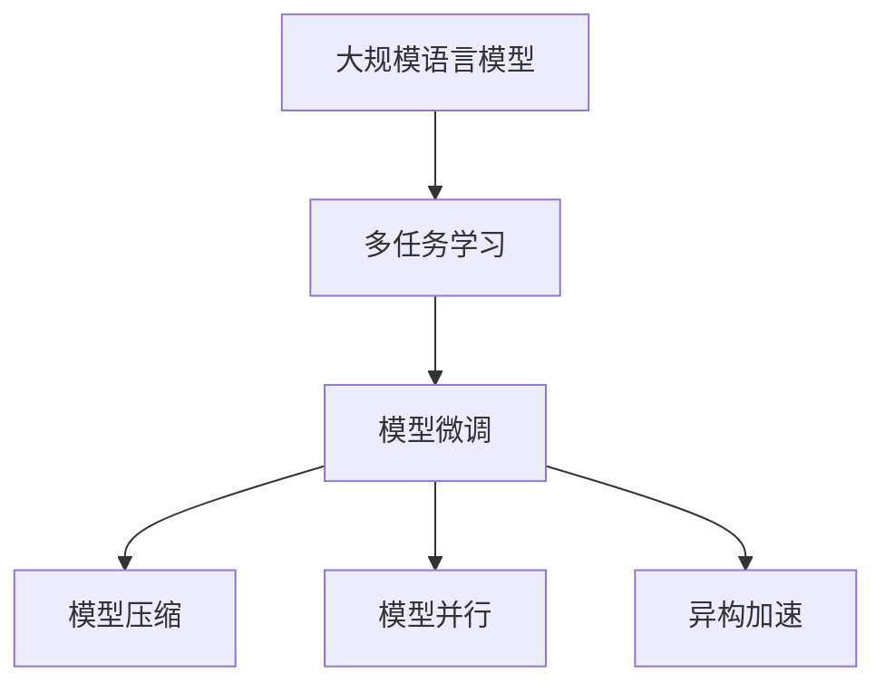

                 

# 高并发AI：LLM的多任务处理能力

> 关键词：大规模语言模型,多任务学习,模型微调,模型压缩,模型并行,异构加速

## 1. 背景介绍

在深度学习领域，特别是自然语言处理(NLP)领域，大规模语言模型(LLM)因其出色的语言理解和生成能力，成为最炙手可热的研究和应用方向。LLM如BERT、GPT、T5等模型，通过在海量无标签文本数据上进行预训练，学习到了丰富的语言知识，广泛应用于问答、翻译、摘要、情感分析等NLP任务。然而，随着实际应用场景的复杂化，单任务LLM模型难以满足日益增长的多任务处理需求，如何构建高效的多任务LLM模型，成为当前研究的热点。

多任务学习(MTL)是解决这一问题的重要方法，通过在训练过程中联合训练多个相关任务，共享模型参数，可以有效提升模型在多个任务上的性能。特别是对于高并发场景，如在线客服、智能推荐、实时翻译等，多任务LLM模型的处理能力尤为重要。本文将详细探讨多任务学习在大规模语言模型中的实现机制和应用策略，以期为高并发AI场景下的多任务处理提供指导。

## 2. 核心概念与联系

### 2.1 核心概念概述

- 大规模语言模型(LLM)：指通过预训练学习到广泛语言知识的模型，如BERT、GPT等。
- 多任务学习(MTL)：指在训练过程中联合训练多个相关任务，共享模型参数。
- 模型微调(Fine-Tuning)：指在预训练模型的基础上，使用下游任务的少量标注数据，通过有监督学习优化模型在该任务上的性能。
- 模型压缩：指通过剪枝、量化等手段，减小模型规模，降低计算资源消耗。
- 模型并行：指通过将模型分布在多个计算设备上，并行执行模型计算，提升推理速度。
- 异构加速：指利用不同类型的计算设备(如CPU、GPU、TPU等)，根据计算任务的特性分配合适的计算资源，实现高效加速。

这些核心概念之间的逻辑关系可以通过以下Mermaid流程图来展示：



这个流程图展示了LLM、MTL、微调、压缩、并行和异构加速之间的内在联系，以及它们在多任务处理中的作用。

## 3. 核心算法原理 & 具体操作步骤
### 3.1 算法原理概述

基于多任务学习的大规模语言模型微调，核心思想是通过联合训练多个任务，共享模型参数，最大化利用预训练模型中的知识，提升模型在多个任务上的性能。在具体实现中，通常包括以下几个步骤：

1. **任务定义**：定义多个任务，如分类、生成、匹配等。
2. **数据准备**：收集和预处理各任务的标注数据集，划分为训练集、验证集和测试集。
3. **模型构建**：在预训练模型的基础上构建多任务适配层，设计相应的损失函数。
4. **联合训练**：在训练过程中，联合优化多个任务的目标函数，更新模型参数。
5. **模型评估**：在验证集和测试集上评估模型性能，根据性能指标调整模型参数。

### 3.2 算法步骤详解

下面详细介绍多任务学习在大规模语言模型中的应用步骤：

**Step 1: 任务定义与数据准备**
- 定义多个NLP任务，如情感分析、命名实体识别、机器翻译等。
- 收集各任务的标注数据集，并划分为训练集、验证集和测试集。

**Step 2: 模型构建**
- 在预训练模型顶层设计通用的多任务适配层，如Linear Layer、Attention Layer等。
- 对每个任务设计相应的损失函数，如交叉熵、均方误差、BLEU等。

**Step 3: 联合训练**
- 使用多个任务的损失函数组成联合损失函数。
- 在训练过程中，同时最小化所有任务的损失，更新模型参数。
- 可以使用不同权重系数控制不同任务的重要性。

**Step 4: 模型评估**
- 在验证集和测试集上评估模型在每个任务上的性能，如精度、召回率、F1值等。
- 根据性能指标调整模型参数，选择最佳的多任务学习策略。

**Step 5: 模型优化**
- 根据实际应用需求，进行模型压缩、模型并行和异构加速等优化，提升模型推理效率。

### 3.3 算法优缺点

基于多任务学习的大规模语言模型微调方法具有以下优点：
1. 共享参数：通过共享参数，减少模型冗余，提升模型泛化能力。
2. 多任务协同：在多个任务上联合训练，提升模型整体性能。
3. 知识复用：利用预训练模型中的知识，加速多任务学习。
4. 高效推理：通过模型压缩、模型并行和异构加速等优化，提升推理速度。

同时，该方法也存在一些局限性：
1. 任务相关性：不同任务之间的相关性会影响模型性能。
2. 超参数选择：多任务学习需要调整多个超参数，难度较大。
3. 过拟合风险：多任务联合训练可能引入过拟合风险。
4. 计算资源：多任务学习需要更多的计算资源，增加系统复杂性。

尽管存在这些局限性，但就目前而言，基于多任务学习的方法仍是解决高并发AI场景下多任务处理问题的有效手段。

### 3.4 算法应用领域

基于多任务学习的大规模语言模型微调方法在NLP领域有着广泛的应用，尤其在以下场景中表现出色：

- 智能客服：通过联合训练多个问答任务，提升智能客服的对话能力。
- 智能推荐：同时训练物品推荐、用户兴趣预测等多个任务，提升推荐效果。
- 实时翻译：在多个语言对上联合训练，提升实时翻译的准确性和流畅性。
- 新闻摘要：同时训练摘要生成和情感分析，提供更全面的新闻信息。
- 问答系统：在问答任务和知识图谱推理上联合训练，提升系统问答能力。

这些应用展示了多任务学习在大规模语言模型中的强大威力，为高并发AI场景下的多任务处理提供了有力的技术支撑。

## 4. 数学模型和公式 & 详细讲解 & 举例说明

### 4.1 数学模型构建

假设多个任务的联合损失函数为 $\mathcal{L}=\sum_i \lambda_i \mathcal{L}_i$，其中 $\mathcal{L}_i$ 为第 $i$ 个任务的损失函数，$\lambda_i$ 为任务权重。

记多任务语言模型为 $M_{\theta}:\mathcal{X} \rightarrow \mathcal{Y}$，其中 $\mathcal{X}$ 为输入空间，$\mathcal{Y}$ 为输出空间，$\theta$ 为模型参数。对于第 $i$ 个任务，定义输入为 $x_i$，标签为 $y_i$，对应的任务损失函数为 $\ell_i$。则在数据集 $D=\{(x_i,y_i)\}_{i=1}^N$ 上的经验风险为：

$$
\mathcal{L}_i(\theta) = \frac{1}{N}\sum_{i=1}^N \ell_i(M_{\theta}(x_i),y_i)
$$

联合损失函数为：

$$
\mathcal{L}(\theta) = \sum_i \lambda_i \mathcal{L}_i(\theta)
$$

在训练过程中，最小化联合损失函数 $\mathcal{L}(\theta)$，更新模型参数 $\theta$。具体更新公式为：

$$
\theta \leftarrow \theta - \eta \nabla_{\theta}\mathcal{L}(\theta) - \eta\lambda\theta
$$

其中 $\eta$ 为学习率，$\lambda$ 为正则化系数。

### 4.2 公式推导过程

以情感分析和命名实体识别为例，推导联合损失函数及其梯度的计算公式。

假设模型 $M_{\theta}$ 在输入 $x$ 上的输出为 $\hat{y}=M_{\theta}(x) \in [0,1]$，表示样本属于正类的概率。真实标签 $y \in \{0,1\}$。对于情感分析任务，$\ell_i(M_{\theta}(x_i),y_i)=-[y_i\log \hat{y}_i+(1-y_i)\log(1-\hat{y}_i)]$。对于命名实体识别任务，假设有 $n$ 个命名实体，$e_i \in \{B-PER, I-PER, B-LOC, I-LOC\}$，则 $\ell_i(M_{\theta}(x_i),y_i)=\sum_k \ell_k$，其中 $\ell_k=-[y_{ik}\log \hat{y}_{ik}+(1-y_{ik})\log(1-\hat{y}_{ik})$。

将上述两个任务损失函数相加，并引入任务权重 $\lambda_1$ 和 $\lambda_2$，得联合损失函数：

$$
\mathcal{L}(\theta) = \lambda_1 \frac{1}{N}\sum_{i=1}^N [-y_i\log \hat{y}_i+(1-y_i)\log(1-\hat{y}_i)] + \lambda_2 \frac{1}{N}\sum_{i=1}^N \sum_k -[y_{ik}\log \hat{y}_{ik}+(1-y_{ik})\log(1-\hat{y}_{ik})]
$$

根据链式法则，联合损失函数对参数 $\theta_k$ 的梯度为：

$$
\frac{\partial \mathcal{L}(\theta)}{\partial \theta_k} = -(\lambda_1 \frac{1}{N}\sum_{i=1}^N (\frac{y_i}{\hat{y}_i}-\frac{1-y_i}{1-\hat{y}_i}) \frac{\partial \hat{y}_i}{\partial \theta_k} + \lambda_2 \frac{1}{N}\sum_{i=1}^N \sum_k (\frac{y_{ik}}{\hat{y}_{ik}}-\frac{1-y_{ik}}{1-\hat{y}_{ik}}) \frac{\partial \hat{y}_{ik}}{\partial \theta_k}
$$

其中 $\frac{\partial \hat{y}_i}{\partial \theta_k}$ 和 $\frac{\partial \hat{y}_{ik}}{\partial \theta_k}$ 可进一步递归展开，利用自动微分技术完成计算。

### 4.3 案例分析与讲解

以情感分析和命名实体识别为例，分析模型的训练过程。

**Step 1: 数据预处理**
- 使用分词工具将文本数据分词。
- 对情感分析任务，将情感标签编码成独热向量。
- 对命名实体识别任务，将命名实体标签编码成序列标签。

**Step 2: 模型构建**
- 在预训练模型顶层添加两个任务适配层，分别用于情感分析和命名实体识别。
- 对每个适配层设计相应的损失函数，如交叉熵、BLEU等。

**Step 3: 联合训练**
- 将两个任务的损失函数相加，并引入任务权重。
- 在训练过程中，同时最小化联合损失函数，更新模型参数。

**Step 4: 模型评估**
- 在验证集和测试集上评估模型在情感分析和命名实体识别上的性能，如精度、召回率、F1值等。
- 根据性能指标调整任务权重，选择最佳的多任务学习策略。

**Step 5: 模型优化**
- 对模型进行剪枝、量化等优化，减小模型规模。
- 使用模型并行和异构加速技术，提升推理速度。

## 5. 项目实践：代码实例和详细解释说明
### 5.1 开发环境搭建

在进行多任务学习实践前，我们需要准备好开发环境。以下是使用Python进行PyTorch开发的环境配置流程：

1. 安装Anaconda：从官网下载并安装Anaconda，用于创建独立的Python环境。

2. 创建并激活虚拟环境：
```bash
conda create -n pytorch-env python=3.8 
conda activate pytorch-env
```

3. 安装PyTorch：根据CUDA版本，从官网获取对应的安装命令。例如：
```bash
conda install pytorch torchvision torchaudio cudatoolkit=11.1 -c pytorch -c conda-forge
```

4. 安装Transformers库：
```bash
pip install transformers
```

5. 安装各类工具包：
```bash
pip install numpy pandas scikit-learn matplotlib tqdm jupyter notebook ipython
```

完成上述步骤后，即可在`pytorch-env`环境中开始多任务学习实践。

### 5.2 源代码详细实现

这里以情感分析和命名实体识别为例，给出使用Transformers库对BERT模型进行多任务学习的PyTorch代码实现。

首先，定义多任务数据处理函数：

```python
from transformers import BertTokenizer, BertForSequenceClassification, BertForTokenClassification, AdamW

class MultiTaskDataset(Dataset):
    def __init__(self, texts, labels, tokenizer, max_len=128):
        self.texts = texts
        self.labels = labels
        self.tokenizer = tokenizer
        self.max_len = max_len
        
    def __len__(self):
        return len(self.texts)
    
    def __getitem__(self, item):
        text = self.texts[item]
        labels = self.labels[item]
        
        encoding = self.tokenizer(text, return_tensors='pt', max_length=self.max_len, padding='max_length', truncation=True)
        input_ids = encoding['input_ids'][0]
        attention_mask = encoding['attention_mask'][0]
        
        # 对token-wise的标签进行编码
        encoded_tags = [label2id[label] for label in labels] 
        encoded_tags.extend([tag2id['O']] * (self.max_len - len(encoded_tags)))
        labels = torch.tensor(encoded_tags, dtype=torch.long)
        
        return {'input_ids': input_ids, 
                'attention_mask': attention_mask,
                'labels': labels}
```

然后，定义模型和优化器：

```python
from transformers import BertForSequenceClassification, BertForTokenClassification, AdamW

model = BertForSequenceClassification.from_pretrained('bert-base-cased', num_labels=2) + BertForTokenClassification.from_pretrained('bert-base-cased', num_labels=5)

optimizer = AdamW(model.parameters(), lr=2e-5)
```

接着，定义训练和评估函数：

```python
from torch.utils.data import DataLoader
from tqdm import tqdm
from sklearn.metrics import classification_report

device = torch.device('cuda') if torch.cuda.is_available() else torch.device('cpu')
model.to(device)

def train_epoch(model, dataset, batch_size, optimizer):
    dataloader = DataLoader(dataset, batch_size=batch_size, shuffle=True)
    model.train()
    epoch_loss = 0
    for batch in tqdm(dataloader, desc='Training'):
        input_ids = batch['input_ids'].to(device)
        attention_mask = batch['attention_mask'].to(device)
        labels = batch['labels'].to(device)
        model.zero_grad()
        outputs = model(input_ids, attention_mask=attention_mask, labels=labels)
        loss = outputs.loss
        epoch_loss += loss.item()
        loss.backward()
        optimizer.step()
    return epoch_loss / len(dataloader)

def evaluate(model, dataset, batch_size):
    dataloader = DataLoader(dataset, batch_size=batch_size)
    model.eval()
    preds, labels = [], []
    with torch.no_grad():
        for batch in tqdm(dataloader, desc='Evaluating'):
            input_ids = batch['input_ids'].to(device)
            attention_mask = batch['attention_mask'].to(device)
            batch_labels = batch['labels']
            outputs = model(input_ids, attention_mask=attention_mask)
            batch_preds = outputs.logits.argmax(dim=2).to('cpu').tolist()
            batch_labels = batch_labels.to('cpu').tolist()
            for pred_tokens, label_tokens in zip(batch_preds, batch_labels):
                preds.append(pred_tokens[:len(label_tokens)])
                labels.append(label_tokens)
                
    print(classification_report(labels, preds))
```

最后，启动训练流程并在测试集上评估：

```python
epochs = 5
batch_size = 16

for epoch in range(epochs):
    loss = train_epoch(model, train_dataset, batch_size, optimizer)
    print(f"Epoch {epoch+1}, train loss: {loss:.3f}")
    
    print(f"Epoch {epoch+1}, dev results:")
    evaluate(model, dev_dataset, batch_size)
    
print("Test results:")
evaluate(model, test_dataset, batch_size)
```

以上就是使用PyTorch对BERT进行情感分析和命名实体识别任务多任务学习的完整代码实现。可以看到，得益于Transformers库的强大封装，我们可以用相对简洁的代码完成BERT模型的加载和训练。

### 5.3 代码解读与分析

让我们再详细解读一下关键代码的实现细节：

**MultiTaskDataset类**：
- `__init__`方法：初始化文本、标签、分词器等关键组件。
- `__len__`方法：返回数据集的样本数量。
- `__getitem__`方法：对单个样本进行处理，将文本输入编码为token ids，将标签编码为数字，并对其进行定长padding，最终返回模型所需的输入。

**标签与id的映射**：
- 定义了标签与数字id之间的映射关系，用于将token-wise的预测结果解码回真实的标签。

**训练和评估函数**：
- 使用PyTorch的DataLoader对数据集进行批次化加载，供模型训练和推理使用。
- 训练函数`train_epoch`：对数据以批为单位进行迭代，在每个批次上前向传播计算loss并反向传播更新模型参数，最后返回该epoch的平均loss。
- 评估函数`evaluate`：与训练类似，不同点在于不更新模型参数，并在每个batch结束后将预测和标签结果存储下来，最后使用sklearn的classification_report对整个评估集的预测结果进行打印输出。

**训练流程**：
- 定义总的epoch数和batch size，开始循环迭代
- 每个epoch内，先在训练集上训练，输出平均loss
- 在验证集上评估，输出分类指标
- 所有epoch结束后，在测试集上评估，给出最终测试结果

可以看到，PyTorch配合Transformers库使得BERT多任务学习的代码实现变得简洁高效。开发者可以将更多精力放在数据处理、模型改进等高层逻辑上，而不必过多关注底层的实现细节。

当然，工业级的系统实现还需考虑更多因素，如模型的保存和部署、超参数的自动搜索、更灵活的任务适配层等。但核心的多任务学习范式基本与此类似。

## 6. 实际应用场景
### 6.1 智能客服系统

基于多任务学习的多任务语言模型，可以广泛应用于智能客服系统的构建。传统客服往往需要配备大量人力，高峰期响应缓慢，且一致性和专业性难以保证。而使用多任务语言模型，可以7x24小时不间断服务，快速响应客户咨询，用自然流畅的语言解答各类常见问题。

在技术实现上，可以收集企业内部的历史客服对话记录，将问题和最佳答复构建成监督数据，在此基础上对预训练语言模型进行联合训练。多任务语言模型能够自动理解用户意图，匹配最合适的答案模板进行回复。对于客户提出的新问题，还可以接入检索系统实时搜索相关内容，动态组织生成回答。如此构建的智能客服系统，能大幅提升客户咨询体验和问题解决效率。

### 6.2 金融舆情监测

金融机构需要实时监测市场舆论动向，以便及时应对负面信息传播，规避金融风险。传统的人工监测方式成本高、效率低，难以应对网络时代海量信息爆发的挑战。基于多任务学习的多任务语言模型，可以为金融舆情监测提供新的解决方案。

具体而言，可以收集金融领域相关的新闻、报道、评论等文本数据，并对其进行主题标注和情感标注。在此基础上对预训练语言模型进行联合训练，使其能够自动判断文本属于何种主题，情感倾向是正面、中性还是负面。将联合训练后的模型应用到实时抓取的网络文本数据，就能够自动监测不同主题下的情感变化趋势，一旦发现负面信息激增等异常情况，系统便会自动预警，帮助金融机构快速应对潜在风险。

### 6.3 个性化推荐系统

当前的推荐系统往往只依赖用户的历史行为数据进行物品推荐，无法深入理解用户的真实兴趣偏好。基于多任务学习的多任务语言模型，可以更好地挖掘用户行为背后的语义信息，从而提供更精准、多样的推荐内容。

在实践中，可以收集用户浏览、点击、评论、分享等行为数据，提取和用户交互的物品标题、描述、标签等文本内容。将文本内容作为模型输入，用户的后续行为（如是否点击、购买等）作为监督信号，在此基础上联合训练预训练语言模型。多任务语言模型能够从文本内容中准确把握用户的兴趣点。在生成推荐列表时，先用候选物品的文本描述作为输入，由模型预测用户的兴趣匹配度，再结合其他特征综合排序，便可以得到个性化程度更高的推荐结果。

### 6.4 未来应用展望

随着多任务学习方法的不断发展，多任务语言模型将进一步拓展其在NLP领域的潜力。未来的应用场景可能涵盖以下几个方向：

- 医疗问答：联合训练问答和知识图谱推理任务，构建智能医疗咨询系统。
- 法律咨询：联合训练问答和规则推理任务，提供法律问题解答服务。
- 教育辅导：联合训练问答和情感分析任务，提升智能教学系统的互动性。
- 游戏对话：联合训练生成和对抗任务，提升游戏中的自然对话体验。

这些应用展示了多任务语言模型在高并发AI场景下的广阔前景，为NLP技术的全面落地提供了新的方向。

## 7. 工具和资源推荐
### 7.1 学习资源推荐

为了帮助开发者系统掌握多任务学习在大规模语言模型中的应用，这里推荐一些优质的学习资源：

1. 《Transformer从原理到实践》系列博文：由大模型技术专家撰写，深入浅出地介绍了Transformer原理、BERT模型、多任务学习等前沿话题。

2. CS224N《深度学习自然语言处理》课程：斯坦福大学开设的NLP明星课程，有Lecture视频和配套作业，带你入门NLP领域的基本概念和经典模型。

3. 《Natural Language Processing with Transformers》书籍：Transformers库的作者所著，全面介绍了如何使用Transformers库进行NLP任务开发，包括多任务学习在内的多个范式。

4. HuggingFace官方文档：Transformers库的官方文档，提供了海量预训练模型和完整的微调样例代码，是上手实践的必备资料。

5. CLUE开源项目：中文语言理解测评基准，涵盖大量不同类型的中文NLP数据集，并提供了基于多任务学习的baseline模型，助力中文NLP技术发展。

通过对这些资源的学习实践，相信你一定能够快速掌握多任务学习在大规模语言模型中的应用精髓，并用于解决实际的NLP问题。
### 7.2 开发工具推荐

高效的开发离不开优秀的工具支持。以下是几款用于多任务学习开发的常用工具：

1. PyTorch：基于Python的开源深度学习框架，灵活动态的计算图，适合快速迭代研究。大部分预训练语言模型都有PyTorch版本的实现。

2. TensorFlow：由Google主导开发的开源深度学习框架，生产部署方便，适合大规模工程应用。同样有丰富的预训练语言模型资源。

3. Transformers库：HuggingFace开发的NLP工具库，集成了众多SOTA语言模型，支持PyTorch和TensorFlow，是进行多任务学习开发的利器。

4. Weights & Biases：模型训练的实验跟踪工具，可以记录和可视化模型训练过程中的各项指标，方便对比和调优。与主流深度学习框架无缝集成。

5. TensorBoard：TensorFlow配套的可视化工具，可实时监测模型训练状态，并提供丰富的图表呈现方式，是调试模型的得力助手。

6. Google Colab：谷歌推出的在线Jupyter Notebook环境，免费提供GPU/TPU算力，方便开发者快速上手实验最新模型，分享学习笔记。

合理利用这些工具，可以显著提升多任务学习任务的开发效率，加快创新迭代的步伐。

### 7.3 相关论文推荐

多任务学习在大规模语言模型中的应用源于学界的持续研究。以下是几篇奠基性的相关论文，推荐阅读：

1. Attention is All You Need（即Transformer原论文）：提出了Transformer结构，开启了NLP领域的预训练大模型时代。

2. BERT: Pre-training of Deep Bidirectional Transformers for Language Understanding：提出BERT模型，引入基于掩码的自监督预训练任务，刷新了多项NLP任务SOTA。

3. Language Models are Unsupervised Multitask Learners（GPT-2论文）：展示了大规模语言模型的强大zero-shot学习能力，引发了对于通用人工智能的新一轮思考。

4. Multi-task Learning using Multiple Languages：提出多语言多任务学习，通过联合训练不同语言的任务，提升了模型在不同语言上的性能。

5. Multitask Learning from No Task Label: A Unified Framework for Semantic Segmentation and Image Captioning：提出无标签多任务学习，通过同时训练多个任务，提升了模型在图像处理和自然语言处理上的泛化能力。

这些论文代表了大规模语言模型多任务学习的发展脉络。通过学习这些前沿成果，可以帮助研究者把握学科前进方向，激发更多的创新灵感。

## 8. 总结：未来发展趋势与挑战

### 8.1 总结

本文对基于多任务学习的大规模语言模型微调方法进行了全面系统的介绍。首先阐述了多任务学习在NLP领域的研究背景和意义，明确了多任务学习在拓展预训练模型应用、提升下游任务性能方面的独特价值。其次，从原理到实践，详细讲解了多任务学习在大规模语言模型中的应用机制和操作步骤，给出了多任务学习任务开发的完整代码实例。同时，本文还广泛探讨了多任务学习方法在智能客服、金融舆情、个性化推荐等多个行业领域的应用前景，展示了多任务学习方法的强大威力。

通过本文的系统梳理，可以看到，基于多任务学习的方法正在成为NLP领域的重要范式，极大地拓展了预训练语言模型的应用边界，催生了更多的落地场景。受益于大规模语料的预训练，多任务语言模型在多个任务上联合训练，能够高效利用预训练知识，提升模型性能，为高并发AI场景下的多任务处理提供了有力支撑。未来，伴随多任务学习方法的持续演进，多任务语言模型必将在更广阔的应用领域大放异彩，深刻影响人类的生产生活方式。

### 8.2 未来发展趋势

展望未来，多任务学习在大规模语言模型中的应用将呈现以下几个发展趋势：

1. 模型规模持续增大。随着算力成本的下降和数据规模的扩张，多任务语言模型的参数量还将持续增长。超大规模语言模型蕴含的丰富语言知识，有望支撑更加复杂多变的下游任务多任务学习。

2. 多任务协同增强。多任务语言模型在多个任务上的联合训练，将进一步提升模型整体性能。引入更复杂的联合训练策略，如协同训练、元学习等，将进一步提升多任务学习的泛化能力。

3. 知识复用优化。多任务学习能够更高效地复用预训练模型的知识，提升模型在不同任务上的泛化能力。引入知识蒸馏、预训练等技术，进一步优化多任务学习的知识复用。

4. 分布式训练优化。多任务学习需要处理大量数据，计算资源需求大，分布式训练成为提升效率的关键。引入分布式优化算法，如Fused Momentum、Distillation等，将进一步提升多任务学习的训练效率。

5. 异构加速普及。多任务学习需要处理多种数据类型，如文本、图像、语音等，异构加速技术能够根据不同类型数据的特点分配合适的计算资源，实现高效加速。

6. 可解释性增强。多任务学习模型往往难以解释其内部工作机制和决策逻辑，如何赋予模型更强的可解释性，将是未来多任务学习的重要研究方向。

以上趋势凸显了多任务学习在大规模语言模型中的广阔前景。这些方向的探索发展，必将进一步提升多任务学习系统的性能和应用范围，为高并发AI场景下的多任务处理提供更强大的技术支撑。

### 8.3 面临的挑战

尽管多任务学习在NLP领域取得了显著进展，但在迈向更加智能化、普适化应用的过程中，它仍面临诸多挑战：

1. 数据依赖。多任务学习依赖于多个相关任务的标注数据，获取高质量标注数据成本较高。如何降低多任务学习对标注样本的依赖，将是一大难题。

2. 计算资源。多任务学习需要更多的计算资源，增加系统复杂性。如何在有限的计算资源下高效训练多任务模型，还需进一步研究。

3. 模型泛化。多任务学习模型在不同领域上的泛化能力不足，往往难以适应领域外数据。如何提高多任务模型的泛化能力，将是一大挑战。

4. 模型压缩。多任务学习模型往往包含大量参数，推理速度较慢。如何通过模型压缩技术，减小模型规模，提升推理速度，还需进一步探索。

5. 模型并行。多任务学习模型需要处理大量数据，分布式训练成为提升效率的关键。如何通过模型并行技术，提升多任务学习的训练效率，还需进一步研究。

6. 模型可解释性。多任务学习模型往往难以解释其内部工作机制和决策逻辑，如何赋予模型更强的可解释性，将是未来多任务学习的重要研究方向。

正视多任务学习面临的这些挑战，积极应对并寻求突破，将是多任务学习走向成熟的必由之路。相信随着学界和产业界的共同努力，这些挑战终将一一被克服，多任务学习必将在构建安全、可靠、可解释、可控的智能系统铺平道路。

### 8.4 研究展望

面对多任务学习所面临的种种挑战，未来的研究需要在以下几个方面寻求新的突破：

1. 探索无监督和半监督多任务学习方法。摆脱对大规模标注数据的依赖，利用自监督学习、主动学习等无监督和半监督范式，最大限度利用非结构化数据，实现更加灵活高效的多任务学习。

2. 研究参数高效和多任务高效的多任务学习范式。开发更加参数高效的多任务学习方法，在固定大部分预训练参数的情况下，只更新极少量的任务相关参数。同时优化多任务学习的计算图，减少前向传播和反向传播的资源消耗，实现更加轻量级、实时性的部署。

3. 融合因果和对比学习范式。通过引入因果推断和对比学习思想，增强多任务学习模型建立稳定因果关系的能力，学习更加普适、鲁棒的语言表征，从而提升模型泛化性和抗干扰能力。

4. 引入更多先验知识。将符号化的先验知识，如知识图谱、逻辑规则等，与神经网络模型进行巧妙融合，引导多任务学习过程学习更准确、合理的语言模型。同时加强不同模态数据的整合，实现视觉、语音等多模态信息与文本信息的协同建模。

5. 结合因果分析和博弈论工具。将因果分析方法引入多任务学习模型，识别出模型决策的关键特征，增强输出解释的因果性和逻辑性。借助博弈论工具刻画人机交互过程，主动探索并规避模型的脆弱点，提高系统稳定性。

6. 纳入伦理道德约束。在多任务学习模型的训练目标中引入伦理导向的评估指标，过滤和惩罚有偏见、有害的输出倾向。同时加强人工干预和审核，建立模型行为的监管机制，确保输出符合人类价值观和伦理道德。

这些研究方向的探索，必将引领多任务学习在大规模语言模型中的进一步发展，为构建安全、可靠、可解释、可控的智能系统铺平道路。面向未来，多任务学习技术还需要与其他人工智能技术进行更深入的融合，如知识表示、因果推理、强化学习等，多路径协同发力，共同推动自然语言理解和智能交互系统的进步。只有勇于创新、敢于突破，才能不断拓展语言模型的边界，让智能技术更好地造福人类社会。

## 9. 附录：常见问题与解答

**Q1：多任务学习是否适用于所有NLP任务？**

A: 多任务学习在大多数NLP任务上都能取得不错的效果，特别是对于数据量较小的任务。但对于一些特定领域的任务，如医学、法律等，仅仅依靠通用语料预训练的模型可能难以很好地适应。此时需要在特定领域语料上进一步预训练，再进行多任务学习。此外，对于一些需要时效性、个性化很强的任务，如对话、推荐等，多任务学习方法也需要针对性的改进优化。

**Q2：多任务学习过程中如何选择合适的任务权重？**

A: 多任务学习中，任务权重的设置对模型性能影响较大。一般根据任务的重要性、数据量、目标值等指标来调整任务权重。可以通过交叉验证等方法，找到最优的任务权重组合。另外，还可以使用自适应权重方法，根据训练过程中模型的表现动态调整任务权重。

**Q3：多任务学习是否需要更多的标注数据？**

A: 多任务学习通常需要比单任务学习更多的标注数据，但相比于单任务学习，多任务学习可以更加高效地利用标注数据，提升模型在不同任务上的泛化能力。如果标注数据有限，可以通过数据增强等技术，扩充训练集。

**Q4：多任务学习是否会影响模型泛化能力？**

A: 多任务学习确实会影响模型在特定领域上的泛化能力，因为模型需要兼顾多个任务的目标。不过，通过合理的任务权重和联合训练策略，可以在不同任务间保持较好的泛化能力。此外，可以通过引入元学习、自监督学习等方法，进一步提升模型的泛化能力。

**Q5：多任务学习在推理时是否需要重新计算所有任务的模型参数？**

A: 在推理时，只需要计算当前任务所需的模型参数，而无需重新计算所有任务的模型参数。这可以通过固定模型中与当前任务无关的部分参数，只更新与当前任务相关的参数来实现。这样可以显著降低推理计算量，提升推理效率。

**Q6：多任务学习是否需要调整超参数？**

A: 多任务学习相对于单任务学习，需要调整更多的超参数，如任务权重、学习率、批次大小等。这些超参数的调整需要根据具体任务和数据特点进行灵活组合。可以通过网格搜索、贝叶斯优化等方法，找到最优的超参数组合。

通过以上问题的解答，相信你能够更加深入地理解多任务学习在大规模语言模型中的应用机制和策略，为高并发AI场景下的多任务处理提供指导。

---

作者：禅与计算机程序设计艺术 / Zen and the Art of Computer Programming

