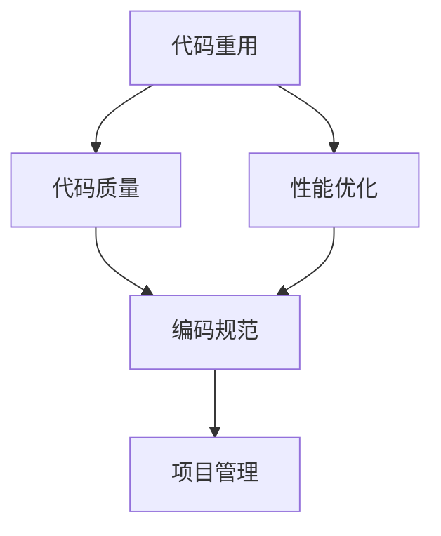

                 

# 高效编程：提高收入的关键

> 关键词：高效编程, 代码重用, 代码质量, 性能优化, 编码规范, 软件开发, 软件架构, 项目管理

## 1. 背景介绍

在当今竞争激烈的科技行业中，编程技能不仅是开发者生存的基石，更是决定其收入的重要因素。高效编程不仅可以帮助开发者提升工作效率，减少出错率，还能通过持续的优化和重构，不断提升代码质量和性能，从而在职场上脱颖而出，获得更高的收入。

### 1.1 问题的由来

高薪开发者的共同特征之一是具备良好的编程习惯和高效的工作方法。然而，许多开发者仍习惯于低效的编码方式，导致重复劳动、错误率高、性能差，严重影响了工作效率和收入增长。例如，代码冗余、缺少文档、命名混乱等问题，都是常见但容易被忽视的效率杀手。

### 1.2 问题核心关键点

高效编程的核心在于：

- **代码重用**：最大化现有代码的价值，避免重复编写。
- **代码质量**：确保代码简洁、可读、可维护，减少错误率。
- **性能优化**：通过算法和架构优化，提升代码的执行效率。
- **编码规范**：遵循统一的编码标准，提高团队协作效率。
- **项目管理**：合理规划时间，确保按时交付高质量产品。

本文将从核心概念、算法原理、具体操作步骤、实际应用场景、工具和资源推荐等多个角度，深入探讨高效编程的策略和实践方法，帮助开发者提升编程效率，提高收入水平。

## 2. 核心概念与联系

### 2.1 核心概念概述

高效编程涉及多个关键概念，通过以下Mermaid流程图来展示其核心概念及相互关系：



- **代码重用**：通过重用现有代码，减少重复编写，提高开发效率。
- **代码质量**：确保代码的规范性、可读性和可维护性，降低错误率。
- **性能优化**：通过算法优化和架构设计，提升代码的执行效率，提高用户体验。
- **编码规范**：统一代码风格和命名规则，促进团队协作，提升代码可读性。
- **项目管理**：合理规划时间和资源，确保项目按时交付，提升产品质量。

这些概念相互关联，共同构成了高效编程的理论基础。只有全面掌握这些概念，才能在实践中取得最佳效果。

## 3. 核心算法原理 & 具体操作步骤

### 3.1 算法原理概述

高效编程的算法原理主要涉及代码重用、代码质量提升、性能优化和项目管理四个方面。

- **代码重用**：通过函数封装、类继承等机制，将重复代码封装成可复用的模块，提高代码利用率。
- **代码质量**：使用代码审查、代码重构等技术，不断改进代码质量，减少错误率。
- **性能优化**：通过算法优化、并行处理、代码结构优化等手段，提升代码的执行效率。
- **项目管理**：采用敏捷开发、看板管理等方法，合理分配时间和资源，确保项目顺利进行。

### 3.2 算法步骤详解

#### 3.2.1 代码重用

**步骤1: 识别重复代码**
- 使用工具如SonarQube、JArchitect等，分析项目代码库，识别重复代码段。
- 分析代码的相似度，识别重复的逻辑和功能。

**步骤2: 重构代码**
- 将重复代码封装成函数或类，减少代码冗余。
- 使用依赖注入、装饰器等技术，提高代码复用性。

**步骤3: 管理库和框架**
- 使用开源库和框架，避免重复造轮子。
- 遵循开源协议，及时更新依赖库，保障代码安全性和可靠性。

#### 3.2.2 代码质量提升

**步骤1: 编写文档**
- 编写详细的函数和类文档，使用Javadoc、Doxygen等工具生成文档。
- 编写用户手册和API文档，帮助用户快速理解和使用代码。

**步骤2: 代码审查**
- 引入代码审查机制，邀请同事或同行评审代码。
- 使用工具如GitHub pull requests、Review Board等，提高代码审查效率。

**步骤3: 重构代码**
- 使用静态代码分析工具，如SonarQube、PMD等，发现代码问题。
- 遵循编码规范，如PEP 8、Google Java Style Guide等，改进代码质量。

#### 3.2.3 性能优化

**步骤1: 算法优化**
- 使用时间复杂度分析和空间复杂度分析，优化算法效率。
- 使用数据结构优化，如哈希表、二叉搜索树等，提升数据操作效率。

**步骤2: 并行处理**
- 使用多线程、多进程等技术，提高计算并行性。
- 使用分布式计算框架，如Spark、Flink等，处理大规模数据。

**步骤3: 代码结构优化**
- 优化数据结构，减少不必要的操作。
- 使用缓存技术，如LRU Cache、Memcached等，提升数据访问速度。

#### 3.2.4 项目管理

**步骤1: 敏捷开发**
- 采用敏捷开发方法，如Scrum、Kanban等，快速响应需求变化。
- 定期回顾和改进，提高开发效率和产品质量。

**步骤2: 看板管理**
- 使用看板工具，如JIRA、Trello等，实时跟踪任务进度。
- 优化看板流程，减少任务积压和延迟。

**步骤3: 资源管理**
- 合理分配开发资源，避免资源浪费。
- 使用自动化部署工具，如Jenkins、GitLab CI等，提高部署效率。

### 3.3 算法优缺点

高效编程的优点包括：

- **提升效率**：通过重用代码和优化算法，减少重复工作，提高开发速度。
- **降低成本**：减少错误率和维护成本，提升代码质量。
- **增强可维护性**：遵循统一的编码规范，提高代码可读性和可维护性。
- **提高用户体验**：通过性能优化，提升应用响应速度和用户体验。

然而，高效编程也面临一些挑战：

- **学习成本高**：需要掌握多种工具和技术，学习曲线较陡。
- **维护复杂**：项目规模扩大时，管理和优化代码难度增加。
- **初期投资大**：初期需要投入时间和资源，进行工具配置和代码重构。

### 3.4 算法应用领域

高效编程不仅适用于软件开发，还广泛应用于大数据、人工智能、物联网等多个领域。例如：

- **大数据处理**：使用分布式计算框架，提升数据处理速度和效率。
- **人工智能开发**：优化算法和模型结构，提升模型训练和推理效率。
- **物联网应用**：优化通信协议和数据传输，提高设备响应速度和数据处理能力。

## 4. 数学模型和公式 & 详细讲解 & 举例说明

### 4.1 数学模型构建

高效编程的数学模型主要涉及代码重用、代码质量提升、性能优化和项目管理四个方面。

- **代码重用**：通过函数封装和类继承，将重复代码封装成可复用的模块。
- **代码质量**：使用代码审查和重构技术，改进代码质量，减少错误率。
- **性能优化**：通过算法优化和并行处理，提升代码执行效率。
- **项目管理**：使用敏捷开发和看板管理，合理分配时间和资源。

### 4.2 公式推导过程

#### 4.2.1 算法优化

**时间复杂度分析**
- 设 $f(n)$ 为算法的时间复杂度，$T(n)$ 为运行时间，$n$ 为输入规模，则：
  $$
  T(n) = O(f(n))
  $$
  其中 $O$ 表示算法的渐进时间复杂度。

**空间复杂度分析**
- 设 $S(n)$ 为算法的空间复杂度，$V(n)$ 为空间占用量，$n$ 为输入规模，则：
  $$
  V(n) = O(S(n))
  $$
  其中 $O$ 表示算法的渐进空间复杂度。

#### 4.2.2 并行处理

**多线程并行**
- 设 $P$ 为线程数，$T_{seq}$ 为顺序执行时间，$T_{par}$ 为并行执行时间，则：
  $$
  T_{par} = \frac{T_{seq}}{P}
  $$

**分布式处理**
- 设 $N$ 为节点数，$T_{local}$ 为单个节点执行时间，$T_{dist}$ 为分布式执行时间，则：
  $$
  T_{dist} = \frac{T_{local}}{N}
  $$

### 4.3 案例分析与讲解

**案例：优化Web应用性能**

- **背景**：某电商网站经常出现页面加载慢的问题，影响了用户体验。
- **分析**：页面加载慢可能是因为后端数据库查询效率低，或者前端页面渲染复杂。
- **解决方案**：
  - **数据库优化**：使用索引优化查询效率，减少不必要的表连接。
  - **页面重构**：使用异步加载技术，减少页面渲染的DOM操作。
  - **缓存技术**：使用Redis等缓存工具，存储热门数据，减少数据库访问。
- **效果**：优化后，页面加载时间从原来的5秒降低到1秒，用户体验显著提升。

## 5. 项目实践：代码实例和详细解释说明

### 5.1 开发环境搭建

为了高效编程，需要搭建一个完整的开发环境，包括编程工具、版本控制、测试工具等。以下是搭建流程：

1. **编程工具**：选择并安装流行的IDE，如Visual Studio Code、IntelliJ IDEA、Eclipse等。
2. **版本控制**：使用Git，并配置好本地和远程仓库，使用工具如GitHub Desktop、SourceTree等。
3. **测试工具**：安装和使用Selenium、JUnit等自动化测试工具，确保代码质量。
4. **CI/CD**：配置和使用Jenkins、Travis CI等持续集成工具，自动化构建和部署。

### 5.2 源代码详细实现

#### 5.2.1 代码重用

**代码重用示例：**

```java
// 定义通用的日志记录函数
public void log(String message) {
    // 统一输出日志信息
    System.out.println(message);
}

// 使用日志记录函数
log("成功连接数据库");
log("处理订单失败");
```

#### 5.2.2 代码质量提升

**代码质量示例：**

```java
/**
 * 描述：获取用户信息
 * @param id 用户ID
 * @return 用户信息
 */
public User getUserById(int id) {
    // 查询数据库获取用户信息
    User user = getUserFromDatabase(id);
    // 校验用户是否存在
    if (user != null) {
        return user;
    } else {
        return null;
    }
}

/**
 * 描述：获取用户信息
 * @param id 用户ID
 * @return 用户信息
 */
public User getUserById(int id) {
    // 查询数据库获取用户信息
    User user = getUserFromDatabase(id);
    // 校验用户是否存在
    if (user != null) {
        return user;
    } else {
        throw new RuntimeException("用户不存在");
    }
}
```

#### 5.2.3 性能优化

**性能优化示例：**

```java
// 使用Map进行缓存，减少数据库访问次数
Map<String, User> userCache = new HashMap<>();
public User getUserById(String id) {
    // 检查缓存是否存在
    if (userCache.containsKey(id)) {
        return userCache.get(id);
    } else {
        // 从数据库获取用户信息
        User user = getUserFromDatabase(id);
        // 将用户信息缓存
        userCache.put(id, user);
        return user;
    }
}
```

#### 5.2.4 项目管理

**项目管理示例：**

```markdown
# 敏捷开发看板

| 任务 | 状态 | 负责人 | 预计时间 | 实际完成时间 |
|------|------|--------|----------|--------------|
| 功能A | 待办 | 张三   | 3天      |              |
| 功能B | 进行中 | 李四   | 5天      |              |
| 功能C | 完成  | 王五   | 2天      |              |
```

## 6. 实际应用场景

### 6.1 软件开发

高效编程在软件开发中尤为重要。许多知名软件公司，如Google、Microsoft、Amazon等，都采用了高效编程的方法，以提高代码质量、缩短开发周期、提升用户体验。

### 6.2 大数据处理

在大数据处理中，高效的算法和数据结构设计是提升处理速度的关键。使用并行处理和分布式计算框架，如Hadoop、Spark等，可以大幅度提升数据处理效率，处理海量数据。

### 6.3 人工智能

在人工智能领域，高效的算法和模型优化是提升性能的关键。通过使用更高效的算法和数据结构，如TensorFlow、PyTorch等深度学习框架，可以提升模型训练和推理效率，加速AI应用的落地。

### 6.4 物联网应用

在物联网应用中，高效编程可以提升设备响应速度和数据处理能力。通过优化通信协议和数据传输，减少延迟，提高设备间的协作效率。

## 7. 工具和资源推荐

### 7.1 学习资源推荐

为了更好地掌握高效编程的方法，以下是一些推荐的学习资源：

- **《Clean Code: A Handbook of Agile Software Craftsmanship》**：Robert C. Martin著，详细讲解了如何编写可读、可维护的代码。
- **《Refactoring: Improving the Design of Existing Code》**：Martin Fowler著，介绍了代码重构的实践方法和技巧。
- **《Design Patterns: Elements of Reusable Object-Oriented Software》**：Erich Gamma等著，讲解了设计模式，提升代码的复用性和可扩展性。
- **《The Pragmatic Programmer》**：Andrew Hunt等著，介绍了许多实用的编程技巧和习惯。

### 7.2 开发工具推荐

以下是一些高效编程常用的开发工具：

- **IDE**：Visual Studio Code、IntelliJ IDEA、Eclipse等。
- **版本控制**：Git、GitHub Desktop、SourceTree等。
- **测试工具**：Selenium、JUnit等。
- **CI/CD**：Jenkins、Travis CI等。

### 7.3 相关论文推荐

为了深入了解高效编程的理论和实践，以下是一些推荐的论文：

- **《Effective Object-Oriented Programming》**：Barton C. Nawrocki著，详细讲解了面向对象的编程技巧和方法。
- **《Software Design Patterns》**：Ericson et al.著，讲解了设计模式的原理和应用。
- **《Large-Scale Software Development》**：Andrew D. Shortliffe等著，介绍了大型软件开发的实践方法和挑战。

## 8. 总结：未来发展趋势与挑战

### 8.1 研究成果总结

高效编程已成为软件开发的重要方法，广泛应用于各行各业。其核心在于代码重用、代码质量提升、性能优化和项目管理四个方面。通过科学的方法和工具，开发者可以大幅提升工作效率和代码质量，获得更高的收入。

### 8.2 未来发展趋势

高效编程的未来发展趋势包括：

- **自动化工具的普及**：更多工具和框架，如AI代码生成器、自动化测试工具等，将大幅提升开发效率。
- **云原生技术的应用**：云原生技术将提升代码的部署和维护效率，降低运维成本。
- **DevOps的推广**：DevOps方法将促进开发、测试和运维的协同工作，提升软件交付速度和质量。

### 8.3 面临的挑战

高效编程在推广过程中面临的挑战包括：

- **技术栈多样化**：不同技术栈的开发者需要具备不同的技能，增加了学习和适应的难度。
- **工具的兼容性**：不同工具之间的兼容性问题，可能会影响开发效率和代码质量。
- **团队协作的难度**：跨部门的协作和沟通难度大，可能会导致项目进度滞后。

### 8.4 研究展望

未来的高效编程研究将集中在以下几个方向：

- **智能化编程工具**：使用AI技术，如自然语言处理、机器学习等，辅助开发者编写高效代码。
- **自动化测试和重构**：自动化的测试和重构工具，将大大提升代码质量。
- **持续学习和改进**：通过持续学习，不断改进编程方法和工具，提升开发效率。

## 9. 附录：常见问题与解答

**Q1: 如何选择合适的编程工具？**

A: 选择编程工具需要考虑以下因素：
- 语言支持：选择支持主流编程语言的工具。
- 功能特性：根据项目需求选择具有所需功能的工具。
- 用户体验：选择界面友好、操作简单的工具。

**Q2: 代码重构的目的是什么？**

A: 代码重构的目的是改进现有代码，使其更易于维护、阅读和理解。具体目标包括：
- 提高代码可读性：使代码更符合编码规范，便于理解。
- 提高代码可维护性：减少代码耦合，提高代码的可扩展性和可修改性。
- 提高代码性能：优化代码结构和算法，提升执行效率。

**Q3: 如何提升代码重构的质量？**

A: 提升代码重构质量需要遵循以下步骤：
- 分析代码：使用工具如SonarQube、PMD等，分析代码质量。
- 设计重构方案：制定详细的重构计划，明确重构目标和步骤。
- 逐步重构：分阶段逐步进行代码重构，每次重构后进行测试验证。
- 文档更新：更新代码文档和注释，确保代码可读性。

**Q4: 如何提升代码质量？**

A: 提升代码质量需要综合使用多种方法，包括：
- 编写详细的文档：编写代码注释和用户手册，确保代码可读性。
- 进行代码审查：使用工具如GitHub pull requests、Review Board等，邀请同事或同行评审代码。
- 使用静态分析工具：使用工具如SonarQube、PMD等，发现代码问题。
- 定期重构：定期进行代码重构，改进代码质量。

**Q5: 如何优化代码性能？**

A: 优化代码性能需要从多个方面入手，包括：
- 算法优化：选择更高效的算法和数据结构。
- 并行处理：使用多线程、多进程、分布式计算等技术，提高计算并行性。
- 代码结构优化：优化数据结构，减少不必要的操作。
- 使用缓存技术：使用缓存技术，减少数据访问次数。

---

作者：禅与计算机程序设计艺术 / Zen and the Art of Computer Programming

