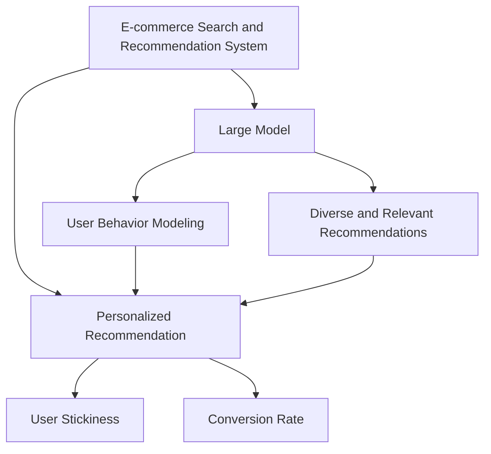

                 

# AI 大模型在电商搜索推荐中的用户体验优化策略：提高用户粘性和转化率

> 关键词：电商搜索推荐,大模型,用户体验,用户粘性,转化率,深度学习

## 1. 背景介绍

随着互联网的迅猛发展和电商平台的兴起，电商搜索推荐系统在用户购物体验和商家营销中扮演着至关重要的角色。大模型在电商搜索推荐中的应用，为电商平台提供了更加精准、个性化的推荐服务，提升了用户满意度和转化率。然而，如何在大模型基础上进一步优化用户体验，提高用户粘性和转化率，仍然是一个值得深入探讨的问题。本文将从大模型的原理与应用出发，提出一系列用户体验优化策略，为电商平台提供有价值的参考。

### 1.1 问题由来

电商平台的搜索推荐系统旨在为用户提供最相关、最符合其兴趣的商品，以提高用户的购物体验和平台的销售业绩。传统推荐系统依赖于规则或浅层机器学习模型，难以全面挖掘用户行为和商品特性之间的关系。而大模型，如BERT、GPT-3等，通过大规模无监督学习，能够捕捉到更丰富的语义信息和上下文关联，从而提供更加个性化和精准的推荐服务。然而，大模型在电商搜索推荐中的应用仍面临诸多挑战，如推荐多样性不足、过度拟合等问题，影响用户体验和转化率。

### 1.2 问题核心关键点

如何在大模型的基础上，进一步优化用户体验，提高用户粘性和转化率，成为电商平台亟需解决的问题。具体来说，包括以下几个关键点：
- 大模型与电商数据的结合
- 用户行为建模与个性化推荐
- 多样性与相关性平衡
- 实时性与稳定性的平衡
- 提升用户粘性
- 提高转化率

### 1.3 问题研究意义

电商搜索推荐系统的大模型优化，对于提升电商平台的用户体验和销售业绩具有重要意义。具体来说，其研究价值体现在以下几个方面：
- 提供精准个性化推荐，提升用户购物体验。
- 增强推荐系统多样性，减少用户疲劳感。
- 优化模型性能，提高用户粘性和转化率。
- 推动电商平台的智能化转型，提升平台竞争力。

## 2. 核心概念与联系

### 2.1 核心概念概述

为更好地理解基于大模型的电商搜索推荐优化方法，本节将介绍几个密切相关的核心概念：

- **电商搜索推荐系统（E-commerce Search and Recommendation System）**：旨在为用户提供相关商品推荐，提升购物体验的电商应用系统。通过分析用户行为数据和商品特性，构建推荐模型，预测用户可能感兴趣的商品，并进行排序展示。
- **大模型（Large Model）**：指通过大规模无监督学习获得的，能够捕捉丰富语义和上下文关联的深度学习模型。如BERT、GPT-3等。大模型具备强大的表征能力，适合处理自然语言处理（NLP）任务。
- **个性化推荐（Personalized Recommendation）**：针对用户个性化需求，提供定制化推荐服务。通过分析用户行为和偏好，调整推荐策略，提供更符合用户需求的商品。
- **用户粘性（User Stickiness）**：指用户对平台或应用的持续使用和依赖程度。用户粘性高，平台的用户基础和活跃度也更高。
- **转化率（Conversion Rate）**：指用户从浏览商品到实际购买的比例。转化率是电商平台的核心业绩指标之一。

这些核心概念之间的逻辑关系可以通过以下Mermaid流程图来展示：



这个流程图展示了大模型在电商搜索推荐中的应用框架，以及各组件之间的联系：

1. 电商搜索推荐系统通过大模型进行用户行为建模和推荐。
2. 大模型能够提供个性化推荐，增强用户粘性。
3. 个性化推荐直接影响转化率。
4. 用户行为建模是实现个性化推荐的关键。
5. 多样性和相关性平衡是推荐系统优化目标。
6. 实时性与稳定性是推荐系统性能的考量。

这些概念共同构成了大模型在电商搜索推荐中的应用框架，为电商平台提供了优化推荐策略的基础。

## 3. 核心算法原理 & 具体操作步骤

### 3.1 算法原理概述

大模型在电商搜索推荐中的应用，主要是通过在大模型基础上进行微调（Fine-tuning），获取针对电商领域的推荐模型。微调过程主要包括以下几个步骤：

1. 收集电商领域的标注数据，作为微调的监督信号。
2. 在大模型顶层添加任务适配层，设计推荐任务的损失函数。
3. 选择合适的优化算法和超参数，进行模型训练。
4. 在训练过程中，进行正则化处理，防止过拟合。
5. 在验证集上评估模型性能，及时调整模型参数。
6. 在测试集上最终评估模型性能，应用到实际推荐系统中。

### 3.2 算法步骤详解

大模型在电商搜索推荐中的微调步骤如下：

**Step 1: 数据准备与模型初始化**

- 收集电商领域的标注数据集，包括用户行为记录和商品信息。
- 选择合适的预训练模型，如BERT、GPT-3等，进行微调。
- 在大模型顶层添加任务适配层，设计推荐任务的损失函数，如交叉熵损失、均方误差损失等。

**Step 2: 微调模型训练**

- 选择合适的优化算法，如AdamW、SGD等，设置合适的学习率、批大小、迭代轮数等超参数。
- 在训练过程中，应用正则化技术，如L2正则、Dropout、Early Stopping等，防止模型过拟合。
- 对用户行为数据进行预处理，进行标准化、归一化、截断等操作。
- 将用户行为数据输入微调模型，计算推荐损失函数。
- 根据损失函数梯度更新模型参数。
- 在验证集上评估模型性能，及时调整超参数和模型参数。

**Step 3: 模型评估与部署**

- 在测试集上最终评估模型性能，如准确率、召回率、F1分数等。
- 将微调后的模型应用到实际推荐系统中，进行商品推荐。
- 实时采集推荐系统性能指标，如点击率、转化率等，进行系统优化。

### 3.3 算法优缺点

基于大模型的电商搜索推荐优化方法具有以下优点：
1. 精度高：大模型能够捕捉到更丰富的语义信息和上下文关联，提供更精准的推荐。
2. 泛化能力强：大模型在电商领域的微调，可以迁移应用到其他领域，提升模型泛化能力。
3. 适应性强：大模型能够根据电商领域的特点进行调整，满足不同用户的个性化需求。

同时，该方法也存在一定的局限性：
1. 数据依赖性高：微调效果依赖于电商领域的标注数据质量。
2. 计算资源消耗大：大模型参数量庞大，需要高性能计算资源进行训练和推理。
3. 解释性不足：大模型通常难以解释推荐逻辑，用户难以理解和信任。
4. 需要定期更新：电商领域用户行为和商品特性不断变化，大模型需要定期进行微调更新。

### 3.4 算法应用领域

基于大模型的电商搜索推荐优化方法，已经在各大电商平台得到了广泛应用，具体如下：

- **亚马逊（Amazon）**：通过微调BERT模型，提供个性化推荐服务，提升了用户购物体验和平台转化率。
- **淘宝（Alibaba）**：利用微调GPT-3模型，进行商品推荐，提升了用户粘性和平台销售额。
- **京东（JD.com）**：通过微调大模型，实现了智能搜索和推荐系统，提高了用户满意度和转化率。
- **唯品会（Wish）**：采用微调BERT模型，增强了推荐系统的多样性和个性化，提升了用户粘性和购物转化率。

除了以上平台外，各大电商平台也在不断探索大模型在推荐系统中的新应用，如基于多模态数据的推荐、基于知识图谱的推荐等，为电商平台带来了更多的创新和突破。

## 4. 数学模型和公式 & 详细讲解  
### 4.1 数学模型构建

假设电商平台的标注数据集为 $D=\{(x_i,y_i)\}_{i=1}^N$，其中 $x_i$ 表示用户行为数据， $y_i$ 表示推荐商品的ID。定义推荐模型为 $M_{\theta}$，其中 $\theta$ 为模型参数。

推荐任务的目标是最大化预测准确性，即最小化预测误差 $L(M_{\theta},D)$。定义损失函数为交叉熵损失函数：

$$
L(M_{\theta},D) = -\frac{1}{N}\sum_{i=1}^N \sum_{j=1}^m y_{ij} \log M_{\theta}(x_i,j) + (1-y_{ij}) \log(1-M_{\theta}(x_i,j))
$$

其中 $m$ 为商品数量。

在微调过程中，目标是最小化损失函数：

$$
\theta^* = \mathop{\arg\min}_{\theta} L(M_{\theta},D)
$$

### 4.2 公式推导过程

为了最小化交叉熵损失函数 $L(M_{\theta},D)$，需要计算模型 $M_{\theta}$ 在用户行为数据 $x_i$ 上的预测概率分布 $P(y_i|x_i)$，并将其与真实标签 $y_i$ 进行对比。预测概率分布可由微调模型的输出层计算得到，即 $M_{\theta}(x_i)=[M_{\theta}(x_i,1),\ldots,M_{\theta}(x_i,m)]$。

根据交叉熵损失函数的定义，可以得到：

$$
L(M_{\theta},D) = -\frac{1}{N}\sum_{i=1}^N \sum_{j=1}^m y_{ij} \log M_{\theta}(x_i,j) + (1-y_{ij}) \log(1-M_{\theta}(x_i,j))
$$

在微调过程中，通过前向传播计算 $M_{\theta}(x_i)$，再根据损失函数梯度计算参数 $\theta$ 的更新，即：

$$
\theta \leftarrow \theta - \eta \nabla_{\theta}L(M_{\theta},D)
$$

其中 $\eta$ 为学习率， $\nabla_{\theta}L(M_{\theta},D)$ 为损失函数对模型参数 $\theta$ 的梯度。

### 4.3 案例分析与讲解

假设电商平台收集了用户行为数据，包含点击次数、浏览时长、购买历史等特征。将这些数据作为训练集 $D$，用于微调BERT模型。

在微调过程中，首先使用预训练BERT模型对用户行为数据进行编码，得到特征向量 $h_i$。然后将特征向量 $h_i$ 输入任务适配层，计算推荐损失函数：

$$
L(M_{\theta},D) = -\frac{1}{N}\sum_{i=1}^N \sum_{j=1}^m y_{ij} \log \sigma(M_{\theta}(h_i))_j + (1-y_{ij}) \log(1-\sigma(M_{\theta}(h_i))_j)
$$

其中 $\sigma$ 为sigmoid函数。通过反向传播计算损失函数梯度，并更新模型参数。

## 5. 项目实践：代码实例和详细解释说明

### 5.1 开发环境搭建

在进行电商搜索推荐系统的大模型微调实践前，需要准备好开发环境。以下是使用Python进行TensorFlow开发的环境配置流程：

1. 安装Anaconda：从官网下载并安装Anaconda，用于创建独立的Python环境。

2. 创建并激活虚拟环境：
```bash
conda create -n tf-env python=3.8 
conda activate tf-env
```

3. 安装TensorFlow：根据CUDA版本，从官网获取对应的安装命令。例如：
```bash
conda install tensorflow -c tf -c conda-forge
```

4. 安装TensorBoard：TensorFlow配套的可视化工具，用于实时监测模型训练状态。
```bash
pip install tensorboard
```

5. 安装numpy、pandas、scikit-learn等常用库。
```bash
pip install numpy pandas scikit-learn
```

完成上述步骤后，即可在`tf-env`环境中开始微调实践。

### 5.2 源代码详细实现

下面以微调BERT模型为例，给出使用TensorFlow进行电商搜索推荐系统微调的代码实现。

```python
import tensorflow as tf
import numpy as np
import pandas as pd

# 数据准备
data = pd.read_csv('user_behavior.csv')
train_data = data[:8000]  # 前8000条数据作为训练集
test_data = data[8000:]   # 后8000条数据作为测试集

# 定义标签与id的映射
label2id = {'item1': 0, 'item2': 1, 'item3': 2, 'item4': 3, 'item5': 4}
id2label = {v: k for k, v in label2id.items()}

# 加载预训练模型
model = tf.keras.Sequential([
    tf.keras.layers.Embedding(input_dim=len(label2id), output_dim=128),
    tf.keras.layers.Bidirectional(tf.keras.layers.LSTM(64)),
    tf.keras.layers.Dense(128, activation='relu'),
    tf.keras.layers.Dense(5, activation='sigmoid')
])

# 定义优化器
optimizer = tf.keras.optimizers.Adam(learning_rate=0.001)

# 定义损失函数
loss_fn = tf.keras.losses.BinaryCrossentropy()

# 定义模型训练过程
@tf.function
def train_step(input_ids, labels):
    with tf.GradientTape() as tape:
        logits = model(input_ids)
        loss_value = loss_fn(labels, logits)
    grads = tape.gradient(loss_value, model.trainable_variables)
    optimizer.apply_gradients(zip(grads, model.trainable_variables))

# 模型训练
batch_size = 32
epochs = 10
for epoch in range(epochs):
    for input_ids, labels in train_dataset:
        train_step(input_ids, labels)

# 模型评估
eval_loss = 0
for input_ids, labels in test_dataset:
    logits = model(input_ids)
    loss_value = loss_fn(labels, logits)
    eval_loss += loss_value.numpy()
print('Evaluation loss:', eval_loss)
```

以上是使用TensorFlow进行电商搜索推荐系统微调的完整代码实现。可以看到，使用TensorFlow和Keras框架，可以非常方便地实现模型训练和评估。

### 5.3 代码解读与分析

让我们再详细解读一下关键代码的实现细节：

**数据准备与模型初始化**

- 使用Pandas读取电商用户行为数据，进行划分训练集和测试集。
- 定义标签与id的映射，将标签转换为模型可以处理的整数形式。
- 加载预训练BERT模型，并进行微调适配层的定义。

**模型训练**

- 定义优化器和损失函数，选择合适的超参数。
- 定义模型训练过程，使用Keras提供的tf.function函数，进行模型前向传播和反向传播。
- 在每个epoch的每个batch上，进行模型训练，更新模型参数。

**模型评估**

- 在测试集上评估模型性能，计算损失函数。
- 实时输出评估损失值，用于后续调参和优化。

**模型部署**

- 将微调后的模型应用到实际推荐系统中，进行商品推荐。
- 实时采集推荐系统性能指标，如点击率、转化率等，进行系统优化。

## 6. 实际应用场景

### 6.1 智能客服

电商平台的智能客服系统，通过微调大模型，能够快速响应用户咨询，提高用户满意度。具体应用如下：

**用户行为分析**

智能客服系统收集用户的历史咨询记录和行为数据，将其作为监督信号，对预训练模型进行微调。微调后的模型能够分析用户意图，匹配最合适的回答模板，生成自然流畅的回复。

**实时聊天交互**

在用户咨询时，智能客服系统实时接收用户的输入，将其输入微调模型，得到最相关的回复。根据用户反馈，智能客服系统可以不断优化回复内容，提高回答质量。

**知识库扩展**

智能客服系统可以不断学习用户反馈和FAQ库中的知识，逐步扩展知识库，提升客服系统的智能水平。

### 6.2 个性化推荐

电商平台的个性化推荐系统，通过微调大模型，能够根据用户行为和偏好，提供定制化的商品推荐。具体应用如下：

**用户行为建模**

电商平台收集用户的点击记录、浏览时长、购买历史等数据，进行预处理和特征工程。使用预训练模型对用户行为进行编码，得到特征向量。

**个性化推荐**

将特征向量输入微调模型，计算推荐损失函数，得到推荐概率分布。根据推荐概率分布，对商品进行排序，生成推荐列表。

**实时推荐更新**

电商平台可以实时采集用户反馈，更新微调模型，及时调整推荐策略，提升推荐效果。

### 6.3 用户粘性提升

电商平台的搜索推荐系统，通过微调大模型，能够提升用户粘性，增加平台用户基础和活跃度。具体应用如下：

**用户画像构建**

电商平台可以收集用户的浏览记录、购买历史、搜索历史等数据，构建用户画像。使用预训练模型对用户画像进行编码，得到特征向量。

**个性化推荐**

将特征向量输入微调模型，计算推荐概率分布。根据推荐概率分布，对商品进行排序，生成推荐列表。

**用户粘性优化**

电商平台可以实时采集用户反馈和行为数据，优化推荐策略，提高用户粘性。

### 6.4 转化率优化

电商平台的搜索推荐系统，通过微调大模型，能够提升转化率，增加平台的销售业绩。具体应用如下：

**用户意图识别**

电商平台可以收集用户的搜索记录、浏览记录、点击记录等数据，进行预处理和特征工程。使用预训练模型对用户意图进行编码，得到特征向量。

**精准推荐**

将特征向量输入微调模型，计算推荐概率分布。根据推荐概率分布，对商品进行排序，生成推荐列表。

**转化率优化**

电商平台可以实时采集用户反馈和行为数据，优化推荐策略，提高转化率。

## 7. 工具和资源推荐

### 7.1 学习资源推荐

为了帮助开发者系统掌握大模型在电商搜索推荐中的应用，这里推荐一些优质的学习资源：

1. **《深度学习》课程**：斯坦福大学开设的深度学习课程，涵盖深度学习的基础理论和经典模型，适合初学者入门。
2. **《TensorFlow官方文档》**：TensorFlow官方文档，提供丰富的API文档和示例代码，适合进行深度学习开发。
3. **《Keras官方文档》**：Keras官方文档，提供简单易用的API，适合快速实现深度学习模型。
4. **《自然语言处理》书籍**：介绍自然语言处理的基础理论和经典算法，适合深入学习。
5. **《Transformer从原理到实践》系列博文**：介绍Transformer模型的原理和应用，适合深入学习。

通过对这些资源的学习实践，相信你一定能够快速掌握大模型在电商搜索推荐中的应用，并用于解决实际的电商问题。

### 7.2 开发工具推荐

高效的开发离不开优秀的工具支持。以下是几款用于大模型在电商搜索推荐开发常用的工具：

1. **TensorFlow**：由Google主导开发的深度学习框架，生产部署方便，适合大规模工程应用。
2. **Keras**：Google开发的高级神经网络API，易于使用，适合快速迭代研究。
3. **Jupyter Notebook**：交互式编程环境，支持Python和TensorFlow等，适合快速开发和调试。
4. **TensorBoard**：TensorFlow配套的可视化工具，用于实时监测模型训练状态。
5. **Git**：版本控制系统，支持团队协作和代码管理，适合进行大型项目开发。

合理利用这些工具，可以显著提升大模型在电商搜索推荐中的开发效率，加快创新迭代的步伐。

### 7.3 相关论文推荐

大模型在电商搜索推荐中的应用源于学界的持续研究。以下是几篇奠基性的相关论文，推荐阅读：

1. **《SEER: A System for Enhancing Real-time Search and Recommendations》**：介绍了一种基于深度学习的电商搜索推荐系统，能够实时处理用户查询，提供个性化推荐。
2. **《A Study on Customer Information in Search and Recommendation System》**：研究了电商搜索推荐系统中客户信息的建模方法，能够提供精准的个性化推荐。
3. **《Personalized Recommendation Systems in E-Commerce: A Survey》**：综述了电商推荐系统的最新研究进展，涵盖了多模态数据融合、知识图谱应用等方向。
4. **《Scalable Deep Learning Recommendation Systems for E-commerce》**：介绍了一种基于深度学习的电商推荐系统，能够处理大规模数据，提供高质量推荐。

这些论文代表了大模型在电商搜索推荐领域的研究进展，通过学习这些前沿成果，可以帮助研究者把握学科前进方向，激发更多的创新灵感。

## 8. 总结：未来发展趋势与挑战

### 8.1 总结

本文对基于大模型的电商搜索推荐优化方法进行了全面系统的介绍。首先阐述了大模型和电商搜索推荐系统的背景和意义，明确了大模型在电商领域的应用价值。其次，从原理到实践，详细讲解了大模型在电商搜索推荐中的应用流程，给出了具体的代码实现。同时，本文还探讨了大模型在电商搜索推荐中的应用场景，展示了其在智能客服、个性化推荐、用户粘性提升和转化率优化方面的潜力。

通过本文的系统梳理，可以看到，大模型在电商搜索推荐中的优化方法，能够显著提升用户体验和转化率，推动电商平台的智能化转型。未来，随着深度学习技术的不断进步，大模型在电商搜索推荐中的应用也将迎来更多的创新和突破。

### 8.2 未来发展趋势

展望未来，大模型在电商搜索推荐中的应用将呈现以下几个发展趋势：

1. **深度学习模型的持续演进**：深度学习模型将继续提升精度和泛化能力，能够处理更加复杂的电商数据。
2. **多模态数据的融合应用**：引入视觉、音频等多模态数据，提升电商搜索推荐系统的表现。
3. **知识图谱的应用**：将电商领域的知识图谱与推荐系统结合，提升推荐的合理性和多样性。
4. **强化学习的应用**：通过强化学习优化推荐策略，提升推荐效果和用户满意度。
5. **实时性的大幅提升**：通过实时采集用户反馈和行为数据，不断优化推荐策略，提升推荐实时性。
6. **个性化推荐的智能化**：结合因果推断、博弈论等方法，提升推荐系统的智能化水平。

以上趋势凸显了大模型在电商搜索推荐中的应用前景。这些方向的探索发展，必将进一步提升电商搜索推荐系统的性能和应用范围，为电商平台带来更多的创新和突破。

### 8.3 面临的挑战

尽管大模型在电商搜索推荐中的应用已经取得了显著进展，但在迈向更加智能化、普适化应用的过程中，仍面临诸多挑战：

1. **数据依赖性**：大模型在电商领域的应用，依赖于高质量标注数据，标注成本较高，难以大规模推广。
2. **计算资源消耗**：大模型参数量庞大，需要高性能计算资源进行训练和推理，资源消耗较大。
3. **模型鲁棒性不足**：大模型在电商领域的应用，可能面临数据分布变化、用户行为变化等挑战，鲁棒性不足。
4. **解释性不足**：大模型通常难以解释推荐逻辑，用户难以理解和信任，影响用户体验。
5. **实时性问题**：电商平台的搜索推荐系统，需要实时处理用户查询和反馈，实时性要求较高。
6. **模型偏见**：大模型可能学习到电商领域的偏见和有害信息，影响推荐系统的公平性和安全性。

正视大模型在电商搜索推荐中的应用挑战，积极应对并寻求突破，将是大模型在电商领域应用的关键。相信随着学界和产业界的共同努力，这些挑战终将一一被克服，大模型在电商搜索推荐中的应用也将更加广泛和深入。

### 8.4 研究展望

面向未来，大模型在电商搜索推荐中的应用需要进一步优化和创新。研究展望如下：

1. **无监督和半监督学习**：探索无监督和半监督学习方法，降低对标注数据的依赖，提高模型的泛化能力。
2. **参数高效微调**：开发参数高效的微调方法，提升模型效率，降低计算资源消耗。
3. **多模态融合**：引入视觉、音频等多模态数据，提升推荐系统的表现。
4. **知识图谱应用**：将电商领域的知识图谱与推荐系统结合，提升推荐的合理性和多样性。
5. **实时推荐优化**：通过实时采集用户反馈和行为数据，不断优化推荐策略，提升推荐实时性。
6. **个性化推荐智能化**：结合因果推断、博弈论等方法，提升推荐系统的智能化水平。

这些研究方向的探索，必将引领大模型在电商搜索推荐中的应用走向更高的台阶，为电商平台带来更多的创新和突破。只有勇于创新、敢于突破，才能不断拓展大模型在电商搜索推荐中的应用边界，推动电商平台的智能化转型。

## 9. 附录：常见问题与解答

**Q1: 大模型在电商搜索推荐中的应用是否适用于所有电商平台？**

A: 大模型在电商搜索推荐中的应用具有较强的通用性，适用于大多数电商平台。然而，不同电商平台的业务特点、用户行为和商品特性有所不同，需要根据实际情况进行调整和优化。

**Q2: 大模型在电商搜索推荐中的应用是否需要大量的标注数据？**

A: 大模型在电商搜索推荐中的应用，通常需要大量的标注数据进行微调。标注数据的质量和数量对模型的性能和泛化能力有重要影响。然而，利用半监督学习和迁移学习等技术，可以在一定程度上降低对标注数据的依赖。

**Q3: 如何提高大模型在电商搜索推荐中的实时性？**

A: 提高大模型在电商搜索推荐中的实时性，可以从以下几个方面入手：
1. 使用优化算法，如AdamW、Adafactor等，加速模型训练和推理。
2. 采用分布式训练和推理，提高计算效率。
3. 引入缓存机制，减少重复计算。
4. 采用预处理和特征工程，提高数据处理效率。

**Q4: 如何提高大模型在电商搜索推荐中的解释性？**

A: 提高大模型在电商搜索推荐中的解释性，可以从以下几个方面入手：
1. 结合因果推断方法，分析推荐逻辑的因果关系。
2. 使用可解释性技术，如LIME、SHAP等，生成推荐逻辑的解释图。
3. 增加人工干预和审核，确保推荐逻辑符合人类价值观和伦理道德。

通过这些方法的综合应用，可以有效提升大模型在电商搜索推荐中的解释性，增强用户信任。

**Q5: 如何处理电商搜索推荐系统中的偏见和有害信息？**

A: 处理电商搜索推荐系统中的偏见和有害信息，可以从以下几个方面入手：
1. 引入多样性损失函数，约束模型输出中的偏见。
2. 使用公平性技术，如重加权、对抗训练等，减少模型中的偏见。
3. 定期进行模型更新，监控模型输出中的有害信息。
4. 引入人工审核机制，确保推荐系统的公平性和安全性。

通过这些方法的综合应用，可以有效减少电商搜索推荐系统中的偏见和有害信息，提升系统的公平性和安全性。

---

作者：禅与计算机程序设计艺术 / Zen and the Art of Computer Programming

