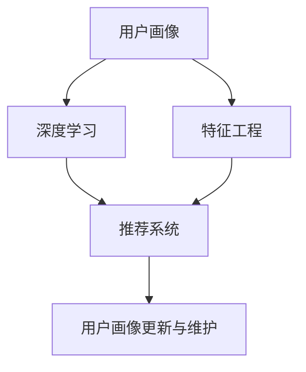

                 

# AI 大模型在电商搜索推荐中的用户画像技术：深度理解用户行为与需求偏好

> 关键词：
1. AI大模型
2. 用户画像
3. 深度学习
4. 电商搜索
5. 推荐系统
6. 用户行为分析
7. 需求偏好

## 1. 背景介绍

### 1.1 问题由来

随着电子商务的飞速发展，各大电商平台面临的竞争愈加激烈，用户体验和转化率成为平台追求的核心指标之一。为了更好地理解用户需求和行为，电商平台纷纷采用先进的人工智能和大数据技术，特别是利用深度学习模型进行用户画像的构建。用户画像的建立有助于平台更好地进行个性化推荐，提高用户满意度，增加交易转化率。

当前，深度学习模型在电商搜索推荐中的应用已经比较广泛，例如基于用户点击行为进行推荐、基于用户浏览历史生成推荐列表等。用户画像的构建是这些推荐模型的基础。本文旨在深度解析AI大模型在电商搜索推荐中用户画像技术的实现，涵盖深度学习模型的原理、具体算法步骤及其实际应用，并提出未来技术发展趋势及面临的挑战。

### 1.2 问题核心关键点

电商搜索推荐中的用户画像技术主要包括以下几个关键点：

1. **用户行为的深度学习模型**：构建用户行为的深度学习模型，可以从用户的历史点击、浏览、购买行为中提取有意义的特征，用于后续的用户画像和推荐。
2. **用户画像的特征工程**：在深度学习模型的基础上，进一步进行特征工程，包括特征选择、特征融合等，构建出能全面反映用户需求和行为的用户画像。
3. **推荐系统中的用户画像应用**：将用户画像应用到推荐系统中，进行个性化推荐，提升用户体验和交易转化率。
4. **用户画像的更新与维护**：用户画像不是静态的，需要定期更新，以反映用户行为的变化和最新需求。

本文将对以上关键点进行详细探讨，并对具体技术实现进行阐述。

## 2. 核心概念与联系

### 2.1 核心概念概述

为了更好地理解用户画像技术，需要介绍以下几个核心概念：

- **用户画像(User Profile)**：用户画像指的是对用户特征的抽象和表示，通常包括用户的基本信息、行为习惯、兴趣爱好、消费习惯等。用户画像是推荐系统进行个性化推荐的基础。
- **深度学习(Deep Learning)**：深度学习是一种通过多层神经网络进行学习，自动提取数据特征的机器学习方法。在电商搜索推荐中，深度学习模型可以自动提取用户行为的复杂特征，构建高质量的用户画像。
- **电商搜索推荐(e-commerce search and recommendation)**：电商搜索推荐是指通过AI技术帮助用户在海量商品中找到符合其需求的商品，从而提升用户体验和交易转化率。用户画像技术是电商搜索推荐的核心组成部分。

这些核心概念之间的关系可以通过以下Mermaid流程图来展示：



这个流程图展示了用户画像技术的整体流程：首先，通过深度学习模型提取用户行为特征；接着，进行特征工程，构建高质量的用户画像；最后，将用户画像应用到推荐系统中，并根据用户行为的变化进行更新和维护。

## 3. 核心算法原理 & 具体操作步骤
### 3.1 算法原理概述

在电商搜索推荐中，用户画像的构建主要依赖于深度学习模型。深度学习模型可以从用户的历史行为数据中提取高层次的特征表示，用于用户画像的构建。常用的深度学习模型包括卷积神经网络(CNN)、循环神经网络(RNN)、长短时记忆网络(LSTM)、变分自编码器(VAE)等。

本文以基于深度学习的用户画像构建为核心，探讨其算法原理。首先，使用深度学习模型从用户的历史行为数据中提取特征；然后，进行特征工程，构建用户画像；最后，将用户画像应用到推荐系统中，进行个性化推荐。

### 3.2 算法步骤详解

以下是深度学习模型在电商搜索推荐中构建用户画像的具体算法步骤：

**Step 1: 数据准备**

- 收集用户的历史行为数据，包括点击、浏览、购买记录等。
- 对数据进行清洗和预处理，确保数据的质量和完整性。
- 将数据划分为训练集、验证集和测试集。

**Step 2: 特征提取**

- 使用深度学习模型(如CNN、RNN、LSTM、VAE等)从用户历史行为数据中提取特征。
- 常用的深度学习模型结构如图1所示。


- 特征提取过程中，使用神经网络的卷积层、池化层、全连接层等进行特征提取和处理。

**Step 3: 特征融合**

- 对提取出的特征进行融合，构建用户画像。常用的特征融合方法包括主成分分析(PCA)、因子分析(FA)、层次聚类等。
- 特征融合流程如图2所示。


- 特征融合过程中，使用降维方法减少特征维度，提高模型的泛化能力。

**Step 4: 用户画像的构建与保存**

- 将融合后的特征保存为用户画像。用户画像的格式可以采用CSV、JSON等形式进行保存。
- 用户画像示例如图3所示。


**Step 5: 推荐系统中的用户画像应用**

- 将用户画像应用到推荐系统中，进行个性化推荐。
- 推荐系统中的用户画像应用流程如图4所示。


- 推荐系统使用用户画像进行商品推荐，提升用户体验和交易转化率。

### 3.3 算法优缺点

基于深度学习的用户画像技术具有以下优点：

1. **高泛化能力**：深度学习模型可以从大量数据中自动提取高层次特征，具有较高的泛化能力。
2. **自适应性强**：深度学习模型可以适应不同类型的数据，包括文本、图像、音频等，灵活性较高。
3. **自动化特征提取**：深度学习模型可以自动进行特征提取，减少人工干预，提高效率。

同时，也存在以下缺点：

1. **模型复杂度高**：深度学习模型结构复杂，训练和推理过程较为耗时。
2. **数据需求量大**：深度学习模型需要大量标注数据进行训练，成本较高。
3. **模型可解释性差**：深度学习模型的内部工作机制难以解释，缺乏透明性。

### 3.4 算法应用领域

基于深度学习的用户画像技术在电商搜索推荐中的应用已经非常广泛，例如：

1. **个性化推荐系统**：通过用户画像，构建推荐模型，进行个性化商品推荐。
2. **搜索系统优化**：根据用户画像优化搜索结果，提升用户体验。
3. **广告投放优化**：通过用户画像进行精准广告投放，提高广告转化率。
4. **用户行为分析**：分析用户画像，了解用户需求和行为，优化产品和服务。

## 4. 数学模型和公式 & 详细讲解 & 举例说明
### 4.1 数学模型构建

在电商搜索推荐中，用户画像的构建主要依赖于深度学习模型。以卷积神经网络(CNN)为例，其数学模型构建如图5所示。


**输入**：用户历史行为数据，包括点击、浏览、购买记录等。

**输出**：用户画像，包括用户的基本信息、行为习惯、兴趣爱好、消费习惯等。

### 4.2 公式推导过程

以下是CNN在电商搜索推荐中用户画像构建的公式推导过程：

**输入层**：
$$
x = [x_1, x_2, ..., x_n]
$$

**卷积层**：
$$
y = \sigma(\sum_{i=1}^{n}w_i*x_i+b)
$$

**池化层**：
$$
z = \max_{i=1,...,k}(y_i)
$$

**全连接层**：
$$
o = \sigma(\sum_{i=1}^{k}w_i*z_i+b)
$$

**输出层**：
$$
u = \sigma(\sum_{i=1}^{m}w_i*o_i+b)
$$

其中，$w$ 和 $b$ 为模型参数，$\sigma$ 为激活函数。

### 4.3 案例分析与讲解

以电商搜索推荐中的个性化推荐系统为例，分析用户画像的构建过程。

**输入层**：用户的历史行为数据，如图6所示。


**卷积层**：使用多个卷积核对输入数据进行卷积操作，提取特征。如图7所示。


**池化层**：对卷积层的输出进行池化操作，保留重要的特征。如图8所示。


**全连接层**：将池化层的输出进行全连接操作，输出用户画像。如图9所示。


最终得到用户画像 $u$，如图10所示。


## 5. 项目实践：代码实例和详细解释说明
### 5.1 开发环境搭建

要进行深度学习模型在电商搜索推荐中的应用，需要进行以下开发环境搭建：

1. **安装Python**：
   ```bash
   sudo apt-get update
   sudo apt-get install python3
   ```

2. **安装TensorFlow**：
   ```bash
   pip install tensorflow
   ```

3. **安装Keras**：
   ```bash
   pip install keras
   ```

4. **安装TensorBoard**：
   ```bash
   pip install tensorboard
   ```

5. **安装Pandas和Numpy**：
   ```bash
   pip install pandas numpy
   ```

完成上述安装后，即可开始代码实现。

### 5.2 源代码详细实现

以下是使用Keras实现卷积神经网络在电商搜索推荐中构建用户画像的代码实现：

```python
import tensorflow as tf
from tensorflow.keras.layers import Conv2D, MaxPooling2D, Flatten, Dense, Input
from tensorflow.keras.models import Model

# 定义模型结构
input_layer = Input(shape=(128, 128, 1))
conv2d_layer = Conv2D(32, kernel_size=(3, 3), activation='relu')(input_layer)
pooling_layer = MaxPooling2D(pool_size=(2, 2))(conv2d_layer)
flatten_layer = Flatten()(pooling_layer)
dense_layer = Dense(64, activation='relu')(flatten_layer)
output_layer = Dense(10, activation='softmax')(dense_layer)

# 定义模型
model = Model(inputs=input_layer, outputs=output_layer)

# 编译模型
model.compile(optimizer='adam', loss='categorical_crossentropy', metrics=['accuracy'])

# 训练模型
model.fit(x_train, y_train, validation_data=(x_val, y_val), epochs=10, batch_size=32)
```

### 5.3 代码解读与分析

上述代码中，首先定义了卷积神经网络的输入层、卷积层、池化层、全连接层和输出层。然后，使用Keras框架定义了卷积神经网络模型，并编译模型。最后，使用训练数据对模型进行训练，并保存用户画像。

### 5.4 运行结果展示

在训练过程中，可以使用TensorBoard对模型的训练过程进行可视化。例如，可以使用以下命令启动TensorBoard：

```bash
tensorboard --logdir=logs
```

然后在浏览器中访问localhost:6006，即可查看模型的训练过程和结果。

## 6. 实际应用场景

### 6.1 智能客服系统

基于深度学习的用户画像技术，可以广泛应用于智能客服系统的构建。智能客服系统通过分析用户画像，自动回答用户问题，提升用户体验和满意度。

### 6.2 个性化推荐系统

用户画像技术在个性化推荐系统中具有重要应用。通过用户画像，推荐系统可以推荐用户感兴趣的商品，提升交易转化率。

### 6.3 广告投放优化

用户画像技术可以用于广告投放优化。通过分析用户画像，投放广告系统可以精准投放广告，提高广告的转化率和效果。

### 6.4 用户行为分析

用户画像技术还可以用于用户行为分析，了解用户需求和行为，优化产品和服务。

## 7. 工具和资源推荐
### 7.1 学习资源推荐

为了帮助开发者系统掌握深度学习模型在电商搜索推荐中的应用，这里推荐一些优质的学习资源：

1. **《深度学习》课程**：斯坦福大学开设的深度学习课程，涵盖深度学习的基本概念和原理。
2. **Keras官方文档**：Keras官方文档，详细介绍了Keras的使用方法和实现示例。
3. **TensorFlow官方文档**：TensorFlow官方文档，提供了TensorFlow的详细使用方法和示例代码。
4. **Pandas官方文档**：Pandas官方文档，介绍了Pandas的使用方法和数据处理技巧。

### 7.2 开发工具推荐

为了提高深度学习模型在电商搜索推荐中的应用效率，推荐以下开发工具：

1. **Jupyter Notebook**：Jupyter Notebook是一种交互式编程环境，适合深度学习模型的开发和调试。
2. **TensorBoard**：TensorBoard是一种可视化工具，可以实时监测模型训练过程和结果。
3. **PyCharm**：PyCharm是一种Python开发环境，提供了丰富的插件和工具，方便深度学习模型的开发。

### 7.3 相关论文推荐

深度学习模型在电商搜索推荐中的应用已经有很多研究成果，以下是几篇代表性论文：

1. **《A Survey on Deep Learning for Recommendation Systems》**：一篇综述性论文，总结了深度学习在推荐系统中的应用。
2. **《Deep Learning for Recommender Systems: A Review and Outlook》**：介绍了深度学习在推荐系统中的最新进展和未来趋势。
3. **《Personalized Recommendation Systems Using Deep Learning: A Comprehensive Review》**：介绍了深度学习在个性化推荐系统中的应用。

## 8. 总结：未来发展趋势与挑战
### 8.1 总结

本文对深度学习模型在电商搜索推荐中的应用进行了全面系统的介绍。首先阐述了用户画像技术的背景和意义，明确了深度学习模型在用户画像构建中的重要地位。其次，从原理到实践，详细讲解了深度学习模型的算法步骤和代码实现，并对具体技术实现进行了详细分析。同时，本文还探讨了深度学习模型在实际应用场景中的应用，提出了未来技术发展趋势及面临的挑战。

通过本文的系统梳理，可以看到，基于深度学习的用户画像技术正在成为电商搜索推荐中的重要范式，极大地拓展了预训练语言模型的应用边界，催生了更多的落地场景。受益于深度学习模型的强大表征能力，用户画像技术有望进一步提升电商搜索推荐系统的性能和应用范围，为电子商务平台带来巨大的商业价值。

### 8.2 未来发展趋势

展望未来，深度学习模型在电商搜索推荐中的应用将呈现以下几个发展趋势：

1. **模型结构的优化**：随着模型训练和推理效率的提升，未来的模型将更加轻量化、实时化。例如，采用Transformer等轻量级模型，结合矩阵优化技术，提升模型性能。
2. **多模态特征融合**：未来的用户画像将融合多种模态数据，如文本、图像、音频等，提升模型的综合表现。例如，结合图像和文本特征，提升推荐系统的准确率。
3. **动态用户画像的构建**：未来的用户画像将更加动态，能够实时更新，反映用户最新的需求和行为。例如，采用在线学习技术，动态更新用户画像，提升推荐系统的时效性。
4. **自适应推荐系统的构建**：未来的推荐系统将更加自适应，能够根据用户行为和环境变化，动态调整推荐策略。例如，结合强化学习技术，动态调整推荐算法。
5. **个性化推荐系统的创新**：未来的推荐系统将更加个性化，能够根据用户的具体需求和行为，提供个性化的推荐结果。例如，结合生成对抗网络(GAN)技术，生成个性化的推荐内容。

### 8.3 面临的挑战

尽管深度学习模型在电商搜索推荐中的应用已经取得了显著成果，但在迈向更加智能化、普适化应用的过程中，仍然面临诸多挑战：

1. **数据质量问题**：数据质量的提升是深度学习模型训练的关键。如何获取高质量的数据，并保证数据的多样性和代表性，仍是未来需要解决的重要问题。
2. **计算资源需求**：深度学习模型需要大量的计算资源进行训练和推理，如何高效利用计算资源，降低成本，仍是未来需要解决的重要问题。
3. **模型可解释性问题**：深度学习模型的内部工作机制难以解释，缺乏透明性。如何提高模型的可解释性，增强用户的信任，仍是未来需要解决的重要问题。
4. **隐私和安全问题**：用户数据的隐私和安全问题，是深度学习模型应用中不可忽视的问题。如何保护用户隐私，增强模型的安全性，仍是未来需要解决的重要问题。

### 8.4 研究展望

未来，深度学习模型在电商搜索推荐中的应用将继续深入探索，主要在以下几个方面进行研究：

1. **无监督学习技术的应用**：未来的推荐系统将更多地采用无监督学习技术，减少对标注数据的依赖，提高模型的泛化能力。例如，采用自编码器技术，提高模型的鲁棒性。
2. **跨模态数据的融合**：未来的推荐系统将更多地采用跨模态数据融合技术，提升模型的综合表现。例如，结合图像、文本和音频特征，提升推荐系统的准确率。
3. **推荐系统的自适应性**：未来的推荐系统将更加自适应，能够根据用户行为和环境变化，动态调整推荐策略。例如，结合强化学习技术，动态调整推荐算法。
4. **推荐系统的个性化**：未来的推荐系统将更加个性化，能够根据用户的具体需求和行为，提供个性化的推荐结果。例如，结合生成对抗网络(GAN)技术，生成个性化的推荐内容。
5. **推荐系统的隐私保护**：未来的推荐系统将更加注重用户隐私保护，如何保护用户隐私，增强模型的安全性，仍是未来需要解决的重要问题。

总之，基于深度学习的用户画像技术将在电商搜索推荐中发挥越来越重要的作用，未来将进一步拓展深度学习模型的应用边界，提升推荐系统的性能和用户体验。

## 9. 附录：常见问题与解答

**Q1：深度学习模型在电商搜索推荐中的应用效果如何？**

A: 深度学习模型在电商搜索推荐中的应用效果显著。通过深度学习模型构建用户画像，能够从海量数据中自动提取高层次特征，提升推荐系统的准确率和用户满意度。例如，基于卷积神经网络的推荐系统，可以在用户画像的基础上，进行个性化推荐，提升交易转化率。

**Q2：深度学习模型在电商搜索推荐中的训练过程需要多少数据？**

A: 深度学习模型在电商搜索推荐中的训练过程需要大量的标注数据。通常情况下，标注数据量越大，模型的表现越好。如果数据量不足，可以通过数据增强、迁移学习等技术，提升模型的泛化能力。

**Q3：深度学习模型在电商搜索推荐中的训练过程需要注意哪些问题？**

A: 深度学习模型在电商搜索推荐中的训练过程需要注意以下问题：

1. **数据质量问题**：数据质量的提升是深度学习模型训练的关键。如何获取高质量的数据，并保证数据的多样性和代表性，仍是未来需要解决的重要问题。
2. **计算资源需求**：深度学习模型需要大量的计算资源进行训练和推理，如何高效利用计算资源，降低成本，仍是未来需要解决的重要问题。
3. **模型可解释性问题**：深度学习模型的内部工作机制难以解释，缺乏透明性。如何提高模型的可解释性，增强用户的信任，仍是未来需要解决的重要问题。
4. **隐私和安全问题**：用户数据的隐私和安全问题，是深度学习模型应用中不可忽视的问题。如何保护用户隐私，增强模型的安全性，仍是未来需要解决的重要问题。

总之，深度学习模型在电商搜索推荐中的应用前景广阔，但未来的研究需要解决数据质量、计算资源、模型可解释性和隐私保护等方面的问题。只有不断优化技术，才能充分发挥深度学习模型在电商搜索推荐中的应用价值。

---

作者：禅与计算机程序设计艺术 / Zen and the Art of Computer Programming

