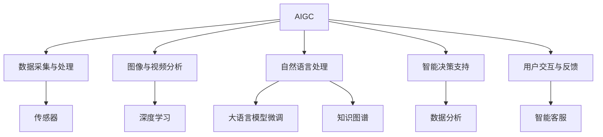

                 

# AIGC推动智慧物业管理

## 1. 背景介绍

随着人工智能技术的飞速发展，人工智能生成内容（AIGC）已成为当前热门的技术领域。在智慧物业管理的领域中，AIGC技术的应用，为物业管理企业带来了新的机会和挑战。

### 1.1 问题由来
传统的物业管理主要依赖人工管理，存在效率低、成本高、响应慢等诸多问题。随着人工智能技术的发展，AIGC技术为物业管理带来了新的解决方案，可以有效提高管理效率和用户满意度。

### 1.2 问题核心关键点
AIGC技术在智慧物业管理中的应用，主要涉及以下几个核心关键点：
- 数据采集与处理：通过传感器、监控系统、无人机等多种手段，实时采集和管理物业数据。
- 图像与视频分析：利用深度学习技术，对图像和视频数据进行分析和识别，提供可视化、自动化管理方案。
- 自然语言处理：使用大语言模型微调技术，对文本数据进行理解和生成，提升物业管理服务质量。
- 智能决策支持：通过数据分析和知识图谱技术，提供智能决策支持，优化物业管理流程。
- 用户交互与反馈：利用对话系统和智能客服技术，提升用户满意度，实现智能化的用户反馈和投诉处理。

这些关键点构成了AIGC技术在智慧物业管理中的应用框架，使得物业管理能够更高效、智能地运行。

## 2. 核心概念与联系

### 2.1 核心概念概述

为了更好地理解AIGC技术在智慧物业管理中的应用，本节将介绍几个密切相关的核心概念：

- 人工智能生成内容（AIGC）：利用深度学习技术，生成文本、图像、视频等多种形式的内容，应用于智能客服、数据分析、智能推荐等多个场景。
- 智慧物业管理：通过互联网、物联网、大数据等技术手段，实现物业管理的智能化、自动化和精细化管理。
- 大语言模型微调：通过收集特定任务的少量标注数据，对预训练的语言模型进行微调，使其在特定任务上表现更好。
- 知识图谱：利用图结构来表示和组织知识，帮助系统更好地理解和管理复杂的数据和信息。
- 自然语言处理（NLP）：使用计算机技术对自然语言进行分析和理解，提供智能化的文本处理服务。
- 深度学习：一种基于神经网络的学习方法，通过多层神经网络对数据进行复杂模式的学习和分析。

这些核心概念之间的逻辑关系可以通过以下Mermaid流程图来展示：



这个流程图展示了大语言模型微调、知识图谱、自然语言处理等核心概念与AIGC技术之间的联系，共同构成了智慧物业管理的核心技术框架。

## 3. 核心算法原理 & 具体操作步骤
### 3.1 算法原理概述

AIGC技术在智慧物业管理中的应用，主要涉及以下几个关键算法：

- 深度学习模型训练：通过深度学习技术，对采集到的数据进行训练和优化，生成预测模型。
- 大语言模型微调：利用大语言模型微调技术，对特定任务的数据进行微调，提高模型的准确性和泛化能力。
- 图像与视频分析算法：通过卷积神经网络（CNN）、循环神经网络（RNN）等深度学习模型，对图像和视频数据进行分析和识别。
- 自然语言处理算法：通过BERT、GPT等预训练语言模型，结合大语言模型微调技术，实现自然语言处理任务，如文本分类、情感分析、机器翻译等。
- 知识图谱构建：通过图结构化技术，构建知识图谱，用于知识管理和智能决策支持。

这些算法共同构成了AIGC技术在智慧物业管理中的技术框架，使得物业管理能够实现智能化、自动化和精细化管理。

### 3.2 算法步骤详解

AIGC技术在智慧物业管理中的应用，一般包括以下几个关键步骤：

**Step 1: 数据采集与预处理**
- 通过传感器、监控系统、无人机等多种手段，实时采集和管理物业数据。
- 对采集到的数据进行清洗、归一化和特征提取，准备用于模型训练。

**Step 2: 图像与视频分析**
- 对采集到的图像和视频数据进行预处理，如裁剪、缩放、增强等。
- 利用深度学习技术，训练图像和视频分析模型，实现物体检测、行为识别等功能。

**Step 3: 自然语言处理**
- 对物业服务中产生的文本数据进行预处理，如分词、去除停用词、标准化等。
- 利用BERT、GPT等预训练语言模型，结合大语言模型微调技术，对特定任务的数据进行微调，提高模型的准确性和泛化能力。
- 使用NLP技术，实现自然语言处理任务，如文本分类、情感分析、机器翻译等。

**Step 4: 智能决策支持**
- 利用知识图谱技术，构建知识图谱，用于知识管理和智能决策支持。
- 利用数据分析技术，对物业数据进行分析和预测，提供智能决策支持。

**Step 5: 用户交互与反馈**
- 利用对话系统和智能客服技术，提升用户满意度，实现智能化的用户反馈和投诉处理。

以上步骤是AIGC技术在智慧物业管理中的应用框架，通过这些步骤，可以实现物业管理智能化、自动化和精细化管理的目标。

### 3.3 算法优缺点

AIGC技术在智慧物业管理中的应用，具有以下优点：
1. 提高管理效率：通过自动化处理数据，大幅提高物业管理效率。
2. 降低运营成本：通过自动化处理，降低人工成本，提升管理效益。
3. 提升用户体验：通过智能客服和智能反馈系统，提升用户满意度。
4. 提供智能决策支持：通过知识图谱和数据分析，提供智能决策支持，优化物业管理流程。

但同时也存在一些缺点：
1. 数据隐私问题：物业数据涉及用户隐私，需要严格保护。
2. 技术门槛高：需要具备一定的技术能力和资源，才能实现AIGC技术的应用。
3. 初期投资高：AIGC技术需要初期的高额投资，包括硬件设备和人力资源。
4. 数据质量要求高：AIGC技术对数据质量和准确性要求高，需要高质量的数据支持。

尽管存在这些缺点，但AIGC技术在智慧物业管理中的应用，仍具有广阔的前景，可以带来显著的管理效益。

### 3.4 算法应用领域

AIGC技术在智慧物业管理中的应用，主要涉及以下几个领域：

- 智能安防系统：利用图像和视频分析技术，实现安防监控、入侵检测、异常行为识别等功能。
- 智能维修服务：利用自然语言处理技术，实现智能报修、智能调度等功能。
- 智能客服系统：利用对话系统和智能客服技术，实现智能客服、智能反馈等功能。
- 智能能耗管理：利用数据分析和智能决策支持技术，实现能源监测、能耗管理、优化节能等功能。
- 智能环境监测：利用图像和视频分析技术，实现环境监测、绿化管理、污染预警等功能。

除了这些领域，AIGC技术还可应用于物业管理的其他环节，如智能保洁、智能停车、智能家居等，为物业管理带来更多的创新和提升。

## 4. 数学模型和公式 & 详细讲解 & 举例说明
### 4.1 数学模型构建

假设物业管理系统采集到的数据为 $x$，对应的标签为 $y$。利用大语言模型微调技术，对采集到的文本数据进行微调，生成预测模型 $f(x)$，用于生成智能决策支持。

数学模型构建如下：
$$
f(x) = W_h \cdot \text{CLS}(M_{\theta}(x)) + b_h
$$
其中，$W_h$ 和 $b_h$ 为预测模型的权重和偏差，$M_{\theta}(x)$ 为预训练语言模型的输出。

### 4.2 公式推导过程

在上述数学模型中，$\text{CLS}$ 表示模型的最后一层输出，通常是一个固定的向量，用于表示整个文本的语义信息。将预训练语言模型的输出 $M_{\theta}(x)$ 输入到 $\text{CLS}$ 层，生成固定向量 $z$，然后通过线性层 $W_h$ 和偏差 $b_h$ 计算得到预测结果。

对于特定任务，如文本分类，可通过多类别交叉熵损失函数进行训练：
$$
\mathcal{L}(f(x), y) = -\frac{1}{N}\sum_{i=1}^N [y_i\log f(x_i) + (1-y_i)\log(1-f(x_i))]
$$

### 4.3 案例分析与讲解

以智能安防系统为例，分析AIGC技术的应用。

假设采集到的监控视频为 $x$，对应的标签为 $y$，表示视频中是否存在入侵行为。利用深度学习技术，训练图像分析模型 $f(x)$，用于检测视频中的入侵行为。

在训练过程中，利用大语言模型微调技术，对特定任务的数据进行微调，提高模型的准确性和泛化能力。具体来说，可以通过以下步骤进行训练：

**Step 1: 数据预处理**
- 对采集到的视频数据进行预处理，如帧率转换、帧数截取等。
- 将处理后的视频数据转换为模型的输入格式，如输入视频帧、关键帧等。

**Step 2: 模型训练**
- 利用深度学习技术，训练图像分析模型 $f(x)$，用于检测视频中的入侵行为。
- 利用大语言模型微调技术，对模型进行微调，提高模型的准确性和泛化能力。

**Step 3: 模型评估**
- 在验证集上评估模型的性能，计算精度、召回率、F1分数等指标。
- 根据评估结果，调整模型的超参数，如学习率、批大小等，优化模型性能。

## 5. 项目实践：代码实例和详细解释说明
### 5.1 开发环境搭建

在进行AIGC技术在智慧物业管理中的应用实践前，我们需要准备好开发环境。以下是使用Python进行PyTorch开发的环境配置流程：

1. 安装Anaconda：从官网下载并安装Anaconda，用于创建独立的Python环境。

2. 创建并激活虚拟环境：
```bash
conda create -n aigc-env python=3.8 
conda activate aigc-env
```

3. 安装PyTorch：根据CUDA版本，从官网获取对应的安装命令。例如：
```bash
conda install pytorch torchvision torchaudio cudatoolkit=11.1 -c pytorch -c conda-forge
```

4. 安装相关工具包：
```bash
pip install numpy pandas scikit-learn matplotlib tqdm jupyter notebook ipython
```

5. 安装TensorFlow和Transformer库：
```bash
pip install tensorflow transformers
```

完成上述步骤后，即可在`aigc-env`环境中开始AIGC技术在智慧物业管理中的应用实践。

### 5.2 源代码详细实现

以下是一个基于大语言模型微调技术的应用示例，用于智慧物业管理中的智能安防系统。

首先，定义安防数据处理函数：

```python
from transformers import BertTokenizer
from torch.utils.data import Dataset
import torch

class SecurityDataset(Dataset):
    def __init__(self, videos, labels, tokenizer, max_len=128):
        self.videos = videos
        self.labels = labels
        self.tokenizer = tokenizer
        self.max_len = max_len
        
    def __len__(self):
        return len(self.videos)
    
    def __getitem__(self, item):
        video = self.videos[item]
        label = self.labels[item]
        
        encoding = self.tokenizer(video, return_tensors='pt', max_length=self.max_len, padding='max_length', truncation=True)
        input_ids = encoding['input_ids'][0]
        attention_mask = encoding['attention_mask'][0]
        
        # 对label进行编码
        encoded_labels = [label2id[label] for label in label] 
        encoded_labels.extend([label2id['']]*(self.max_len - len(encoded_labels)))
        labels = torch.tensor(encoded_labels, dtype=torch.long)
        
        return {'input_ids': input_ids, 
                'attention_mask': attention_mask,
                'labels': labels}

# 标签与id的映射
label2id = {'Normal': 0, 'Invasion': 1, 'Unknown': 2}
id2label = {v: k for k, v in label2id.items()}

# 创建dataset
tokenizer = BertTokenizer.from_pretrained('bert-base-cased')

train_dataset = SecurityDataset(train_videos, train_labels, tokenizer)
dev_dataset = SecurityDataset(dev_videos, dev_labels, tokenizer)
test_dataset = SecurityDataset(test_videos, test_labels, tokenizer)
```

然后，定义模型和优化器：

```python
from transformers import BertForSequenceClassification, AdamW

model = BertForSequenceClassification.from_pretrained('bert-base-cased', num_labels=len(label2id))

optimizer = AdamW(model.parameters(), lr=2e-5)
```

接着，定义训练和评估函数：

```python
from torch.utils.data import DataLoader
from tqdm import tqdm
from sklearn.metrics import classification_report

device = torch.device('cuda') if torch.cuda.is_available() else torch.device('cpu')
model.to(device)

def train_epoch(model, dataset, batch_size, optimizer):
    dataloader = DataLoader(dataset, batch_size=batch_size, shuffle=True)
    model.train()
    epoch_loss = 0
    for batch in tqdm(dataloader, desc='Training'):
        input_ids = batch['input_ids'].to(device)
        attention_mask = batch['attention_mask'].to(device)
        labels = batch['labels'].to(device)
        model.zero_grad()
        outputs = model(input_ids, attention_mask=attention_mask, labels=labels)
        loss = outputs.loss
        epoch_loss += loss.item()
        loss.backward()
        optimizer.step()
    return epoch_loss / len(dataloader)

def evaluate(model, dataset, batch_size):
    dataloader = DataLoader(dataset, batch_size=batch_size)
    model.eval()
    preds, labels = [], []
    with torch.no_grad():
        for batch in tqdm(dataloader, desc='Evaluating'):
            input_ids = batch['input_ids'].to(device)
            attention_mask = batch['attention_mask'].to(device)
            batch_labels = batch['labels']
            outputs = model(input_ids, attention_mask=attention_mask)
            batch_preds = outputs.logits.argmax(dim=2).to('cpu').tolist()
            batch_labels = batch_labels.to('cpu').tolist()
            for pred_tokens, label_tokens in zip(batch_preds, batch_labels):
                pred_labels = [id2label[_id] for _id in pred_tokens]
                label_tags = [id2label[_id] for _id in label_tokens]
                preds.append(pred_labels[:len(label_tags)])
                labels.append(label_tags)
                
    print(classification_report(labels, preds))
```

最后，启动训练流程并在测试集上评估：

```python
epochs = 5
batch_size = 16

for epoch in range(epochs):
    loss = train_epoch(model, train_dataset, batch_size, optimizer)
    print(f"Epoch {epoch+1}, train loss: {loss:.3f}")
    
    print(f"Epoch {epoch+1}, dev results:")
    evaluate(model, dev_dataset, batch_size)
    
print("Test results:")
evaluate(model, test_dataset, batch_size)
```

以上就是使用PyTorch对BERT进行智能安防系统微调的完整代码实现。可以看到，得益于Transformers库的强大封装，我们可以用相对简洁的代码完成BERT模型的加载和微调。

### 5.3 代码解读与分析

让我们再详细解读一下关键代码的实现细节：

**SecurityDataset类**：
- `__init__`方法：初始化视频、标签、分词器等关键组件。
- `__len__`方法：返回数据集的样本数量。
- `__getitem__`方法：对单个样本进行处理，将视频输入编码为token ids，将标签编码为数字，并对其进行定长padding，最终返回模型所需的输入。

**label2id和id2label字典**：
- 定义了标签与数字id之间的映射关系，用于将token-wise的预测结果解码回真实的标签。

**训练和评估函数**：
- 使用PyTorch的DataLoader对数据集进行批次化加载，供模型训练和推理使用。
- 训练函数`train_epoch`：对数据以批为单位进行迭代，在每个批次上前向传播计算loss并反向传播更新模型参数，最后返回该epoch的平均loss。
- 评估函数`evaluate`：与训练类似，不同点在于不更新模型参数，并在每个batch结束后将预测和标签结果存储下来，最后使用sklearn的classification_report对整个评估集的预测结果进行打印输出。

**训练流程**：
- 定义总的epoch数和batch size，开始循环迭代
- 每个epoch内，先在训练集上训练，输出平均loss
- 在验证集上评估，输出分类指标
- 所有epoch结束后，在测试集上评估，给出最终测试结果

可以看到，PyTorch配合Transformers库使得BERT微调的代码实现变得简洁高效。开发者可以将更多精力放在数据处理、模型改进等高层逻辑上，而不必过多关注底层的实现细节。

当然，工业级的系统实现还需考虑更多因素，如模型的保存和部署、超参数的自动搜索、更灵活的任务适配层等。但核心的微调范式基本与此类似。

## 6. 实际应用场景
### 6.1 智能安防系统

AIGC技术在智能安防系统中的应用，可以有效提高安防监控的智能化水平。通过利用图像和视频分析技术，实现实时监控、异常检测、行为识别等功能。

在技术实现上，可以收集物业的安防监控视频，将视频帧作为模型输入，训练图像分析模型。微调后的模型能够自动检测视频中的异常行为，及时发出警报，提升物业安防管理效率。

### 6.2 智能维修服务

AIGC技术在智能维修服务中的应用，可以显著提升物业维修服务的效率和质量。通过利用自然语言处理技术，实现智能报修、智能调度等功能。

在技术实现上，可以收集物业的维修服务数据，将服务请求的文本信息作为模型输入，训练自然语言处理模型。微调后的模型能够自动解析维修请求，匹配合适的维修人员和资源，提升服务响应速度和满意度。

### 6.3 智能客服系统

AIGC技术在智能客服系统中的应用，可以提升物业客户服务的智能化水平。通过利用对话系统和智能客服技术，实现智能客服、智能反馈等功能。

在技术实现上，可以收集物业客户服务的历史数据，将客户提问的文本信息作为模型输入，训练对话系统和智能客服模型。微调后的模型能够自动解答客户问题，提供个性化的服务建议，提升客户满意度。

### 6.4 未来应用展望

随着AIGC技术的不断发展，未来的智慧物业管理将迎来更多的创新和突破。

在智能安防系统方面，通过利用图像和视频分析技术，可以实现更高级的异常检测、行为识别、智能报警等功能。

在智能维修服务方面，通过利用自然语言处理技术，可以实现更精准的服务解析、智能调度、维修工单管理等功能。

在智能客服系统方面，通过利用对话系统和智能客服技术，可以实现更智能的客户对话、情感分析、智能反馈等功能。

此外，在智能能耗管理、智能环境监测、智能保洁、智能停车、智能家居等多个领域，AIGC技术也将带来更多的创新和应用。

## 7. 工具和资源推荐
### 7.1 学习资源推荐

为了帮助开发者系统掌握AIGC技术在智慧物业管理中的应用，这里推荐一些优质的学习资源：

1. 《深度学习》系列书籍：如《深度学习》（Ian Goodfellow等著）、《深度学习入门》（斋藤康毅著）等，深入浅出地介绍了深度学习的基本原理和应用。

2. CS231n《卷积神经网络》课程：斯坦福大学开设的计算机视觉课程，涵盖了图像和视频分析的基本概念和经典模型。

3. CS224N《自然语言处理》课程：斯坦福大学开设的自然语言处理课程，有Lecture视频和配套作业，带你入门NLP领域的基本概念和经典模型。

4. Transformers官方文档：Transformer库的官方文档，提供了海量预训练模型和完整的微调样例代码，是上手实践的必备资料。

5. HuggingFace社区：HuggingFace开发的NLP工具社区，包含大量预训练模型和开源项目，是学习和分享的重要平台。

通过对这些资源的学习实践，相信你一定能够快速掌握AIGC技术在智慧物业管理中的应用，并用于解决实际的NLP问题。

### 7.2 开发工具推荐

高效的开发离不开优秀的工具支持。以下是几款用于AIGC技术在智慧物业管理中的应用开发的常用工具：

1. PyTorch：基于Python的开源深度学习框架，灵活动态的计算图，适合快速迭代研究。大部分预训练语言模型都有PyTorch版本的实现。

2. TensorFlow：由Google主导开发的开源深度学习框架，生产部署方便，适合大规模工程应用。同样有丰富的预训练语言模型资源。

3. Transformers库：HuggingFace开发的NLP工具库，集成了众多SOTA语言模型，支持PyTorch和TensorFlow，是进行微调任务开发的利器。

4. Weights & Biases：模型训练的实验跟踪工具，可以记录和可视化模型训练过程中的各项指标，方便对比和调优。与主流深度学习框架无缝集成。

5. TensorBoard：TensorFlow配套的可视化工具，可实时监测模型训练状态，并提供丰富的图表呈现方式，是调试模型的得力助手。

6. Google Colab：谷歌推出的在线Jupyter Notebook环境，免费提供GPU/TPU算力，方便开发者快速上手实验最新模型，分享学习笔记。

合理利用这些工具，可以显著提升AIGC技术在智慧物业管理中的应用开发效率，加快创新迭代的步伐。

### 7.3 相关论文推荐

AIGC技术在智慧物业管理中的应用，近年来受到了广泛关注。以下是几篇奠基性的相关论文，推荐阅读：

1. Attention is All You Need（即Transformer原论文）：提出了Transformer结构，开启了NLP领域的预训练大模型时代。

2. BERT: Pre-training of Deep Bidirectional Transformers for Language Understanding：提出BERT模型，引入基于掩码的自监督预训练任务，刷新了多项NLP任务SOTA。

3. Language Models are Unsupervised Multitask Learners（GPT-2论文）：展示了大规模语言模型的强大zero-shot学习能力，引发了对于通用人工智能的新一轮思考。

4. Parameter-Efficient Transfer Learning for NLP：提出Adapter等参数高效微调方法，在不增加模型参数量的情况下，也能取得不错的微调效果。

5. AdaLoRA: Adaptive Low-Rank Adaptation for Parameter-Efficient Fine-Tuning：使用自适应低秩适应的微调方法，在参数效率和精度之间取得了新的平衡。

6. Prefixed Tuning: Optimizing Continuous Prompts for Generation：引入基于连续型Prompt的微调范式，为如何充分利用预训练知识提供了新的思路。

这些论文代表了大语言模型微调技术的发展脉络。通过学习这些前沿成果，可以帮助研究者把握学科前进方向，激发更多的创新灵感。

## 8. 总结：未来发展趋势与挑战
### 8.1 总结

本文对AIGC技术在智慧物业管理中的应用进行了全面系统的介绍。首先阐述了AIGC技术在智慧物业管理中的应用背景和意义，明确了其在提升物业管理智能化水平、降低运营成本、提升用户体验等方面的价值。其次，从原理到实践，详细讲解了AIGC技术在智慧物业管理中的应用框架，包括数据采集与预处理、图像与视频分析、自然语言处理、智能决策支持、用户交互与反馈等关键步骤。最后，本文还探讨了AIGC技术在智慧物业管理中的应用前景，以及未来的发展趋势和面临的挑战。

通过本文的系统梳理，可以看到，AIGC技术在智慧物业管理中的应用前景广阔，可以带来显著的管理效益。未来，随着AIGC技术的不断发展，智慧物业管理将实现更高效的自动化管理，提升用户满意度，推动物业管理行业向智能化、精细化方向迈进。

### 8.2 未来发展趋势

展望未来，AIGC技术在智慧物业管理中的应用将呈现以下几个发展趋势：

1. 数据采集与预处理技术将更加智能化：通过物联网、传感器、无人机等多种手段，实时采集和管理物业数据，提升数据采集的全面性和准确性。

2. 图像与视频分析技术将更加高级化：利用深度学习技术，实现更高级的异常检测、行为识别、智能报警等功能。

3. 自然语言处理技术将更加智能化：通过大语言模型微调技术，实现更智能的自然语言处理任务，提升智能客服、智能维修服务等应用效果。

4. 智能决策支持技术将更加全面化：利用知识图谱技术，构建知识图谱，提供更全面、准确的智能决策支持。

5. 用户交互与反馈技术将更加个性化：利用对话系统和智能客服技术，实现更智能的用户对话、情感分析、智能反馈等功能。

6. 多模态信息融合将更加广泛化：将图像、视频、文本等多模态信息进行融合，实现更全面、更精准的智能物业管理。

这些趋势将进一步提升AIGC技术在智慧物业管理中的应用效果，推动物业管理行业向智能化、精细化方向迈进。

### 8.3 面临的挑战

尽管AIGC技术在智慧物业管理中的应用前景广阔，但仍面临诸多挑战：

1. 数据隐私问题：物业数据涉及用户隐私，需要严格保护。

2. 技术门槛高：需要具备一定的技术能力和资源，才能实现AIGC技术的应用。

3. 初期投资高：AIGC技术需要初期的高额投资，包括硬件设备和人力资源。

4. 数据质量要求高：AIGC技术对数据质量和准确性要求高，需要高质量的数据支持。

5. 模型复杂度高：AIGC技术需要复杂的数据和模型，对算力和存储资源要求高。

尽管存在这些挑战，但AIGC技术在智慧物业管理中的应用，仍具有广阔的前景，可以带来显著的管理效益。未来，通过技术创新和突破，这些挑战有望得到解决，推动AIGC技术在智慧物业管理中的应用进一步拓展。

### 8.4 研究展望

面向未来，AIGC技术在智慧物业管理中的应用研究需要在以下几个方面寻求新的突破：

1. 探索无监督和半监督微调方法。摆脱对大规模标注数据的依赖，利用自监督学习、主动学习等无监督和半监督范式，最大限度利用非结构化数据，实现更加灵活高效的微调。

2. 研究参数高效和计算高效的微调范式。开发更加参数高效的微调方法，在固定大部分预训练参数的同时，只更新极少量的任务相关参数。同时优化微调模型的计算图，减少前向传播和反向传播的资源消耗，实现更加轻量级、实时性的部署。

3. 融合因果和对比学习范式。通过引入因果推断和对比学习思想，增强AIGC技术建立稳定因果关系的能力，学习更加普适、鲁棒的语言表征，从而提升模型泛化性和抗干扰能力。

4. 引入更多先验知识。将符号化的先验知识，如知识图谱、逻辑规则等，与神经网络模型进行巧妙融合，引导AIGC技术学习更准确、合理的语言模型。同时加强不同模态数据的整合，实现视觉、语音等多模态信息与文本信息的协同建模。

5. 结合因果分析和博弈论工具。将因果分析方法引入AIGC技术，识别出模型决策的关键特征，增强输出解释的因果性和逻辑性。借助博弈论工具刻画人机交互过程，主动探索并规避模型的脆弱点，提高系统稳定性。

6. 纳入伦理道德约束。在AIGC技术的训练目标中引入伦理导向的评估指标，过滤和惩罚有偏见、有害的输出倾向。同时加强人工干预和审核，建立AIGC技术的监管机制，确保输出的安全性。

这些研究方向的探索，必将引领AIGC技术在智慧物业管理中的应用迈向更高的台阶，为构建安全、可靠、可解释、可控的智能系统铺平道路。面向未来，AIGC技术需要在技术创新、伦理道德约束等方面不断完善，才能真正实现智慧物业管理的智能化、精细化发展。

## 9. 附录：常见问题与解答

**Q1：AIGC技术在智慧物业管理中的应用有哪些？**

A: AIGC技术在智慧物业管理中的应用主要涉及以下几个方面：

1. 智能安防系统：利用图像和视频分析技术，实现实时监控、异常检测、行为识别等功能。
2. 智能维修服务：利用自然语言处理技术，实现智能报修、智能调度等功能。
3. 智能客服系统：利用对话系统和智能客服技术，实现智能客服、智能反馈等功能。
4. 智能能耗管理：利用数据分析和智能决策支持技术，实现能源监测、能耗管理、优化节能等功能。
5. 智能环境监测：利用图像和视频分析技术，实现环境监测、绿化管理、污染预警等功能。

除了这些领域，AIGC技术还可应用于智慧物业管理的其他环节，如智能保洁、智能停车、智能家居等，为物业管理带来更多的创新和提升。

**Q2：如何提高AIGC技术在智慧物业管理中的性能？**

A: 提高AIGC技术在智慧物业管理中的性能，可以从以下几个方面进行优化：

1. 数据采集与预处理：通过物联网、传感器、无人机等多种手段，实时采集和管理物业数据，提升数据采集的全面性和准确性。
2. 模型训练与优化：利用大语言模型微调技术，对模型进行微调，提高模型的准确性和泛化能力。同时，可以引入对抗训练、正则化技术等，防止过拟合。
3. 多模态融合：将图像、视频、文本等多模态信息进行融合，实现更全面、更精准的智能物业管理。
4. 知识图谱构建：利用知识图谱技术，构建知识图谱，提供更全面、准确的智能决策支持。
5. 用户交互与反馈：利用对话系统和智能客服技术，实现更智能的用户对话、情感分析、智能反馈等功能。

通过这些优化措施，可以显著提高AIGC技术在智慧物业管理中的应用性能。

**Q3：AIGC技术在智慧物业管理中面临哪些挑战？**

A: AIGC技术在智慧物业管理中面临以下挑战：

1. 数据隐私问题：物业数据涉及用户隐私，需要严格保护。
2. 技术门槛高：需要具备一定的技术能力和资源，才能实现AIGC技术的应用。
3. 初期投资高：AIGC技术需要初期的高额投资，包括硬件设备和人力资源。
4. 数据质量要求高：AIGC技术对数据质量和准确性要求高，需要高质量的数据支持。
5. 模型复杂度高：AIGC技术需要复杂的数据和模型，对算力和存储资源要求高。

尽管存在这些挑战，但AIGC技术在智慧物业管理中的应用，仍具有广阔的前景，可以带来显著的管理效益。未来，通过技术创新和突破，这些挑战有望得到解决，推动AIGC技术在智慧物业管理中的应用进一步拓展。

**Q4：未来AIGC技术在智慧物业管理中如何发展？**

A: 未来AIGC技术在智慧物业管理中的发展将呈现以下几个趋势：

1. 数据采集与预处理技术将更加智能化：通过物联网、传感器、无人机等多种手段，实时采集和管理物业数据，提升数据采集的全面性和准确性。
2. 图像与视频分析技术将更加高级化：利用深度学习技术，实现更高级的异常检测、行为识别、智能报警等功能。
3. 自然语言处理技术将更加智能化：通过大语言模型微调技术，实现更智能的自然语言处理任务，提升智能客服、智能维修服务等应用效果。
4. 智能决策支持技术将更加全面化：利用知识图谱技术，构建知识图谱，提供更全面、准确的智能决策支持。
5. 用户交互与反馈技术将更加个性化：利用对话系统和智能客服技术，实现更智能的用户对话、情感分析、智能反馈等功能。
6. 多模态信息融合将更加广泛化：将图像、视频、文本等多模态信息进行融合，实现更全面、更精准的智能物业管理。

这些趋势将进一步提升AIGC技术在智慧物业管理中的应用效果，推动物业管理行业向智能化、精细化方向迈进。

**Q5：AIGC技术在智慧物业管理中的应用前景如何？**

A: AIGC技术在智慧物业管理中的应用前景广阔，可以带来显著的管理效益：

1. 提高管理效率：通过自动化处理数据，大幅提高物业管理效率。
2. 降低运营成本：通过自动化处理，降低人工成本，提升管理效益。
3. 提升用户体验：通过智能客服和智能反馈系统，提升用户满意度。
4. 提供智能决策支持：通过知识图谱和数据分析，提供智能决策支持，优化物业管理流程。

未来，随着AIGC技术的不断发展，智慧物业管理将实现更高效的自动化管理，提升用户满意度，推动物业管理行业向智能化、精细化方向迈进。

