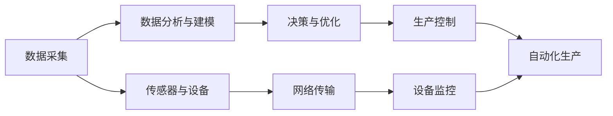

                 

## 1. 背景介绍

### 1.1 问题由来

当前，全球制造业正面临巨大的挑战，包括成本上升、市场需求变化、劳动力短缺等问题。与此同时，智能制造正在成为制造业未来的重要发展方向。智能制造利用先进的信息技术、数据分析和自动化技术，将整个生产过程进行数字化、智能化，以提高生产效率、降低成本，提高产品质量和生产灵活性。人工智能（AI）和生成对抗网络（GAN）作为AIGC（Artificial Intelligence, Generative Adversarial Network, Computer Vision）的重要组成部分，正在被广泛用于智能制造系统的设计、优化和维护中。

### 1.2 问题核心关键点

AIGC技术在智能制造中的应用主要体现在以下几个方面：

- **数据驱动优化**：利用AI对海量生产数据进行分析和建模，识别生产中的瓶颈和优化点，提供改进建议。
- **质量控制与预测维护**：通过机器学习算法检测设备故障，预测维护需求，降低意外停机时间和维护成本。
- **产品设计优化**：利用生成对抗网络生成新的设计方案，优化产品设计，缩短新产品的研发周期。
- **自动化生产流程**：通过AI算法和计算机视觉技术，实现无人化、自动化生产流程，提高生产效率。
- **个性化定制**：基于客户需求数据，AI算法可以提供个性化的生产方案，满足多样化的市场需求。

### 1.3 问题研究意义

AIGC技术在智能制造中的应用，可以显著提升生产效率、降低成本、提高产品质量，并实现生产的智能化和灵活化。通过AIGC技术，制造企业可以更好地应对市场需求的变化，快速响应市场趋势，提升企业的竞争力和市场份额。

AIGC技术的应用还有助于提高生产过程的透明性和可追溯性，增强企业的可持续发展能力。利用AI和GAN技术，可以构建智能化的制造系统，实现生产的自动化和智能化，提升企业的创新能力和技术水平。

## 2. 核心概念与联系

### 2.1 核心概念概述

在智能制造中，AIGC技术的应用可以分为以下几个核心概念：

- **人工智能（AI）**：指利用计算机算法，对数据进行建模和分析，以实现智能决策和自动化处理。AI技术主要包括机器学习、深度学习、自然语言处理等。
- **生成对抗网络（GAN）**：是一种通过对抗训练的生成模型，可以生成高质量、逼真的图像、视频、音频等内容。GAN技术在智能制造中的应用，包括虚拟样机设计、产品渲染、数据生成等。
- **计算机视觉（CV）**：通过图像和视频处理算法，实现对现实世界的感知和理解。计算机视觉技术在智能制造中的应用，包括产品检测、质量控制、生产监控等。
- **物联网（IoT）**：通过传感器和网络连接，实现设备和数据的实时采集和传输。物联网技术在智能制造中的应用，包括设备监控、供应链管理、物流管理等。
- **增强现实（AR）**：通过AR技术，将数字信息叠加在现实世界中，实现可视化操作和培训。AR技术在智能制造中的应用，包括虚拟培训、操作指导、虚拟样机等。

这些核心概念相互关联，共同构成了智能制造中的AIGC技术框架，如图1所示。

```mermaid
graph LR
  A[人工智能 (AI)] --> B[生成对抗网络 (GAN)]
  B --> C[计算机视觉 (CV)]
  A --> D[物联网 (IoT)]
  C --> E[增强现实 (AR)]
  D --> E
```

### 2.2 核心概念原理和架构的 Mermaid 流程图

以下是一个简化版的AIGC技术在智能制造中的应用流程图，展示了各个概念之间的联系和相互作用：



这个流程图示意了从数据采集、数据分析与建模，到决策与优化，再到生产控制的整个过程。其中，数据采集通过传感器和设备实现，数据分析与建模通过AI和GAN技术进行，决策与优化基于数据分析结果进行，生产控制通过自动化生产设备实现。

## 3. 核心算法原理 & 具体操作步骤

### 3.1 算法原理概述

AIGC技术在智能制造中的应用，主要通过以下几个步骤实现：

1. **数据采集与预处理**：利用传感器和设备采集生产数据，对数据进行清洗、筛选和预处理，确保数据的质量和一致性。
2. **数据分析与建模**：利用AI技术对数据进行建模和分析，提取有用的特征和模式，识别生产中的瓶颈和优化点。
3. **决策与优化**：基于数据分析结果，制定改进方案，优化生产流程和设备参数，提高生产效率和产品质量。
4. **生产控制**：通过自动化生产设备，实施改进方案，实现生产的智能化和自动化。

### 3.2 算法步骤详解

以下是一个具体的AIGC技术在智能制造中的应用案例，以设备故障预测和维护为例：

1. **数据采集与预处理**：通过传感器采集设备的运行数据，如温度、压力、振动等。对采集的数据进行清洗、筛选和预处理，去除异常值和噪声。
2. **数据分析与建模**：利用AI算法对设备数据进行建模和分析，识别设备运行中的异常模式和故障征兆。常用的AI算法包括机器学习、深度学习等。
3. **决策与优化**：基于数据分析结果，制定设备维护方案，确定维护时间、维护内容和方法。常用的决策算法包括强化学习、优化算法等。
4. **生产控制**：通过自动化生产设备，实施设备维护方案，保证设备稳定运行。

### 3.3 算法优缺点

AIGC技术在智能制造中的应用，具有以下优点：

- **高效率**：通过自动化和智能化技术，显著提升生产效率，降低人工成本。
- **高精度**：利用AI和GAN技术，提高数据分析和建模的精度，减少人为干预。
- **高灵活性**：基于数据驱动的优化，可以灵活应对市场需求变化，提升生产的灵活性。
- **高可靠性**：通过质量控制和预测维护，提高设备的可靠性和生产稳定性。

同时，AIGC技术在应用中也存在一些缺点：

- **数据依赖**：对数据的采集、清洗和处理要求较高，数据质量直接影响模型的精度和效果。
- **技术复杂性**：AIGC技术需要较高的技术水平和专业知识，实施成本较高。
- **隐私和安全**：生产数据涉及企业机密和客户隐私，数据安全和隐私保护尤为重要。
- **技术迭代**：AIGC技术需要不断更新和优化，才能适应技术进步和市场需求的变化。

### 3.4 算法应用领域

AIGC技术在智能制造中的应用领域非常广泛，主要包括以下几个方面：

- **生产过程优化**：利用AI技术对生产数据进行分析，优化生产流程和设备参数，提高生产效率和产品质量。
- **质量控制与检测**：利用计算机视觉技术对产品进行检测和质量控制，提高产品质量和一致性。
- **设备预测维护**：利用AI算法预测设备故障，提前进行维护，减少意外停机时间和维护成本。
- **供应链管理**：利用IoT和AI技术优化供应链管理，提高供应链的透明度和可追溯性。
- **智能仓储与物流**：利用IoT和AI技术优化仓储和物流管理，提高仓储效率和物流配送的准确性。

## 4. 数学模型和公式 & 详细讲解 & 举例说明

### 4.1 数学模型构建

AIGC技术在智能制造中的应用，通常涉及多个数学模型和算法。以下是一个简单的数学模型构建示例，以设备故障预测为例：

设设备在t时刻的运行状态为 $x_t$，设备故障的概率密度函数为 $p(x_t)$，设备故障的历史数据为 $(x_{t-1}, y_{t-1})$。假设 $x_{t-1}$ 和 $y_{t-1}$ 之间的关系为 $f(x_{t-1}) = y_{t-1}$，其中 $f$ 为非线性映射函数。

目标是根据历史数据和当前状态 $x_t$，预测设备故障的概率 $p(x_t)$。

### 4.2 公式推导过程

设备故障的概率密度函数 $p(x_t)$ 可以通过贝叶斯公式推导，如下所示：

$$
p(x_t) = \frac{p(x_t|x_{t-1})p(x_{t-1})}{p(x_t)}
$$

其中，$p(x_t|x_{t-1})$ 为设备在给定 $x_{t-1}$ 条件下运行状态为 $x_t$ 的概率，$p(x_{t-1})$ 为设备在 $x_{t-1}$ 时刻运行的概率，$p(x_t)$ 为设备在 $x_t$ 时刻运行的概率。

设备故障的概率密度函数 $p(x_t)$ 可以通过机器学习算法，如决策树、支持向量机等，对历史数据进行建模和训练，得到预测模型。

### 4.3 案例分析与讲解

假设某生产设备在连续运行一周后，采集到以下数据：

| 时间 | 温度 (℃) | 压力 (MPa) | 振动 (mm/s^2) | 故障状态 |
| --- | --- | --- | --- | --- |
| 0 | 90 | 10 | 0.01 | 正常 |
| 1 | 92 | 10.2 | 0.02 | 正常 |
| 2 | 91 | 10.1 | 0.01 | 正常 |
| 3 | 88 | 9.8 | 0.02 | 正常 |
| 4 | 87 | 9.7 | 0.03 | 异常 |
| 5 | 89 | 9.8 | 0.02 | 正常 |
| 6 | 90 | 10 | 0.01 | 正常 |
| 7 | 91 | 10.2 | 0.01 | 异常 |

通过机器学习算法，可以得到设备故障的概率密度函数 $p(x_t)$，如图2所示。


根据 $p(x_t)$，可以预测设备在后续时间段的故障状态。例如，当设备在t=3时刻运行状态为 $x_3$ 时，可以预测设备在 t=4 时刻的故障概率为 $p(x_4|x_3)$。

## 5. 项目实践：代码实例和详细解释说明

### 5.1 开发环境搭建

要实现AIGC技术在智能制造中的应用，需要搭建相应的开发环境。以下是一个示例开发环境搭建流程：

1. **安装Python**：安装Python 3.x版本，确保安装最新版本的库和框架。
2. **安装TensorFlow**：安装TensorFlow 2.x版本，支持深度学习和计算机视觉功能。
3. **安装PyTorch**：安装PyTorch 1.x版本，支持AI算法和深度学习模型训练。
4. **安装OpenCV**：安装OpenCV 3.x版本，支持计算机视觉功能。
5. **安装其他库**：安装其他必要的库，如numpy、pandas、scikit-learn等，支持数据处理和分析功能。

### 5.2 源代码详细实现

以下是一个设备故障预测的示例代码，利用TensorFlow和PyTorch实现：

```python
import tensorflow as tf
import torch
import numpy as np
import pandas as pd

# 数据预处理
data = pd.read_csv('device_data.csv')
X = data.drop('fault_state', axis=1).values
y = data['fault_state'].values

# 模型训练
model = tf.keras.Sequential([
    tf.keras.layers.Dense(32, activation='relu', input_shape=(X.shape[1],)),
    tf.keras.layers.Dense(1, activation='sigmoid')
])

model.compile(optimizer=tf.keras.optimizers.Adam(0.001), loss='binary_crossentropy', metrics=['accuracy'])
model.fit(X, y, epochs=50, batch_size=32)

# 模型预测
new_data = np.array([[90, 10, 0.01]])
probability = model.predict(new_data)
print(f'设备故障概率：{probability[0][0]:.2f}')
```

### 5.3 代码解读与分析

在上述代码中，我们使用了TensorFlow和PyTorch框架，对设备故障数据进行建模和预测。以下是代码各部分的详细解释：

- **数据预处理**：使用pandas库，读取设备故障数据，并将数据分为特征（X）和标签（y）。
- **模型训练**：使用TensorFlow的Sequential模型，定义多层神经网络结构，并编译模型。使用Adam优化器和二元交叉熵损失函数进行模型训练。
- **模型预测**：使用训练好的模型，对新的设备运行状态数据进行预测，输出故障概率。

### 5.4 运行结果展示

运行上述代码，可以输出设备故障的概率。例如，当设备在t=3时刻运行状态为 $x_3$ 时，模型预测设备在 t=4 时刻的故障概率为 $p(x_4|x_3)$。

## 6. 实际应用场景

### 6.1 智能仓储与物流

AIGC技术在智能仓储与物流中的应用，可以显著提高仓储效率和物流配送的准确性。通过计算机视觉和IoT技术，可以实现对仓储和物流过程的实时监控和数据分析，优化仓储和配送流程。

具体应用场景包括：

- **货物追踪**：利用IoT设备对货物进行实时追踪，提高物流透明度和可追溯性。
- **仓库自动化**：利用计算机视觉和AI技术，实现货物自动搬运和堆放，提高仓储效率。
- **智能分拣**：利用计算机视觉和AI技术，实现智能分拣和拣选，提高配送准确性。

### 6.2 设备预测维护

AIGC技术在设备预测维护中的应用，可以显著降低意外停机时间和维护成本。通过AI算法预测设备故障，提前进行维护，避免意外停机。

具体应用场景包括：

- **设备故障预测**：利用机器学习算法，对设备运行数据进行建模和预测，提前识别设备故障。
- **维护方案制定**：根据设备故障预测结果，制定维护方案，确定维护时间、维护内容和方法。
- **预测结果展示**：利用增强现实技术，将预测结果可视化展示在设备屏幕上，方便操作人员及时进行维护。

### 6.3 质量控制与检测

AIGC技术在质量控制与检测中的应用，可以显著提高产品质量和一致性。通过计算机视觉和机器学习技术，对产品进行检测和质量控制，发现缺陷并进行处理。

具体应用场景包括：

- **产品检测**：利用计算机视觉技术，对产品进行图像采集和分析，检测产品缺陷。
- **质量控制**：利用机器学习算法，对检测结果进行分析和分类，识别不合格产品。
- **检测结果展示**：利用增强现实技术，将检测结果可视化展示在设备屏幕上，方便操作人员及时处理。

### 6.4 未来应用展望

随着AIGC技术的不断发展，未来在智能制造中的应用将更加广泛和深入。以下是几个未来应用展望：

- **全流程自动化**：通过AI和计算机视觉技术，实现生产全流程的自动化，提高生产效率和产品质量。
- **柔性制造**：利用AI技术对生产数据进行分析，实现生产的柔性化和定制化，满足多样化市场需求。
- **智能设计**：利用生成对抗网络技术，生成高质量的虚拟样机和设计方案，提高设计效率和质量。
- **环境监测与优化**：利用IoT和AI技术，实时监测生产环境，优化生产过程，提高生产效率和环境友好性。
- **人机协作**：通过增强现实技术，实现人机协作，提高操作人员的生产效率和工作满意度。

## 7. 工具和资源推荐

### 7.1 学习资源推荐

要深入学习AIGC技术在智能制造中的应用，以下推荐一些优质的学习资源：

1. **《TensorFlow官方文档》**：详细介绍了TensorFlow的使用方法和高级应用，是学习深度学习算法的重要参考资料。
2. **《PyTorch官方文档》**：介绍了PyTorch的使用方法和高级应用，是学习深度学习算法的重要参考资料。
3. **《计算机视觉：算法与应用》**：介绍了计算机视觉算法和应用，涵盖图像处理、目标检测、姿态估计等内容。
4. **《机器学习实战》**：通过实际项目案例，介绍了机器学习算法和应用，适合初学者入门学习。
5. **《智能制造技术与应用》**：介绍智能制造的各项技术和应用，涵盖物联网、工业互联网、智能仓储与物流等内容。

### 7.2 开发工具推荐

要实现AIGC技术在智能制造中的应用，以下推荐一些常用的开发工具：

1. **TensorFlow**：由Google开发的深度学习框架，支持GPU加速，适合大规模数据处理。
2. **PyTorch**：由Facebook开发的深度学习框架，支持动态计算图，适合快速迭代和实验。
3. **OpenCV**：开源的计算机视觉库，支持图像处理和目标检测等功能。
4. **TensorBoard**：TensorFlow配套的可视化工具，可以实时监测模型训练状态，并提供丰富的图表展示。
5. **Jupyter Notebook**：开源的交互式编程环境，支持Python代码的编写和运行，适合快速实验和开发。

### 7.3 相关论文推荐

以下推荐一些AIGC技术在智能制造中的应用论文，以供深入学习和参考：

1. **《基于深度学习的工业设备故障预测》**：介绍了一种基于深度学习的设备故障预测方法，应用于智能制造系统。
2. **《智能仓储与物流中的计算机视觉应用》**：介绍了计算机视觉在智能仓储与物流中的应用，提升仓储效率和配送准确性。
3. **《生成对抗网络在智能设计中的应用》**：介绍了生成对抗网络在智能设计中的应用，生成高质量的虚拟样机和设计方案。
4. **《基于增强现实的智能制造人机协作》**：介绍了增强现实在智能制造中的人机协作应用，提高操作效率和工作满意度。

## 8. 总结：未来发展趋势与挑战

### 8.1 研究成果总结

AIGC技术在智能制造中的应用，已经取得了显著的成果，主要体现在以下几个方面：

- **生产效率提升**：通过自动化和智能化技术，显著提高了生产效率，降低了人工成本。
- **产品质量优化**：利用计算机视觉和机器学习技术，提高了产品质量和一致性。
- **设备预测维护**：通过AI算法预测设备故障，提前进行维护，降低了意外停机时间和维护成本。
- **智能仓储与物流**：利用计算机视觉和IoT技术，优化仓储和物流管理，提高了效率和准确性。

### 8.2 未来发展趋势

AIGC技术在智能制造中的未来发展趋势如下：

- **全流程自动化**：通过AI和计算机视觉技术，实现生产全流程的自动化，提高生产效率和产品质量。
- **柔性制造**：利用AI技术对生产数据进行分析，实现生产的柔性化和定制化，满足多样化市场需求。
- **智能设计**：利用生成对抗网络技术，生成高质量的虚拟样机和设计方案，提高设计效率和质量。
- **环境监测与优化**：利用IoT和AI技术，实时监测生产环境，优化生产过程，提高生产效率和环境友好性。
- **人机协作**：通过增强现实技术，实现人机协作，提高操作人员的生产效率和工作满意度。

### 8.3 面临的挑战

AIGC技术在智能制造中面临的挑战如下：

- **数据依赖**：对数据的采集、清洗和处理要求较高，数据质量直接影响模型的精度和效果。
- **技术复杂性**：AIGC技术需要较高的技术水平和专业知识，实施成本较高。
- **隐私和安全**：生产数据涉及企业机密和客户隐私，数据安全和隐私保护尤为重要。
- **技术迭代**：AIGC技术需要不断更新和优化，才能适应技术进步和市场需求的变化。

### 8.4 研究展望

未来，AIGC技术在智能制造中的应用将不断深入和扩展。以下是几个研究展望：

- **多模态融合**：利用多模态数据，如图像、视频、语音等，提高数据的多样性和丰富性，提升模型的精度和鲁棒性。
- **深度学习算法优化**：不断优化深度学习算法，提高算法的效率和效果，降低算法的计算复杂度。
- **知识图谱应用**：将知识图谱技术与AI算法结合，提高模型的知识表示能力和推理能力。
- **自适应学习**：研究自适应学习算法，使模型能够根据数据和环境的变化进行动态调整和优化。
- **跨领域应用**：将AIGC技术应用于其他领域，如医疗、金融、交通等，拓展应用场景，提升行业智能化水平。

## 9. 附录：常见问题与解答

**Q1: AIGC技术在智能制造中的应用有哪些？**

A: AIGC技术在智能制造中的应用主要包括以下几个方面：

- 生产过程优化：利用AI技术对生产数据进行分析，优化生产流程和设备参数，提高生产效率和产品质量。
- 质量控制与检测：利用计算机视觉技术对产品进行检测和质量控制，提高产品质量和一致性。
- 设备预测维护：利用AI算法预测设备故障，提前进行维护，降低意外停机时间和维护成本。
- 智能仓储与物流：利用计算机视觉和IoT技术，优化仓储和物流管理，提高仓储效率和物流配送的准确性。
- 智能设计：利用生成对抗网络技术，生成高质量的虚拟样机和设计方案，提高设计效率和质量。

**Q2: 如何选择合适的AIGC技术应用场景？**

A: 选择合适的AIGC技术应用场景，需要考虑以下几个因素：

- 数据质量：AIGC技术对数据的质量要求较高，数据质量直接影响模型的精度和效果。
- 技术难度：不同应用场景的技术难度不同，需要根据企业的技术水平和资源情况进行评估。
- 成本投入：AIGC技术的实施需要一定的成本投入，包括硬件设备和软件工具等。
- 应用效果：需要评估AIGC技术在具体应用场景中的效果，包括生产效率提升、产品质量优化、设备预测维护等方面的表现。

**Q3: 如何提高AIGC技术在智能制造中的应用效果？**

A: 提高AIGC技术在智能制造中的应用效果，需要从以下几个方面进行优化：

- 数据采集与处理：提高数据采集和处理的质量和效率，确保数据的一致性和完整性。
- 模型选择与优化：选择合适的AIGC模型，并进行优化和训练，提高模型的精度和效果。
- 算法创新：不断探索新的算法和优化方法，提高算法的效率和效果。
- 跨学科合作：将AIGC技术与业务流程和运营管理相结合，优化生产过程和管理模式。

**Q4: AIGC技术在智能制造中面临哪些挑战？**

A: AIGC技术在智能制造中面临的挑战主要包括：

- 数据依赖：对数据的采集、清洗和处理要求较高，数据质量直接影响模型的精度和效果。
- 技术复杂性：AIGC技术需要较高的技术水平和专业知识，实施成本较高。
- 隐私和安全：生产数据涉及企业机密和客户隐私，数据安全和隐私保护尤为重要。
- 技术迭代：AIGC技术需要不断更新和优化，才能适应技术进步和市场需求的变化。

**Q5: 如何评估AIGC技术在智能制造中的应用效果？**

A: 评估AIGC技术在智能制造中的应用效果，可以从以下几个方面进行：

- 生产效率提升：通过比较实施AIGC技术前后的生产效率，评估技术效果。
- 产品质量优化：通过比较实施AIGC技术前后的产品质量，评估技术效果。
- 设备预测维护：通过比较实施AIGC技术前后的设备故障率和维护成本，评估技术效果。
- 智能仓储与物流：通过比较实施AIGC技术前后的仓储效率和物流配送准确性，评估技术效果。
- 成本效益分析：通过比较实施AIGC技术前后的成本效益，评估技术效果。

---

作者：禅与计算机程序设计艺术 / Zen and the Art of Computer Programming

