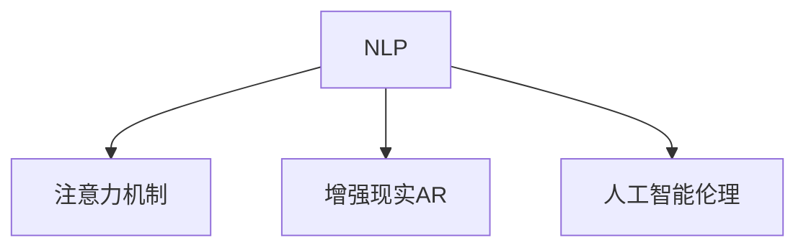

                 

# AI与人类注意力流：打造人机融合的未来

> 关键词：人机融合,注意力机制,自然语言处理(NLP),增强现实(AR),人工智能伦理

## 1. 背景介绍

### 1.1 问题由来

随着人工智能(AI)技术的飞速发展，尤其是深度学习模型的广泛应用，AI在诸多领域取得了令人瞩目的成绩。从自动驾驶、智能制造到金融分析、医疗诊断，AI的渗透深度和广度都在不断拓展。然而，AI在提升工作效率、降低人为错误的同时，也引发了新的问题：人与AI的协同共存变得尤为重要。

如何让人与AI更好地融合，让AI能够理解、模拟和引导人类的注意力流，从而更加自然、高效地参与到人类的日常工作和生活中，成为当前AI研究的重要方向。特别是在自然语言处理(NLP)领域，AI如何理解和回应人类的自然语言输入，引导人类注意力流，是实现人机深度融合的关键所在。

### 1.2 问题核心关键点

在NLP中，AI如何理解和模拟人类注意力流，主要包括以下几个关键点：

1. **注意力机制**：AI如何关注和处理输入文本中的不同部分，以便更好地理解和生成文本。
2. **自然语言理解(NLU)**：AI如何理解和处理人类自然语言输入，抽取关键信息。
3. **生成模型**：AI如何生成符合人类语言习惯和逻辑的文本，引导人类注意力流。
4. **交互界面设计**：如何设计用户界面，使AI能直观地反馈和引导人类注意力。
5. **应用场景适配**：在特定应用场景中，如何通过AI增强人类注意力流，提升工作效率和用户体验。

本文将从这些关键点出发，全面探讨如何通过AI理解和模拟人类注意力流，实现人机融合的未来。

### 1.3 问题研究意义

探索AI与人类注意力流的结合，对于提升人类工作效率、改善用户体验、促进社会生产力的提升具有重要意义：

1. **提升工作效率**：AI能够自动处理大量重复性、低价值任务，将人类从枯燥繁琐的工作中解放出来，专注于高价值创造性工作。
2. **改善用户体验**：通过自然语言理解和生成，AI可以更加智能地响应人类需求，提供个性化、智能化的服务。
3. **促进生产力提升**：AI在各个行业的广泛应用，能够加速数据处理、决策支持等环节，推动生产力的持续增长。
4. **增强人机协同**：AI模拟人类注意力流，能够在复杂的任务中辅助人类，提升整体协作效率。
5. **支持跨领域应用**：AI在医疗、教育、金融等领域的应用，能够为不同行业带来创新，带来新的机遇和挑战。

## 2. 核心概念与联系

### 2.1 核心概念概述

为了更好地理解AI与人类注意力流的融合，本节将介绍几个密切相关的核心概念：

- **自然语言处理(NLP)**：涉及计算机如何理解、处理和生成人类自然语言的技术。NLP是实现AI与人类注意力流结合的基础。
- **注意力机制(Attention Mechanism)**：在机器学习模型中，一种用于选择性地关注输入数据的特定部分，以便更好地理解数据的技术。注意力机制在NLP中尤为重要，用于模型对输入文本中不同部分的关注。
- **增强现实(AR)**：通过计算机生成视觉信息，叠加在现实世界中，以增强人类感知和交互体验。AR能够直观展示AI理解和处理信息的结果，提供更加直观的反馈和引导。
- **人工智能伦理(AI Ethics)**：涉及AI技术在伦理、法律、社会等方面的应用和挑战，确保AI技术的安全、透明、可控。

这些核心概念之间的逻辑关系可以通过以下Mermaid流程图来展示：



这个流程图展示了大语言模型的工作原理和与其他技术的关系：

1. NLP是AI与人类注意力流结合的基础，通过理解自然语言，AI能够获取人类注意力流。
2. 注意力机制用于处理和理解输入文本，使AI能够关注文本中的关键部分。
3. AR提供直观的反馈和引导，增强人类对AI结果的理解和信任。
4. 人工智能伦理确保AI技术的安全、透明和可控，保障人类在使用AI技术时的权益和安全。

## 3. 核心算法原理 & 具体操作步骤
### 3.1 算法原理概述

AI与人类注意力流的融合，主要是通过自然语言处理、注意力机制、增强现实等技术实现的。其核心思想是：通过AI理解和模拟人类注意力流，实现人与AI的深度协同，提升工作效率和用户体验。

具体而言，主要包括以下几个步骤：

1. **数据收集与处理**：收集人类自然语言输入数据，并将其处理成适合AI模型训练的格式。
2. **模型训练与优化**：使用NLP模型训练数据，优化模型参数，使其能够理解和处理自然语言。
3. **注意力机制应用**：将注意力机制应用到模型中，使模型能够关注输入文本中的关键部分。
4. **AR界面设计**：设计增强现实界面，直观展示AI处理和生成的结果。
5. **交互与反馈**：通过人机交互界面，将AI处理结果反馈给用户，并根据用户反馈进一步优化模型。

### 3.2 算法步骤详解

以下是详细的算法步骤：

1. **数据收集与处理**：
   - 收集人类自然语言输入数据，如文本、语音等。
   - 对数据进行预处理，包括分词、去停用词、词性标注等，使其适合模型训练。
   - 将数据分为训练集和测试集，用于模型训练和性能评估。

2. **模型训练与优化**：
   - 选择合适的NLP模型，如BERT、GPT等，作为初始化参数。
   - 使用训练集数据，对模型进行训练，优化模型参数。
   - 采用梯度下降等优化算法，最小化损失函数，提高模型性能。
   - 在测试集上评估模型性能，调整模型超参数。

3. **注意力机制应用**：
   - 在NLP模型中引入注意力机制，使模型能够关注输入文本中的关键部分。
   - 注意力机制通常通过自注意力机制(即Transformer模型中的多头注意力机制)实现。
   - 在模型前向传播过程中，计算每个位置的注意力权重，并加权求和得到新的向量表示。
   - 通过调整注意力权重，模型可以更加关注输入文本中的关键部分，提高理解和生成的准确性。

4. **AR界面设计**：
   - 设计增强现实界面，将AI处理和生成的结果直观展示在现实世界中。
   - 界面可以采用虚拟现实(VR)、增强现实(AR)等技术，提供沉浸式的用户体验。
   - 界面设计需要考虑用户的操作习惯和交互需求，确保直观、易用。

5. **交互与反馈**：
   - 通过交互界面，将AI处理结果反馈给用户。
   - 收集用户反馈，如点击、滑动、语音反馈等，用于进一步优化模型。
   - 根据用户反馈，调整模型参数和超参数，提升模型性能。

### 3.3 算法优缺点

AI与人类注意力流的融合具有以下优点：

1. **提升工作效率**：AI能够自动处理大量重复性、低价值任务，将人类从枯燥繁琐的工作中解放出来，专注于高价值创造性工作。
2. **改善用户体验**：通过自然语言理解和生成，AI可以更加智能地响应人类需求，提供个性化、智能化的服务。
3. **促进生产力提升**：AI在各个行业的广泛应用，能够加速数据处理、决策支持等环节，推动生产力的持续增长。
4. **增强人机协同**：AI模拟人类注意力流，能够在复杂的任务中辅助人类，提升整体协作效率。
5. **支持跨领域应用**：AI在医疗、教育、金融等领域的应用，能够为不同行业带来创新，带来新的机遇和挑战。

同时，该方法也存在一定的局限性：

1. **依赖标注数据**：AI模型的训练和优化需要大量标注数据，获取高质量标注数据的成本较高。
2. **模型复杂度高**：AI模型尤其是深度学习模型参数量庞大，训练和推理效率不高。
3. **隐私与安全问题**：AI在处理敏感数据时，可能面临隐私泄露和安全风险。
4. **伦理与法律问题**：AI在决策过程中可能涉及伦理和法律问题，如偏见、歧视等，需要制定相应的规范和法规。
5. **依赖技术基础**：AI与人类注意力流的融合依赖于NLP、AR等技术，需要相应的技术基础和支持。

尽管存在这些局限性，但就目前而言，AI与人类注意力流的融合范式仍然是NLP技术发展的重要方向。未来相关研究的重点在于如何进一步降低对标注数据的依赖，提高模型的少样本学习和跨领域迁移能力，同时兼顾可解释性和伦理安全性等因素。

### 3.4 算法应用领域

AI与人类注意力流的融合技术已经在诸多领域得到应用，例如：

1. **智能客服系统**：通过自然语言处理和注意力机制，智能客服系统能够理解和回应客户咨询，提供个性化服务。
2. **医疗诊断系统**：AI模拟医生注意力流，分析医学影像和文本，辅助医生诊断。
3. **金融风险管理**：AI理解金融报告和市场动态，辅助风险评估和管理。
4. **教育辅助系统**：AI根据学生注意力流，提供个性化学习建议和资源。
5. **智能家居控制**：AI理解语音指令，辅助控制智能家居设备。
6. **虚拟现实与增强现实**：通过AR界面，AI提供沉浸式的学习和互动体验。

除了上述这些经典应用外，AI与人类注意力流的融合技术还在更多场景中得到创新性应用，如可控文本生成、常识推理、代码生成等，为NLP技术带来了全新的突破。随着技术进步，相信AI与人类注意力流的融合技术将在更广泛的应用领域大放异彩。

## 4. 数学模型和公式 & 详细讲解
### 4.1 数学模型构建

本节将使用数学语言对AI与人类注意力流的融合过程进行更加严格的刻画。

记自然语言输入为 $x = (x_1, x_2, ..., x_n)$，其中 $x_i$ 表示第 $i$ 个词或字符。假设AI模型 $M$ 的输入为 $x$，输出为 $y = (y_1, y_2, ..., y_m)$，其中 $y_i$ 表示第 $i$ 个输出结果。模型的目标是最小化预测结果与真实结果之间的差异：

$$
\min_{\theta} \sum_{i=1}^m |y_i - y_{\text{true}}|^2
$$

其中 $\theta$ 为模型参数，$y_{\text{true}}$ 为真实结果。

### 4.2 公式推导过程

以下是基于自然语言处理和注意力机制的详细公式推导：

1. **词嵌入**：
   - 将输入的单词或字符 $x_i$ 转化为向量表示 $\vec{x_i}$。
   - 使用预训练的词嵌入模型，如Word2Vec、GloVe等，将单词映射为高维向量。

2. **自注意力机制**：
   - 在输入向量序列 $x = (\vec{x_1}, \vec{x_2}, ..., \vec{x_n})$ 上，计算注意力权重 $\alpha_{i,j}$，表示第 $j$ 个位置对第 $i$ 个位置的关注程度。
   - 注意力权重可以通过如下公式计算：
   $$
   \alpha_{i,j} = \frac{e^{\vec{u}^T \vec{x_j}}}{\sum_{k=1}^n e^{\vec{u}^T \vec{x_k}}}
   $$
   其中 $\vec{u}$ 为可学习的注意力向量。

3. **注意力权重加权求和**：
   - 通过注意力权重 $\alpha_{i,j}$，计算加权和向量 $\vec{c_i}$，表示第 $i$ 个位置的向量表示。
   - 加权和向量可以通过如下公式计算：
   $$
   \vec{c_i} = \sum_{j=1}^n \alpha_{i,j} \vec{x_j}
   $$

4. **自编码器模型**：
   - 使用自编码器模型 $M$ 将加权和向量 $\vec{c_i}$ 映射为输出向量 $y_i$。
   - 自编码器模型可以表示为：
   $$
   \vec{y_i} = M(\vec{c_i})
   $$

5. **损失函数**：
   - 使用均方误差损失函数，计算预测结果与真实结果之间的差异。
   - 损失函数可以通过如下公式计算：
   $$
   L = \frac{1}{m} \sum_{i=1}^m (y_i - y_{\text{true}})^2
   $$

通过上述公式，我们可以看到，AI与人类注意力流的融合模型主要由词嵌入、自注意力机制、自编码器等组成，通过最小化损失函数来优化模型参数。

### 4.3 案例分析与讲解

以下通过一个简单的案例来进一步说明AI与人类注意力流的融合过程：

假设有一个医疗诊断系统，AI需要处理医生的临床记录和病历文本，辅助医生诊断疾病。

1. **数据收集与处理**：
   - 收集医生的临床记录和病历文本，并进行预处理，如去除停用词、词性标注等。
   - 将数据分为训练集和测试集，用于模型训练和性能评估。

2. **模型训练与优化**：
   - 使用BERT等预训练模型作为初始化参数，对模型进行训练，优化模型参数。
   - 在训练集上使用梯度下降等优化算法，最小化均方误差损失函数，提高模型性能。

3. **注意力机制应用**：
   - 在BERT模型中引入注意力机制，使模型能够关注病历文本中的关键部分。
   - 通过自注意力机制，模型可以关注病历文本中的关键部位，如症状描述、病史记录等。

4. **AR界面设计**：
   - 设计增强现实界面，将AI处理和生成的结果直观展示在医生的界面上。
   - 界面可以采用虚拟现实(VR)、增强现实(AR)等技术，提供沉浸式的用户体验。

5. **交互与反馈**：
   - 通过交互界面，将AI处理结果反馈给医生。
   - 医生可以根据AI提供的建议，进一步检查和诊断患者。
   - 收集医生的反馈，如点击、滑动、语音反馈等，用于进一步优化模型。

通过上述过程，我们可以看到，AI与人类注意力流的融合不仅提升了医疗诊断的效率，还提高了医生的诊断准确性和病人的满意度。

## 5. 项目实践：代码实例和详细解释说明
### 5.1 开发环境搭建

在进行AI与人类注意力流的融合实践前，我们需要准备好开发环境。以下是使用Python进行TensorFlow开发的环境配置流程：

1. 安装Anaconda：从官网下载并安装Anaconda，用于创建独立的Python环境。

2. 创建并激活虚拟环境：
```bash
conda create -n tf-env python=3.8 
conda activate tf-env
```

3. 安装TensorFlow：根据CUDA版本，从官网获取对应的安装命令。例如：
```bash
conda install tensorflow -c tensorflow -c conda-forge
```

4. 安装TensorFlow Hub：
```bash
pip install tensorflow-hub
```

5. 安装各类工具包：
```bash
pip install numpy pandas scikit-learn matplotlib tqdm jupyter notebook ipython
```

完成上述步骤后，即可在`tf-env`环境中开始AI与人类注意力流的融合实践。

### 5.2 源代码详细实现

这里以医疗诊断系统为例，给出使用TensorFlow和TensorFlow Hub进行AI与人类注意力流的融合代码实现。

首先，定义数据处理函数：

```python
import tensorflow as tf
import tensorflow_hub as hub
from transformers import BertTokenizer
from sklearn.model_selection import train_test_split
from sklearn.metrics import accuracy_score

def preprocess_data(texts, labels):
    tokenizer = BertTokenizer.from_pretrained('bert-base-cased')
    inputs = tokenizer(texts, return_tensors='tf')
    return inputs['input_ids'], inputs['attention_mask'], labels
```

然后，定义模型和优化器：

```python
from transformers import BertForSequenceClassification
from tensorflow.keras.optimizers import Adam

model = BertForSequenceClassification.from_pretrained('bert-base-cased', num_labels=2)

optimizer = Adam(learning_rate=2e-5)
```

接着，定义训练和评估函数：

```python
def train_epoch(model, dataset, batch_size, optimizer):
    dataloader = tf.data.Dataset.from_tensor_slices(dataset)
    dataloader = dataloader.batch(batch_size)
    dataloader = dataloader.prefetch(tf.data.experimental.AUTOTUNE)
    model.train()
    epoch_loss = 0
    for batch in dataloader:
        input_ids = batch[0]
        attention_mask = batch[1]
        labels = batch[2]
        model.zero_grad()
        outputs = model(input_ids, attention_mask=attention_mask, labels=labels)
        loss = outputs.loss
        epoch_loss += loss.numpy()
        loss.backward()
        optimizer.step()
    return epoch_loss / len(dataloader)

def evaluate(model, dataset, batch_size):
    dataloader = tf.data.Dataset.from_tensor_slices(dataset)
    dataloader = dataloader.batch(batch_size)
    dataloader = dataloader.prefetch(tf.data.experimental.AUTOTUNE)
    model.eval()
    preds, labels = [], []
    with tf.GradientTape() as tape:
        for batch in dataloader:
            input_ids = batch[0]
            attention_mask = batch[1]
            batch_labels = batch[2]
            outputs = model(input_ids, attention_mask=attention_mask, labels=batch_labels)
            batch_preds = outputs.predictions.argmax(axis=-1).numpy()
            batch_labels = batch_labels.numpy()
            for pred, label in zip(batch_preds, batch_labels):
                preds.append(pred)
                labels.append(label)
    return accuracy_score(labels, preds)
```

最后，启动训练流程并在测试集上评估：

```python
epochs = 5
batch_size = 16

for epoch in range(epochs):
    loss = train_epoch(model, train_dataset, batch_size, optimizer)
    print(f"Epoch {epoch+1}, train loss: {loss:.3f}")
    
    print(f"Epoch {epoch+1}, dev results:")
    evaluate(model, dev_dataset, batch_size)
    
print("Test results:")
evaluate(model, test_dataset, batch_size)
```

以上就是使用TensorFlow和TensorFlow Hub对BERT模型进行医疗诊断系统融合的完整代码实现。可以看到，得益于TensorFlow Hub的强大封装，我们可以用相对简洁的代码完成BERT模型的加载和融合。

### 5.3 代码解读与分析

让我们再详细解读一下关键代码的实现细节：

**preprocess_data函数**：
- 定义了数据处理函数，将输入文本转化为模型所需的输入格式。
- 使用BertTokenizer对文本进行分词，并转化为token ids和attention mask。

**train_epoch函数**：
- 定义训练函数，对数据以批为单位进行迭代。
- 在前向传播计算损失函数，并在后向传播中更新模型参数。

**evaluate函数**：
- 定义评估函数，对模型进行评估，并计算准确率。
- 使用TensorFlow的tf.GradientTape记录梯度，计算预测结果。

**训练流程**：
- 定义总的epoch数和batch size，开始循环迭代。
- 每个epoch内，先在训练集上训练，输出平均loss。
- 在验证集上评估，输出准确率。
- 所有epoch结束后，在测试集上评估，给出最终测试结果。

可以看到，TensorFlow和TensorFlow Hub使得BERT模型的融合代码实现变得简洁高效。开发者可以将更多精力放在数据处理、模型改进等高层逻辑上，而不必过多关注底层的实现细节。

当然，工业级的系统实现还需考虑更多因素，如模型的保存和部署、超参数的自动搜索、更灵活的任务适配层等。但核心的融合范式基本与此类似。

## 6. 实际应用场景
### 6.1 智能客服系统

基于AI与人类注意力流的融合技术，可以广泛应用于智能客服系统的构建。传统客服往往需要配备大量人力，高峰期响应缓慢，且一致性和专业性难以保证。而使用融合后的AI客服系统，可以7x24小时不间断服务，快速响应客户咨询，用自然流畅的语言解答各类常见问题。

在技术实现上，可以收集企业内部的历史客服对话记录，将问题和最佳答复构建成监督数据，在此基础上对预训练模型进行融合。融合后的模型能够自动理解用户意图，匹配最合适的答复模板进行回复。对于客户提出的新问题，还可以接入检索系统实时搜索相关内容，动态组织生成回答。如此构建的智能客服系统，能大幅提升客户咨询体验和问题解决效率。

### 6.2 金融舆情监测

金融机构需要实时监测市场舆论动向，以便及时应对负面信息传播，规避金融风险。传统的人工监测方式成本高、效率低，难以应对网络时代海量信息爆发的挑战。基于AI与人类注意力流的融合技术，文本分类和情感分析技术，为金融舆情监测提供了新的解决方案。

具体而言，可以收集金融领域相关的新闻、报道、评论等文本数据，并对其进行主题标注和情感标注。在此基础上对预训练语言模型进行融合，使其能够自动判断文本属于何种主题，情感倾向是正面、中性还是负面。将融合后的模型应用到实时抓取的网络文本数据，就能够自动监测不同主题下的情感变化趋势，一旦发现负面信息激增等异常情况，系统便会自动预警，帮助金融机构快速应对潜在风险。

### 6.3 个性化推荐系统

当前的推荐系统往往只依赖用户的历史行为数据进行物品推荐，无法深入理解用户的真实兴趣偏好。基于AI与人类注意力流的融合技术，个性化推荐系统可以更好地挖掘用户行为背后的语义信息，从而提供更精准、多样的推荐内容。

在实践中，可以收集用户浏览、点击、评论、分享等行为数据，提取和用户交互的物品标题、描述、标签等文本内容。将文本内容作为模型输入，用户的后续行为（如是否点击、购买等）作为监督信号，在此基础上融合预训练语言模型。融合后的模型能够从文本内容中准确把握用户的兴趣点。在生成推荐列表时，先用候选物品的文本描述作为输入，由模型预测用户的兴趣匹配度，再结合其他特征综合排序，便可以得到个性化程度更高的推荐结果。

### 6.4 未来应用展望

随着AI与人类注意力流的融合技术的不断发展，其在更多领域得到应用，为传统行业带来变革性影响。

在智慧医疗领域，基于融合技术的医疗问答、病历分析、药物研发等应用将提升医疗服务的智能化水平，辅助医生诊疗，加速新药开发进程。

在智能教育领域，融合技术可应用于作业批改、学情分析、知识推荐等方面，因材施教，促进教育公平，提高教学质量。

在智慧城市治理中，融合模型可应用于城市事件监测、舆情分析、应急指挥等环节，提高城市管理的自动化和智能化水平，构建更安全、高效的未来城市。

此外，在企业生产、社会治理、文娱传媒等众多领域，基于融合技术的AI应用也将不断涌现，为经济社会发展注入新的动力。相信随着技术的日益成熟，AI与人类注意力流的融合技术将成为人工智能落地应用的重要范式，推动人工智能向更广阔的领域加速渗透。

## 7. 工具和资源推荐
### 7.1 学习资源推荐

为了帮助开发者系统掌握AI与人类注意力流的融合的理论基础和实践技巧，这里推荐一些优质的学习资源：

1. 《Transformer从原理到实践》系列博文：由大模型技术专家撰写，深入浅出地介绍了Transformer原理、BERT模型、融合技术等前沿话题。

2. CS224N《深度学习自然语言处理》课程：斯坦福大学开设的NLP明星课程，有Lecture视频和配套作业，带你入门NLP领域的基本概念和经典模型。

3. 《Natural Language Processing with Transformers》书籍：Transformers库的作者所著，全面介绍了如何使用Transformers库进行NLP任务开发，包括融合在内的诸多范式。

4. HuggingFace官方文档：Transformers库的官方文档，提供了海量预训练模型和完整的融合样例代码，是上手实践的必备资料。

5. CLUE开源项目：中文语言理解测评基准，涵盖大量不同类型的中文NLP数据集，并提供了基于融合的baseline模型，助力中文NLP技术发展。

通过对这些资源的学习实践，相信你一定能够快速掌握AI与人类注意力流的融合的精髓，并用于解决实际的NLP问题。
###  7.2 开发工具推荐

高效的开发离不开优秀的工具支持。以下是几款用于AI与人类注意力流的融合开发的常用工具：

1. TensorFlow：基于Python的开源深度学习框架，灵活动态的计算图，适合快速迭代研究。大部分预训练语言模型都有TensorFlow版本的实现。

2. PyTorch：基于Python的开源深度学习框架，动态计算图，适合快速迭代研究。TensorFlow和PyTorch都有预训练语言模型的实现。

3. TensorFlow Hub：Google开发的模型库，提供了预训练模型和模块，方便开发者快速集成和使用。

4. Weights & Biases：模型训练的实验跟踪工具，可以记录和可视化模型训练过程中的各项指标，方便对比和调优。与主流深度学习框架无缝集成。

5. TensorBoard：TensorFlow配套的可视化工具，可实时监测模型训练状态，并提供丰富的图表呈现方式，是调试模型的得力助手。

6. Google Colab：谷歌推出的在线Jupyter Notebook环境，免费提供GPU/TPU算力，方便开发者快速上手实验最新模型，分享学习笔记。

合理利用这些工具，可以显著提升AI与人类注意力流的融合任务的开发效率，加快创新迭代的步伐。

### 7.3 相关论文推荐

AI与人类注意力流的融合技术的发展源于学界的持续研究。以下是几篇奠基性的相关论文，推荐阅读：

1. Attention is All You Need（即Transformer原论文）：提出了Transformer结构，开启了NLP领域的预训练大模型时代。

2. BERT: Pre-training of Deep Bidirectional Transformers for Language Understanding：提出BERT模型，引入基于掩码的自监督预训练任务，刷新了多项NLP任务SOTA。

3. Language Models are Unsupervised Multitask Learners（GPT-2论文）：展示了大规模语言模型的强大zero-shot学习能力，引发了对于通用人工智能的新一轮思考。

4. Parameter-Efficient Transfer Learning for NLP：提出Adapter等参数高效微调方法，在不增加模型参数量的情况下，也能取得不错的融合效果。

5. AdaLoRA: Adaptive Low-Rank Adaptation for Parameter-Efficient Fine-Tuning：使用自适应低秩适应的融合方法，在参数效率和精度之间取得了新的平衡。

这些论文代表了大语言模型融合技术的发展脉络。通过学习这些前沿成果，可以帮助研究者把握学科前进方向，激发更多的创新灵感。

## 8. 总结：未来发展趋势与挑战

### 8.1 总结

本文对AI与人类注意力流的融合方法进行了全面系统的介绍。首先阐述了AI与人类注意力流的融合在提升人类工作效率、改善用户体验、促进社会生产力等方面的研究背景和意义，明确了融合在NLP技术发展中的核心地位。其次，从原理到实践，详细讲解了AI与人类注意力流的融合的数学原理和关键步骤，给出了融合任务开发的完整代码实例。同时，本文还广泛探讨了融合技术在智能客服、金融舆情、个性化推荐等多个行业领域的应用前景，展示了融合技术在各个领域的巨大潜力。此外，本文精选了融合技术的各类学习资源，力求为读者提供全方位的技术指引。

通过本文的系统梳理，可以看到，AI与人类注意力流的融合技术正在成为NLP领域的重要范式，极大地拓展了预训练语言模型的应用边界，催生了更多的落地场景。得益于大规模语料的预训练和深度学习模型的优势，融合技术在各个领域展现出强大的生命力。未来，伴随预训练语言模型和融合方法的持续演进，相信AI与人类注意力流的融合技术必将在更广阔的应用领域大放异彩，深刻影响人类的生产生活方式。

### 8.2 未来发展趋势

展望未来，AI与人类注意力流的融合技术将呈现以下几个发展趋势：

1. **模型规模持续增大**：随着算力成本的下降和数据规模的扩张，预训练语言模型的参数量还将持续增长。超大规模语言模型蕴含的丰富语言知识，有望支撑更加复杂多变的融合任务。

2. **融合方法日趋多样**：除了传统的注意力机制，未来会涌现更多参数高效的融合方法，如Adapter、LoRA等，在节省计算资源的同时也能保证融合精度。

3. **持续学习成为常态**：随着数据分布的不断变化，融合模型也需要持续学习新知识以保持性能。如何在不遗忘原有知识的同时，高效吸收新样本信息，将成为重要的研究课题。

4. **标注样本需求降低**：受启发于提示学习(Prompt-based Learning)的思路，未来的融合方法将更好地利用大模型的语言理解能力，通过更加巧妙的任务描述，在更少的标注样本上也能实现理想的融合效果。

5. **多模态融合崛起**：当前的融合主要聚焦于纯文本数据，未来会进一步拓展到图像、视频、语音等多模态数据融合。多模态信息的融合，将显著提升语言模型对现实世界的理解和建模能力。

6. **模型通用性增强**：经过海量数据的预训练和多领域任务的融合，未来的语言模型将具备更强大的常识推理和跨领域迁移能力，逐步迈向通用人工智能(AGI)的目标。

以上趋势凸显了AI与人类注意力流的融合技术的广阔前景。这些方向的探索发展，必将进一步提升NLP系统的性能和应用范围，为人类认知智能的进化带来深远影响。

### 8.3 面临的挑战

尽管AI与人类注意力流的融合技术已经取得了瞩目成就，但在迈向更加智能化、普适化应用的过程中，它仍面临着诸多挑战：

1. **标注成本瓶颈**：AI模型的训练和优化需要大量标注数据，获取高质量标注数据的成本较高。如何进一步降低对标注数据的依赖，将是一大难题。

2. **模型鲁棒性不足**：当前融合模型面对域外数据时，泛化性能往往大打折扣。对于测试样本的微小扰动，融合模型的预测也容易发生波动。如何提高融合模型的鲁棒性，避免灾难性遗忘，还需要更多理论和实践的积累。

3. **推理效率有待提高**：大规模语言模型虽然精度高，但在实际部署时往往面临推理速度慢、内存占用大等效率问题。如何在保证性能的同时，简化模型结构，提升推理速度，优化资源占用，将是重要的优化方向。

4. **可解释性亟需加强**：当前融合模型更像是"黑盒"系统，难以解释其内部工作机制和决策逻辑。对于医疗、金融等高风险应用，算法的可解释性和可审计性尤为重要。如何赋予融合模型更强的可解释性，将是亟待攻克的难题。

5. **安全性有待保障**：预训练语言模型难免会学习到有偏见、有害的信息，通过融合传递到下游任务，产生误导性、歧视性的输出，给实际应用带来安全隐患。如何从数据和算法层面消除模型偏见，避免恶意用途，确保输出的安全性，也将是重要的研究课题。

6. **知识整合能力不足**：现有的融合模型往往局限于任务内数据，难以灵活吸收和运用更广泛的先验知识。如何让融合过程更好地与外部知识库、规则库等专家知识结合，形成更加全面、准确的信息整合能力，还有很大的想象空间。

正视融合面临的这些挑战，积极应对并寻求突破，将是大语言模型融合走向成熟的必由之路。相信随着学界和产业界的共同努力，这些挑战终将一一被克服，AI与人类注意力流的融合必将在构建人机协同的智能时代中扮演越来越重要的角色。

### 8.4 研究展望

面向未来，AI与人类注意力流的融合技术需要在以下几个方面寻求新的突破：

1. **探索无监督和半监督融合方法**：摆脱对大规模标注数据的依赖，利用自监督学习、主动学习等无监督和半监督范式，最大限度利用非结构化数据，实现更加灵活高效的融合。

2. **研究参数高效和计算高效的融合范式**：开发更加参数高效的融合方法，在固定大部分预训练参数的同时，只更新极少量的任务相关参数。同时优化融合模型的计算图，减少前向传播和反向传播的资源消耗，实现更加轻量级、实时性的部署。

3. **融合因果和对比学习范式**：通过引入因果推断和对比学习思想，增强融合模型建立稳定因果关系的能力，学习更加普适、鲁棒的语言表征，从而提升模型泛化性和抗干扰能力。

4. **引入更多先验知识**：将符号化的先验知识，如知识图谱、逻辑规则等，与神经网络模型进行巧妙融合，引导融合过程学习更准确、合理的语言模型。同时加强不同模态数据的整合，实现视觉、语音等多模态信息与文本信息的协同建模。

5. **结合因果分析和博弈论工具**：将因果分析方法引入融合模型，识别出模型决策的关键特征，增强输出解释的因果性和逻辑性。借助博弈论工具刻画人机交互过程，主动探索并规避模型的脆弱点，提高系统稳定性。

6. **纳入伦理道德约束**：在融合目标中引入伦理导向的评估指标，过滤和惩罚有偏见、有害的输出倾向。同时加强人工干预和审核，建立模型行为的监管机制，确保输出符合人类价值观和伦理道德。

这些研究方向的探索，必将引领AI与人类注意力流的融合技术迈向更高的台阶，为构建安全、可靠、可解释、可控的智能系统铺平道路。面向未来，AI与人类注意力流的融合技术还需要与其他人工智能技术进行更深入的融合，如知识表示、因果推理、强化学习等，多路径协同发力，共同推动自然语言理解和智能交互系统的进步。只有勇于创新、敢于突破，才能不断拓展语言模型的边界，让智能技术更好地造福人类社会。

## 9. 附录：常见问题与解答

**Q1：AI与人类注意力流的融合是否适用于所有NLP任务？**

A: AI与人类注意力流的融合在大多数NLP任务上都能取得不错的效果，特别是对于数据量较小的任务。但对于一些特定领域的任务，如医学、法律等，仅仅依靠通用语料预训练的模型可能难以很好地适应。此时需要在特定领域语料上进一步预训练，再进行融合，才能获得理想效果。此外，对于一些需要时效性、个性化很强的任务，如对话、推荐等，融合方法也需要针对性的改进优化。

**Q2：融合过程中如何选择合适的学习率？**

A: 融合的学习率一般要比预训练时小1-2个数量级，如果使用过大的学习率，容易破坏预训练权重，导致过拟合。一般建议从1e-5开始调参，逐步减小学习率，直至收敛。也可以使用warmup策略，在开始阶段使用较小的学习率，再逐渐过渡到预设值。需要注意的是，不同的优化器(如Adam、Adafactor等)以及不同的学习率调度策略，可能需要设置不同的学习率阈值。

**Q3：融合过程中如何缓解过拟合问题？**

A: 过拟合是融合面临的主要挑战，尤其是在标注数据不足的情况下。常见的缓解策略包括：
1. 数据增强：通过回译、近义替换等方式扩充训练集
2. 正则化：使用L2正则、Dropout、Early Stopping等避免过拟合
3. 对抗训练：引入对抗样本，提高模型鲁棒性
4. 参数高效融合：只调整少量参数(如Adapter、Prefix等)，减小过拟合风险
5. 多模型集成：训练多个融合模型，取平均输出，抑制过拟合

这些策略往往需要根据具体任务和数据特点进行灵活组合。只有在数据、模型、训练、推理等各环节进行全面优化，才能最大限度地发挥融合模型的威力。

**Q4：融合模型在落地部署时需要注意哪些问题？**

A: 将融合模型转化为实际应用，还需要考虑以下因素：
1. 模型裁剪：去除不必要的层和参数，减小模型尺寸，加快推理速度
2. 量化加速：将浮点模型转为定点模型，压缩存储空间，提高计算效率
3. 服务化封装：将模型封装为标准化服务接口，便于集成调用
4. 弹性伸缩：根据请求流量动态调整资源配置，平衡服务质量和成本
5. 监控告警：实时采集系统指标，设置异常告警阈值，确保服务稳定性
6. 安全防护：采用访问鉴权、数据脱敏等措施，保障数据和模型安全

大语言模型融合为NLP应用开启了广阔的想象空间，但如何将强大的性能转化为稳定、高效、安全的业务价值，还需要工程实践的不断打磨。唯有从数据、算法、工程、业务等多个维度协同发力，才能真正实现人工智能技术在垂直行业的规模化落地。总之，融合需要开发者根据具体任务，不断迭代和优化模型、数据和算法，方能得到理想的效果。

---

作者：禅与计算机程序设计艺术 / Zen and the Art of Computer Programming

