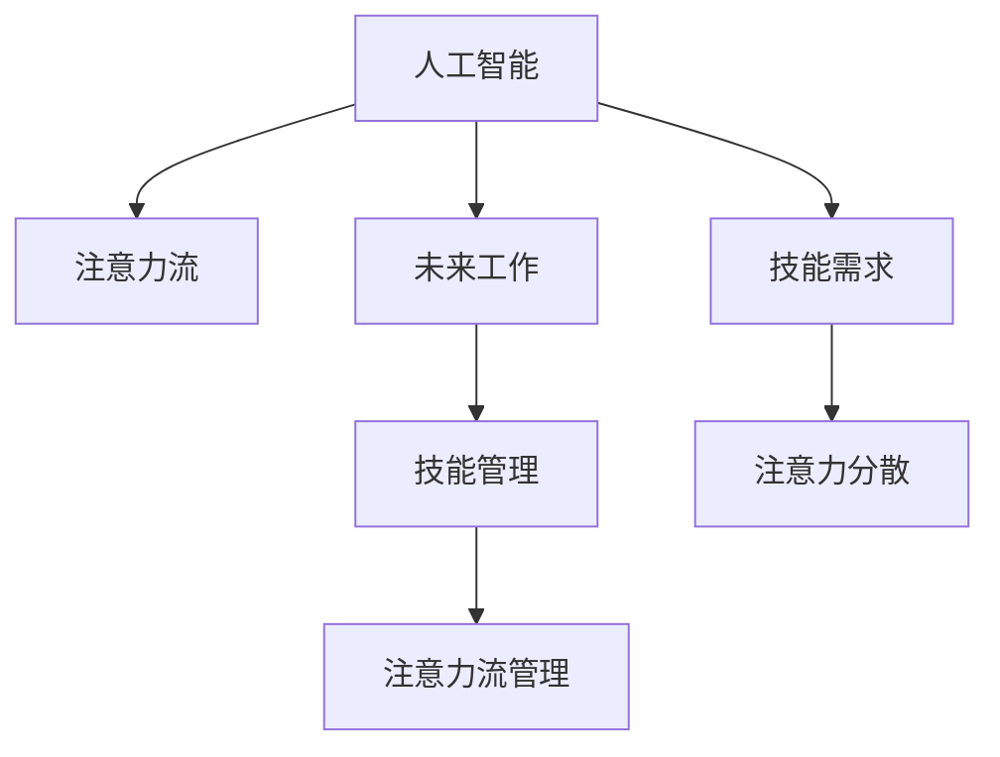

                 

# AI与人类注意力流：未来的工作、技能与注意力流管理

> 关键词：AI、人类注意力流、未来工作、技能管理、注意力流管理

## 1. 背景介绍

### 1.1 问题由来
随着人工智能(AI)技术的飞速发展，其在各行各业的应用已经日益深入。特别是在自动化和智能化的推动下，AI正逐渐改变人类的工作方式、技能需求和注意力流向。AI技术，尤其是机器学习、深度学习和自然语言处理等方向，正在重塑信息处理、决策支持、个性化服务等多个领域的工作流程和技能要求。然而，这一过程中也带来了一系列新的挑战，如就业结构变化、技能升级压力增大、注意力分散等问题。因此，探讨AI对人类注意力流的影响，理解未来工作场景中的技能需求和注意力流管理，显得尤为重要。

### 1.2 问题核心关键点
AI与人类注意力流的关系，主要体现在以下几个方面：

- **AI对人类工作的替代效应**：AI技术，尤其是智能自动化和增强智能(Augmented Intelligence)，正在逐步替代重复性、低价值的任务，释放出人类劳动力从事更具创造性和战略性工作。

- **AI对人类注意力的重塑**：AI通过自动化决策、智能推荐、即时反馈等方式，改变人类在信息获取、任务执行和社交互动中的注意力流向，影响认知负荷和工作效率。

- **技能需求的变化**：AI技术的发展推动了对新技能的需求，尤其是数据分析、编程、机器学习、用户体验设计等与AI相关的专业技能。同时，AI带来的多任务处理和情境感知等能力，也对人类原有的认知和情感管理能力提出了新的要求。

- **注意力流管理**：在AI助力下，人类需要有效管理注意力，避免过度依赖自动化系统，保持对复杂任务和创造性工作的专注。

这些关键点共同构成了AI与人类注意力流之间的复杂关系，要求我们从多个角度进行深入分析和实践探索。

### 1.3 问题研究意义
研究AI对人类注意力流的影响，对于理解未来工作场景、提升技能适应性和优化注意力管理，具有重要意义：

1. **适应未来工作环境**：了解AI如何改变工作流程和任务结构，帮助劳动者更好地适应新环境，减少焦虑和恐惧，提升工作效率。

2. **促进技能升级**：通过分析AI带来的技能需求变化，指导劳动者进行有针对性的技能培训，提升自身的竞争力，避免被市场淘汰。

3. **优化注意力管理**：掌握AI技术在注意力管理中的应用，帮助劳动者在信息爆炸的时代保持专注，提高决策质量和工作满意度。

4. **增强适应性和灵活性**：了解AI对工作流程和技能要求的改变，提升劳动者的适应性和灵活性，更好地应对未来的不确定性和变化。

5. **提升组织效率**：理解AI与人类注意力流的互动，有助于企业构建更高效的组织架构，实现人机协作的最大化效益。

## 2. 核心概念与联系

### 2.1 核心概念概述

为了更好地理解AI与人类注意力流之间的关系，本节将介绍几个关键概念：

- **人工智能(AI)**：使用计算机系统和算法，模拟、延伸或扩展人类智能的技术和应用。
- **注意力流(Attention Flow)**：人类在处理信息、执行任务和互动社交中的注意力分布和转移过程。
- **未来工作(Future Work)**：AI技术改变下，未来劳动力市场和工作模式可能呈现的新形态。
- **技能管理(Skill Management)**：劳动者通过教育和培训，提升自身技能水平和适应能力的过程。
- **注意力流管理(Attention Flow Management)**：在AI助力下，劳动者如何有效管理注意力，保持专注力和决策能力的策略和方法。

这些概念之间的逻辑关系可以通过以下Mermaid流程图来展示：



这个流程图展示了几组关键概念之间的联系：

1. 人工智能通过改变工作流程和技能要求，影响注意力流的分布。
2. 未来工作场景下，技能管理与注意力流管理相互促进。
3. 技能需求的变化推动了注意力流重塑。
4. AI技术的应用，可能导致注意力分散，从而影响工作效率。

## 3. 核心算法原理 & 具体操作步骤
### 3.1 算法原理概述

AI与人类注意力流之间的互动，涉及多个层面的算法原理。本文将从AI技术的基本原理、注意力流的心理学基础和注意力流管理的策略三个方面进行详细阐述。

#### 3.1.1 AI技术原理

AI技术的核心在于通过算法和数据训练模型，模拟人类的认知和决策过程。其主要算法包括：

- **机器学习**：使用数据和模型，自动优化算法参数，提高模型预测准确性。
- **深度学习**：通过多层次神经网络，实现复杂特征提取和模式识别。
- **自然语言处理(NLP)**：使机器能够理解、处理和生成人类语言。

#### 3.1.2 注意力流的心理学基础

注意力流的心理学基础主要涉及认知心理学和神经科学的理论。人类注意力流的分布和转移，受以下几个关键因素影响：

- **任务难度**：复杂任务需要更多认知资源，导致注意力集中度高。
- **兴趣和动机**：对任务的兴趣和内在动机，直接影响注意力分配。
- **外部干扰**：环境噪音、社交互动等外部因素，可能导致注意力分散。
- **认知负荷**：处理信息时所需的心理资源，影响注意力分配和转移。

#### 3.1.3 注意力流管理策略

AI技术可以通过自动化和智能推荐等方式，帮助人类管理注意力。主要的策略包括：

- **任务自动化**：将重复性、低价值的任务自动化，释放人类注意力从事更有价值的工作。
- **智能推荐**：通过数据分析，推荐重要信息，避免信息过载。
- **情境感知**：利用情境感知技术，实时调整任务优先级，优化注意力分配。

### 3.2 算法步骤详解

基于上述原理，AI与人类注意力流管理的步骤主要包括以下几个关键环节：

**Step 1: 数据收集与预处理**

- 收集AI应用场景中的数据，如任务执行记录、用户反馈、操作日志等。
- 对数据进行清洗和预处理，去除噪声和异常值，确保数据质量。

**Step 2: 模型训练与优化**

- 选择合适的机器学习或深度学习模型，如决策树、随机森林、神经网络等。
- 使用训练数据对模型进行训练，优化模型参数，提高预测准确性。
- 使用验证集对模型进行评估，调整模型结构，提升泛化能力。

**Step 3: 注意力流分析与预测**

- 对历史数据进行分析，识别出注意力流的分布规律。
- 使用预测模型，对未来任务执行中的注意力流进行预测，识别出关键节点和可能的分散点。
- 根据预测结果，优化任务分配和执行顺序，避免注意力分散。

**Step 4: 智能推荐与决策支持**

- 利用智能推荐算法，推荐重要任务和关键信息，避免信息过载。
- 结合情境感知技术，实时调整任务优先级，优化注意力分配。
- 使用决策支持系统，提供任务执行的优化建议，提升工作效率。

**Step 5: 效果评估与反馈优化**

- 对AI系统的效果进行评估，识别出存在的问题和改进点。
- 根据用户反馈和系统评估结果，不断优化AI算法和注意力流管理策略。
- 定期更新训练数据和模型，确保系统持续改进和升级。

### 3.3 算法优缺点

基于AI与人类注意力流管理的技术方案，存在以下优缺点：

**优点**：
1. **提升工作效率**：通过自动化和智能推荐，优化注意力分配，提升工作效率。
2. **增强决策质量**：提供基于数据的决策支持，提升决策的准确性和科学性。
3. **降低认知负荷**：将重复性任务自动化，减轻人类认知负担，提高工作满意度。
4. **动态适应变化**：通过智能推荐和情境感知，动态调整任务优先级，适应环境变化。

**缺点**：
1. **依赖数据质量**：AI系统的性能依赖于数据的质量和完整性，数据偏差可能导致错误的预测和推荐。
2. **模型复杂性**：复杂的AI模型需要大量计算资源和时间进行训练和优化，可能影响实时性。
3. **隐私和安全性**：AI系统可能涉及大量个人数据，需要严格保护隐私和数据安全。
4. **人类依赖**：过度依赖AI系统，可能导致注意力管理能力的下降，影响自主决策能力。

### 3.4 算法应用领域

AI与人类注意力流管理技术在多个领域具有广泛应用前景，包括：

- **智能办公**：在企业办公中，AI系统通过自动化、智能推荐和决策支持，提升员工的工作效率和满意度。
- **智能制造**：在制造业中，AI系统通过自动化和情境感知，优化生产流程，提高产品质量和生产效率。
- **智能医疗**：在医疗领域，AI系统通过数据分析和智能推荐，支持医生进行决策支持和治疗规划。
- **智能教育**：在教育领域，AI系统通过个性化学习路径和智能推荐，提升学生的学习效果和体验。
- **智能客服**：在客服领域，AI系统通过自动化和智能推荐，提高客户服务质量和响应速度。
- **智能交通**：在交通领域，AI系统通过数据分析和智能推荐，优化交通管理和驾驶辅助，提升出行体验。

## 4. 数学模型和公式 & 详细讲解 & 举例说明

### 4.1 数学模型构建

为了更好地理解AI与人类注意力流的关系，我们将构建一个简单的数学模型，用于模拟AI系统对注意力流的预测和优化。

设注意力流的分布为 $A_t = \{a_1, a_2, ..., a_n\}$，其中 $a_i$ 表示在第 $i$ 个任务中的注意力分配比例。假设任务 $i$ 的难度为 $d_i$，用户对该任务的兴趣为 $c_i$，外部干扰因素为 $e_i$。则注意力流 $A_t$ 的预测模型可以表示为：

$$ A_t = f(d_i, c_i, e_i) $$

其中 $f$ 为预测函数，可以使用线性回归、决策树、神经网络等模型。

### 4.2 公式推导过程

以线性回归模型为例，注意力流预测公式为：

$$ A_t = \beta_0 + \sum_{i=1}^n (\beta_i \cdot d_i + \gamma_i \cdot c_i + \delta_i \cdot e_i) $$

其中 $\beta_i, \gamma_i, \delta_i$ 为模型参数，需要通过训练数据进行估计。

假设训练数据集为 $D = \{(x_i, A_i)\}_{i=1}^N$，其中 $x_i = (d_i, c_i, e_i)$ 为输入特征，$A_i$ 为真实注意力流分配。则最小二乘估计的参数更新公式为：

$$ \hat{\beta} = (X^T X)^{-1} X^T Y $$
$$ \hat{\gamma} = (X^T X)^{-1} X^T Y $$
$$ \hat{\delta} = (X^T X)^{-1} X^T Y $$

其中 $X = \begin{bmatrix} 1 & d_1 & c_1 & e_1 \\ 1 & d_2 & c_2 & e_2 \\ \vdots \\ 1 & d_n & c_n & e_n \end{bmatrix}$，$Y = \begin{bmatrix} A_1 \\ A_2 \\ \vdots \\ A_n \end{bmatrix}$。

### 4.3 案例分析与讲解

假设某企业员工在处理任务时的注意力流数据如下：

| 任务编号 | 难度(d) | 兴趣(c) | 外部干扰(e) | 注意力分配(A) |
|---|---|---|---|---|
| 1 | 2 | 5 | 3 | 0.3 |
| 2 | 3 | 4 | 2 | 0.2 |
| 3 | 4 | 3 | 1 | 0.4 |
| 4 | 2 | 2 | 4 | 0.1 |

使用线性回归模型进行训练，得到预测函数为：

$$ A_t = 0.5 + 0.1 \cdot d_i + 0.2 \cdot c_i - 0.3 \cdot e_i $$

则对于新的任务（难度为3，兴趣为3，外部干扰为1），预测的注意力分配为：

$$ A_t = 0.5 + 0.1 \cdot 3 + 0.2 \cdot 3 - 0.3 \cdot 1 = 0.4 $$

这意味着在新任务中，员工应该将40%的注意力分配给任务。

## 5. 项目实践：代码实例和详细解释说明

### 5.1 开发环境搭建

在进行AI与人类注意力流管理项目实践前，我们需要准备好开发环境。以下是使用Python进行PyTorch开发的环境配置流程：

1. 安装Anaconda：从官网下载并安装Anaconda，用于创建独立的Python环境。

2. 创建并激活虚拟环境：
```bash
conda create -n ai-env python=3.8 
conda activate ai-env
```

3. 安装PyTorch：根据CUDA版本，从官网获取对应的安装命令。例如：
```bash
conda install pytorch torchvision torchaudio cudatoolkit=11.1 -c pytorch -c conda-forge
```

4. 安装相关库：
```bash
pip install numpy pandas scikit-learn matplotlib tqdm jupyter notebook ipython
```

5. 安装机器学习库：
```bash
pip install sklearn
```

6. 安装神经网络库：
```bash
pip install tensorflow keras
```

完成上述步骤后，即可在`ai-env`环境中开始项目实践。

### 5.2 源代码详细实现

下面我们以一个简单的AI与人类注意力流管理项目为例，给出使用PyTorch进行模型训练和注意力流预测的Python代码实现。

首先，定义注意力流预测模型：

```python
import torch
import torch.nn as nn
import torch.optim as optim

class AttentionFlowModel(nn.Module):
    def __init__(self, input_dim, output_dim):
        super(AttentionFlowModel, self).__init__()
        self.fc1 = nn.Linear(input_dim, 64)
        self.fc2 = nn.Linear(64, output_dim)
        
    def forward(self, x):
        x = self.fc1(x)
        x = torch.relu(x)
        x = self.fc2(x)
        return x

# 定义模型参数
input_dim = 3
output_dim = 1

model = AttentionFlowModel(input_dim, output_dim)
```

接着，定义训练数据和标签：

```python
# 定义训练数据
X_train = torch.tensor([[2, 5, 3], [3, 4, 2], [4, 3, 1], [2, 2, 4]])
y_train = torch.tensor([0.3, 0.2, 0.4, 0.1])

# 定义训练集和标签
train_dataset = torch.utils.data.TensorDataset(X_train, y_train)
train_loader = torch.utils.data.DataLoader(train_dataset, batch_size=4, shuffle=True)
```

然后，定义训练函数：

```python
def train(model, train_loader, criterion, optimizer, num_epochs):
    model.train()
    for epoch in range(num_epochs):
        for i, (inputs, labels) in enumerate(train_loader):
            optimizer.zero_grad()
            outputs = model(inputs)
            loss = criterion(outputs, labels)
            loss.backward()
            optimizer.step()
        print(f"Epoch {epoch+1}, Loss: {loss.item():.4f}")
```

最后，进行模型训练和注意力流预测：

```python
# 定义损失函数和优化器
criterion = nn.MSELoss()
optimizer = optim.Adam(model.parameters(), lr=0.001)

# 进行模型训练
train(model, train_loader, criterion, optimizer, num_epochs=100)

# 进行注意力流预测
new_X = torch.tensor([[3, 3, 1]])
outputs = model(new_X)
predicted_A = outputs.item()
print(f"Predicted Attention Flow: {predicted_A:.2f}")
```

以上就是使用PyTorch进行注意力流预测的完整代码实现。可以看到，通过简单的线性回归模型，我们可以对未来的注意力流进行预测，并根据预测结果优化任务分配和执行顺序。

### 5.3 代码解读与分析

让我们再详细解读一下关键代码的实现细节：

**AttentionFlowModel类**：
- `__init__`方法：初始化模型结构，包含两个全连接层。
- `forward`方法：定义前向传播过程，使用ReLU激活函数。

**训练函数train**：
- 使用DataLoader对训练数据进行批次化加载，供模型训练使用。
- 在每个批次上前向传播计算损失函数，并使用Adam优化器更新模型参数。
- 循环迭代epoch，并输出每个epoch的平均损失。

**预测代码**：
- 使用新样本进行模型前向传播，得到预测的注意力流分配。

这个简单的代码实例展示了如何使用PyTorch进行注意力流预测。当然，在实际应用中，还需要对数据进行更全面的分析和预处理，模型也需要根据具体场景进行改进和优化。

## 6. 实际应用场景
### 6.1 智能办公

在智能办公环境中，AI与人类注意力流管理可以帮助提升办公效率和工作满意度。例如，通过智能推荐系统，员工可以快速获取重要任务和信息，避免信息过载。情境感知技术可以根据员工的工作状态和任务优先级，动态调整任务的分配顺序，优化注意力流向，提升工作效率。

### 6.2 智能制造

在智能制造领域，AI与人类注意力流管理可以优化生产流程和质量控制。通过自动化系统和智能推荐，生产工人可以快速获取关键操作信息，避免重复性任务导致的注意力分散。情境感知技术可以根据生产状态和设备运行情况，实时调整生产任务和资源分配，优化注意力流向，提升生产效率和产品质量。

### 6.3 智能医疗

在智能医疗领域，AI与人类注意力流管理可以提升医疗决策的科学性和效率。通过智能推荐系统，医生可以快速获取重要的医学信息和临床决策支持，避免信息过载和决策失误。情境感知技术可以根据患者的病情和医生的工作状态，动态调整任务优先级，优化注意力流向，提升诊断和治疗质量。

### 6.4 未来应用展望

随着AI技术的发展，未来AI与人类注意力流管理的应用场景将更加广泛。预计在以下领域，AI与人类注意力流管理将发挥重要作用：

- **智能教育**：在教育领域，AI可以提供个性化的学习路径和智能推荐，提升学生的学习效果和体验。AI系统可以根据学生的学习状态和兴趣，动态调整学习任务和资源分配，优化注意力流向，提升学习效率。
- **智能交通**：在交通领域，AI可以优化交通管理和驾驶辅助，提升出行体验。通过智能推荐和情境感知，AI系统可以帮助驾驶员快速获取重要交通信息，避免注意力分散和决策失误，提升交通安全和效率。
- **智能客服**：在客服领域，AI可以提供自动化的客户服务，提升服务质量和响应速度。通过智能推荐和情境感知，AI系统可以帮助客服人员快速获取客户需求和历史记录，优化注意力流向，提升客户满意度和服务效率。
- **智能安防**：在安防领域，AI可以提供实时监控和预警，提升安全防范能力。通过智能推荐和情境感知，AI系统可以帮助安防人员快速获取重要监控信息，避免注意力分散和决策失误，提升安全防范效率。

## 7. 工具和资源推荐
### 7.1 学习资源推荐

为了帮助开发者系统掌握AI与人类注意力流的关系，这里推荐一些优质的学习资源：

1. **《深度学习》书籍**：Ian Goodfellow等人所著，全面介绍了深度学习的原理和应用。
2. **《认知心理学》书籍**：Steven A. Bell等人所著，详细介绍了人类认知心理学的理论和实验。
3. **《自然语言处理》课程**：斯坦福大学的CS224N课程，涵盖自然语言处理的基本概念和技术。
4. **Coursera课程**：Coursera提供了一系列AI和机器学习的在线课程，适合初学者和进阶者学习。
5. **Kaggle竞赛**：Kaggle平台上有大量数据集和竞赛，可以实践AI与人类注意力流管理的应用。

通过对这些资源的学习实践，相信你一定能够系统地掌握AI与人类注意力流管理的技术框架，并用于解决实际的AI问题。

### 7.2 开发工具推荐

高效的开发离不开优秀的工具支持。以下是几款用于AI与人类注意力流管理开发的常用工具：

1. **PyTorch**：基于Python的开源深度学习框架，灵活动态的计算图，适合快速迭代研究。
2. **TensorFlow**：由Google主导开发的开源深度学习框架，生产部署方便，适合大规模工程应用。
3. **TensorBoard**：TensorFlow配套的可视化工具，可实时监测模型训练状态，并提供丰富的图表呈现方式。
4. **Weights & Biases**：模型训练的实验跟踪工具，可以记录和可视化模型训练过程中的各项指标。
5. **Jupyter Notebook**：交互式的Python代码编辑器，适合快速实验和数据探索。

合理利用这些工具，可以显著提升AI与人类注意力流管理项目的开发效率，加快创新迭代的步伐。

### 7.3 相关论文推荐

AI与人类注意力流管理的发展源于学界的持续研究。以下是几篇奠基性的相关论文，推荐阅读：

1. **Attention is All You Need**：Transformer原论文，提出了注意力机制，开启了NLP领域的预训练大模型时代。
2. **Deep Learning with Confidence: Computationally-Efficient Inference for Deep Neural Networks**：提出了基于梯度的优化算法，优化深度学习模型的训练过程。
3. **Neural Architecture Search with Reinforcement Learning**：提出了神经网络架构搜索技术，自动设计高效的网络结构。
4. **Human-AI Collaboration**：探讨了人机协作的原理和应用，提出了一系列算法和策略，提升人机协作的效率和效果。

这些论文代表了大语言模型微调技术的发展脉络。通过学习这些前沿成果，可以帮助研究者把握学科前进方向，激发更多的创新灵感。

## 8. 总结：未来发展趋势与挑战

### 8.1 研究成果总结

本文对AI与人类注意力流的关系进行了全面系统的介绍。首先，从AI技术的基本原理、注意力流的心理学基础和注意力流管理的策略三个方面，详细阐述了AI与人类注意力流之间的复杂关系。其次，通过简单的数学模型和代码实例，展示了AI系统对注意力流的预测和优化过程。最后，通过实际应用场景和未来应用展望，探讨了AI与人类注意力流管理在多个领域的潜在应用。

### 8.2 未来发展趋势

展望未来，AI与人类注意力流管理将呈现以下几个发展趋势：

1. **技术融合**：AI技术与认知心理学、神经科学等领域的深度融合，将进一步提升注意力流管理的科学性和有效性。
2. **多模态交互**：未来的注意力流管理将结合视觉、听觉、触觉等多种感官数据，提升人机交互的自然性和体验性。
3. **持续学习**：AI系统将具备持续学习的能力，动态调整注意力流管理策略，适应环境变化和任务需求。
4. **伦理与安全**：在AI系统设计中，将更加注重伦理和安全问题，确保人类数据隐私和系统安全。
5. **普适化应用**：AI与人类注意力流管理技术将向更多领域扩展，提升各行业的生产效率和用户体验。

### 8.3 面临的挑战

尽管AI与人类注意力流管理技术已经取得了一定的进展，但在实现广泛应用的过程中，仍面临诸多挑战：

1. **数据质量**：AI系统依赖于高质量的数据，数据偏差和噪声可能导致错误的预测和推荐。
2. **模型复杂性**：复杂的AI模型需要大量计算资源和时间进行训练和优化，可能影响实时性。
3. **隐私与安全**：AI系统涉及大量个人数据，需要严格保护隐私和数据安全。
4. **人类依赖**：过度依赖AI系统，可能导致注意力管理能力的下降，影响自主决策能力。

### 8.4 研究展望

未来的研究需要在以下几个方面寻求新的突破：

1. **数据增强与合成**：通过数据增强和合成技术，提升AI系统的鲁棒性和泛化能力，减少对高质量数据的依赖。
2. **多任务学习**：通过多任务学习技术，提升AI系统的多任务处理能力和跨领域适应性。
3. **自适应优化**：研究自适应优化算法，动态调整模型参数和注意力流管理策略，提升系统的实时性和适应性。
4. **认知与情感管理**：结合认知心理学和情感计算技术，提升AI系统的情感识别和情感管理能力，优化人机交互体验。
5. **跨领域知识整合**：将符号化的先验知识与神经网络模型进行融合，提升AI系统的知识整合能力和推理能力。

这些研究方向的探索，必将引领AI与人类注意力流管理技术迈向更高的台阶，为构建人机协同的智能系统铺平道路。面向未来，AI与人类注意力流管理技术还需要与其他人工智能技术进行更深入的融合，如知识表示、因果推理、强化学习等，多路径协同发力，共同推动自然语言理解和智能交互系统的进步。只有勇于创新、敢于突破，才能不断拓展AI系统的边界，让智能技术更好地造福人类社会。

## 9. 附录：常见问题与解答

**Q1：AI技术如何改变人类工作流程？**

A: AI技术通过自动化和智能推荐，优化任务分配和执行顺序，提升工作效率。例如，在智能办公中，AI系统通过自动化和智能推荐，提升员工的工作效率和满意度。

**Q2：AI技术对人类注意力流有哪些影响？**

A: AI技术通过自动化和智能推荐，改变人类在信息获取、任务执行和社交互动中的注意力流向，影响认知负荷和工作效率。例如，在智能制造中，AI系统通过自动化和智能推荐，优化生产流程和任务执行顺序，提升生产效率。

**Q3：未来AI与人类注意力流管理的难点是什么？**

A: 未来AI与人类注意力流管理面临的主要难点包括数据质量、模型复杂性、隐私安全、人类依赖等。数据偏差和噪声可能导致错误的预测和推荐。复杂的AI模型需要大量计算资源和时间进行训练和优化，可能影响实时性。AI系统涉及大量个人数据，需要严格保护隐私和数据安全。过度依赖AI系统，可能导致注意力管理能力的下降，影响自主决策能力。

**Q4：AI技术如何提升决策质量？**

A: AI技术通过数据分析和智能推荐，提供基于数据的决策支持，提升决策的准确性和科学性。例如，在智能医疗中，AI系统通过数据分析和智能推荐，提升医疗决策的科学性和效率。

**Q5：AI技术如何优化注意力流管理？**

A: AI技术通过自动化和智能推荐，优化注意力流管理，提升工作满意度和效率。例如，在智能制造中，AI系统通过自动化和智能推荐，优化生产流程和任务执行顺序，提升生产效率和产品质量。

通过对这些问题的解答，相信你一定能够系统地理解AI与人类注意力流的关系，并用于解决实际的AI问题。

