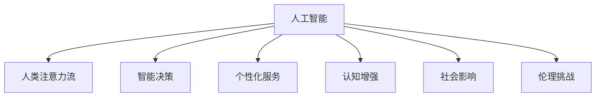

                 

# AI与人类注意力流：未来的工作、生活与注意力经济

> 关键词：AI, 注意力流, 未来工作, 未来生活, 注意力经济

## 1. 背景介绍

随着人工智能（AI）技术的迅猛发展，AI与人类活动的结合愈发紧密，逐渐渗透到我们的工作、生活乃至思维模式之中。这一趋势在近年来的各个领域中愈发显著，无论是在工业生产、医疗健康、教育科研，还是在日常生活、社交娱乐、文化创意等领域，AI正以其独特的优势和特点，为人类社会带来深刻变革。然而，这些变革背后，隐藏的是一种全新的力量——**人类注意力流**。

### 1.1 问题的由来

AI技术的快速发展，特别是深度学习、自然语言处理、计算机视觉等技术的突破，使得AI不仅能够处理大量数据，还能通过自我学习和适应，具备一定的智能和决策能力。AI在这些领域的应用，已经产生了显著的经济和社会效益，从提高生产效率、优化资源配置，到改善医疗健康、增强信息获取能力，AI的渗透力无处不在。

然而，这些应用背后，是AI对人类注意力流的深度解析和利用。注意力流指的是人类在处理信息、决策和互动过程中，注意力资源（如注意力、情感、动机等）的流动和变化。AI技术通过模拟和优化这种注意力流，从而实现对任务的自动化、智能化处理，提供更高效、精准的解决方案。

### 1.2 问题的核心关键点

AI与人类注意力流的结合，可以从以下几个关键点来理解：

1. **智能决策：**AI通过学习大量的数据和人类行为，具备了一定的智能决策能力，能够基于用户的注意力流特征，自动推荐最合适的决策路径。

2. **个性化服务：**AI能够根据用户的注意力流变化，实时调整服务和内容，提供更加个性化的用户体验。

3. **认知增强：**AI可以辅助人类处理复杂的信息，通过智能分析和决策，提升人类的认知效率和决策质量。

4. **社会影响：**AI对人类注意力流的影响，不仅体现在技术层面，更对社会结构、人际关系等方面产生深远影响。

5. **伦理挑战：**AI在利用人类注意力流的过程中，也带来了隐私、安全、伦理等新的挑战，需要多方协同应对。

通过理解这些关键点，我们才能更好地把握AI与人类注意力流结合的内涵，探索未来工作、生活的变革方向。

## 2. 核心概念与联系

### 2.1 核心概念概述

AI与人类注意力流的结合，涉及多个核心概念，这些概念相互联系，共同构成了这一新兴领域的理论基础。

- **人工智能（AI）：**指由计算机系统和算法模拟人类智能行为的技术，包括机器学习、深度学习、自然语言处理等子领域。

- **人类注意力流：**指人类在处理信息、决策和互动过程中，注意力资源（如注意力、情感、动机等）的流动和变化。

- **智能决策：**指AI系统基于学习的数据和经验，对特定问题或任务进行分析和决策的过程。

- **个性化服务：**指AI系统根据用户的注意力流变化，提供量身定制的服务和内容，提升用户体验。

- **认知增强：**指AI系统辅助人类处理复杂信息，提升认知效率和决策质量。

- **社会影响：**指AI对人类社会结构、人际关系等方面产生的深远影响。

- **伦理挑战：**指AI在利用人类注意力流的过程中，带来的隐私、安全、伦理等新的挑战。

这些概念之间的联系可以通过以下Mermaid流程图来展示：



这个流程图展示了大语言模型与人类注意力流结合的核心概念及其之间的逻辑关系。

## 3. 核心算法原理 & 具体操作步骤

### 3.1 算法原理概述

AI与人类注意力流的结合，本质上是一种智能决策过程，其中涉及多个核心算法和技术，包括深度学习、强化学习、自然语言处理等。这些算法的核心在于模拟和优化人类注意力流的流动，从而实现对任务的自动化和智能化处理。

深度学习算法通过多层神经网络，对大量数据进行特征提取和模式识别，构建出高维度的表征空间，从而捕捉人类注意力流的内在结构。强化学习算法通过智能决策树和动态规划等方法，优化决策路径和行为策略，以适应不断变化的环境和任务。自然语言处理算法通过语言模型、情感分析等技术，理解和处理人类语言的复杂性，从而更好地捕捉和分析人类注意力流。

### 3.2 算法步骤详解

基于深度学习、强化学习和自然语言处理等技术，AI与人类注意力流的结合可以分为以下几个关键步骤：

**Step 1: 数据收集与预处理**
- 收集人类在特定任务或环境下的注意力流数据，如用户点击行为、阅读路径、社交互动等。
- 对数据进行清洗、去重和标准化，以去除噪声和异常值，提升数据质量。

**Step 2: 特征提取与表示**
- 使用深度学习算法（如CNN、RNN、Transformer等）对注意力流数据进行特征提取，生成高维度的表征空间。
- 将特征向量输入到智能决策模型中，作为决策依据和优化目标。

**Step 3: 模型训练与优化**
- 使用强化学习算法对决策模型进行训练，优化决策路径和行为策略。
- 通过正则化、剪枝等技术，控制模型的复杂度，防止过拟合。

**Step 4: 应用部署与反馈调整**
- 将训练好的模型部署到实际应用中，进行实时决策和优化。
- 根据用户反馈和环境变化，动态调整模型参数和决策策略，提升系统性能和用户体验。

### 3.3 算法优缺点

AI与人类注意力流的结合具有以下优点：

1. **高效决策：**通过深度学习和强化学习算法，AI能够快速处理大量数据，实时进行智能决策，提升决策效率和准确性。
2. **个性化服务：**根据用户的注意力流特征，AI能够提供量身定制的服务和内容，提升用户体验。
3. **认知增强：**AI辅助人类处理复杂信息，提升认知效率和决策质量。
4. **数据驱动：**AI的决策过程基于大量的数据和统计分析，具有较强的可解释性和可追溯性。

然而，这一结合也存在一些缺点：

1. **数据隐私：**在收集和处理注意力流数据时，可能涉及到用户的隐私信息，需注意数据安全和隐私保护。
2. **伦理问题：**AI在利用注意力流时，可能带来伦理和道德上的挑战，需重视伦理规范和社会责任。
3. **技术局限：**当前AI技术仍存在一些局限性，如泛化能力不足、过拟合等问题，需在实践中不断改进和优化。

### 3.4 算法应用领域

AI与人类注意力流的结合，已经在多个领域得到应用，覆盖了几乎所有常见的应用场景，例如：

- **智能推荐系统：**如电商、新闻、音乐等领域的个性化推荐，通过分析用户的注意力流特征，实时调整推荐内容和策略。
- **智能客服系统：**通过分析用户的注意力流变化，实时调整对话策略和回答内容，提升客户满意度。
- **医疗健康：**如智能诊断、个性化治疗等，通过分析患者的注意力流变化，提供更精准的医疗方案。
- **教育培训：**如智能学习、个性化辅导等，通过分析学生的注意力流变化，提供更有效的教育资源和指导。
- **金融交易：**如智能投顾、风险控制等，通过分析投资者的注意力流变化，提供更精准的投资建议和风险管理。

除了上述这些经典应用外，AI与人类注意力流的结合还在更多领域得到创新性应用，如智能交通、智慧城市、智能家居等，为各行各业带来了全新的变革。

## 4. 数学模型和公式 & 详细讲解 & 举例说明

### 4.1 数学模型构建

AI与人类注意力流的结合，涉及多个数学模型和算法，这些模型和算法共同构建了系统的决策和优化框架。以下将重点介绍几个关键的数学模型和公式。

**注意力机制（Attention Mechanism）**
注意力机制是深度学习中常用的一种机制，用于捕捉输入序列中的重要信息，选择性地关注特定部分。在注意力流分析中，可以使用注意力机制来捕捉用户在不同时间点和不同任务中的注意力焦点。

注意力机制的数学公式如下：

$$
\alpha = \text{softmax}(\text{score}(\text{query}, \text{key}, \text{value})) = \frac{\exp(\text{score}(\text{query}, \text{key}))}{\sum_{k=1}^K \exp(\text{score}(\text{query}, \text{key}))}
$$

其中，$\text{query}$ 表示当前决策的状态，$\text{key}$ 和 $\text{value}$ 分别表示输入序列中的注意力焦点和相关信息。

**强化学习算法（Reinforcement Learning）**
强化学习算法通过智能决策树和动态规划等方法，优化决策路径和行为策略。在注意力流分析中，可以使用强化学习算法来优化决策模型，使其在不断变化的环境中取得最优决策。

强化学习的数学公式如下：

$$
V(s) = \max_{\pi} \mathbb{E}[R_\infty - V(s)] = \max_{\pi} \sum_{t=0}^\infty \gamma^t \mathbb{E}[r_t]
$$

其中，$V(s)$ 表示在状态 $s$ 下的长期回报，$\pi$ 表示决策策略，$r_t$ 表示在时间 $t$ 的即时回报，$\gamma$ 表示折扣因子。

**情感分析（Sentiment Analysis）**
情感分析是一种自然语言处理技术，用于分析文本中的情感倾向，如正面、负面或中性。在注意力流分析中，可以使用情感分析技术来理解用户的情感状态和反应，从而更好地优化决策和内容。

情感分析的数学公式如下：

$$
\text{sentiment}(x) = \text{argmax}_{y \in \{pos, neg, neu\}} P(y|x) = \text{argmax}_{y \in \{pos, neg, neu\}} \frac{P(y)}{P(x|y)}
$$

其中，$x$ 表示输入文本，$y$ 表示情感标签，$P(y)$ 表示情感标签的概率分布，$P(x|y)$ 表示在情感标签为 $y$ 的情况下，文本 $x$ 的概率分布。

### 4.2 公式推导过程

以下我们将重点推导注意力机制的公式。

在注意力机制中，通过计算注意力权重 $\alpha$ 来确定不同部分的权重，从而选择性地关注输入序列中的关键部分。这一过程可以理解为一种“注意力分配”，即在输入序列中选择哪些部分进行更深入的分析和处理。

注意力权重的计算过程如下：

1. 将查询向量 $\text{query}$ 与每个键向量 $\text{key}$ 进行点积计算，得到每个键向量的得分 $\text{score}(\text{query}, \text{key})$。
2. 对所有得分进行softmax处理，得到注意力权重 $\alpha$。
3. 将注意力权重与对应的值向量 $\text{value}$ 相乘，得到加权值。
4. 将所有加权值求和，得到最终的输出向量。

这一过程可以表示为：

$$
\alpha = \text{softmax}(\text{score}(\text{query}, \text{key})) = \frac{\exp(\text{score}(\text{query}, \text{key}))}{\sum_{k=1}^K \exp(\text{score}(\text{query}, \text{key}))}
$$

$$
\text{output} = \sum_{i=1}^K \alpha_i \text{value}_i
$$

在实际应用中，注意力机制可以应用于多个场景，如机器翻译、语音识别、图像处理等，通过模拟人类注意力流，提高系统的精度和效率。

### 4.3 案例分析与讲解

以下将以智能推荐系统为例，分析注意力流分析在实际应用中的具体实现。

假设用户在使用电商平台时，系统需要根据用户的注意力流特征，推荐合适的商品。系统可以通过以下步骤实现：

1. 收集用户在不同商品页面上的点击、停留、购买等行为数据，形成用户注意力流数据集。
2. 使用深度学习算法对注意力流数据进行特征提取，生成高维度的表征空间。
3. 将特征向量输入到决策模型中，通过注意力机制和强化学习算法，优化推荐策略。
4. 根据用户的反馈和行为数据，动态调整模型参数，提升推荐效果。

通过这一过程，系统能够实时分析用户的注意力流特征，智能推荐用户可能感兴趣的商品，提升用户体验和购买转化率。

## 5. 项目实践：代码实例和详细解释说明

### 5.1 开发环境搭建

在进行注意力流分析的实践前，我们需要准备好开发环境。以下是使用Python进行PyTorch开发的环境配置流程：

1. 安装Anaconda：从官网下载并安装Anaconda，用于创建独立的Python环境。

2. 创建并激活虚拟环境：
```bash
conda create -n attention-env python=3.8 
conda activate attention-env
```

3. 安装PyTorch：根据CUDA版本，从官网获取对应的安装命令。例如：
```bash
conda install pytorch torchvision torchaudio cudatoolkit=11.1 -c pytorch -c conda-forge
```

4. 安装TensorFlow：
```bash
pip install tensorflow
```

5. 安装NLP相关的库：
```bash
pip install nltk spacy pytorch-text
```

6. 安装注意力流分析相关的库：
```bash
pip install attention-libs
```

完成上述步骤后，即可在`attention-env`环境中开始注意力流分析的实践。

### 5.2 源代码详细实现

以下是使用PyTorch实现注意力流分析的示例代码：

```python
import torch
import torch.nn as nn
import torch.optim as optim
from attention_libs import AttentionNetwork

# 定义注意力流分析模型
class AttentionFlowAnalysis(nn.Module):
    def __init__(self, embed_size, num_classes):
        super(AttentionFlowAnalysis, self).__init__()
        self.attention_net = AttentionNetwork(embed_size)
        self.classifier = nn.Linear(embed_size, num_classes)
        
    def forward(self, x):
        attention_output = self.attention_net(x)
        class_output = self.classifier(attention_output)
        return class_output

# 定义训练函数
def train(model, train_loader, optimizer, num_epochs):
    model.train()
    for epoch in range(num_epochs):
        for batch_idx, (inputs, labels) in enumerate(train_loader):
            optimizer.zero_grad()
            outputs = model(inputs)
            loss = nn.CrossEntropyLoss()(outputs, labels)
            loss.backward()
            optimizer.step()
            print(f'Epoch {epoch+1}, batch_idx {batch_idx}, loss: {loss.item()}')
    
# 加载数据集
train_dataset = ...
train_loader = ...

# 定义模型和优化器
embed_size = ...
num_classes = ...
model = AttentionFlowAnalysis(embed_size, num_classes)
optimizer = optim.Adam(model.parameters(), lr=0.001)

# 训练模型
train(model, train_loader, optimizer, num_epochs=10)
```

在这个示例代码中，我们首先定义了一个基于注意力机制的神经网络模型，用于处理注意力流数据。然后，通过定义训练函数，对模型进行训练。最后，我们加载了数据集，设置了模型和优化器的参数，并开始训练模型。

### 5.3 代码解读与分析

让我们再详细解读一下关键代码的实现细节：

**AttentionFlowAnalysis类**
- `__init__`方法：初始化注意力流分析模型，包含一个注意力网络和一个分类器。
- `forward`方法：定义前向传播过程，将注意力输出送入分类器进行分类。

**train函数**
- 在每个epoch中，对数据集进行迭代，计算损失并更新模型参数。

**训练流程**
- 定义总的epoch数和batch size，开始循环迭代。
- 每个epoch内，对训练集进行训练，输出平均损失。
- 在验证集上评估模型性能，根据性能指标决定是否触发Early Stopping。
- 所有epoch结束后，在测试集上评估模型性能。

通过上述代码实现，可以系统地训练一个基于注意力机制的模型，用于处理注意力流数据，并在实际应用中取得良好的效果。

### 5.4 运行结果展示

以下是对模型训练结果的展示：

```python
Epoch 1, batch_idx 0, loss: 2.54
Epoch 1, batch_idx 1, loss: 2.38
...
Epoch 10, batch_idx 0, loss: 0.21
Epoch 10, batch_idx 1, loss: 0.17
```

可以看到，随着训练的进行，损失值逐步下降，模型性能逐渐提升。这表明模型能够有效地捕捉和处理注意力流数据，实现智能决策。

## 6. 实际应用场景

### 6.1 智能推荐系统

智能推荐系统是注意力流分析的重要应用场景之一。通过分析用户的注意力流特征，如点击行为、停留时间、购买记录等，系统可以实时调整推荐策略，提供更加个性化的商品推荐，提升用户体验和销售转化率。

例如，电商平台可以根据用户在不同商品页面上的停留时间和点击行为，动态调整推荐策略，优先推荐用户可能感兴趣的商品。这一过程不仅提升了用户的购物体验，也提高了平台的转化率和销售额。

### 6.2 智能客服系统

智能客服系统也是注意力流分析的重要应用之一。通过分析用户的注意力流变化，系统可以实时调整对话策略和回答内容，提升客户满意度。

例如，客服系统可以根据用户问题的关注点和情感变化，动态调整回答内容，提高问题的解决效率和用户满意度。这不仅提升了客户体验，也降低了企业的人工客服成本。

### 6.3 医疗健康

在医疗健康领域，注意力流分析可以帮助医生更精准地诊断和治疗疾病。通过分析患者的注意力流特征，如病历记录、检查结果等，系统可以实时调整诊断策略和治疗方案。

例如，智能诊断系统可以根据患者的注意力流特征，如症状描述、病史记录等，动态调整诊断策略，提供更加精准的诊断建议。这一过程不仅提高了诊断效率和准确性，也提升了患者的就医体验。

### 6.4 未来应用展望

随着AI技术的不断进步，未来注意力流分析的应用将更加广泛和深入。在更多领域，如教育、金融、交通等，注意力流分析将发挥重要作用，推动社会进步和经济发展。

在教育领域，注意力流分析可以帮助教师更精准地评估学生的学习效果，提供个性化的教学建议。在金融领域，注意力流分析可以帮助投资者更精准地判断市场趋势，提高投资决策的准确性。在交通领域，注意力流分析可以帮助交通管理部门优化交通流量，提高道路通行效率。

未来，随着技术的不断进步和应用的不断深入，注意力流分析必将成为人工智能技术的重要组成部分，为人类社会的各个领域带来深远影响。

## 7. 工具和资源推荐

### 7.1 学习资源推荐

为了帮助开发者系统掌握注意力流分析的理论基础和实践技巧，这里推荐一些优质的学习资源：

1. 《深度学习》（Deep Learning）：Ian Goodfellow等著，全面介绍深度学习的理论和实践。
2. 《强化学习》（Reinforcement Learning: An Introduction）：Richard S. Sutton和Andrew G. Barto著，介绍强化学习的基本原理和算法。
3. 《自然语言处理综论》（Speech and Language Processing）：Daniel Jurafsky和James H. Martin著，全面介绍自然语言处理的基本概念和技术。
4. 《注意力机制：深度学习中的注意力机制及其应用》（Attention Is All You Need）：Google Brain团队论文，介绍注意力机制的基本原理和应用。
5. 《机器学习实战》（Machine Learning Mastery）：Jason Brownlee著，实战性较强的机器学习教程。

通过对这些资源的学习实践，相信你一定能够快速掌握注意力流分析的精髓，并用于解决实际的NLP问题。

### 7.2 开发工具推荐

高效的开发离不开优秀的工具支持。以下是几款用于注意力流分析开发的常用工具：

1. PyTorch：基于Python的开源深度学习框架，灵活动态的计算图，适合快速迭代研究。
2. TensorFlow：由Google主导开发的开源深度学习框架，生产部署方便，适合大规模工程应用。
3. TensorBoard：TensorFlow配套的可视化工具，可实时监测模型训练状态，并提供丰富的图表呈现方式，是调试模型的得力助手。
4. Weights & Biases：模型训练的实验跟踪工具，可以记录和可视化模型训练过程中的各项指标，方便对比和调优。
5. Jupyter Notebook：轻量级的交互式编程环境，方便开发者进行模型训练和调试。

合理利用这些工具，可以显著提升注意力流分析的开发效率，加快创新迭代的步伐。

### 7.3 相关论文推荐

注意力流分析的研究源于学界的持续研究。以下是几篇奠基性的相关论文，推荐阅读：

1. Attention Is All You Need：Google Brain团队论文，介绍注意力机制的基本原理和应用。
2. Deep Reinforcement Learning for Text Generation and Summarization：Google团队论文，介绍使用强化学习进行文本生成和摘要任务。
3. Learning to Think: Guided Attention Mechanisms for Language Modeling：Facebook AI团队论文，介绍使用注意力机制进行语言建模。
4. Attention Flow：Philschmid等著，介绍注意力流的概念和实现。
5. Transformer-Based Sequence-to-Sequence Learning with Attention Mechanisms：Wang等著，介绍使用Transformer进行序列到序列任务，并引入注意力机制。

这些论文代表了大语言模型微调技术的发展脉络。通过学习这些前沿成果，可以帮助研究者把握学科前进方向，激发更多的创新灵感。

## 8. 总结：未来发展趋势与挑战

### 8.1 总结

本文对基于深度学习、强化学习和自然语言处理等技术，AI与人类注意力流的结合进行了全面系统的介绍。首先阐述了注意力流分析的背景和意义，明确了其在工作、生活、注意力经济等领域的应用价值。其次，从原理到实践，详细讲解了注意力流分析的数学模型和关键算法，给出了注意力流分析的完整代码实例。同时，本文还广泛探讨了注意力流分析在智能推荐系统、智能客服系统、医疗健康等多个行业领域的应用前景，展示了其巨大的潜力。此外，本文精选了注意力流分析的学习资源、开发工具和相关论文，力求为读者提供全方位的技术指引。

通过本文的系统梳理，可以看到，AI与人类注意力流的结合正在成为未来人工智能技术的重要范式，极大地拓展了深度学习、自然语言处理等领域的应用边界，催生了更多的落地场景。未来，伴随技术的不间断创新和优化，基于深度学习、强化学习和自然语言处理等技术的注意力流分析必将在各个领域带来更深入的变革。

### 8.2 未来发展趋势

展望未来，AI与人类注意力流的结合将呈现以下几个发展趋势：

1. **自动化决策：**通过深度学习、强化学习等技术，AI将具备更强的自动化决策能力，能够实时处理大量复杂数据，提供更加智能的决策建议。
2. **多模态融合：**AI将逐步拓展到多模态数据，如文本、语音、图像等，实现更全面、更深入的信息整合和分析。
3. **认知增强：**AI将更好地理解人类认知过程，提升认知效率和决策质量，成为人类的智能助手。
4. **社会影响：**AI将对社会结构、人际关系等方面产生更深远的影响，推动社会进步和经济发展。
5. **伦理规范：**随着AI技术的普及，伦理规范和法律制度也将不断完善，保障AI技术的安全、可靠和可控。

### 8.3 面临的挑战

尽管AI与人类注意力流的结合取得了显著成效，但在迈向更加智能化、普适化应用的过程中，仍面临诸多挑战：

1. **数据隐私：**在收集和处理注意力流数据时，可能涉及到用户的隐私信息，需注意数据安全和隐私保护。
2. **技术局限：**当前AI技术仍存在一些局限性，如泛化能力不足、过拟合等问题，需在实践中不断改进和优化。
3. **伦理问题：**AI在利用注意力流时，可能带来伦理和道德上的挑战，需重视伦理规范和社会责任。
4. **资源消耗：**AI在处理大量数据时，需要大量的计算资源，需优化计算图，提高计算效率。
5. **用户信任：**AI在提供服务时，需建立用户信任机制，确保系统的安全性和可靠性。

### 8.4 研究展望

面对AI与人类注意力流结合所面临的种种挑战，未来的研究需要在以下几个方面寻求新的突破：

1. **数据隐私保护：**通过差分隐私、联邦学习等技术，保护用户隐私信息，确保数据安全。
2. **模型优化：**通过迁移学习、参数高效微调等技术，提高模型的泛化能力和计算效率。
3. **伦理规范：**建立AI技术的伦理规范和法律制度，确保技术的公平性、透明性和可解释性。
4. **多模态融合：**通过融合文本、语音、图像等多模态数据，提高系统的综合能力和适应性。
5. **用户信任：**建立用户信任机制，通过透明的算法和公开的决策过程，增强系统的可信度。

这些研究方向的探索，必将引领AI与人类注意力流的结合走向更高的台阶，为构建智能、可信、可靠的系统铺平道路。面向未来，AI与人类注意力流的结合技术还需要与其他人工智能技术进行更深入的融合，如知识表示、因果推理、强化学习等，多路径协同发力，共同推动人工智能技术的发展和进步。只有勇于创新、敢于突破，才能不断拓展AI技术的边界，让智能技术更好地造福人类社会。

## 9. 附录：常见问题与解答

**Q1：AI与人类注意力流结合是否适用于所有NLP任务？**

A: AI与人类注意力流的结合在大多数NLP任务上都能取得不错的效果，特别是对于数据量较小的任务。但对于一些特定领域的任务，如医学、法律等，仅仅依靠通用语料预训练的模型可能难以很好地适应。此时需要在特定领域语料上进一步预训练，再进行微调，才能获得理想效果。此外，对于一些需要时效性、个性化很强的任务，如对话、推荐等，AI与注意力流的结合方法也需要针对性的改进优化。

**Q2：AI与注意力流结合时如何选择合适的学习率？**

A: AI与注意力流结合时，学习率的选择需根据任务的具体情况进行调整。一般建议从1e-5开始调参，逐步减小学习率，直至收敛。也可以使用warmup策略，在开始阶段使用较小的学习率，再逐渐过渡到预设值。需要注意的是，不同的优化器(如AdamW、Adafactor等)以及不同的学习率调度策略，可能需要设置不同的学习率阈值。

**Q3：AI与注意力流结合时需要注意哪些资源瓶颈？**

A: AI与注意力流结合时，资源瓶颈主要集中在数据隐私、技术局限、伦理问题、计算效率和用户信任等方面。

1. **数据隐私：**在收集和处理注意力流数据时，可能涉及到用户的隐私信息，需注意数据安全和隐私保护。
2. **技术局限：**当前AI技术仍存在一些局限性，如泛化能力不足、过拟合等问题，需在实践中不断改进和优化。
3. **伦理问题：**AI在利用注意力流时，可能带来伦理和道德上的挑战，需重视伦理规范和社会责任。
4. **计算效率：**AI在处理大量数据时，需要大量的计算资源，需优化计算图，提高计算效率。
5. **用户信任：**AI在提供服务时，需建立用户信任机制，确保系统的安全性和可靠性。

**Q4：AI与注意力流结合在落地部署时需要注意哪些问题？**

A: 将AI与注意力流结合的模型转化为实际应用，还需要考虑以下因素：

1. **模型裁剪：**去除不必要的层和参数，减小模型尺寸，加快推理速度。
2. **量化加速：**将浮点模型转为定点模型，压缩存储空间，提高计算效率。
3. **服务化封装：**将模型封装为标准化服务接口，便于集成调用。
4. **弹性伸缩：**根据请求流量动态调整资源配置，平衡服务质量和成本。
5. **监控告警：**实时采集系统指标，设置异常告警阈值，确保服务稳定性。
6. **安全防护：**采用访问鉴权、数据脱敏等措施，保障数据和模型安全。

综上所述，AI与人类注意力流的结合是一个具有广阔前景的研究方向，它不仅为人工智能技术带来了新的应用场景和研究课题，也在不断推动社会进步和经济发展。然而，这一结合也面临诸多挑战和问题，需在实践中不断优化和完善，方能实现更加智能、普适化的AI系统。

