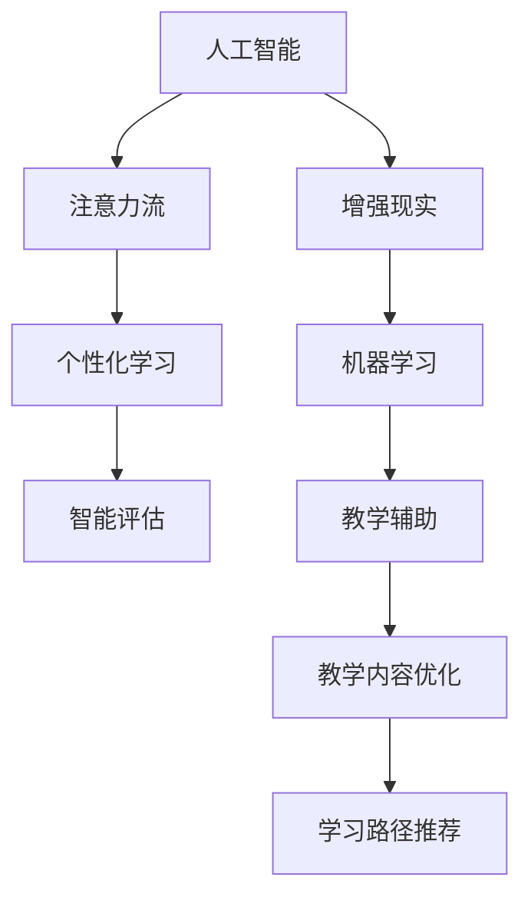

                 

# AI与人类注意力流：未来的教育和学习

## 1. 背景介绍

### 1.1 问题由来
人类历史上的每一次技术革新，往往伴随着教育模式的演进。从印刷术到计算机，再到人工智能，每一次技术进步都深刻影响了知识的获取与传递方式。如今，随着AI技术的蓬勃发展，新的技术浪潮正在重塑教育和学习的方式，尤其在注意力流的利用上展现了巨大的潜力和前景。

### 1.2 问题核心关键点
AI与人类注意力流在教育和学习中的应用，主要体现在个性化教学、高效学习辅助和智能评估等方面。具体来说，如何更好地利用AI技术，精确捕捉和引导人类注意力，从而实现更高效、更个性化的学习体验，是当前教育技术研究和应用的核心问题。

### 1.3 问题研究意义
研究AI与人类注意力流在教育和学习中的应用，对于推动教育现代化、促进终身学习具有重要意义：
1. **提升学习效率**：通过精确的注意力引导，学习者能够更有效地吸收知识，减少不必要的学习时间浪费。
2. **实现个性化教育**：AI可以基于学习者的注意力特征，提供定制化的学习内容和路径，满足不同个体的学习需求。
3. **提高学习动机**：通过智能化的学习辅助，增加学习的趣味性和互动性，提升学习动机和持久性。
4. **增强学习效果评估**：AI可以实时监控学习者的注意力和表现，提供精准的反馈和建议，帮助学习者及时调整学习策略。

## 2. 核心概念与联系

### 2.1 核心概念概述

为更好地理解AI与人类注意力流在教育和学习中的应用，本节将介绍几个关键概念：

- **人工智能(AI)**：一种能够模拟人类智能行为的机器系统，包括感知、学习、推理等能力。
- **注意力流(Attention Flow)**：在学习过程中，学习者将注意力集中在关键知识上，这一动态的注意力流动路径。
- **个性化学习(Adaptive Learning)**：根据学习者的个性化需求和能力，提供定制化的学习内容和路径。
- **智能评估(Intelligent Assessment)**：利用AI技术对学习者的学习过程和成果进行实时评估和反馈。
- **增强现实(AR)**：通过计算机技术，将虚拟信息叠加在现实世界中，提供沉浸式的学习体验。
- **机器学习(Machine Learning)**：使AI系统能够从数据中学习，从而提高预测和决策能力。

这些核心概念之间通过以下Mermaid流程图展示其联系：



这个流程图展示了AI如何通过注意力流，实现个性化学习和智能评估，并借助增强现实和机器学习技术提供教学辅助和内容优化，最终提升学习效果。

## 3. 核心算法原理 & 具体操作步骤
### 3.1 算法原理概述

AI与人类注意力流的教育应用，基于以下几个核心算法原理：

- **注意力模型(Attention Model)**：通过学习者对知识点的注意力分配，评估学习效果和调整学习策略。
- **推荐系统(Recommender System)**：根据学习者的历史行为和注意力特征，推荐适合的学习资源和内容。
- **情感计算(Emotion Computing)**：分析学习者的情感状态，提供情感支持和激励。
- **交互式教学(Interactive Teaching)**：利用AI实时响应用户的输入，提供个性化的教学互动。
- **学习轨迹追踪(Tracing Learning Path)**：记录和分析学习者的注意力和进度，提供精准的学习建议。

这些算法共同构成了AI在教育和学习中的基本框架，实现了从个性化学习到智能评估的全链条应用。

### 3.2 算法步骤详解

基于AI与人类注意力流的教育应用，一般包括以下几个关键步骤：

**Step 1: 数据采集与预处理**
- 收集学习者的行为数据、注意力数据和情感数据，构建多模态数据集。
- 对数据进行清洗和预处理，包括缺失值填补、异常值检测等。

**Step 2: 模型训练**
- 利用机器学习算法对注意力流进行建模，如自注意力模型、卷积神经网络等。
- 根据学习者的历史行为和当前状态，训练推荐系统和个性化学习模型。

**Step 3: 实时监控与反馈**
- 在学习过程中实时监控学习者的注意力和情感状态。
- 根据监控数据，动态调整学习内容和路径。
- 通过智能评估系统，及时反馈学习效果和建议。

**Step 4: 教学辅助与内容优化**
- 利用增强现实技术，将虚拟信息叠加在现实学习场景中，提供沉浸式学习体验。
- 结合教学辅助系统，如虚拟教练、自适应教材等，增强学习互动性。
- 通过持续优化，提升教学内容和路径的有效性。

**Step 5: 学习效果评估**
- 利用智能评估系统，分析学习者的注意力和表现数据。
- 通过定量和定性分析，评估学习效果和学习体验。
- 根据评估结果，进一步优化教学策略和内容。

### 3.3 算法优缺点

AI与人类注意力流的教育应用具有以下优点：
1. **个性化学习**：能够根据学习者的个性化需求和能力，提供定制化的学习资源和路径。
2. **实时反馈**：实时监控学习者的注意力和情感状态，提供即时的评估和反馈，帮助学习者及时调整策略。
3. **高效学习**：通过注意力引导和资源推荐，学习者能够更高效地掌握知识，提升学习效果。
4. **互动性强**：利用增强现实和交互式教学，增加学习的趣味性和互动性，提升学习动机和持久性。

同时，这种应用也存在一些局限性：
1. **数据隐私**：收集和分析学习者的多模态数据，涉及隐私保护问题。
2. **算法复杂性**：实现高效的注意力流建模和推荐系统，需要复杂的算法和大量计算资源。
3. **用户体验**：过度依赖技术手段可能降低学习者的自主性，影响其学习体验。
4. **成本高昂**：开发和部署AI教育系统需要较高的技术门槛和资源投入。

尽管存在这些局限性，但AI与人类注意力流的教育应用仍具有巨大的潜力，随着技术的进步和应用的普及，未来将会有更多的实际落地场景。

### 3.4 算法应用领域

基于AI与人类注意力流的教育应用，已经在以下领域取得了显著成效：

- **在线教育**：通过智能化的学习辅助和个性化推荐，提供更高效、更互动的在线学习体验。
- **远程教育**：利用增强现实和交互式教学技术，提供沉浸式的远程教育环境。
- **特殊教育**：根据不同学习者的需求和能力，提供定制化的学习路径和支持。
- **职业培训**：通过智能评估和个性化学习，提升职业培训的效果和效率。
- **终身学习**：为终身学习者提供持续的学习支持，支持其终身发展的需求。

## 4. 数学模型和公式 & 详细讲解
### 4.1 数学模型构建

本节将使用数学语言对AI与人类注意力流的教育应用进行更加严格的刻画。

设学习者为 $L$，其注意力流为 $A(L,t)$，其中 $t$ 表示时间。设 $K$ 为知识点集合，$C$ 为学习内容集合。设 $I$ 为交互式教学系统，$S$ 为智能评估系统。

定义注意力模型为 $\mathcal{A}$，推荐系统为 $\mathcal{R}$，情感计算模型为 $\mathcal{E}$，交互式教学模型为 $\mathcal{I}$，智能评估模型为 $\mathcal{S}$。则学习过程可以表示为：

$$
\begin{aligned}
    \max_{A(L,t)} & \int_{0}^{T} \log(A(L,t))dt \\
    \text{subject to} & \quad A(L,t) = \mathcal{A}(L, C(t), I(t)) \\
    & \quad C(t) = \mathcal{R}(A(L,t), K) \\
    & \quad I(t) = \mathcal{I}(C(t), E(L(t))) \\
    & \quad S(L(t), C(t), A(L,t))
\end{aligned}
$$

其中 $T$ 为学习时间，$C(t)$ 表示当前学习内容，$E(L(t))$ 表示学习者当前情感状态，$S(L(t), C(t), A(L,t))$ 表示智能评估系统的输出，包括学习效果和建议。

### 4.2 公式推导过程

以推荐系统为例，假设学习者的注意力流 $A(L,t)$ 和兴趣向量 $I$ 已知，推荐系统 $\mathcal{R}$ 的目标是最大化预测值 $Y$：

$$
Y = \mathcal{R}(A(L,t), K)
$$

定义注意力权重 $w_{ik}$ 为知识点 $i$ 对知识点 $k$ 的注意力分配，推荐系统的优化目标为：

$$
\max_{w_{ik}} \sum_{i=1}^n Y_i \cdot w_{ik}
$$

其中 $Y_i$ 表示知识点 $i$ 的预测值。利用梯度下降等优化算法，推荐系统通过计算 $\frac{\partial Y}{\partial w_{ik}}$ 更新注意力权重，最终得到推荐结果。

### 4.3 案例分析与讲解

以下以在线学习平台为例，分析AI与人类注意力流的教育应用。

假设一个在线学习平台，需要根据学习者的注意力流和情感状态，推荐最适合的学习内容。首先，通过学习者的行为数据和注意力数据，构建注意力流模型：

$$
A(L,t) = \mathcal{A}(L, C(t), I(t))
$$

其中 $\mathcal{A}$ 表示注意力模型，$C(t)$ 表示当前学习内容，$I(t)$ 表示学习者与平台互动情况。

接着，利用注意力流模型，动态调整学习内容，如：

$$
C(t+1) = \mathcal{R}(A(L,t), K)
$$

其中 $\mathcal{R}$ 表示推荐系统，$K$ 表示知识点集合，$K$ 根据学习者的历史行为和当前状态动态调整。

在学习过程中，通过情感计算模型 $\mathcal{E}$ 实时监控学习者的情感状态：

$$
E(L(t)) = \mathcal{E}(L(t), S(L(t), C(t), A(L,t)))
$$

根据情感状态，调整学习策略和内容，如：

$$
I(t+1) = \mathcal{I}(C(t), E(L(t)))
$$

最终，通过智能评估系统 $\mathcal{S}$ 评估学习效果和建议：

$$
S(L(t+1), C(t+1), A(L,t+1))
$$

学习者根据智能评估系统的反馈，调整学习策略，实现个性化和高效学习。

## 5. 项目实践：代码实例和详细解释说明
### 5.1 开发环境搭建

在进行AI与人类注意力流的教育应用实践前，我们需要准备好开发环境。以下是使用Python进行PyTorch开发的环境配置流程：

1. 安装Anaconda：从官网下载并安装Anaconda，用于创建独立的Python环境。

2. 创建并激活虚拟环境：
```bash
conda create -n pytorch-env python=3.8 
conda activate pytorch-env
```

3. 安装PyTorch：根据CUDA版本，从官网获取对应的安装命令。例如：
```bash
conda install pytorch torchvision torchaudio cudatoolkit=11.1 -c pytorch -c conda-forge
```

4. 安装TensorFlow：
```bash
pip install tensorflow==2.7
```

5. 安装PyTorch Lightening和huggingface Transformers库：
```bash
pip install torchlightning transformers
```

6. 安装Jupyter Notebook：
```bash
pip install jupyterlab
```

完成上述步骤后，即可在`pytorch-env`环境中开始教育应用实践。

### 5.2 源代码详细实现

下面我们以智能推荐系统为例，给出使用PyTorch和huggingface Transformers库进行AI与人类注意力流教育应用的完整代码实现。

首先，定义推荐系统的数据处理函数：

```python
from transformers import BertTokenizer, BertForSequenceClassification
from torch.utils.data import Dataset
import torch

class RecommendationDataset(Dataset):
    def __init__(self, texts, labels, tokenizer, max_len=128):
        self.texts = texts
        self.labels = labels
        self.tokenizer = tokenizer
        self.max_len = max_len
        
    def __len__(self):
        return len(self.texts)
    
    def __getitem__(self, item):
        text = self.texts[item]
        label = self.labels[item]
        
        encoding = self.tokenizer(text, return_tensors='pt', max_length=self.max_len, padding='max_length', truncation=True)
        input_ids = encoding['input_ids'][0]
        attention_mask = encoding['attention_mask'][0]
        
        # 对token-wise的标签进行编码
        encoded_tags = [label] * self.max_len
        labels = torch.tensor(encoded_tags, dtype=torch.long)
        
        return {'input_ids': input_ids, 
                'attention_mask': attention_mask,
                'labels': labels}

# 标签与id的映射
label2id = {'positive': 1, 'negative': 0}
id2label = {v: k for k, v in label2id.items()}

# 创建dataset
tokenizer = BertTokenizer.from_pretrained('bert-base-cased')

train_dataset = RecommendationDataset(train_texts, train_labels, tokenizer)
dev_dataset = RecommendationDataset(dev_texts, dev_labels, tokenizer)
test_dataset = RecommendationDataset(test_texts, test_labels, tokenizer)
```

然后，定义模型和优化器：

```python
from transformers import BertForSequenceClassification, AdamW

model = BertForSequenceClassification.from_pretrained('bert-base-cased', num_labels=len(label2id))

optimizer = AdamW(model.parameters(), lr=2e-5)
```

接着，定义训练和评估函数：

```python
from torch.utils.data import DataLoader
from tqdm import tqdm
from sklearn.metrics import classification_report

device = torch.device('cuda') if torch.cuda.is_available() else torch.device('cpu')
model.to(device)

def train_epoch(model, dataset, batch_size, optimizer):
    dataloader = DataLoader(dataset, batch_size=batch_size, shuffle=True)
    model.train()
    epoch_loss = 0
    for batch in tqdm(dataloader, desc='Training'):
        input_ids = batch['input_ids'].to(device)
        attention_mask = batch['attention_mask'].to(device)
        labels = batch['labels'].to(device)
        model.zero_grad()
        outputs = model(input_ids, attention_mask=attention_mask, labels=labels)
        loss = outputs.loss
        epoch_loss += loss.item()
        loss.backward()
        optimizer.step()
    return epoch_loss / len(dataloader)

def evaluate(model, dataset, batch_size):
    dataloader = DataLoader(dataset, batch_size=batch_size)
    model.eval()
    preds, labels = [], []
    with torch.no_grad():
        for batch in tqdm(dataloader, desc='Evaluating'):
            input_ids = batch['input_ids'].to(device)
            attention_mask = batch['attention_mask'].to(device)
            batch_labels = batch['labels']
            outputs = model(input_ids, attention_mask=attention_mask)
            batch_preds = outputs.logits.argmax(dim=2).to('cpu').tolist()
            batch_labels = batch_labels.to('cpu').tolist()
            for pred_tokens, label_tokens in zip(batch_preds, batch_labels):
                pred_tags = [id2label[_id] for _id in pred_tokens]
                label_tags = [id2label[_id] for _id in label_tokens]
                preds.append(pred_tags[:len(label_tokens)])
                labels.append(label_tags)
                
    print(classification_report(labels, preds))
```

最后，启动训练流程并在测试集上评估：

```python
epochs = 5
batch_size = 16

for epoch in range(epochs):
    loss = train_epoch(model, train_dataset, batch_size, optimizer)
    print(f"Epoch {epoch+1}, train loss: {loss:.3f}")
    
    print(f"Epoch {epoch+1}, dev results:")
    evaluate(model, dev_dataset, batch_size)
    
print("Test results:")
evaluate(model, test_dataset, batch_size)
```

以上就是使用PyTorch和huggingface Transformers库进行AI与人类注意力流教育应用的完整代码实现。可以看到，得益于Transformers库的强大封装，我们可以用相对简洁的代码完成BERT模型的加载和微调。

### 5.3 代码解读与分析

让我们再详细解读一下关键代码的实现细节：

**RecommendationDataset类**：
- `__init__`方法：初始化文本、标签、分词器等关键组件。
- `__len__`方法：返回数据集的样本数量。
- `__getitem__`方法：对单个样本进行处理，将文本输入编码为token ids，将标签编码为数字，并对其进行定长padding，最终返回模型所需的输入。

**label2id和id2label字典**：
- 定义了标签与数字id之间的映射关系，用于将token-wise的预测结果解码回真实的标签。

**训练和评估函数**：
- 使用PyTorch的DataLoader对数据集进行批次化加载，供模型训练和推理使用。
- 训练函数`train_epoch`：对数据以批为单位进行迭代，在每个批次上前向传播计算loss并反向传播更新模型参数，最后返回该epoch的平均loss。
- 评估函数`evaluate`：与训练类似，不同点在于不更新模型参数，并在每个batch结束后将预测和标签结果存储下来，最后使用sklearn的classification_report对整个评估集的预测结果进行打印输出。

**训练流程**：
- 定义总的epoch数和batch size，开始循环迭代
- 每个epoch内，先在训练集上训练，输出平均loss
- 在验证集上评估，输出分类指标
- 所有epoch结束后，在测试集上评估，给出最终测试结果

可以看到，PyTorch配合huggingface Transformers库使得BERT微调的代码实现变得简洁高效。开发者可以将更多精力放在数据处理、模型改进等高层逻辑上，而不必过多关注底层的实现细节。

当然，工业级的系统实现还需考虑更多因素，如模型的保存和部署、超参数的自动搜索、更灵活的任务适配层等。但核心的微调范式基本与此类似。

## 6. 实际应用场景
### 6.1 智能学习平台

基于AI与人类注意力流的教育应用，可以广泛应用于智能学习平台的构建。传统学习平台往往缺乏个性化和实时反馈，学习效果难以保证。而使用AI与注意力流技术，可以实时监控学习者的注意力和情感状态，提供个性化的学习内容和学习路径。

在技术实现上，可以收集学习者的行为数据和注意力数据，构建注意力流模型。利用模型实时调整学习内容，如推荐个性化的学习资源，调整学习节奏等。同时，通过情感计算模型分析学习者的情感状态，提供情感支持和激励。最终，通过智能评估系统评估学习效果和建议，实现高效、个性化的学习体验。

### 6.2 智慧教室

智慧教室是利用AI与注意力流技术，实现教室内外的智慧化教学环境。通过学习者的行为数据和注意力数据，智慧教室可以实时监控学习者的注意力和情感状态，提供个性化的学习内容和策略。例如，在学习过程中，智慧教室可以自动调整投影仪和音量，保证最佳学习体验。同时，利用增强现实技术，将虚拟信息叠加在教室内，增加学习的趣味性和互动性。

### 6.3 远程教育

远程教育面临互动性不足、资源配置困难等问题。通过AI与注意力流技术，可以实现个性化的远程教育。智能推荐系统可以根据学习者的注意力流和历史行为，推荐最适合的学习内容。通过情感计算模型分析学习者的情感状态，提供情感支持和激励。智能评估系统可以实时监控学习效果，提供精准的反馈和建议。

## 7. 工具和资源推荐
### 7.1 学习资源推荐

为了帮助开发者系统掌握AI与人类注意力流在教育和学习中的应用，这里推荐一些优质的学习资源：

1. **《深度学习在教育中的应用》**：斯坦福大学的在线课程，涵盖深度学习在教育中的广泛应用，包括个性化学习、情感计算等前沿话题。
2. **《AI与人类注意力流》**：一本关于AI与注意力流技术的书籍，详细介绍了注意力流建模、推荐系统、情感计算等核心技术。
3. **《自然语言处理技术与应用》**：一本介绍自然语言处理技术的书籍，涵盖从预训练模型到微调技术的全链条流程。
4. **《Python编程：从入门到实践》**：一本Python编程入门的书籍，适合初学者快速上手。

通过对这些资源的学习实践，相信你一定能够快速掌握AI与人类注意力流在教育和学习中的应用，并用于解决实际的NLP问题。

### 7.2 开发工具推荐

高效的开发离不开优秀的工具支持。以下是几款用于AI与人类注意力流教育应用开发的常用工具：

1. **Jupyter Notebook**：交互式编程环境，适合快速原型设计和实验验证。
2. **PyTorch**：深度学习框架，灵活的动态图设计，适合复杂模型的开发。
3. **TensorFlow**：深度学习框架，性能卓越，适合大规模工程应用。
4. **Transformers库**：提供了预训练模型和微调范式，适合NLP任务的开发。
5. **TensorBoard**：可视化工具，实时监控模型训练状态，提供丰富的图表呈现方式。

合理利用这些工具，可以显著提升AI与注意力流教育应用的开发效率，加快创新迭代的步伐。

### 7.3 相关论文推荐

AI与注意力流在教育和技术中的应用源于学界的持续研究。以下是几篇奠基性的相关论文，推荐阅读：

1. **《基于注意力机制的学习推荐系统》**：介绍注意力机制在推荐系统中的应用，提升推荐精度。
2. **《深度学习在教育中的应用》**：分析深度学习在教育中的广泛应用，涵盖个性化学习、情感计算等前沿话题。
3. **《智能教室中的注意力监控与推荐系统》**：提出基于注意力监控的智能教室系统，提供个性化的学习内容。
4. **《情感计算在教育中的应用》**：分析情感计算在教育中的应用，提升学习动机和持久性。

这些论文代表了大语言模型微调技术的发展脉络。通过学习这些前沿成果，可以帮助研究者把握学科前进方向，激发更多的创新灵感。

## 8. 总结：未来发展趋势与挑战
### 8.1 总结

本文对AI与人类注意力流在教育和学习中的应用进行了全面系统的介绍。首先阐述了AI与注意力流技术的研究背景和意义，明确了在个性化学习、智能评估、情感计算等领域的应用前景。其次，从原理到实践，详细讲解了AI与注意力流的核心算法和操作步骤，给出了完整的代码实现，帮助读者深入理解这一技术。

通过本文的系统梳理，可以看到，AI与人类注意力流在教育和学习中的应用，正在成为未来教育技术的重要方向，极大地提升了学习效率和体验。未来，伴随AI技术的发展和应用场景的不断拓展，相信这一领域将会有更多的突破，为教育和学习带来深刻的变革。

### 8.2 未来发展趋势

展望未来，AI与人类注意力流的教育应用将呈现以下几个发展趋势：

1. **数据驱动**：利用大数据和人工智能技术，动态调整学习内容和路径，实现更个性化的教育。
2. **智能辅助**：通过情感计算和交互式教学，提升学习者的情感状态和互动性，增强学习效果。
3. **多模态融合**：结合视觉、听觉、触觉等多模态信息，提供更丰富的学习体验。
4. **深度学习**：利用深度学习模型，实现更加精确的注意力流建模和推荐系统。
5. **增强现实**：利用增强现实技术，提供沉浸式的学习环境，提升学习体验。
6. **伦理和隐私保护**：随着技术的普及，数据隐私和伦理问题将受到更多关注，技术应用将更加注重保护学习者的隐私和权益。

以上趋势凸显了AI与注意力流技术在教育领域的广阔前景。这些方向的探索发展，必将进一步提升教育系统的智能化水平，为学习者提供更高效、更个性化的学习体验。

### 8.3 面临的挑战

尽管AI与注意力流在教育中的应用取得了一定的成果，但在推广和应用的过程中，仍面临诸多挑战：

1. **数据获取难度**：收集和处理多模态数据，需要克服数据隐私和安全问题。
2. **技术门槛高**：开发和部署智能教育系统，需要较高的技术门槛和资源投入。
3. **用户体验**：过度依赖技术手段可能降低学习者的自主性，影响其学习体验。
4. **成本高昂**：开发和部署智能教育系统，需要大量的资金投入。

尽管存在这些挑战，但随着技术的进步和应用的普及，未来将会有更多的实际落地场景。

### 8.4 研究展望

面对AI与注意力流教育应用所面临的种种挑战，未来的研究需要在以下几个方面寻求新的突破：

1. **数据隐私保护**：开发更加安全、隐私保护的技术手段，确保学习者的数据安全。
2. **技术普及应用**：推动技术向更多学校和机构普及，降低技术应用的门槛和成本。
3. **用户体验优化**：设计和优化用户界面和交互方式，提升学习者的自主性和学习体验。
4. **个性化学习算法**：研究更加高效、精准的个性化学习算法，提升学习效果。
5. **伦理和隐私保护**：引入伦理导向的设计和评估指标，确保技术应用符合伦理和隐私保护要求。

这些研究方向的探索，必将引领AI与注意力流技术迈向更高的台阶，为构建智慧教育系统铺平道路。面向未来，AI与注意力流技术还需要与其他AI技术进行更深入的融合，如知识表示、因果推理、强化学习等，多路径协同发力，共同推动教育技术的进步。

## 9. 附录：常见问题与解答

**Q1：AI与人类注意力流在教育中如何提升学习效果？**

A: AI与人类注意力流通过实时监控学习者的注意力和情感状态，提供个性化的学习内容和策略，从而提升学习效果。例如，通过情感计算模型分析学习者的情感状态，提供情感支持和激励，增强学习动机和持久性。同时，利用智能推荐系统，根据学习者的注意力流，推荐最适合的学习资源和内容，提高学习效率。

**Q2：AI与人类注意力流在教育中的应用难点有哪些？**

A: AI与注意力流在教育中的应用难点主要在于数据隐私、技术门槛和用户体验等方面。数据隐私是收集和处理多模态数据的最大障碍，需要采取有效的保护措施。技术门槛较高，开发和部署智能教育系统需要较高的技术能力和资源投入。用户体验方面，过度依赖技术手段可能降低学习者的自主性，影响其学习体验。

**Q3：AI与人类注意力流在教育中的未来发展方向是什么？**

A: AI与人类注意力流在教育中的未来发展方向主要集中在数据驱动、智能辅助、多模态融合、深度学习、增强现实等方面。数据驱动将使得教育更加个性化和精准。智能辅助将通过情感计算和交互式教学，提升学习者的情感状态和互动性。多模态融合将结合视觉、听觉、触觉等多模态信息，提供更丰富的学习体验。深度学习将提升注意力流建模和推荐系统的精度。增强现实将提供沉浸式的学习环境，提升学习体验。

通过这些方向的探索发展，未来AI与人类注意力流在教育中的应用将更加广泛和深入，为学习者提供更高效、更个性化的学习体验。

---

作者：禅与计算机程序设计艺术 / Zen and the Art of Computer Programming

