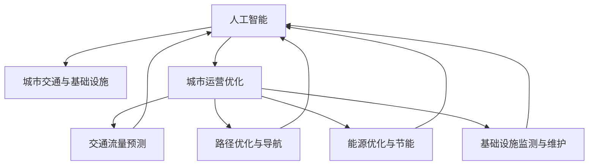

                 

# AI与人类计算：打造可持续发展的城市交通与基础设施规划管理

> 关键词：人工智能,城市交通,基础设施规划,人类计算,可持续发展,城市运营优化

## 1. 背景介绍

### 1.1 问题由来

随着城市化进程的加速，交通拥堵、环境污染、资源浪费等问题日益凸显，成为制约城市可持续发展的关键因素。如何高效利用现有基础设施，优化城市交通管理，实现绿色低碳的城市运营，已成为全球城市管理者共同面临的挑战。

与此同时，人工智能技术在诸多领域的成功应用，提供了新的解决方案。利用AI技术，可以对城市交通和基础设施进行智能化管理，实现交通流量的预测和调控，优化路网布局，提升能源效率，从而推动城市交通的可持续发展。

### 1.2 问题核心关键点

当前，AI在城市交通和基础设施规划管理中的应用，主要集中在以下几个方面：

1. **交通流量预测**：利用AI模型，对城市交通流量进行实时监测和预测，优化交通信号控制，减少交通拥堵。
2. **路径优化与导航**：利用AI算法，实现交通路径的智能规划和导航，提升出行效率。
3. **能源优化与节能**：利用AI技术，对城市能源系统进行智能化管理，优化能源分配，降低能耗。
4. **基础设施监测与维护**：利用AI技术，实时监测城市基础设施状态，提前发现并修复潜在问题，保障城市安全运行。

这些AI应用的核心在于通过“人类计算”（Human-Centric Computing）将人的需求与AI技术相结合，从而实现城市交通和基础设施的高效管理。

## 2. 核心概念与联系

### 2.1 核心概念概述

为更好地理解AI与人类计算在城市交通和基础设施管理中的应用，本节将介绍几个关键概念：

1. **人工智能（AI）**：利用计算机算法和模型，模拟人类智能行为，实现自动化决策和预测的技术。

2. **人类计算（Human-Centric Computing）**：将人类需求和AI技术相结合，通过人的参与和反馈，优化AI系统的决策过程，提升系统的实用性和可接受性。

3. **城市交通与基础设施**：城市的交通网络及其支持系统，包括道路、桥梁、地铁、公交等交通设施，以及供水、供电、供气等基础设施。

4. **城市运营优化**：通过智能化的管理手段，优化城市资源的分配和使用，提升城市运营效率，实现可持续发展。

5. **AI技术应用**：包括机器学习、深度学习、自然语言处理、计算机视觉等技术，在城市交通和基础设施管理中的应用。

这些概念之间的关系通过以下Mermaid流程图进行展示：



这个流程图展示了AI技术与城市交通、基础设施以及城市运营优化之间的紧密联系。AI通过预测、规划和监测等手段，帮助优化城市交通和基础设施，实现可持续发展。

## 3. 核心算法原理 & 具体操作步骤
### 3.1 算法原理概述

基于AI与人类计算的城市交通与基础设施管理，其核心算法原理可以概括为：

1. **数据采集与处理**：利用传感器、监控摄像头等设备，收集城市交通和基础设施的实时数据，如交通流量、路况、能耗等。
2. **AI模型训练与部署**：通过机器学习、深度学习等算法，训练交通流量预测、路径规划、能源优化等模型，并将其部署到城市运营管理系统中。
3. **决策与优化**：通过AI模型对收集到的数据进行分析，做出优化决策，如调整交通信号灯、优化路网布局、调度能源分配等。
4. **人类反馈与调整**：根据城市管理者的反馈，调整AI模型的参数和策略，确保决策的可行性和有效性。

### 3.2 算法步骤详解

基于AI与人类计算的城市交通与基础设施管理，主要包括以下几个关键步骤：

**Step 1: 数据收集与预处理**

- 利用传感器、监控摄像头等设备，收集城市交通和基础设施的实时数据。数据类型包括交通流量、路况、能耗等。
- 对收集到的数据进行清洗和预处理，如去噪、填充缺失值、归一化等，以提高数据质量。

**Step 2: AI模型训练**

- 根据特定任务的需求，选择合适的AI算法和模型结构，如深度神经网络、卷积神经网络等。
- 利用标注数据集，对模型进行训练。标注数据集可以是历史交通数据、能源消耗数据等。
- 在训练过程中，应用正则化、Dropout、Early Stopping等技术，避免过拟合。

**Step 3: 模型部署与应用**

- 将训练好的模型部署到城市运营管理系统中，如交通信号控制系统、能源管理系统等。
- 系统通过传感器等设备实时收集数据，调用AI模型进行分析和决策。
- 根据AI模型的输出，系统自动调整交通信号、优化能源分配等，实现城市运营优化。

**Step 4: 人类反馈与调整**

- 系统提供可视化的数据分析和决策支持，供城市管理者进行审核和调整。
- 根据管理者的反馈，调整AI模型的参数和策略，优化模型性能。

### 3.3 算法优缺点

基于AI与人类计算的城市交通与基础设施管理方法，具有以下优点：

1. **高效性**：AI模型能够处理大量实时数据，快速做出决策，提升城市运营效率。
2. **精准性**：通过AI模型，可以实现对交通流量、能源消耗等关键指标的精准预测和优化。
3. **可扩展性**：AI系统可以适应不同规模和复杂度的城市，具备良好的可扩展性。

同时，该方法也存在以下局限性：

1. **数据依赖性**：AI模型的效果依赖于数据的准确性和完整性，数据收集和处理成本较高。
2. **模型复杂度**：复杂的AI模型需要大量的计算资源和数据支持，模型训练和部署成本较高。
3. **可解释性不足**：AI模型的决策过程通常缺乏可解释性，难以对其内部逻辑进行分析和调试。
4. **伦理和安全问题**：AI系统可能存在偏见、误判等问题，对城市运营和居民安全构成潜在威胁。

尽管存在这些局限性，但就目前而言，基于AI与人类计算的城市管理方法仍然是提高城市运营效率、推动可持续发展的重要手段。未来相关研究的重点在于如何进一步降低数据依赖，提高模型的鲁棒性和可解释性，同时兼顾伦理和安全问题。

### 3.4 算法应用领域

基于AI与人类计算的城市交通与基础设施管理方法，在多个领域得到了广泛应用：

1. **智能交通管理**：通过AI模型对交通流量进行预测和优化，实现交通信号灯的智能调控，减少交通拥堵。
2. **能源管理系统**：利用AI技术，对城市能源系统进行智能化管理，优化能源分配，降低能耗。
3. **基础设施监测与维护**：通过AI模型实时监测基础设施状态，提前发现并修复潜在问题，保障城市安全运行。
4. **智能停车管理**：利用AI技术，实现停车位资源的智能分配和优化，提升停车效率。
5. **智能垃圾管理**：通过AI模型，实现垃圾分类、回收等智能化管理，提高垃圾处理效率。

除了上述这些应用外，AI与人类计算的方法还被创新性地应用于智能安防、智能物流、智能旅游等领域，为城市管理带来了新的创新点。

## 4. 数学模型和公式 & 详细讲解 & 举例说明
### 4.1 数学模型构建

为更好地理解基于AI与人类计算的城市交通与基础设施管理方法，本节将介绍几个关键数学模型及其构建过程。

假设城市交通网络由 $N$ 个节点和 $M$ 条边组成。交通流量的状态用 $x_i$ 表示，其中 $i$ 为节点编号，$x_i$ 表示节点 $i$ 的交通流量。交通流量的变化率用 $u_i$ 表示，表示节点 $i$ 的交通流量的变化速度。

根据交通流动的牛顿-拉普拉斯模型，交通流量的动态方程可以表示为：

$$
\dot{x}_i = -\sum_{j=1}^N \frac{\partial f(x_i, x_j)}{\partial x_j} + \frac{\partial g(x_i)}{\partial x_i} + u_i
$$

其中 $f(x_i, x_j)$ 为节点 $i$ 和 $j$ 之间的交通流量关联函数，$g(x_i)$ 为节点 $i$ 的交通需求函数，$u_i$ 为节点 $i$ 的交通流量的变化速度。

### 4.2 公式推导过程

交通流量动态方程的推导基于牛顿-拉普拉斯模型的假设，即交通流量的变化与节点之间的交通流量关联度和节点的交通需求成正比，与节点自身的交通流量变化速度成反比。通过对交通流量的变化率进行积分，可以得到节点 $i$ 的交通流量 $x_i$ 的动态方程：

$$
x_i(t) = x_i(0) + \int_0^t \left(-\sum_{j=1}^N \frac{\partial f(x_i, x_j)}{\partial x_j} + \frac{\partial g(x_i)}{\partial x_i} + u_i\right) dt
$$

将交通流量动态方程离散化，可以得到：

$$
x_i(t+1) = x_i(t) + \Delta t \left(-\sum_{j=1}^N \frac{\partial f(x_i, x_j)}{\partial x_j} + \frac{\partial g(x_i)}{\partial x_i} + u_i\right)
$$

其中 $\Delta t$ 为时间步长。

通过上述公式，可以根据历史交通流量数据、交通需求函数和交通流量关联函数，预测未来的交通流量变化。

### 4.3 案例分析与讲解

假设某城市有 $N=5$ 个节点，每个节点有 $M=4$ 条边连接，交通流量关联函数和需求函数已知。通过上述公式，可以对交通流量进行预测和优化。

具体实现步骤如下：

1. **数据收集**：收集每个节点在不同时间点的交通流量数据。
2. **模型训练**：利用已有的历史数据，训练交通流量关联函数和需求函数。
3. **预测与优化**：根据预测结果，调整交通信号灯的配时，优化路网布局，实现交通流量的最优分配。

## 5. 项目实践：代码实例和详细解释说明
### 5.1 开发环境搭建

在进行项目实践前，我们需要准备好开发环境。以下是使用Python进行PyTorch开发的环境配置流程：

1. 安装Anaconda：从官网下载并安装Anaconda，用于创建独立的Python环境。

2. 创建并激活虚拟环境：
```bash
conda create -n pytorch-env python=3.8 
conda activate pytorch-env
```

3. 安装PyTorch：根据CUDA版本，从官网获取对应的安装命令。例如：
```bash
conda install pytorch torchvision torchaudio cudatoolkit=11.1 -c pytorch -c conda-forge
```

4. 安装TensorFlow：
```bash
conda install tensorflow
```

5. 安装TensorBoard：
```bash
pip install tensorboard
```

完成上述步骤后，即可在`pytorch-env`环境中开始项目实践。

### 5.2 源代码详细实现

下面我们以交通流量预测为例，给出使用TensorFlow进行模型的PyTorch代码实现。

首先，定义模型结构：

```python
import tensorflow as tf
from tensorflow.keras.layers import Input, Dense, Dropout

input_dim = 5
output_dim = 1

model = tf.keras.Sequential([
    Input(shape=(input_dim,)),
    Dense(32, activation='relu'),
    Dropout(0.5),
    Dense(1, activation='sigmoid')
])
```

接着，定义损失函数和优化器：

```python
model.compile(loss='mse', optimizer=tf.keras.optimizers.Adam(learning_rate=0.001))
```

然后，训练模型：

```python
x_train = # 训练数据
y_train = # 训练标签

model.fit(x_train, y_train, epochs=100, batch_size=32)
```

最后，进行预测：

```python
x_test = # 测试数据
y_pred = model.predict(x_test)
```

以上就是使用TensorFlow进行交通流量预测的完整代码实现。可以看到，TensorFlow提供了灵活的API，使得模型构建、训练和预测过程变得简单高效。

### 5.3 代码解读与分析

让我们再详细解读一下关键代码的实现细节：

**Sequential模型**：
- `Sequential` 模型是TensorFlow中最基本的模型，适合构建串联结构，方便添加多个层。
- `Input` 层定义输入数据的维度。
- `Dense` 层定义全连接层，`relu` 激活函数增强非线性特性。
- `Dropout` 层用于正则化，避免过拟合。
- `Dense` 层输出预测结果，`sigmoid` 激活函数将预测值限制在 $[0,1]$ 范围内。

**编译与训练**：
- 使用 `compile` 方法定义损失函数和优化器，`mse` 表示均方误差损失函数，`Adam` 优化器用于梯度下降。
- `fit` 方法用于训练模型，`epochs` 表示训练轮数，`batch_size` 表示每个批次的大小。

**预测**：
- `predict` 方法用于对测试数据进行预测，返回预测结果。

可以看到，通过TensorFlow，我们可以方便地构建和训练基于AI与人类计算的交通流量预测模型。

## 6. 实际应用场景

### 6.1 智能交通管理

基于AI与人类计算的智能交通管理系统，可以实现交通流量的实时监测和预测，优化交通信号控制，减少交通拥堵。具体应用包括：

1. **交通流量监测**：利用传感器和摄像头，实时监测交通流量和路况，将数据传输到AI系统中进行分析。
2. **交通信号控制**：根据交通流量预测结果，自动调整交通信号灯的配时，实现交通流量的优化调控。
3. **路径规划与导航**：通过AI系统生成最优路径，提供智能导航服务，提升出行效率。

### 6.2 能源管理系统

利用AI与人类计算，可以实现对城市能源系统的智能化管理，优化能源分配，降低能耗。具体应用包括：

1. **能源消耗监测**：实时监测建筑、交通、照明等能源消耗情况，将数据上传到AI系统进行分析。
2. **能源调度与优化**：根据能源消耗预测结果，自动调整能源分配策略，实现节能减排。
3. **智能温控系统**：通过AI系统优化建筑内的温控设备，实现能源的高效利用。

### 6.3 基础设施监测与维护

通过AI与人类计算，可以实现对城市基础设施的实时监测和维护，保障城市安全运行。具体应用包括：

1. **基础设施监测**：利用传感器和摄像头，实时监测桥梁、道路等基础设施的状态，将数据上传到AI系统进行分析。
2. **故障预警与修复**：根据监测数据，预测潜在故障，提前进行维护和修复。
3. **智能养护系统**：通过AI系统优化养护计划，提高基础设施的维护效率。

### 6.4 未来应用展望

随着AI与人类计算技术的不断发展，未来在城市交通与基础设施管理中的应用将更加广泛。具体展望如下：

1. **智能化交通管理**：实现交通流量的实时监测和预测，优化交通信号控制，减少交通拥堵。
2. **智慧能源系统**：通过AI系统优化能源分配，降低能耗，提升能源利用效率。
3. **智能基础设施管理**：实时监测和维护基础设施，保障城市安全运行。
4. **多模态信息融合**：结合交通、能源、环境等多种数据，实现综合决策和优化。
5. **开放平台与接口**：通过开放API，实现各系统间的互联互通，提供一站式城市管理解决方案。

## 7. 工具和资源推荐

### 7.1 学习资源推荐

为了帮助开发者系统掌握AI与人类计算在城市交通与基础设施管理中的应用，这里推荐一些优质的学习资源：

1. **Coursera《深度学习与城市交通管理》课程**：由斯坦福大学开设的深度学习课程，涵盖交通流量预测、路径规划等实际问题，适合初学者和进阶学习者。
2. **《智能城市交通管理》书籍**：全面介绍智能交通管理的原理、技术和应用，适合深入了解交通系统的工程实践。
3. **《城市能源系统管理》书籍**：介绍城市能源系统的智能化管理方法，涵盖能源监测、优化、调度等多个方面。
4. **TensorFlow官方文档**：TensorFlow的官方文档提供了丰富的教程和案例，适合学习TensorFlow的基本使用和高级特性。
5. **GitHub上的智能城市项目**：GitHub上有许多智能城市项目，包括交通流量预测、路径优化、能源管理等，通过学习这些开源项目，可以快速上手实际应用。

通过对这些资源的学习实践，相信你一定能够快速掌握AI与人类计算在城市交通与基础设施管理中的应用，并用于解决实际的NLP问题。

### 7.2 开发工具推荐

高效的开发离不开优秀的工具支持。以下是几款用于AI与人类计算的城市交通与基础设施管理开发的常用工具：

1. **Jupyter Notebook**：免费的Jupyter Notebook环境，方便编写和运行Python代码，支持代码高亮和自动补全，适合研究和开发。
2. **Google Colab**：谷歌提供的免费在线Jupyter Notebook环境，支持GPU计算，方便调试和运行大规模模型。
3. **TensorFlow**：由谷歌主导开发的开源深度学习框架，生产部署方便，适合大规模工程应用。
4. **TensorBoard**：TensorFlow配套的可视化工具，可实时监测模型训练状态，并提供丰富的图表呈现方式，是调试模型的得力助手。
5. **PyTorch**：基于Python的开源深度学习框架，灵活动态的计算图，适合快速迭代研究。

合理利用这些工具，可以显著提升AI与人类计算在城市交通与基础设施管理任务中的开发效率，加快创新迭代的步伐。

### 7.3 相关论文推荐

AI与人类计算在城市交通与基础设施管理中的应用，源于学界的持续研究。以下是几篇奠基性的相关论文，推荐阅读：

1. **《智能交通系统：理论与实践》**：介绍智能交通系统的基本原理和应用案例，涵盖交通流量预测、路径优化等多个方面。
2. **《智慧能源系统：基于AI的能源管理》**：介绍智慧能源系统的基本原理和应用案例，涵盖能源监测、优化、调度等多个方面。
3. **《城市基础设施智能管理》**：介绍城市基础设施智能管理的原理和应用案例，涵盖基础设施监测、故障预警等多个方面。

这些论文代表了大语言模型微调技术的发展脉络。通过学习这些前沿成果，可以帮助研究者把握学科前进方向，激发更多的创新灵感。

## 8. 总结：未来发展趋势与挑战

### 8.1 总结

本文对基于AI与人类计算的城市交通与基础设施管理方法进行了全面系统的介绍。首先阐述了AI与人类计算在城市交通与基础设施管理中的重要性，明确了在提升城市运营效率、推动可持续发展方面的独特价值。其次，从原理到实践，详细讲解了AI与人类计算的数学模型和操作步骤，给出了项目实践的完整代码实现。同时，本文还广泛探讨了AI与人类计算方法在智能交通管理、能源管理、基础设施监测等多个领域的应用前景，展示了其巨大的潜力。

通过本文的系统梳理，可以看到，基于AI与人类计算的城市交通与基础设施管理方法已经成为提升城市运营效率、推动可持续发展的重要手段。AI与人类计算技术的不断演进，必将为城市交通与基础设施管理带来新的突破。

### 8.2 未来发展趋势

展望未来，AI与人类计算在城市交通与基础设施管理中的应用将呈现以下几个发展趋势：

1. **智能化与自动化**：通过AI系统实现城市交通与基础设施管理的自动化，减少人工干预，提升管理效率。
2. **实时性与动态性**：实现实时数据监测与分析，动态调整策略，满足城市运营的需求。
3. **跨模态融合**：结合交通、能源、环境等多种数据，实现综合决策和优化。
4. **可解释性与透明性**：提高AI系统的可解释性和透明性，确保决策的合理性和公平性。
5. **开放性与合作**：通过开放API，实现各系统间的互联互通，推动城市管理的协同合作。

以上趋势凸显了AI与人类计算技术的广阔前景。这些方向的探索发展，必将进一步提升城市交通与基础设施管理的智能化水平，为城市的可持续发展提供新的动力。

### 8.3 面临的挑战

尽管AI与人类计算在城市交通与基础设施管理中的应用已经取得了显著进展，但在迈向更加智能化、普适化应用的过程中，仍面临诸多挑战：

1. **数据收集与处理成本高**：大规模数据的收集和处理成本较高，需要投入大量人力和资源。
2. **模型复杂度高**：复杂的AI模型需要大量的计算资源和数据支持，模型训练和部署成本较高。
3. **可解释性不足**：AI系统的决策过程通常缺乏可解释性，难以对其内部逻辑进行分析和调试。
4. **伦理与安全问题**：AI系统可能存在偏见、误判等问题，对城市运营和居民安全构成潜在威胁。

尽管存在这些挑战，但通过持续的研究和探索，相信AI与人类计算在城市交通与基础设施管理中的应用将不断突破，推动城市交通与基础设施管理的智能化和可持续发展。

### 8.4 未来突破

面对AI与人类计算在城市交通与基础设施管理中的应用所面临的种种挑战，未来的研究需要在以下几个方面寻求新的突破：

1. **数据融合与共享**：利用大数据技术，实现数据的有效融合与共享，降低数据收集与处理的成本。
2. **模型简化与优化**：开发更加简洁高效的模型结构，优化算法，降低计算资源消耗。
3. **可解释性与透明性**：引入可解释性技术，增强AI系统的透明性和可解释性，确保决策的合理性。
4. **伦理与安全保障**：建立AI系统的伦理与安全保障机制，避免偏见与误判，确保系统的公平性和安全性。
5. **多模态信息融合**：结合交通、能源、环境等多种数据，实现综合决策和优化。

这些研究方向的探索，必将引领AI与人类计算在城市交通与基础设施管理中的应用迈向更高的台阶，为构建智能、可持续的城市交通系统提供新的突破点。

## 9. 附录：常见问题与解答

**Q1：AI与人类计算在城市交通与基础设施管理中的应用是否适用于所有城市？**

A: AI与人类计算在城市交通与基础设施管理中的应用，适用于具有一定数据收集和处理能力的城市。对于数据资源匮乏的城市，需要先建立数据收集和处理体系，再进行应用部署。

**Q2：AI与人类计算的应用对城市管理者的技术要求有哪些？**

A: AI与人类计算的应用对城市管理者提出了更高的技术要求。城市管理者需要具备数据分析、模型构建和优化等技术能力，才能有效使用AI系统进行城市管理。此外，管理者还需要具备一定的伦理和安全意识，确保AI系统的公平性和安全性。

**Q3：AI与人类计算在城市交通与基础设施管理中的应用面临哪些资源瓶颈？**

A: AI与人类计算在城市交通与基础设施管理中的应用，面临数据收集、模型训练和部署等资源瓶颈。这些资源瓶颈需要通过技术创新和优化来解决，如数据融合、模型简化、模型部署优化等。

**Q4：如何确保AI与人类计算系统的公平性和安全性？**

A: 确保AI与人类计算系统的公平性和安全性，需要从数据收集、模型训练和应用部署等多个环节入手。具体措施包括：
1. 数据采集的公平性：确保数据来源的多样性和代表性，避免数据偏见。
2. 模型训练的公平性：引入公平性指标，确保模型在各类数据上的性能。
3. 应用部署的透明性：建立透明的决策机制，确保决策过程的可解释性和透明性。
4. 系统安全性的保障：引入安全保障机制，防止系统被恶意攻击和篡改。

这些措施的实施，将有助于构建公平、安全、可靠的AI与人类计算系统，保障城市管理的公正性和安全性。

---

作者：禅与计算机程序设计艺术 / Zen and the Art of Computer Programming

