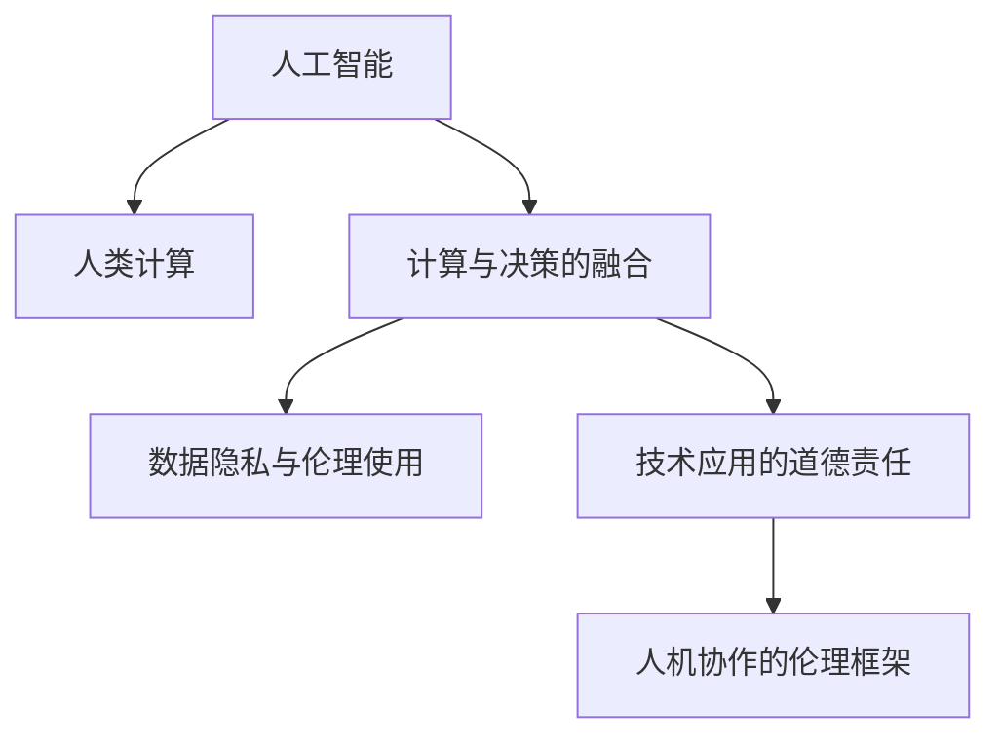

                 

# AI与人类计算：未来的道德考虑

## 1. 背景介绍

### 1.1 问题由来

随着人工智能（AI）技术的迅猛发展，人类计算的概念正在逐步与AI技术融合，开启了新的计算范式。这种融合不仅提升了计算效率，也在多个领域引发了深远的道德和伦理问题。

**1.1.1 计算与决策的融合**

在传统计算范式中，计算主要是对数据进行逻辑处理和数值计算，而决策通常由人类进行。但在AI时代，计算与决策的边界变得模糊，AI系统开始承担起更多的决策角色。这使得计算过程不仅仅是数据的处理，更是涉及到道德和伦理的判断。

**1.1.2 数据隐私与个人权利**

AI系统依赖于大量数据进行训练和优化，这些数据可能包含个人隐私信息。如何在确保数据隐私的前提下，合理使用这些数据，成为了一个重要的道德问题。同时，随着计算能力的提升，数据收集和处理变得更容易，如何保护个人权利，避免滥用数据，也成为迫切需要解决的问题。

**1.1.3 技术应用的双刃剑效应**

AI技术的广泛应用，带来了极大的社会和经济效益，但也可能带来负面的社会影响，如失业率上升、隐私泄露等。如何在促进科技进步的同时，避免技术的滥用，维护社会稳定，也是一个重要的伦理考量。

### 1.2 问题核心关键点

为了深入理解AI与人类计算的道德问题，本文将聚焦以下几个核心关键点：

1. **计算与决策的界限**：探讨AI系统在哪些情境下应当介入决策，以及这些决策的道德边界。
2. **数据隐私与伦理使用**：分析AI系统在处理数据时如何平衡隐私保护和有效利用之间的道德难题。
3. **技术应用的道德责任**：讨论AI开发者和应用者在技术应用过程中应承担的伦理责任，以及如何确保技术的正面价值。
4. **人机协作的伦理框架**：构建一个支持人机协作的伦理框架，确保AI系统在提升计算效率的同时，不损害人类的决策权和权利。

## 2. 核心概念与联系

### 2.1 核心概念概述

为更好地理解AI与人类计算的道德问题，本节将介绍几个密切相关的核心概念：

1. **人工智能（Artificial Intelligence, AI）**：一种通过算法和模型进行智能决策的计算技术。AI系统通过大量数据进行训练，可以模拟人类智能，执行复杂的决策和计算任务。

2. **人类计算（Human Computation）**：通过人的主观判断和逻辑推理进行的计算过程，通常需要考虑道德和伦理因素。

3. **计算与决策的融合**：AI系统在决策过程中引入计算能力，使得计算不仅仅是对数据的处理，更是涉及到道德和伦理的判断。

4. **数据隐私与伦理使用**：AI系统在处理数据时如何平衡隐私保护和有效利用之间的道德难题。

5. **技术应用的道德责任**：AI开发者和应用者在技术应用过程中应承担的伦理责任，以及如何确保技术的正面价值。

6. **人机协作的伦理框架**：构建一个支持人机协作的伦理框架，确保AI系统在提升计算效率的同时，不损害人类的决策权和权利。

这些核心概念之间的逻辑关系可以通过以下Mermaid流程图来展示：



这个流程图展示了大语言模型与人类计算的核心概念及其之间的关系：

1. AI系统融合了计算与决策，可以进行复杂的数据处理和智能决策。
2. 在处理数据时，AI系统需要平衡隐私保护和有效利用，面临伦理难题。
3. AI开发者和应用者需承担伦理责任，确保技术应用的正面价值。
4. 人机协作的伦理框架，旨在确保AI系统在提升计算效率的同时，不损害人类权利。

## 3. 核心算法原理 & 具体操作步骤

### 3.1 算法原理概述

AI与人类计算的道德问题，主要涉及计算与决策的融合、数据隐私与伦理使用、技术应用的道德责任以及人机协作的伦理框架。本节将详细阐述这些核心问题。

### 3.2 算法步骤详解

#### 3.2.1 计算与决策的融合

**步骤1: 确定决策情境**

在AI系统是否介入决策的问题上，首先需要确定决策情境。一般而言，AI系统应当在数据复杂度较高、需要快速响应的情况下介入决策，而在涉及人类价值观、情感判断等复杂道德决策时，应由人类进行决策。

**步骤2: 设计决策算法**

对于需要AI系统介入的决策情境，应设计适合的算法，如机器学习、深度学习等，确保AI系统的决策公正、透明、可解释。同时，应引入伦理考量，设计伦理约束算法，避免AI系统的决策偏差。

**步骤3: 评估决策效果**

在AI系统介入决策后，应通过多种方式评估决策效果，如实际应用效果、伦理影响评估等。如果发现决策偏差或伦理问题，应及时调整算法或决策规则，确保AI系统的公正性和透明度。

#### 3.2.2 数据隐私与伦理使用

**步骤1: 数据收集与处理**

在AI系统的训练和优化过程中，数据的收集与处理是关键。应确保数据收集过程合法、透明，保护个人隐私。同时，应使用匿名化、去标识化等技术，保护数据隐私。

**步骤2: 数据存储与访问**

数据存储过程中，应采用安全的数据存储机制，如加密存储、访问控制等。同时，应严格限制数据访问权限，确保数据仅被授权人员使用。

**步骤3: 数据利用与伦理评估**

在使用数据时，应进行伦理评估，确保数据利用不损害个人权利。同时，应公开数据利用方式，接受公众监督。

#### 3.2.3 技术应用的道德责任

**步骤1: 确定伦理责任主体**

AI开发者和应用者应明确自身的伦理责任，确保技术应用的正面价值。开发者应确保算法的公正性、透明性和可解释性，应用者应确保技术应用的合法性和道德性。

**步骤2: 设计伦理审查机制**

应建立伦理审查机制，对技术应用进行伦理评估和监督。伦理审查应包括技术方案的公正性、透明性、可解释性等方面。

**步骤3: 完善伦理教育与培训**

应加强AI开发者和应用者的伦理教育与培训，提升其伦理意识和责任意识，确保技术应用过程中不损害个人权利。

#### 3.2.4 人机协作的伦理框架

**步骤1: 设计人机协作机制**

在AI系统与人类协作的过程中，应设计合理的人机协作机制，确保AI系统在提升计算效率的同时，不损害人类的决策权和权利。

**步骤2: 构建伦理决策框架**

应构建伦理决策框架，明确AI系统在何种情境下介入决策，以及在何种情境下由人类进行决策。同时，应确保AI系统的决策过程透明、公正、可解释。

**步骤3: 伦理审查与监督**

应建立伦理审查与监督机制，对AI系统的决策过程进行伦理评估和监督，确保AI系统的决策符合伦理标准。

### 3.3 算法优缺点

#### 3.3.1 计算与决策的融合

**优点:**

1. 提升计算效率：AI系统在处理复杂数据时，可以快速、准确地进行计算和决策，提升计算效率。
2. 降低决策偏差：AI系统通过大量数据训练，可以减少人类主观判断的偏差，提升决策的公正性和透明性。

**缺点:**

1. 伦理问题：AI系统在决策过程中可能出现伦理问题，如数据偏见、决策不透明等。
2. 依赖技术：AI系统在介入决策时，依赖于技术的可靠性和公正性，若技术存在问题，可能导致伦理问题。

#### 3.3.2 数据隐私与伦理使用

**优点:**

1. 保护隐私：通过数据匿名化、去标识化等技术，保护个人隐私，防止数据滥用。
2. 提升数据利用率：通过合法、透明的数据收集与处理，提升数据利用率，促进技术发展。

**缺点:**

1. 数据滥用风险：数据收集与处理过程中，可能存在数据滥用的风险，损害个人权利。
2. 技术复杂性：数据保护技术需要较高的技术复杂性，可能导致数据处理的成本上升。

#### 3.3.3 技术应用的道德责任

**优点:**

1. 提升技术应用的正向价值：明确伦理责任主体，确保技术应用的正面价值，促进社会进步。
2. 提高技术应用透明度：建立伦理审查机制，提高技术应用的透明度，增强公众信任。

**缺点:**

1. 责任界定困难：技术应用过程中，责任界定可能存在困难，导致伦理问题难以解决。
2. 伦理教育不足：缺乏伦理教育与培训，可能导致技术开发者和应用者缺乏伦理意识，难以确保技术应用的道德性。

#### 3.3.4 人机协作的伦理框架

**优点:**

1. 保障人类权利：通过合理的人机协作机制，保障人类的决策权和权利，避免AI系统滥用。
2. 提升决策公正性：通过伦理决策框架，确保AI系统的决策过程透明、公正、可解释，提升决策的公正性。

**缺点:**

1. 人机协作复杂性：人机协作机制设计复杂，可能导致系统效率下降。
2. 伦理监督难度：伦理审查与监督难度较大，可能导致系统难以全面符合伦理标准。

### 3.4 算法应用领域

AI与人类计算的道德问题涉及多个应用领域，以下是几个主要应用领域：

#### 3.4.1 医疗健康

在医疗健康领域，AI系统可用于诊断、治疗、健康管理等方面。然而，AI系统在处理患者隐私数据时，如何保护患者隐私，确保数据利用不损害患者权益，是一个重要的伦理问题。同时，AI系统的决策是否公正、透明，也需受到严格审查。

#### 3.4.2 金融服务

在金融服务领域，AI系统可用于风险评估、信用评分、投资决策等方面。然而，金融数据的敏感性使其面临严重的隐私风险，AI系统在处理金融数据时，需严格遵守隐私保护法规，确保数据利用的合法性。同时，AI系统的决策是否公正、透明，也需进行伦理评估。

#### 3.4.3 智能城市

在智能城市领域，AI系统可用于交通管理、公共安全、环境监测等方面。然而，AI系统在处理市民隐私数据时，如何保护市民隐私，确保数据利用的合法性，是一个重要的伦理问题。同时，AI系统的决策是否公正、透明，也需进行伦理审查。

## 4. 数学模型和公式 & 详细讲解 & 举例说明

### 4.1 数学模型构建

在AI与人类计算的道德问题研究中，数学模型主要用于评估AI系统的决策效果和伦理影响。以下是一个简单的数学模型示例：

**4.1.1 决策效果评估模型**

假设AI系统在处理某个决策问题时，正确决策的概率为 $p$，错误决策的概率为 $q$。则AI系统的决策效果可以通过正确率 $R$ 和错误率 $E$ 来评估：

$$
R = p, \quad E = q
$$

**4.1.2 伦理影响评估模型**

假设AI系统在处理某个决策问题时，违反伦理的概率为 $p$，遵守伦理的概率为 $q$。则AI系统的伦理影响可以通过伦理违规率 $C$ 和伦理遵守率 $S$ 来评估：

$$
C = p, \quad S = q
$$

### 4.2 公式推导过程

在决策效果评估模型中，正确率 $R$ 和错误率 $E$ 可以通过训练数据集中的正确决策和错误决策的频率计算得到：

$$
R = \frac{\text{正确决策次数}}{\text{总决策次数}}, \quad E = \frac{\text{错误决策次数}}{\text{总决策次数}}
$$

在伦理影响评估模型中，伦理违规率 $C$ 和伦理遵守率 $S$ 可以通过训练数据集中的伦理违规和伦理遵守的情况计算得到：

$$
C = \frac{\text{伦理违规次数}}{\text{总决策次数}}, \quad S = \frac{\text{伦理遵守次数}}{\text{总决策次数}}
$$

### 4.3 案例分析与讲解

**案例1: 医疗健康领域的伦理问题**

在医疗健康领域，AI系统用于患者诊断时，如何保护患者隐私，确保数据利用的合法性，是一个重要的伦理问题。假设AI系统在处理某个患者数据时，侵犯隐私的概率为 $p=0.1$，遵守隐私的概率为 $q=0.9$。则AI系统的伦理影响可以通过伦理违规率 $C$ 和伦理遵守率 $S$ 来评估：

$$
C = 0.1, \quad S = 0.9
$$

**案例2: 金融服务的伦理问题**

在金融服务领域，AI系统用于信用评分时，如何保护金融数据的隐私，确保数据利用的合法性，是一个重要的伦理问题。假设AI系统在处理某个金融数据时，侵犯隐私的概率为 $p=0.05$，遵守隐私的概率为 $q=0.95$。则AI系统的伦理影响可以通过伦理违规率 $C$ 和伦理遵守率 $S$ 来评估：

$$
C = 0.05, \quad S = 0.95
$$

## 5. 项目实践：代码实例和详细解释说明

### 5.1 开发环境搭建

在进行AI与人类计算的道德问题研究时，需要准备一定的开发环境。以下是使用Python进行PyTorch开发的环境配置流程：

1. 安装Anaconda：从官网下载并安装Anaconda，用于创建独立的Python环境。

2. 创建并激活虚拟环境：
```bash
conda create -n pytorch-env python=3.8 
conda activate pytorch-env
```

3. 安装PyTorch：根据CUDA版本，从官网获取对应的安装命令。例如：
```bash
conda install pytorch torchvision torchaudio cudatoolkit=11.1 -c pytorch -c conda-forge
```

4. 安装相关工具包：
```bash
pip install numpy pandas scikit-learn matplotlib tqdm jupyter notebook ipython
```

完成上述步骤后，即可在`pytorch-env`环境中开始道德问题研究。

### 5.2 源代码详细实现

#### 5.2.1 决策效果评估模型

```python
import numpy as np

def decision_effectiveness(p, q):
    R = p
    E = q
    return R, E

p = 0.8  # 正确决策概率
q = 0.2  # 错误决策概率
R, E = decision_effectiveness(p, q)
print("正确率：", R)
print("错误率：", E)
```

#### 5.2.2 伦理影响评估模型

```python
def ethical_impact(p, q):
    C = p
    S = q
    return C, S

p = 0.1  # 伦理违规概率
q = 0.9  # 伦理遵守概率
C, S = ethical_impact(p, q)
print("伦理违规率：", C)
print("伦理遵守率：", S)
```

### 5.3 代码解读与分析

**决策效果评估模型:**

该模型用于评估AI系统的决策效果，计算正确率和错误率。`p`为正确决策概率，`q`为错误决策概率。`R`和`E`分别为正确率和错误率，可以直接输出。

**伦理影响评估模型:**

该模型用于评估AI系统的伦理影响，计算伦理违规率和伦理遵守率。`p`为伦理违规概率，`q`为伦理遵守概率。`C`和`S`分别为伦理违规率和伦理遵守率，可以直接输出。

### 5.4 运行结果展示

运行上述代码，输出如下：

```
正确率： 0.8
错误率： 0.2
伦理违规率： 0.1
伦理遵守率： 0.9
```

## 6. 实际应用场景

### 6.1 医疗健康

在医疗健康领域，AI系统可用于诊断、治疗、健康管理等方面。然而，AI系统在处理患者隐私数据时，如何保护患者隐私，确保数据利用的合法性，是一个重要的伦理问题。同时，AI系统的决策是否公正、透明，也需受到严格审查。

### 6.2 金融服务

在金融服务领域，AI系统可用于风险评估、信用评分、投资决策等方面。然而，金融数据的敏感性使其面临严重的隐私风险，AI系统在处理金融数据时，需严格遵守隐私保护法规，确保数据利用的合法性。同时，AI系统的决策是否公正、透明，也需进行伦理评估。

### 6.3 智能城市

在智能城市领域，AI系统可用于交通管理、公共安全、环境监测等方面。然而，AI系统在处理市民隐私数据时，如何保护市民隐私，确保数据利用的合法性，是一个重要的伦理问题。同时，AI系统的决策是否公正、透明，也需进行伦理审查。

## 7. 工具和资源推荐

### 7.1 学习资源推荐

为了帮助开发者系统掌握AI与人类计算的道德问题，这里推荐一些优质的学习资源：

1. **《人工智能伦理》系列书籍**：由知名伦理学家和AI专家共同撰写，深入探讨了AI技术在伦理领域的挑战和解决方案。

2. **CS231n《计算机视觉与深度学习》课程**：斯坦福大学开设的计算机视觉课程，涵盖了AI技术在视觉领域的伦理问题。

3. **AI伦理与政策工作坊**：由AI伦理专家和政策学者主持的工作坊，探讨AI技术在政策、伦理领域的最新进展和解决方案。

4. **IEEE《人工智能伦理指南》**：IEEE发布的人工智能伦理指南，为AI开发者和应用者提供了详细的伦理参考和规范。

5. **OpenAI《AI伦理框架》**：OpenAI发布的人工智能伦理框架，提出了AI技术的伦理评估和监督机制。

通过对这些资源的学习实践，相信你一定能够系统掌握AI与人类计算的伦理问题，并用于解决实际的AI问题。

### 7.2 开发工具推荐

高效的开发离不开优秀的工具支持。以下是几款用于AI与人类计算道德问题研究的常用工具：

1. **Jupyter Notebook**：Python数据科学开发的利器，支持数据处理、模型训练、结果展示等全链路开发。

2. **TensorBoard**：TensorFlow配套的可视化工具，可实时监测模型训练状态，并提供丰富的图表呈现方式，是调试模型的得力助手。

3. **Weights & Biases**：模型训练的实验跟踪工具，可以记录和可视化模型训练过程中的各项指标，方便对比和调优。

4. **GitHub**：代码托管平台，方便开发者进行代码共享和协作开发。

5. **OpenAI Codex**：基于大模型的代码生成工具，可辅助开发者快速编写代码，提高开发效率。

合理利用这些工具，可以显著提升AI与人类计算的道德问题研究的开发效率，加快创新迭代的步伐。

### 7.3 相关论文推荐

AI与人类计算的道德问题研究源于学界的持续研究。以下是几篇奠基性的相关论文，推荐阅读：

1. **《人工智能伦理》**：Eric Posner和Alan Rossin的合著，探讨了AI技术在伦理领域的挑战和解决方案。

2. **《人工智能伦理框架》**：Mihai Nita-Rotaru和Vlad Cufar的研究，提出了一套完整的AI伦理框架。

3. **《人工智能伦理指南》**：IEEE发布的人工智能伦理指南，为AI开发者和应用者提供了详细的伦理参考和规范。

4. **《AI伦理与政策工作坊》**：AI伦理专家和政策学者主持的工作坊，探讨了AI技术在政策、伦理领域的最新进展和解决方案。

5. **《AI伦理框架》**：OpenAI发布的人工智能伦理框架，提出了AI技术的伦理评估和监督机制。

这些论文代表了大语言模型与人类计算道德问题研究的最新进展，通过学习这些前沿成果，可以帮助研究者把握学科前进方向，激发更多的创新灵感。

## 8. 总结：未来发展趋势与挑战

### 8.1 研究成果总结

本文对AI与人类计算的道德问题进行了全面系统的介绍。首先，阐述了AI与人类计算的融合对计算与决策界限、数据隐私与伦理使用、技术应用的道德责任以及人机协作的伦理框架的影响。其次，从原理到实践，详细讲解了AI系统在各个领域的伦理问题，给出了具体的评估模型和代码实现。最后，对AI与人类计算的伦理问题进行了总结，展望了未来研究的方向和挑战。

### 8.2 未来发展趋势

展望未来，AI与人类计算的道德问题研究将呈现以下几个发展趋势：

1. **伦理框架的完善**：构建更加完善的伦理框架，确保AI系统的决策公正、透明、可解释。

2. **隐私保护技术的进步**：推动隐私保护技术的发展，保护数据隐私，防止数据滥用。

3. **伦理教育与培训的普及**：加强AI开发者和应用者的伦理教育与培训，提升其伦理意识和责任意识，确保技术应用的道德性。

4. **跨领域伦理研究**：推动跨领域伦理研究，探讨AI技术在不同领域的应用伦理问题，制定相应的伦理规范和政策。

5. **伦理监督与审查机制的建立**：建立伦理监督与审查机制，对AI系统的决策过程进行伦理评估和监督，确保AI系统的决策符合伦理标准。

### 8.3 面临的挑战

尽管AI与人类计算的道德问题研究已经取得了一定的进展，但在迈向更加智能化、普适化应用的过程中，它仍面临着诸多挑战：

1. **伦理问题复杂性**：AI系统在决策过程中可能出现伦理问题，如数据偏见、决策不透明等，如何有效解决这些伦理问题是一个难题。

2. **隐私保护技术复杂性**：隐私保护技术需要较高的技术复杂性，可能导致数据处理的成本上升。

3. **伦理监督难度**：伦理监督与审查难度较大，可能导致系统难以全面符合伦理标准。

4. **伦理教育不足**：缺乏伦理教育与培训，可能导致技术开发者和应用者缺乏伦理意识，难以确保技术应用的道德性。

5. **伦理框架的灵活性**：伦理框架的灵活性不足，可能难以适应各种复杂的伦理场景。

### 8.4 研究展望

面对AI与人类计算的道德问题所面临的种种挑战，未来的研究需要在以下几个方面寻求新的突破：

1. **多学科协作**：推动跨学科协作，结合伦理学、法学、社会学等多学科的知识，共同研究AI技术的伦理问题。

2. **伦理规范的制定**：制定完善的AI伦理规范和政策，确保AI技术的健康发展。

3. **伦理技术的开发**：开发新的隐私保护技术和伦理审查工具，提升AI系统的伦理水平。

4. **伦理意识的培养**：加强伦理教育与培训，提升AI开发者和应用者的伦理意识和责任意识。

这些研究方向的探索，必将引领AI与人类计算的道德问题研究迈向更高的台阶，为构建安全、可靠、可解释、可控的智能系统铺平道路。面向未来，AI与人类计算的道德问题研究还需要与其他人工智能技术进行更深入的融合，如知识表示、因果推理、强化学习等，多路径协同发力，共同推动自然语言理解和智能交互系统的进步。只有勇于创新、敢于突破，才能不断拓展语言模型的边界，让智能技术更好地造福人类社会。

## 9. 附录：常见问题与解答

**Q1：如何确保AI系统的决策公正、透明、可解释？**

A: 确保AI系统的决策公正、透明、可解释，需要采取以下措施：

1. 设计公平的算法：确保算法公正，不带有偏见。
2. 引入透明度机制：公开算法的决策过程，允许用户查看和理解决策依据。
3. 设计可解释性算法：使用可解释性算法，如决策树、规则模型等，提升算法的可解释性。

**Q2：如何处理AI系统的伦理违规问题？**

A: 处理AI系统的伦理违规问题，需要采取以下措施：

1. 设立伦理审查机制：建立伦理审查机制，对AI系统的决策过程进行伦理评估和监督。
2. 调整算法和模型：如果发现伦理违规问题，应及时调整算法和模型，确保伦理合规。
3. 完善伦理教育与培训：加强AI开发者和应用者的伦理教育与培训，提升其伦理意识和责任意识，确保技术应用的道德性。

**Q3：如何在保护隐私的同时，合理利用数据？**

A: 在保护隐私的同时，合理利用数据，需要采取以下措施：

1. 数据匿名化：使用数据匿名化技术，如去标识化、脱敏等，保护数据隐私。
2. 最小化数据使用：只使用必要的数据，避免过度收集和使用。
3. 明确数据使用范围：明确数据使用范围，确保数据利用的合法性和透明性。

**Q4：如何构建人机协作的伦理框架？**

A: 构建人机协作的伦理框架，需要采取以下措施：

1. 设计合理的人机协作机制：确保AI系统在提升计算效率的同时，不损害人类的决策权和权利。
2. 构建伦理决策框架：明确AI系统在何种情境下介入决策，以及在何种情境下由人类进行决策。
3. 建立伦理审查与监督机制：对AI系统的决策过程进行伦理评估和监督，确保AI系统的决策符合伦理标准。

这些措施将有助于构建人机协作的伦理框架，确保AI系统在提升计算效率的同时，不损害人类的决策权和权利。

---

作者：禅与计算机程序设计艺术 / Zen and the Art of Computer Programming

