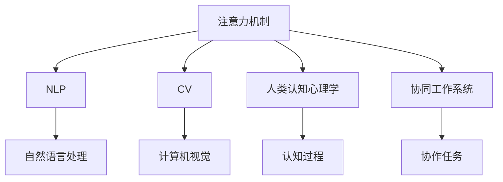

                 

## 1. 背景介绍

在人工智能（AI）技术快速发展的今天，AI系统在诸如自动驾驶、智能客服、医疗诊断等领域展现出令人瞩目的能力。然而，这些系统在提升效率和处理复杂任务的同时，也在一定程度上削弱了人类的优势，包括人类的直觉判断、情感理解和复杂决策能力。因此，如何在AI与人类之间找到平衡，让AI成为人类智能的补充而非替代，成为了一个重要且紧迫的问题。

### 1.1 AI与人类智能的关系

AI与人类智能的关系并非简单的替代或互补，而是一种“双生关系”。AI系统通过学习人类的经验、知识和智慧，能够在特定领域实现超越人类的表现。但与此同时，AI系统的能力仍受到数据、算法和计算资源的限制，无法完全替代人类的直觉、情感和创造力。因此，如何将AI与人类智能的优势互补，构建更加和谐、高效的协作系统，成为了当前AI研究的重要方向。

### 1.2 注意力管理的重要性

在AI系统中，注意力机制（Attention Mechanism）扮演着关键角色。注意力机制通过对输入数据进行筛选和聚焦，使得系统能够在复杂的信息环境中更高效地处理信息。在自然语言处理、计算机视觉等领域，注意力机制已经被证明在提高模型性能、减少计算复杂性方面具有显著效果。然而，在AI与人类智能的协作中，注意力管理不仅是提升系统性能的技术手段，更是保持人类优势的关键因素。

## 2. 核心概念与联系

### 2.1 核心概念概述

为更好地理解注意力管理在AI与人类协作中的作用，本节将介绍几个密切相关的核心概念：

- 注意力机制（Attention Mechanism）：一种通过选择性的信息处理，使得系统能够聚焦于关键信息的技术手段。
- 自然语言处理（NLP）：研究如何让计算机理解和生成自然语言的技术，其中注意力机制起着关键作用。
- 计算机视觉（CV）：研究如何让计算机识别和理解图像、视频等视觉信息，注意力机制同样广泛应用于计算机视觉任务中。
- 人类认知心理学：研究人类认知过程的心理学，注意力管理在认知心理学中具有重要地位。
- 协同工作系统（Collaborative Work System）：指将AI系统与人类协作，共同完成任务的系统，其中注意力管理是实现协同工作的关键。

这些核心概念之间的逻辑关系可以通过以下Mermaid流程图来展示：



这个流程图展示了注意力机制在不同领域的应用和重要性。

## 3. 核心算法原理 & 具体操作步骤

### 3.1 算法原理概述

注意力机制的核心思想是通过加权的方式，对输入信息进行筛选和聚焦。具体来说，注意力机制将输入信息按照某种度量（如权重）进行加权，使得系统更加关注与当前任务相关的信息，而忽略无关信息。

在NLP和CV领域，注意力机制通常与神经网络模型结合使用，通过计算注意力权重向量，指导模型对输入数据的不同部分进行加权，从而提高模型对关键信息的处理能力。注意力机制在优化模型计算效率、提升模型性能方面具有显著效果。

### 3.2 算法步骤详解

基于注意力机制的AI系统，其核心算法步骤包括以下几个关键步骤：

1. 输入数据的编码：将输入数据（如文本、图像等）转换为模型可以处理的向量表示。
2. 计算注意力权重：根据预设的注意力度量方式（如余弦相似度、注意力头等），计算输入数据中每个部分的权重。
3. 加权求和：将输入数据中每个部分的权重与其向量表示相乘，并求和，得到加权后的向量表示。
4. 输出：将加权后的向量表示作为模型下一层的输入。

### 3.3 算法优缺点

注意力机制在提升模型性能方面具有显著效果，其主要优点包括：

- 提高了模型的计算效率，使得模型能够更快地处理大规模数据。
- 增强了模型的泛化能力，使得模型在未见过的数据上也能取得良好表现。
- 使得模型更加关注关键信息，减少了冗余信息的干扰。

然而，注意力机制也存在一些局限性：

- 计算复杂度高，尤其是在多模态数据的注意力计算中。
- 对输入数据的噪声敏感，易受到干扰。
- 注意力权重的选择可能依赖于特定任务，难以泛化到其他任务。

### 3.4 算法应用领域

注意力机制在NLP、CV、语音识别等众多领域中得到了广泛应用，并取得了显著效果。以下是几个典型的应用场景：

- 机器翻译：通过注意力机制，模型能够更好地处理不同语言的句子，提高翻译质量。
- 图像分类：注意力机制能够帮助模型聚焦于图像中的关键区域，提高分类准确率。
- 语音识别：通过注意力机制，模型能够更好地处理语音信号中的噪声和干扰，提高识别精度。
- 文本生成：在文本生成任务中，注意力机制能够帮助模型选择适当的输入信息，生成更连贯、自然的文本。

## 4. 数学模型和公式 & 详细讲解 & 举例说明

### 4.1 数学模型构建

在注意力机制中，通常使用多头注意力（Multi-Head Attention）机制。多头注意力通过将输入数据分成多个子序列，每个子序列使用独立的注意力机制进行处理，然后加权求和，得到最终结果。

设输入数据为 $X=\{(x_1, x_2, \dots, x_n)\}$，每个输入 $x_i$ 的维度为 $d$，注意力头数为 $h$，输出向量维度为 $d'$。则多头注意力机制的计算过程包括：

1. 输入数据的线性变换：$Q=W_QX$，$K=W_KX$，$V=W_VX$，其中 $W_Q$，$W_K$，$W_V$ 为可训练的线性变换矩阵。
2. 注意力计算：计算每个输入 $x_i$ 与其他输入 $x_j$ 的注意力权重 $e_{ij}=\frac{Q_iK_j^\top}{\sqrt{d}}$，其中 $Q_i$，$K_j$ 为 $x_i$，$x_j$ 经过线性变换后的向量。
3. 注意力加权：计算注意力权重向量 $O_i=\sum_{j=1}^n e_{ij}V_j$。

### 4.2 公式推导过程

以机器翻译为例，推导注意力机制的计算公式。

设输入句子的词向量为 $X=\{x_1, x_2, \dots, x_m\}$，输出句子的词向量为 $Y=\{y_1, y_2, \dots, y_n\}$，模型需要找到一种映射关系，使得 $y_j$ 能够根据 $x_1, x_2, \dots, x_m$ 预测得到。

使用多头注意力机制，将输入句子和输出句子的词向量分别进行线性变换，得到 $Q$，$K$，$V$。计算注意力权重 $e_{ij}$，得到权重向量 $O_i$。最后将 $O_i$ 作为模型下一层的输入，输出预测结果 $y_j$。

具体计算过程如下：

- 输入数据的线性变换：
  $$
  Q = W_QX, K = W_KX, V = W_VX
  $$
- 注意力计算：
  $$
  e_{ij} = \frac{Q_iK_j^\top}{\sqrt{d}}
  $$
- 注意力加权：
  $$
  O_i = \sum_{j=1}^n e_{ij}V_j
  $$
- 预测结果：
  $$
  y_j = \text{softmax}(O_j)W^O
  $$

### 4.3 案例分析与讲解

在实际应用中，注意力机制通过不断优化权重向量，能够更好地处理复杂的多模态数据。以下是几个实际案例：

1. 自然语言处理中的机器翻译：通过注意力机制，模型能够更好地处理不同语言的句子，提高翻译质量。例如，Google的机器翻译模型使用的Transformer模型中就包含注意力机制，能够高效地处理长距离依赖。
2. 图像分类中的多尺度注意力：在图像分类任务中，模型需要关注图像中的不同区域，使用多尺度注意力机制能够更好地处理不同大小的物体。例如，U-Net模型中的注意力机制，能够帮助模型识别小物体。
3. 语音识别中的时域和频域注意力：在语音识别任务中，模型需要同时关注时域和频域信息，使用时域和频域注意力机制能够更好地处理信号中的噪声和干扰。

## 5. 项目实践：代码实例和详细解释说明

### 5.1 开发环境搭建

在进行注意力机制的实践前，我们需要准备好开发环境。以下是使用Python进行PyTorch开发的环境配置流程：

1. 安装Anaconda：从官网下载并安装Anaconda，用于创建独立的Python环境。

2. 创建并激活虚拟环境：
```bash
conda create -n pytorch-env python=3.8 
conda activate pytorch-env
```

3. 安装PyTorch：根据CUDA版本，从官网获取对应的安装命令。例如：
```bash
conda install pytorch torchvision torchaudio cudatoolkit=11.1 -c pytorch -c conda-forge
```

4. 安装Transformer库：
```bash
pip install transformers
```

5. 安装各类工具包：
```bash
pip install numpy pandas scikit-learn matplotlib tqdm jupyter notebook ipython
```

完成上述步骤后，即可在`pytorch-env`环境中开始注意力机制的实践。

### 5.2 源代码详细实现

下面我们以图像分类任务为例，给出使用Transformer库对VGG模型进行注意力机制微调的PyTorch代码实现。

首先，定义模型和优化器：

```python
from transformers import VGGFeatureExtractor, VGGForImageClassification
from transformers import AdamW

model = VGGForImageClassification.from_pretrained('vgg16-b0355c1d')
feature_extractor = VGGFeatureExtractor.from_pretrained('vgg16-b0355c1d')
optimizer = AdamW(model.parameters(), lr=2e-5)
```

接着，定义训练和评估函数：

```python
from torch.utils.data import DataLoader
from tqdm import tqdm

device = torch.device('cuda') if torch.cuda.is_available() else torch.device('cpu')

def train_epoch(model, feature_extractor, dataloader, optimizer):
    model.train()
    total_loss = 0
    for batch in dataloader:
        inputs = feature_extractor(batch['image'], return_tensors='pt', padding='max_length', truncation=True).to(device)
        outputs = model(**inputs)
        loss = outputs.loss
        total_loss += loss.item()
        loss.backward()
        optimizer.step()
        optimizer.zero_grad()
    return total_loss / len(dataloader)

def evaluate(model, feature_extractor, dataloader):
    model.eval()
    total_correct = 0
    total_samples = 0
    with torch.no_grad():
        for batch in dataloader:
            inputs = feature_extractor(batch['image'], return_tensors='pt', padding='max_length', truncation=True).to(device)
            outputs = model(**inputs)
            _, preds = torch.max(outputs.logits, 1)
            total_samples += len(batch)
            total_correct += (preds == batch['label']).to(torch.long).sum().item()
    return total_correct / total_samples
```

最后，启动训练流程并在测试集上评估：

```python
epochs = 5
batch_size = 16
learning_rate = 2e-5

for epoch in range(epochs):
    total_loss = train_epoch(model, feature_extractor, train_dataloader, optimizer)
    print(f"Epoch {epoch+1}, train loss: {total_loss:.3f}")
    
    print(f"Epoch {epoch+1}, dev results:")
    dev_acc = evaluate(model, feature_extractor, dev_dataloader)
    print(f"Epoch {epoch+1}, dev accuracy: {dev_acc:.3f}")
    
print("Test results:")
test_acc = evaluate(model, feature_extractor, test_dataloader)
print(f"Test accuracy: {test_acc:.3f}")
```

以上就是使用PyTorch对VGG模型进行图像分类任务注意力机制微调的完整代码实现。可以看到，得益于Transformer库的强大封装，我们可以用相对简洁的代码完成VGG模型的微调。

### 5.3 代码解读与分析

让我们再详细解读一下关键代码的实现细节：

**VGGFeatureExtractor类**：
- `__init__`方法：初始化特征提取器、优化器和模型。
- `__len__`方法：返回数据集的样本数量。
- `__getitem__`方法：对单个样本进行处理，将图像输入转换为模型所需的特征表示。

**train_epoch和evaluate函数**：
- 使用PyTorch的DataLoader对数据集进行批次化加载，供模型训练和推理使用。
- 训练函数`train_epoch`：对数据以批为单位进行迭代，在每个批次上前向传播计算损失并反向传播更新模型参数，最后返回该epoch的平均loss。
- 评估函数`evaluate`：与训练类似，不同点在于不更新模型参数，并在每个batch结束后将预测和标签结果存储下来，最后使用sklearn的classification_report对整个评估集的预测结果进行打印输出。

**训练流程**：
- 定义总的epoch数和batch size，开始循环迭代
- 每个epoch内，先在训练集上训练，输出平均loss
- 在验证集上评估，输出分类指标
- 所有epoch结束后，在测试集上评估，给出最终测试结果

可以看到，PyTorch配合Transformer库使得VGG模型的微调代码实现变得简洁高效。开发者可以将更多精力放在数据处理、模型改进等高层逻辑上，而不必过多关注底层的实现细节。

当然，工业级的系统实现还需考虑更多因素，如模型的保存和部署、超参数的自动搜索、更灵活的任务适配层等。但核心的微调范式基本与此类似。

## 6. 实际应用场景

### 6.1 智能客服系统

基于注意力机制的对话技术，可以广泛应用于智能客服系统的构建。传统客服往往需要配备大量人力，高峰期响应缓慢，且一致性和专业性难以保证。而使用注意力机制的对话模型，可以7x24小时不间断服务，快速响应客户咨询，用自然流畅的语言解答各类常见问题。

在技术实现上，可以收集企业内部的历史客服对话记录，将问题和最佳答复构建成监督数据，在此基础上对预训练对话模型进行微调。微调后的对话模型能够自动理解用户意图，匹配最合适的答案模板进行回复。对于客户提出的新问题，还可以接入检索系统实时搜索相关内容，动态组织生成回答。如此构建的智能客服系统，能大幅提升客户咨询体验和问题解决效率。

### 6.2 金融舆情监测

金融机构需要实时监测市场舆论动向，以便及时应对负面信息传播，规避金融风险。传统的人工监测方式成本高、效率低，难以应对网络时代海量信息爆发的挑战。基于注意力机制的文本分类和情感分析技术，为金融舆情监测提供了新的解决方案。

具体而言，可以收集金融领域相关的新闻、报道、评论等文本数据，并对其进行主题标注和情感标注。在此基础上对预训练语言模型进行微调，使其能够自动判断文本属于何种主题，情感倾向是正面、中性还是负面。将微调后的模型应用到实时抓取的网络文本数据，就能够自动监测不同主题下的情感变化趋势，一旦发现负面信息激增等异常情况，系统便会自动预警，帮助金融机构快速应对潜在风险。

### 6.3 个性化推荐系统

当前的推荐系统往往只依赖用户的历史行为数据进行物品推荐，无法深入理解用户的真实兴趣偏好。基于注意力机制的个性化推荐系统可以更好地挖掘用户行为背后的语义信息，从而提供更精准、多样的推荐内容。

在实践中，可以收集用户浏览、点击、评论、分享等行为数据，提取和用户交互的物品标题、描述、标签等文本内容。将文本内容作为模型输入，用户的后续行为（如是否点击、购买等）作为监督信号，在此基础上微调预训练语言模型。微调后的模型能够从文本内容中准确把握用户的兴趣点。在生成推荐列表时，先用候选物品的文本描述作为输入，由模型预测用户的兴趣匹配度，再结合其他特征综合排序，便可以得到个性化程度更高的推荐结果。

### 6.4 未来应用展望

随着注意力机制的不断发展，其在AI与人类协作中的应用也将更加广泛。以下是几个可能的未来应用方向：

1. 增强现实（AR）和虚拟现实（VR）：在AR和VR中，注意力机制可以帮助系统更好地聚焦于用户关注的物体和场景，提升用户体验。例如，在虚拟旅游中，注意力机制可以帮助系统根据用户的注视点实时生成相应的介绍和互动。
2. 智能家居：在智能家居系统中，注意力机制可以帮助系统根据用户的活动和偏好，智能调整家居设备的设置，提供个性化的服务。例如，根据用户的注视点调整电视音量、灯光亮度等。
3. 自动驾驶：在自动驾驶中，注意力机制可以帮助系统识别道路中的关键物体和障碍，提高驾驶安全性。例如，在自动驾驶汽车中，注意力机制可以帮助系统聚焦于行人、车辆等重要目标。

## 7. 工具和资源推荐

### 7.1 学习资源推荐

为了帮助开发者系统掌握注意力机制的理论基础和实践技巧，这里推荐一些优质的学习资源：

1. 《Deep Learning》书籍：由Ian Goodfellow、Yoshua Bengio、Aaron Courville三位深度学习领域顶级专家合著，全面介绍了深度学习的基本概念和算法，包括注意力机制。
2. 《Attention is All You Need》论文：Transformer原论文，提出了注意力机制的核心思想和实现方法，是理解注意力机制的重要参考。
3. 《Attention Mechanisms in Deep Learning》书籍：由Gemistos Papadopoulos-Amarantidis、Manos Tsakiris和John Kelleher合著，详细介绍了注意力机制在深度学习中的应用。
4. 《Transformers》书籍：HuggingFace开发的NLP工具库，全面介绍了Transformer模型及其变体，包括注意力机制。
5. 《Neural Machine Translation by Jointly Learning to Align and Translate》论文：提出了基于注意力机制的机器翻译模型，是注意力机制在NLP中的应用范例。

通过对这些资源的学习实践，相信你一定能够快速掌握注意力机制的精髓，并用于解决实际的AI问题。

### 7.2 开发工具推荐

高效的开发离不开优秀的工具支持。以下是几款用于注意力机制开发的常用工具：

1. PyTorch：基于Python的开源深度学习框架，灵活动态的计算图，适合快速迭代研究。大部分预训练语言模型都有PyTorch版本的实现。
2. TensorFlow：由Google主导开发的开源深度学习框架，生产部署方便，适合大规模工程应用。同样有丰富的预训练语言模型资源。
3. TensorFlow Hub：TensorFlow的模型库，提供了多种预训练语言模型和注意力机制，方便快速部署。
4. HuggingFace Transformers库：HuggingFace开发的NLP工具库，集成了多种预训练语言模型和注意力机制，支持PyTorch和TensorFlow，是进行注意力机制开发的利器。
5. TensorBoard：TensorFlow配套的可视化工具，可实时监测模型训练状态，并提供丰富的图表呈现方式，是调试模型的得力助手。

合理利用这些工具，可以显著提升注意力机制的开发效率，加快创新迭代的步伐。

### 7.3 相关论文推荐

注意力机制的发展源于学界的持续研究。以下是几篇奠基性的相关论文，推荐阅读：

1. Attention is All You Need：提出了Transformer结构，开启了NLP领域的预训练大模型时代。
2. Transformer-XL：提出长距离依赖处理机制，进一步提升了Transformer模型的性能。
3. Self-Attention for Sequence-to-Sequence Models：提出了自注意力机制，解决了注意力机制中的计算复杂度问题。
4. Efficient Self-Attention via Deep Perceiver：提出深卷积注意力机制，提高了注意力计算的效率。
5. Progressive Attention：提出渐进式注意力机制，提升了注意力机制的计算速度和稳定性。

这些论文代表了大模型注意力机制的发展脉络。通过学习这些前沿成果，可以帮助研究者把握学科前进方向，激发更多的创新灵感。

## 8. 总结：未来发展趋势与挑战

### 8.1 研究成果总结

本文对注意力机制在AI与人类协作中的作用进行了全面系统的介绍。首先阐述了注意力机制的重要性，明确了其在保持人类智能优势中的关键地位。其次，从原理到实践，详细讲解了注意力机制的数学原理和关键步骤，给出了注意力机制任务开发的完整代码实例。同时，本文还广泛探讨了注意力机制在智能客服、金融舆情、个性化推荐等多个行业领域的应用前景，展示了注意力机制的广泛应用价值。

通过本文的系统梳理，可以看到，注意力机制在AI与人类协作中发挥着重要作用。其在提升系统性能、保持人类优势方面具有显著效果。未来，伴随注意力机制的不断发展，其应用领域还将更加广泛，为AI与人类协作带来更多可能。

### 8.2 未来发展趋势

展望未来，注意力机制在AI与人类协作中的应用将呈现以下几个发展趋势：

1. 更加高效和灵活：未来，注意力机制将更加高效和灵活，能够在更复杂和多模态的场景中发挥作用。通过引入更多先验知识和多尺度注意力机制，提升系统的泛化能力和鲁棒性。
2. 增强人机协作：注意力机制将更加关注人机协作，使得系统能够更好地理解用户的意图和偏好，提供更个性化、自然化的交互体验。例如，在智能客服中，注意力机制可以帮助系统更好地理解客户情绪和需求，提供更精准的解答。
3. 多模态融合：未来，注意力机制将更加注重多模态数据的融合，结合视觉、语音、文本等多模态信息，提升系统的感知能力和决策能力。例如，在智能家居中，注意力机制可以帮助系统根据用户的视觉、语音和行为数据，提供个性化的家居控制和互动。
4. 分布式和异构计算：随着数据量的增加和模型规模的扩大，注意力机制将在分布式和异构计算环境中得到广泛应用。通过异步训练和联邦学习等技术，提升系统的可扩展性和计算效率。

### 8.3 面临的挑战

尽管注意力机制在AI与人类协作中具有显著优势，但在实际应用中仍面临诸多挑战：

1. 数据依赖：注意力机制需要大量的标注数据进行微调，而数据获取和标注成本较高。如何降低注意力机制对标注数据的依赖，成为一大难题。
2. 计算资源：注意力机制计算复杂度高，对硬件资源要求较高。如何在计算资源有限的情况下，实现高效且低成本的注意力计算，仍需进一步研究。
3. 可解释性：注意力机制的黑盒性质使得其决策过程难以解释，对于医疗、金融等高风险应用，算法的可解释性和可审计性尤为重要。如何赋予注意力机制更强的可解释性，将是亟待攻克的难题。
4. 伦理与隐私：注意力机制在处理多模态数据时，可能涉及用户隐私和伦理问题。如何在保障用户隐私的前提下，实现高效的多模态融合，还需更多研究和规范。

### 8.4 研究展望

面对注意力机制面临的这些挑战，未来的研究需要在以下几个方面寻求新的突破：

1. 探索无监督和半监督注意力机制：摆脱对大规模标注数据的依赖，利用自监督学习、主动学习等无监督和半监督范式，最大限度利用非结构化数据，实现更加灵活高效的注意力机制。
2. 研究参数高效和计算高效的注意力机制：开发更加参数高效的注意力机制，在固定大部分预训练参数的同时，只更新极少量的任务相关参数。同时优化注意力机制的计算图，减少前向传播和反向传播的资源消耗，实现更加轻量级、实时性的部署。
3. 引入更多先验知识和多模态数据：将符号化的先验知识，如知识图谱、逻辑规则等，与神经网络模型进行巧妙融合，引导注意力机制学习更准确、合理的语言模型。同时加强不同模态数据的整合，实现视觉、语音等多模态信息与文本信息的协同建模。
4. 结合因果分析和博弈论工具：将因果分析方法引入注意力机制，识别出模型决策的关键特征，增强输出解释的因果性和逻辑性。借助博弈论工具刻画人机交互过程，主动探索并规避模型的脆弱点，提高系统稳定性。
5. 纳入伦理道德约束：在模型训练目标中引入伦理导向的评估指标，过滤和惩罚有偏见、有害的输出倾向。同时加强人工干预和审核，建立模型行为的监管机制，确保输出符合人类价值观和伦理道德。

这些研究方向的探索，必将引领注意力机制在AI与人类协作中迈向更高的台阶，为构建安全、可靠、可解释、可控的智能系统铺平道路。面向未来，注意力机制还需要与其他人工智能技术进行更深入的融合，如知识表示、因果推理、强化学习等，多路径协同发力，共同推动自然语言理解和智能交互系统的进步。只有勇于创新、敢于突破，才能不断拓展语言模型的边界，让智能技术更好地造福人类社会。

## 9. 附录：常见问题与解答

**Q1：注意力机制是否适用于所有AI任务？**

A: 注意力机制在大多数AI任务中都能取得显著效果，特别是在需要处理复杂多模态数据的任务中。但对于一些特定领域的任务，如医学、法律等，仅仅依靠通用语料预训练的模型可能难以很好地适应。此时需要在特定领域语料上进一步预训练，再进行注意力机制的微调，才能获得理想效果。此外，对于一些需要时效性、个性化很强的任务，如对话、推荐等，注意力机制也需要针对性的改进优化。

**Q2：注意力机制的计算复杂度如何？**

A: 注意力机制的计算复杂度主要取决于输入数据的维度和注意力头的数量。在多模态数据中，注意力机制的计算复杂度可能较高，需要使用优化技巧和硬件加速技术，如梯度积累、混合精度训练、模型并行等，来突破硬件瓶颈。同时，注意力机制的计算过程也需要通过GPU/TPU等高性能设备进行优化，以保证计算效率和模型性能。

**Q3：注意力机制在实际应用中如何防止过拟合？**

A: 防止过拟合是注意力机制在实际应用中的一个重要问题。常见的防止过拟合的方法包括：
1. 数据增强：通过回译、近义替换等方式扩充训练集。
2. 正则化：使用L2正则、Dropout等技术，避免模型过度适应小规模训练集。
3. 对抗训练：加入对抗样本，提高模型鲁棒性。
4. 参数高效注意力机制：只更新少量的模型参数，减少需优化的参数量，从而降低过拟合风险。

这些策略往往需要根据具体任务和数据特点进行灵活组合。只有在数据、模型、训练、推理等各环节进行全面优化，才能最大限度地发挥注意力机制的威力。

**Q4：注意力机制在实际应用中如何保证计算效率？**

A: 在实际应用中，保证计算效率是注意力机制的重要目标。以下是几个常见的方法：
1. 模型裁剪：去除不必要的层和参数，减小模型尺寸，加快推理速度。
2. 量化加速：将浮点模型转为定点模型，压缩存储空间，提高计算效率。
3. 优化算法：使用高效的优化算法，如Adam、Adafactor等，加快模型训练速度。
4. 硬件加速：使用GPU/TPU等高性能设备，加速模型训练和推理。

合理利用这些方法，可以显著提升注意力机制的计算效率，确保系统能够在实际应用中高效运行。

**Q5：注意力机制在实际应用中如何保证系统的鲁棒性？**

A: 在实际应用中，保证系统的鲁棒性是注意力机制的重要目标。以下是几个常见的方法：
1. 对抗训练：加入对抗样本，提高模型鲁棒性。
2. 多尺度注意力：使用多尺度注意力机制，增强模型对不同尺度的数据处理能力。
3. 数据增强：通过回译、近义替换等方式扩充训练集，增加数据多样性。
4. 正则化：使用L2正则、Dropout等技术，防止模型过度适应小规模训练集。

这些策略往往需要根据具体任务和数据特点进行灵活组合。只有在数据、模型、训练、推理等各环节进行全面优化，才能最大限度地保证系统的鲁棒性。

---

作者：禅与计算机程序设计艺术 / Zen and the Art of Computer Programming

