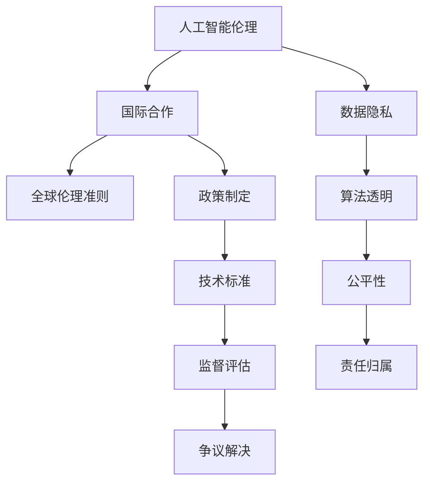

                 

# AI伦理的国际合作:全球伦理准则和治理机制

> 关键词：人工智能伦理, 全球伦理准则, 国际合作, 人工智能治理, 数据隐私, 算法透明, 公平性

## 1. 背景介绍

### 1.1 问题由来

随着人工智能(AI)技术的飞速发展，其在医疗、金融、教育、交通等多个领域的广泛应用，极大地提升了生产效率和生活质量。然而，AI技术的迅猛发展也伴随着一系列伦理问题。诸如算法偏见、隐私泄露、就业替代、武器化等负面影响逐渐显现。

面对这些挑战，AI的国际合作变得愈发重要。国际社会对于AI伦理和治理的共识逐步形成，多个国家及国际组织纷纷出台了相应的指导原则和标准，致力于构建一套完善的全球AI伦理治理体系。

### 1.2 问题核心关键点

当前，AI伦理和治理的核心关键点包括：

- **数据隐私**：如何在数据收集和处理中保护个人隐私，确保数据使用的合规性和安全性。
- **算法透明**：如何确保AI系统的决策过程透明、可解释，避免“黑箱”问题。
- **公平性**：如何保证AI系统对不同群体公平，避免偏见和歧视。
- **责任归属**：如何在AI应用中明确责任归属，确保责任主体清晰。
- **国际合作**：如何通过国际协作，建立跨国的AI伦理和治理框架。

这些关键点构成了AI伦理和治理研究的主要方向，对未来AI技术的发展具有重要的指导意义。

### 1.3 问题研究意义

研究AI伦理和治理，对于推动AI技术的健康发展，保障公众权益，实现技术公平正义具有重要意义：

1. **保障数据隐私**：确保个人隐私不被滥用，维护社会稳定和信任。
2. **提升算法透明**：增强AI系统的可信度，促进公众理解和接受。
3. **实现算法公平**：避免AI系统决策中的偏见和歧视，促进社会公平。
4. **明确责任归属**：在AI应用出错时，确保责任可追溯，避免推诿扯皮。
5. **促进国际合作**：通过全球协作，制定统一的伦理准则，避免技术孤岛。

通过国际合作，推动AI伦理和治理的研究，可以共同应对AI技术带来的挑战，促进全球科技进步和社会和谐。

## 2. 核心概念与联系

### 2.1 核心概念概述

为更好地理解AI伦理和治理，本节将介绍几个密切相关的核心概念：

- **人工智能伦理(AI Ethics)**：研究AI技术在开发、应用过程中面临的伦理问题，如隐私保护、公平性、透明性等，并提出相应的伦理准则和建议。
- **国际合作(International Cooperation)**：不同国家和地区在AI技术开发、应用、治理等方面的合作，建立跨国的伦理和治理框架。
- **全球伦理准则(Global Ethical Guidelines)**：由国际组织或各国政府制定，涵盖AI伦理的各项原则和标准，旨在规范AI技术的开发和应用。
- **治理机制(Governance Mechanisms)**：包括法律、政策、标准等在内的各种规则和机制，用于指导和监督AI技术的开发和应用，确保其符合伦理要求。

这些概念之间的关系可以通过以下Mermaid流程图来展示：



这个流程图展示了大语言模型的核心概念及其之间的关系：

1. 人工智能伦理通过数据隐私、算法透明、公平性和责任归属等维度进行展开。
2. 国际合作通过政策制定、技术标准、监督评估和争议解决等机制进行推动。
3. 全球伦理准则则是国际合作和伦理研究的结果，指导着AI技术的开发和应用。

## 3. 核心算法原理 & 具体操作步骤
### 3.1 算法原理概述

AI伦理和治理的核心算法原理主要涉及以下几个方面：

- **数据隐私保护**：通过数据匿名化、差分隐私等技术，保护个人隐私。
- **算法透明性**：利用可解释性模型和解释工具，确保AI决策过程透明。
- **公平性检测**：通过偏见检测和修正方法，保证AI系统的公平性。
- **责任追溯**：通过责任链和故障诊断技术，明确AI应用中的责任归属。

这些原理构成了AI伦理和治理的算法基础，指导着AI技术的开发和应用。

### 3.2 算法步骤详解

AI伦理和治理的具体操作步骤包括以下几个关键步骤：

**Step 1: 收集和处理数据**

1. 收集训练数据时，严格遵守数据隐私法律法规，对个人数据进行匿名化处理。
2. 使用差分隐私技术，在数据处理过程中加入噪音，保护隐私。
3. 对数据进行预处理，确保数据质量和多样性。

**Step 2: 设计和训练模型**

1. 选择或设计符合伦理要求的算法模型，如可解释性模型、公平性优化模型等。
2. 在模型训练过程中，使用隐私保护技术，避免泄露敏感信息。
3. 对模型进行公平性评估和优化，确保不同群体间公平。

**Step 3: 部署和监控**

1. 在实际应用中，确保AI系统符合各项伦理准则。
2. 使用透明度工具和监督评估机制，监控AI系统的行为。
3. 设立争议解决机制，及时处理伦理问题。

**Step 4: 持续改进**

1. 根据反馈和监督评估结果，持续改进AI系统。
2. 定期更新模型和算法，确保其符合最新的伦理要求。

通过以上步骤，可以系统地构建AI伦理和治理机制，确保AI技术的健康发展。

### 3.3 算法优缺点

AI伦理和治理算法具有以下优点：

1. **全面性和系统性**：通过多方协作，制定统一的伦理准则和治理机制，确保AI技术的全面性和系统性。
2. **透明性和可解释性**：通过算法透明和解释工具，提高AI系统的透明性和可解释性。
3. **公平性和包容性**：通过公平性检测和修正方法，确保AI系统对不同群体的公平性。
4. **责任明确**：通过责任追溯和争议解决机制，明确AI应用的责任归属。

同时，这些算法也存在一些缺点：

1. **复杂性和成本高**：设计和实现符合伦理要求的算法，需要投入大量时间和资源。
2. **跨领域挑战**：不同领域和行业的AI伦理问题复杂多样，需要制定灵活多变的治理机制。
3. **技术落地难度**：将伦理准则和治理机制落地到实际应用中，需要技术、法规和市场等多方协作。

尽管存在这些挑战，但AI伦理和治理的算法原理为未来AI技术的应用提供了重要指导，促进了技术的健康发展。

### 3.4 算法应用领域

AI伦理和治理算法在多个领域都有广泛应用，具体包括：

- **医疗健康**：确保医疗数据隐私，避免算法偏见，提高医疗决策的公平性和透明性。
- **金融服务**：保护客户隐私，避免算法歧视，确保金融服务的公平性和透明性。
- **教育培训**：保护学生隐私，确保教学内容的公平性和透明性。
- **司法系统**：确保审判过程的公平性和透明性，保护被告隐私。
- **城市管理**：利用AI进行交通监控、环境监测等，确保数据的隐私保护和算法的公平性。

这些应用领域展示了AI伦理和治理算法的重要性和广泛性。通过这些应用，AI技术得以更好地服务于社会，提升公众福祉。

## 4. 数学模型和公式 & 详细讲解
### 4.1 数学模型构建

AI伦理和治理的数学模型主要涉及以下几个方面：

- **数据隐私**：通过差分隐私模型和匿名化技术，保护个人隐私。
- **算法透明**：通过可解释性模型和解释工具，确保AI决策过程透明。
- **公平性检测**：通过偏差检测和修正模型，保证AI系统的公平性。
- **责任追溯**：通过责任链和故障诊断模型，明确AI应用中的责任归属。

这些模型通过数学公式进行定义和计算，具体如下：

**差分隐私模型**：

$$
\epsilon\text{-}\mathcal{L}_2\text{-}privacy(\mathcal{D}):\forall\text{ }Q:\text{ }|P[Q(D)]-P[Q(D')|\leq \epsilon
$$

其中，$D$和$D'$表示数据集，$Q$表示查询函数，$\epsilon$表示隐私保护参数，表示查询结果的分布差异小于$\epsilon$。

**公平性检测模型**：

$$
\text{Fairness}=\mathcal{L}(f,\text{ }{\bf{x}}):\forall\text{ }{\bf{x}}:\text{ }f({\bf{x}})\in\{A,B\}
$$

其中，$f$表示模型，${\bf{x}}$表示输入数据，$\{A,B\}$表示模型输出的类别。

**责任追溯模型**：

$$
\text{Responsibility}=trace(\mathcal{M}(\text{ }{\bf{x}}))
$$

其中，$\mathcal{M}$表示模型，${\bf{x}}$表示输入数据，$trace$表示责任追溯路径。

### 4.2 公式推导过程

**差分隐私模型推导**：

差分隐私保护的核心公式为$\epsilon$-Differential Privacy（$\epsilon$-DP）：

$$
P[Q(D)]\leq e^{\epsilon}P[Q(D')]
$$

其中，$P[Q(D)]$表示在数据集$D$上查询$Q$的概率，$e^{\epsilon}$表示隐私保护因子。

**公平性检测模型推导**：

公平性检测的核心公式为Equalized Odds：

$$
P(y|A)\geq\max(0,\frac{\delta}{\alpha}P(y|B))
$$

其中，$y$表示模型输出，$A$和$B$表示不同群体，$\delta$表示容忍度，$\alpha$表示公平性系数。

**责任追溯模型推导**：

责任追溯的核心公式为责任链：

$$
trace(\mathcal{M}({\bf{x}}))=\text{ }{\bf{x}}\rightarrow f({\bf{x}})\rightarrow trace(f({\bf{x}}))
$$

其中，$\mathcal{M}$表示模型，${\bf{x}}$表示输入数据，$\rightarrow$表示责任传递。

### 4.3 案例分析与讲解

**案例1：医疗数据隐私保护**

在医疗数据隐私保护中，差分隐私模型和匿名化技术被广泛应用。通过向查询结果中添加噪音，差分隐私模型确保单个数据点对查询结果的影响很小，从而保护了患者的隐私。例如：

$$
P[Q(D)]\leq e^{\epsilon}P[Q(D')]
$$

其中，$D$和$D'$表示患者数据集和匿名化后的数据集，$Q$表示查询患者患病概率的函数。

**案例2：算法透明性检测**

在金融领域，算法透明性检测常用于确保贷款审批和信用评估的公平性。通过解释工具，可以分析模型决策的特征重要性，发现潜在的歧视性因素。例如：

$$
\text{Fairness}=\mathcal{L}(f,\text{ }{\bf{x}})
$$

其中，$f$表示贷款审批模型，${\bf{x}}$表示贷款申请数据，$\text{Fairness}$表示模型的公平性。

**案例3：责任追溯和争议解决**

在司法系统中，责任追溯模型用于确保判决过程的透明性和可追溯性。通过记录每个判决步骤，可以追溯责任归属，处理争议。例如：

$$
trace(\mathcal{M}({\bf{x}}))=\text{ }{\bf{x}}\rightarrow f({\bf{x}})\rightarrow trace(f({\bf{x}}))
$$

其中，$\mathcal{M}$表示司法判决模型，${\bf{x}}$表示案件数据，$\rightarrow$表示责任传递路径。

## 5. 项目实践：代码实例和详细解释说明
### 5.1 开发环境搭建

在进行AI伦理和治理项目实践前，我们需要准备好开发环境。以下是使用Python进行PyTorch开发的环境配置流程：

1. 安装Anaconda：从官网下载并安装Anaconda，用于创建独立的Python环境。

2. 创建并激活虚拟环境：
```bash
conda create -n pytorch-env python=3.8 
conda activate pytorch-env
```

3. 安装PyTorch：根据CUDA版本，从官网获取对应的安装命令。例如：
```bash
conda install pytorch torchvision torchaudio cudatoolkit=11.1 -c pytorch -c conda-forge
```

4. 安装TensorFlow：从官网下载安装命令。例如：
```bash
pip install tensorflow
```

5. 安装TensorBoard：
```bash
pip install tensorboard
```

6. 安装Keras：
```bash
pip install keras
```

完成上述步骤后，即可在`pytorch-env`环境中开始AI伦理和治理项目实践。

### 5.2 源代码详细实现

下面我们以医疗数据隐私保护为例，给出使用PyTorch和TensorFlow进行差分隐私保护的代码实现。

首先，定义差分隐私保护函数：

```python
import numpy as np
import torch
from torch.utils.data import DataLoader, Dataset

class DiffPrivDataset(Dataset):
    def __init__(self, data, noise_std):
        self.data = data
        self.noise_std = noise_std
        
    def __len__(self):
        return len(self.data)
    
    def __getitem__(self, item):
        x = self.data[item]
        y = torch.tensor(x, dtype=torch.float32)
        return {'x': y, 'y': y + torch.randn_like(y) * self.noise_std}

def compute_diff_priv(data, noise_std, epsilon=0.1):
    dataset = DiffPrivDataset(data, noise_std)
    dataloader = DataLoader(dataset, batch_size=32, shuffle=True)
    y_true = []
    y_pred = []
    for batch in dataloader:
        x, y = batch['x'], batch['y']
        y_true.append(y)
        y_pred.append(torch.sigmoid(x))
    y_true = torch.stack(y_true).mean()
    y_pred = torch.stack(y_pred).mean()
    return np.exp(epsilon) * y_true - y_pred
```

然后，定义差分隐私保护的调用函数：

```python
import tensorflow as tf

def compute_diff_priv_tf(data, noise_std, epsilon=0.1):
    def f(x):
        return tf.sigmoid(x)
    
    def f_diff_priv(x, noise_std):
        return tf.random.normal(shape=(x.shape[0],), stddev=noise_std) + x
    
    y_true = tf.reduce_mean(tf.map_fn(lambda x: f(x), data))
    y_pred = tf.reduce_mean(tf.map_fn(lambda x: f_diff_priv(x, noise_std), data))
    return np.exp(epsilon) * y_true - y_pred
```

最后，使用上述函数进行差分隐私保护实践：

```python
import torch
import numpy as np

# 示例数据
data = np.random.randn(100)
noise_std = 0.1
epsilon = 0.1

# 使用PyTorch实现差分隐私保护
y_pred_pytorch = compute_diff_priv(data, noise_std, epsilon)

# 使用TensorFlow实现差分隐私保护
y_pred_tf = compute_diff_priv_tf(data, noise_std, epsilon)

# 输出结果
print("PyTorch差分隐私保护结果：", y_pred_pytorch)
print("TensorFlow差分隐私保护结果：", y_pred_tf)
```

以上就是使用PyTorch和TensorFlow进行差分隐私保护的完整代码实现。可以看到，通过这些库，我们可以方便地实现差分隐私保护，保护医疗数据的隐私。

### 5.3 代码解读与分析

让我们再详细解读一下关键代码的实现细节：

**DiffPrivDataset类**：
- `__init__`方法：初始化数据集和噪声标准差。
- `__len__`方法：返回数据集的样本数量。
- `__getitem__`方法：对单个样本进行处理，向真实值添加噪声。

**compute_diff_priv函数**：
- 定义了差分隐私保护的基本框架，使用PyTorch实现。
- 从数据集中加载数据，并对每个数据点添加噪声，计算差分隐私保护的输出。

**compute_diff_priv_tf函数**：
- 使用TensorFlow实现差分隐私保护，利用tf.map_fn函数对每个数据点进行噪声注入。
- 计算差分隐私保护的输出，并返回结果。

可以看到，差分隐私保护的实现相对简单，但在实际应用中，我们需要根据具体场景进行参数调优，确保隐私保护的有效性。

## 6. 实际应用场景
### 6.1 医疗数据隐私保护

在医疗数据隐私保护中，差分隐私保护被广泛应用于医院和医疗机构。通过向数据添加噪声，差分隐私保护可以有效保护患者隐私，同时确保数据分析的可靠性。例如，医院可以使用差分隐私保护技术，在共享医疗数据时，保护患者的姓名、年龄等敏感信息。

### 6.2 金融数据隐私保护

金融领域的数据隐私保护也离不开差分隐私保护。银行和金融机构在处理客户数据时，需要确保数据的隐私性和安全性。通过差分隐私保护，金融机构可以对外提供匿名化后的数据，供市场分析和监管使用，而无需暴露客户的详细个人信息。

### 6.3 政府数据隐私保护

政府部门在处理公共数据时，需要保护公民的隐私。差分隐私保护可以用于发布公共数据，如人口统计、交通流量等，确保数据的隐私保护和分析的准确性。例如，交通部门可以发布匿名化的交通流量数据，供研究人员分析交通拥堵情况，而无需暴露个别车辆的行驶轨迹。

### 6.4 未来应用展望

随着AI技术的不断进步，差分隐私保护将在更多领域得到应用，为数据隐私保护带来新的解决方案。

在智慧城市管理中，差分隐私保护可以用于城市事件监控、舆情分析等，确保数据的隐私保护和分析的准确性。例如，智慧城市平台可以收集并匿名化市民的行为数据，供城市管理部门进行数据分析和决策，而无需暴露市民的个人隐私。

在社交媒体分析中，差分隐私保护可以用于用户行为数据分析，确保用户隐私保护和数据安全。例如，社交媒体平台可以收集并匿名化用户的点赞、评论等数据，供数据分析师进行用户行为分析，而无需暴露用户的个人信息。

未来，差分隐私保护将成为AI伦理和治理的重要手段，为数据隐私保护和分析提供新的思路和工具。

## 7. 工具和资源推荐
### 7.1 学习资源推荐

为了帮助开发者系统掌握AI伦理和治理的理论基础和实践技巧，这里推荐一些优质的学习资源：

1. 《AI伦理与治理》系列博文：由AI专家撰写，深入浅出地介绍了AI伦理和治理的基本概念和实践方法。

2. 《数据隐私保护与差分隐私》课程：斯坦福大学开设的课程，系统讲解了数据隐私保护和差分隐私的基本原理和技术手段。

3. 《AI伦理与法律》书籍：全面介绍了AI伦理和法律的基本原理，探讨了AI技术在法律中的应用和挑战。

4. AI伦理与治理网站：提供丰富的AI伦理和治理相关资源，包括学术论文、政策报告、工具库等。

5. Kaggle AI伦理竞赛：通过实际项目，帮助开发者提升AI伦理和治理的实践能力。

通过对这些资源的学习实践，相信你一定能够快速掌握AI伦理和治理的精髓，并用于解决实际的AI问题。
###  7.2 开发工具推荐

高效的开发离不开优秀的工具支持。以下是几款用于AI伦理和治理开发的常用工具：

1. PyTorch：基于Python的开源深度学习框架，灵活动态，支持差分隐私保护。

2. TensorFlow：由Google主导开发的开源深度学习框架，功能强大，支持差分隐私保护。

3. TensorBoard：TensorFlow配套的可视化工具，可以实时监测模型训练状态，提供丰富的图表呈现方式，辅助调试。

4. Weights & Biases：模型训练的实验跟踪工具，可以记录和可视化模型训练过程中的各项指标，方便对比和调优。

5. Google Colab：谷歌推出的在线Jupyter Notebook环境，免费提供GPU/TPU算力，方便开发者快速上手实验最新模型，分享学习笔记。

合理利用这些工具，可以显著提升AI伦理和治理任务的开发效率，加快创新迭代的步伐。

### 7.3 相关论文推荐

AI伦理和治理的研究源于学界的持续研究。以下是几篇奠基性的相关论文，推荐阅读：

1. "A Framework for Ethical AI Development"：提出了AI伦理和治理的基本框架，为AI伦理研究奠定了基础。

2. "The Ethics of Algorithms"：探讨了算法伦理问题，提出了算法透明性和可解释性的重要性。

3. "Fairness in Machine Learning: Understanding the Issues"：系统阐述了AI公平性问题，提出了公平性检测和修正方法。

4. "The Unintended Consequences of Algorithmic Governance"：分析了AI治理的复杂性，提出了算法透明性和责任追溯的重要性。

5. "Towards Fairness in Machine Learning"：提出了多种公平性检测和修正方法，为AI公平性研究提供了新的思路。

这些论文代表了大语言模型微调技术的发展脉络。通过学习这些前沿成果，可以帮助研究者把握学科前进方向，激发更多的创新灵感。

## 8. 总结：未来发展趋势与挑战

### 8.1 总结

本文对AI伦理和治理方法进行了全面系统的介绍。首先阐述了AI伦理和治理的研究背景和意义，明确了其在AI技术健康发展中的重要性。其次，从原理到实践，详细讲解了差分隐私保护、算法透明性、公平性检测等AI伦理和治理的核心算法，给出了详细的代码实例。同时，本文还广泛探讨了AI伦理和治理方法在医疗、金融、政府等多个领域的应用前景，展示了其广阔的应用价值。此外，本文精选了AI伦理和治理的学习资源、开发工具和相关论文，力求为读者提供全方位的技术指引。

通过本文的系统梳理，可以看到，AI伦理和治理方法通过差分隐私保护、算法透明性、公平性检测等手段，有效保护了数据隐私，增强了算法的透明性和公平性，明确了责任归属。这些方法不仅对AI技术的发展具有重要指导意义，也为未来AI技术的健康应用提供了坚实的基础。

### 8.2 未来发展趋势

展望未来，AI伦理和治理方法将呈现以下几个发展趋势：

1. **跨领域应用扩展**：AI伦理和治理方法将在更多领域得到应用，如智慧城市、社交媒体等，为数据隐私保护和分析提供新的解决方案。

2. **算法透明性和可解释性提升**：未来的AI系统将更加注重算法的透明性和可解释性，确保模型决策的公正性和可信度。

3. **隐私保护技术升级**：差分隐私保护等隐私保护技术将不断升级，支持更高级的隐私保护需求，如零知识证明、差分隐私聚合等。

4. **多模态隐私保护**：随着多模态数据的普及，未来的隐私保护方法将支持多种数据类型的保护，如文本、图像、音频等。

5. **联邦学习**：联邦学习技术将应用于隐私保护，确保数据在本地处理，保护数据隐私。

这些趋势凸显了AI伦理和治理方法的广泛应用前景，为未来AI技术的发展提供了新的思路和工具。

### 8.3 面临的挑战

尽管AI伦理和治理方法已经取得了一定进展，但在迈向更加智能化、普适化应用的过程中，仍面临诸多挑战：

1. **隐私保护与数据可用性的平衡**：如何在隐私保护和数据可用性之间找到平衡，是未来AI伦理和治理的重要课题。

2. **算法透明性与模型复杂性的矛盾**：透明性算法通常较为复杂，如何提升算法的透明性同时保持模型的简洁性，需要进一步研究。

3. **公平性检测与数据多样性的挑战**：公平性检测方法在处理数据多样性时可能存在困难，需要开发更灵活的公平性检测手段。

4. **责任追溯与模型动态性的问题**：在动态变化的模型中，如何持续追踪责任归属，需要建立动态的责任追溯机制。

5. **跨领域伦理标准的统一**：不同领域的AI伦理标准存在差异，如何制定统一的伦理标准，需要国际合作和多方协作。

6. **技术落地与法律政策滞后的矛盾**：AI伦理和治理技术的发展速度快，但相关法律政策滞后，需要加快法律政策更新和立法步伐。

正视这些挑战，积极应对并寻求突破，将是大语言模型微调走向成熟的必由之路。相信随着学界和产业界的共同努力，这些挑战终将一一被克服，大语言模型微调必将在构建安全、可靠、可解释、可控的智能系统铺平道路。

### 8.4 研究展望

面对AI伦理和治理所面临的种种挑战，未来的研究需要在以下几个方面寻求新的突破：

1. **隐私保护技术的多样化**：探索更多隐私保护技术，如差分隐私、同态加密、零知识证明等，提升隐私保护的效率和效果。

2. **透明性算法的新突破**：研究透明性算法的新技术，如可解释性模型、解释工具等，提升算法的透明性和可解释性。

3. **公平性检测的新方法**：开发公平性检测的新技术，如基于因果推理的公平性检测、多维度公平性检测等，确保AI系统的公平性。

4. **责任追溯机制的完善**：建立动态的责任追溯机制，确保责任链的持续性和可追溯性。

5. **跨领域伦理标准的统一**：制定统一的伦理标准，促进跨领域合作，推动全球AI伦理和治理的规范化。

6. **技术与法律政策的协同**：加快法律政策的更新和立法步伐，确保技术发展和法律政策的同步。

这些研究方向的探索，必将引领AI伦理和治理技术迈向更高的台阶，为构建安全、可靠、可解释、可控的智能系统铺平道路。面向未来，AI伦理和治理技术还需要与其他人工智能技术进行更深入的融合，如知识表示、因果推理、强化学习等，多路径协同发力，共同推动自然语言理解和智能交互系统的进步。只有勇于创新、敢于突破，才能不断拓展AI技术的边界，让智能技术更好地造福人类社会。

## 9. 附录：常见问题与解答

**Q1：什么是差分隐私保护？**

A: 差分隐私保护是一种隐私保护技术，通过在查询结果中添加噪声，使得单个数据点对查询结果的影响很小，从而保护数据隐私。常用的差分隐私技术包括Laplace噪声、Gaussian噪声等。

**Q2：如何在AI系统中实现公平性检测？**

A: 公平性检测可以通过偏差检测和修正方法实现。例如，使用Equalized Odds等公平性指标，检测模型在不同群体间的公平性。在发现偏差后，可以使用公平性优化方法，如重新采样、调整权重等，修正模型的偏见。

**Q3：差分隐私保护如何影响数据分析的准确性？**

A: 差分隐私保护通过添加噪声保护数据隐私，可能会对数据分析的准确性产生一定的影响。但通过合理的噪声参数选择和数据处理策略，可以尽量减少噪声对数据分析结果的影响。

**Q4：AI伦理和治理的核心算法有哪些？**

A: AI伦理和治理的核心算法包括差分隐私保护、算法透明性检测、公平性检测、责任追溯等。这些算法通过数学模型进行定义和计算，用于指导和规范AI技术的开发和应用。

**Q5：AI伦理和治理在实际应用中面临哪些挑战？**

A: AI伦理和治理在实际应用中面临诸多挑战，如隐私保护与数据可用性的平衡、算法透明性与模型复杂性的矛盾、公平性检测与数据多样性的挑战等。这些挑战需要技术、法规和市场等多方协作，才能有效应对。

---

作者：禅与计算机程序设计艺术 / Zen and the Art of Computer Programming

