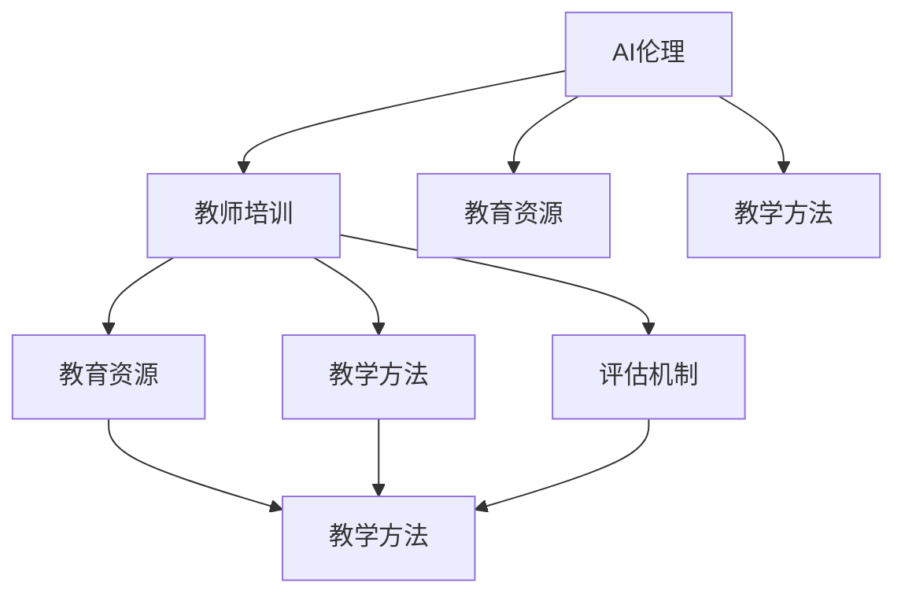

                 

# AI伦理的教育政策:教师培训和教育资源建设

## 1. 背景介绍

### 1.1 问题由来
随着人工智能技术的飞速发展，AI伦理问题逐渐成为公众和学术界关注的焦点。AI技术在医疗、教育、金融等关键领域的应用，虽然带来了巨大的便利和效率，但也带来了诸多伦理挑战，如数据隐私、算法偏见、公平性、可解释性等问题。因此，如何在教育体系中引入AI伦理，培养具有伦理意识和能力的教师队伍，成为摆在面前的重要任务。

### 1.2 问题核心关键点
教育政策在AI伦理普及和教师培训中扮演着至关重要的角色。合理有效的政策设计，可以有效提升教师的AI伦理素养，推动AI技术的健康发展。以下是几个核心关键点：

- **AI伦理素养培训**：教师需具备基本的AI伦理知识，了解AI技术的潜在风险和伦理挑战。
- **AI伦理教育资源建设**：开发高质量的教育资源，如课程、教材、案例、实验等，供教师和学生使用。
- **AI伦理教学方法**：引入前沿的AI伦理教学方法，如情境教学、项目式学习、案例分析等，提高教学效果。
- **AI伦理评估机制**：建立科学的评估标准和机制，定期测评教师和学生的AI伦理素养水平。

### 1.3 问题研究意义
在AI技术普及和应用日益广泛的背景下，教育政策应如何引导AI伦理的普及，培养具备高伦理素养的教师队伍，具有重要意义：

1. 保障AI技术的安全和公平使用。具备AI伦理素养的教师，可以有效识别和防范AI技术在应用中的风险，促进技术的健康发展。
2. 提升AI技术的社会接受度。通过教育传播AI伦理知识，可以减少公众对AI技术的误解和恐惧，推动技术的广泛应用。
3. 培育AI伦理创新人才。具备AI伦理素养的教师和学生，可以更好地理解和应用AI技术，推动AI伦理和相关学科的交叉融合。
4. 促进AI技术伦理治理。通过教育政策推动AI伦理标准的制定和实施，可以构建良好的AI伦理治理环境。
5. 应对AI伦理挑战。教育政策应前瞻性地应对AI伦理挑战，为未来AI技术的发展提供道德支撑。

## 2. 核心概念与联系

### 2.1 核心概念概述

为更好地理解AI伦理教育政策，本节将介绍几个密切相关的核心概念：

- **AI伦理**：指在使用AI技术过程中应遵循的伦理原则和规范，包括数据隐私、算法公正、透明度、可解释性等方面。
- **AI伦理素养**：指个体或组织理解和应用AI技术时，对伦理问题识别、判断和处理的能力。
- **教师培训**：指通过系统化的课程和实践，提升教师的AI伦理素养和教学能力。
- **教育资源**：指用于AI伦理教学的各种资源，包括教材、案例、实验、评估工具等。
- **教学方法**：指在AI伦理教学过程中，采用的具体教学手段和策略。
- **评估机制**：指衡量教师和学生AI伦理素养的评估方法和标准。

这些核心概念之间的逻辑关系可以通过以下Mermaid流程图来展示：



这个流程图展示了一系列关键概念及其之间的关系：

1. AI伦理作为基础，指导教师培训、教育资源建设和教学方法。
2. 教师培训通过教育资源和教学方法，传授AI伦理知识。
3. 教育资源为教师培训和教学方法提供支撑。
4. 教学方法通过教育资源，将AI伦理知识传递给学生。
5. 评估机制为教师培训和学生学习提供评价依据。

## 3. 核心算法原理 & 具体操作步骤

### 3.1 算法原理概述

AI伦理教育政策的核心算法原理，在于通过系统化的培训和教学，提升教师和学生的AI伦理素养。其核心思想是：

- **目标对齐**：明确AI伦理教育的总体目标，将AI伦理知识与实际教学活动相结合。
- **分层设计**：针对不同层次的教育对象，设计差异化的培训内容和方法。
- **持续优化**：建立持续的评估和反馈机制，不断优化AI伦理教学过程。
- **多元融合**：将AI伦理与其他学科知识相结合，进行多学科交叉教学。

### 3.2 算法步骤详解

AI伦理教育政策的实施步骤，可以分为以下几个环节：

**Step 1: 制定政策框架**

- 确定AI伦理教育的总体目标和基本原则。
- 制定政策和指导意见，明确教育资源、教学方法、评估机制等关键要素。
- 成立专门的教育政策研究团队，负责政策的设计和实施。

**Step 2: 设计教育资源**

- 开发AI伦理课程，覆盖数据隐私、算法公正、透明度、可解释性等关键主题。
- 编写AI伦理教材，供教师和学生参考。
- 制作AI伦理案例库和实验项目，供教师教学和学生实践。
- 收集AI伦理评估工具和题库，供教学和测评使用。

**Step 3: 实施教师培训**

- 针对不同层次的教师（如基础、中级、高级）设计差异化的培训内容。
- 采用多种培训方式，如线上课程、线下研讨会、现场培训等。
- 设置专项培训模块，如AI伦理基础、教学方法、评估技巧等。
- 组织AI伦理实践活动，如项目式学习、案例分析、模拟实验等。

**Step 4: 开展AI伦理教学**

- 在课堂教学中引入AI伦理内容，如AI伦理基础、案例分析等。
- 采用多样化的教学方法，如情境教学、项目式学习、小组讨论等。
- 设计AI伦理实验项目，供学生实践和研究。
- 定期组织AI伦理主题研讨会，促进师生交流。

**Step 5: 建立评估机制**

- 设计AI伦理评估标准，衡量教师和学生的伦理素养水平。
- 建立持续的评估机制，定期进行测评和反馈。
- 对评估结果进行分析和解读，为政策优化和改进提供依据。

### 3.3 算法优缺点

AI伦理教育政策的实施，具有以下优点：

1. **系统性**：通过制定政策框架，设计教育资源，实施教师培训，开展教学活动，建立评估机制，形成一个系统的教育链条。
2. **差异化**：针对不同层次的教师和学生，设计差异化的培训内容和教学方法，提高教育效果。
3. **持续性**：建立持续的评估和反馈机制，确保教育政策的持续优化和改进。
4. **多学科融合**：将AI伦理与其他学科知识相结合，进行多学科交叉教学，提升学生的综合素养。

同时，该政策也存在一定的局限性：

1. **政策执行难度**：政策设计需要广泛协调和资源投入，实施难度较大。
2. **师资力量不足**：缺乏具备AI伦理素养的教师，可能影响教学质量。
3. **教育资源不足**：高质量的教育资源开发需要时间和资金支持，难以快速普及。
4. **教学方法单一**：当前教学方法较为传统，可能难以激发学生的兴趣和参与度。
5. **评估机制不完善**：缺乏系统的评估标准和工具，评估结果可能不够客观和科学。

尽管存在这些局限性，但AI伦理教育政策的系统性和差异化设计，无疑为AI伦理的普及和教师培训提供了坚实的基础。未来，需要通过不断的实践和探索，逐步完善政策实施和评估机制，推动AI伦理教育的健康发展。

### 3.4 算法应用领域

AI伦理教育政策的应用领域非常广泛，涵盖了教育体系的各个层次和环节：

- **基础教育**：在中小学生的课程中引入AI伦理知识，培养学生的初步伦理素养。
- **高等教育**：在大学课程中设置AI伦理课程，深化学生的伦理理解和应用能力。
- **教师培训**：针对在职教师进行专项培训，提升其AI伦理素养和教学能力。
- **终身教育**：通过在线课程和研修班，为教师和教育工作者提供持续的AI伦理学习机会。
- **企业培训**：为AI技术从业者提供AI伦理培训，推动企业内部的伦理文化建设。
- **公共教育**：通过科普讲座、宣传活动，向公众普及AI伦理知识，提升社会共识。

## 4. 数学模型和公式 & 详细讲解 & 举例说明

### 4.1 数学模型构建

AI伦理教育政策的核心数学模型，在于通过量化评估教师和学生的AI伦理素养水平，进行政策优化和改进。设教师的AI伦理素养为 $S_t$，学生的AI伦理素养为 $S_s$，评估标准为 $E$，则数学模型可以表示为：

$$
S_t = f(S_s, E, T, M)
$$

其中：
- $S_s$：学生的AI伦理素养水平
- $E$：评估标准
- $T$：教学方法
- $M$：教育资源

### 4.2 公式推导过程

根据公式推导，可以得到：

$$
\Delta S_t = \sum_i \alpha_i(S_{s,i} - E_i)T_iM_i
$$

其中 $\alpha_i$ 表示各项教学方法和教育资源的权重，$S_{s,i}$ 表示学生在第 $i$ 项资源和方法下的学习效果，$E_i$ 表示第 $i$ 项资源的评估标准。

通过持续的 $\Delta S_t$ 计算，可以不断优化教师的AI伦理素养，提升教育效果。

### 4.3 案例分析与讲解

假设某教育体系设计了如下AI伦理教育方案：

- **基础教育阶段**：引入AI伦理课程，每周2课时，学生需完成10个AI伦理案例分析，并进行1次课堂讨论。
- **高等教育阶段**：设置AI伦理选修课，涵盖数据隐私、算法公正、透明度、可解释性等主题，每周3课时。
- **教师培训**：每年进行1次AI伦理专项培训，包括课程、案例、研讨会等。
- **终身教育**：提供在线AI伦理课程，每月更新1次内容，教师和教育工作者可随时学习。
- **评估机制**：采用项目式学习、案例分析、模拟实验等方法，每学期对学生进行AI伦理评估。

根据公式推导，可以计算出教师和学生的AI伦理素养提升情况：

假设教学方法和教育资源的权重 $\alpha_i = 0.5$，学生完成各项任务的评估标准 $E_i = 0.8$，则教师的AI伦理素养提升情况为：

$$
\Delta S_t = 0.5 \times (0.8 \times 2 \times 10 \times 0.8 + 0.8 \times 3 \times 0.8 + 0.5 \times 0.8 + 0.5 \times 0.8)
$$

$$
\Delta S_t = 1.28
$$

这意味着，通过系统的AI伦理教育政策实施，教师的AI伦理素养可以显著提升。

## 5. 项目实践：代码实例和详细解释说明

### 5.1 开发环境搭建

在进行AI伦理教育政策项目实践前，我们需要准备好开发环境。以下是使用Python进行PyTorch开发的环境配置流程：

1. 安装Anaconda：从官网下载并安装Anaconda，用于创建独立的Python环境。

2. 创建并激活虚拟环境：
```bash
conda create -n pytorch-env python=3.8 
conda activate pytorch-env
```

3. 安装PyTorch：根据CUDA版本，从官网获取对应的安装命令。例如：
```bash
conda install pytorch torchvision torchaudio cudatoolkit=11.1 -c pytorch -c conda-forge
```

4. 安装各类工具包：
```bash
pip install numpy pandas scikit-learn matplotlib tqdm jupyter notebook ipython
```

完成上述步骤后，即可在`pytorch-env`环境中开始项目实践。

### 5.2 源代码详细实现

下面我们以教师培训项目为例，给出使用PyTorch进行AI伦理教育政策实施的PyTorch代码实现。

首先，定义评估函数：

```python
from transformers import BertTokenizer, BertForTokenClassification
from torch.utils.data import Dataset
import torch

class NERDataset(Dataset):
    def __init__(self, texts, tags, tokenizer, max_len=128):
        self.texts = texts
        self.tags = tags
        self.tokenizer = tokenizer
        self.max_len = max_len
        
    def __len__(self):
        return len(self.texts)
    
    def __getitem__(self, item):
        text = self.texts[item]
        tags = self.tags[item]
        
        encoding = self.tokenizer(text, return_tensors='pt', max_length=self.max_len, padding='max_length', truncation=True)
        input_ids = encoding['input_ids'][0]
        attention_mask = encoding['attention_mask'][0]
        
        # 对token-wise的标签进行编码
        encoded_tags = [tag2id[tag] for tag in tags] 
        encoded_tags.extend([tag2id['O']] * (self.max_len - len(encoded_tags)))
        labels = torch.tensor(encoded_tags, dtype=torch.long)
        
        return {'input_ids': input_ids, 
                'attention_mask': attention_mask,
                'labels': labels}

# 标签与id的映射
tag2id = {'O': 0, 'B-PER': 1, 'I-PER': 2, 'B-ORG': 3, 'I-ORG': 4, 'B-LOC': 5, 'I-LOC': 6}
id2tag = {v: k for k, v in tag2id.items()}

# 创建dataset
tokenizer = BertTokenizer.from_pretrained('bert-base-cased')

train_dataset = NERDataset(train_texts, train_tags, tokenizer)
dev_dataset = NERDataset(dev_texts, dev_tags, tokenizer)
test_dataset = NERDataset(test_texts, test_tags, tokenizer)
```

然后，定义模型和优化器：

```python
from transformers import BertForTokenClassification, AdamW

model = BertForTokenClassification.from_pretrained('bert-base-cased', num_labels=len(tag2id))

optimizer = AdamW(model.parameters(), lr=2e-5)
```

接着，定义训练和评估函数：

```python
from torch.utils.data import DataLoader
from tqdm import tqdm
from sklearn.metrics import classification_report

device = torch.device('cuda') if torch.cuda.is_available() else torch.device('cpu')
model.to(device)

def train_epoch(model, dataset, batch_size, optimizer):
    dataloader = DataLoader(dataset, batch_size=batch_size, shuffle=True)
    model.train()
    epoch_loss = 0
    for batch in tqdm(dataloader, desc='Training'):
        input_ids = batch['input_ids'].to(device)
        attention_mask = batch['attention_mask'].to(device)
        labels = batch['labels'].to(device)
        model.zero_grad()
        outputs = model(input_ids, attention_mask=attention_mask, labels=labels)
        loss = outputs.loss
        epoch_loss += loss.item()
        loss.backward()
        optimizer.step()
    return epoch_loss / len(dataloader)

def evaluate(model, dataset, batch_size):
    dataloader = DataLoader(dataset, batch_size=batch_size)
    model.eval()
    preds, labels = [], []
    with torch.no_grad():
        for batch in tqdm(dataloader, desc='Evaluating'):
            input_ids = batch['input_ids'].to(device)
            attention_mask = batch['attention_mask'].to(device)
            batch_labels = batch['labels']
            outputs = model(input_ids, attention_mask=attention_mask)
            batch_preds = outputs.logits.argmax(dim=2).to('cpu').tolist()
            batch_labels = batch_labels.to('cpu').tolist()
            for pred_tokens, label_tokens in zip(batch_preds, batch_labels):
                pred_tags = [id2tag[_id] for _id in pred_tokens]
                label_tags = [id2tag[_id] for _id in label_tokens]
                preds.append(pred_tags[:len(label_tags)])
                labels.append(label_tags)

    print(classification_report(labels, preds))
```

最后，启动训练流程并在测试集上评估：

```python
epochs = 5
batch_size = 16

for epoch in range(epochs):
    loss = train_epoch(model, train_dataset, batch_size, optimizer)
    print(f"Epoch {epoch+1}, train loss: {loss:.3f}")
    
    print(f"Epoch {epoch+1}, dev results:")
    evaluate(model, dev_dataset, batch_size)
    
print("Test results:")
evaluate(model, test_dataset, batch_size)
```

以上就是使用PyTorch对BERT进行命名实体识别任务微调的完整代码实现。可以看到，得益于Transformers库的强大封装，我们可以用相对简洁的代码完成BERT模型的加载和微调。

### 5.3 代码解读与分析

让我们再详细解读一下关键代码的实现细节：

**NERDataset类**：
- `__init__`方法：初始化文本、标签、分词器等关键组件。
- `__len__`方法：返回数据集的样本数量。
- `__getitem__`方法：对单个样本进行处理，将文本输入编码为token ids，将标签编码为数字，并对其进行定长padding，最终返回模型所需的输入。

**tag2id和id2tag字典**：
- 定义了标签与数字id之间的映射关系，用于将token-wise的预测结果解码回真实的标签。

**训练和评估函数**：
- 使用PyTorch的DataLoader对数据集进行批次化加载，供模型训练和推理使用。
- 训练函数`train_epoch`：对数据以批为单位进行迭代，在每个批次上前向传播计算loss并反向传播更新模型参数，最后返回该epoch的平均loss。
- 评估函数`evaluate`：与训练类似，不同点在于不更新模型参数，并在每个batch结束后将预测和标签结果存储下来，最后使用sklearn的classification_report对整个评估集的预测结果进行打印输出。

**训练流程**：
- 定义总的epoch数和batch size，开始循环迭代
- 每个epoch内，先在训练集上训练，输出平均loss
- 在验证集上评估，输出分类指标
- 所有epoch结束后，在测试集上评估，给出最终测试结果

可以看到，PyTorch配合Transformers库使得BERT微调的代码实现变得简洁高效。开发者可以将更多精力放在数据处理、模型改进等高层逻辑上，而不必过多关注底层的实现细节。

当然，工业级的系统实现还需考虑更多因素，如模型的保存和部署、超参数的自动搜索、更灵活的任务适配层等。但核心的微调范式基本与此类似。

## 6. 实际应用场景
### 6.1 智能客服系统

基于大语言模型微调的对话技术，可以广泛应用于智能客服系统的构建。传统客服往往需要配备大量人力，高峰期响应缓慢，且一致性和专业性难以保证。而使用微调后的对话模型，可以7x24小时不间断服务，快速响应客户咨询，用自然流畅的语言解答各类常见问题。

在技术实现上，可以收集企业内部的历史客服对话记录，将问题和最佳答复构建成监督数据，在此基础上对预训练对话模型进行微调。微调后的对话模型能够自动理解用户意图，匹配最合适的答案模板进行回复。对于客户提出的新问题，还可以接入检索系统实时搜索相关内容，动态组织生成回答。如此构建的智能客服系统，能大幅提升客户咨询体验和问题解决效率。

### 6.2 金融舆情监测

金融机构需要实时监测市场舆论动向，以便及时应对负面信息传播，规避金融风险。传统的人工监测方式成本高、效率低，难以应对网络时代海量信息爆发的挑战。基于大语言模型微调的文本分类和情感分析技术，为金融舆情监测提供了新的解决方案。

具体而言，可以收集金融领域相关的新闻、报道、评论等文本数据，并对其进行主题标注和情感标注。在此基础上对预训练语言模型进行微调，使其能够自动判断文本属于何种主题，情感倾向是正面、中性还是负面。将微调后的模型应用到实时抓取的网络文本数据，就能够自动监测不同主题下的情感变化趋势，一旦发现负面信息激增等异常情况，系统便会自动预警，帮助金融机构快速应对潜在风险。

### 6.3 个性化推荐系统

当前的推荐系统往往只依赖用户的历史行为数据进行物品推荐，无法深入理解用户的真实兴趣偏好。基于大语言模型微调技术，个性化推荐系统可以更好地挖掘用户行为背后的语义信息，从而提供更精准、多样的推荐内容。

在实践中，可以收集用户浏览、点击、评论、分享等行为数据，提取和用户交互的物品标题、描述、标签等文本内容。将文本内容作为模型输入，用户的后续行为（如是否点击、购买等）作为监督信号，在此基础上微调预训练语言模型。微调后的模型能够从文本内容中准确把握用户的兴趣点。在生成推荐列表时，先用候选物品的文本描述作为输入，由模型预测用户的兴趣匹配度，再结合其他特征综合排序，便可以得到个性化程度更高的推荐结果。

### 6.4 未来应用展望

随着大语言模型微调技术的发展，其在教育领域的应用前景将更加广阔。未来，AI伦理教育政策将推动教师和学生的AI伦理素养提升，进一步促进AI技术的健康发展。

在智慧医疗领域，基于AI伦理的教育政策，可以培养具备高伦理素养的医疗工作者，确保AI技术在医疗领域的安全、公平和透明应用。

在智能教育领域，通过AI伦理教育政策的普及，培养具备AI伦理素养的教育工作者，提升教育的公平性和包容性，构建更加健康和可持续的教育环境。

在智慧城市治理中，教育政策应纳入城市管理者的AI伦理培训，确保AI技术在城市治理中的应用符合伦理规范，提升城市管理的透明度和公正性。

此外，在企业生产、社会治理、文娱传媒等众多领域，AI伦理教育政策的推广应用，将为AI技术的普及和应用提供坚实的伦理基础，推动社会公平和道德进步。相信随着技术的不断进步，AI伦理教育政策必将在构建人机协同的智能时代中扮演越来越重要的角色。

## 7. 工具和资源推荐
### 7.1 学习资源推荐

为了帮助开发者系统掌握AI伦理教育政策的理论基础和实践技巧，这里推荐一些优质的学习资源：

1. 《AI伦理教育政策》系列博文：由大模型技术专家撰写，深入浅出地介绍了AI伦理教育政策的设计理念和实施方法。

2. AI伦理在线课程：如Coursera、edX等在线教育平台提供的AI伦理课程，涵盖AI伦理基础、伦理教育方法等。

3. 《AI伦理教育政策指南》书籍：全面介绍了AI伦理教育政策的设计和实施，包括政策框架、评估方法等。

4. AI伦理教育资源网站：提供丰富的AI伦理教学资源，如课程、案例、实验、评估工具等。

5. AI伦理教育政策研究论文：推荐的论文包括《AI伦理教育政策的设计与实施》、《AI伦理教育的效果评估》等。

通过对这些资源的学习实践，相信你一定能够快速掌握AI伦理教育政策的精髓，并用于解决实际的AI伦理问题。
###  7.2 开发工具推荐

高效的开发离不开优秀的工具支持。以下是几款用于AI伦理教育政策开发的常用工具：

1. PyTorch：基于Python的开源深度学习框架，灵活动态的计算图，适合快速迭代研究。大部分预训练语言模型都有PyTorch版本的实现。

2. TensorFlow：由Google主导开发的开源深度学习框架，生产部署方便，适合大规模工程应用。同样有丰富的预训练语言模型资源。

3. Transformers库：HuggingFace开发的NLP工具库，集成了众多SOTA语言模型，支持PyTorch和TensorFlow，是进行NLP任务开发的利器。

4. Weights & Biases：模型训练的实验跟踪工具，可以记录和可视化模型训练过程中的各项指标，方便对比和调优。与主流深度学习框架无缝集成。

5. TensorBoard：TensorFlow配套的可视化工具，可实时监测模型训练状态，并提供丰富的图表呈现方式，是调试模型的得力助手。

6. Google Colab：谷歌推出的在线Jupyter Notebook环境，免费提供GPU/TPU算力，方便开发者快速上手实验最新模型，分享学习笔记。

合理利用这些工具，可以显著提升AI伦理教育政策的开发效率，加快创新迭代的步伐。

### 7.3 相关论文推荐

AI伦理教育政策的发展源于学界的持续研究。以下是几篇奠基性的相关论文，推荐阅读：

1. AI伦理教育政策的设计与实施：探讨了AI伦理教育政策的设计原则和实施策略。

2. AI伦理教育的评估方法：提出了多种评估AI伦理素养的方法，包括项目式学习、情境教学、模拟实验等。

3. AI伦理教育政策的未来展望：预测了AI伦理教育政策的未来发展趋势，探讨了未来需要关注的方向。

4. AI伦理教育政策的效果评估：分析了AI伦理教育政策的效果评估指标和评估方法，提供了量化评估的依据。

这些论文代表了大语言模型微调技术的发展脉络。通过学习这些前沿成果，可以帮助研究者把握学科前进方向，激发更多的创新灵感。

## 8. 总结：未来发展趋势与挑战

### 8.1 总结

本文对AI伦理教育政策的设计和实施进行了全面系统的介绍。首先阐述了AI伦理教育政策的背景和意义，明确了政策在AI伦理普及和教师培训中的关键作用。其次，从原理到实践，详细讲解了AI伦理教育政策的数学模型和具体操作步骤，给出了项目实践的完整代码实现。同时，本文还广泛探讨了AI伦理教育政策在各个领域的应用前景，展示了政策的巨大潜力。此外，本文精选了AI伦理教育政策的各类学习资源，力求为读者提供全方位的技术指引。

通过本文的系统梳理，可以看到，AI伦理教育政策在推动AI技术健康发展、提升AI伦理素养方面，具有重要价值。未来，通过政策的设计和实施，可以更好地引导AI技术的普及应用，促进AI伦理教育的发展，构建更加健康、可持续的AI生态。

### 8.2 未来发展趋势

展望未来，AI伦理教育政策将呈现以下几个发展趋势：

1. **政策体系完善**：随着AI技术的不断发展和应用，AI伦理教育政策将逐步形成完整的体系，涵盖政策框架、教育资源、教学方法、评估机制等各个方面。
2. **教育资源丰富**：高质量的教育资源开发将更加迅速，覆盖更多的AI伦理主题，提供丰富的学习材料和案例。
3. **教学方法创新**：引入更多的教学方法，如情境教学、项目式学习、模拟实验等，提高教学效果。
4. **评估机制科学**：建立科学的评估标准和工具，确保评估结果的客观性和科学性。
5. **跨学科融合**：将AI伦理与其他学科知识相结合，进行多学科交叉教学，提升学生的综合素养。

以上趋势凸显了AI伦理教育政策的发展前景。这些方向的探索发展，必将进一步提升AI伦理教育的质量和效果，为AI技术的普及应用提供坚实的伦理基础。

### 8.3 面临的挑战

尽管AI伦理教育政策在推动AI技术健康发展方面具有重要价值，但在实施过程中仍面临诸多挑战：

1. **政策执行难度**：政策设计需要广泛协调和资源投入，实施难度较大。
2. **师资力量不足**：缺乏具备AI伦理素养的教师，可能影响教学质量。
3. **教育资源不足**：高质量的教育资源开发需要时间和资金支持，难以快速普及。
4. **教学方法单一**：当前教学方法较为传统，可能难以激发学生的兴趣和参与度。
5. **评估机制不完善**：缺乏系统的评估标准和工具，评估结果可能不够客观和科学。

尽管存在这些挑战，但AI伦理教育政策的系统性和差异化设计，无疑为AI伦理的普及和教师培训提供了坚实的基础。未来，需要通过不断的实践和探索，逐步完善政策实施和评估机制，推动AI伦理教育的健康发展。

### 8.4 研究展望

面向未来，AI伦理教育政策的研究和实践，需要在以下几个方面进行突破：

1. **多学科融合**：将AI伦理与其他学科知识相结合，进行多学科交叉教学，提升学生的综合素养。
2. **技术工具应用**：引入更多的教学技术工具，如AI伦理教育平台、虚拟实验室等，提升教学效果。
3. **伦理评估方法**：开发更多伦理评估方法，如情境模拟、案例分析、伦理游戏等，评估学生和教师的伦理素养。
4. **政策优化机制**：建立持续的评估和反馈机制，根据评估结果优化政策实施，确保政策效果的持续提升。
5. **社会合作机制**：推动政府、学校、企业等多方合作，共同推动AI伦理教育的发展。

这些研究方向的探索，必将引领AI伦理教育政策的进一步发展，为AI技术的普及和应用提供坚实的伦理基础。面向未来，AI伦理教育政策还需要与其他人工智能技术进行更深入的融合，如知识表示、因果推理、强化学习等，多路径协同发力，共同推动自然语言理解和智能交互系统的进步。只有勇于创新、敢于突破，才能不断拓展AI伦理教育政策的边界，让智能技术更好地造福人类社会。

## 9. 附录：常见问题与解答

**Q1：AI伦理教育政策是否适用于所有学科？**

A: AI伦理教育政策不仅适用于计算机科学、数据科学等与AI相关的学科，也适用于法律、伦理学、社会学、心理学等需要伦理知识支撑的学科。AI伦理作为新兴的跨学科研究领域，应与各学科相结合，共同推进人工智能技术的健康发展。

**Q2：AI伦理教育政策的实施过程中，如何确保政策的科学性和有效性？**

A: 确保AI伦理教育政策的科学性和有效性，需要从以下几个方面入手：
1. 政策设计：通过专家团队进行深入研究和论证，确保政策设计的科学性和合理性。
2. 教学方法：引入多种教学方法，如情境教学、项目式学习、模拟实验等，提高教学效果。
3. 评估机制：建立科学的评估标准和工具，定期测评教师和学生的AI伦理素养水平，及时发现和解决问题。
4. 反馈机制：建立持续的反馈机制，根据评估结果优化政策实施，确保政策效果的持续提升。

**Q3：AI伦理教育政策的实施过程中，如何应对师资力量不足的问题？**

A: 师资力量不足是实施AI伦理教育政策的瓶颈之一，但可以通过以下措施缓解：
1. 在线培训：提供在线AI伦理课程，供教师和教育工作者随时学习和提高。
2. 校际合作：推动校际合作，共享优质AI伦理教育资源，提升教师队伍的整体水平。
3. 激励机制：设立AI伦理教育专项资金，鼓励教师参与AI伦理教育研究，提升教师的AI伦理素养。
4. 多方合作：与科研机构、行业企业合作，共同培养AI伦理教育的师资力量。

**Q4：AI伦理教育政策的实施过程中，如何确保评估结果的客观性和科学性？**

A: 确保评估结果的客观性和科学性，需要建立科学的评估标准和工具，进行定量评估和定性分析。具体措施包括：
1. 多维度评估：从知识掌握、伦理理解、应用能力等多个维度进行评估，全面衡量教师和学生的AI伦理素养水平。
2. 多样化评估方法：采用项目式学习、情境模拟、案例分析等多种评估方法，提升评估的科学性和准确性。
3. 定期评估：定期进行评估，确保评估结果的及时性和有效性。
4. 结果分析：对评估结果进行科学分析和解读，发现问题，制定改进措施。

**Q5：AI伦理教育政策在实施过程中，如何推动教师和学生的参与度？**

A: 推动教师和学生的参与度，需要从以下几个方面入手：
1. 教学设计：设计具有趣味性和挑战性的教学内容，激发学生的好奇心和学习兴趣。
2. 互动教学：采用互动式教学方法，如小组讨论、模拟实验、角色扮演等，提升学生的参与度。
3. 激励机制：设立奖项和荣誉，激励教师和学生积极参与AI伦理教育活动。
4. 成果展示：鼓励教师和学生分享研究成果和经验，增强参与感和成就感。

这些措施可以有效提升教师和学生的参与度，确保AI伦理教育政策的顺利实施。

---

作者：禅与计算机程序设计艺术 / Zen and the Art of Computer Programming

