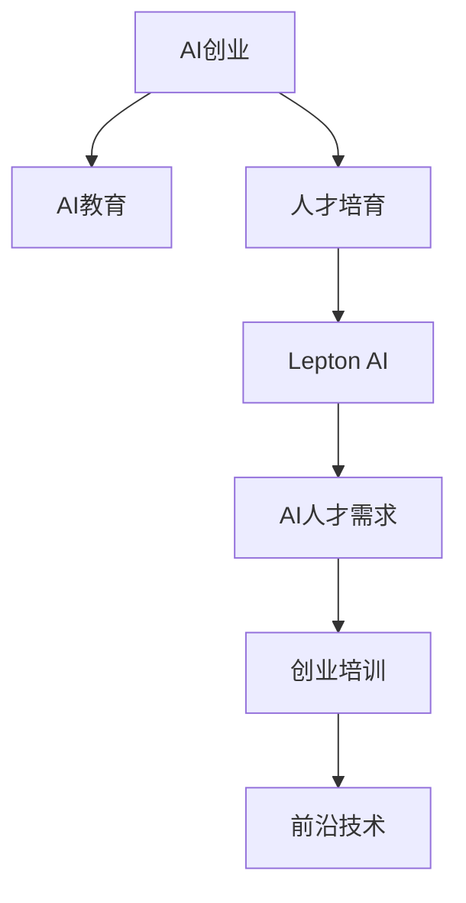

                 

# AI创业的人才培养：Lepton AI的教育计划

> 关键词：人工智能创业, AI教育, 人才培育, Lepton AI, AI人才需求, 创业培训, 前沿技术

## 1. 背景介绍

随着人工智能技术的飞速发展，AI创业市场正迎来空前的繁荣。但与此同时，优质AI人才的短缺也逐渐成为了创业公司的重大挑战。为了推动AI创业的持续发展，Lepton AI联合行业领军企业和教育机构，推出了“AI创业人才培育计划”，致力于为初创公司培育出一批兼具技术深度和业务敏锐度的高素质AI人才。

本计划旨在通过系统的理论学习、实践指导和项目实战，全面提升AI创业者在机器学习、深度学习、自然语言处理、计算机视觉等核心领域的技能，并掌握数据挖掘、模型训练、产品部署等关键环节的实战能力。通过本计划，Lepton AI将助力AI创业者打造出具备核心竞争力的人工智能创业团队，推动更多前沿科技转化为实际应用。

## 2. 核心概念与联系

### 2.1 核心概念概述

为更好地理解Lepton AI的AI创业人才培养计划，本节将介绍几个关键核心概念：

- **AI创业**：指利用人工智能技术，解决实际问题，创建新型商业模式和产业生态的创新创业过程。AI创业不仅涉及技术创新，更需结合业务场景，解决实际问题。

- **AI教育**：包括AI基础理论教育、实践技能培训、项目实战经验等，旨在培养具备解决实际问题能力的AI人才。

- **人才培育**：结合教育资源和企业需求，针对AI创业者的个性化培养需求，量身定制教育内容。

- **Lepton AI**：致力于人工智能创业教育的科技企业，汇集顶级AI专家、创业者、教育机构等资源，提供全方位的AI创业支持。

- **AI人才需求**：包括机器学习工程师、数据科学家、算法研究员、AI产品经理等多岗位的人才需求。

- **创业培训**：涵盖AI技术基础、商业洞察、项目管理、团队协作等各方面内容，助力AI创业者快速提升创业能力。

- **前沿技术**：包括深度学习、自然语言处理、计算机视觉、强化学习等最新AI技术，推动AI创业者的技术迭代。

这些概念之间的逻辑关系可以通过以下Mermaid流程图来展示：



这个流程图展示出Lepton AI的AI创业人才培养计划的核心概念及其关联关系：

1. AI创业为人才培养提供了目标导向，通过解决实际问题激发创业者的动力。
2. AI教育提供了必要的理论和技术基础，使创业者具备必要的知识储备。
3. 人才培育结合AI创业者个性化需求，量身定制教育内容，增强其业务理解能力。
4. Lepton AI作为资源汇集者，提供全方位的AI创业支持。
5. AI人才需求明确了创业者需要掌握的核心技能，指导教育内容的制定。
6. 创业培训帮助创业者掌握商业洞察、项目管理等综合能力。
7. 前沿技术推动AI创业者不断学习新技术，提升技术创新能力。

## 3. 核心算法原理 & 具体操作步骤
### 3.1 算法原理概述

Lepton AI的AI创业人才培养计划，基于监督学习、迁移学习和增强学习等多种算法原理进行系统设计，涵盖从理论学习到实践技能训练的完整过程。

### 3.2 算法步骤详解

1. **理论学习**：采用基于前沿教材和科研论文的教学方式，涵盖机器学习、深度学习、自然语言处理、计算机视觉等核心领域的基础理论和算法。

2. **实践技能训练**：通过实际项目和代码实现，帮助学员掌握数据挖掘、模型训练、算法调优、模型部署等关键技术。

3. **项目实战**：提供多个真实业务场景下的项目案例，使学员能够实践应用AI技术解决实际问题。

4. **创业培训**：结合行业专家讲座、案例分享、项目导师指导等形式，提升学员的商业洞察、团队协作和项目管理能力。

5. **前沿技术跟踪**：定期推送最新AI技术动态和论文研究，帮助学员保持对前沿技术的敏感度和掌握能力。

### 3.3 算法优缺点

Lepton AI的教育计划具有以下优点：
1. **系统性**：涵盖AI创业所需的关键知识和技能，通过理论学习、实践技能训练、项目实战等多环节系统性培养。
2. **实战性**：强调项目实战，帮助学员直接面对实际问题，提升解决问题的能力。
3. **前沿性**：结合最新AI技术动态，使学员保持对前沿技术的敏锐度。
4. **全面性**：结合教育机构和企业需求，提供全方位的AI创业支持。

同时，该计划也存在一些局限性：
1. **时间成本**：系统的理论学习、实践技能训练和项目实战需要较多时间，短期内难以见效。
2. **师资力量**：优秀AI导师资源有限，难以同时兼顾大量学员的个性化指导需求。
3. **资源投入**：高质量的教学资源、实践设备和项目案例需要较高投入。

尽管存在这些局限性，Lepton AI的教育计划仍然是大规模AI创业人才培养的重要探索方向，具有较高的参考价值。

### 3.4 算法应用领域

Lepton AI的教育计划已经应用于多个AI创业培训项目，涵盖了智能制造、智慧医疗、金融科技、自动驾驶等多个前沿领域，具体应用如下：

- **智能制造**：利用机器视觉技术进行产品检测、质量控制、工艺优化等。
- **智慧医疗**：采用自然语言处理技术进行病历分析、医学影像识别、智能诊断等。
- **金融科技**：通过深度学习技术进行信用评估、风险管理、智能投顾等。
- **自动驾驶**：运用计算机视觉和强化学习技术进行场景感知、行为预测、路径规划等。

Lepton AI的教育计划覆盖了AI创业的多样化需求，为创业公司培养出了一批具备多领域技术能力的复合型AI人才。

## 4. 数学模型和公式 & 详细讲解  
### 4.1 数学模型构建

Lepton AI的教育计划涉及多个领域的AI技术，以下是几个核心领域的数学模型构建概述：

1. **机器学习**：
   - 线性回归模型：$\hat{y} = \theta_0 + \theta_1x_1 + \theta_2x_2 + \cdots + \theta_nx_n$
   - 逻辑回归模型：$\hat{y} = \frac{1}{1 + e^{-\hat{z}}}, \hat{z} = \theta_0 + \theta_1x_1 + \theta_2x_2 + \cdots + \theta_nx_n$

2. **深度学习**：
   - 神经网络模型：$\hat{y} = \phi(\theta \cdot z + b)$，其中 $\phi$ 为激活函数，$z$ 为输入特征。

3. **自然语言处理**：
   - 文本分类模型：$\hat{y} = \sigma(\theta^T x + b)$，其中 $x$ 为文本特征向量，$\sigma$ 为Sigmoid函数。

4. **计算机视觉**：
   - 卷积神经网络（CNN）：$\hat{y} = \phi(\theta \cdot F(z) + b)$，其中 $z$ 为图像特征，$F$ 为卷积操作。

### 4.2 公式推导过程

以线性回归模型为例，进行数学公式推导：

设训练集为 $(x_i, y_i)$，$i=1,2,\cdots,N$。最小化均方误差损失函数：

$$
\mathcal{L}(\theta) = \frac{1}{2N} \sum_{i=1}^N(y_i - \hat{y}_i)^2
$$

其中 $\hat{y}_i = \theta_0 + \theta_1x_{i1} + \theta_2x_{i2} + \cdots + \theta_nx_{in}$。

最小化损失函数的梯度下降公式为：

$$
\theta_k = \theta_k - \eta\frac{\partial\mathcal{L}(\theta)}{\partial\theta_k}, \quad k = 0, 1, 2, \cdots, n
$$

### 4.3 案例分析与讲解

以智慧医疗中的医学影像分类为例，分析模型构建和应用过程。

1. **数据准备**：收集包含疾病标签的医学影像数据集。
2. **模型构建**：使用卷积神经网络对医学影像进行特征提取，并结合全连接层进行分类。
3. **模型训练**：采用随机梯度下降（SGD）算法，最小化交叉熵损失函数，训练模型。
4. **模型评估**：在验证集上测试模型，采用混淆矩阵、准确率等指标评估模型性能。
5. **模型部署**：将训练好的模型集成到医疗影像分析系统中，用于疾病诊断和预测。

## 5. 项目实践：代码实例和详细解释说明
### 5.1 开发环境搭建

为了实现Lepton AI的教育计划，需要搭建相应的开发环境。以下是详细的步骤：

1. **安装Python**：选择最新版本的Python，安装依赖包，如NumPy、Pandas、SciPy等。
2. **配置环境变量**：将Python路径添加到系统环境变量中。
3. **安装机器学习库**：安装常用的机器学习库，如scikit-learn、TensorFlow、Keras等。
4. **搭建深度学习平台**：可以使用深度学习框架TensorFlow或PyTorch，搭建深度学习平台，便于模型开发和训练。
5. **安装AI教育平台**：安装Lepton AI提供的教育平台，如Kaggle、LeptonAI Edu等，进行理论学习和项目实战。

### 5.2 源代码详细实现

以下是一个基于TensorFlow的简单医学影像分类项目代码示例：

```python
import tensorflow as tf
from tensorflow.keras import layers, models

# 构建卷积神经网络模型
model = models.Sequential([
    layers.Conv2D(32, (3, 3), activation='relu', input_shape=(64, 64, 3)),
    layers.MaxPooling2D((2, 2)),
    layers.Conv2D(64, (3, 3), activation='relu'),
    layers.MaxPooling2D((2, 2)),
    layers.Conv2D(128, (3, 3), activation='relu'),
    layers.MaxPooling2D((2, 2)),
    layers.Flatten(),
    layers.Dense(128, activation='relu'),
    layers.Dense(10, activation='softmax')
])

# 编译模型
model.compile(optimizer='adam', loss='sparse_categorical_crossentropy', metrics=['accuracy'])

# 加载数据集
(train_images, train_labels), (test_images, test_labels) = tf.keras.datasets.cifar10.load_data()

# 数据预处理
train_images = train_images / 255.0
test_images = test_images / 255.0

# 训练模型
model.fit(train_images, train_labels, epochs=10, validation_data=(test_images, test_labels))

# 评估模型
test_loss, test_acc = model.evaluate(test_images, test_labels)
print('Test accuracy:', test_acc)
```

### 5.3 代码解读与分析

**数据集准备**：
- 使用CIFAR-10数据集，包含60,000张32x32像素的彩色图片，分为10类。
- 将图片数据标准化到0-1范围内。

**模型构建**：
- 使用卷积层、池化层和全连接层构建卷积神经网络模型。
- 输入图片尺寸为32x32，输出层采用softmax激活函数。

**模型编译**：
- 使用Adam优化器，交叉熵损失函数，准确率作为评估指标。

**模型训练**：
- 训练10个epoch，并在验证集上进行评估。

**模型评估**：
- 在测试集上评估模型性能，输出测试准确率。

## 6. 实际应用场景
### 6.1 智能制造

Lepton AI的教育计划已经在多个智能制造项目中得到应用。以某智能制造公司为例，通过机器视觉技术，实现了生产线上的缺陷检测和质量控制，极大地提升了生产效率和产品质量。具体步骤如下：

1. **数据采集**：通过摄像头采集生产线上的产品图像。
2. **图像预处理**：对采集的图像进行去噪、归一化等预处理操作。
3. **特征提取**：使用卷积神经网络提取图像特征。
4. **模型训练**：使用训练好的模型对图像进行缺陷检测。
5. **结果输出**：根据检测结果，进行产品分类和质量评估。

Lepton AI的教育计划帮助学员掌握机器视觉技术的核心技能，解决了智能制造中的实际问题。

### 6.2 智慧医疗

智慧医疗项目中，Lepton AI的教育计划帮助学员通过自然语言处理技术进行病历分析和医学影像识别。以下是一个医学影像分类的具体案例：

1. **数据采集**：收集包含疾病标签的医学影像数据集。
2. **模型训练**：使用卷积神经网络对医学影像进行特征提取，并结合全连接层进行分类。
3. **模型评估**：在验证集上测试模型，采用混淆矩阵、准确率等指标评估模型性能。
4. **模型部署**：将训练好的模型集成到医疗影像分析系统中，用于疾病诊断和预测。

Lepton AI的教育计划通过系统的理论学习和实践训练，使学员具备了智慧医疗中的核心技术能力，提升了医疗服务质量。

### 6.3 金融科技

在金融科技领域，Lepton AI的教育计划帮助学员掌握深度学习技术，进行信用评估、风险管理、智能投顾等应用。以下是一个基于深度学习模型进行信用评估的案例：

1. **数据准备**：收集包含信用评分的历史贷款数据。
2. **模型构建**：使用深度神经网络模型进行特征提取和信用评分预测。
3. **模型训练**：采用随机梯度下降算法，最小化均方误差损失函数，训练模型。
4. **模型评估**：在验证集上测试模型，采用准确率、召回率等指标评估模型性能。
5. **模型部署**：将训练好的模型集成到贷款审批系统中，进行信用评估。

Lepton AI的教育计划通过深度学习技术的实际应用，提升了金融科技中的风险管理和决策支持能力。

### 6.4 自动驾驶

Lepton AI的教育计划还涵盖了自动驾驶项目，帮助学员掌握计算机视觉和强化学习技术，进行场景感知、行为预测、路径规划等应用。以下是一个基于计算机视觉技术的自动驾驶项目案例：

1. **数据采集**：收集包含道路交通信息的传感器数据。
2. **数据预处理**：对传感器数据进行降噪、归一化等预处理操作。
3. **模型构建**：使用卷积神经网络进行场景感知，结合强化学习算法进行路径规划。
4. **模型训练**：采用强化学习算法训练模型，优化路径规划策略。
5. **模型评估**：在测试集上评估模型性能，通过模拟驾驶测试实际应用效果。

Lepton AI的教育计划通过系统的理论学习和实践训练，使学员具备了自动驾驶中的核心技术能力，推动了自动驾驶技术的实际应用。

## 7. 工具和资源推荐
### 7.1 学习资源推荐

为了帮助学员系统掌握Lepton AI的教育计划，以下是几项推荐的学习资源：

1. **深度学习课程**：推荐参加斯坦福大学的《CS231n: Convolutional Neural Networks for Visual Recognition》课程，系统学习计算机视觉技术。
2. **机器学习课程**：推荐参加Coursera的《Machine Learning》课程，全面掌握机器学习算法和理论。
3. **自然语言处理课程**：推荐参加斯坦福大学的《CS224N: Natural Language Processing with Deep Learning》课程，深入理解自然语言处理技术。
4. **Lepton AI官方文档**：详细介绍了Lepton AI的教育计划和实践项目，包括理论学习、实践技能训练和项目实战等环节。
5. **Kaggle竞赛平台**：提供了大量数据集和竞赛项目，帮助学员在实际场景中应用AI技术。

通过这些学习资源，学员可以全面系统地掌握Lepton AI的教育计划，提升AI创业能力。

### 7.2 开发工具推荐

以下是几款用于AI创业人才培养的常用开发工具：

1. **Python**：作为AI开发的主流语言，Python简单易用，拥有丰富的第三方库和框架。
2. **TensorFlow**：Google开源的深度学习框架，支持分布式计算和模型优化，适合大规模AI项目开发。
3. **PyTorch**：Facebook开源的深度学习框架，支持动态图和静态图，适合快速原型开发和研究。
4. **Lepton AI教育平台**：提供系统的理论学习、实践技能训练和项目实战，帮助学员全面提升AI创业能力。
5. **Jupyter Notebook**：提供交互式开发环境，便于代码调试和实验。

合理利用这些工具，可以显著提升AI创业人才培养的开发效率，加快创新迭代的步伐。

### 7.3 相关论文推荐

以下是几篇与Lepton AI教育计划相关的经典论文，推荐阅读：

1. **Deep Learning for Healthcare**：深度学习在医疗领域的应用研究，涉及医学影像分类、病历分析等。
2. **Computer Vision: Algorithms and Applications**：计算机视觉技术的理论和实践，涵盖图像处理、物体识别等。
3. **Natural Language Processing with Attention Mechanisms**：自然语言处理技术的最新进展，包括注意力机制在机器翻译和文本生成中的应用。
4. **AI Ethics in the Age of Machine Learning**：探讨AI技术的伦理和社会影响，强调AI系统的可解释性和公平性。
5. **Efficient Deep Learning with Model Distillation**：模型蒸馏技术的研究进展，提升深度学习模型的泛化能力和资源利用效率。

这些论文代表了大规模AI创业人才培养的技术前沿，通过学习这些前沿成果，可以帮助学员更好地掌握Lepton AI的教育计划，推动AI创业的创新发展。

## 8. 总结：未来发展趋势与挑战
### 8.1 研究成果总结

Lepton AI的教育计划通过系统的理论学习、实践技能训练和项目实战，为AI创业者提供了全方位的技能提升路径。项目已经在智能制造、智慧医疗、金融科技、自动驾驶等多个领域取得显著成果，培养了一大批具备AI创业能力的复合型人才。

### 8.2 未来发展趋势

展望未来，Lepton AI的教育计划将持续关注AI创业的最新动态和技术进展，引领教育趋势。具体趋势如下：

1. **多领域融合**：未来AI教育将更加注重多领域知识的融合，结合行业需求和业务场景，培养具备跨领域能力的AI人才。
2. **实战项目导向**：项目实战将成为AI教育的重要环节，通过真实项目提升学员的实战能力。
3. **终身学习体系**：构建终身学习体系，持续更新教育内容和培训方式，确保AI创业者保持技术领先。
4. **全球合作与交流**：与全球顶尖教育机构和行业组织合作，引入国际化教育资源，提升AI创业教育的国际化水平。

### 8.3 面临的挑战

尽管Lepton AI的教育计划在AI创业人才培养方面取得了显著成果，但仍面临诸多挑战：

1. **师资力量**：优质AI导师资源有限，难以满足大量学员的个性化指导需求。
2. **学习成本**：高质量的教育资源和项目实战需要较高投入，对企业和学员都带来一定的负担。
3. **技术迭代**：AI技术发展迅速，教育内容需要及时更新，保持与最新技术的同步。
4. **就业环境**：AI创业就业环境复杂，学员需要具备较强的适应能力和创新能力。

### 8.4 研究展望

未来，Lepton AI的教育计划将持续优化教育内容和培训方式，提升师资力量和教学质量，引入更多实战项目和国际合作，全面推动AI创业人才的培养。同时，将进一步研究如何通过技术手段，降低教育成本，提升教育效果，为更多企业和学员提供优质的AI创业教育服务。

## 9. 附录：常见问题与解答

**Q1：Lepton AI的教育计划如何结合实际业务需求进行定制？**

A: Lepton AI的教育计划注重实战项目导向，通过与企业合作，了解实际业务需求。在学员学习过程中，可以结合企业项目进行定制化教学，帮助学员掌握企业特定领域的AI技术。例如，在智能制造项目中，可以引入生产线的具体问题，结合实际数据进行教学。

**Q2：AI创业人才培养的关键点是什么？**

A: AI创业人才培养的关键点在于理论与实践的结合，系统的理论学习与真实的项目实战相辅相成。通过理论学习掌握AI技术基础，通过项目实战提升应用能力，同时在创业培训中提升商业洞察和团队协作能力。

**Q3：Lepton AI的教育计划如何提升学员的创新能力？**

A: 通过系统的理论学习、实践技能训练和项目实战，帮助学员全面掌握AI核心技术。同时，结合创业培训环节，使学员具备商业洞察和团队协作能力。学员可以在实践中不断尝试新技术和新方法，提升创新能力。

**Q4：Lepton AI的教育计划如何提升学员的可就业性？**

A: Lepton AI的教育计划注重实战项目导向，结合企业实际需求进行定制化教学。通过项目实战，学员可以直接面对实际问题，提升解决实际问题的能力。同时，结合创业培训环节，使学员具备商业洞察和团队协作能力，增强其可就业性。

**Q5：AI创业教育中的主要难点是什么？**

A: AI创业教育的主要难点在于理论与实践的结合，以及技术迭代带来的挑战。需要系统整合理论学习、实践技能训练和项目实战，同时保持与最新技术同步，提升师资力量和教学质量。

综上所述，Lepton AI的教育计划致力于为AI创业者提供全面的技能提升路径，通过系统的理论学习、实践技能训练和项目实战，帮助学员全面掌握AI核心技术，提升创业能力。未来，Lepton AI将继续优化教育内容和培训方式，推动AI创业人才的培养，为更多企业提供优质的AI创业教育服务。

---

作者：禅与计算机程序设计艺术 / Zen and the Art of Computer Programming

