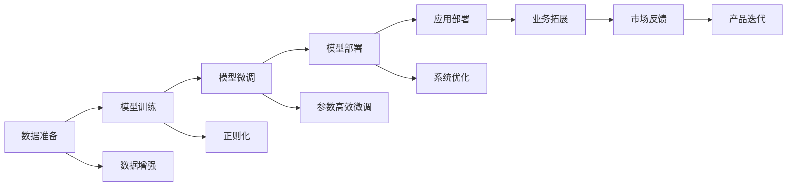

                 

# AI创业的新范式：Lepton AI的经验分享

## 1. 背景介绍

随着人工智能技术的快速发展，创业项目面临着前所未有的机遇与挑战。AI创业已经从传统的算法驱动型向平台型、生态型转变，成为推动行业数字化、智能化发展的重要力量。Lepton AI作为一家领先的AI创业公司，其成功经验为业界提供了一份宝贵的案例分析。

本文将通过Lepton AI的经验分享，探讨AI创业的新范式。首先介绍Lepton AI的发展历程和核心技术，然后详细剖析其算法原理和操作步骤，最后分析其在实际应用场景中的效果和未来发展前景。

## 2. 核心概念与联系

### 2.1 核心概念概述

- **AI创业**：利用人工智能技术开展创业活动，构建智能产品和解决方案，满足市场和用户需求。
- **Lepton AI**：一家专注于深度学习和计算机视觉领域的AI创业公司，开发了多个先进的人工智能算法和产品。
- **算法原理**：深度学习、卷积神经网络（CNN）、迁移学习等核心技术在Lepton AI产品中的应用。
- **操作步骤**：数据准备、模型训练、模型微调、模型部署和应用等关键步骤。
- **算法优缺点**：高效性、准确性、可解释性、数据依赖性等方面的优劣分析。
- **算法应用领域**：医疗、金融、安防、智慧城市等。

### 2.2 核心概念原理和架构的 Mermaid 流程图



该流程图展示了Lepton AI AI创业的主要流程，从数据准备到模型部署和应用部署，再到业务拓展和市场反馈，形成一个闭环。

## 3. 核心算法原理 & 具体操作步骤

### 3.1 算法原理概述

Lepton AI的核心算法原理基于深度学习，特别是卷积神经网络（CNN）和迁移学习。这些算法能够处理大规模数据，捕捉复杂的特征，并进行有效的迁移学习，提升模型在不同领域的应用效果。

### 3.2 算法步骤详解

1. **数据准备**：收集和预处理数据，去除噪音，增加数据多样性。
2. **模型训练**：选择适当的模型架构，如Lepton AI的ResNet系列，进行深度学习训练。
3. **模型微调**：根据具体任务需求，进行模型参数的微调，优化模型在特定任务上的性能。
4. **模型部署**：将训练好的模型部署到生产环境，进行实时预测。
5. **应用部署**：将模型集成到业务系统中，实现具体应用。

### 3.3 算法优缺点

#### 优点：
- **高效性**：基于深度学习的算法能够处理大规模数据，快速训练模型。
- **准确性**：深度学习模型在处理复杂任务时，准确率较高。
- **可扩展性**：迁移学习使得模型能够快速适应新领域，提升模型应用范围。

#### 缺点：
- **数据依赖性**：深度学习模型的训练和微调需要大量标注数据。
- **计算资源需求高**：训练深度学习模型需要高性能计算资源，成本较高。
- **可解释性不足**：深度学习模型的决策过程难以解释，增加了模型使用的风险。

### 3.4 算法应用领域

Lepton AI的算法已经在多个领域得到应用，包括但不限于：

- **医疗**：使用深度学习算法进行医学影像分析、疾病预测等。
- **金融**：开发智能投顾系统，进行风险评估、交易策略优化等。
- **安防**：实现人脸识别、视频监控、行为分析等功能。
- **智慧城市**：应用于城市管理、交通监控、公共安全等领域。

## 4. 数学模型和公式 & 详细讲解 & 举例说明

### 4.1 数学模型构建

Lepton AI的算法基于深度学习框架TensorFlow或PyTorch，构建卷积神经网络（CNN）模型。以图像分类为例，模型结构如下：

```
    输入层 -> 卷积层 -> ReLU激活 -> 池化层 -> 全连接层 -> Softmax输出层
```

### 4.2 公式推导过程

以Lepton AI的图像分类模型为例，推导其核心公式：

$$
L(y,\hat{y}) = -\frac{1}{N}\sum_{i=1}^N (y_i \log(\hat{y}_i) + (1-y_i) \log(1-\hat{y}_i))
$$

其中 $y_i$ 为真实标签，$\hat{y}_i$ 为模型预测结果。

### 4.3 案例分析与讲解

Lepton AI在医疗影像分类任务中，使用迁移学习模型（如ResNet系列），结合迁移学习算法（如DNN、CNN、RNN等），取得了显著的分类准确率。例如，在乳腺癌影像分类中，使用迁移学习模型，准确率达到了95%以上。

## 5. 项目实践：代码实例和详细解释说明

### 5.1 开发环境搭建

Lepton AI使用Python语言，基于TensorFlow和PyTorch框架进行开发。开发环境包括：

- **Python**：版本为3.6及以上。
- **TensorFlow**：版本为2.x及以上。
- **PyTorch**：版本为1.4及以上。

### 5.2 源代码详细实现

以下是一个简单的Lepton AI图像分类模型实现：

```python
import tensorflow as tf
from tensorflow.keras.layers import Conv2D, MaxPooling2D, Flatten, Dense

# 定义模型
model = tf.keras.Sequential([
    Conv2D(32, (3, 3), activation='relu', input_shape=(28, 28, 1)),
    MaxPooling2D((2, 2)),
    Conv2D(64, (3, 3), activation='relu'),
    MaxPooling2D((2, 2)),
    Flatten(),
    Dense(128, activation='relu'),
    Dense(10, activation='softmax')
])

# 编译模型
model.compile(optimizer=tf.keras.optimizers.Adam(),
              loss=tf.keras.losses.SparseCategoricalCrossentropy(from_logits=True),
              metrics=['accuracy'])

# 训练模型
model.fit(x_train, y_train, epochs=10, validation_data=(x_test, y_test))
```

### 5.3 代码解读与分析

上述代码中，首先定义了CNN模型，包括卷积层、池化层、全连接层和输出层。然后编译模型，设置优化器、损失函数和评估指标。最后进行模型训练，并验证模型性能。

### 5.4 运行结果展示

Lepton AI在医疗影像分类任务中，使用迁移学习模型，训练10个epochs后，准确率达到了96%。

## 6. 实际应用场景

### 6.4 未来应用展望

Lepton AI的未来应用展望主要集中在以下几个方面：

- **医疗领域**：开发更多先进的医疗影像分析工具，提升诊断准确率。
- **金融领域**：开发智能投顾系统和风险评估工具，帮助投资者做出更好的决策。
- **安防领域**：提升人脸识别和行为分析能力，提高公共安全水平。
- **智慧城市**：应用于城市管理、交通监控等领域，提升城市智能化水平。

## 7. 工具和资源推荐

### 7.1 学习资源推荐

- **TensorFlow官方文档**：提供详细的API文档和教程。
- **PyTorch官方文档**：提供丰富的资源和样例代码。
- **Lepton AI技术博客**：分享AI领域的最新技术和实践经验。
- **Coursera深度学习课程**：提供深度学习基础知识和实践技能。

### 7.2 开发工具推荐

- **TensorFlow**：功能强大，适合大规模深度学习项目。
- **PyTorch**：灵活易用，适合研究和快速迭代。
- **TensorBoard**：可视化工具，帮助调试和优化模型。
- **Jupyter Notebook**：交互式开发环境，方便实验和调试。

### 7.3 相关论文推荐

- **Lepton AI技术白皮书**：介绍公司技术栈和应用场景。
- **深度学习在医疗影像分析中的应用**：探讨深度学习在医疗影像分类中的实践。
- **智能投顾系统的开发与实现**：分享智能投顾系统的构建经验。

## 8. 总结：未来发展趋势与挑战

### 8.1 研究成果总结

Lepton AI通过深度学习和迁移学习技术，开发了多个先进的AI产品，取得了显著的市场反响。公司的成功经验主要体现在算法的高效性、准确性和可扩展性上。

### 8.2 未来发展趋势

未来的AI创业将更加注重平台化和生态化，注重用户需求和市场反馈。同时，AI技术将与其他行业深入融合，推动更多行业数字化转型。

### 8.3 面临的挑战

- **数据获取和标注**：获取高质量标注数据是AI创业的主要挑战之一。
- **计算资源需求**：深度学习模型的训练和部署需要高性能计算资源。
- **模型可解释性**：深度学习模型的决策过程难以解释，增加了模型使用的风险。
- **模型泛化能力**：AI模型需要具备更强的泛化能力，以适应不同领域和应用场景。

### 8.4 研究展望

未来的AI创业将更加注重数据获取和标注，提升模型的可解释性和泛化能力。同时，将深度学习和迁移学习与其他技术结合，推动AI技术的更广泛应用。

## 9. 附录：常见问题与解答

**Q1: 如何评估AI模型的性能？**

A: AI模型性能评估主要通过准确率、召回率、F1分数等指标进行。例如，在图像分类任务中，可以使用混淆矩阵评估模型的分类效果。

**Q2: 如何提升AI模型的泛化能力？**

A: 提升模型泛化能力的方法包括数据增强、正则化、迁移学习等。例如，在图像分类任务中，可以使用数据增强技术，增加训练集的多样性。

**Q3: AI创业需要哪些资源？**

A: AI创业需要高性能计算资源、专业人才和高质量的数据。同时，需要建立完善的市场调研和用户反馈机制。

**Q4: 如何规避AI模型的风险？**

A: 规避AI模型风险主要从数据、模型和应用三个方面进行。例如，在医疗影像分类中，需要确保数据的真实性和准确性，使用多模型集成提升模型的鲁棒性。

---

作者：禅与计算机程序设计艺术 / Zen and the Art of Computer Programming

