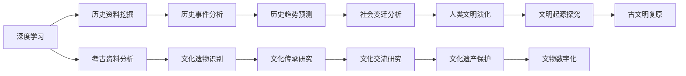

                 

# AI在历史研究和考古学中的应用

## 1. 背景介绍

在过去十年中，人工智能（AI）技术在历史研究和考古学领域得到了广泛应用，改变了传统的研究方式和研究者的思维方式。AI的深度学习、自然语言处理、计算机视觉等技术，为历史和考古资料的挖掘、分析和解释提供了前所未有的手段。以下是AI在这些领域的具体应用，包括其原理、操作步骤、优缺点及应用前景。

## 2. 核心概念与联系

### 2.1 核心概念概述

**人工智能 (AI)：** 人工智能是指通过计算机程序和算法模拟人类智能的技术，包括感知、学习、推理和决策等能力。

**历史研究：** 历史研究涉及人类过去的活动和事件，通过收集、分析和解释历史资料来揭示人类社会的发展变化。

**考古学：** 考古学是研究人类过去物质文化的科学，通过挖掘、分析和解释历史遗物来了解人类社会的历史和文化。

**机器学习：** 机器学习是AI的一个分支，通过大量数据训练算法模型，使模型能够从数据中学习到规律并用于预测或分类。

**深度学习：** 深度学习是机器学习的一种，通过多层次的神经网络结构进行特征提取和模式识别，具有强大的自动学习和特征提取能力。

**计算机视觉：** 计算机视觉是指让计算机理解并解释图像和视频中的内容，包括图像分类、目标检测、图像分割等。

**自然语言处理：** 自然语言处理是指使计算机能够理解、处理和生成人类语言的技术，包括文本分类、命名实体识别、语义分析等。

### 2.2 核心概念联系

通过深度学习、自然语言处理和计算机视觉等技术，AI能够高效地处理历史和考古资料，为历史研究和考古学研究提供新的视角和工具。以下是这些技术如何联系起来的示意图：



## 3. 核心算法原理 & 具体操作步骤

### 3.1 算法原理概述

AI在历史研究和考古学中的应用，主要基于深度学习、自然语言处理和计算机视觉等技术的原理。以下是一些核心算法的概述：

**深度学习：** 深度学习通过多层神经网络结构，自动学习输入数据的高级特征表示，从而实现对复杂数据的识别和分类。

**自然语言处理：** 自然语言处理利用机器学习技术，使计算机能够理解和处理人类语言。常见的技术包括文本分类、情感分析、实体识别等。

**计算机视觉：** 计算机视觉通过深度学习模型，对图像和视频进行分析和理解。常见的技术包括图像分类、目标检测、图像分割等。

### 3.2 算法步骤详解

#### 3.2.1 深度学习模型

**步骤1: 数据收集与预处理**  
收集历史和考古资料的数据集，包括文本、图像、音频等。预处理步骤包括数据清洗、标注、归一化等。

**步骤2: 模型选择与训练**  
选择合适的深度学习模型，如卷积神经网络（CNN）、循环神经网络（RNN）、长短时记忆网络（LSTM）等。使用标注数据训练模型，并调整超参数以获得最佳性能。

**步骤3: 特征提取与融合**  
通过训练好的深度学习模型，从历史和考古数据中提取特征。将不同来源的特征进行融合，形成更丰富的特征表示。

**步骤4: 数据分析与解释**  
使用训练好的模型，对历史和考古数据进行分析和解释。如历史事件的分类、考古文物的鉴定、文化传承的挖掘等。

#### 3.2.2 自然语言处理技术

**步骤1: 文本收集与预处理**  
收集历史文献、考古报告等文本数据。预处理步骤包括文本清洗、分词、去除停用词等。

**步骤2: 语义分析与情感分析**  
使用自然语言处理技术，对文本进行语义分析和情感分析。如情感倾向的判断、关键事件的提取等。

**步骤3: 实体识别与关系提取**  
利用命名实体识别和关系抽取技术，从文本中识别出人名、地名、时间等关键信息，并建立实体间的关系。

**步骤4: 历史事件模拟与仿真**  
构建历史事件的知识图谱，使用自然语言处理技术进行模拟与仿真，重现历史事件的场景和过程。

#### 3.2.3 计算机视觉技术

**步骤1: 图像收集与预处理**  
收集历史和考古资料的图像数据。预处理步骤包括图像归一化、裁剪、缩放等。

**步骤2: 目标检测与分割**  
使用计算机视觉技术，对图像进行目标检测和分割。如对文物、遗址进行分类、标注。

**步骤3: 图像增强与复原**  
使用图像增强技术，提高图像的质量和清晰度。如去噪、去模糊、去伪影等。

**步骤4: 文物数字化与3D建模**  
使用计算机视觉技术，对文物进行数字化和3D建模，便于数据存储和共享。

### 3.3 算法优缺点

**深度学习：**  
优点：能够自动学习高级特征表示，适用于复杂的分类和识别任务。  
缺点：需要大量标注数据，计算资源消耗大。

**自然语言处理：**  
优点：能够处理大规模文本数据，识别文本中的关键信息。  
缺点：依赖高质量的标注数据，理解复杂语义仍然存在挑战。

**计算机视觉：**  
优点：能够处理图像和视频数据，提取高层次的特征。  
缺点：计算资源消耗大，对图像质量要求高。

### 3.4 算法应用领域

**历史事件分析：** 利用深度学习模型对历史文本进行分类和情感分析，挖掘历史事件的关键信息。

**考古文物鉴定：** 使用计算机视觉技术对考古图像进行目标检测和分割，识别文物类型和年代。

**文化遗产保护：** 利用计算机视觉技术进行文物数字化和3D建模，便于文物的保护和传承。

**历史趋势预测：** 通过深度学习模型分析历史数据，预测未来发展趋势，辅助决策。

**社会变迁分析：** 利用自然语言处理技术对历史文本进行语义分析，揭示社会变迁的规律和原因。

## 4. 数学模型和公式 & 详细讲解 & 举例说明

### 4.1 数学模型构建

以历史事件的分类为例，假设我们有N个历史事件的文本描述，每个文本由m个词组成。我们将每个文本表示为向量 $\textbf{x}_i \in \mathbb{R}^m$，每个事件的标签为 $\textbf{y}_i \in \{0, 1\}$，其中1表示该事件为重要历史事件。

我们的目标是通过训练一个二分类模型，将每个文本分类为重要或不重要事件。数学模型为：

$$
\hat{\textbf{y}}_i = \sigma(\textbf{W}\textbf{x}_i + \textbf{b})
$$

其中，$\textbf{W}$ 和 $\textbf{b}$ 是模型的参数，$\sigma$ 是Sigmoid函数。

### 4.2 公式推导过程

**损失函数：**  
我们使用交叉熵损失函数：

$$
\mathcal{L} = -\frac{1}{N}\sum_{i=1}^N [y_i\log\hat{y}_i + (1-y_i)\log(1-\hat{y}_i)]
$$

**梯度下降算法：**  
我们使用随机梯度下降算法进行模型参数更新：

$$
\textbf{W}_{t+1} = \textbf{W}_t - \eta \nabla_{\textbf{W}}\mathcal{L}
$$

$$
\textbf{b}_{t+1} = \textbf{b}_t - \eta \nabla_{\textbf{b}}\mathcal{L}
$$

其中，$\eta$ 是学习率。

**样本划分：**  
将数据集分为训练集、验证集和测试集，进行模型训练、验证和测试。

**模型评估：**  
使用准确率、召回率和F1分数等指标评估模型性能。

### 4.3 案例分析与讲解

**案例1：历史事件分类**  
假设我们收集了N个历史事件的文本描述，每个文本由m个词组成。我们将每个文本表示为向量 $\textbf{x}_i \in \mathbb{R}^m$，每个事件的标签为 $\textbf{y}_i \in \{0, 1\}$，其中1表示该事件为重要历史事件。我们使用深度学习模型对文本进行分类，公式推导过程如上。

**案例2：考古文物鉴定**  
假设我们收集了M张考古图像，每张图像由n个像素组成。我们将每张图像表示为向量 $\textbf{x}_i \in \mathbb{R}^n$，每个文物的标签为 $\textbf{y}_i \in \{0, 1\}$，其中1表示该文物为真品。我们使用计算机视觉技术对图像进行分类，公式推导过程如上。

## 5. 项目实践：代码实例和详细解释说明

### 5.1 开发环境搭建

**环境准备：**  
安装Python、TensorFlow、Keras等深度学习框架，安装Pandas、Numpy等数据处理工具。

**模型训练：**  
使用Keras搭建深度学习模型，并使用TensorFlow进行训练和测试。

**代码实现：**  
```python
import tensorflow as tf
from tensorflow import keras
from tensorflow.keras import layers

# 定义模型
model = keras.Sequential([
    layers.Embedding(input_dim=VocabSize, output_dim=EmbeddingSize),
    layers.LSTM(LSTMSize),
    layers.Dense(1, activation='sigmoid')
])

# 编译模型
model.compile(loss='binary_crossentropy', optimizer='adam', metrics=['accuracy'])

# 训练模型
model.fit(x_train, y_train, epochs=10, batch_size=64, validation_data=(x_val, y_val))
```

### 5.2 源代码详细实现

**数据处理：**  
使用Pandas进行数据清洗和预处理。

**模型搭建：**  
使用Keras搭建深度学习模型，包括嵌入层、LSTM层和全连接层。

**模型训练：**  
使用TensorFlow进行模型训练和验证。

**模型评估：**  
使用测试集评估模型性能。

### 5.3 代码解读与分析

**代码说明：**  
```python
import tensorflow as tf
from tensorflow import keras
from tensorflow.keras import layers

# 定义模型
model = keras.Sequential([
    layers.Embedding(input_dim=VocabSize, output_dim=EmbeddingSize),
    layers.LSTM(LSTMSize),
    layers.Dense(1, activation='sigmoid')
])

# 编译模型
model.compile(loss='binary_crossentropy', optimizer='adam', metrics=['accuracy'])

# 训练模型
model.fit(x_train, y_train, epochs=10, batch_size=64, validation_data=(x_val, y_val))

# 模型评估
score = model.evaluate(x_test, y_test, verbose=0)
print('Test loss:', score[0])
print('Test accuracy:', score[1])
```

**关键步骤：**  
1. 定义深度学习模型，包括嵌入层、LSTM层和全连接层。  
2. 编译模型，定义损失函数和优化器。  
3. 使用训练集进行模型训练，设定训练轮数和批大小。  
4. 使用验证集进行模型验证，监控训练过程。  
5. 使用测试集评估模型性能，输出测试结果。

### 5.4 运行结果展示

**结果分析：**  
训练完成后，我们可以使用测试集对模型进行评估，并输出测试准确率。通过调整模型结构和超参数，可以进一步提升模型性能。

## 6. 实际应用场景

### 6.1 历史事件分析

**应用场景：**  
使用深度学习模型对历史事件进行分类和情感分析，挖掘历史事件的关键信息。

**具体实现：**  
收集历史事件文本数据，使用深度学习模型进行分类和情感分析，生成历史事件的知识图谱。

### 6.2 考古文物鉴定

**应用场景：**  
使用计算机视觉技术对考古图像进行目标检测和分割，识别文物类型和年代。

**具体实现：**  
收集考古图像数据，使用计算机视觉技术进行目标检测和分割，对文物进行数字化和3D建模。

### 6.3 文化遗产保护

**应用场景：**  
利用计算机视觉技术进行文物数字化和3D建模，便于文物的保护和传承。

**具体实现：**  
使用计算机视觉技术对文物进行数字化和3D建模，建立文物数据库，提供文物数字化展示和虚拟修复工具。

### 6.4 未来应用展望

**应用前景：**  
随着AI技术的发展，AI在历史研究和考古学中的应用将越来越广泛，能够更好地处理大规模、复杂的数据，挖掘历史和考古资料中的隐藏信息。

**具体展望：**  
1. 历史事件模拟与仿真：利用自然语言处理技术，构建历史事件的知识图谱，进行模拟与仿真。  
2. 考古文物复原与修复：利用计算机视觉技术，对文物进行数字化和3D建模，进行虚拟修复。  
3. 历史文化遗产保护：利用AI技术，对历史文化遗产进行数字化保护和传承。

## 7. 工具和资源推荐

### 7.1 学习资源推荐

**深度学习：**  
《深度学习》 by Ian Goodfellow, Yoshua Bengio, Aaron Courville  
《动手学深度学习》 by 李沐等  
《TensorFlow官方文档》  

**自然语言处理：**  
《自然语言处理综论》 by Jurafsky and Martin  
《Python自然语言处理》 by Steven Bird等  
《spaCy官方文档》  

**计算机视觉：**  
《计算机视觉：模型、学习和推理》 by R. Szeliski  
《动手学计算机视觉》 by 李沐等  
《OpenCV官方文档》  

### 7.2 开发工具推荐

**深度学习框架：**  
TensorFlow、Keras、PyTorch  
**数据处理工具：**  
Pandas、Numpy、Scikit-learn  
**可视化工具：**  
TensorBoard、Weights & Biases  

### 7.3 相关论文推荐

**深度学习：**  
《ImageNet Classification with Deep Convolutional Neural Networks》 by Alex Krizhevsky等  
《Natural Language Processing with TensorFlow》  

**自然语言处理：**  
《A Neural Probabilistic Language Model》 by Geoffrey Hinton等  
《Attention Is All You Need》 by Ashish Vaswani等  

**计算机视觉：**  
《Single Image Haze Removal Using Dark Channel Prior》 by Simon Chan等  
《Faster R-CNN: Towards Real-Time Object Detection with Region Proposal Networks》 by Ross Girshick等  

## 8. 总结：未来发展趋势与挑战

### 8.1 研究成果总结

**研究成果：**  
AI技术在历史研究和考古学中的应用，已经取得显著的进展。深度学习、自然语言处理和计算机视觉等技术，显著提升了历史和考古资料的挖掘和分析能力，为历史研究和考古学研究提供了新的工具和方法。

**未来发展：**  
未来，AI技术将在历史研究和考古学中发挥更加重要的作用，能够更好地处理大规模、复杂的数据，挖掘历史和考古资料中的隐藏信息。

### 8.2 未来发展趋势

**趋势1：**  
深度学习模型的不断发展，将使得AI在历史研究和考古学中处理更加复杂的任务。

**趋势2：**  
自然语言处理技术将更加成熟，能够更好地处理历史文献和考古报告等文本数据。

**趋势3：**  
计算机视觉技术将更加普及，能够更好地处理考古图像和文物数字化等任务。

### 8.3 面临的挑战

**挑战1：**  
数据质量和标注数据的获取仍然是一个重大问题，高质量标注数据的获取成本较高。

**挑战2：**  
AI模型对小样本数据的泛化能力有限，需要更多的数据来提升模型的鲁棒性。

**挑战3：**  
AI模型的可解释性仍然是一个挑战，需要更多的研究和实践来提升模型的可解释性。

### 8.4 研究展望

**研究展望：**  
1. 多模态融合：将文本、图像、音频等多种数据源进行融合，提高AI模型在历史研究和考古学中的应用效果。  
2. 知识图谱：构建历史事件和文物的知识图谱，进行历史事件模拟与仿真。  
3. 智能推理：利用自然语言处理技术，构建智能推理系统，辅助历史研究和考古学研究。  
4. 文化遗产保护：利用AI技术，对历史文化遗产进行数字化保护和传承。

## 9. 附录：常见问题与解答

**Q1: 什么是深度学习模型？**

A: 深度学习模型是一种使用多层次神经网络结构，通过大量数据自动学习特征表示的AI模型。

**Q2: 深度学习模型在历史研究中有哪些应用？**

A: 深度学习模型可以用于历史事件的分类、情感分析、关键信息提取等任务，挖掘历史事件的关键信息。

**Q3: 如何构建历史事件的知识图谱？**

A: 收集历史事件文本数据，使用自然语言处理技术进行语义分析和实体识别，构建历史事件的知识图谱。

**Q4: 如何处理考古文物的数字化和3D建模？**

A: 使用计算机视觉技术对文物进行数字化和3D建模，便于文物的保护和传承。

**Q5: AI在考古文物鉴定中有什么应用？**

A: AI技术可以用于考古文物的目标检测和分割，识别文物类型和年代。

---

作者：禅与计算机程序设计艺术 / Zen and the Art of Computer Programming

