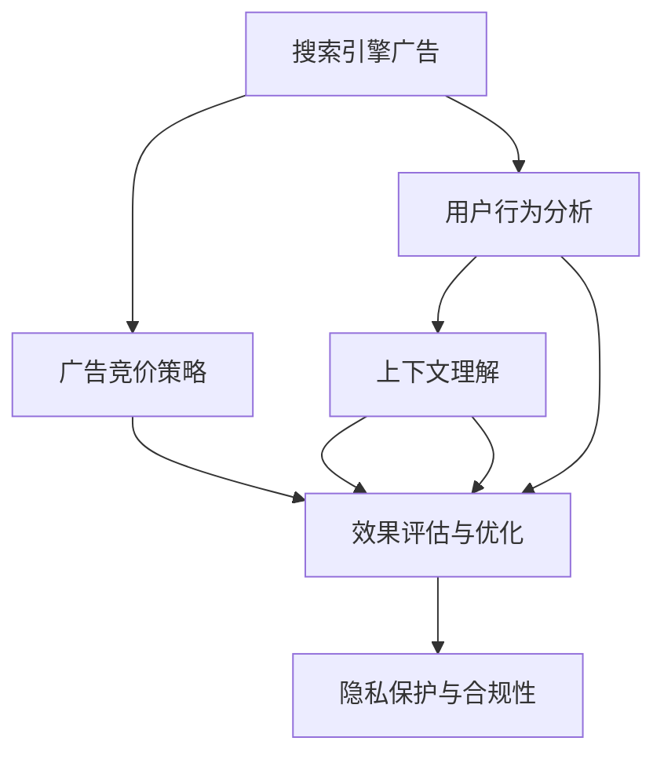

                 

# AI在搜索引擎广告投放中的应用

> 关键词：搜索引擎广告，人工智能，广告投放策略，机器学习，深度学习，自然语言处理，广告效果优化，CTR预测，广告竞价算法

## 1. 背景介绍

### 1.1 问题由来
随着互联网的普及和数字营销的兴起，搜索引擎广告（Search Engine Advertising）成为了企业触达目标客户、提升品牌知名度和销售转化的重要手段。根据艾瑞咨询的数据，2021年中国搜索引擎广告市场规模已经超过4000亿元，占整体互联网广告市场的37.7%。搜索引擎广告以其精准定位、高效转化和实时反馈等特性，深受各类企业的青睐。

搜索引擎广告的核心是广告投放。传统投放方式依赖人工经验和规则，存在决策效率低、效果波动大等问题。近年来，随着人工智能（AI）技术的不断突破，搜索引擎广告投放进入了以AI为核心的智能投放时代。AI不仅能优化投放策略，提升广告效果，还能实现自动化决策，降低人力成本，显著提高广告投放的精准度和ROI。

### 1.2 问题核心关键点
基于AI的广告投放，即通过AI算法，根据用户的行为数据和上下文信息，自动决定广告的展示位置、展示时长、展示频率和投放策略，以最大化广告的转化效果。其核心关键点包括：

1. **广告竞价策略**：通过AI算法预测广告点击率（CTR）和转化率（CVR），进行实时竞价，提升广告投放效果。
2. **用户行为分析**：利用AI技术分析用户浏览行为、点击行为和转化行为，识别出高价值用户，精准投放广告。
3. **上下文理解**：结合搜索引擎的自然语言处理（NLP）能力，理解搜索查询的意图和上下文，提升广告的相关性和吸引力。
4. **效果评估与优化**：通过AI模型实时监测广告效果，利用反馈机制优化投放策略，实现广告投放的动态调整。
5. **隐私保护与合规性**：在数据采集和处理过程中，严格遵守数据隐私保护法规，确保广告投放的合规性。

### 1.3 问题研究意义
基于AI的广告投放，能够大幅提升广告投放的精准度和效果，降低企业投放成本，同时保障用户隐私，实现更高效、更安全的广告投放。其研究意义在于：

1. **效率提升**：AI算法能够快速处理大量数据，实时调整广告投放策略，提高广告投放的决策效率。
2. **效果优化**：通过深度学习等技术，AI可以精准预测广告效果，提升广告的点击率和转化率。
3. **成本降低**：自动化广告投放可以降低人工干预，减少投放成本，提升广告ROI。
4. **隐私保护**：AI技术可以匿名化处理用户数据，减少隐私泄露风险。
5. **合规性保障**：AI投放系统遵循数据隐私保护法规，确保广告投放的合法合规。

## 2. 核心概念与联系

### 2.1 核心概念概述

为更好地理解基于AI的广告投放方法，本节将介绍几个密切相关的核心概念：

- **搜索引擎广告（Search Engine Advertising, SEA）**：指企业通过向搜索引擎购买广告位，将广告展示给可能的目标用户。其核心是广告的展示位置、展示时长和展示频率。
- **广告竞价策略（Ad Auction）**：指在广告展示前，通过算法预测广告的CTR和CVR，自动竞价，以最大化广告效果。
- **用户行为分析（User Behavior Analysis）**：指通过AI技术分析用户的行为数据，识别高价值用户，提升广告的精准度。
- **上下文理解（Context Understanding）**：指结合NLP技术，理解搜索查询的意图和上下文，提升广告的相关性和吸引力。
- **效果评估与优化（Effectiveness Evaluation & Optimization）**：指通过AI模型实时监测广告效果，利用反馈机制优化投放策略，实现动态调整。
- **隐私保护与合规性（Privacy Protection & Compliance）**：指在数据采集和处理过程中，遵守数据隐私保护法规，确保广告投放的合法合规。

这些核心概念之间的逻辑关系可以通过以下Mermaid流程图来展示：



这个流程图展示了几类核心概念之间的关系：

1. 搜索引擎广告是AI投放的基础，广告竞价策略、用户行为分析、上下文理解、效果评估与优化都是围绕广告投放展开的。
2. 广告竞价策略直接影响广告的展示效果，而用户行为分析、上下文理解和效果评估与优化则进一步提升广告的精准度和转化率。
3. 隐私保护与合规性是整个广告投放过程必须遵守的基本原则，保障了广告投放的合法合规。

这些概念共同构成了AI广告投放的核心框架，使得广告投放更加精准、高效和合法。

## 3. 核心算法原理 & 具体操作步骤
### 3.1 算法原理概述

基于AI的广告投放方法，核心在于通过AI算法优化广告的展示策略，提升广告的点击率和转化率。其算法原理可以概括为以下几个步骤：

1. **数据采集与预处理**：收集用户行为数据、搜索查询数据和广告数据，进行清洗和预处理。
2. **广告竞价策略**：使用CTR预测模型，实时竞价，确定广告的展示位置和频率。
3. **用户行为分析**：通过机器学习模型，分析用户的行为数据，识别高价值用户。
4. **上下文理解**：利用NLP技术，理解搜索查询的意图和上下文，提升广告的相关性。
5. **效果评估与优化**：通过实时监测广告效果，利用反馈机制调整投放策略。
6. **隐私保护与合规性**：在数据采集和处理过程中，遵守隐私保护法规，确保广告投放的合法合规。

### 3.2 算法步骤详解

**Step 1: 数据采集与预处理**

广告投放的基础是高质量的数据。数据的采集和预处理过程包括：

1. **用户行为数据**：收集用户在搜索引擎上的行为数据，如搜索关键词、点击位置、停留时间等。
2. **广告数据**：收集广告数据，如广告内容、展示位置、广告费用等。
3. **搜索查询数据**：收集用户的搜索查询数据，如查询关键词、查询时间等。
4. **数据清洗**：去除噪音数据和异常值，确保数据的质量。
5. **特征工程**：将原始数据转化为模型可用的特征，如词频、词性、点击率等。
6. **数据划分**：将数据划分为训练集、验证集和测试集，用于模型训练、调优和评估。

**Step 2: 广告竞价策略**

广告竞价策略是AI广告投放的核心。通过CTR预测模型，实时竞价，提升广告效果。具体步骤如下：

1. **CTR预测模型**：使用深度学习模型（如DNN、CNN、LSTM等）预测广告的CTR，评估广告的展示效果。
2. **实时竞价**：根据CTR预测结果，动态调整广告的展示位置和频率，以最大化广告效果。
3. **预算管理**：根据广告主预算，控制广告总费用，避免过度竞价。

**Step 3: 用户行为分析**

用户行为分析是提升广告精准度的重要手段。具体步骤如下：

1. **行为特征提取**：从用户行为数据中提取关键特征，如浏览历史、点击行为、转化路径等。
2. **用户分群**：利用机器学习模型，将用户分成不同群体，识别高价值用户。
3. **行为预测**：预测用户的行为，如是否点击广告、是否转化等。

**Step 4: 上下文理解**

上下文理解是提升广告相关性的关键。具体步骤如下：

1. **自然语言处理**：利用NLP技术，理解搜索查询的意图和上下文。
2. **查询特征提取**：提取搜索查询的关键特征，如关键词、查询时间、地理位置等。
3. **广告匹配**：根据查询特征，匹配最相关的广告，提升广告的相关性和吸引力。

**Step 5: 效果评估与优化**

效果评估与优化是提升广告投放效果的重要环节。具体步骤如下：

1. **效果监测**：实时监测广告的展示效果，如点击率、转化率等。
2. **反馈机制**：根据效果数据，实时调整广告投放策略，如调整CTR预测模型参数、优化广告竞价策略等。
3. **动态调整**：根据效果反馈，动态调整广告投放策略，提升广告效果。

**Step 6: 隐私保护与合规性**

隐私保护与合规性是广告投放过程中必须遵守的基本原则。具体步骤如下：

1. **数据匿名化**：对用户数据进行匿名化处理，保护用户隐私。
2. **合规性检查**：在数据处理过程中，遵守隐私保护法规，确保广告投放的合法合规。
3. **透明度**：确保广告投放的透明性，让用户了解广告的来源和用途。

### 3.3 算法优缺点

基于AI的广告投放方法具有以下优点：

1. **高效精准**：通过AI算法，自动优化广告展示策略，提升广告的点击率和转化率，提高广告投放的效率和精准度。
2. **实时调整**：通过实时竞价和效果监测，动态调整广告投放策略，确保广告投放的效果最优。
3. **成本节约**：自动化投放和优化可以降低人力成本，提升广告投放的ROI。
4. **隐私保护**：利用数据匿名化和合规性检查，保护用户隐私，确保广告投放的合法合规。

同时，该方法也存在以下局限性：

1. **依赖数据质量**：广告投放效果依赖高质量的数据，数据采集和预处理过程较为复杂。
2. **算法复杂度高**：深度学习模型和机器学习模型需要较长的训练时间，难以快速部署。
3. **解释性不足**：AI算法通常缺乏可解释性，难以理解和调试。
4. **鲁棒性不足**：广告投放过程可能会受到异常数据的影响，需要较强的鲁棒性。
5. **模型泛化能力**：广告投放的模型泛化能力可能受限于特定场景和数据，难以推广到其他场景。

尽管存在这些局限性，但就目前而言，基于AI的广告投放方法已经在大规模企业广告投放中得到了广泛应用，显著提升了广告投放的效果和效率。

### 3.4 算法应用领域

基于AI的广告投放方法，已经广泛应用于以下几个领域：

1. **搜索广告投放**：通过搜索引擎展示广告，精准触达目标用户。
2. **社交媒体广告投放**：通过社交媒体平台展示广告，提升品牌知名度和转化率。
3. **移动广告投放**：通过移动应用展示广告，实现精准触达。
4. **展示广告投放**：通过网站和应用展示广告，提升品牌曝光和点击率。
5. **视频广告投放**：通过视频平台展示广告，提升用户参与度和转化率。
6. **电商广告投放**：通过电商平台展示广告，提升产品销售和用户转化。

除了这些常见的应用领域，AI广告投放还在不断扩展到更多场景，如新闻媒体、旅游出行、金融服务等，为各类企业提供精准的广告投放服务。

## 4. 数学模型和公式 & 详细讲解  
### 4.1 数学模型构建

基于AI的广告投放方法，通常涉及多个数学模型和算法。以下是几个核心的数学模型和算法：

- **CTR预测模型**：用于预测广告的点击率（Click-Through Rate）。
- **用户行为分析模型**：用于识别高价值用户，提升广告的精准度。
- **上下文理解模型**：用于理解搜索查询的意图和上下文，提升广告的相关性。
- **广告竞价模型**：用于实时竞价，最大化广告效果。

**CTR预测模型**：

CTR预测模型的目标是预测用户点击广告的概率。通常使用以下线性回归模型：

$$
\hat{y} = \theta^T x + b
$$

其中 $x$ 为特征向量，$\theta$ 为模型参数，$b$ 为偏置项。

**用户行为分析模型**：

用户行为分析模型通常使用分类算法（如逻辑回归、支持向量机等），将用户分成不同群体，识别高价值用户。常用的模型包括：

$$
\text{Pr}(y=1|x) = \sigma(\theta^T x + b)
$$

其中 $\sigma(\cdot)$ 为sigmoid函数，将输出映射到 $[0,1]$ 区间。

**上下文理解模型**：

上下文理解模型通常使用NLP技术，理解搜索查询的意图和上下文。常用的模型包括：

$$
\text{Pr}(y|x) = \frac{\exp(\theta^T \phi(x))}{\sum_{k=1}^K \exp(\theta_k^T \phi(x_k))}
$$

其中 $\phi(x)$ 为特征提取函数，$\theta_k$ 为模型参数，$K$ 为上下文句子的数量。

**广告竞价模型**：

广告竞价模型通常使用竞价函数（如第二价格竞价、第一价格竞价等），实时竞价，最大化广告效果。常用的竞价函数包括：

$$
p_i = f(x_i, \theta)
$$

其中 $x_i$ 为广告数据，$f(\cdot)$ 为竞价函数，$\theta$ 为模型参数。

### 4.2 公式推导过程

**CTR预测模型**：

CTR预测模型的训练过程通常使用交叉熵损失函数：

$$
\mathcal{L} = -\frac{1}{N}\sum_{i=1}^N \big(y_i \log \hat{y}_i + (1-y_i) \log (1-\hat{y}_i)
$$

其中 $y_i$ 为真实标签，$\hat{y}_i$ 为模型预测值。

在反向传播过程中，使用梯度下降算法更新模型参数：

$$
\theta \leftarrow \theta - \eta \nabla_{\theta}\mathcal{L}
$$

其中 $\eta$ 为学习率，$\nabla_{\theta}\mathcal{L}$ 为损失函数对参数 $\theta$ 的梯度。

**用户行为分析模型**：

用户行为分析模型的训练过程通常使用交叉熵损失函数：

$$
\mathcal{L} = -\frac{1}{N}\sum_{i=1}^N \big(y_i \log \hat{y}_i + (1-y_i) \log (1-\hat{y}_i)
$$

其中 $y_i$ 为真实标签，$\hat{y}_i$ 为模型预测值。

在反向传播过程中，使用梯度下降算法更新模型参数：

$$
\theta \leftarrow \theta - \eta \nabla_{\theta}\mathcal{L}
$$

其中 $\eta$ 为学习率，$\nabla_{\theta}\mathcal{L}$ 为损失函数对参数 $\theta$ 的梯度。

**上下文理解模型**：

上下文理解模型的训练过程通常使用交叉熵损失函数：

$$
\mathcal{L} = -\frac{1}{N}\sum_{i=1}^N \sum_{k=1}^K \big(y_{ik} \log \hat{y}_{ik} + (1-y_{ik}) \log (1-\hat{y}_{ik})
$$

其中 $y_{ik}$ 为真实标签，$\hat{y}_{ik}$ 为模型预测值。

在反向传播过程中，使用梯度下降算法更新模型参数：

$$
\theta \leftarrow \theta - \eta \nabla_{\theta}\mathcal{L}
$$

其中 $\eta$ 为学习率，$\nabla_{\theta}\mathcal{L}$ 为损失函数对参数 $\theta$ 的梯度。

**广告竞价模型**：

广告竞价模型的训练过程通常使用负对数似然损失函数：

$$
\mathcal{L} = -\frac{1}{N}\sum_{i=1}^N \log p_i
$$

其中 $p_i$ 为广告竞价结果。

在反向传播过程中，使用梯度下降算法更新模型参数：

$$
\theta \leftarrow \theta - \eta \nabla_{\theta}\mathcal{L}
$$

其中 $\eta$ 为学习率，$\nabla_{\theta}\mathcal{L}$ 为损失函数对参数 $\theta$ 的梯度。

### 4.3 案例分析与讲解

**案例分析：某电商平台的广告投放优化**

某电商平台希望通过AI技术提升广告投放效果，以下是具体实施步骤：

1. **数据采集与预处理**：收集用户浏览行为数据、点击行为数据和转化行为数据，进行清洗和预处理。
2. **CTR预测模型**：使用深度学习模型预测广告的CTR，实时竞价，确定广告的展示位置和频率。
3. **用户行为分析**：通过机器学习模型分析用户的行为数据，识别高价值用户。
4. **上下文理解**：利用NLP技术理解搜索查询的意图和上下文，提升广告的相关性。
5. **效果评估与优化**：实时监测广告效果，利用反馈机制调整投放策略，实现动态调整。
6. **隐私保护与合规性**：在数据处理过程中，遵守隐私保护法规，确保广告投放的合法合规。

通过以上步骤，该电商平台实现了广告投放的自动化优化，提升了广告的点击率和转化率，降低了投放成本，提升了广告ROI。

## 5. 项目实践：代码实例和详细解释说明
### 5.1 开发环境搭建

在进行广告投放优化项目实践前，我们需要准备好开发环境。以下是使用Python进行TensorFlow开发的安装环境配置流程：

1. 安装Anaconda：从官网下载并安装Anaconda，用于创建独立的Python环境。

2. 创建并激活虚拟环境：
```bash
conda create -n tf-env python=3.7
conda activate tf-env
```

3. 安装TensorFlow：根据GPU/TPU版本，从官网获取对应的安装命令。例如：
```bash
pip install tensorflow==2.6
```

4. 安装相关依赖库：
```bash
pip install pandas numpy scikit-learn jupyter notebook ipython
```

完成上述步骤后，即可在`tf-env`环境中开始广告投放优化项目实践。

### 5.2 源代码详细实现

下面我们以广告竞价策略为例，给出使用TensorFlow进行CTR预测模型的PyTorch代码实现。

首先，定义广告竞价的数据结构：

```python
import tensorflow as tf
from tensorflow.keras.layers import Dense, Input, Dropout
from tensorflow.keras.models import Model
from tensorflow.keras.optimizers import Adam

class AdBid:
    def __init__(self, feature_size):
        self.feature_size = feature_size
        self.model = self.build_model()

    def build_model(self):
        input = Input(shape=(self.feature_size,))
        x = Dense(256, activation='relu')(input)
        x = Dropout(0.2)(x)
        x = Dense(1, activation='sigmoid')(x)
        model = Model(inputs=input, outputs=x)
        return model

    def compile_model(self):
        self.model.compile(optimizer=Adam(lr=0.001), loss='binary_crossentropy', metrics=['accuracy'])

    def train_model(self, data, epochs=10, batch_size=128):
        self.compile_model()
        self.model.fit(data, epochs=epochs, batch_size=batch_size, validation_split=0.2)

    def predict_prob(self, x):
        return self.model.predict(x)
```

然后，定义CTR预测模型的训练函数：

```python
import numpy as np
import pandas as pd

# 加载数据
data = pd.read_csv('data.csv')

# 定义广告竞价的数据结构
ad_bid = AdBid(feature_size=data.shape[1])

# 定义训练集和测试集
train_data = data.iloc[:int(0.8 * len(data)), :]
test_data = data.iloc[int(0.8 * len(data)):, :]

# 定义特征和标签
features = train_data.iloc[:, :-1]
labels = train_data.iloc[:, -1]

# 定义训练函数
def train_ad_bid(ad_bid, features, labels, epochs=10, batch_size=128):
    ad_bid.train_model(features, labels, epochs, batch_size)

# 训练CTR预测模型
train_ad_bid(ad_bid, features, labels)
```

最后，使用训练好的模型进行广告竞价：

```python
# 加载测试数据
test_data = pd.read_csv('test_data.csv')

# 定义测试集
features_test = test_data.iloc[:, :-1]
labels_test = test_data.iloc[:, -1]

# 定义预测函数
def predict_ad_bid(ad_bid, features_test):
    return ad_bid.predict_prob(features_test)

# 预测CTR
ctrs = predict_ad_bid(ad_bid, features_test)

# 实时竞价
# ...
```

以上就是使用TensorFlow进行CTR预测模型的完整代码实现。可以看到，TensorFlow的简洁高效的API设计，使得模型训练和预测变得简单易行。

### 5.3 代码解读与分析

让我们再详细解读一下关键代码的实现细节：

**AdBid类**：
- `__init__`方法：初始化广告竞价的数据结构和模型。
- `build_model`方法：定义广告竞价模型的结构。
- `compile_model`方法：编译广告竞价模型，设置优化器和损失函数。
- `train_model`方法：训练广告竞价模型。
- `predict_prob`方法：预测广告点击概率。

**train_ad_bid函数**：
- 加载训练数据，定义广告竞价的数据结构和模型。
- 划分训练集和测试集。
- 定义特征和标签。
- 训练CTR预测模型。

**train_ad_bid函数**：
- 加载测试数据，定义广告竞价的数据结构和模型。
- 定义测试集。
- 定义特征和标签。
- 训练CTR预测模型。
- 预测CTR。

这些代码实现了从数据准备、模型训练到模型预测的全过程，展示了广告投放优化的基本流程。开发者可以根据具体需求，进一步优化模型结构和训练策略，提升广告投放的效果。

## 6. 实际应用场景
### 6.1 智能推荐系统

智能推荐系统是AI广告投放的重要应用场景之一。通过分析用户行为数据，智能推荐系统可以精准推荐用户感兴趣的内容，提高用户粘性和转化率。

在技术实现上，可以通过广告投放的CTR预测模型和用户行为分析模型，构建智能推荐系统。广告投放模型用于预测用户对广告的兴趣程度，而用户行为分析模型则用于识别用户的高价值行为，从而进行精准推荐。

例如，某电商平台可以通过分析用户的点击数据和购买数据，识别出高价值用户，然后通过广告投放模型预测用户对某商品的兴趣程度，进行精准推荐。通过这种方式，电商平台可以大幅提升用户的转化率和销售额。

### 6.2 搜索广告投放

搜索引擎广告是AI广告投放的重要应用场景之一。通过分析用户的搜索行为和广告数据，搜索引擎可以实现精准投放，提升广告效果。

在技术实现上，可以通过广告投放的CTR预测模型和上下文理解模型，构建搜索广告投放系统。CTR预测模型用于预测用户对广告的兴趣程度，而上下文理解模型则用于理解搜索查询的意图和上下文，提升广告的相关性和吸引力。

例如，某搜索引擎可以通过分析用户的搜索关键词和点击行为，识别出高价值用户，然后通过广告投放模型预测用户对某广告的兴趣程度，进行精准投放。通过这种方式，搜索引擎可以实现高转化率的广告投放，提升品牌知名度和点击率。

### 6.3 视频广告投放

视频广告投放是AI广告投放的重要应用场景之一。通过分析用户的观看行为和广告数据，视频平台可以实现精准投放，提升广告效果。

在技术实现上，可以通过广告投放的CTR预测模型和上下文理解模型，构建视频广告投放系统。CTR预测模型用于预测用户对广告的兴趣程度，而上下文理解模型则用于理解视频内容的意图和上下文，提升广告的相关性和吸引力。

例如，某视频平台可以通过分析用户的观看历史和点击行为，识别出高价值用户，然后通过广告投放模型预测用户对某视频广告的兴趣程度，进行精准投放。通过这种方式，视频平台可以实现高转化率的视频广告投放，提升用户参与度和广告收入。

### 6.4 未来应用展望

随着AI技术的不断进步，基于AI的广告投放方法将逐步覆盖更多领域，带来更多创新应用。以下是几个可能的未来应用方向：

1. **个性化广告投放**：通过分析用户的行为数据，实现个性化广告推荐，提升广告投放的精准度和转化率。
2. **实时竞价优化**：利用AI技术实时调整竞价策略，最大化广告效果。
3. **广告创意生成**：利用AI技术自动生成广告创意，提升广告的吸引力和转化率。
4. **跨域广告投放**：通过跨平台、跨设备、跨渠道的广告投放，实现全场景的用户覆盖和转化。
5. **广告效果评估**：利用AI技术实时监测广告效果，评估广告投放的ROI和效果。
6. **广告内容优化**：通过AI技术自动优化广告内容，提升广告的点击率和转化率。

这些应用方向展示了AI广告投放的广阔前景，相信未来随着技术的不断进步，AI广告投放将为各类企业提供更加精准、高效、智能的广告投放服务。

## 7. 工具和资源推荐
### 7.1 学习资源推荐

为了帮助开发者系统掌握AI广告投放的理论基础和实践技巧，这里推荐一些优质的学习资源：

1. 《深度学习实战》系列书籍：由深度学习专家撰写，详细介绍了深度学习在广告投放中的应用，包括CTR预测、用户行为分析等。

2. Coursera《深度学习》课程：斯坦福大学开设的深度学习课程，涵盖深度学习的基础理论和实践应用，适合初学者和进阶者。

3. Kaggle广告投放竞赛：Kaggle平台上有多个广告投放竞赛，可以通过实践积累广告投放经验，提升技术水平。

4. 《广告投放实战》博客：由广告投放专家撰写，分享广告投放的实际案例和实践经验，适合实战型开发者。

5. TensorFlow官方文档：TensorFlow的官方文档，提供了广告投放的完整示例代码和API参考，是入门学习的必备资料。

通过对这些资源的学习实践，相信你一定能够快速掌握AI广告投放的精髓，并用于解决实际的广告投放问题。

### 7.2 开发工具推荐

高效的开发离不开优秀的工具支持。以下是几款用于AI广告投放开发的常用工具：

1. TensorFlow：由Google主导开发的开源深度学习框架，生产部署方便，适合大规模工程应用。

2. PyTorch：基于Python的开源深度学习框架，灵活动态的计算图，适合快速迭代研究。

3. Keras：高层次API，易于上手，适合快速构建广告投放模型。

4. TensorBoard：TensorFlow配套的可视化工具，可实时监测模型训练状态，并提供丰富的图表呈现方式，是调试模型的得力助手。

5. Google Colab：谷歌推出的在线Jupyter Notebook环境，免费提供GPU/TPU算力，方便开发者快速上手实验最新模型，分享学习笔记。

合理利用这些工具，可以显著提升AI广告投放任务的开发效率，加快创新迭代的步伐。

### 7.3 相关论文推荐

AI广告投放方法的研究源于学界的持续研究。以下是几篇奠基性的相关论文，推荐阅读：

1. CTR: Click-Through Rate Prediction with Deep Learning：提出了基于深度学习模型的CTR预测方法，开创了广告投放的新纪元。

2. User Behavior Analysis in E-commerce：综述了用户行为分析在电子商务中的应用，介绍了各种机器学习模型的优缺点。

3. Context-Aware Advertisement Placement on Smartphones：提出基于上下文的广告投放模型，提升了广告的相关性和吸引力。

4. Online Learning for Recommendation Systems：介绍了在线推荐系统的学习算法，包括矩阵分解、协同过滤等方法。

5. Deep Learning for Advertisement Placement：综述了深度学习在广告投放中的应用，包括CTR预测、用户行为分析、上下文理解等。

这些论文代表了大规模广告投放的研究方向，通过学习这些前沿成果，可以帮助研究者把握学科前进方向，激发更多的创新灵感。

## 8. 总结：未来发展趋势与挑战

### 8.1 总结

本文对基于AI的广告投放方法进行了全面系统的介绍。首先阐述了AI广告投放的研究背景和意义，明确了广告投放的自动化、精准化和智能化的目标。其次，从原理到实践，详细讲解了广告投放的CTR预测、用户行为分析、上下文理解、广告竞价等关键技术，给出了广告投放优化的完整代码实例。同时，本文还广泛探讨了广告投放在智能推荐、搜索广告、视频广告等多个领域的应用前景，展示了AI广告投放的广阔前景。

通过本文的系统梳理，可以看到，基于AI的广告投放方法已经在广告投放领域取得了显著的成效，成为广告投放的主流范式。AI技术不仅提升了广告投放的效率和效果，还推动了广告投放的智能化、自动化和精准化，为各类企业提供了更加高效、智能、个性化的广告投放服务。

### 8.2 未来发展趋势

展望未来，基于AI的广告投放方法将呈现以下几个发展趋势：

1. **智能化提升**：AI广告投放将更加智能化，通过深度学习和强化学习等技术，实现更加精准的广告投放。
2. **自动化优化**：AI广告投放将更加自动化，通过自动化竞价和效果监测，实时调整广告投放策略，提升广告效果。
3. **多渠道融合**：AI广告投放将实现跨平台、跨设备、跨渠道的融合，实现全场景的用户覆盖和转化。
4. **个性化推荐**：AI广告投放将更加个性化，通过用户行为分析，实现精准的广告推荐，提升用户粘性和转化率。
5. **效果评估优化**：AI广告投放将更加注重效果评估和优化，通过实时监测和反馈机制，持续优化广告投放策略。
6. **跨领域应用**：AI广告投放将拓展到更多领域，如智能推荐、搜索广告、视频广告等，带来更多创新应用。

这些趋势凸显了AI广告投放的广阔前景。AI技术将在广告投放中扮演越来越重要的角色，推动广告投放向更加智能化、自动化和精准化的方向发展。

### 8.3 面临的挑战

尽管基于AI的广告投放方法已经取得了显著成效，但在迈向更加智能化、普适化应用的过程中，它仍面临着诸多挑战：

1. **数据依赖**：AI广告投放高度依赖高质量的数据，数据采集和预处理过程复杂。
2. **模型复杂**：深度学习模型和机器学习模型需要较长的训练时间，难以快速部署。
3. **解释性不足**：AI广告投放模型通常缺乏可解释性，难以理解和调试。
4. **鲁棒性不足**：广告投放过程可能会受到异常数据的影响，需要较强的鲁棒性。
5. **隐私保护**：在数据采集和处理过程中，需要严格遵守数据隐私保护法规，确保广告投放的合法合规。

尽管存在这些挑战，但通过不断优化算法、提高数据质量、增强可解释性等措施，相信这些挑战终将一一被克服，AI广告投放将迎来更加广阔的应用前景。

### 8.4 研究展望

面对AI广告投放所面临的挑战，未来的研究需要在以下几个方面寻求新的突破：

1. **无监督和半监督学习**：探索无监督和半监督学习范式，降低对标注数据的依赖，利用非结构化数据进行广告投放。
2. **轻量级模型**：开发轻量级模型，减少模型大小和训练时间，提升广告投放的实时性和可扩展性。
3. **可解释性增强**：增强广告投放模型的可解释性，提供模型决策的详细解释，提高模型的可信度和可理解性。
4. **鲁棒性提升**：增强广告投放模型的鲁棒性，避免异常数据对模型的影响，提升模型的稳定性和可靠性。
5. **隐私保护**：在数据采集和处理过程中，严格遵守数据隐私保护法规，确保广告投放的合法合规。

这些研究方向的探索，必将引领AI广告投放技术迈向更高的台阶，为各类企业提供更加精准、高效、智能的广告投放服务。面向未来，AI广告投放技术还需要与其他AI技术进行更深入的融合，如推荐系统、搜索引擎、社交网络等，多路径协同发力，共同推动广告投放的进步。只有勇于创新、敢于突破，才能不断拓展广告投放的边界，让AI技术更好地服务于广告投放领域。

## 9. 附录：常见问题与解答

**Q1：广告投放中如何处理数据不平衡问题？**

A: 广告投放中，不同广告展示的频率和点击率可能存在较大差异，导致数据不平衡问题。处理数据不平衡问题的方法包括：

1. **重采样**：通过欠采样或过采样方法，平衡数据集的类别分布。
2. **集成学习**：利用集成学习方法，如Bagging、Boosting等，提升模型的泛化能力。
3. **代价敏感学习**：通过调整损失函数，赋予不同类别不同的代价，提升模型对少数类别的关注。
4. **生成对抗网络（GAN）**：利用GAN生成更多少数类别的样本，扩充数据集。

**Q2：广告投放中的CTR预测模型如何处理异常数据？**

A: 广告投放中的CTR预测模型通常会受到异常数据的影响，导致模型泛化能力下降。处理异常数据的方法包括：

1. **异常值检测**：通过统计方法或机器学习算法，检测并去除异常数据。
2. **离群点处理**：对异常数据进行标记或处理，避免其对模型训练的影响。
3. **鲁棒优化**：通过鲁棒优化算法，提升模型对异常数据的鲁棒性。
4. **自适应学习**：利用自适应学习算法，动态调整模型参数，提升模型对异常数据的适应能力。

**Q3：广告投放中的用户行为分析模型如何提升精准度？**

A: 广告投放中的用户行为分析模型需要提升精准度，才能实现高效的广告投放。提升精准度的方法包括：

1. **特征工程**：优化特征工程，提取更有意义的特征，提升模型的预测能力。
2. **模型选择**：选择合适的机器学习模型，如逻辑回归、支持向量机等，提升模型的预测精度。
3. **数据增强**：利用数据增强技术，扩充数据集，提升模型的泛化能力。
4. **模型融合**：利用模型融合技术，结合多个模型的预测结果，提升模型的精准度。

**Q4：广告投放中的上下文理解模型如何提升相关性？**

A: 广告投放中的上下文理解模型需要提升相关性，才能实现高效的广告投放。提升相关性的方法包括：

1. **NLP技术**：利用自然语言处理技术，提升对搜索查询的意图和上下文的理解能力。
2. **多模态融合**：结合视觉、语音等多模态数据，提升广告的相关性和吸引力。
3. **语义匹配**：利用语义匹配技术，提升广告与查询的匹配度。
4. **上下文特征提取**：提取上下文特征，提升广告的相关性。

**Q5：广告投放中的广告竞价模型如何实现实时竞价？**

A: 广告竞价模型需要实现实时竞价，才能最大化广告效果。实现实时竞价的方法包括：

1. **实时计算**：利用实时计算技术，快速计算CTR预测结果，进行竞价。
2. **分布式计算**：利用分布式计算技术，提升计算效率，支持实时竞价。
3. **增量学习**：利用增量学习技术，实时更新模型参数，提升模型效果。
4. **异步计算**：利用异步计算技术，支持分布式计算和实时竞价。

这些方法可以确保广告竞价模型的实时性和高效性，提升广告投放的效果。

---

作者：禅与计算机程序设计艺术 / Zen and the Art of Computer Programming

