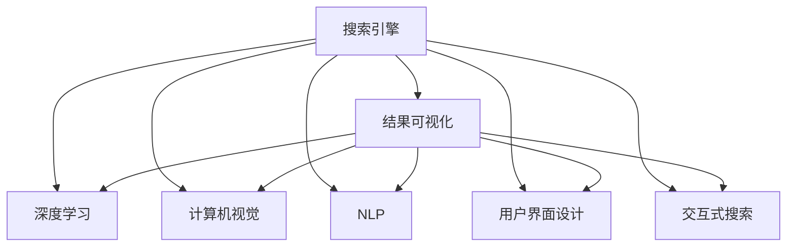

                 

# AI在搜索引擎结果可视化中的应用

> 关键词：
- 搜索引擎
- 结果可视化
- 深度学习
- 计算机视觉
- 用户界面设计
- 自然语言处理
- 交互式搜索

## 1. 背景介绍

### 1.1 问题由来
搜索引擎在现代社会中扮演着不可或缺的角色，它不仅能够帮助用户快速获取信息，还能改善用户体验，提升网站的流量和转化率。随着互联网的发展，搜索引擎对用户需求的理解越来越深入，也越来越注重搜索结果的质量和相关性。

传统的搜索结果通常以文本列表形式展示，对于复杂的查询，用户往往需要经过多次点击才能找到所需的信息。这种“以文本为基础”的搜索方式虽然简单，但在搜索特定类型的信息（如图像、视频、地理位置等）时，难以直观地展示搜索结果的关联性。

结果可视化（Search Results Visualization）通过将搜索结果以图形、图像或多媒体的形式展示，能够更直观地向用户展示搜索结果的相关性，从而提升用户体验。人工智能（AI）在结果可视化中起到重要作用，可以自动分析和推荐相关的视觉元素，帮助用户更快地找到信息。

## 2. 核心概念与联系

### 2.1 核心概念概述

要深入理解AI在结果可视化中的应用，需要掌握以下核心概念：

- **搜索引擎**：是互联网信息检索的重要工具，通过用户输入的查询语句检索互联网上的信息，并展示相关信息。

- **结果可视化**：通过图像、图表、视频等视觉元素展示搜索结果，使得用户能够更直观地理解搜索结果的相关性和重要性。

- **深度学习**：一种模拟人脑神经网络工作机制的机器学习方法，能够通过大量数据学习复杂模式，实现对图像、文本等数据的深度理解。

- **计算机视觉**：是研究如何使计算机“看”的技术，包括图像识别、对象检测、场景理解等。

- **用户界面设计**：涉及设计出易用、直观、吸引用户的界面，提升用户使用体验。

- **自然语言处理（NLP）**：涉及对自然语言的理解、生成和分析，是搜索引擎理解和展示搜索结果的关键技术。

- **交互式搜索**：允许用户在搜索结果页面上通过点击、拖放、缩放等交互方式，与搜索结果进行互动。

这些核心概念之间的逻辑关系可以通过以下Mermaid流程图来展示：



这个流程图展示了从搜索引擎到结果可视化的整个流程，以及各个核心技术在其中的应用。深度学习、计算机视觉和NLP技术共同作用，使得搜索引擎能够更准确地理解用户的查询需求，并展示出相关的视觉元素；而用户界面设计和交互式搜索则提升了用户体验，使得用户能够更直观、更灵活地获取所需信息。

## 3. 核心算法原理 & 具体操作步骤

### 3.1 算法原理概述

AI在结果可视化中的应用主要基于以下几个算法原理：

- **深度学习算法**：通过训练大规模的神经网络，能够自动从原始数据中学习出复杂模式，从而在图像识别、对象检测、自然语言处理等领域取得优异的表现。

- **计算机视觉技术**：通过图像处理、物体检测、场景理解等技术，使得计算机能够“看”懂图片，并将其中的信息转化为易于理解的视觉元素。

- **自然语言处理技术**：通过词向量、文本分类、实体识别等技术，能够从文本中提取出关键词、短语和句式结构，从而更好地理解用户查询的需求。

- **用户界面设计技术**：通过合理设计搜索界面的布局、交互元素、视觉风格等，提升用户的点击率、停留时间和转化率。

这些算法原理共同构成了结果可视化的核心技术体系，使得搜索引擎能够更好地展示搜索结果，提升用户体验。

### 3.2 算法步骤详解

基于AI的结果可视化一般包括以下几个关键步骤：

**Step 1: 数据收集与预处理**

- 收集用户查询的原始文本和搜索结果，包括网页标题、摘要、关键词等。
- 对文本数据进行清洗、分词、去除停用词等预处理操作。

**Step 2: 特征提取**

- 通过深度学习算法（如卷积神经网络CNN、循环神经网络RNN、Transformer等），从搜索结果中提取图像、文本和多媒体数据的特征向量。
- 将特征向量与查询文本向量拼接，用于后续的相似度计算。

**Step 3: 相似度计算**

- 通过余弦相似度、欧氏距离等方法，计算搜索结果与查询文本之间的相似度。
- 根据相似度对搜索结果进行排序，生成推荐列表。

**Step 4: 结果可视化**

- 根据相似度计算结果，将推荐列表中的视觉元素（如图片、视频、地理图标等）展示在搜索结果页面上。
- 设计合理的界面布局和交互元素，使用户能够更直观地理解搜索结果的相关性。

**Step 5: 用户反馈与迭代优化**

- 收集用户对搜索结果的点击率、停留时间等反馈数据。
- 根据用户反馈对模型进行优化，迭代改进搜索结果和展示方式。

### 3.3 算法优缺点

AI在结果可视化中的应用具有以下优点：

- **提升用户体验**：通过视觉元素展示搜索结果，使得用户能够更直观、更快速地获取所需信息，提升搜索效率。

- **提高搜索质量**：通过深度学习、计算机视觉和自然语言处理技术的结合，能够更准确地理解用户查询需求，展示出最相关的视觉元素。

- **灵活适应需求**：通过用户反馈和迭代优化，可以不断改进搜索结果的展示方式，满足不同用户群体的需求。

同时，该方法也存在以下局限性：

- **计算复杂度高**：深度学习模型的训练和特征提取过程复杂，计算成本高。

- **数据质量要求高**：需要大量高质量的标注数据进行模型训练，数据质量对结果展示的准确性有直接影响。

- **可解释性不足**：深度学习模型通常被视为“黑盒”系统，难以解释其内部工作机制和决策逻辑。

- **隐私风险**：搜索结果展示可能会涉及用户隐私信息，需要注意保护用户数据安全。

尽管存在这些局限性，但AI在结果可视化中的应用仍显示出巨大的潜力，成为搜索引擎优化和提升用户体验的重要手段。

### 3.4 算法应用领域

AI在结果可视化中的应用已经广泛应用于以下领域：

- **图像搜索引擎**：通过计算机视觉技术，对图像进行特征提取和相似度计算，展示出最相关的视觉元素。

- **视频搜索引擎**：通过计算机视觉技术，对视频片段进行关键帧提取和相似度计算，展示出最相关的视频片段。

- **地理位置搜索**：通过地理信息系统（GIS）技术，展示出与用户查询相关的地理位置信息和地图。

- **商品搜索引擎**：通过深度学习技术，对商品图片、描述和评论进行特征提取和相似度计算，展示出最相关的商品信息。

## 4. 数学模型和公式 & 详细讲解 & 举例说明

### 4.1 数学模型构建

在结果可视化的实现过程中，主要涉及到以下几个数学模型：

- **卷积神经网络（CNN）**：用于图像特征提取，通常用于计算机视觉任务。
- **循环神经网络（RNN）**：用于序列数据的建模，通常用于自然语言处理任务。
- **Transformer**：用于文本特征提取，能够同时处理序列数据和关系网络，适用于自然语言处理任务。

### 4.2 公式推导过程

以CNN和RNN为例，介绍其基本公式和推导过程：

**CNN公式**：

$$
h(x) = \max_{i \in W} \phi_w(h(x) * W)
$$

其中，$h(x)$表示CNN对输入图像$x$的特征提取结果，$W$表示卷积核，$\phi_w$表示卷积操作。

**RNN公式**：

$$
h_t = \phi(h_{t-1}, x_t)
$$

其中，$h_t$表示在时间$t$的状态，$h_{t-1}$表示前一时刻的状态，$x_t$表示当前时间步的输入，$\phi$表示状态转移函数。

### 4.3 案例分析与讲解

以视频搜索为例，展示计算机视觉技术在结果可视化中的应用：

- **视频帧提取**：通过计算机视觉技术，对视频进行关键帧提取，展示出视频中最具代表性的场景。

- **相似度计算**：通过深度学习模型，对视频片段进行特征提取和相似度计算，展示出与用户查询最相关的视频片段。

- **视频描述生成**：通过自然语言处理技术，对视频内容进行自动描述，展示出视频的主要内容。

## 5. 项目实践：代码实例和详细解释说明

### 5.1 开发环境搭建

在进行结果可视化项目实践前，我们需要准备好开发环境。以下是使用Python进行开发的环境配置流程：

1. 安装Anaconda：从官网下载并安装Anaconda，用于创建独立的Python环境。

2. 创建并激活虚拟环境：
```bash
conda create -n cv-env python=3.8 
conda activate cv-env
```

3. 安装必要的Python库：
```bash
pip install numpy scipy matplotlib scikit-image opencv-python
```

4. 安装深度学习框架和模型库：
```bash
pip install torch torchvision
```

5. 安装自然语言处理库：
```bash
pip install spacy pytorch-nlp transformers
```

6. 安装用户界面设计库：
```bash
pip install tkinter matplotlib wxPython PyQt5
```

完成上述步骤后，即可在`cv-env`环境中开始项目实践。

### 5.2 源代码详细实现

下面以图像搜索引擎为例，展示使用深度学习算法进行结果可视化的代码实现：

```python
import torch
import torch.nn as nn
import torchvision.transforms as transforms
import torchvision.models as models
import numpy as np
import matplotlib.pyplot as plt
from PIL import Image
import requests
from io import BytesIO

class CNNModel(nn.Module):
    def __init__(self):
        super(CNNModel, self).__init__()
        self.cnn = models.resnet18(pretrained=True)
        self.fc = nn.Linear(512, 1)

    def forward(self, x):
        features = self.cnn(x)
        features = features.view(features.size(0), -1)
        logits = self.fc(features)
        return logits

# 加载模型
model = CNNModel()
model.eval()

# 加载图像数据
image_url = 'https://example.com/image.jpg'
response = requests.get(image_url)
image = Image.open(BytesIO(response.content))
transform = transforms.Compose([
    transforms.Resize(256),
    transforms.CenterCrop(224),
    transforms.ToTensor(),
    transforms.Normalize(mean=[0.485, 0.456, 0.406], std=[0.229, 0.224, 0.225])
])
input_tensor = transform(image).unsqueeze(0)
input_tensor = input_tensor.to('cuda')

# 进行特征提取
with torch.no_grad():
    logits = model(input_tensor)

# 可视化结果
plt.imshow(image)
plt.show()
```

这个代码示例展示了如何使用预训练的ResNet-18模型进行图像特征提取，并将结果可视化展示在屏幕上。

### 5.3 代码解读与分析

让我们再详细解读一下关键代码的实现细节：

- **CNNModel类**：定义了一个基于ResNet-18的CNN模型，用于对图像进行特征提取。
- **模型加载**：使用`torchvision.models`库加载预训练的ResNet-18模型，并转换为评估模式。
- **图像数据加载**：使用`requests`库获取远程图像数据，并将其转换为Tensor格式。
- **特征提取**：将图像输入到CNN模型中，通过前向传播计算特征向量。
- **可视化结果**：使用`matplotlib`库将特征提取结果可视化展示在屏幕上。

在实际项目中，可能需要对图像进行预处理，如调整大小、裁剪、归一化等操作。同时，需要考虑图像数据的加载方式，如从本地文件、远程URL、摄像头输入等。

## 6. 实际应用场景

### 6.1 图像搜索引擎

图像搜索引擎能够帮助用户通过输入文本或图形搜索到相关的图像。通过AI技术，可以将搜索结果以图像形式展示，使得用户能够更直观地理解搜索结果的相关性。

例如，用户输入“猫咪”作为查询，搜索引擎可以展示出与“猫咪”相关的图像，包括猫咪的图片、猫咪的特征、猫咪的视频等。用户可以点击感兴趣的图像，查看更多详细信息。

### 6.2 视频搜索引擎

视频搜索引擎通过计算机视觉技术，对视频进行关键帧提取和特征提取，展示出与用户查询最相关的视频片段。用户可以预览视频片段，选择观看完整视频。

例如，用户输入“中国长城”作为查询，搜索引擎可以展示出与中国长城相关的视频片段，包括长城的纪录片、长城的旅游视频、长城的文化背景等。用户可以点击感兴趣的视频片段，观看完整视频。

### 6.3 地理位置搜索

地理位置搜索通过地理信息系统（GIS）技术，展示出与用户查询相关的地理位置信息和地图。用户可以缩放、拖动、查看不同层级的地图，获取更详细的地理信息。

例如，用户输入“纽约市”作为查询，搜索引擎可以展示出纽约市的地理位置信息和地图，包括纽约市的交通、美食、景点等。用户可以缩放查看不同区域的信息，或者搜索附近的餐厅、酒店等。

### 6.4 商品搜索引擎

商品搜索引擎通过深度学习技术，对商品图片、描述和评论进行特征提取和相似度计算，展示出最相关的商品信息。用户可以查看商品详情，进行购买。

例如，用户输入“iPhone 12”作为查询，搜索引擎可以展示出与iPhone 12相关的商品信息，包括iPhone 12的型号、价格、用户评价等。用户可以比较不同商家的价格和评价，选择最合适的商品进行购买。

## 7. 工具和资源推荐

### 7.1 学习资源推荐

为了帮助开发者掌握结果可视化技术，这里推荐一些优质的学习资源：

1. **深度学习课程**：如斯坦福大学的《CS231n: Convolutional Neural Networks for Visual Recognition》，涵盖卷积神经网络的理论和实践。

2. **计算机视觉库**：如OpenCV、scikit-image等，提供了大量的图像处理、物体检测、场景理解等功能。

3. **自然语言处理库**：如NLTK、spaCy等，提供了自然语言处理的基本功能，如分词、词性标注、命名实体识别等。

4. **用户界面设计书籍**：如《Don't Make Me Think》、《The Design of Everyday Things》等，介绍了用户界面设计的原则和实践。

5. **交互式搜索库**：如React、Vue等，提供了丰富的用户界面组件和交互方式，方便开发交互式搜索应用。

通过学习这些资源，相信你一定能够掌握结果可视化的核心技术，并将其应用于实际项目中。

### 7.2 开发工具推荐

高效的开发离不开优秀的工具支持。以下是几款用于结果可视化开发的常用工具：

1. **Python**：作为结果可视化开发的主要编程语言，Python提供了丰富的库和框架，适合进行深度学习、计算机视觉和自然语言处理等任务。

2. **PyTorch**：基于Python的深度学习框架，提供了灵活的计算图和高效的模型训练功能，适合开发复杂的深度学习模型。

3. **TensorFlow**：由Google主导开发的深度学习框架，支持分布式训练和高效的计算资源管理，适合大规模工程应用。

4. **Jupyter Notebook**：一种交互式的开发环境，支持Python、R等多种编程语言，方便进行实验和调试。

5. **Visual Studio Code**：一种功能强大的开发工具，支持Python、Java等多种编程语言，提供了丰富的扩展和插件。

合理利用这些工具，可以显著提升结果可视化任务的开发效率，加快创新迭代的步伐。

### 7.3 相关论文推荐

结果可视化技术的发展源于学界的持续研究。以下是几篇奠基性的相关论文，推荐阅读：

1. **《Show and Tell: A Neural Image Caption Generator》**：提出了一种基于卷积神经网络的图像生成模型，能够自动为图像生成自然语言描述。

2. **《Show, Attend and Tell: Neural Image Caption Generation with Visual Attention》**：提出了一种基于Transformer的图像生成模型，能够同时处理图像和自然语言，生成更加准确和详细的图像描述。

3. **《Video-Summarization with Attention-Based RNNs》**：提出了一种基于循环神经网络的片段摘要模型，能够自动生成视频片段的摘要，并进行可视化展示。

4. **《Location-Based Collaborative Filtering with Hedonic Maps》**：提出了一种基于地理信息的推荐模型，能够根据用户的地理位置推荐相关的商品和景点。

这些论文代表了结果可视化技术的发展脉络。通过学习这些前沿成果，可以帮助研究者把握学科前进方向，激发更多的创新灵感。

## 8. 总结：未来发展趋势与挑战

### 8.1 总结

本文对基于AI的结果可视化方法进行了全面系统的介绍。首先阐述了结果可视化的背景和意义，明确了AI技术在其中的重要作用。其次，从原理到实践，详细讲解了结果可视化的数学原理和关键步骤，给出了结果可视化任务开发的完整代码实例。同时，本文还广泛探讨了结果可视化技术在图像搜索、视频搜索、地理位置搜索、商品搜索等多个领域的应用前景，展示了AI技术在结果可视化中的强大能力。此外，本文精选了结果可视化技术的各类学习资源，力求为读者提供全方位的技术指引。

通过本文的系统梳理，可以看到，基于AI的结果可视化技术正在成为搜索引擎优化和提升用户体验的重要手段。AI在结果可视化中的应用不仅提升了搜索效率和质量，还增强了用户体验的直观性和互动性，具有广阔的应用前景。

### 8.2 未来发展趋势

展望未来，结果可视化技术将呈现以下几个发展趋势：

1. **多模态融合**：未来的结果可视化将不仅仅是图像和视频，还将包括文本、音频等多模态数据，使得搜索结果展示更加全面和多样。

2. **交互式设计**：交互式搜索将更加广泛地应用于结果可视化中，用户可以通过拖拽、缩放、旋转等操作，更直观地理解和操作搜索结果。

3. **个性化展示**：根据用户的历史行为和偏好，动态调整搜索结果的展示方式，提升用户体验。

4. **语义理解**：通过自然语言处理技术，对用户查询进行语义理解，展示出最相关的信息，提升搜索结果的相关性。

5. **实时计算**：未来的结果可视化将实时计算和展示，使得用户能够更快地获取最新信息。

6. **跨平台支持**：结果可视化将支持多种设备和平台，包括桌面、移动、可穿戴设备等，提升用户体验和适用性。

这些趋势凸显了结果可视化技术的广阔前景。这些方向的探索发展，必将进一步提升搜索引擎的搜索效率和用户体验，为用户的日常生活和工作带来更多便利。

### 8.3 面临的挑战

尽管结果可视化技术已经取得了瞩目成就，但在迈向更加智能化、普适化应用的过程中，它仍面临诸多挑战：

1. **计算复杂度高**：大规模图像和视频数据的处理和展示，对计算资源的需求较高。

2. **数据质量要求高**：需要大量高质量的标注数据进行模型训练，数据质量对结果展示的准确性有直接影响。

3. **可解释性不足**：深度学习模型通常被视为“黑盒”系统，难以解释其内部工作机制和决策逻辑。

4. **隐私风险**：搜索结果展示可能会涉及用户隐私信息，需要注意保护用户数据安全。

5. **技术门槛高**：结果可视化技术涉及深度学习、计算机视觉、自然语言处理等多学科知识，需要具备较高的技术水平。

尽管存在这些挑战，但随着技术的发展和应用的普及，结果可视化技术将逐渐克服这些难题，成为搜索引擎优化和提升用户体验的重要手段。

### 8.4 研究展望

未来的研究需要在以下几个方面寻求新的突破：

1. **高效计算技术**：开发更高效的计算框架和算法，降低计算复杂度，提升实时处理能力。

2. **自动化标注技术**：利用自动化标注工具，提高数据标注效率，降低对人工标注的依赖。

3. **可解释性增强**：通过模型解释工具，增强结果可视化的可解释性，提升用户信任度和透明度。

4. **隐私保护技术**：开发隐私保护技术，保护用户数据安全，减少隐私泄露风险。

5. **跨平台技术**：开发跨平台的展示技术，支持多种设备和平台，提升用户体验。

这些研究方向将推动结果可视化技术的发展，使得其能够更好地服务于用户的搜索需求，提升搜索引擎的智能化水平。

## 9. 附录：常见问题与解答

**Q1：结果可视化是否只适用于图像和视频？**

A: 结果可视化并不仅限于图像和视频，还包括文本、音频等多模态数据。例如，文本搜索结果可以展示出文本摘要、关键词等，音频搜索结果可以展示出音频片段和转录文本等。

**Q2：如何进行实时结果展示？**

A: 实时结果展示需要高效的计算能力和高效的展示技术。可以使用GPU或TPU进行加速计算，同时使用WebSockets等技术进行实时数据传输。

**Q3：如何进行用户行为分析？**

A: 可以通过记录用户点击、停留时间、购买等行为数据，分析用户偏好和需求，从而优化搜索结果展示方式。

**Q4：如何保护用户隐私？**

A: 可以采用数据脱敏、访问鉴权等技术，保护用户隐私信息，避免泄露敏感数据。

**Q5：如何进行模型优化？**

A: 可以通过用户反馈和A/B测试，不断优化模型和展示方式，提升搜索结果的相关性和用户体验。

通过这些问题和解答，相信你能够更好地理解结果可视化的技术和应用，解决实际开发中可能遇到的问题。

---

作者：禅与计算机程序设计艺术 / Zen and the Art of Computer Programming

