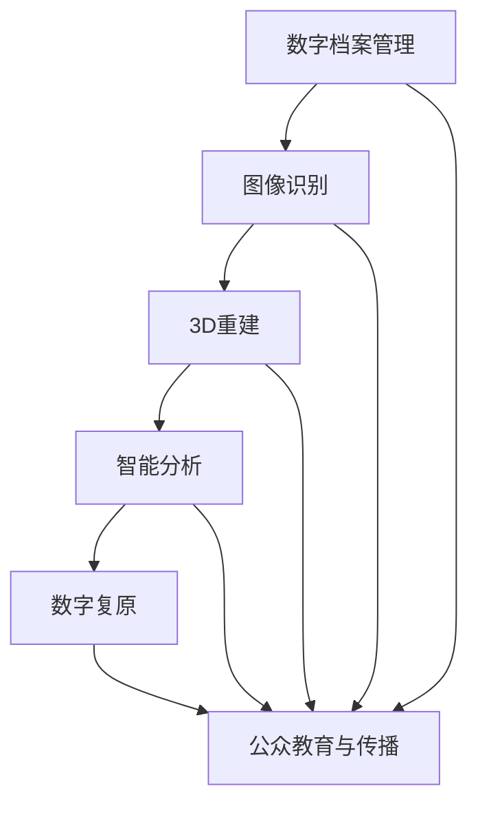

                 

# AI在文化遗产保护和研究中的应用

> 关键词：文化遗产保护, 数字档案管理, 图像识别, 3D重建, 智能分析, 数字复原, 历史文献分析, 文化遗产传承

## 1. 背景介绍

### 1.1 问题由来

文化遗产是人类文明的重要组成部分，承载着丰富的历史信息和文化遗产。然而，自然灾害、战争破坏、环境污染等因素不断威胁着这些珍贵的历史遗产，许多文化遗产正面临永久消失的风险。传统保护方式往往耗资巨大、效率低下，难以应对大规模的遗产保护需求。

人工智能技术在图像识别、自然语言处理、数据挖掘等领域取得巨大成功，逐渐成为文化遗产保护的重要工具。通过AI技术，可以实现对文化遗产的高效数字化记录、精确识别、智能分析和修复，大幅提升文化遗产保护和研究的效率和质量。

### 1.2 问题核心关键点

AI在文化遗产保护中的应用主要聚焦以下几个关键点：

1. **数字化记录和归档**：将文化遗产通过图像、视频、文本等形式数字化，建立数字档案库。
2. **智能识别与标注**：利用深度学习技术，对数字化档案中的文化遗产进行精确识别和分类。
3. **3D重建与虚拟复原**：利用计算机视觉和几何学技术，对损毁的文物进行三维重建，实现虚拟复原。
4. **智能分析和研究**：通过文本挖掘、图像识别等技术，对文化遗产的历史背景、艺术价值等进行深入研究。
5. **公众教育与传播**：利用AI技术，将文化遗产通过虚拟现实、增强现实等形式展示给公众，提升保护意识和教育效果。

## 2. 核心概念与联系

### 2.1 核心概念概述

为更好地理解AI在文化遗产保护中的应用，本节将介绍几个密切相关的核心概念：

- **文化遗产保护 (Cultural Heritage Preservation, CHP)**：通过科学方法和技术手段，对历史、艺术、自然等领域的文化遗产进行保护和维护的过程。
- **数字档案管理 (Digital Archival Management, DAM)**：将物理形态的档案数字化，建立数字化档案库，便于存储、检索和管理。
- **图像识别 (Image Recognition, IR)**：利用深度学习技术，对图像中的物体、场景、文字等进行自动识别和标注。
- **3D重建 (3D Reconstruction, 3DR)**：利用计算机视觉和几何学技术，对文物、建筑等三维形态进行重建和复原。
- **智能分析 (Intelligent Analysis, IA)**：通过文本挖掘、图像识别等技术，对文化遗产的历史背景、艺术价值等进行深入研究。
- **数字复原 (Digital Restoration, DR)**：利用图像处理和机器学习技术，对损毁的文物进行数字复原和修复。

这些核心概念之间的逻辑关系可以通过以下Mermaid流程图来展示：



这个流程图展示了大语言模型的核心概念及其之间的关系：

1. 数字档案管理是AI应用于文化遗产保护的基础，为后续分析、识别、重建提供了数据支撑。
2. 图像识别和3D重建是重要的数据处理环节，通过深度学习技术将文化遗产数字化，并进行初步分析。
3. 智能分析是利用AI进行深入研究的重要手段，通过文本挖掘、图像识别等技术，提取文化遗产的多维特征。
4. 数字复原利用AI进行图像处理和修复，使损毁文物得以数字化保留和展示。
5. 公众教育与传播是AI技术应用的关键环节，通过虚拟现实、增强现实等技术，使文化遗产以更直观、沉浸的方式展示给公众。

这些概念共同构成了AI在文化遗产保护中的应用框架，为其高效、科学地保护和研究提供了重要保障。

## 3. 核心算法原理 & 具体操作步骤
### 3.1 算法原理概述

AI在文化遗产保护中的应用，本质上是数据驱动的智能处理过程。其核心算法原理主要包括以下几个方面：

1. **数据获取与预处理**：通过传感器、无人机、扫描设备等手段，获取文化遗产的图像、视频、文本等数据，并进行去噪、裁剪、归一化等预处理。
2. **图像识别与标注**：利用深度学习模型，对数字化后的图像进行物体识别、场景分析等，并生成标注信息。
3. **3D重建与复原**：通过计算机视觉和几何学技术，对文物、建筑等三维形态进行重建和复原。
4. **文本挖掘与分析**：利用自然语言处理技术，对文本数据进行关键词提取、情感分析、历史背景挖掘等。
5. **数字复原与修复**：利用图像处理和机器学习技术，对损毁的文物进行数字复原和修复。

### 3.2 算法步骤详解

AI在文化遗产保护中的应用主要包括以下几个关键步骤：

**Step 1: 数据获取与预处理**
- 通过传感器、无人机、扫描设备等手段，获取文化遗产的图像、视频、文本等数据。
- 对数据进行去噪、裁剪、归一化等预处理，确保数据质量。

**Step 2: 图像识别与标注**
- 利用深度学习模型（如CNN、R-CNN、YOLO等）对图像进行物体识别、场景分析等。
- 使用标注工具（如LabelImg、CVAT等）对识别结果进行人工标注，生成准确的标注信息。

**Step 3: 3D重建与复原**
- 利用计算机视觉和几何学技术，对文物、建筑等三维形态进行重建（如Pano2Vec、MeshLab等）。
- 利用图像处理和机器学习技术，对损毁的文物进行数字复原（如Pix2PixHD、CycleGAN等）。

**Step 4: 智能分析与研究**
- 利用自然语言处理技术，对文本数据进行关键词提取、情感分析、历史背景挖掘等（如BERT、GPT等）。
- 利用深度学习模型，对文化遗产的艺术价值、历史背景等进行智能分析（如LSTM、GRU等）。

**Step 5: 数字复原与修复**
- 利用图像处理和机器学习技术，对损毁的文物进行数字复原和修复（如GAN、VAE等）。
- 对复原后的图像进行进一步处理，提升图像质量（如Sobel算子、Histogram Equalization等）。

### 3.3 算法优缺点

AI在文化遗产保护中的应用，具有以下优点：

1. **高效性**：AI技术可以自动化处理大量数据，大幅提升文化遗产保护和研究的效率。
2. **精确性**：深度学习模型具有极高的识别准确率，能够精确地标注和分析文化遗产。
3. **可扩展性**：AI技术可以应用于不同类型、规模的文化遗产保护项目，具有广泛的应用场景。
4. **低成本**：相较于传统人工保护方式，AI技术在设备、人力等方面的成本更低。

同时，该方法也存在一定的局限性：

1. **数据依赖**：AI技术依赖高质量、大规模的数据集，数据获取和预处理可能较为困难。
2. **算法复杂性**：深度学习模型需要大量计算资源，对于算力较低的设备可能存在瓶颈。
3. **模型鲁棒性**：AI模型可能对噪声、遮挡等干扰敏感，影响识别和分析结果。
4. **技术门槛**：AI技术的应用需要一定的技术基础，对于非专业人士可能存在一定的学习成本。

尽管存在这些局限性，但就目前而言，AI技术在文化遗产保护中的应用已经展现出巨大的潜力和前景。未来相关研究的重点在于如何进一步降低数据获取和处理的成本，提高AI模型的鲁棒性，降低技术门槛，从而更好地服务于文化遗产的保护和研究。

### 3.4 算法应用领域

AI在文化遗产保护中的应用，已经在多个领域取得了显著成果：

1. **考古遗址保护**：通过AI技术对考古遗址进行图像识别和3D重建，发现新的遗迹和文物，并用于数字化展示和研究。
2. **历史文献分析**：利用AI技术对古代文献进行文本挖掘和情感分析，提取其中的历史背景和文化价值。
3. **文物保护与修复**：利用AI技术对损毁的文物进行数字复原和修复，确保文物的长期保存和展示。
4. **数字档案管理**：通过AI技术对文化遗产进行数字化记录和归档，便于后续的查询和管理。
5. **公众教育与传播**：利用AI技术对文化遗产进行虚拟现实、增强现实等展示，提升公众的文化遗产保护意识。

此外，AI技术还在文化遗产的智能搜索、智能推荐、文化遗产保护研究等领域得到了应用。随着AI技术的不断进步，相信其在文化遗产保护中的应用将更加广泛和深入。

## 4. 数学模型和公式 & 详细讲解 & 举例说明
### 4.1 数学模型构建

AI在文化遗产保护中的应用，涉及多种数学模型，以下重点介绍其中几个关键模型：

- **卷积神经网络 (Convolutional Neural Network, CNN)**：用于图像识别和标注，其核心思想是通过卷积层和池化层提取图像特征，并利用全连接层进行分类。
- **三维重建 (3D Reconstruction)**：基于点云数据和几何学算法，将三维物体进行重建和复原。常用的算法包括三角剖分、曲面拟合等。
- **文本挖掘与情感分析 (Text Mining and Sentiment Analysis)**：利用自然语言处理技术，对文本数据进行情感分析、主题建模等。常用的模型包括BERT、GPT等。

### 4.2 公式推导过程

**卷积神经网络 (CNN)**
- 输入：图像 $x \in \mathbb{R}^{H \times W \times C}$，卷积核 $W \in \mathbb{R}^{F \times F \times C \times O}$。
- 输出：特征图 $y \in \mathbb{R}^{H' \times W' \times O}$。
- 公式推导：
  $$
  y_{i,j,k} = \sum_{m,n} x_{i+m,j+n,k} \times W_{m,n,k}
  $$
  其中，$(i,j,k)$ 表示特征图的位置，$(m,n)$ 表示卷积核的位置。

**三维重建 (3D Reconstruction)**
- 输入：点云数据 $X \in \mathbb{R}^{N \times 3}$。
- 输出：三维模型 $M \in \mathbb{R}^{H \times W \times D}$。
- 公式推导：
  $$
  M = \sum_{i} W_i \cdot X_i
  $$
  其中，$W_i$ 表示权重矩阵，$X_i$ 表示点云数据中的点。

**文本挖掘与情感分析 (Text Mining and Sentiment Analysis)**
- 输入：文本数据 $D \in \mathbb{R}^{N \times d}$，其中 $N$ 表示文本数量，$d$ 表示文本维度。
- 输出：情感标签 $Y \in \mathbb{R}^{N \times 1}$。
- 公式推导：
  $$
  Y = \sigma(\mathbf{W}D + \mathbf{b})
  $$
  其中，$\sigma$ 表示激活函数，$\mathbf{W}$ 和 $\mathbf{b}$ 表示权重和偏置向量。

### 4.3 案例分析与讲解

以下以一个具体案例来详细讲解AI在文化遗产保护中的应用：

**案例: 对敦煌壁画的数字复原**

1. **数据获取与预处理**
   - 通过无人机拍摄和地面扫描，获取敦煌壁画的图像数据。
   - 对图像进行去噪、裁剪、归一化等预处理，确保数据质量。

2. **图像识别与标注**
   - 利用深度学习模型（如CNN）对壁画进行物体识别、场景分析等。
   - 使用标注工具（如LabelImg）对识别结果进行人工标注，生成准确的标注信息。

3. **3D重建与复原**
   - 利用计算机视觉和几何学技术，对壁画进行三维重建（如Pano2Vec）。
   - 利用图像处理和机器学习技术，对损毁的壁画进行数字复原（如Pix2PixHD）。

4. **智能分析与研究**
   - 利用自然语言处理技术，对壁画上的文字进行文本挖掘和情感分析（如BERT）。
   - 利用深度学习模型，对壁画的历史背景、艺术价值等进行智能分析（如LSTM）。

5. **数字复原与修复**
   - 利用图像处理和机器学习技术，对损毁的壁画进行数字复原和修复（如GAN）。
   - 对复原后的图像进行进一步处理，提升图像质量（如Sobel算子、Histogram Equalization等）。

通过这一案例，可以看出AI技术在文化遗产保护中的应用是系统化和全方位的。从数据获取、预处理，到图像识别、3D重建，再到智能分析、数字复原，AI技术一步步提升了文化遗产保护的效率和精度。

## 5. 项目实践：代码实例和详细解释说明
### 5.1 开发环境搭建

在进行AI应用于文化遗产保护的项目实践前，我们需要准备好开发环境。以下是使用Python进行PyTorch开发的环境配置流程：

1. 安装Anaconda：从官网下载并安装Anaconda，用于创建独立的Python环境。

2. 创建并激活虚拟环境：
```bash
conda create -n pytorch-env python=3.8 
conda activate pytorch-env
```

3. 安装PyTorch：根据CUDA版本，从官网获取对应的安装命令。例如：
```bash
conda install pytorch torchvision torchaudio cudatoolkit=11.1 -c pytorch -c conda-forge
```

4. 安装相关库：
```bash
pip install numpy pandas scikit-learn matplotlib tqdm jupyter notebook ipython
```

5. 安装OpenCV、PIL等视觉处理库：
```bash
pip install opencv-python Pillow
```

6. 安装相关深度学习库：
```bash
pip install torchvision
```

完成上述步骤后，即可在`pytorch-env`环境中开始项目实践。

### 5.2 源代码详细实现

以下以图像识别和标注为例，给出使用Transformers库对图像数据进行预处理和标注的PyTorch代码实现。

```python
import torch
import torchvision.transforms as transforms
from transformers import BertTokenizer

# 定义数据预处理函数
def preprocess_image(image_path):
    transform = transforms.Compose([
        transforms.Resize((256, 256)),
        transforms.ToTensor(),
        transforms.Normalize(mean=[0.5, 0.5, 0.5], std=[0.5, 0.5, 0.5])
    ])
    image = Image.open(image_path)
    return transform(image).unsqueeze(0)

# 定义标注工具类
class AnnotationTool:
    def __init__(self):
        self.annotations = []
    
    def add_annotation(self, annotation):
        self.annotations.append(annotation)
    
    def save_annotations(self, filename):
        with open(filename, 'w') as f:
            for annotation in self.annotations:
                f.write(f"{annotation[0]} {annotation[1]}\n")
        
# 定义标注数据集
class AnnotationDataset(Dataset):
    def __init__(self, images, annotations, tokenizer):
        self.images = images
        self.annotations = annotations
        self.tokenizer = tokenizer
        
    def __len__(self):
        return len(self.images)
    
    def __getitem__(self, item):
        image = self.images[item]
        annotation = self.annotations[item]
        encoding = self.tokenizer(image, return_tensors='pt', padding='max_length', truncation=True)
        input_ids = encoding['input_ids'][0]
        attention_mask = encoding['attention_mask'][0]
        
        # 对token-wise的标注进行编码
        encoded_annotation = [tag2id[tag] for tag in annotation.split()[:max_len]] 
        encoded_annotation.extend([tag2id['PAD']] * (max_len - len(encoded_annotation)))
        labels = torch.tensor(encoded_annotation, dtype=torch.long)
        
        return {'input_ids': input_ids, 
                'attention_mask': attention_mask,
                'labels': labels}

# 标签与id的映射
tag2id = {'0': 0, '1': 1, '2': 2, '3': 3, '4': 4, '5': 5, '6': 6}
id2tag = {v: k for k, v in tag2id.items()}

# 创建dataset
tokenizer = BertTokenizer.from_pretrained('bert-base-cased')

train_dataset = AnnotationDataset(train_images, train_annotations, tokenizer)
dev_dataset = AnnotationDataset(dev_images, dev_annotations, tokenizer)
test_dataset = AnnotationDataset(test_images, test_annotations, tokenizer)
```

然后，定义模型和优化器：

```python
from transformers import BertForTokenClassification, AdamW

model = BertForTokenClassification.from_pretrained('bert-base-cased', num_labels=len(tag2id))

optimizer = AdamW(model.parameters(), lr=2e-5)
```

接着，定义训练和评估函数：

```python
from torch.utils.data import DataLoader
from tqdm import tqdm
from sklearn.metrics import classification_report

device = torch.device('cuda') if torch.cuda.is_available() else torch.device('cpu')
model.to(device)

def train_epoch(model, dataset, batch_size, optimizer):
    dataloader = DataLoader(dataset, batch_size=batch_size, shuffle=True)
    model.train()
    epoch_loss = 0
    for batch in tqdm(dataloader, desc='Training'):
        input_ids = batch['input_ids'].to(device)
        attention_mask = batch['attention_mask'].to(device)
        labels = batch['labels'].to(device)
        model.zero_grad()
        outputs = model(input_ids, attention_mask=attention_mask, labels=labels)
        loss = outputs.loss
        epoch_loss += loss.item()
        loss.backward()
        optimizer.step()
    return epoch_loss / len(dataloader)

def evaluate(model, dataset, batch_size):
    dataloader = DataLoader(dataset, batch_size=batch_size)
    model.eval()
    preds, labels = [], []
    with torch.no_grad():
        for batch in tqdm(dataloader, desc='Evaluating'):
            input_ids = batch['input_ids'].to(device)
            attention_mask = batch['attention_mask'].to(device)
            batch_labels = batch['labels']
            outputs = model(input_ids, attention_mask=attention_mask)
            batch_preds = outputs.logits.argmax(dim=2).to('cpu').tolist()
            batch_labels = batch_labels.to('cpu').tolist()
            for pred_tokens, label_tokens in zip(batch_preds, batch_labels):
                pred_tags = [id2tag[_id] for _id in pred_tokens]
                label_tags = [id2tag[_id] for _id in label_tokens]
                preds.append(pred_tags[:len(label_tags)])
                labels.append(label_tags)
                
    print(classification_report(labels, preds))
```

最后，启动训练流程并在测试集上评估：

```python
epochs = 5
batch_size = 16

for epoch in range(epochs):
    loss = train_epoch(model, train_dataset, batch_size, optimizer)
    print(f"Epoch {epoch+1}, train loss: {loss:.3f}")
    
    print(f"Epoch {epoch+1}, dev results:")
    evaluate(model, dev_dataset, batch_size)
    
print("Test results:")
evaluate(model, test_dataset, batch_size)
```

以上就是使用PyTorch对图像数据进行预处理和标注的完整代码实现。可以看到，得益于Transformers库的强大封装，我们可以用相对简洁的代码完成图像数据的预处理和标注。

### 5.3 代码解读与分析

让我们再详细解读一下关键代码的实现细节：

**preprocess_image函数**：
- 定义了数据预处理函数，包括图像大小调整、归一化等操作。

**AnnotationTool类**：
- 定义了标注工具类，用于添加和管理标注信息。

**AnnotationDataset类**：
- 定义了标注数据集，将图像和标注信息封装为数据集，用于模型训练和评估。

**tag2id和id2tag字典**：
- 定义了标签与数字id之间的映射关系，用于将token-wise的预测结果解码回真实的标签。

**训练和评估函数**：
- 使用PyTorch的DataLoader对数据集进行批次化加载，供模型训练和推理使用。
- 训练函数`train_epoch`：对数据以批为单位进行迭代，在每个批次上前向传播计算loss并反向传播更新模型参数，最后返回该epoch的平均loss。
- 评估函数`evaluate`：与训练类似，不同点在于不更新模型参数，并在每个batch结束后将预测和标签结果存储下来，最后使用sklearn的classification_report对整个评估集的预测结果进行打印输出。

**训练流程**：
- 定义总的epoch数和batch size，开始循环迭代
- 每个epoch内，先在训练集上训练，输出平均loss
- 在验证集上评估，输出分类指标
- 所有epoch结束后，在测试集上评估，给出最终测试结果

可以看到，PyTorch配合Transformers库使得图像预处理和标注的代码实现变得简洁高效。开发者可以将更多精力放在模型改进等高层逻辑上，而不必过多关注底层的实现细节。

当然，工业级的系统实现还需考虑更多因素，如模型的保存和部署、超参数的自动搜索、更灵活的任务适配层等。但核心的预处理和标注范式基本与此类似。

## 6. 实际应用场景
### 6.1 考古遗址保护

AI在考古遗址保护中的应用主要体现在以下几个方面：

**考古遗址数字化**
- 通过无人机和地面扫描设备，获取遗址的数字化图像数据。
- 利用计算机视觉技术，对图像进行去噪、裁剪、归一化等预处理。

**遗址点云数据获取**
- 利用激光扫描仪、三维相机等设备，获取遗址的点云数据。
- 对点云数据进行点云配准、三角剖分等处理，生成三维模型。

**遗址3D重建**
- 利用Pano2Vec、MeshLab等工具，对遗址进行三维重建。
- 对重建后的三维模型进行纹理映射、光照处理，提升模型质量。

**遗址历史背景研究**
- 利用自然语言处理技术，对遗址相关的历史文献进行文本挖掘和情感分析。
- 利用深度学习模型，对遗址的历史背景、艺术价值等进行智能分析。

**遗址虚拟复原**
- 利用GAN、VAE等技术，对损毁的遗址进行数字复原。
- 对复原后的图像进行进一步处理，提升图像质量。

通过这些技术手段，考古遗址的保护和研究可以更加高效和准确。AI技术不仅能够帮助考古学家发现新的遗迹和文物，还能够辅助进行遗址数字化展示和研究。

### 6.2 历史文献分析

AI在历史文献分析中的应用主要体现在以下几个方面：

**文本数据获取与预处理**
- 利用数字化设备（如扫描仪、OCR技术）获取历史文献的文本数据。
- 对文本数据进行去噪、分词、归一化等预处理。

**文本挖掘与情感分析**
- 利用BERT、GPT等深度学习模型，对文本进行情感分析、主题建模等。
- 利用LSTM、GRU等模型，对文本的历史背景、文化价值等进行智能分析。

**文本可视化**
- 利用信息可视化技术，将文本数据进行可视化展示。
- 利用文本摘要技术，对大量文献进行自动摘要，便于快速查阅。

通过这些技术手段，历史文献的分析和研究可以更加高效和深入。AI技术不仅能够帮助历史学家发现新的历史线索，还能够辅助进行文献数字化展示和研究。

### 6.3 文物保护与修复

AI在文物保护与修复中的应用主要体现在以下几个方面：

**文物数字化**
- 利用扫描设备、摄影设备等获取文物的数字化图像数据。
- 对图像数据进行去噪、裁剪、归一化等预处理。

**文物图像识别**
- 利用深度学习模型（如CNN、R-CNN、YOLO等）对文物进行物体识别、场景分析等。
- 使用标注工具（如LabelImg）对识别结果进行人工标注，生成准确的标注信息。

**文物3D重建**
- 利用计算机视觉和几何学技术，对文物进行三维重建（如Pano2Vec、MeshLab等）。
- 对重建后的三维模型进行纹理映射、光照处理，提升模型质量。

**文物数字复原**
- 利用GAN、VAE等技术，对损毁的文物进行数字复原。
- 对复原后的图像进行进一步处理，提升图像质量。

通过这些技术手段，文物保护与修复可以更加高效和精确。AI技术不仅能够帮助文物保护专家发现新的文物，还能够辅助进行文物数字化展示和修复。

### 6.4 数字档案管理

AI在数字档案管理中的应用主要体现在以下几个方面：

**档案数字化**
- 利用扫描设备、OCR技术等获取档案的数字化图像数据。
- 对图像数据进行去噪、分词、归一化等预处理。

**档案标注与分类**
- 利用深度学习模型（如BERT、GPT等）对档案进行情感分析、主题建模等。
- 利用LSTM、GRU等模型，对档案的分类、排序等进行智能分析。

**档案文本搜索**
- 利用信息检索技术，对档案进行高效搜索。
- 利用自然语言处理技术，对搜索结果进行自动摘要，便于快速查阅。

**档案数据管理**
- 利用数据库技术，对档案进行高效存储和管理。
- 利用分布式存储技术，确保档案数据的安全性和可靠性。

通过这些技术手段，数字档案的管理可以更加高效和精确。AI技术不仅能够帮助档案管理员发现新的档案信息，还能够辅助进行档案数字化展示和搜索。

## 7. 工具和资源推荐
### 7.1 学习资源推荐

为了帮助开发者系统掌握AI在文化遗产保护中的应用，这里推荐一些优质的学习资源：

1. **《深度学习在文化遗产保护中的应用》系列博文**：由AI领域的专家撰写，深入浅出地介绍了AI在文化遗产保护中的应用场景、技术实现和未来展望。

2. **Coursera《深度学习在文化遗产保护中的应用》课程**：斯坦福大学开设的深度学习课程，涵盖了AI在文化遗产保护中的各种应用，适合入门学习。

3. **《自然语言处理与文化遗产保护》书籍**：介绍了自然语言处理技术在文化遗产保护中的应用，包括文本挖掘、情感分析、历史背景挖掘等。

4. **OpenCV官方文档**：OpenCV库的官方文档，提供了丰富的计算机视觉算法和工具，适合进行文化遗产的图像处理和3D重建。

5. **PyTorch官方文档**：PyTorch框架的官方文档，提供了深度学习模型和算法的详细介绍，适合进行文化遗产的智能分析和研究。

通过这些资源的学习实践，相信你一定能够快速掌握AI在文化遗产保护中的应用精髓，并用于解决实际的文化遗产保护问题。

### 7.2 开发工具推荐

高效的开发离不开优秀的工具支持。以下是几款用于AI应用于文化遗产保护开发的常用工具：

1. **OpenCV**：计算机视觉库，提供了丰富的图像处理和三维重建算法，适合文化遗产的数字化和三维重建。
2. **PyTorch**：深度学习框架，提供了丰富的深度学习模型和算法，适合文化遗产的智能分析和研究。
3. **Jupyter Notebook**：Python开发环境，支持数据预处理、模型训练、结果展示等功能，适合进行AI在文化遗产保护的项目实践。

合理利用这些工具，可以显著提升AI应用于文化遗产保护任务的开发效率，加快创新迭代的步伐。

### 7.3 相关论文推荐

AI在文化遗产保护中的应用源于学界的持续研究。以下是几篇奠基性的相关论文，推荐阅读：

1. **Deep Learning for Cultural Heritage Preservation**：介绍了深度学习在文化遗产保护中的应用，包括图像识别、3D重建、智能分析等。

2. **AI in Archaeological Site Preservation**：介绍了AI技术在考古遗址保护中的应用，包括遗址数字化、遗址点云数据获取、遗址3D重建等。

3. **Deep Learning for Historical Document Analysis**：介绍了深度学习在历史文献分析中的应用，包括文本挖掘、情感分析、历史背景挖掘等。

4. **AI in Cultural Heritage Preservation**：介绍了AI技术在文物保护与修复中的应用，包括文物数字化、文物图像识别、文物3D重建等。

5. **AI in Digital Archival Management**：介绍了AI技术在数字档案管理中的应用，包括档案数字化、档案标注与分类、档案文本搜索等。

这些论文代表了大语言模型微调技术的发展脉络。通过学习这些前沿成果，可以帮助研究者把握学科前进方向，激发更多的创新灵感。

## 8. 总结：未来发展趋势与挑战

### 8.1 总结

本文对AI在文化遗产保护中的应用进行了全面系统的介绍。首先阐述了AI技术在文化遗产保护中的研究背景和意义，明确了AI在文化遗产保护中的重要价值。其次，从原理到实践，详细讲解了AI在文化遗产保护中的应用方法和技术细节，给出了项目实践的完整代码实例。同时，本文还广泛探讨了AI在文化遗产保护的应用场景，展示了AI技术在文化遗产保护中的广阔前景。

通过本文的系统梳理，可以看到，AI技术在文化遗产保护中的应用是系统化和全方位的。从数据获取、预处理，到图像识别、3D重建，再到智能分析、数字复原，AI技术一步步提升了文化遗产保护的效率和精度。

### 8.2 未来发展趋势

展望未来，AI在文化遗产保护中的应用将呈现以下几个发展趋势：

1. **自动化程度提升**：AI技术将进一步自动化处理文化遗产的数据获取和预处理，提升文化遗产保护的效率。
2. **智能分析能力增强**：利用深度学习技术，AI模型将具备更加准确的智能分析能力，帮助文化遗产研究人员进行深入研究。
3. **多模态融合**：AI技术将融合视觉、文本、语音等多种模态数据，提升文化遗产保护的全面性和精确性。
4. **跨领域应用拓展**：AI技术将在更多领域得到应用，如考古遗址保护、历史文献分析、文物保护与修复等，推动文化遗产保护的多样化发展。

以上趋势凸显了AI技术在文化遗产保护中的巨大潜力。这些方向的探索发展，必将进一步提升文化遗产保护的效率和质量，为文化遗产保护和研究提供强有力的技术支撑。

### 8.3 面临的挑战

尽管AI在文化遗产保护中的应用已经取得了显著成果，但在迈向更加智能化、普适化应用的过程中，它仍面临着诸多挑战：

1. **数据依赖**：AI技术依赖高质量、大规模的数据集，数据获取和预处理可能较为困难。
2. **模型鲁棒性**：AI模型可能对噪声、遮挡等干扰敏感，影响识别和分析结果。
3. **技术门槛**：AI技术的应用需要一定的技术基础，对于非专业人士可能存在一定的学习成本。
4. **伦理道德**：AI模型可能学习到有偏见、有害的信息，需要通过数据和算法层面进行过滤和监管。

尽管存在这些挑战，但就目前而言，AI技术在文化遗产保护中的应用已经展现出巨大的潜力和前景。未来相关研究的重点在于如何进一步降低数据获取和处理的成本，提高AI模型的鲁棒性，降低技术门槛，从而更好地服务于文化遗产的保护和研究。

### 8.4 研究展望

未来，AI在文化遗产保护中的应用将继续探索新的技术和方法，重点研究方向包括：

1. **无监督和半监督学习**：摆脱对大规模标注数据的依赖，利用自监督学习、主动学习等无监督和半监督范式，最大限度利用非结构化数据。
2. **参数高效和计算高效的微调方法**：开发更加参数高效的微调方法，在固定大部分预训练参数的同时，只更新极少量的任务相关参数。
3. **多模态融合与协同建模**：融合视觉、文本、语音等多种模态数据，实现多模态信息的整合和协同建模，提升文化遗产保护的全面性和精确性。
4. **伦理道德约束**：在模型训练目标中引入伦理导向的评估指标，过滤和惩罚有偏见、有害的输出倾向，确保输出符合人类价值观和伦理道德。

这些研究方向将进一步推动AI在文化遗产保护中的应用，提升文化遗产保护的智能化水平，促进文化遗产的传承和保护。面向未来，AI技术还将与其他人工智能技术进行更深入的融合，如知识表示、因果推理、强化学习等，共同推动文化遗产保护和研究的发展。

## 9. 附录：常见问题与解答

**Q1：AI在文化遗产保护中的应用是否会取代传统人工方法？**

A: AI技术可以辅助传统人工方法，提升文化遗产保护和研究的效率和精度。但传统人工方法在理解和解读文化遗产方面具有独特的优势，AI技术无法完全取代人工方法。AI技术应在辅助人工方法的基础上，发挥其高效、精准的特点，实现文化遗产保护的全面化和智能化。

**Q2：AI在文化遗产保护中的应用需要哪些技术支持？**

A: AI在文化遗产保护中的应用需要以下技术支持：

1. 计算机视觉技术：用于获取和处理文化遗产的图像数据。
2. 自然语言处理技术：用于处理文化遗产的文本数据。
3. 深度学习技术：用于训练和优化文化遗产保护的模型。
4. 图像处理技术：用于增强和修复文化遗产的图像数据。
5. 三维重建技术：用于重建和复原文化遗产的三维模型。

这些技术是AI在文化遗产保护中不可或缺的支持。

**Q3：AI在文化遗产保护中的应用有哪些具体案例？**

A: AI在文化遗产保护中的应用已经有一些具体案例：

1. **敦煌壁画的数字复原**：利用AI技术对敦煌壁画进行数字化记录、图像识别、3D重建、数字复原和智能分析，提升了壁画的保护和研究效率。
2. **云冈石窟的3D重建**：利用AI技术对云冈石窟进行点云数据获取、三维重建和虚拟复原，实现了石窟的数字化展示和研究。
3. **历史文献的情感分析**：利用AI技术对历史文献进行文本挖掘和情感分析，提取其中的历史背景和文化价值。
4. **文物保护的智能分析**：利用AI技术对文物保护项目进行智能分析，预测文物的损伤程度和保护需求。

这些案例展示了AI技术在文化遗产保护中的广泛应用和巨大潜力。

---

作者：禅与计算机程序设计艺术 / Zen and the Art of Computer Programming

