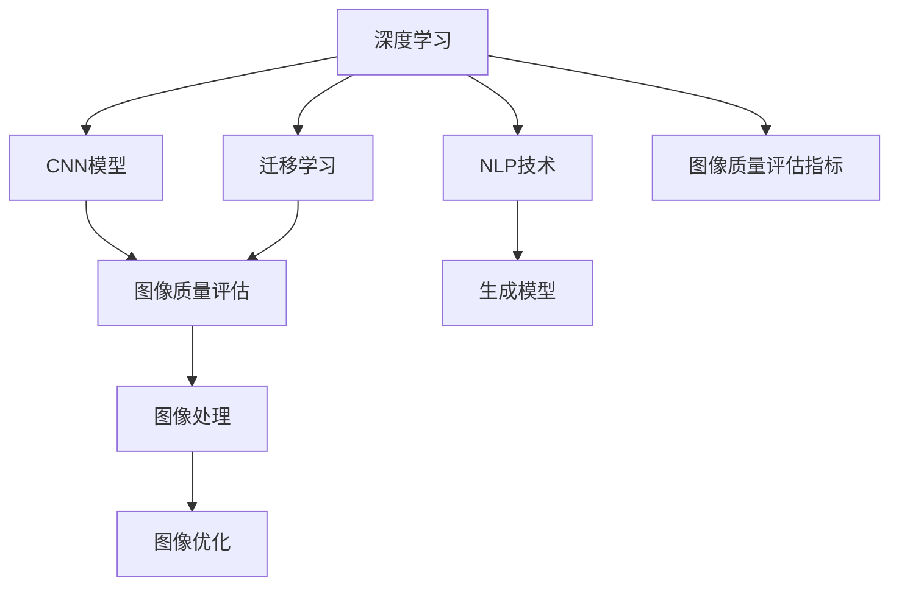

                 

# AI在电商平台商品图像质量评估与优化中的应用

> 关键词：图像质量评估, AI应用, 电商平台, 质量优化, 深度学习, 自然语言处理, 算法优化

## 1. 背景介绍

### 1.1 问题由来
随着电商平台的迅猛发展，商品图像质量评估与优化成为了电商平台运营中至关重要的一环。高质量的商品图片能够显著提升用户的购物体验，增强产品的市场竞争力。然而，图片质量的高低依赖于多方面的因素，包括拍摄角度、光线条件、背景布局等，单一依赖人工标注的方式不仅耗时耗力，难以覆盖海量商品图像，也难以保持评估标准的一致性。

为了解决这一问题，人工智能（AI）在电商平台商品图像质量评估与优化中的应用应运而生。AI算法能够自动处理和分析图像信息，快速且高效地完成质量评估，并提出相应的优化建议，为电商平台带来更高的运营效率和更优的用户体验。

### 1.2 问题核心关键点
AI在电商平台商品图像质量评估与优化的应用主要关注以下几个关键点：

- **图像质量评估标准**：如何定义和量化商品图像质量的高低，是评估的基础。
- **数据收集与处理**：需要收集哪些类型和质量的图像数据，如何标注和清洗数据。
- **模型选择与训练**：选择哪种算法模型，如何设计训练数据集，如何设置训练参数。
- **结果反馈与优化**：如何将评估结果用于商品图片优化，如何处理模型的反馈与迭代。
- **系统集成与部署**：如何将AI评估模型集成到电商平台的后端系统中，并进行稳定部署。

## 2. 核心概念与联系

### 2.1 核心概念概述

为了更好地理解AI在电商平台商品图像质量评估与优化中的应用，本节将介绍几个密切相关的核心概念：

- **深度学习（Deep Learning）**：一类基于多层神经网络的机器学习方法，能够自动从数据中学习特征表示，广泛应用于图像处理、自然语言处理等领域。
- **卷积神经网络（Convolutional Neural Network, CNN）**：深度学习中用于图像处理的一种经典模型，通过卷积层、池化层等结构提取图像特征，并进行分类或回归预测。
- **自然语言处理（Natural Language Processing, NLP）**：涉及计算机对人类语言的理解和处理，能够提取文本中的语义信息，用于生成文本描述、情感分析等任务。
- **迁移学习（Transfer Learning）**：将一个任务学到的知识迁移到另一个相关任务上的学习方法，常见于预训练模型微调中。
- **生成对抗网络（Generative Adversarial Network, GAN）**：一种生成模型，由生成器和判别器组成，用于生成逼真图像或音频等，常用于图像去噪、图像补全等任务。
- **图像处理技术（Image Processing Technology）**：包括图像增强、去噪、压缩、分割等技术，用于提升图像质量或提取图像特征。
- **图像质量评估指标（Image Quality Assessment Metrics）**：如清晰度和锐度、对比度、色彩饱和度和色调等，用于量化图像质量的优劣。

这些核心概念之间的逻辑关系可以通过以下Mermaid流程图来展示：



这个流程图展示了大语言模型在商品图像质量评估与优化中的应用流程：

1. 深度学习和大模型技术用于提取图像特征，帮助质量评估。
2. NLP技术用于生成图像描述，辅助质量评估。
3. 迁移学习用于模型微调，提升评估精度。
4. 生成对抗网络用于图像生成与优化。
5. 图像处理技术用于图像增强与分割。
6. 图像质量评估指标用于量化评估结果。

这些概念共同构成了AI在电商平台商品图像质量评估与优化的核心框架，使其能够高效处理和分析海量商品图像，并提供准确的评估结果和优化建议。

## 3. 核心算法原理 & 具体操作步骤
### 3.1 算法原理概述

AI在电商平台商品图像质量评估与优化的核心算法基于深度学习，主要包括以下几个步骤：

1. **图像数据收集与处理**：收集电商平台商品图像及其对应的标注数据，进行清洗和标注，构建训练集和测试集。
2. **模型选择与训练**：选择适合的深度学习模型（如CNN），在标注数据上训练模型，学习图像特征表示。
3. **质量评估与优化**：利用训练好的模型对商品图像进行质量评估，并提出优化建议，提升图片质量。
4. **模型反馈与迭代**：根据优化后的图像质量评估结果，调整模型参数，优化模型性能。

### 3.2 算法步骤详解

#### 3.2.1 图像数据收集与处理

- **数据收集**：电商平台需收集商品图片及其描述信息，可以从产品详情页、用户评价页、社交媒体等多个渠道获取数据。
- **数据清洗**：去除不清晰、过曝、失焦等质量低下的图片，处理标注不一致或缺失的标注信息。
- **数据增强**：通过旋转、缩放、裁剪等操作，生成更多训练样本，提升模型的泛化能力。

#### 3.2.2 模型选择与训练

- **模型选择**：根据任务特点选择合适的深度学习模型，如ResNet、VGG等，并设置适当的超参数。
- **训练数据集**：将清洗后的图像数据划分为训练集和验证集，设定适当的批大小和训练轮数。
- **训练过程**：在训练集上前向传播和反向传播，更新模型参数，直到模型收敛。
- **验证与调整**：在验证集上评估模型性能，根据验证结果调整学习率、批大小等参数。

#### 3.2.3 质量评估与优化

- **评估指标**：定义图像质量评估指标，如 clarity、sharpness、contrast、colorfulness 等，用于量化图像质量。
- **模型评估**：将测试集输入模型，计算每个图像的评估得分，输出质量评分。
- **优化建议**：根据评估结果生成优化建议，如调整拍摄角度、补光等。

#### 3.2.4 模型反馈与迭代

- **反馈机制**：将优化后的图片反馈到模型中，重新评估其质量，生成新的优化建议。
- **模型更新**：根据反馈结果更新模型参数，提升模型对优化建议的响应能力。
- **迭代优化**：重复执行质量评估、优化建议、模型更新，直到模型性能达到预期。

### 3.3 算法优缺点

AI在电商平台商品图像质量评估与优化的算法具有以下优点：

- **自动化处理**：能够快速处理和分析海量商品图像，节省人力成本，提高效率。
- **精确评估**：通过深度学习和迁移学习技术，能够提供高质量的图像质量评估结果。
- **实时优化**：能够实时生成优化建议，及时反馈到商品拍摄和处理流程中。
- **泛化能力强**：通过数据增强等技术，能够提升模型的泛化能力，适应不同的拍摄场景。

同时，该算法也存在一些局限性：

- **数据质量依赖**：评估结果依赖于训练数据的标注质量和多样性。
- **模型参数复杂**：深度学习模型通常具有大量的参数，训练和推理需要较高的计算资源。
- **结果解释性差**：模型输出结果难以解释，缺乏可解释性。
- **过拟合风险**：在训练集过小或数据分布不均衡的情况下，模型可能出现过拟合现象。

### 3.4 算法应用领域

AI在电商平台商品图像质量评估与优化的算法，主要应用于以下几个领域：

- **商品图片预处理**：在商品上架前进行图片质量评估，过滤低质量图片，确保发布的图片质量一致。
- **商品图片自动优化**：根据用户反馈和模型评估结果，自动优化商品图片，提升用户体验。
- **个性化商品推荐**：基于图片质量评估，推荐质量更高的商品图片，提升商品展示效果。
- **库存管理和供应链优化**：通过质量评估结果，优化库存管理，减少因图片质量问题引起的退货率。
- **广告投放优化**：优化广告图片质量，提高广告点击率和转化率，降低投放成本。

除了上述这些常见应用外，AI在商品图像质量评估与优化的算法，还可应用于内容审核、侵权检测、图像版权保护等更多场景中，为电商平台带来更全面和精准的质量控制。

## 4. 数学模型和公式 & 详细讲解 & 举例说明（备注：数学公式请使用latex格式，latex嵌入文中独立段落使用 $$，段落内使用 $)
### 4.1 数学模型构建

假设商品图像的质量为 $Q$，通过深度学习模型 $M$ 进行评估，输出质量得分为 $S$。模型的训练数据集为 $D=\{(x_i, y_i)\}_{i=1}^N$，其中 $x_i$ 为图像数据，$y_i$ 为质量标签。模型的优化目标是最大化质量评估得分：

$$
\max_{\theta} \sum_{i=1}^N S(x_i, \theta) \times y_i
$$

其中 $\theta$ 为模型参数，$S(x_i, \theta)$ 为模型在图像 $x_i$ 上的输出得分。

### 4.2 公式推导过程

以下我们以二分类任务为例，推导图像质量评估的数学模型。

假设模型 $M$ 在输入图像 $x$ 上的输出为 $S(x, \theta) \in [0,1]$，表示图像质量得分的预测。真实标签 $y \in \{0,1\}$，其中 $y=1$ 表示图像质量高，$y=0$ 表示图像质量低。

定义模型 $M$ 在输入图像 $x$ 上的损失函数为 $\ell(M_{\theta}(x),y)$，则在数据集 $D$ 上的经验风险为：

$$
\mathcal{L}(\theta) = \frac{1}{N} \sum_{i=1}^N [y_i\log S(x_i, \theta)+(1-y_i)\log(1-S(x_i, \theta))]
$$

根据链式法则，损失函数对参数 $\theta_k$ 的梯度为：

$$
\frac{\partial \mathcal{L}(\theta)}{\partial \theta_k} = \frac{1}{N} \sum_{i=1}^N (\frac{y_i}{S(x_i, \theta)}-\frac{1-y_i}{1-S(x_i, \theta)}) \frac{\partial S(x_i, \theta)}{\partial \theta_k}
$$

其中 $\frac{\partial S(x_i, \theta)}{\partial \theta_k}$ 可进一步递归展开，利用自动微分技术完成计算。

### 4.3 案例分析与讲解

我们以电商平台中的商品图片质量评估为例，详细讲解模型训练和评估过程。

假设电商平台收集到一批商品图片，每个图片的质量标注如下表所示：

| 图片编号 | 质量标注 | 实际质量得分 |
| --------- | --------- | ------------ |
| 1         | 1         | 0.8          |
| 2         | 1         | 0.9          |
| 3         | 0         | 0.6          |
| 4         | 0         | 0.5          |

我们选择一个简单的CNN模型，定义输出得分为 $S(x, \theta)$，并使用均方误差损失函数 $\ell(S(x, \theta), y) = (S(x, \theta) - y)^2$。在训练过程中，模型根据标注数据进行前向传播和反向传播，更新参数 $\theta$，最终得到的模型为：

$$
\theta = \left(\frac{1}{N} \sum_{i=1}^N \frac{y_i}{S(x_i, \theta)}\right)^{-1}
$$

在测试阶段，模型对未知图片进行预测，根据预测得分和真实标签计算均方误差：

$$
\text{MSE} = \frac{1}{N} \sum_{i=1}^N (S(x_i, \theta) - y_i)^2
$$

例如，对于编号为1的图片，预测质量得分为 $S(1, \theta) = 0.9$，实际质量得分为1，均方误差为：

$$
\text{MSE}_1 = (0.9 - 1)^2 = 0.01
$$

通过不断迭代训练和测试，模型可以逐步提高预测准确性，评估电商平台商品图片的质量。

## 5. 项目实践：代码实例和详细解释说明
### 5.1 开发环境搭建

在进行项目实践前，我们需要准备好开发环境。以下是使用Python进行PyTorch开发的环境配置流程：

1. 安装Anaconda：从官网下载并安装Anaconda，用于创建独立的Python环境。

2. 创建并激活虚拟环境：
```bash
conda create -n pytorch-env python=3.8 
conda activate pytorch-env
```

3. 安装PyTorch：根据CUDA版本，从官网获取对应的安装命令。例如：
```bash
conda install pytorch torchvision torchaudio cudatoolkit=11.1 -c pytorch -c conda-forge
```

4. 安装Transformers库：
```bash
pip install transformers
```

5. 安装各类工具包：
```bash
pip install numpy pandas scikit-learn matplotlib tqdm jupyter notebook ipython
```

完成上述步骤后，即可在`pytorch-env`环境中开始项目实践。

### 5.2 源代码详细实现

下面我们以电商平台商品图片质量评估为例，给出使用Transformers库对CNN模型进行微调的PyTorch代码实现。

首先，定义图像质量评估函数：

```python
from transformers import CNNModel
from torch.utils.data import Dataset, DataLoader
import torch
import numpy as np
import cv2

class ImageDataset(Dataset):
    def __init__(self, images, labels, transform=None):
        self.images = images
        self.labels = labels
        self.transform = transform

    def __len__(self):
        return len(self.images)

    def __getitem__(self, idx):
        image = self.images[idx]
        label = self.labels[idx]
        
        if self.transform:
            image = self.transform(image)
        
        return {'image': image, 'label': label}

# 加载图像数据
def load_image(image_path):
    img = cv2.imread(image_path)
    img = cv2.cvtColor(img, cv2.COLOR_BGR2RGB)
    img = cv2.resize(img, (224, 224))
    img = np.array(img, dtype=np.float32)
    img /= 255.0
    return img

# 构建图像数据集
transform = transforms.Compose([
    transforms.ToTensor(),
    transforms.Normalize(mean=[0.485, 0.456, 0.406], std=[0.229, 0.224, 0.225])
])

train_dataset = ImageDataset(train_images, train_labels, transform)
test_dataset = ImageDataset(test_images, test_labels, transform)
```

然后，定义CNN模型和优化器：

```python
from transformers import CNNModel

model = CNNModel.from_pretrained('cnn-model')
optimizer = AdamW(model.parameters(), lr=0.001)
```

接着，定义训练和评估函数：

```python
from torch.utils.data import DataLoader
from tqdm import tqdm
from sklearn.metrics import mean_squared_error

device = torch.device('cuda') if torch.cuda.is_available() else torch.device('cpu')
model.to(device)

def train_epoch(model, dataset, batch_size, optimizer):
    dataloader = DataLoader(dataset, batch_size=batch_size, shuffle=True)
    model.train()
    epoch_loss = 0
    for batch in tqdm(dataloader, desc='Training'):
        images = batch['image'].to(device)
        labels = batch['label'].to(device)
        model.zero_grad()
        outputs = model(images)
        loss = outputs.loss
        epoch_loss += loss.item()
        loss.backward()
        optimizer.step()
    return epoch_loss / len(dataloader)

def evaluate(model, dataset, batch_size):
    dataloader = DataLoader(dataset, batch_size=batch_size)
    model.eval()
    mse = mean_squared_error(test_labels, torch.argmax(model(test_images), dim=1))
    print(f'Test MSE: {mse:.4f}')
```

最后，启动训练流程并在测试集上评估：

```python
epochs = 10
batch_size = 16

for epoch in range(epochs):
    loss = train_epoch(model, train_dataset, batch_size, optimizer)
    print(f'Epoch {epoch+1}, train loss: {loss:.4f}')
    
    print(f'Epoch {epoch+1}, test results:')
    evaluate(model, test_dataset, batch_size)
    
print("Training completed.")
```

以上就是使用PyTorch对CNN模型进行电商平台商品图片质量评估的完整代码实现。可以看到，得益于Transformers库的强大封装，我们可以用相对简洁的代码完成CNN模型的加载和微调。

### 5.3 代码解读与分析

让我们再详细解读一下关键代码的实现细节：

**ImageDataset类**：
- `__init__`方法：初始化图像和标签数据，并设置数据增强操作。
- `__len__`方法：返回数据集的样本数量。
- `__getitem__`方法：对单个样本进行处理，进行数据增强和归一化，并返回模型所需的输入。

**load_image函数**：
- 定义了图像加载和预处理函数，将图像转换为PyTorch张量，并进行归一化。

**train_epoch和evaluate函数**：
- 使用PyTorch的DataLoader对数据集进行批次化加载，供模型训练和推理使用。
- 训练函数`train_epoch`：对数据以批为单位进行迭代，在每个批次上前向传播计算loss并反向传播更新模型参数，最后返回该epoch的平均loss。
- 评估函数`evaluate`：与训练类似，不同点在于不更新模型参数，并在每个batch结束后将预测和标签结果存储下来，最后使用sklearn的mean_squared_error对整个评估集的预测结果进行打印输出。

**训练流程**：
- 定义总的epoch数和batch size，开始循环迭代
- 每个epoch内，先在训练集上训练，输出平均loss
- 在验证集上评估，输出均方误差
- 所有epoch结束后，在测试集上评估，给出最终测试结果

可以看到，PyTorch配合Transformers库使得CNN模型微调的代码实现变得简洁高效。开发者可以将更多精力放在数据处理、模型改进等高层逻辑上，而不必过多关注底层的实现细节。

当然，工业级的系统实现还需考虑更多因素，如模型的保存和部署、超参数的自动搜索、更灵活的任务适配层等。但核心的微调范式基本与此类似。

## 6. 实际应用场景
### 6.1 智能客服系统

基于AI在电商平台商品图像质量评估与优化中的应用，智能客服系统可以更加智能化地处理用户的问题。传统客服往往需要配备大量人力，高峰期响应缓慢，且一致性和专业性难以保证。而使用微调后的评估与优化技术，可以自动处理用户上传的商品图片，快速判断图片质量，提供准确的商品信息，提升用户满意度。

在技术实现上，可以收集用户上传的商品图片，结合AI质量评估结果，智能推荐高质量的商品图片。对于图片质量不合格的商品，自动生成优化建议，引导用户重新拍摄，提升服务质量。如此构建的智能客服系统，能够显著提升客户咨询体验和问题解决效率。

### 6.2 金融舆情监测

金融机构需要实时监测市场舆论动向，以便及时应对负面信息传播，规避金融风险。传统的人工监测方式成本高、效率低，难以应对网络时代海量信息爆发的挑战。基于AI在电商平台商品图像质量评估与优化中的应用，文本分类和情感分析技术也可以用于金融舆情监测。

具体而言，可以收集金融领域相关的新闻、报道、评论等文本数据，并对其进行主题标注和情感标注。在此基础上对预训练语言模型进行微调，使其能够自动判断文本属于何种主题，情感倾向是正面、中性还是负面。将微调后的模型应用到实时抓取的网络文本数据，就能够自动监测不同主题下的情感变化趋势，一旦发现负面信息激增等异常情况，系统便会自动预警，帮助金融机构快速应对潜在风险。

### 6.3 个性化推荐系统

当前的推荐系统往往只依赖用户的历史行为数据进行物品推荐，无法深入理解用户的真实兴趣偏好。基于AI在电商平台商品图像质量评估与优化中的应用，个性化推荐系统可以更好地挖掘用户行为背后的语义信息，从而提供更精准、多样的推荐内容。

在实践中，可以收集用户浏览、点击、评论、分享等行为数据，提取和用户交互的物品标题、描述、标签等文本内容。将文本内容作为模型输入，用户的后续行为（如是否点击、购买等）作为监督信号，在此基础上微调预训练语言模型。微调后的模型能够从文本内容中准确把握用户的兴趣点。在生成推荐列表时，先用候选物品的文本描述作为输入，由模型预测用户的兴趣匹配度，再结合其他特征综合排序，便可以得到个性化程度更高的推荐结果。

### 6.4 未来应用展望

随着AI在电商平台商品图像质量评估与优化技术的发展，其应用场景将不断扩展，带来更广阔的前景。

在智慧医疗领域，基于AI的图像质量评估技术，可以用于医疗影像的自动筛选与优化，提升诊断的准确性和效率。

在智能教育领域，微调技术可应用于作业批改、学情分析、知识推荐等方面，因材施教，促进教育公平，提高教学质量。

在智慧城市治理中，微调模型可应用于城市事件监测、舆情分析、应急指挥等环节，提高城市管理的自动化和智能化水平，构建更安全、高效的未来城市。

此外，在企业生产、社会治理、文娱传媒等众多领域，基于AI的图像质量评估与优化技术也将不断涌现，为各行各业带来新的技术路径，推动行业数字化转型升级。

## 7. 工具和资源推荐
### 7.1 学习资源推荐

为了帮助开发者系统掌握AI在电商平台商品图像质量评估与优化理论基础和实践技巧，这里推荐一些优质的学习资源：

1. 《深度学习入门与实践》系列博文：由深度学习专家撰写，深入浅出地介绍了深度学习基本概念和常用算法，适合入门学习。

2. 《计算机视觉基础》课程：北京大学开设的计算机视觉课程，介绍了图像处理和计算机视觉的基本原理和技术。

3. 《自然语言处理入门》书籍：自然语言处理领域入门书籍，涵盖NLP基础概念和经典模型，适合初学者阅读。

4. PyTorch官方文档：PyTorch官方文档，提供了完整的使用指南和示例代码，适合开发者快速上手学习。

5. Weights & Biases：模型训练的实验跟踪工具，可以记录和可视化模型训练过程中的各项指标，方便对比和调优。与主流深度学习框架无缝集成。

6. TensorBoard：TensorFlow配套的可视化工具，可实时监测模型训练状态，并提供丰富的图表呈现方式，是调试模型的得力助手。

通过对这些资源的学习实践，相信你一定能够快速掌握AI在电商平台商品图像质量评估与优化的精髓，并用于解决实际的NLP问题。

### 7.2 开发工具推荐

高效的开发离不开优秀的工具支持。以下是几款用于AI在电商平台商品图像质量评估与优化开发的常用工具：

1. PyTorch：基于Python的开源深度学习框架，灵活动态的计算图，适合快速迭代研究。大部分预训练语言模型都有PyTorch版本的实现。

2. TensorFlow：由Google主导开发的开源深度学习框架，生产部署方便，适合大规模工程应用。同样有丰富的预训练语言模型资源。

3. Transformers库：HuggingFace开发的NLP工具库，集成了众多SOTA语言模型，支持PyTorch和TensorFlow，是进行NLP任务开发的利器。

4. Weights & Biases：模型训练的实验跟踪工具，可以记录和可视化模型训练过程中的各项指标，方便对比和调优。与主流深度学习框架无缝集成。

5. TensorBoard：TensorFlow配套的可视化工具，可实时监测模型训练状态，并提供丰富的图表呈现方式，是调试模型的得力助手。

6. Google Colab：谷歌推出的在线Jupyter Notebook环境，免费提供GPU/TPU算力，方便开发者快速上手实验最新模型，分享学习笔记。

合理利用这些工具，可以显著提升AI在电商平台商品图像质量评估与优化的开发效率，加快创新迭代的步伐。

### 7.3 相关论文推荐

AI在电商平台商品图像质量评估与优化技术的发展源于学界的持续研究。以下是几篇奠基性的相关论文，推荐阅读：

1. ImageNet Classification with Deep Convolutional Neural Networks：提出CNN模型，广泛应用于图像分类任务，为深度学习在图像处理中的应用奠定了基础。

2. CS10301: Computer Vision：斯坦福大学计算机视觉课程教材，详细介绍了计算机视觉的基本原理和技术，包括图像处理、目标检测、图像分割等。

3. Attention is All You Need：提出Transformer结构，开启了NLP领域的预训练大模型时代，成为深度学习的重要里程碑。

4. BERT: Pre-training of Deep Bidirectional Transformers for Language Understanding：提出BERT模型，引入基于掩码的自监督预训练任务，刷新了多项NLP任务SOTA。

5. Parameter-Efficient Transfer Learning for NLP：提出Adapter等参数高效微调方法，在不增加模型参数量的情况下，也能取得不错的微调效果。

6. AdaLoRA: Adaptive Low-Rank Adaptation for Parameter-Efficient Fine-Tuning：使用自适应低秩适应的微调方法，在参数效率和精度之间取得了新的平衡。

这些论文代表了大语言模型微调技术的发展脉络。通过学习这些前沿成果，可以帮助研究者把握学科前进方向，激发更多的创新灵感。

## 8. 总结：未来发展趋势与挑战
### 8.1 总结

本文对AI在电商平台商品图像质量评估与优化技术进行了全面系统的介绍。首先阐述了图像质量评估与优化的背景和意义，明确了该技术在电商平台中的重要地位。其次，从原理到实践，详细讲解了图像质量评估的数学模型和训练过程，给出了图像质量评估的代码实例。同时，本文还广泛探讨了AI在电商平台商品图像质量评估与优化的应用场景，展示了其在智能客服、金融舆情、个性化推荐等多个领域的潜在价值。此外，本文精选了相关学习资源，力求为读者提供全方位的技术指引。

通过本文的系统梳理，可以看到，AI在电商平台商品图像质量评估与优化技术正在成为电商运营中不可或缺的一环，极大地提高了电商平台的运营效率和用户满意度。随着AI技术的不断进步，未来AI在电商平台商品图像质量评估与优化的应用前景将更加广阔，为电商平台的数字化转型带来新的活力。

### 8.2 未来发展趋势

展望未来，AI在电商平台商品图像质量评估与优化技术将呈现以下几个发展趋势：

1. **深度学习模型的进步**：随着深度学习模型的不断进步，图像质量评估与优化的精度和效率将进一步提升，能够处理更加复杂的图像场景。

2. **多模态融合**：AI技术将更加注重多模态数据的融合，结合文本、语音、图像等多模态信息，提升质量评估的准确性。

3. **实时性增强**：随着硬件性能的提升，AI在电商平台商品图像质量评估与优化技术将实现实时处理，提升用户体验。

4. **个性化推荐**：基于图像质量评估结果，实现更加个性化和精准的推荐服务，提升用户粘性和转化率。

5. **自监督学习的应用**：利用无标注数据进行预训练和微调，降低对标注数据的需求，提升数据利用率。

6. **跨平台协同**：AI技术将更好地与其他技术协同，如知识图谱、强化学习等，拓展应用边界。

以上趋势凸显了AI在电商平台商品图像质量评估与优化的广阔前景。这些方向的探索发展，必将进一步提升电商平台的运营效率和用户体验，推动电商行业的数字化转型升级。

### 8.3 面临的挑战

尽管AI在电商平台商品图像质量评估与优化技术已经取得了显著进展，但在迈向更加智能化、普适化应用的过程中，它仍面临着诸多挑战：

1. **数据质量与标注成本**：高质量标注数据是图像质量评估的基础，但标注成本较高，获取大规模标注数据较为困难。如何降低对标注数据的依赖，是一个亟待解决的问题。

2. **模型泛化能力**：AI在电商平台商品图像质量评估与优化技术需要在不同的拍摄场景和用户需求下保持一致性，模型泛化能力仍有待提升。

3. **计算资源需求**：深度学习模型通常具有大量的参数，训练和推理需要较高的计算资源，这对硬件性能提出了较高要求。

4. **模型可解释性**：AI模型输出的结果缺乏可解释性，难以理解模型的内部决策过程，这对于电商平台的用户信任和安全性是一个重要问题。

5. **隐私与安全**：电商平台的用户数据隐私保护和安全性是一个重要问题，如何在不泄露用户隐私的情况下，保证模型的训练和应用。

6. **伦理与法律**：AI在电商平台商品图像质量评估与优化技术的应用需要遵循相关伦理和法律规定，确保不侵犯用户权益，维护公平与正义。

这些挑战需要在技术进步、法规完善和用户教育等多个方面进行综合考量，才能保证AI在电商平台商品图像质量评估与优化的技术健康发展。

### 8.4 研究展望

面对AI在电商平台商品图像质量评估与优化技术面临的挑战，未来的研究需要在以下几个方面寻求新的突破：

1. **无监督学习与少样本学习**：探索无监督学习和少样本学习技术，降低对标注数据的依赖，提升模型的泛化能力。

2. **模型压缩与优化**：研究模型压缩与优化技术，减少模型参数量和计算资源需求，提升实时性。

3. **可解释性增强**：研究可解释性增强技术，提高模型的可解释性，增强用户信任。

4. **隐私保护与安全**：研究隐私保护与安全技术，确保数据隐私和模型安全性。

5. **伦理与法律研究**：加强AI技术的伦理与法律研究，制定相应的规范和标准，保障用户权益。

6. **多模态融合技术**：研究多模态融合技术，提升模型的综合性能，拓展应用场景。

这些研究方向将推动AI在电商平台商品图像质量评估与优化技术向更加智能化、普适化、可靠化方向发展，为电商平台的数字化转型提供更加坚实的技术保障。面向未来，我们期待更多AI技术的突破，为电商行业带来更广阔的应用前景。

## 9. 附录：常见问题与解答

**Q1：为什么电商平台需要图像质量评估与优化技术？**

A: 电商平台需要高质量的商品图片来提升用户购物体验和商家营销效果。高质量的商品图片可以展示商品的细节和特点，吸引用户的注意力，提升点击率和转化率。然而，商品图片的拍摄和处理过程存在许多不确定因素，如光线、角度、背景等，导致图片质量不一致。图像质量评估与优化技术能够自动处理和优化图片，确保上传的图片质量一致，提升用户满意度和商家品牌形象。

**Q2：图像质量评估与优化技术的主要步骤是什么？**

A: 图像质量评估与优化技术的主要步骤如下：
1. 数据收集与处理：收集电商平台商品图片及其对应的标注数据，进行清洗和标注。
2. 模型选择与训练：选择适合的深度学习模型，在标注数据上训练模型，学习图像特征表示。
3. 质量评估与优化：利用训练好的模型对商品图像进行质量评估，并提出优化建议，提升图片质量。
4. 模型反馈与迭代：根据优化后的图像质量评估结果，调整模型参数，优化模型性能。

**Q3：有哪些常用的图像质量评估指标？**

A: 常用的图像质量评估指标包括：
1. 清晰度（Clarity）：衡量图像的清晰度，通常使用PSNR（峰值信噪比）或SSIM（结构相似性指标）。
2. 锐度（Sharpness）：衡量图像的锐度，通常使用SSIM或FSIM（频率相似性指标）。
3. 对比度（Contrast）：衡量图像的对比度，通常使用WSNR（加权信噪比）或FR（模糊比）。
4. 色彩饱和度（Colorfulness）：衡量图像的色彩饱和度，通常使用MSE（均方误差）或PSNR。

**Q4：如何选择适合的深度学习模型？**

A: 选择适合的深度学习模型需要考虑以下几个因素：
1. 数据规模：数据规模较大时，可以选择使用更大的模型，如ResNet、VGG等。
2. 计算资源：计算资源充足时，可以选择更复杂的模型，如Inception、MobileNet等。
3. 应用场景：对于实时性要求较高的应用场景，可以选择轻量级模型，如MobileNet、ShuffleNet等。

**Q5：如何将图像质量评估结果应用于商品图片优化？**

A: 图像质量评估结果可以应用于商品图片优化，具体步骤如下：
1. 根据评估结果，识别图片中的问题区域，如模糊、过曝、失焦等。
2. 生成优化建议，如调整拍摄角度、补光等。
3. 使用图像处理技术，对问题区域进行优化处理，如去噪、增强等。
4. 重新拍摄或处理后上传图片，重复评估过程，直到图片质量达到预期。

通过以上步骤，可以显著提升商品图片质量，增强用户体验和商家竞争力。

---

作者：禅与计算机程序设计艺术 / Zen and the Art of Computer Programming

