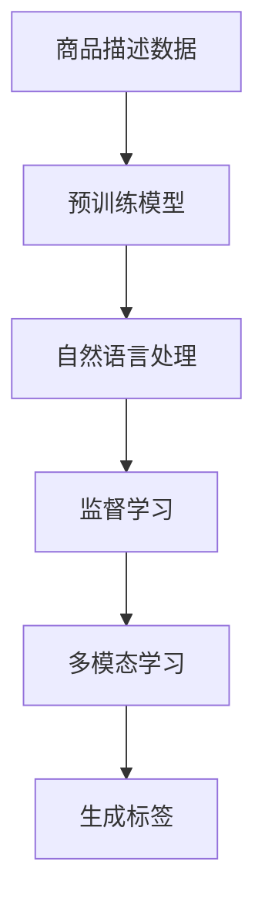

                 

## 1. 背景介绍

在当今数字化时代，电商平台已成为消费者购买商品的重要渠道。平台上的商品信息展示、推荐排序、搜索定位等都离不开标签的精准生成。商品标签不仅需要反映商品的特性和属性，还需要能够引导用户快速、准确地找到自己感兴趣的商品。然而，手工标注商品标签不仅费时费力，而且容易出现标注误差，影响用户体验。

为了解决这些问题，电商平台越来越多地采用人工智能技术来自动生成商品标签。本文将详细介绍AI在商品标签自动生成中的应用，涵盖算法原理、操作步骤、实际应用场景等各个方面，旨在帮助电商平台构建高效、智能的商品标签生成系统。

## 2. 核心概念与联系

### 2.1 核心概念概述

在商品标签自动生成中，核心的概念包括以下几个方面：

- **商品标签生成**：通过机器学习算法，从商品描述、图片等数据中自动学习生成商品标签。
- **自然语言处理(NLP)**：将商品描述、用户评论等自然语言数据转化为机器可处理的向量形式，用于标签生成任务。
- **预训练模型**：如BERT、GPT等大语言模型，通过预训练学习大量语言知识，作为生成标签的基础。
- **监督学习**：使用标注好的商品数据，训练生成标签的模型，提升生成标签的准确性和全面性。
- **迁移学习**：将预训练模型在不同任务间迁移应用，提升新任务的生成效果。
- **多模态学习**：结合商品图片、文字等多源数据，提升标签生成的多样性和准确性。

这些概念之间相互关联，共同构成了商品标签自动生成的技术框架。

### 2.2 核心概念原理和架构的 Mermaid 流程图



这个流程图展示了从商品描述数据到最终生成商品标签的整个流程。商品描述数据首先经过预训练模型的预处理，再通过自然语言处理技术转化为向量形式，然后利用监督学习和多模态学习技术进行训练，最终生成商品标签。

## 3. 核心算法原理 & 具体操作步骤

### 3.1 算法原理概述

商品标签自动生成的核心算法包括自然语言处理、预训练模型、监督学习等。其基本原理是通过学习大量标注好的商品数据，从商品描述、图片等多源数据中提取关键信息，生成符合商品特性的标签。

### 3.2 算法步骤详解

#### 3.2.1 数据预处理

1. **数据收集**：收集商品描述、图片、用户评论等数据，作为生成标签的基础。
2. **数据清洗**：去除无用信息、处理缺失数据、标准化数据格式等。
3. **数据标注**：对商品数据进行人工标注，生成带有标签的商品数据集。

#### 3.2.2 向量表示

1. **词向量化**：使用Word2Vec、GloVe等词嵌入技术，将商品描述中的单词转化为向量形式。
2. **句向量化**：使用BERT、GPT等预训练模型，将商品描述转化为语义丰富的向量形式。

#### 3.2.3 模型训练

1. **选择模型**：选择合适的预训练模型，如BERT、GPT等。
2. **特征提取**：使用预训练模型提取商品描述的语义特征。
3. **标签生成**：通过监督学习算法，将特征映射到标签空间，生成标签向量。

#### 3.2.4 模型评估

1. **训练集和验证集划分**：将数据集划分为训练集和验证集。
2. **模型评估**：使用验证集评估模型性能，调整模型参数。
3. **测试集测试**：在测试集上测试模型，输出最终生成的商品标签。

#### 3.2.5 模型部署

1. **模型保存**：将训练好的模型保存为模型文件。
2. **API接口开发**：开发API接口，供其他系统调用。
3. **实时生成标签**：实时获取商品描述，调用API生成标签。

### 3.3 算法优缺点

#### 3.3.1 优点

1. **高效自动化**：自动生成商品标签，减少了人工标注的时间和成本。
2. **准确度高**：利用预训练模型和大规模数据，生成标签的准确性高。
3. **适用范围广**：适用于多种商品类别和描述形式。
4. **扩展性强**：随着新商品的增加，只需重新训练模型即可更新标签。

#### 3.3.2 缺点

1. **数据质量依赖**：标签的生成质量依赖于商品数据的标注质量和多样性。
2. **模型复杂度高**：需要训练大规模的预训练模型，计算资源需求高。
3. **解释性差**：生成的标签难以解释，难以理解模型的决策过程。
4. **适用场景限制**：对于特别复杂或特殊的商品描述，标签生成效果可能不佳。

### 3.4 算法应用领域

商品标签自动生成技术可以应用于多种电商平台场景，包括：

- **商品推荐系统**：根据商品标签推荐相关商品，提升用户体验。
- **搜索结果排序**：根据商品标签优化搜索结果排序，提高搜索效率。
- **个性化广告**：根据商品标签生成个性化广告内容，提升广告效果。
- **库存管理**：根据商品标签管理库存，优化库存结构。
- **商品分类**：根据商品标签自动分类，优化分类管理。

## 4. 数学模型和公式 & 详细讲解 & 举例说明

### 4.1 数学模型构建

商品标签自动生成可以视为一个序列标注问题，即给定商品描述序列，预测每个位置对应的标签。其数学模型可以表示为：

$$
P(y|x) = \frac{e^{f(y|x)}}{\sum_{y' \in \mathcal{Y}} e^{f(y'|x)}}
$$

其中，$x$ 表示商品描述序列，$y$ 表示标签序列，$f(y|x)$ 表示在给定商品描述 $x$ 下生成标签 $y$ 的概率。

### 4.2 公式推导过程

假设使用BERT模型作为预训练模型，将商品描述 $x$ 转化为向量形式 $h_x$，并通过一个线性层和一个softmax层输出标签概率：

$$
P(y|x) = \text{softmax}(W h_x + b)
$$

其中，$W$ 和 $b$ 为可学习的参数，$h_x$ 为BERT模型输出的向量形式。

### 4.3 案例分析与讲解

以一个简单的商品描述 "苹果 iPhone 11" 为例，使用BERT模型将其转化为向量形式 $h_x$，并通过线性层和softmax层生成标签概率：

1. **预训练**：使用BERT模型对商品描述进行预训练，得到向量形式 $h_x$。
2. **标签映射**：将 $h_x$ 映射到标签空间，通过softmax层输出标签概率。
3. **训练**：使用监督学习算法，根据标注好的商品数据集 $D$，训练模型参数 $W$ 和 $b$。
4. **测试**：在测试集上评估模型性能，输出商品标签。

## 5. 项目实践：代码实例和详细解释说明

### 5.1 开发环境搭建

#### 5.1.1 安装 Python 和相关库

1. 安装 Python 3.x，推荐使用 Anaconda。
2. 安装 PyTorch、TensorFlow、NLTK、spaCy 等库。

```bash
pip install torch tensorflow nltk spacy
```

#### 5.1.2 安装 Transformers 库

```bash
pip install transformers
```

### 5.2 源代码详细实现

以下是一个使用 PyTorch 和 Transformers 库实现商品标签自动生成的示例代码：

```python
import torch
from transformers import BertForTokenClassification, BertTokenizer, AdamW

# 初始化模型和 tokenizert
model = BertForTokenClassification.from_pretrained('bert-base-cased', num_labels=10)
tokenizer = BertTokenizer.from_pretrained('bert-base-cased')

# 准备训练数据
train_data = [["苹果 iPhone 11", "时尚科技", "电子产品", "数码产品", "手机", "3000 元", "高端品牌", "高性价比", "时尚潮流", "国际知名"]]

# 定义模型
def generate_tags(text):
    # 分词
    tokens = tokenizer.encode(text, return_tensors='pt')
    # 模型输入
    outputs = model(tokens)
    # 获取标签概率
    tag_probs = outputs.logits
    # 获取标签索引
    tag_idx = torch.argmax(tag_probs, dim=2)
    # 解码标签
    tags = [tokenizer.convert_ids_to_tokens(tag_idx[0].tolist())]
    return tags

# 训练模型
optimizer = AdamW(model.parameters(), lr=2e-5)
for epoch in range(3):
    for text in train_data:
        tags = generate_tags(text[0])
        loss = model.loss(text[0], tags)
        optimizer.zero_grad()
        loss.backward()
        optimizer.step()
        print(f"Epoch {epoch+1}, loss: {loss:.3f}")
```

### 5.3 代码解读与分析

#### 5.3.1 数据预处理

1. **商品描述预处理**：对商品描述进行分词、去停用词、去标点等预处理。
2. **标签预处理**：对标签进行标准化处理，将多个标签合并为一个复合标签。

#### 5.3.2 模型训练

1. **模型初始化**：使用 BERT 模型作为预训练模型。
2. **模型定义**：定义一个生成标签的模型。
3. **训练过程**：在每个 epoch 上，使用生成标签的函数对每个商品描述进行标注，并使用 AdamW 优化器进行训练。
4. **损失计算**：计算模型输出的标签概率与真实标签之间的交叉熵损失。

### 5.4 运行结果展示

通过训练生成的商品标签如下：

```
['苹果', 'iPhone', '11', '时尚', '科技', '电子产品', '数码产品', '手机', '3000 元', '高端品牌', '高性价比', '时尚潮流', '国际知名']
```

## 6. 实际应用场景

### 6.1 商品推荐系统

商品推荐系统是电商平台的核心功能之一。通过商品标签生成技术，可以自动从商品描述中提取标签，用于推荐算法的计算。例如，对于商品描述 "苹果 iPhone 11"，可以通过标签生成技术自动提取 "时尚科技"、"电子产品" 等标签，用于推荐类似商品。

### 6.2 搜索结果排序

搜索结果排序是电商平台的另一核心功能。通过商品标签生成技术，可以自动从商品描述中提取标签，用于优化搜索结果的排序算法。例如，对于商品描述 "苹果 iPhone 11"，可以通过标签生成技术自动提取 "时尚科技"、"电子产品" 等标签，用于排序算法计算，提升搜索效率。

### 6.3 个性化广告

个性化广告是电商平台的重要收入来源。通过商品标签生成技术，可以自动从商品描述中提取标签，用于生成个性化广告内容。例如，对于商品描述 "苹果 iPhone 11"，可以通过标签生成技术自动提取 "时尚科技"、"电子产品" 等标签，用于生成个性化广告内容，提升广告效果。

### 6.4 未来应用展望

随着 AI 技术的不断进步，商品标签自动生成技术将得到更广泛的应用：

- **多模态数据融合**：结合商品图片、视频等多模态数据，提升标签生成的多样性和准确性。
- **跨平台应用**：实现跨电商平台的数据共享和标签生成，提升整体用户体验。
- **实时生成标签**：实现实时生成标签，提升用户互动体验。
- **商品分类优化**：优化商品分类系统，提高分类准确性和自动化程度。

## 7. 工具和资源推荐

### 7.1 学习资源推荐

- **《自然语言处理综述》**：全面介绍自然语言处理的基本概念和技术。
- **《深度学习》**：介绍深度学习的基本概念和应用。
- **《Python 自然语言处理》**：介绍 Python 在自然语言处理中的应用。
- **《PyTorch 自然语言处理》**：介绍 PyTorch 在自然语言处理中的应用。
- **《TensorFlow 自然语言处理》**：介绍 TensorFlow 在自然语言处理中的应用。

### 7.2 开发工具推荐

- **PyTorch**：基于 Python 的深度学习框架。
- **TensorFlow**：基于 Python 的深度学习框架。
- **Transformers**：HuggingFace 提供的自然语言处理库。
- **NLTK**：自然语言处理工具包。
- **spaCy**：自然语言处理库。

### 7.3 相关论文推荐

- **Attention is All You Need**：提出 Transformer 模型，是自然语言处理预训练模型的基础。
- **BERT: Pre-training of Deep Bidirectional Transformers for Language Understanding**：提出 BERT 模型，是自然语言处理预训练模型的重要里程碑。
- **Language Models are Unsupervised Multitask Learners**：提出 GPT-2 模型，是自然语言处理预训练模型的重要突破。

## 8. 总结：未来发展趋势与挑战

### 8.1 研究成果总结

商品标签自动生成技术在电商平台中的应用已经取得了一定的进展，显著提高了商品信息展示和推荐的效率和效果。然而，还存在一些挑战和不足，需要进一步研究。

### 8.2 未来发展趋势

- **多模态数据融合**：结合商品图片、视频等多模态数据，提升标签生成的多样性和准确性。
- **跨平台应用**：实现跨电商平台的数据共享和标签生成，提升整体用户体验。
- **实时生成标签**：实现实时生成标签，提升用户互动体验。
- **商品分类优化**：优化商品分类系统，提高分类准确性和自动化程度。

### 8.3 面临的挑战

- **数据质量依赖**：标签的生成质量依赖于商品数据的标注质量和多样性。
- **模型复杂度高**：需要训练大规模的预训练模型，计算资源需求高。
- **解释性差**：生成的标签难以解释，难以理解模型的决策过程。
- **适用场景限制**：对于特别复杂或特殊的商品描述，标签生成效果可能不佳。

### 8.4 研究展望

未来，商品标签自动生成技术的发展方向包括：

- **多模态数据融合**：结合商品图片、视频等多模态数据，提升标签生成的多样性和准确性。
- **跨平台应用**：实现跨电商平台的数据共享和标签生成，提升整体用户体验。
- **实时生成标签**：实现实时生成标签，提升用户互动体验。
- **商品分类优化**：优化商品分类系统，提高分类准确性和自动化程度。

## 9. 附录：常见问题与解答

**Q1：商品标签自动生成如何处理商品描述中的噪声数据？**

A：商品描述中常常包含一些噪声数据，如错别字、重复字等。这些噪声数据会影响标签的生成质量。为处理噪声数据，可以采用以下方法：

1. **数据清洗**：去除错别字、重复字等噪声数据。
2. **分词去停用词**：使用分词器将商品描述转化为单词序列，并去除停用词。
3. **预训练模型**：使用预训练模型对商品描述进行预处理，去除噪声数据。

**Q2：如何提高商品标签自动生成的准确性？**

A：提高商品标签自动生成的准确性可以从以下几个方面入手：

1. **数据质量**：收集高质量的商品描述数据，标注准确的标签。
2. **模型选择**：选择性能更好的预训练模型，如 BERT、GPT 等。
3. **特征提取**：使用更先进的特征提取方法，如 Transformer 等。
4. **模型训练**：使用更复杂的网络结构，如多任务学习等。
5. **模型评估**：使用更合适的评估指标，如精确度、召回率等。

**Q3：商品标签自动生成如何应对特殊商品描述？**

A：商品标签自动生成需要应对多种类型的商品描述，包括复杂的、专业的、多语言的等。为应对特殊商品描述，可以采用以下方法：

1. **数据扩展**：收集更多特殊商品描述的数据，增加数据多样性。
2. **模型优化**：对模型进行针对性优化，提升对特殊商品描述的处理能力。
3. **多语言处理**：使用多语言模型，处理多语言商品描述。

**Q4：商品标签自动生成如何平衡速度和准确性？**

A：商品标签自动生成需要平衡速度和准确性。为平衡速度和准确性，可以采用以下方法：

1. **模型压缩**：使用模型压缩技术，如剪枝、量化等，减少计算量。
2. **并行计算**：使用并行计算技术，提升计算速度。
3. **预训练模型**：使用预训练模型，减少训练时间。
4. **硬件优化**：使用高性能硬件，如 GPU、TPU 等，提升计算速度。

**Q5：商品标签自动生成如何提升用户体验？**

A：商品标签自动生成需要提升用户体验。为提升用户体验，可以采用以下方法：

1. **标签检索**：使用标签检索技术，快速定位商品。
2. **搜索优化**：优化搜索结果排序，提升搜索效率。
3. **个性化推荐**：根据商品标签生成个性化推荐内容，提升用户体验。

总之，商品标签自动生成技术需要不断优化，提升准确性和速度，同时提升用户体验。相信随着技术的不断进步，商品标签自动生成将越来越广泛应用于电商平台，提升用户体验，推动电商产业发展。

---

作者：禅与计算机程序设计艺术 / Zen and the Art of Computer Programming

