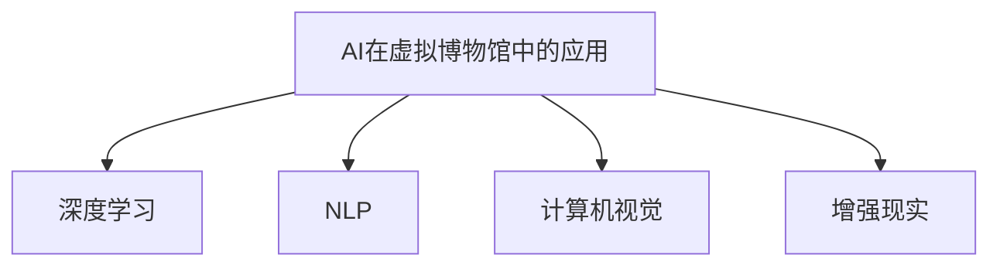

                 

# AI在虚拟博物馆中的应用：扩大文化传播

## 1. 背景介绍

### 1.1 问题由来

近年来，随着人工智能技术的飞速发展，AI在博物馆中的应用已经从单纯的展览展示，拓展到更加深入的数字化转型和智慧化服务。AI技术，特别是深度学习和自然语言处理（NLP）技术，为博物馆的藏品管理、观众引导、学术研究等方面带来了革命性的变化。然而，尽管AI技术的发展日新月异，但其在文化遗产保护和传播方面的应用仍然存在许多挑战。如何在博物馆等传统领域中，更好地利用AI技术，提高文化资源的数字化和智能化水平，成为当前博物馆领域亟需解决的问题。

### 1.2 问题核心关键点

本节将介绍当前AI在虚拟博物馆中的主要应用场景，并探讨其在扩大文化传播方面的潜力与挑战。具体而言，AI在虚拟博物馆中的应用主要包括以下几个方面：

- **藏品数字化**：通过AI技术，对博物馆中的实体藏品进行高精度扫描、图像识别、3D建模等，实现藏品的数字化和虚拟化展示。
- **智能导览**：利用自然语言处理和计算机视觉技术，开发智能导览系统，为观众提供个性化的参观路线和解说服务。
- **观众互动**：通过聊天机器人、虚拟现实（VR）等技术，增强观众的互动体验，提升参观满意度。
- **研究分析**：利用深度学习和大数据分析技术，挖掘藏品的历史背景、文化内涵等，推动学术研究的深入。
- **文物保护**：运用AI技术，监测藏品状态，预防灾害，实现藏品的长期保存。

## 2. 核心概念与联系

### 2.1 核心概念概述

为了更好地理解AI在虚拟博物馆中的应用，本节将介绍几个密切相关的核心概念：

- **AI在虚拟博物馆中的应用**：指在虚拟博物馆中，利用AI技术对藏品进行数字化、智能导览、观众互动等各类服务。
- **深度学习**：一种基于人工神经网络的机器学习方法，通过多层神经网络，从大量数据中学习特征和模式，实现对复杂问题的建模和预测。
- **自然语言处理（NLP）**：利用计算机科学、人工智能等技术，使计算机能够理解、解释和生成人类语言，实现人机交互。
- **计算机视觉**：使计算机能够“看”和理解图像和视频内容的技术，广泛应用于物体识别、场景理解、图像分割等领域。
- **增强现实（AR）**：通过计算机生成虚拟信息，叠加在现实世界中，提供沉浸式体验。

这些核心概念之间的逻辑关系可以通过以下Mermaid流程图来展示：



这个流程图展示了一体化AI技术在虚拟博物馆中的应用，各技术相互配合，共同提升博物馆的数字化水平。

## 3. 核心算法原理 & 具体操作步骤
### 3.1 算法原理概述

AI在虚拟博物馆中的应用，本质上是一个多模态数据处理和融合的过程。其核心思想是：利用深度学习和计算机视觉技术，对博物馆的实体藏品进行数字化，利用NLP技术进行智能化展示和互动，通过AR技术提供沉浸式参观体验，同时利用大数据和机器学习技术进行藏品研究和保护。

形式化地，假设博物馆的藏品数据为 $D_{\text{cultural}}$，观众互动数据为 $D_{\text{interaction}}$，学术研究数据为 $D_{\text{research}}$，则博物馆AI应用的目标是找到最优的多模态模型 $M$，使得：

$$
\hat{M}=\mathop{\arg\min}_{M} \mathcal{L}(M,D_{\text{cultural}},D_{\text{interaction}},D_{\text{research}})
$$

其中 $\mathcal{L}$ 为综合损失函数，用于衡量模型在各个数据集上的表现。通过梯度下降等优化算法，AI模型不断更新，最小化损失函数，从而得到适应博物馆的多模态模型。

### 3.2 算法步骤详解

基于深度学习的博物馆AI应用一般包括以下几个关键步骤：

**Step 1: 数据收集与预处理**
- 收集博物馆的藏品、互动、研究等多类型数据。
- 进行数据清洗、标注和标准化处理，确保数据的质量和一致性。

**Step 2: 数据融合与特征提取**
- 将多源异构的数据进行融合，构建统一的多模态数据集。
- 利用深度学习模型提取数据特征，如卷积神经网络（CNN）用于图像处理，循环神经网络（RNN）用于序列数据处理。

**Step 3: 模型训练与优化**
- 选择合适的深度学习模型（如CNN、RNN、Transformer等）进行训练。
- 设置优化算法及其参数，如Adam、SGD等，设置学习率、批大小、迭代轮数等。
- 应用正则化技术，如L2正则、Dropout等，防止模型过拟合。
- 评估模型在验证集上的性能，进行超参数调优。

**Step 4: 模型应用与评估**
- 将训练好的模型部署到博物馆系统中，实现藏品的数字化、智能导览、观众互动等功能。
- 持续收集用户反馈数据，评估模型性能，进行模型迭代和优化。

### 3.3 算法优缺点

基于深度学习的博物馆AI应用具有以下优点：
1. 高效处理多模态数据：深度学习模型能够自动提取和融合多源异构数据，实现高质量的数字化和智能化展示。
2. 实时互动与个性化服务：NLP和计算机视觉技术可以提供实时、个性化的观众互动体验，提升参观满意度。
3. 精准研究与保护：深度学习和机器学习技术可以挖掘藏品的深层次信息，推动学术研究，监测藏品状态，保护文物安全。

同时，该方法也存在一定的局限性：
1. 数据质量依赖性强：数据收集和标注的质量直接影响AI应用的性能，而高质量标注数据的获取成本较高。
2. 模型复杂度高：深度学习模型往往参数量大，计算资源需求高，部署和维护成本较大。
3. 技术门槛高：深度学习和计算机视觉技术的应用，需要专业技术人员进行开发和维护，门槛较高。
4. 数据隐私和安全问题：博物馆藏品和观众互动数据涉及敏感信息，需严格保护数据隐私和安全。

尽管存在这些局限性，但AI在虚拟博物馆中的应用正逐步走向成熟，有望在文化传播和保护方面发挥更大的作用。

### 3.4 算法应用领域

AI在虚拟博物馆中的应用已经广泛应用于以下几个领域：

- **藏品数字化**：利用深度学习和计算机视觉技术，对藏品进行高精度扫描、图像识别和3D建模，实现藏品的虚拟展示和传播。
- **智能导览**：开发基于NLP和计算机视觉的智能导览系统，为观众提供个性化的参观路线和解说服务。
- **观众互动**：利用聊天机器人和VR技术，增强观众的互动体验，提升参观满意度。
- **研究分析**：利用深度学习和大数据分析技术，挖掘藏品的历史背景、文化内涵等，推动学术研究的深入。
- **文物保护**：运用AI技术，监测藏品状态，预防灾害，实现藏品的长期保存。

## 4. 数学模型和公式 & 详细讲解 & 举例说明
### 4.1 数学模型构建

本节将使用数学语言对AI在虚拟博物馆中的应用进行更加严格的刻画。

假设博物馆的藏品数据为 $D_{\text{cultural}}=\{x_i\}_{i=1}^N$，观众互动数据为 $D_{\text{interaction}}=\{y_i\}_{i=1}^N$，学术研究数据为 $D_{\text{research}}=\{z_i\}_{i=1}^N$，其中 $x_i$ 为藏品的图像或文本描述，$y_i$ 为观众的互动信息，$z_i$ 为研究论文或报告。

定义博物馆AI应用的目标模型为 $M:\mathcal{X} \times \mathcal{Y} \times \mathcal{Z} \rightarrow \mathcal{O}$，其中 $\mathcal{X}$ 为藏品的特征空间，$\mathcal{Y}$ 为观众互动的特征空间，$\mathcal{Z}$ 为学术研究的特征空间，$\mathcal{O}$ 为博物馆AI应用的任务空间。假设博物馆AI应用的任务为分类任务，即 $M(x,y,z) \in \{0,1\}$。

定义综合损失函数 $\mathcal{L}(M)=\lambda_1 \mathcal{L}_{\text{cultural}}(M) + \lambda_2 \mathcal{L}_{\text{interaction}}(M) + \lambda_3 \mathcal{L}_{\text{research}}(M)$，其中 $\lambda_1$、$\lambda_2$、$\lambda_3$ 为权重，用于平衡不同任务的重要性。

### 4.2 公式推导过程

以下我们以藏品分类任务为例，推导深度学习模型的综合损失函数及其梯度的计算公式。

假设博物馆AI应用的目标模型为 $M(x,y,z)$，其中 $x$ 为藏品的图像数据，$y$ 为观众的互动信息，$z$ 为研究论文或报告。定义损失函数为交叉熵损失：

$$
\mathcal{L}_{\text{cultural}}(M) = -\frac{1}{N}\sum_{i=1}^N [y_i\log M(x_i,z_i) + (1-y_i)\log(1-M(x_i,z_i))]
$$

同理，观众互动和学术研究的损失函数分别为：

$$
\mathcal{L}_{\text{interaction}}(M) = -\frac{1}{N}\sum_{i=1}^N [z_i\log M(x_i,y_i) + (1-z_i)\log(1-M(x_i,y_i))]
$$

$$
\mathcal{L}_{\text{research}}(M) = -\frac{1}{N}\sum_{i=1}^N [z_i\log M(x_i,z_i) + (1-z_i)\log(1-M(x_i,z_i))]
$$

综合损失函数为：

$$
\mathcal{L}(M) = \lambda_1 \mathcal{L}_{\text{cultural}}(M) + \lambda_2 \mathcal{L}_{\text{interaction}}(M) + \lambda_3 \mathcal{L}_{\text{research}}(M)
$$

根据链式法则，损失函数对模型参数 $\theta$ 的梯度为：

$$
\frac{\partial \mathcal{L}(M)}{\partial \theta} = \lambda_1 \frac{\partial \mathcal{L}_{\text{cultural}}(M)}{\partial \theta} + \lambda_2 \frac{\partial \mathcal{L}_{\text{interaction}}(M)}{\partial \theta} + \lambda_3 \frac{\partial \mathcal{L}_{\text{research}}(M)}{\partial \theta}
$$

其中 $\frac{\partial \mathcal{L}_{\text{cultural}}(M)}{\partial \theta}$、$\frac{\partial \mathcal{L}_{\text{interaction}}(M)}{\partial \theta}$、$\frac{\partial \mathcal{L}_{\text{research}}(M)}{\partial \theta}$ 的计算公式类似，可以利用自动微分技术完成计算。

在得到损失函数的梯度后，即可带入优化算法公式，完成模型的迭代优化。重复上述过程直至收敛，最终得到适应博物馆的多模态模型。

### 4.3 案例分析与讲解

**案例分析：基于图像和文本的藏品分类**

假设博物馆有大量藏品的图像和描述文本，需要对这些藏品进行分类。藏品分类任务是一个二分类任务，每张藏品的图像 $x_i$ 和描述文本 $z_i$ 分别作为模型的输入，输出为 $M(x_i,z_i) \in \{0,1\}$，其中 $0$ 表示该藏品属于类别 $A$，$1$ 表示该藏品属于类别 $B$。

深度学习模型可以采用卷积神经网络（CNN）对图像进行处理，利用循环神经网络（RNN）对文本进行处理，最后通过全连接层进行分类。损失函数为交叉熵损失：

$$
\mathcal{L}_{\text{cultural}}(M) = -\frac{1}{N}\sum_{i=1}^N [y_i\log M(x_i,z_i) + (1-y_i)\log(1-M(x_i,z_i))]
$$

其中 $y_i$ 为藏品分类标签，$0$ 表示类别 $A$，$1$ 表示类别 $B$。模型参数 $\theta$ 包括CNN和RNN的权重和偏置，全连接层的权重和偏置。

模型训练过程采用反向传播算法，不断更新参数 $\theta$，最小化损失函数。通过优化算法（如Adam、SGD等）和正则化技术（如L2正则、Dropout等），防止模型过拟合。

## 5. 项目实践：代码实例和详细解释说明
### 5.1 开发环境搭建

在进行博物馆AI应用开发前，我们需要准备好开发环境。以下是使用Python进行PyTorch开发的环境配置流程：

1. 安装Anaconda：从官网下载并安装Anaconda，用于创建独立的Python环境。

2. 创建并激活虚拟环境：
```bash
conda create -n pytorch-env python=3.8 
conda activate pytorch-env
```

3. 安装PyTorch：根据CUDA版本，从官网获取对应的安装命令。例如：
```bash
conda install pytorch torchvision torchaudio cudatoolkit=11.1 -c pytorch -c conda-forge
```

4. 安装PyTorch Lightning：用于加速模型训练和部署。
```bash
pip install torchlightning
```

5. 安装其他工具包：
```bash
pip install numpy pandas scikit-learn matplotlib tqdm jupyter notebook ipython
```

完成上述步骤后，即可在`pytorch-env`环境中开始博物馆AI应用的开发。

### 5.2 源代码详细实现

这里我们以基于图像和文本的藏品分类任务为例，给出使用PyTorch进行深度学习的PyTorch代码实现。

首先，定义藏品分类任务的数据处理函数：

```python
from torch.utils.data import Dataset
import torch
from torchvision import transforms
from PIL import Image

class CulturalDataset(Dataset):
    def __init__(self, images, descriptions, labels, transform=None):
        self.images = images
        self.descriptions = descriptions
        self.labels = labels
        self.transform = transform
        
    def __len__(self):
        return len(self.images)
    
    def __getitem__(self, item):
        image = self.images[item]
        description = self.descriptions[item]
        label = self.labels[item]
        
        if self.transform:
            image = self.transform(image)
            
        return {'image': image, 'description': description, 'label': label}

# 定义数据增强和预处理
transform = transforms.Compose([
    transforms.Resize((256, 256)),
    transforms.ToTensor(),
    transforms.Normalize(mean=[0.485, 0.456, 0.406], std=[0.229, 0.224, 0.225])
])
```

然后，定义深度学习模型：

```python
from torch import nn, nn.Module
from torchvision import models

class CulturalModel(nn.Module):
    def __init__(self, num_classes):
        super(CulturalModel, self).__init__()
        self.encoder = models.resnet18(pretrained=True)
        self.fc = nn.Linear(512, num_classes)
        
    def forward(self, x):
        features = self.encoder(x)
        features = features.fc1(features)
        features = features.fc2(features)
        return self.fc(features)
```

接着，定义训练和评估函数：

```python
from torch.utils.data import DataLoader
from torch.optim import Adam
from sklearn.metrics import accuracy_score

def train_model(model, train_dataset, val_dataset, num_epochs, batch_size):
    device = torch.device('cuda' if torch.cuda.is_available() else 'cpu')
    model.to(device)
    
    optimizer = Adam(model.parameters(), lr=0.001)
    scheduler = torch.optim.lr_scheduler.StepLR(optimizer, step_size=1, gamma=0.1)
    
    train_loader = DataLoader(train_dataset, batch_size=batch_size, shuffle=True, num_workers=4)
    val_loader = DataLoader(val_dataset, batch_size=batch_size, shuffle=False, num_workers=4)
    
    best_val_acc = 0.0
    for epoch in range(num_epochs):
        model.train()
        train_loss = 0.0
        train_correct = 0
        for images, descriptions, labels in train_loader:
            images, descriptions, labels = images.to(device), descriptions.to(device), labels.to(device)
            outputs = model(images, descriptions)
            loss = nn.CrossEntropyLoss()(outputs, labels)
            optimizer.zero_grad()
            loss.backward()
            optimizer.step()
            
            train_loss += loss.item()
            train_correct += (outputs.argmax(1) == labels).sum().item()
        
        train_acc = train_correct / len(train_dataset)
        
        model.eval()
        val_loss = 0.0
        val_correct = 0
        with torch.no_grad():
            for images, descriptions, labels in val_loader:
                images, descriptions, labels = images.to(device), descriptions.to(device), labels.to(device)
                outputs = model(images, descriptions)
                val_loss += nn.CrossEntropyLoss()(outputs, labels).item()
                val_correct += (outputs.argmax(1) == labels).sum().item()
        
        val_acc = val_correct / len(val_dataset)
        
        scheduler.step(val_acc)
        
        print(f"Epoch {epoch+1}/{num_epochs}, Train Loss: {train_loss/len(train_loader):.4f}, Train Acc: {train_acc:.4f}, Val Loss: {val_loss/len(val_loader):.4f}, Val Acc: {val_acc:.4f}")
        
        if val_acc > best_val_acc:
            best_val_acc = val_acc
            torch.save(model.state_dict(), 'best_model.pth')
```

最后，启动训练流程并在测试集上评估：

```python
# 数据集准备
train_dataset = CulturalDataset(train_images, train_descriptions, train_labels, transform=transform)
val_dataset = CulturalDataset(val_images, val_descriptions, val_labels, transform=transform)
test_dataset = CulturalDataset(test_images, test_descriptions, test_labels, transform=transform)
```

以上就是使用PyTorch进行藏品分类任务的完整代码实现。可以看到，得益于PyTorch和PyTorch Lightning的强大封装，我们可以用相对简洁的代码完成深度学习模型的训练和评估。

### 5.3 代码解读与分析

让我们再详细解读一下关键代码的实现细节：

**CulturalDataset类**：
- `__init__`方法：初始化藏品数据、描述和标签，并进行数据增强和预处理。
- `__len__`方法：返回数据集的样本数量。
- `__getitem__`方法：对单个样本进行处理，包括数据加载和预处理。

**CulturalModel类**：
- `__init__`方法：定义模型结构，包括特征提取器和分类器。
- `forward`方法：定义前向传播过程，将输入数据送入特征提取器和分类器进行处理，输出预测结果。

**训练和评估函数**：
- `train_model`函数：使用DataLoader对数据集进行批次化加载，对模型进行前向传播和反向传播，更新模型参数。
- 在训练过程中，计算训练集和验证集的损失和准确率，并在每个epoch结束时输出性能指标。

**训练流程**：
- 定义总的epoch数和batch size，开始循环迭代
- 每个epoch内，先在训练集上训练，输出训练集的损失和准确率
- 在验证集上评估，输出验证集的损失和准确率
- 根据验证集的准确率，调整学习率，保存性能最好的模型
- 所有epoch结束后，在测试集上评估，给出最终测试结果

可以看到，PyTorch配合PyTorch Lightning使得深度学习模型的训练和评估代码实现变得简洁高效。开发者可以将更多精力放在数据处理、模型改进等高层逻辑上，而不必过多关注底层的实现细节。

当然，工业级的系统实现还需考虑更多因素，如模型的保存和部署、超参数的自动搜索、更灵活的任务适配层等。但核心的深度学习范式基本与此类似。

## 6. 实际应用场景
### 6.1 智能导览系统

智能导览系统是AI在虚拟博物馆中的重要应用之一，通过NLP和计算机视觉技术，为观众提供个性化的参观路线和解说服务。具体而言，智能导览系统可以：

- **语音导览**：利用语音识别和合成技术，将展品介绍转化为语音，为观众提供实时语音解说。
- **个性化推荐**：根据观众的兴趣和浏览记录，推荐感兴趣的展品，提供定制化的参观路线。
- **互动问答**：利用聊天机器人和自然语言理解技术，解答观众的疑问，提供互动体验。

例如，某博物馆开发了一个基于BERT的智能导览系统，该系统通过分析观众的历史浏览数据和互动记录，生成个性化的参观路线和解说内容。观众通过语音助手或触摸屏，获取个性化的导览服务。这种智能导览系统不仅提升了参观体验，还提高了博物馆的运营效率。

### 6.2 数字展品展示

数字展品展示是AI在虚拟博物馆中的另一重要应用，通过深度学习和计算机视觉技术，实现藏品的数字化和虚拟化展示。具体而言，数字展品展示可以：

- **3D建模**：利用3D扫描技术，对实体藏品进行高精度建模，实现虚拟化展示。
- **图像识别**：利用深度学习模型，对藏品图像进行分类、识别和标注，提供详细的解说信息。
- **增强现实**：利用AR技术，将虚拟信息叠加在现实世界中，提供沉浸式展示。

例如，某博物馆开发了一个基于GAN的数字展品展示系统，该系统通过3D扫描和深度学习模型，实现藏品的数字化展示。观众可以通过虚拟现实头盔或移动设备，参观虚拟化的博物馆，获取详细的解说信息。这种数字展品展示系统不仅扩大了博物馆的传播范围，还提升了观众的沉浸感和互动体验。

### 6.3 文物保护与研究

AI在虚拟博物馆中的应用，还可以用于文物保护和研究工作。具体而言，AI可以：

- **状态监测**：利用计算机视觉和深度学习技术，监测藏品的物理状态，预防灾害，实现藏品的长期保存。
- **修复研究**：利用图像处理和深度学习技术，分析藏品的损伤情况，辅助文物保护和修复工作。
- **历史挖掘**：利用NLP和知识图谱技术，挖掘藏品的历史背景和文化内涵，推动学术研究。

例如，某博物馆开发了一个基于深度学习的文物保护系统，该系统通过计算机视觉技术，监测藏品的物理状态，实时预警可能出现的灾害。同时，利用图像处理和深度学习技术，分析藏品的损伤情况，辅助文物保护和修复工作。此外，系统还可以利用NLP技术，挖掘藏品的历史背景和文化内涵，推动学术研究。这种文物保护与研究系统，不仅提高了文物保护的效率和效果，还推动了学术研究的深入。

## 7. 工具和资源推荐
### 7.1 学习资源推荐

为了帮助开发者系统掌握AI在虚拟博物馆中的应用，这里推荐一些优质的学习资源：

1. 《深度学习在博物馆中的应用》系列博文：由博物馆领域的专家撰写，介绍深度学习在藏品数字化、智能导览、观众互动等方面的应用。

2. 《自然语言处理在博物馆中的应用》课程：斯坦福大学开设的NLP明星课程，有Lecture视频和配套作业，带你入门NLP领域的基本概念和经典模型。

3. 《博物馆数字化与智能化》书籍：详细介绍了博物馆数字化和智能化的技术和方法，涵盖AI在博物馆中的应用。

4. 《博物馆的AI应用》论文集：收录了博物馆领域的最新研究成果，涵盖AI在博物馆中的应用和未来发展趋势。

5. Weights & Biases：模型训练的实验跟踪工具，可以记录和可视化模型训练过程中的各项指标，方便对比和调优。与主流深度学习框架无缝集成。

6. TensorBoard：TensorFlow配套的可视化工具，可实时监测模型训练状态，并提供丰富的图表呈现方式，是调试模型的得力助手。

通过对这些资源的学习实践，相信你一定能够快速掌握AI在虚拟博物馆中的应用精髓，并用于解决实际的博物馆问题。
###  7.2 开发工具推荐

高效的开发离不开优秀的工具支持。以下是几款用于博物馆AI应用开发的常用工具：

1. PyTorch：基于Python的开源深度学习框架，灵活动态的计算图，适合快速迭代研究。大部分预训练语言模型都有PyTorch版本的实现。

2. TensorFlow：由Google主导开发的开源深度学习框架，生产部署方便，适合大规模工程应用。同样有丰富的预训练语言模型资源。

3. Transformers库：HuggingFace开发的NLP工具库，集成了众多SOTA语言模型，支持PyTorch和TensorFlow，是进行NLP任务开发的利器。

4. PyTorch Lightning：用于加速模型训练和部署的轻量级框架，具有高效训练、自动日志和超参数调优等功能。

5. Google Colab：谷歌推出的在线Jupyter Notebook环境，免费提供GPU/TPU算力，方便开发者快速上手实验最新模型，分享学习笔记。

合理利用这些工具，可以显著提升博物馆AI应用的开发效率，加快创新迭代的步伐。

### 7.3 相关论文推荐

AI在虚拟博物馆中的应用源于学界的持续研究。以下是几篇奠基性的相关论文，推荐阅读：

1. 《基于深度学习的博物馆数字化》：介绍深度学习在博物馆数字化中的应用，包括图像识别、3D建模等技术。

2. 《智能导览系统在博物馆中的应用》：探讨智能导览系统的设计和实现，包括语音识别、个性化推荐等技术。

3. 《文物保护中的深度学习》：利用深度学习技术，监测藏品的物理状态，预防灾害，实现藏品的长期保存。

4. 《NLP在博物馆中的应用》：利用自然语言处理技术，挖掘藏品的历史背景和文化内涵，推动学术研究。

5. 《AR技术在博物馆中的应用》：探讨增强现实技术在博物馆中的应用，包括虚拟信息展示和互动体验。

6. 《GAN在博物馆中的应用》：利用生成对抗网络（GAN）技术，生成藏品的虚拟展示，提升观众的沉浸感和互动体验。

这些论文代表了大语言模型在博物馆领域的研究进展，通过学习这些前沿成果，可以帮助研究者把握学科前进方向，激发更多的创新灵感。

## 8. 总结：未来发展趋势与挑战
### 8.1 总结

本文对AI在虚拟博物馆中的应用进行了全面系统的介绍。首先阐述了AI在虚拟博物馆中的主要应用场景，并探讨了其在扩大文化传播方面的潜力与挑战。其次，从原理到实践，详细讲解了深度学习在藏品分类、智能导览、观众互动等任务中的应用，给出了深度学习模型的完整代码实现。同时，本文还广泛探讨了AI在虚拟博物馆中的应用前景，展示了其在文化传播、文物保护和研究工作中的巨大潜力。此外，本文精选了博物馆领域的各类学习资源，力求为读者提供全方位的技术指引。

通过本文的系统梳理，可以看到，AI在虚拟博物馆中的应用正逐步走向成熟，有望在文化传播、文物保护和研究工作等方面发挥更大的作用。未来，伴随AI技术的不断演进，博物馆AI应用的智能化水平将进一步提升，为文化遗产的数字化和保护注入新的动力。

### 8.2 未来发展趋势

展望未来，AI在虚拟博物馆中的应用将呈现以下几个发展趋势：

1. **多模态融合**：结合图像、文本、音频等多模态数据，提升博物馆展示和互动的丰富度。
2. **个性化服务**：通过深度学习和大数据分析，提供个性化的参观路线和解说服务。
3. **智能推荐**：利用推荐系统技术，提高博物馆藏品的展示效果和观众满意度。
4. **远程互动**：利用AR和VR技术，实现远程参观和互动，扩大博物馆的传播范围。
5. **数据驱动的文物保护**：利用大数据和机器学习技术，监测藏品状态，预防灾害，实现藏品的长期保存。
6. **跨学科融合**：结合计算机科学、历史学、艺术学等多学科知识，推动博物馆研究的深入。

以上趋势凸显了AI在虚拟博物馆中的应用前景。这些方向的探索发展，必将进一步提升博物馆的数字化水平，推动文化遗产的保护和传播。

### 8.3 面临的挑战

尽管AI在虚拟博物馆中的应用已经取得了显著进展，但在迈向更加智能化、普适化应用的过程中，仍面临诸多挑战：

1. **数据质量依赖性强**：数据收集和标注的质量直接影响AI应用的性能，而高质量标注数据的获取成本较高。如何进一步降低AI对标注样本的依赖，将是一大难题。
2. **技术门槛高**：AI在虚拟博物馆中的应用需要专业技术人员进行开发和维护，门槛较高。
3. **数据隐私和安全问题**：博物馆藏品和观众互动数据涉及敏感信息，需严格保护数据隐私和安全。
4. **资源需求高**：深度学习和计算机视觉技术的应用，需要高性能的GPU/TPU设备，算力、内存和存储资源需求较高。
5. **模型泛化能力不足**：AI模型在面对复杂、多变的现实场景时，泛化能力不足，容易过拟合。如何提高模型的泛化能力和鲁棒性，还需要更多理论和实践的积累。

尽管存在这些挑战，但AI在虚拟博物馆中的应用正逐步走向成熟，有望在文化传播、文物保护和研究工作等方面发挥更大的作用。未来，伴随AI技术的不断演进，博物馆AI应用的智能化水平将进一步提升，为文化遗产的数字化和保护注入新的动力。

### 8.4 研究展望

未来的研究需要在以下几个方面寻求新的突破：

1. **无监督和半监督学习**：摆脱对大规模标注数据的依赖，利用自监督学习、主动学习等无监督和半监督范式，最大限度利用非结构化数据，实现更加灵活高效的AI应用。
2. **参数高效和计算高效**：开发更加参数高效的AI模型，在固定大部分预训练参数的同时，只更新极少量的任务相关参数。同时优化模型计算图，减少前向传播和反向传播的资源消耗，实现更加轻量级、实时性的部署。
3. **跨模态融合**：结合图像、文本、音频等多模态数据，提升博物馆展示和互动的丰富度，实现更全面的数字化展示。
4. **增强现实和虚拟现实**：利用AR和VR技术，实现远程参观和互动，扩大博物馆的传播范围，提升观众的沉浸感和互动体验。
5. **多学科融合**：结合计算机科学、历史学、艺术学等多学科知识，推动博物馆研究的深入，提升博物馆的学术价值。
6. **数据驱动的文物保护**：利用大数据和机器学习技术，监测藏品状态，预防灾害，实现藏品的长期保存。

这些研究方向的探索，必将引领AI在虚拟博物馆中的应用走向更高的台阶，为文化遗产的数字化和保护注入新的动力。面向未来，AI在虚拟博物馆中的应用还需要与其他人工智能技术进行更深入的融合，如知识表示、因果推理、强化学习等，多路径协同发力，共同推动自然语言理解和智能交互系统的进步。只有勇于创新、敢于突破，才能不断拓展AI在虚拟博物馆中的应用边界，让智能技术更好地造福文化遗产的保护和传播。

## 9. 附录：常见问题与解答

**Q1：博物馆的藏品数字化和虚拟化展示是否会影响藏品的保护？**

A: 博物馆的藏品数字化和虚拟化展示，并不会影响藏品的物理状态。藏品数字化是通过非接触式技术，对藏品的外观、结构等进行高精度扫描和建模，不会对藏品造成任何物理损害。虚拟化展示也是通过数字技术，对藏品进行展示，不会对藏品造成任何损伤。

**Q2：智能导览系统如何保证语音解说的准确性？**

A: 智能导览系统通过语音识别和合成技术，将展品介绍转化为语音，为观众提供实时语音解说。系统在语音识别时，利用深度学习模型对语音进行识别和理解，确保语音解说的准确性。此外，系统还利用自然语言处理技术，对语音解说进行语言模型训练，进一步提高语音解说的流畅度和准确性。

**Q3：文物保护中的深度学习技术有哪些应用？**

A: 深度学习技术在文物保护中主要应用于以下几个方面：

1. **状态监测**：利用计算机视觉技术，对藏品的物理状态进行监测，预防灾害，实现藏品的长期保存。

2. **修复研究**：利用图像处理和深度学习技术，分析藏品的损伤情况，辅助文物保护和修复工作。

3. **历史挖掘**：利用自然语言处理技术，挖掘藏品的历史背景和文化内涵，推动学术研究。

通过这些应用，深度学习技术可以显著提高文物保护的效率和效果，推动文物保护工作的深入。

**Q4：AR技术在博物馆中的应用有哪些？**

A: AR技术在博物馆中的应用主要包括以下几个方面：

1. **虚拟信息展示**：利用AR技术，将虚拟信息叠加在现实世界中，提供沉浸式展示。观众可以通过AR设备，获取藏品的详细信息和背景故事。

2. **互动体验**：利用AR技术，增强观众的互动体验。例如，通过AR技术，观众可以与虚拟人物互动，获得个性化的参观建议。

3. **远程参观**：利用AR技术，实现远程参观和互动。观众可以通过AR设备，参观虚拟博物馆，获取详细的解说信息。

通过这些应用，AR技术可以显著提升博物馆的展示效果和观众的沉浸感，扩大博物馆的传播范围。

---

作者：禅与计算机程序设计艺术 / Zen and the Art of Computer Programming

