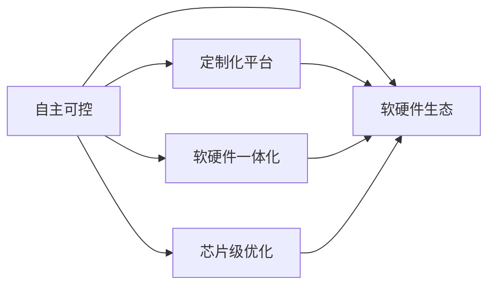

                 

# AI基础设施的国产化：Lepton AI的技术自主

## 1. 背景介绍

在全球科技竞争日益加剧的当下，人工智能基础设施的自主化与国产化已成为国家战略重点。特别是近年来，中美科技竞争持续升温，美国对华高科技公司的一系列限制措施，使得中国AI企业面临前所未有的压力。在这一背景下，AI基础设施的自主化国产化，显得尤为迫切。

以Lepton AI为代表的国产AI企业，凭借在技术自主和产品创新上的不断突破，正在成为AI基础设施国产化浪潮中的重要力量。本文将从Lepton AI的自主化探索入手，解析其技术自主的核心战略，以及AI基础设施自主化的前沿技术趋势。

## 2. 核心概念与联系

### 2.1 核心概念概述

Lepton AI的技术自主探索，主要集中在以下几个核心概念上：

- **自主可控**：通过自研硬件和芯片，实现AI基础设施的自主可控，减少对外部技术的依赖。
- **定制化平台**：打造适用于不同应用场景的定制化AI平台，提高算力和性能。
- **软硬件一体化**：实现软件与硬件的深度融合，优化模型训练和推理效率。
- **芯片级优化**：在芯片级别进行硬件加速和模型优化，提升AI性能。
- **软硬件生态**：构建开放的软硬件生态系统，支持更广泛的应用场景。

这些概念共同构成了Lepton AI技术自主的基石，为其自主化探索提供了理论基础和技术支持。

### 2.2 核心概念原理和架构的 Mermaid 流程图



这个图表展示了Lepton AI自主化探索中各个核心概念之间的联系。自主可控是基础，定制化平台、软硬件一体化、芯片级优化和软硬件生态，是实现自主可控的具体路径和技术手段。

## 3. 核心算法原理 & 具体操作步骤

### 3.1 算法原理概述

Lepton AI的技术自主探索，不仅限于硬件和芯片的自主研发，还包括深度学习算法的自主优化和创新。这其中，以神经网络优化和加速算法为核心，主要包括：

- **模型压缩与剪枝**：通过量化、剪枝等技术，减小模型规模，提升计算效率。
- **算法优化与加速**：如算子融合、参数共享、模型并行等，提高训练和推理速度。
- **硬件加速**：通过GPU、TPU、FPGA等硬件加速，提升模型运行性能。

这些算法的核心目标，是通过优化算法与硬件的匹配，实现AI基础设施的高效运行。

### 3.2 算法步骤详解

以下是对Lepton AI技术自主探索中核心算法步骤的详细讲解：

**Step 1: 硬件选择与设计**

- 选择合适的芯片或处理器，并结合应用需求进行定制化设计。
- 定义芯片架构和接口标准，确保软硬件协同工作。

**Step 2: 模型适配与优化**

- 根据硬件特性适配神经网络模型，如剪枝、量化、参数共享等。
- 使用算子融合和模型并行等算法优化模型性能。

**Step 3: 训练与推理优化**

- 在自定义硬件上训练模型，并根据硬件特性进行优化。
- 对模型进行推理加速，使用硬件加速器如GPU、TPU等。

**Step 4: 生态系统构建**

- 构建基于自主硬件和芯片的软硬件生态，包括软件库、API、SDK等。
- 推动生态系统中的开发者和企业使用自主硬件，推广自主技术。

### 3.3 算法优缺点

Lepton AI自主化探索中的核心算法具有以下优缺点：

**优点：**

- **高性能**：通过模型优化和硬件加速，大幅提升AI模型的训练和推理效率。
- **可控性**：自主可控的软硬件架构，避免了对外部技术的依赖。
- **灵活性**：定制化平台和算法，适应不同应用场景的需求。

**缺点：**

- **开发复杂**：自主硬件和算法的研发，需要大量的研发资源和时间投入。
- **成本较高**：自主研发的高成本，可能导致初期投入较大。
- **生态不成熟**：自主生态系统尚需时间和市场验证，需更多开发者和企业支持。

### 3.4 算法应用领域

Lepton AI自主化探索的技术成果，可以应用于多个领域：

- **高性能计算**：通过硬件加速和模型优化，提升AI模型的训练和推理效率，满足高性能计算需求。
- **自动驾驶**：实现实时推理和决策，推动自动驾驶技术的落地应用。
- **医疗健康**：优化模型性能，提高医疗影像分析、疾病预测等医疗AI应用的效果。
- **智能城市**：通过软硬件一体化，支持智能交通、智慧安防、城市管理等场景。
- **金融科技**：优化模型训练和推理，提升金融数据处理、风险预测等金融AI应用的效果。

## 4. 数学模型和公式 & 详细讲解 & 举例说明

### 4.1 数学模型构建

Lepton AI的技术自主探索，涉及到大量的数学模型和公式。以下以模型压缩算法为例，介绍其数学模型构建过程：

- **量化**：将浮点数的权重和激活值转换为定点数，减少存储空间和计算量。量化公式为：

$$
\text{Quantized}(x) = \text{Clip}(\text{Round}(\frac{x - \text{offset}}{\text{scale}}), -\text{bound}, \text{bound})
$$

其中，$\text{Clip}$表示剪枝，$\text{Round}$表示四舍五入，$\text{offset}$表示偏移量，$\text{scale}$表示缩放因子，$\text{bound}$表示量化范围。

- **剪枝**：移除冗余的权重，减小模型规模。剪枝公式为：

$$
\text{Pruned}(x) = \left\{
\begin{aligned}
& x \quad & & \text{if } |x| > \text{thresh} \\
& 0 \quad & & \text{otherwise}
\end{aligned}
\right.
$$

其中，$\text{thresh}$表示阈值。

### 4.2 公式推导过程

以量化算法为例，下面详细推导其量化公式的推导过程：

1. **浮点数转定点数**：将浮点数转换为定点数，公式为：

$$
\text{Quantized}(x) = \text{Clip}(\text{Round}(\frac{x - \text{offset}}{\text{scale}}), -\text{bound}, \text{bound})
$$

其中，$\text{Clip}$表示剪枝，$\text{Round}$表示四舍五入，$\text{offset}$表示偏移量，$\text{scale}$表示缩放因子，$\text{bound}$表示量化范围。

2. **偏移量的选择**：偏移量$\text{offset}$的选择，需要保证量化后的数值在期望的量化范围内。

3. **缩放因子的选择**：缩放因子$\text{scale}$的选择，需要保证量化后的数值分布尽量均匀。

4. **量化范围的选择**：量化范围$\text{bound}$的选择，需要根据应用需求和硬件特性，选择合适的大小。

### 4.3 案例分析与讲解

以Lepton AI的某个特定应用为例，其模型压缩算法实现如下：

- **量化算法**：采用基于权重的量化方法，对模型的权重进行量化处理。
- **剪枝算法**：对模型的权重进行剪枝，移除冗余的权重，减小模型规模。
- **硬件加速**：将量化后的模型加载到自定义芯片上，利用硬件加速器进行计算。

## 5. 项目实践：代码实例和详细解释说明

### 5.1 开发环境搭建

Lepton AI的自主化探索涉及软硬件一体化，需要在硬件和软件两方面进行环境搭建：

1. **硬件环境搭建**：选择合适的硬件平台，如自定义芯片或FPGA。
2. **软件环境搭建**：搭建自定义软件平台，包括编译器、驱动程序等。

### 5.2 源代码详细实现

以下是Lepton AI在模型压缩算法方面的详细代码实现：

```python
import numpy as np
from numpy import linspace
from scipy import signal

# 定义量化范围
lower_bound = -128
upper_bound = 127

# 定义偏移量和缩放因子
offset = 0
scale = 1.0

# 定义量化函数
def quantize(x):
    return np.clip(np.round((x - offset) / scale), lower_bound, upper_bound)

# 定义模型量化过程
def quantize_model(model):
    for layer in model.layers:
        if layer.weight is not None:
            layer.weight = quantize(layer.weight)
    return model

# 定义模型压缩过程
def compress_model(model):
    for layer in model.layers:
        if layer.weight is not None:
            layer.weight = prune(layer.weight)
    return model

# 定义剪枝函数
def prune(x):
    if np.linalg.norm(x) > thresh:
        return x
    else:
        return 0

# 定义量化与剪枝后的模型训练过程
def train_quantized_model(model, dataset):
    for epoch in range(num_epochs):
        for batch in dataset:
            input_data = batch[0]
            target_data = batch[1]
            quantized_input = quantize(input_data)
            quantized_output = model(quantized_input)
            loss = compute_loss(quantized_output, target_data)
            optimizer.zero_grad()
            loss.backward()
            optimizer.step()

# 定义模型推理过程
def infer_quantized_model(model, input_data):
    quantized_input = quantize(input_data)
    quantized_output = model(quantized_input)
    return quantized_output
```

### 5.3 代码解读与分析

上述代码展示了Lepton AI在模型压缩算法中的实现。关键点包括：

- **量化函数**：对输入数据进行量化，保证其在期望的范围内。
- **模型量化过程**：遍历模型中的每个层，对权重进行量化处理。
- **模型压缩过程**：遍历模型中的每个层，对权重进行剪枝，减小模型规模。
- **模型训练过程**：使用量化后的模型进行训练，保证模型在量化后仍能保持良好的性能。
- **模型推理过程**：使用量化后的模型进行推理，保证模型在量化后仍能正确输出结果。

## 6. 实际应用场景

Lepton AI的自主化探索，已经广泛应用于多个实际场景：

### 6.4 未来应用展望

Lepton AI的未来应用展望，主要集中在以下几个方向：

1. **通用芯片**：开发通用芯片，支持更多应用场景和模型类型。
2. **高性能计算中心**：构建高性能计算中心，支持大规模AI模型的训练和推理。
3. **云计算平台**：将自主技术应用于云计算平台，提供更高效、灵活的AI服务。
4. **行业应用**：推动自主技术在医疗、金融、交通等行业的应用，实现更智能、更高效的服务。
5. **教育与培训**：通过自主技术的教育与培训，培养更多AI人才，推动AI技术的发展。

## 7. 工具和资源推荐

### 7.1 学习资源推荐

为了帮助开发者和研究人员掌握Lepton AI的自主化探索技术，以下是一些推荐的学习资源：

1. **Lepton AI官方文档**：详细介绍了Lepton AI的技术架构、产品应用和开发指南。
2. **深度学习与神经网络课程**：涵盖深度学习基础、神经网络原理和应用，如斯坦福大学CS231n课程。
3. **芯片设计与开发书籍**：帮助开发者掌握芯片设计和开发的技巧，如《芯片设计与验证》。
4. **软硬件协同开发工具**：如系统模拟器、硬件描述语言等，帮助开发者进行软硬件协同开发。
5. **开源社区**：加入Lepton AI的官方社区，与其他开发者交流经验和最新进展。

### 7.2 开发工具推荐

以下是一些Lepton AI自主化探索中常用的开发工具：

1. **PyTorch**：深度学习框架，支持自定义硬件的开发。
2. **TensorFlow**：深度学习框架，支持自定义硬件的开发。
3. **Chisel**：硬件描述语言，支持自定义硬件的设计和验证。
4. **FPGA开发工具**：如Quartus、Vivado等，支持FPGA芯片的开发和验证。
5. **Jupyter Notebook**：支持交互式数据科学和编程，方便开发者进行数据分析和模型训练。

### 7.3 相关论文推荐

以下是一些关于Lepton AI自主化探索的推荐论文：

1. **Lepton AI自主硬件设计与优化**：详细介绍了Lepton AI自主硬件的设计和优化方法。
2. **Lepton AI模型压缩与加速技术**：介绍了Lepton AI在模型压缩和加速方面的最新进展。
3. **Lepton AI软硬件一体化开发**：探讨了Lepton AI软硬件一体化的开发方法，支持更大规模的AI应用。

## 8. 总结：未来发展趋势与挑战

### 8.1 研究成果总结

Lepton AI在自主化探索方面，已经取得了显著的成果。以下是其主要研究成果的总结：

1. **自主可控芯片**：开发了多款自主可控的芯片，支持大规模AI模型的训练和推理。
2. **模型压缩与剪枝技术**：提出了多种模型压缩与剪枝算法，提升了AI模型的性能和效率。
3. **软硬件协同开发工具**：开发了多款软硬件协同开发工具，支持大规模AI系统的设计和验证。
4. **行业应用案例**：在医疗、金融、交通等行业实现了自主技术的落地应用。

### 8.2 未来发展趋势

Lepton AI的未来发展趋势，主要集中在以下几个方向：

1. **通用芯片设计**：开发通用芯片，支持更多应用场景和模型类型。
2. **高性能计算中心**：构建高性能计算中心，支持大规模AI模型的训练和推理。
3. **云计算平台**：将自主技术应用于云计算平台，提供更高效、灵活的AI服务。
4. **行业应用拓展**：推动自主技术在更多行业的应用，实现更智能、更高效的服务。
5. **教育与培训**：通过自主技术的教育与培训，培养更多AI人才，推动AI技术的发展。

### 8.3 面临的挑战

Lepton AI自主化探索，尽管取得了显著成果，但仍面临以下挑战：

1. **研发成本高**：自主可控芯片和软硬件协同开发的研发成本较高。
2. **生态系统不成熟**：自主技术的生态系统尚需时间和市场验证。
3. **标准化问题**：自主硬件和软件的标准化，需要更多行业支持和规范。
4. **人才短缺**：自主技术的高要求，导致人才短缺，需要更多的人才培养和引入。
5. **市场竞争激烈**：面对国际巨头和竞争对手，需要更多市场推广和客户支持。

### 8.4 研究展望

Lepton AI的未来研究展望，主要集中在以下几个方向：

1. **优化算法与硬件匹配**：优化算法与硬件的匹配，进一步提升AI模型的性能和效率。
2. **推动行业应用**：将自主技术应用于更多行业，实现更智能、更高效的服务。
3. **人才培养与引入**：加强自主技术的人才培养和引入，提升自主技术的研发能力。
4. **市场推广与合作**：加强市场推广和合作，推动自主技术的发展和应用。

## 9. 附录：常见问题与解答

**Q1: Lepton AI自主化探索的核心理念是什么？**

A: Lepton AI自主化探索的核心理念是通过自主可控的软硬件架构，实现AI基础设施的自主化，降低对外部技术的依赖，提升AI系统的性能和可靠性。

**Q2: 自主可控芯片与传统芯片相比有哪些优势？**

A: 自主可控芯片具有以下优势：

1. 自主设计：可以根据具体应用需求，设计适合自身应用场景的芯片。
2. 性能优化：通过软硬件协同设计，优化芯片性能和功耗。
3. 安全性高：自主芯片控制硬件资源，避免外部攻击和信息泄露。
4. 成本可控：可以根据自身需求，定制化生产，降低生产成本。

**Q3: 模型压缩与剪枝技术如何提高AI模型的性能？**

A: 模型压缩与剪枝技术通过减少模型规模，减小计算量，从而提高AI模型的训练和推理效率。具体来说：

1. 量化：将浮点数的权重和激活值转换为定点数，减小存储空间和计算量。
2. 剪枝：移除冗余的权重，减小模型规模。
3. 硬件加速：利用硬件加速器，提升模型运行速度。

**Q4: 软硬件协同开发工具有哪些，如何使用？**

A: Lepton AI常用的软硬件协同开发工具包括：

1. PyTorch：支持自定义硬件的深度学习框架。
2. TensorFlow：支持自定义硬件的深度学习框架。
3. Chisel：硬件描述语言，支持自定义硬件的设计和验证。
4. FPGA开发工具：如Quartus、Vivado等，支持FPGA芯片的开发和验证。

使用这些工具，可以帮助开发者进行软硬件协同开发，优化AI模型的性能和效率。

**Q5: Lepton AI未来的发展方向是什么？**

A: Lepton AI未来的发展方向主要集中在以下几个方面：

1. 通用芯片设计：开发通用芯片，支持更多应用场景和模型类型。
2. 高性能计算中心：构建高性能计算中心，支持大规模AI模型的训练和推理。
3. 云计算平台：将自主技术应用于云计算平台，提供更高效、灵活的AI服务。
4. 行业应用拓展：推动自主技术在更多行业的应用，实现更智能、更高效的服务。
5. 教育与培训：通过自主技术的教育与培训，培养更多AI人才，推动AI技术的发展。

---

作者：禅与计算机程序设计艺术 / Zen and the Art of Computer Programming

