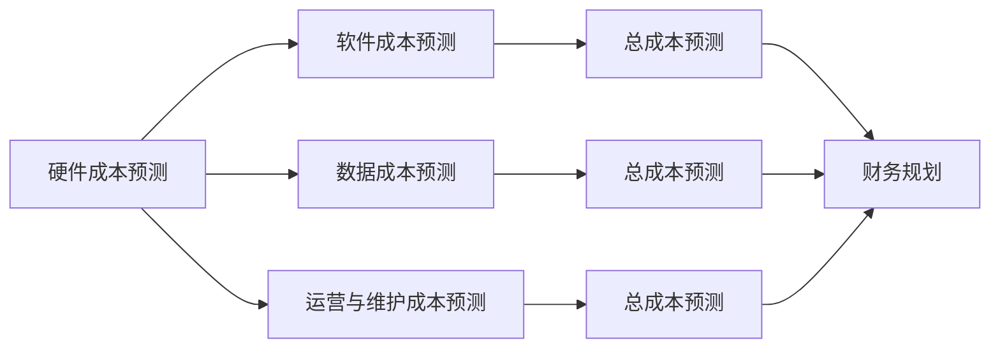

                 

# AI基础设施的成本预测：Lepton AI的财务规划

在当今数字化时代，人工智能(AI)基础设施的成本预测成为了企业战略规划和财务管理的重要部分。本文将深入探讨Lepton AI在财务规划中的成本预测方法，分析其在不同业务场景中的应用，并提供相关案例分析。

## 1. 背景介绍

随着AI技术的不断进步，企业对AI基础设施的需求也在迅速增长。然而，AI系统的构建、运行和维护成本可能非常高，因此，准确的成本预测对于企业来说至关重要。Lepton AI作为一家提供AI基础设施服务的供应商，其成本预测方法能为企业提供关键的决策支持。

### 1.1 问题由来

AI基础设施的成本预测主要包括以下几个方面：
1. 硬件采购与部署成本：AI模型通常需要高性能计算资源，如GPU、TPU等，这些硬件的成本较高。
2. 软件开发与维护成本：开发和维护AI模型的软件成本包括人力成本、工具采购和更新成本等。
3. 数据处理与存储成本：AI模型需要大量的数据进行训练和推理，这些数据的处理和存储成本也不容忽视。
4. 运营与维护成本：包括能源消耗、硬件维护、网络带宽等运营成本。

这些成本因素相互关联，企业需要综合考虑以制定合理的财务计划。Lepton AI的财务规划旨在通过精确的成本预测，帮助企业有效管理AI基础设施的成本。

## 2. 核心概念与联系

### 2.1 核心概念概述

本节将介绍几个与AI基础设施成本预测相关的核心概念及其联系：

- **AI基础设施**：指的是支持AI模型训练、推理的硬件和软件资源的集合，包括CPU、GPU、TPU、内存、存储、网络等。
- **硬件成本预测**：基于硬件性能和价格数据，预测未来硬件采购和部署成本。
- **软件成本预测**：基于开发人员数量、工具成本、软件维护费用等，预测软件开发的成本。
- **数据成本预测**：基于数据量、数据处理需求、存储成本等，预测数据处理与存储的成本。
- **运营与维护成本预测**：基于能耗、网络带宽、硬件维护费用等，预测AI系统的运营与维护成本。

这些概念相互关联，共同构成了AI基础设施成本预测的全面框架。

### 2.2 核心概念原理和架构的 Mermaid 流程图(Mermaid 流程节点中不要有括号、逗号等特殊字符)



上述流程图展示了各成本预测模块之间的联系，最终汇总为财务规划。

## 3. 核心算法原理 & 具体操作步骤

### 3.1 算法原理概述

Lepton AI的成本预测方法基于历史数据和当前市场情况，通过建立数学模型和机器学习算法，对未来成本进行预测。其核心原理包括以下几个方面：

1. **历史数据分析**：利用AI模型对历史成本数据进行分析，找出规律和趋势。
2. **市场数据集成**：收集最新的硬件、软件和数据市场数据，了解未来价格趋势。
3. **多变量预测**：综合考虑硬件性能、软件复杂度、数据规模、能耗等因素，进行多变量预测。
4. **机器学习应用**：使用机器学习算法对成本预测模型进行训练和优化。

### 3.2 算法步骤详解

1. **数据收集与预处理**
   - 收集历史成本数据、硬件和软件市场数据、数据规模等相关信息。
   - 对数据进行清洗和标准化处理，确保数据质量。

2. **特征工程**
   - 确定影响成本的关键特征，如硬件类型、模型复杂度、数据规模等。
   - 对特征进行编码和处理，生成可用于预测的数据集。

3. **模型训练与优化**
   - 选择合适的机器学习算法，如线性回归、决策树、随机森林等。
   - 使用历史数据对模型进行训练，并使用交叉验证进行优化。

4. **成本预测**
   - 基于训练好的模型，对未来硬件、软件和数据成本进行预测。
   - 对预测结果进行敏感性分析，了解不同因素对成本的影响。

5. **财务规划**
   - 根据预测结果，制定财务规划，包括预算编制、成本控制等。
   - 定期更新预测模型，确保财务规划的准确性和及时性。

### 3.3 算法优缺点

Lepton AI的成本预测方法具有以下优点：
- **精确性高**：基于历史数据和机器学习算法，预测结果更加准确。
- **灵活性高**：能够根据市场变化和业务需求，快速调整预测模型。
- **可扩展性强**：适用于不同规模和类型的企业，支持定制化需求。

同时，该方法也存在一些局限性：
- **依赖数据质量**：预测结果依赖于高质量的历史数据和市场数据。
- **模型复杂性**：复杂的预测模型可能需要较高的计算资源和时间成本。
- **预测时效性**：预测结果可能受到市场波动和外部因素的影响。

### 3.4 算法应用领域

Lepton AI的成本预测方法在多个领域具有广泛的应用：

- **AI研发团队**：帮助企业准确评估AI项目成本，进行预算控制。
- **IT部门**：优化硬件和软件资源的采购和部署，提升资源利用率。
- **运营团队**：预测AI系统的运营与维护成本，优化资源分配。
- **财务部门**：提供准确的财务预测，支持财务决策。

## 4. 数学模型和公式 & 详细讲解 & 举例说明

### 4.1 数学模型构建

Lepton AI的成本预测模型主要包括以下几个部分：

1. **硬件成本模型**：
   - 硬件采购成本：$C_{hardware} = \sum_{i=1}^n p_i q_i$，其中 $p_i$ 为第 $i$ 种硬件的单价，$q_i$ 为第 $i$ 种硬件的购买数量。
   - 硬件部署成本：$C_{deploy} = \sum_{i=1}^n c_i$，其中 $c_i$ 为第 $i$ 种硬件的部署成本。

2. **软件成本模型**：
   - 开发成本：$C_{develop} = w \times d$，其中 $w$ 为开发人员数量，$d$ 为开发时间（以月为单位）。
   - 维护成本：$C_{maintain} = m \times t$，其中 $m$ 为维护人员数量，$t$ 为维护时间（以月为单位）。

3. **数据成本模型**：
   - 数据采集成本：$C_{data} = \sum_{j=1}^m p_j q_j$，其中 $p_j$ 为第 $j$ 种数据的单价，$q_j$ 为第 $j$ 种数据的购买数量。
   - 数据处理成本：$C_{process} = \sum_{j=1}^m c_j$，其中 $c_j$ 为第 $j$ 种数据的处理成本。

4. **运营与维护成本模型**：
   - 能源消耗成本：$C_{energy} = e \times t$，其中 $e$ 为能耗单价，$t$ 为时间（以月为单位）。
   - 硬件维护成本：$C_{maintenance} = h \times m$，其中 $h$ 为硬件维护单价，$m$ 为维护时间（以月为单位）。
   - 网络带宽成本：$C_{bandwidth} = b \times t$，其中 $b$ 为网络带宽单价，$t$ 为时间（以月为单位）。

### 4.2 公式推导过程

以硬件成本模型为例，我们进行详细推导：

假设企业计划采购 $n$ 种硬件，每种硬件单价为 $p_i$，购买数量为 $q_i$。硬件的部署成本为 $c_i$。则硬件总成本 $C_{hardware}$ 为：

$$
C_{hardware} = \sum_{i=1}^n p_i q_i + \sum_{i=1}^n c_i
$$

其中，$p_i q_i$ 为硬件采购成本，$c_i$ 为硬件部署成本。

### 4.3 案例分析与讲解

假设企业计划采购 5 台服务器，每台服务器的单价为 1000 美元，购买数量为 5。硬件的部署成本为 500 美元。则硬件总成本为：

$$
C_{hardware} = 5 \times 1000 + 500 = 5500 \text{美元}
$$

## 5. 项目实践：代码实例和详细解释说明

### 5.1 开发环境搭建

以下是使用Python和Pandas进行Lepton AI成本预测的开发环境搭建流程：

1. 安装Python 3.8及以上版本，以及Pandas库。
2. 使用Anaconda创建虚拟环境。
3. 安装所需的机器学习库，如scikit-learn、numpy等。
4. 收集和整理历史成本数据、市场数据等。

```bash
conda create -n lepton-env python=3.8
conda activate lepton-env
pip install pandas scikit-learn numpy
```

### 5.2 源代码详细实现

以下是一个简单的Python代码示例，用于计算硬件成本：

```python
import pandas as pd

# 硬件采购成本
hardware_costs = pd.DataFrame({
    'hardware_type': ['CPU', 'GPU', 'TPU'],
    'price_per_unit': [1000, 2000, 5000],
    'purchase_quantity': [5, 3, 2]
})

# 硬件部署成本
deployment_costs = pd.DataFrame({
    'hardware_type': ['CPU', 'GPU', 'TPU'],
    'deployment_cost': [500, 1000, 2000]
})

# 计算硬件总成本
total_hardware_cost = hardware_costs['price_per_unit'] * hardware_costs['purchase_quantity'] + deployment_costs['deployment_cost']
print("硬件总成本：", total_hardware_cost.sum())
```

### 5.3 代码解读与分析

上述代码展示了如何通过Pandas计算硬件总成本。首先，使用DataFrame存储硬件采购成本和部署成本，然后通过乘法计算总成本。最终，通过sum()函数求和得到硬件总成本。

## 6. 实际应用场景

### 6.1 智能制造

智能制造中，AI基础设施的应用越来越广泛。企业通过预测AI系统的成本，可以更准确地评估投资回报率，制定合理的财务计划。例如，某制造企业计划部署一批AI监控系统，Lepton AI的成本预测方法可以评估这些系统的硬件、软件和数据成本，帮助企业优化资源分配，降低整体成本。

### 6.2 金融服务

金融服务行业对AI系统的依赖度较高，通过预测AI基础设施成本，金融机构可以更好地控制IT预算，提升运营效率。例如，某银行计划开发AI信贷评估模型，Lepton AI的成本预测方法可以预测模型开发、数据处理和运营维护成本，帮助银行制定合理的项目预算。

### 6.3 医疗健康

医疗健康领域对AI的需求不断增长，AI系统的构建和维护成本也在不断上升。Lepton AI的成本预测方法可以帮助医疗机构精确评估AI系统的投资成本，制定财务规划，优化资源利用。例如，某医院计划部署AI影像诊断系统，Lepton AI的成本预测方法可以评估系统的硬件、软件和数据成本，帮助医院优化资源分配，降低整体成本。

### 6.4 未来应用展望

随着AI技术的不断发展和应用场景的不断拓展，Lepton AI的成本预测方法将发挥更大的作用。未来，该方法将在以下方面得到进一步的应用和优化：

1. **自动化预测**：通过引入自动化预测工具，如机器学习算法，提升成本预测的效率和准确性。
2. **多模态预测**：结合硬件、软件、数据和运营成本，进行多模态预测，提供更全面的财务规划支持。
3. **动态预测**：通过引入实时数据和市场变化信息，动态更新成本预测模型，确保预测结果的及时性和准确性。
4. **区域化预测**：根据不同地区的价格差异，提供区域化的成本预测，优化跨国企业的财务规划。
5. **风险管理**：结合风险评估模型，预测AI系统可能面临的风险，制定相应的风险管理策略。

## 7. 工具和资源推荐

### 7.1 学习资源推荐

为了帮助开发者掌握Lepton AI的成本预测方法，推荐以下学习资源：

1. **Lepton AI官方文档**：详细介绍了Lepton AI的架构和使用方法，提供了丰富的案例和代码示例。
2. **Python数据科学手册**：介绍了Python数据处理和分析的基础知识，适合初学者入门。
3. **机器学习实战**：通过大量实践案例，讲解机器学习算法和模型构建。
4. **AI基础设施管理**：探讨AI基础设施的规划、部署和运营管理的最佳实践。

### 7.2 开发工具推荐

Lepton AI的成本预测方法需要使用Python、Pandas、scikit-learn等工具，推荐以下开发工具：

1. **Anaconda**：管理Python环境和依赖的强大工具。
2. **Jupyter Notebook**：交互式编程环境，支持代码的可视化展示。
3. **Git**：版本控制工具，方便代码的协作和管理。

### 7.3 相关论文推荐

Lepton AI的成本预测方法基于机器学习算法和历史数据分析，相关论文推荐如下：

1. **《成本预测模型在企业中的应用》**：介绍了机器学习在成本预测中的作用和实现方法。
2. **《智能制造中的AI基础设施成本管理》**：探讨了智能制造中AI系统的成本预测和管理方法。
3. **《AI基础设施的成本预测模型优化》**：研究了成本预测模型的优化方法和效果评估。

## 8. 总结：未来发展趋势与挑战

### 8.1 总结

本文详细介绍了Lepton AI的成本预测方法，分析了其在AI基础设施成本管理中的应用，并提供了相关案例分析。通过系统的介绍，帮助企业更好地理解AI系统的成本构成，制定合理的财务规划。

### 8.2 未来发展趋势

Lepton AI的成本预测方法将随着技术的不断进步和市场需求的变化，呈现以下发展趋势：

1. **自动化和智能化**：通过引入自动化和智能化的预测工具，提高预测效率和准确性。
2. **多模态和多维度**：结合硬件、软件、数据和运营成本，进行多模态和多维度的预测，提供更全面的财务规划支持。
3. **实时化和动态化**：通过引入实时数据和市场变化信息，进行实时化和动态化的预测，确保预测结果的及时性和准确性。
4. **区域化和个性化**：根据不同地区的价格差异，提供区域化和个性化的预测，优化跨国企业和不同规模企业的财务规划。
5. **风险管理和优化**：结合风险评估模型，预测AI系统可能面临的风险，制定相应的风险管理策略，优化资源分配。

### 8.3 面临的挑战

尽管Lepton AI的成本预测方法已经取得了显著成果，但在未来发展过程中，仍面临以下挑战：

1. **数据质量和完整性**：预测结果依赖于高质量的历史数据和市场数据，数据不完整或不准确可能导致预测结果失准。
2. **模型复杂性**：复杂的预测模型可能需要较高的计算资源和时间成本，如何优化模型性能和降低计算成本是一个重要问题。
3. **市场变化和风险**：市场价格波动和外部因素可能影响预测结果，如何设计风险管理机制，确保预测结果的稳定性是一个重要课题。
4. **资源利用率**：如何提高AI基础设施的利用率，降低运营成本，是企业需要不断优化的问题。
5. **人员技能和培训**：实现复杂预测模型需要具备一定的技术和经验，如何培养和培训相关人员是一个重要问题。

### 8.4 研究展望

未来的研究需要在以下几个方面进行深入探索：

1. **自动化和智能化**：通过引入自动化和智能化的预测工具，提高预测效率和准确性。
2. **多模态和多维度**：结合硬件、软件、数据和运营成本，进行多模态和多维度的预测，提供更全面的财务规划支持。
3. **实时化和动态化**：通过引入实时数据和市场变化信息，进行实时化和动态化的预测，确保预测结果的及时性和准确性。
4. **区域化和个性化**：根据不同地区的价格差异，提供区域化和个性化的预测，优化跨国企业和不同规模企业的财务规划。
5. **风险管理和优化**：结合风险评估模型，预测AI系统可能面临的风险，制定相应的风险管理策略，优化资源分配。

## 9. 附录：常见问题与解答

### Q1：如何评估AI系统的投资回报率？

A: 评估AI系统的投资回报率需要考虑多个因素，包括硬件和软件成本、数据成本、运营与维护成本、模型性能等。使用Lepton AI的成本预测方法，可以准确评估这些成本，并结合模型性能指标（如准确率、召回率等），计算投资回报率。

### Q2：如何优化AI基础设施的资源利用率？

A: 优化AI基础设施的资源利用率可以从以下几个方面入手：
1. 硬件共享：使用硬件共享技术，减少资源闲置，提升硬件利用率。
2. 模型压缩：采用模型压缩技术，减少模型参数量和计算资源消耗。
3. 任务调度：优化任务调度策略，提高资源利用效率。
4. 数据管理：优化数据管理策略，减少数据冗余和存储成本。

### Q3：如何设计AI系统的风险管理策略？

A: 设计AI系统的风险管理策略需要考虑以下几个方面：
1. 数据质量监控：监控数据质量，避免数据偏差和噪声对模型的影响。
2. 模型性能监控：监控模型性能，及时发现和纠正模型缺陷。
3. 异常检测：通过异常检测技术，及时发现和处理异常情况，避免潜在风险。
4. 应急预案：制定应急预案，快速响应突发事件，降低风险影响。

### Q4：如何提高预测模型的准确性和效率？

A: 提高预测模型的准确性和效率可以从以下几个方面入手：
1. 数据清洗和预处理：清洗和标准化数据，提高数据质量。
2. 特征工程：选择和提取关键特征，优化模型输入。
3. 模型选择和优化：选择合适的机器学习算法，并进行模型优化。
4. 自动化和智能化：引入自动化和智能化的预测工具，提升预测效率和准确性。

### Q5：如何培训相关人员掌握Lepton AI的成本预测方法？

A: 培训相关人员掌握Lepton AI的成本预测方法需要从以下几个方面入手：
1. 基础知识培训：提供机器学习、数据分析等基础知识的培训。
2. 工具和技术培训：提供Python、Pandas、scikit-learn等工具的培训。
3. 实践案例培训：通过大量实践案例，讲解Lepton AI的成本预测方法的实现过程和关键点。
4. 持续学习和更新：定期更新培训内容，结合最新的技术和市场变化，进行持续学习和更新。

总之，Lepton AI的成本预测方法通过精确的成本预测，帮助企业更好地管理AI基础设施，优化资源分配，提升财务决策的准确性和效率。通过持续改进和优化，该方法将在未来获得更广泛的应用，为企业带来更高的投资回报。

