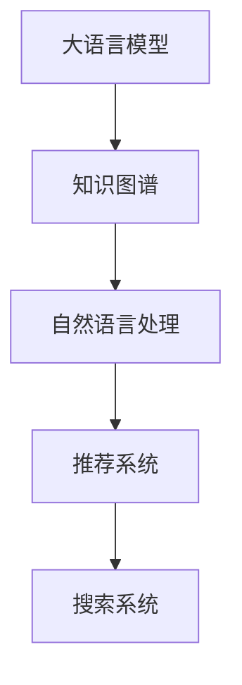

                 

# AI大模型与搜索推荐系统的完美结合

## 1. 背景介绍

在当今信息爆炸的时代，搜索引擎和推荐系统已经成为用户获取信息的重要工具。它们帮助用户在海量数据中快速找到所需内容，提升用户体验。然而，传统的方法往往依赖于简单的文本匹配和统计模型，无法充分挖掘文本背后的语义关系和隐含知识。

近年来，随着人工智能技术的发展，尤其是大语言模型（Large Language Model, LLM）的崛起，为搜索引擎和推荐系统的优化提供了新的可能性。大语言模型通过在大量无标注文本数据上进行预训练，学习到了丰富的语言知识和语义表示，能够对文本进行深度理解和生成，从而在推荐系统任务中发挥重要作用。

本文将详细介绍AI大模型与搜索推荐系统的结合方法，探讨如何利用大语言模型的强大能力，提升搜索推荐系统的性能和用户体验。

## 2. 核心概念与联系

### 2.1 核心概念概述

为深入理解大模型与搜索推荐系统的结合方法，本节将介绍几个关键概念及其相互联系。

- **大语言模型（LLM）**：以自回归（如GPT）或自编码（如BERT）模型为代表的大规模预训练语言模型。通过在大量无标注文本数据上进行预训练，学习到语言的通用表示，具备强大的语言理解和生成能力。

- **推荐系统（Recommender System）**：通过分析用户的历史行为和偏好，为用户推荐最相关的物品或内容的系统。常见的推荐方法包括基于协同过滤、内容推荐、混合推荐等。

- **知识图谱（Knowledge Graph）**：一种结构化的语义知识表示形式，通过实体和关系构建知识网络，支持复杂的语义推理和信息检索。

- **自然语言处理（Natural Language Processing, NLP）**：利用计算机处理和理解人类语言的技术，包括文本分类、文本生成、信息抽取、机器翻译等。

- **搜索系统（Search Engine）**：一种信息检索系统，通过用户输入的查询词，在大量文本中匹配相关结果，返回给用户。

这些概念之间存在紧密的联系。大语言模型通过理解自然语言，可以从文本中提取和推理出隐含信息，支持推荐系统推荐更相关的内容。知识图谱为推荐系统提供了结构化的语义信息，帮助模型更好地理解文本中的实体和关系。而自然语言处理技术则进一步提升了搜索结果的匹配度和相关性。

### 2.2 核心概念原理和架构的 Mermaid 流程图



这个流程图展示了从大语言模型到搜索推荐系统的整体流程。大语言模型通过理解文本语义，提取隐含信息，并将其与知识图谱相结合，最终服务于推荐系统和搜索系统，提升推荐的准确性和搜索的相关性。

## 3. 核心算法原理 & 具体操作步骤

### 3.1 算法原理概述

大语言模型与搜索推荐系统的结合方法，本质上是一种将预训练模型应用于实际业务场景的技术。其核心思想是：

1. **预训练知识提取**：利用大语言模型在无标注文本数据上进行预训练，学习语言的通用表示。
2. **任务适配层设计**：根据具体推荐系统或搜索系统的需求，设计合适的任务适配层，将预训练模型输出的表示映射到推荐目标空间。
3. **模型微调**：在有限标注数据上对适配层进行有监督微调，优化模型性能。
4. **模型部署与评估**：将微调后的模型部署到推荐系统和搜索系统中，并定期评估其效果，进行必要的调整。

### 3.2 算法步骤详解

下面详细介绍每个步骤的详细操作：

**Step 1：准备预训练模型和数据集**

- **预训练模型选择**：选择合适的预训练语言模型，如BERT、GPT等。
- **数据集准备**：收集推荐系统或搜索系统的数据集，划分为训练集、验证集和测试集。数据集应包含用户行为数据、物品特征数据、查询词等。

**Step 2：设计任务适配层**

- **任务适配层设计**：根据推荐系统或搜索系统的任务需求，设计适配层。例如，对于推荐系统，适配层可以设计为生成用户兴趣表示和物品表示的映射关系。对于搜索系统，适配层可以设计为生成查询词与文本相似度的表示。
- **任务适配层训练**：在预训练模型的基础上，对适配层进行微调。微调的目标是最大化适配层的输出与任务标签之间的匹配度。

**Step 3：执行微调**

- **微调目标设定**：根据推荐系统或搜索系统的任务目标，设定微调损失函数。
- **优化算法选择**：选择合适的优化算法（如Adam、SGD等）和超参数（如学习率、批大小、迭代轮数等）。
- **微调流程执行**：在标注数据上执行梯度下降算法，更新模型参数。

**Step 4：模型部署与评估**

- **模型部署**：将微调后的模型集成到推荐系统和搜索系统中，部署在服务器或云平台上。
- **效果评估**：在测试集上评估模型效果，计算推荐精度、召回率、NDCG等指标，并进行必要的调整。

### 3.3 算法优缺点

结合大语言模型的搜索推荐系统，具有以下优点：

- **泛化能力强**：大语言模型在大量无标注文本数据上进行预训练，学习到丰富的语言知识，可以较好地适应不同领域的推荐和搜索任务。
- **推理能力强**：大语言模型具备强大的语义理解和生成能力，能够处理复杂的自然语言查询，提升搜索结果的相关性。
- **个性化推荐**：通过理解用户输入的文本，大语言模型能够生成个性化推荐，提升用户体验。
- **实时性**：大语言模型可以实时生成推荐结果，适应实时推荐和搜索的需求。

然而，该方法也存在一些局限性：

- **计算资源消耗大**：大语言模型的参数量通常较大，对计算资源和内存的要求较高。
- **数据隐私问题**：用户在搜索和推荐系统中输入的文本数据可能包含敏感信息，需要考虑数据隐私和安全性问题。
- **模型解释性不足**：大语言模型的决策过程较为复杂，缺乏可解释性，难以理解和调试。
- **依赖高质量数据**：微调的效果很大程度上依赖于标注数据的质量和数量，标注数据的获取和维护成本较高。

### 3.4 算法应用领域

结合大语言模型的搜索推荐系统，广泛应用于以下领域：

- **电商平台**：为电商用户推荐商品、展示个性化广告。
- **视频平台**：为用户推荐视频、直播、影视等内容。
- **新闻门户**：为用户推荐新闻文章、视频、音乐等。
- **社交网络**：为用户推荐好友、文章、视频等。
- **金融服务**：为用户推荐股票、基金、保险等金融产品。
- **医疗健康**：为用户推荐药品、医生、医院等。
- **旅游旅游**：为用户推荐旅游路线、景点、酒店等。

## 4. 数学模型和公式 & 详细讲解 & 举例说明

### 4.1 数学模型构建

本节将使用数学语言对大语言模型与搜索推荐系统的结合方法进行更加严格的刻画。

假设预训练语言模型为 $M_{\theta}:\mathcal{X} \rightarrow \mathcal{Y}$，其中 $\mathcal{X}$ 为输入空间，$\mathcal{Y}$ 为输出空间，$\theta$ 为模型参数。假设推荐系统或搜索系统任务的目标为 $T$，例如推荐商品、匹配查询词等。

定义模型 $M_{\theta}$ 在输入 $x$ 上的输出为 $\hat{y}=M_{\theta}(x) \in \mathcal{Y}$，表示模型对任务的预测结果。在微调过程中，我们需要设计合适的任务适配层，将模型的输出映射到推荐目标空间。例如，对于推荐系统，适配层可以设计为将用户兴趣表示和物品表示进行匹配，生成推荐结果。

定义推荐系统或搜索系统任务的目标函数为 $L(\theta, T)$，表示模型在任务 $T$ 上的损失。常用的损失函数包括均方误差、交叉熵等。例如，对于推荐系统，目标函数可以定义为推荐结果与用户真实选择的商品之间的误差。

### 4.2 公式推导过程

以下我们以推荐系统为例，推导微调模型的数学公式。

假设推荐系统需要为用户推荐商品 $I$，用户选择的商品为 $i$。模型 $M_{\theta}$ 的输出为 $\hat{y}=M_{\theta}(x)$，其中 $x$ 为输入的用户行为数据。适配层设计为将用户兴趣表示 $u$ 和物品表示 $i$ 进行匹配，生成推荐结果 $y_i$。

目标函数定义为推荐结果 $y_i$ 与用户选择的商品 $i$ 之间的误差，例如均方误差：

$$
L(\theta, T) = \frac{1}{N}\sum_{i=1}^N ||y_i - i||^2
$$

其中 $N$ 为样本数量。

根据链式法则，目标函数对模型参数 $\theta$ 的梯度为：

$$
\frac{\partial L(\theta, T)}{\partial \theta} = -2\frac{1}{N}\sum_{i=1}^N (y_i - i) \frac{\partial y_i}{\partial \theta}
$$

其中 $\frac{\partial y_i}{\partial \theta}$ 表示适配层的梯度，可以通过反向传播算法计算得到。

在得到目标函数对模型参数的梯度后，即可带入优化算法进行迭代优化。重复上述过程直至收敛，最终得到适应推荐系统任务的最优模型参数 $\theta^*$。

### 4.3 案例分析与讲解

以电商平台推荐系统为例，假设用户输入了商品描述和浏览历史，模型通过自然语言处理技术提取用户兴趣表示和商品表示，适配层设计为将两者进行匹配，生成推荐结果。

在微调过程中，我们设定均方误差损失函数：

$$
L(\theta, T) = \frac{1}{N}\sum_{i=1}^N ||y_i - i||^2
$$

其中 $y_i$ 为推荐系统输出的商品推荐结果，$i$ 为用户选择的商品。

适配层的梯度可以通过反向传播算法计算得到，将用户兴趣表示和物品表示进行匹配，生成推荐结果。最终通过优化算法更新模型参数，最小化目标函数，得到适应推荐系统任务的最优模型参数。

## 5. 项目实践：代码实例和详细解释说明

### 5.1 开发环境搭建

在进行推荐系统开发前，我们需要准备好开发环境。以下是使用Python进行TensorFlow开发的环境配置流程：

1. 安装Anaconda：从官网下载并安装Anaconda，用于创建独立的Python环境。

2. 创建并激活虚拟环境：
```bash
conda create -n tensorflow-env python=3.8 
conda activate tensorflow-env
```

3. 安装TensorFlow：根据CUDA版本，从官网获取对应的安装命令。例如：
```bash
conda install tensorflow tensorflow-gpu=cuda11.1 -c tf-nightly
```

4. 安装TensorFlow Addons：
```bash
pip install tensorflow-addons
```

5. 安装各类工具包：
```bash
pip install numpy pandas scikit-learn matplotlib tqdm jupyter notebook ipython
```

完成上述步骤后，即可在`tensorflow-env`环境中开始推荐系统开发。

### 5.2 源代码详细实现

这里我们以电商平台推荐系统为例，给出使用TensorFlow和TensorFlow Addons对BERT模型进行推荐系统微调的Python代码实现。

首先，定义推荐系统的数据处理函数：

```python
from transformers import BertTokenizer
from tensorflow.keras.layers import Input, Dense
from tensorflow.keras.models import Model
import tensorflow as tf
import numpy as np
import pandas as pd

class RecommendationDataset(tf.data.Dataset):
    def __init__(self, df, tokenizer, max_len=128):
        self.df = df
        self.tokenizer = tokenizer
        self.max_len = max_len

    def __len__(self):
        return len(self.df)

    def __getitem__(self, index):
        row = self.df.iloc[index]
        title = row['title']
        description = row['description']
        click = row['click']

        title_tokens = self.tokenizer(title, return_tensors='tf', max_length=self.max_len, padding='max_length', truncation=True)
        description_tokens = self.tokenizer(description, return_tensors='tf', max_length=self.max_len, padding='max_length', truncation=True)

        input_ids = tf.concat([title_tokens['input_ids'], description_tokens['input_ids']], axis=1)
        attention_mask = tf.concat([title_tokens['attention_mask'], description_tokens['attention_mask']], axis=1)
        labels = tf.expand_dims(click, axis=1)

        return {'input_ids': input_ids,
                'attention_mask': attention_mask,
                'labels': labels}

# 标签与id的映射
label2id = {'0': 0, '1': 1}

# 创建dataset
tokenizer = BertTokenizer.from_pretrained('bert-base-cased')

train_dataset = RecommendationDataset(train_df, tokenizer)
dev_dataset = RecommendationDataset(dev_df, tokenizer)
test_dataset = RecommendationDataset(test_df, tokenizer)
```

然后，定义模型和优化器：

```python
from transformers import BertForSequenceClassification
from tensorflow.keras.optimizers import Adam

model = BertForSequenceClassification.from_pretrained('bert-base-cased', num_labels=2)

optimizer = Adam(learning_rate=2e-5)
```

接着，定义训练和评估函数：

```python
from sklearn.metrics import accuracy_score
from tqdm import tqdm

@tf.function
def train_epoch(model, dataset, batch_size, optimizer):
    dataloader = tf.data.Dataset.from_tensor_slices(dataset)
    model.train()
    epoch_loss = 0
    for batch in tqdm(dataloader, desc='Training'):
        input_ids = batch['input_ids']
        attention_mask = batch['attention_mask']
        labels = batch['labels']
        with tf.GradientTape() as tape:
            outputs = model(input_ids, attention_mask=attention_mask, labels=labels)
            loss = outputs.loss
        epoch_loss += loss.numpy()
        gradients = tape.gradient(loss, model.trainable_variables)
        optimizer.apply_gradients(zip(gradients, model.trainable_variables))
    return epoch_loss / len(dataloader)

@tf.function
def evaluate(model, dataset, batch_size):
    dataloader = tf.data.Dataset.from_tensor_slices(dataset)
    model.eval()
    preds, labels = [], []
    with tf.GradientTape() as tape:
        for batch in tqdm(dataloader, desc='Evaluating'):
            input_ids = batch['input_ids']
            attention_mask = batch['attention_mask']
            labels = batch['labels']
            outputs = model(input_ids, attention_mask=attention_mask)
            batch_preds = tf.argmax(outputs.logits, axis=1).numpy()
            batch_labels = labels.numpy()
            for pred, label in zip(batch_preds, batch_labels):
                preds.append(pred)
                labels.append(label)
    
    return accuracy_score(labels, preds)
```

最后，启动训练流程并在测试集上评估：

```python
epochs = 5
batch_size = 16

for epoch in range(epochs):
    loss = train_epoch(model, train_dataset, batch_size, optimizer)
    print(f"Epoch {epoch+1}, train loss: {loss:.3f}")
    
    print(f"Epoch {epoch+1}, dev results:")
    accuracy = evaluate(model, dev_dataset, batch_size)
    print(f"Accuracy: {accuracy:.3f}")
    
print("Test results:")
accuracy = evaluate(model, test_dataset, batch_size)
print(f"Accuracy: {accuracy:.3f}")
```

以上就是使用TensorFlow和TensorFlow Addons对BERT模型进行推荐系统微调的完整代码实现。可以看到，通过TensorFlow Addons，我们可以轻松地将BertTokenizer和BertForSequenceClassification整合到TensorFlow模型中，实现推荐系统的微调。

### 5.3 代码解读与分析

让我们再详细解读一下关键代码的实现细节：

**RecommendationDataset类**：
- `__init__`方法：初始化数据集、分词器等关键组件。
- `__len__`方法：返回数据集的样本数量。
- `__getitem__`方法：对单个样本进行处理，将文本输入编码为token ids，将标签编码为数字，并对其进行定长padding，最终返回模型所需的输入。

**label2id字典**：
- 定义了标签与数字id之间的映射关系，用于将模型输出解码为实际的推荐结果。

**训练和评估函数**：
- 使用TensorFlow的DataLoader对数据集进行批次化加载，供模型训练和推理使用。
- 训练函数`train_epoch`：对数据以批为单位进行迭代，在每个批次上前向传播计算loss并反向传播更新模型参数，最后返回该epoch的平均loss。
- 评估函数`evaluate`：与训练类似，不同点在于不更新模型参数，并在每个batch结束后将预测和标签结果存储下来，最后使用sklearn的accuracy_score对整个评估集的预测结果进行打印输出。

**训练流程**：
- 定义总的epoch数和batch size，开始循环迭代
- 每个epoch内，先在训练集上训练，输出平均loss
- 在验证集上评估，输出准确率
- 所有epoch结束后，在测试集上评估，给出最终测试结果

可以看到，TensorFlow结合TensorFlow Addons使得推荐系统的微调代码实现变得简洁高效。开发者可以将更多精力放在数据处理、模型改进等高层逻辑上，而不必过多关注底层的实现细节。

当然，工业级的系统实现还需考虑更多因素，如模型的保存和部署、超参数的自动搜索、更灵活的任务适配层等。但核心的微调范式基本与此类似。

## 6. 实际应用场景

### 6.1 电商平台

基于大语言模型与推荐系统的结合方法，电商平台的推荐系统可以为用户推荐商品、展示个性化广告。通过自然语言处理技术，用户输入的查询词和浏览历史可以转化为用户兴趣表示，与商品特征进行匹配，生成推荐结果。

在实际应用中，电商平台可以收集用户点击行为、评分数据等，训练模型学习用户的兴趣和偏好。通过微调适配层，将用户兴趣表示和商品表示进行匹配，生成推荐结果。同时，还可以结合知识图谱，进一步提升推荐的效果。

### 6.2 视频平台

视频平台可以利用大语言模型与推荐系统的结合方法，为用户推荐视频、直播、影视等内容。用户可以通过输入的评论、点赞等行为数据，生成用户兴趣表示。模型可以将用户兴趣表示与视频内容特征进行匹配，生成推荐结果。

此外，视频平台还可以利用自然语言处理技术，自动生成视频内容的摘要和标签，提高推荐的相关性和多样性。结合知识图谱，可以实现跨领域推荐，为用户推荐相关视频、影视、游戏等内容。

### 6.3 新闻门户

新闻门户可以利用大语言模型与推荐系统的结合方法，为用户推荐新闻文章、视频、音乐等。通过自然语言处理技术，用户输入的关键词和浏览历史可以转化为用户兴趣表示。模型可以将用户兴趣表示与新闻内容特征进行匹配，生成推荐结果。

新闻门户还可以利用知识图谱，提取新闻文章中的实体和关系，生成新闻摘要和标签，提高推荐的相关性和多样性。结合自然语言生成技术，可以自动生成新闻标题和摘要，提高推荐的效果和用户体验。

### 6.4 金融服务

金融服务可以利用大语言模型与推荐系统的结合方法，为用户推荐股票、基金、保险等金融产品。通过自然语言处理技术，用户输入的关键词和交易记录可以转化为用户兴趣表示。模型可以将用户兴趣表示与金融产品特征进行匹配，生成推荐结果。

金融服务还可以利用知识图谱，提取金融产品中的实体和关系，生成产品摘要和标签，提高推荐的相关性和多样性。结合自然语言生成技术，可以自动生成产品介绍和用户评价，提高推荐的效果和用户体验。

### 6.5 医疗健康

医疗健康可以利用大语言模型与推荐系统的结合方法，为用户推荐药品、医生、医院等。通过自然语言处理技术，用户输入的关键词和病历数据可以转化为用户兴趣表示。模型可以将用户兴趣表示与医疗产品特征进行匹配，生成推荐结果。

医疗健康还可以利用知识图谱，提取医疗产品中的实体和关系，生成产品摘要和标签，提高推荐的相关性和多样性。结合自然语言生成技术，可以自动生成产品介绍和用户评价，提高推荐的效果和用户体验。

### 6.6 旅游旅游

旅游旅游可以利用大语言模型与推荐系统的结合方法，为用户推荐旅游路线、景点、酒店等。通过自然语言处理技术，用户输入的关键词和行程数据可以转化为用户兴趣表示。模型可以将用户兴趣表示与旅游资源特征进行匹配，生成推荐结果。

旅游旅游还可以利用知识图谱，提取旅游资源中的实体和关系，生成资源摘要和标签，提高推荐的相关性和多样性。结合自然语言生成技术，可以自动生成行程介绍和用户评价，提高推荐的效果和用户体验。

## 7. 工具和资源推荐

### 7.1 学习资源推荐

为了帮助开发者系统掌握大语言模型与推荐系统的结合方法，这里推荐一些优质的学习资源：

1. **《Deep Learning for Recommendation Systems》**：斯坦福大学开设的深度学习推荐系统课程，涵盖推荐系统的理论基础和实践技巧，适合入门和进阶学习。

2. **《Recommender Systems: The Textbook》**：经典推荐系统教材，详细介绍了推荐系统的原理、算法和应用，适合深入学习。

3. **《AI Superintelligence: Path, Dangers, Strategies》**：深度学习和大模型领域的经典著作，探讨了AI技术的未来发展趋势和风险，适合战略性阅读。

4. **《Natural Language Processing with TensorFlow》**：TensorFlow官方文档，提供了详细的自然语言处理技术和推荐系统开发教程，适合实践应用。

5. **《Transformers》**：HuggingFace的深度学习框架，提供了丰富的预训练模型和推荐系统开发样例，适合开发者学习和应用。

通过这些资源的学习实践，相信你一定能够快速掌握大语言模型与推荐系统的结合方法，并用于解决实际的推荐系统问题。

### 7.2 开发工具推荐

高效的开发离不开优秀的工具支持。以下是几款用于推荐系统开发和应用的工具：

1. **TensorFlow**：Google开源的深度学习框架，支持分布式训练和部署，适合大规模工程应用。

2. **PyTorch**：Facebook开源的深度学习框架，支持动态计算图和GPU加速，适合研究应用。

3. **TensorFlow Addons**：TensorFlow的官方扩展库，提供了丰富的模型组件和优化算法，适合推荐系统开发。

4. **Jupyter Notebook**：交互式编程环境，支持多语言和环境配置，适合开发和调试。

5. **AWS SageMaker**：亚马逊的机器学习平台，提供云资源和自动化训练工具，适合分布式部署。

6. **HuggingFace Transformers库**：提供了丰富的预训练模型和适配层设计，适合推荐系统微调。

合理利用这些工具，可以显著提升推荐系统的开发效率，加快创新迭代的步伐。

### 7.3 相关论文推荐

大语言模型与推荐系统的结合技术的发展源于学界的持续研究。以下是几篇奠基性的相关论文，推荐阅读：

1. **Attention Is All You Need**：提出了Transformer结构，开启了NLP领域的预训练大模型时代。

2. **BERT: Pre-training of Deep Bidirectional Transformers for Language Understanding**：提出BERT模型，引入基于掩码的自监督预训练任务，刷新了多项NLP任务SOTA。

3. **Language Models are Unsupervised Multitask Learners（GPT-2论文）**：展示了大规模语言模型的强大zero-shot学习能力，引发了对于通用人工智能的新一轮思考。

4. **Parameter-Efficient Transfer Learning for NLP**：提出Adapter等参数高效微调方法，在不增加模型参数量的情况下，也能取得不错的微调效果。

5. **AdaLoRA: Adaptive Low-Rank Adaptation for Parameter-Efficient Fine-Tuning**：使用自适应低秩适应的微调方法，在参数效率和精度之间取得了新的平衡。

这些论文代表了大语言模型与推荐系统的结合技术的发展脉络。通过学习这些前沿成果，可以帮助研究者把握学科前进方向，激发更多的创新灵感。

## 8. 总结：未来发展趋势与挑战

### 8.1 总结

本文对大语言模型与推荐系统的结合方法进行了全面系统的介绍。首先阐述了搜索推荐系统的背景和意义，明确了结合大语言模型的必要性和优势。其次，从原理到实践，详细讲解了推荐系统微调的数学模型和实现细节，给出了推荐系统微调的完整代码实例。同时，本文还广泛探讨了结合大语言模型的推荐系统在多个行业领域的应用前景，展示了其巨大的潜力。

通过本文的系统梳理，可以看到，结合大语言模型的推荐系统已经成为提升推荐系统性能的重要手段。大语言模型的强大语义理解和生成能力，使得推荐系统能够更好地理解用户需求，推荐更相关的内容，提升用户体验。未来，伴随大语言模型的不断演进和推荐技术的持续创新，相信推荐系统将迎来更多的突破和应用，为人类生活带来更智能的体验。

### 8.2 未来发展趋势

展望未来，结合大语言模型的推荐系统将呈现以下几个发展趋势：

1. **模型规模持续增大**：随着算力成本的下降和数据规模的扩张，预训练语言模型的参数量还将持续增长。超大模型蕴含的丰富语言知识，将为推荐系统提供更强大的数据理解能力。

2. **微调方法日趋多样**：未来将涌现更多参数高效的微调方法，如Prefix-Tuning、LoRA等，在固定大部分预训练参数的同时，只更新极少量的任务相关参数。同时，优化微调模型的计算图，减少前向传播和反向传播的资源消耗，实现更加轻量级、实时性的部署。

3. **持续学习成为常态**：随着数据分布的不断变化，微调模型也需要持续学习新知识以保持性能。如何在不遗忘原有知识的同时，高效吸收新样本信息，将是重要的研究课题。

4. **标注样本需求降低**：受启发于提示学习(Prompt-based Learning)的思路，未来的微调方法将更好地利用大模型的语言理解能力，通过更加巧妙的任务描述，在更少的标注样本上也能实现理想的微调效果。

5. **多模态微调崛起**：当前的微调主要聚焦于纯文本数据，未来会进一步拓展到图像、视频、语音等多模态数据微调。多模态信息的融合，将显著提升推荐系统的性能和效果。

6. **跨领域推荐成为可能**：结合知识图谱和大语言模型，推荐系统能够跨越不同领域的语义障碍，实现更广泛的跨领域推荐，为用户推荐更多相关内容。

以上趋势凸显了结合大语言模型的推荐系统的广阔前景。这些方向的探索发展，必将进一步提升推荐系统的性能和应用范围，为推荐系统带来新的突破。

### 8.3 面临的挑战

尽管结合大语言模型的推荐系统已经取得了瞩目成就，但在迈向更加智能化、普适化应用的过程中，它仍面临着诸多挑战：

1. **标注成本瓶颈**：尽管微调方法大幅降低了标注数据的需求，但对于长尾应用场景，难以获得充足的高质量标注数据，成为制约微调性能的瓶颈。如何进一步降低微调对标注样本的依赖，将是一大难题。

2. **模型鲁棒性不足**：当前微调模型面对域外数据时，泛化性能往往大打折扣。对于测试样本的微小扰动，微调模型的预测也容易发生波动。如何提高微调模型的鲁棒性，避免灾难性遗忘，还需要更多理论和实践的积累。

3. **推理效率有待提高**：大规模语言模型虽然精度高，但在实际部署时往往面临推理速度慢、内存占用大等效率问题。如何在保证性能的同时，简化模型结构，提升推理速度，优化资源占用，将是重要的优化方向。

4. **可解释性亟需加强**：当前微调模型更像是"黑盒"系统，难以理解和调试。对于医疗、金融等高风险应用，算法的可解释性和可审计性尤为重要。如何赋予微调模型更强的可解释性，将是亟待攻克的难题。

5. **安全性有待保障**。预训练语言模型难免会学习到有偏见、有害的信息，通过微调传递到下游任务，产生误导性、歧视性的输出，给实际应用带来安全隐患。如何从数据和算法层面消除模型偏见，避免恶意用途，确保输出的安全性，也将是重要的研究课题。

6. **知识整合能力不足**：现有的微调模型往往局限于任务内数据，难以灵活吸收和运用更广泛的先验知识。如何让微调过程更好地与外部知识库、规则库等专家知识结合，形成更加全面、准确的信息整合能力，还有很大的想象空间。

正视结合大语言模型的推荐系统所面临的这些挑战，积极应对并寻求突破，将是大语言模型微调走向成熟的必由之路。相信随着学界和产业界的共同努力，这些挑战终将一一被克服，结合大语言模型的推荐系统必将在构建人机协同的智能推荐系统方面发挥更加重要的作用。

### 8.4 研究展望

面对结合大语言模型的推荐系统所面临的种种挑战，未来的研究需要在以下几个方面寻求新的突破：

1. **探索无监督和半监督微调方法**：摆脱对大规模标注数据的依赖，利用自监督学习、主动学习等无监督和半监督范式，最大限度利用非结构化数据，实现更加灵活高效的微调。

2. **研究参数高效和计算高效的微调范式**：开发更加参数高效的微调方法，在固定大部分预训练参数的同时，只更新极少量的任务相关参数。同时优化微调模型的计算图，减少前向传播和反向传播的资源消耗，实现更加轻量级、实时性的部署。

3. **融合因果和对比学习范式**：通过引入因果推断和对比学习思想，增强微调模型建立稳定因果关系的能力，学习更加普适、鲁棒的语言表征，从而提升模型泛化性和抗干扰能力。

4. **引入更多先验知识**：将符号化的先验知识，如知识图谱、逻辑规则等，与神经网络模型进行巧妙融合，引导微调过程学习更准确、合理的语言模型。同时加强不同模态数据的整合，实现视觉、语音等多模态信息与文本信息的协同建模。

5. **结合因果分析和博弈论工具**：将因果分析方法引入微调模型，识别出模型决策的关键特征，增强输出解释的因果性和逻辑性。借助博弈论工具刻画人机交互过程，主动探索并规避模型的脆弱点，提高系统稳定性。

6. **纳入伦理道德约束**：在模型训练目标中引入伦理导向的评估指标，过滤和惩罚有偏见、有害的输出倾向。同时加强人工干预和审核，建立模型行为的监管机制，确保输出符合人类价值观和伦理道德。

这些研究方向的探索，必将引领结合大语言模型的推荐系统技术迈向更高的台阶，为构建安全、可靠、可解释、可控的智能推荐系统铺平道路。面向未来，结合大语言模型的推荐系统还需要与其他人工智能技术进行更深入的融合，如知识表示、因果推理、强化学习等，多路径协同发力，共同推动智能推荐系统的进步。只有勇于创新、敢于突破，才能不断拓展语言模型的边界，让智能技术更好地造福人类社会。

## 9. 附录：常见问题与解答

**Q1：结合大语言模型的推荐系统是否适用于所有推荐任务？**

A: 结合大语言模型的推荐系统在大多数推荐任务上都能取得不错的效果，特别是对于数据量较小的任务。但对于一些特定领域的任务，如医学、法律等，仅仅依靠通用语料预训练的模型可能难以很好地适应。此时需要在特定领域语料上进一步预训练，再进行微调，才能获得理想效果。此外，对于一些需要时效性、个性化很强的任务，如对话、推荐等，微调方法也需要针对性的改进优化。

**Q2：微调过程中如何选择合适的学习率？**

A: 微调的学习率一般要比预训练时小1-2个数量级，如果使用过大的学习率，容易破坏预训练权重，导致过拟合。一般建议从1e-5开始调参，逐步减小学习率，直至收敛。也可以使用warmup策略，在开始阶段使用较小的学习率，再逐渐过渡到预设值。需要注意的是，不同的优化器(如Adam、SGD等)以及不同的学习率调度策略，可能需要设置不同的学习率阈值。

**Q3：结合大语言模型的推荐系统在落地部署时需要注意哪些问题？**

A: 将结合大语言模型的推荐系统转化为实际业务系统，还需要考虑以下因素：

1. **模型裁剪**：去除不必要的层和参数，减小模型尺寸，加快推理速度。
2. **量化加速**：将浮点模型转为定点模型，压缩存储空间，提高计算效率。
3. **服务化封装**：将模型封装为标准化服务接口，便于集成调用。
4. **弹性伸缩**：根据请求流量动态调整资源配置，平衡服务质量和成本。
5. **监控告警**：实时采集系统指标，设置异常告警阈值，确保服务稳定性。
6. **安全防护**：采用访问鉴权、数据脱敏等措施，保障数据和模型安全。

结合大语言模型的推荐系统为推荐系统带来了更强大的语言理解和生成能力，但如何将强大的性能转化为稳定、高效、安全的业务价值，还需要工程实践的不断打磨。只有从数据、算法、工程、业务等多个维度协同发力，才能真正实现人工智能技术在垂直行业的规模化落地。总之，结合大语言模型的推荐系统还需要开发者根据具体任务，不断迭代和优化模型、数据和算法，方能得到理想的效果。

---

作者：禅与计算机程序设计艺术 / Zen and the Art of Computer Programming

