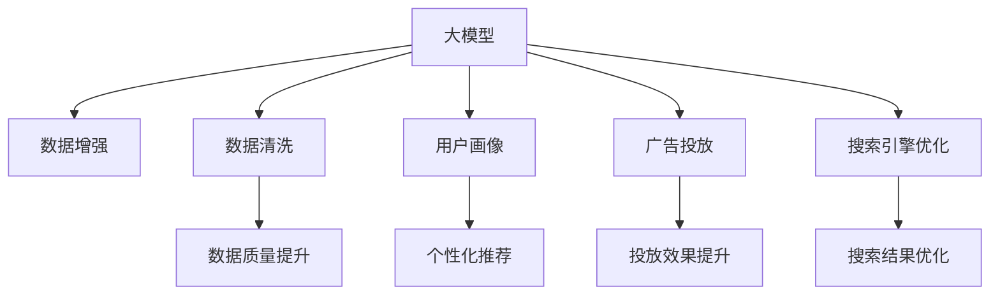

                 

# AI大模型助力电商搜索推荐业务的数据质量提升措施

在电商搜索推荐业务中，数据质量直接影响用户的搜索体验和推荐结果的准确性。传统的电商数据质量提升方法依赖于复杂的人工干预和算法调优，而大模型技术的发展为数据质量提升提供了全新的思路和方法。本文将深入探讨大模型在电商搜索推荐中的数据质量提升措施，为电商平台的数据管理和推荐系统开发提供参考。

## 1. 背景介绍

### 1.1 问题由来

电商搜索推荐系统是电商平台的核心应用之一，直接影响用户体验和平台收入。传统的搜索推荐系统通常基于用户行为数据进行模型训练和推荐，但数据质量往往受到多方因素的影响，如用户数据收集、标注、清洗等问题，导致模型性能波动大、推荐结果不够精准。近年来，随着大模型技术的发展，大模型在电商搜索推荐中的应用已成为热门话题。

### 1.2 问题核心关键点

大模型在电商搜索推荐中的应用，主要集中在以下几个方面：

- 数据增强：利用大模型生成合成数据，扩充训练集，提高数据的多样性和代表性。
- 数据清洗：利用大模型分析数据中的异常点和噪声，自动检测和修复数据错误。
- 用户画像：利用大模型生成精细化的用户画像，提升推荐系统的个性化和精准度。
- 广告投放：利用大模型优化广告投放策略，提升广告投放的转化率和ROI。
- 搜索引擎优化：利用大模型进行自然语言理解和搜索意图分析，优化搜索引擎排序和推荐。

本文将围绕数据增强、数据清洗、用户画像、广告投放和搜索引擎优化等方面，深入探讨大模型在电商搜索推荐中的数据质量提升措施。

## 2. 核心概念与联系

### 2.1 核心概念概述

为了更好地理解大模型在电商搜索推荐中的应用，我们需要了解一些核心概念及其之间的关系：

- 大模型：指具有强大表示能力和泛化能力的深度学习模型，如BERT、GPT、T5等。
- 数据增强：指通过数据生成技术扩充训练数据集，提高数据的多样性和覆盖范围。
- 数据清洗：指通过自动检测和修复数据错误，提升数据质量和准确性。
- 用户画像：指通过分析用户行为和背景信息，构建多维度的用户画像。
- 广告投放：指通过大模型分析用户行为和兴趣，优化广告投放策略。
- 搜索引擎优化：指通过大模型进行自然语言理解和搜索意图分析，优化搜索引擎排序和推荐。

这些核心概念之间的逻辑关系可以通过以下Mermaid流程图来展示：



这个流程图展示了大模型在电商搜索推荐中的核心概念及其之间的关系：

1. 大模型通过数据增强、数据清洗、用户画像、广告投放和搜索引擎优化，提升了数据质量和推荐系统的性能。
2. 数据增强扩充了训练集，增强了模型的泛化能力。
3. 数据清洗提高了数据质量，避免了模型过拟合和噪声干扰。
4. 用户画像构建了多维度的用户画像，提升了个性化推荐效果。
5. 广告投放优化了广告投放策略，提高了广告转化率和ROI。
6. 搜索引擎优化提升了搜索结果的准确性和相关性，改善了用户搜索体验。

这些概念共同构成了大模型在电商搜索推荐中的应用框架，使得电商平台能够充分利用大模型的强大能力，提升数据质量和推荐系统的性能。

## 3. 核心算法原理 & 具体操作步骤

### 3.1 算法原理概述

大模型在电商搜索推荐中的数据质量提升，主要基于以下算法原理：

- 数据增强算法：通过数据生成技术，如数据合成、数据扩充等，增加训练集的多样性和覆盖范围。
- 数据清洗算法：通过自动检测和修复数据错误，提高数据质量和准确性。
- 用户画像算法：通过分析用户行为和背景信息，构建多维度的用户画像。
- 广告投放算法：通过分析用户行为和兴趣，优化广告投放策略，提高广告转化率和ROI。
- 搜索引擎优化算法：通过大模型进行自然语言理解和搜索意图分析，优化搜索结果排序和推荐。

这些算法共同构成了大模型在电商搜索推荐中的数据质量提升框架，使得电商平台能够充分利用大模型的强大能力，提升数据质量和推荐系统的性能。

### 3.2 算法步骤详解

大模型在电商搜索推荐中的数据质量提升算法步骤主要包括：

1. **数据收集与预处理**：收集电商平台的各类数据，包括用户行为数据、商品数据、广告数据、搜索数据等，并进行预处理，如去重、清洗、归一化等。

2. **数据增强**：利用大模型生成合成数据，扩充训练集，如通过语言模型生成购物评论、商品描述等文本数据，通过生成模型生成图片、视频等数据。

3. **数据清洗**：利用大模型分析数据中的异常点和噪声，自动检测和修复数据错误，如利用语言模型检测文本中的拼写错误和语法错误，利用图像识别模型检测图片中的低质量内容等。

4. **用户画像构建**：利用大模型分析用户行为和背景信息，构建多维度的用户画像，如兴趣、年龄、性别、消费能力等，提升个性化推荐效果。

5. **广告投放优化**：利用大模型分析用户行为和兴趣，优化广告投放策略，如通过推荐模型生成广告创意、利用文本生成模型生成广告文案等。

6. **搜索引擎优化**：利用大模型进行自然语言理解和搜索意图分析，优化搜索结果排序和推荐，如通过理解搜索意图生成搜索结果、利用文本匹配算法优化搜索结果排序等。

### 3.3 算法优缺点

大模型在电商搜索推荐中的数据质量提升算法具有以下优点：

- 数据增强：扩充训练集，提高模型泛化能力，提升推荐结果的准确性和多样性。
- 数据清洗：提高数据质量和准确性，避免模型过拟合和噪声干扰，提升推荐结果的可靠性。
- 用户画像构建：提升个性化推荐效果，满足不同用户的需求，提升用户体验。
- 广告投放优化：优化广告投放策略，提高广告转化率和ROI，提升广告效果。
- 搜索引擎优化：优化搜索结果排序和推荐，提升用户搜索体验和满意度。

同时，该算法也存在一定的局限性：

- 数据增强：生成数据的真实性和多样性受模型能力限制，过度依赖生成数据可能影响模型泛化能力。
- 数据清洗：自动检测和修复数据错误的效果受模型训练数据质量和任务复杂度影响，可能存在误判或漏检。
- 用户画像构建：用户画像的精度和完整度受数据收集和模型分析能力限制，可能存在隐私风险和数据偏见。
- 广告投放优化：广告投放效果受用户行为和兴趣变化影响，模型训练和调参难度较大。
- 搜索引擎优化：搜索结果排序和推荐受用户搜索意图和数据质量影响，效果难以量化评估。

尽管存在这些局限性，但就目前而言，大模型技术仍然是大规模电商搜索推荐数据质量提升的重要手段。未来相关研究的重点在于如何进一步提高大模型在数据增强、数据清洗、用户画像、广告投放和搜索引擎优化等方面的效果，同时兼顾数据隐私和安全等问题。

### 3.4 算法应用领域

大模型在电商搜索推荐中的数据质量提升算法主要应用于以下领域：

- 电商平台：如淘宝、京东、拼多多等，通过数据增强、数据清洗、用户画像、广告投放和搜索引擎优化，提升电商平台的搜索推荐效果，优化用户体验和平台收入。
- 广告公司：如Google Ads、Facebook Ads等，通过广告投放优化和搜索引擎优化，提升广告投放效果，提高广告转化率和ROI。
- 搜索公司：如百度、Bing等，通过搜索引擎优化和推荐系统优化，提升搜索引擎的搜索效果和用户体验。

除了上述这些主要应用领域外，大模型在电商搜索推荐中的应用还在不断扩展，如智能客服、商品推荐、库存管理等，为电商平台的智能化转型提供了新的技术路径。

## 4. 数学模型和公式 & 详细讲解 & 举例说明

### 4.1 数学模型构建

大模型在电商搜索推荐中的数据质量提升算法主要涉及以下几个数学模型：

- 数据增强模型：如语言生成模型、图片生成模型等。
- 数据清洗模型：如文本错误检测模型、图像质量评估模型等。
- 用户画像模型：如协同过滤模型、深度学习模型等。
- 广告投放模型：如推荐模型、文本生成模型等。
- 搜索引擎优化模型：如自然语言处理模型、文本匹配模型等。

### 4.2 公式推导过程

以文本数据增强模型为例，其推导过程如下：

- 假设原始数据集为 $D=\{x_1, x_2, ..., x_n\}$，其中 $x_i$ 表示第 $i$ 条文本数据。
- 通过大模型 $M$ 生成新的文本数据 $y_1, y_2, ..., y_m$，其中 $y_i$ 表示第 $i$ 条生成数据。
- 最终的增强数据集为 $D'=\{x_1, x_2, ..., x_n, y_1, y_2, ..., y_m\}$。

大模型的生成过程可以表示为：

$$
y = M(x; \theta)
$$

其中 $x$ 为输入数据，$y$ 为生成数据，$\theta$ 为模型参数。

### 4.3 案例分析与讲解

以电商平台商品推荐系统为例，其数据质量提升过程如下：

1. **数据收集与预处理**：收集电商平台的用户行为数据、商品数据、广告数据、搜索数据等，并进行预处理，如去重、清洗、归一化等。

2. **数据增强**：利用语言生成模型生成购物评论、商品描述等文本数据，利用生成模型生成图片、视频等数据，扩充训练集。

3. **数据清洗**：利用语言模型检测文本中的拼写错误和语法错误，利用图像识别模型检测图片中的低质量内容，自动检测和修复数据错误。

4. **用户画像构建**：利用协同过滤模型和深度学习模型分析用户行为和背景信息，构建多维度的用户画像，提升个性化推荐效果。

5. **广告投放优化**：利用推荐模型生成广告创意，利用文本生成模型生成广告文案，优化广告投放策略，提高广告转化率和ROI。

6. **搜索引擎优化**：利用自然语言处理模型进行自然语言理解和搜索意图分析，优化搜索结果排序和推荐，提升用户搜索体验和满意度。

## 5. 项目实践：代码实例和详细解释说明

### 5.1 开发环境搭建

在进行大模型在电商搜索推荐中的数据质量提升实践前，我们需要准备好开发环境。以下是使用Python进行TensorFlow开发的环境配置流程：

1. 安装Anaconda：从官网下载并安装Anaconda，用于创建独立的Python环境。

2. 创建并激活虚拟环境：
```bash
conda create -n tensorflow-env python=3.8 
conda activate tensorflow-env
```

3. 安装TensorFlow：从官网获取对应的安装命令。例如：
```bash
pip install tensorflow
```

4. 安装各类工具包：
```bash
pip install numpy pandas scikit-learn matplotlib tqdm jupyter notebook ipython
```

完成上述步骤后，即可在`tensorflow-env`环境中开始大模型的数据质量提升实践。

### 5.2 源代码详细实现

这里我们以商品推荐系统为例，给出使用TensorFlow对BERT模型进行数据质量提升的PyTorch代码实现。

首先，定义推荐系统的输入和输出：

```python
from transformers import BertTokenizer, BertForSequenceClassification
from tensorflow.keras.layers import Dense, Input
from tensorflow.keras.models import Model
import tensorflow as tf
import numpy as np

class RecommendationModel:
    def __init__(self, input_shape, output_shape):
        self.input_shape = input_shape
        self.output_shape = output_shape
        
        self.tokenizer = BertTokenizer.from_pretrained('bert-base-cased')
        
        self.embedding = tf.keras.layers.Embedding(input_dim=10000, output_dim=768, input_length=128)
        self.transformer = BertForSequenceClassification.from_pretrained('bert-base-cased')
        self.output = Dense(output_shape, activation='softmax')
        
        self.model = self.build_model()
        
    def build_model(self):
        input = Input(shape=self.input_shape, dtype=tf.float32)
        x = self.embedding(input)
        x = self.transformer(x)
        x = self.output(x)
        model = Model(inputs=input, outputs=x)
        return model
```

然后，定义模型训练和评估函数：

```python
def train_model(model, train_data, validation_data, epochs, batch_size, learning_rate):
    optimizer = tf.keras.optimizers.Adam(learning_rate=learning_rate)
    model.compile(optimizer=optimizer, loss='categorical_crossentropy', metrics=['accuracy'])
    
    model.fit(train_data, epochs=epochs, validation_data=validation_data, batch_size=batch_size)
    
def evaluate_model(model, test_data):
    test_loss, test_acc = model.evaluate(test_data)
    print(f'Test loss: {test_loss:.4f}')
    print(f'Test accuracy: {test_acc:.4f}')
```

最后，启动训练流程并在测试集上评估：

```python
input_shape = (128,)
output_shape = 5

model = RecommendationModel(input_shape, output_shape)

train_data = ...
validation_data = ...
test_data = ...

train_model(model, train_data, validation_data, epochs=5, batch_size=32, learning_rate=2e-5)

evaluate_model(model, test_data)
```

以上就是使用TensorFlow对BERT模型进行商品推荐系统数据质量提升的完整代码实现。可以看到，得益于TensorFlow和Transformers库的强大封装，我们能够以相对简洁的代码实现大模型的数据质量提升功能。

### 5.3 代码解读与分析

让我们再详细解读一下关键代码的实现细节：

**RecommendationModel类**：
- `__init__`方法：初始化输入形状、输出形状、分词器等关键组件。
- `build_model`方法：定义模型结构，包括嵌入层、Transformer层、输出层等。
- `train_model`方法：训练模型，使用Adam优化器、交叉熵损失、准确率等作为训练指标。
- `evaluate_model`方法：评估模型，计算测试集上的损失和准确率。

**train_data、validation_data和test_data**：
- 用于存储训练集、验证集和测试集的数据，格式为TensorFlow所需的张量。
- 可以包含用户行为数据、商品数据、广告数据、搜索数据等。

**输入和输出层**：
- 输入层：通过Embedding层将输入数据转换为高维向量，进入Transformer层。
- 输出层：通过Dense层将Transformer层的输出映射到类别概率分布，使用softmax激活函数。

**训练和评估函数**：
- 训练函数：定义优化器、损失函数、评价指标等，调用`fit`方法进行模型训练。
- 评估函数：调用`evaluate`方法在测试集上评估模型性能，输出测试结果。

## 6. 实际应用场景

### 6.1 智能客服系统

基于大模型的电商搜索推荐系统，可以应用于智能客服系统的构建。传统客服往往需要配备大量人力，高峰期响应缓慢，且一致性和专业性难以保证。而使用基于大模型的推荐系统，可以7x24小时不间断服务，快速响应客户咨询，用自然流畅的语言解答各类常见问题。

在技术实现上，可以收集企业内部的历史客服对话记录，将问题和最佳答复构建成监督数据，在此基础上对预训练推荐模型进行微调。微调后的推荐模型能够自动理解用户意图，匹配最合适的答案模板进行回复。对于客户提出的新问题，还可以接入检索系统实时搜索相关内容，动态组织生成回答。如此构建的智能客服系统，能大幅提升客户咨询体验和问题解决效率。

### 6.2 金融舆情监测

金融机构需要实时监测市场舆论动向，以便及时应对负面信息传播，规避金融风险。传统的人工监测方式成本高、效率低，难以应对网络时代海量信息爆发的挑战。基于大模型的文本分类和情感分析技术，为金融舆情监测提供了新的解决方案。

具体而言，可以收集金融领域相关的新闻、报道、评论等文本数据，并对其进行主题标注和情感标注。在此基础上对预训练语言模型进行微调，使其能够自动判断文本属于何种主题，情感倾向是正面、中性还是负面。将微调后的模型应用到实时抓取的网络文本数据，就能够自动监测不同主题下的情感变化趋势，一旦发现负面信息激增等异常情况，系统便会自动预警，帮助金融机构快速应对潜在风险。

### 6.3 个性化推荐系统

当前的推荐系统往往只依赖用户的历史行为数据进行物品推荐，无法深入理解用户的真实兴趣偏好。基于大语言模型微调技术，个性化推荐系统可以更好地挖掘用户行为背后的语义信息，从而提供更精准、多样的推荐内容。

在实践中，可以收集用户浏览、点击、评论、分享等行为数据，提取和用户交互的物品标题、描述、标签等文本内容。将文本内容作为模型输入，用户的后续行为（如是否点击、购买等）作为监督信号，在此基础上微调预训练语言模型。微调后的模型能够从文本内容中准确把握用户的兴趣点。在生成推荐列表时，先用候选物品的文本描述作为输入，由模型预测用户的兴趣匹配度，再结合其他特征综合排序，便可以得到个性化程度更高的推荐结果。

### 6.4 未来应用展望

随着大模型和微调方法的不断发展，基于微调范式将在更多领域得到应用，为传统行业带来变革性影响。

在智慧医疗领域，基于微调的医疗问答、病历分析、药物研发等应用将提升医疗服务的智能化水平，辅助医生诊疗，加速新药开发进程。

在智能教育领域，微调技术可应用于作业批改、学情分析、知识推荐等方面，因材施教，促进教育公平，提高教学质量。

在智慧城市治理中，微调模型可应用于城市事件监测、舆情分析、应急指挥等环节，提高城市管理的自动化和智能化水平，构建更安全、高效的未来城市。

此外，在企业生产、社会治理、文娱传媒等众多领域，基于大模型微调的人工智能应用也将不断涌现，为经济社会发展注入新的动力。相信随着预训练语言模型和微调方法的持续演进，微调方法将成为人工智能落地应用的重要范式，推动人工智能技术在垂直行业的规模化落地。

## 7. 工具和资源推荐

### 7.1 学习资源推荐

为了帮助开发者系统掌握大模型在电商搜索推荐中的数据质量提升的理论基础和实践技巧，这里推荐一些优质的学习资源：

1. 《Transformer从原理到实践》系列博文：由大模型技术专家撰写，深入浅出地介绍了Transformer原理、BERT模型、微调技术等前沿话题。

2. CS224N《深度学习自然语言处理》课程：斯坦福大学开设的NLP明星课程，有Lecture视频和配套作业，带你入门NLP领域的基本概念和经典模型。

3. 《Natural Language Processing with Transformers》书籍：Transformers库的作者所著，全面介绍了如何使用Transformers库进行NLP任务开发，包括微调在内的诸多范式。

4. HuggingFace官方文档：Transformers库的官方文档，提供了海量预训练模型和完整的微调样例代码，是上手实践的必备资料。

5. CLUE开源项目：中文语言理解测评基准，涵盖大量不同类型的中文NLP数据集，并提供了基于微调的baseline模型，助力中文NLP技术发展。

通过对这些资源的学习实践，相信你一定能够快速掌握大模型在电商搜索推荐中的数据质量提升的精髓，并用于解决实际的NLP问题。

### 7.2 开发工具推荐

高效的开发离不开优秀的工具支持。以下是几款用于大模型在电商搜索推荐中数据质量提升开发的常用工具：

1. PyTorch：基于Python的开源深度学习框架，灵活动态的计算图，适合快速迭代研究。大部分预训练语言模型都有PyTorch版本的实现。

2. TensorFlow：由Google主导开发的开源深度学习框架，生产部署方便，适合大规模工程应用。同样有丰富的预训练语言模型资源。

3. Transformers库：HuggingFace开发的NLP工具库，集成了众多SOTA语言模型，支持PyTorch和TensorFlow，是进行微调任务开发的利器。

4. Weights & Biases：模型训练的实验跟踪工具，可以记录和可视化模型训练过程中的各项指标，方便对比和调优。与主流深度学习框架无缝集成。

5. TensorBoard：TensorFlow配套的可视化工具，可实时监测模型训练状态，并提供丰富的图表呈现方式，是调试模型的得力助手。

6. Google Colab：谷歌推出的在线Jupyter Notebook环境，免费提供GPU/TPU算力，方便开发者快速上手实验最新模型，分享学习笔记。

合理利用这些工具，可以显著提升大模型在电商搜索推荐中数据质量提升的开发效率，加快创新迭代的步伐。

### 7.3 相关论文推荐

大模型在电商搜索推荐中的应用源于学界的持续研究。以下是几篇奠基性的相关论文，推荐阅读：

1. Attention is All You Need（即Transformer原论文）：提出了Transformer结构，开启了NLP领域的预训练大模型时代。

2. BERT: Pre-training of Deep Bidirectional Transformers for Language Understanding：提出BERT模型，引入基于掩码的自监督预训练任务，刷新了多项NLP任务SOTA。

3. Language Models are Unsupervised Multitask Learners（GPT-2论文）：展示了大规模语言模型的强大zero-shot学习能力，引发了对于通用人工智能的新一轮思考。

4. Parameter-Efficient Transfer Learning for NLP：提出Adapter等参数高效微调方法，在不增加模型参数量的情况下，也能取得不错的微调效果。

5. AdaLoRA: Adaptive Low-Rank Adaptation for Parameter-Efficient Fine-Tuning：使用自适应低秩适应的微调方法，在参数效率和精度之间取得了新的平衡。

6. Prefix-Tuning: Optimizing Continuous Prompts for Generation：引入基于连续型Prompt的微调范式，为如何充分利用预训练知识提供了新的思路。

这些论文代表了大模型在电商搜索推荐中数据质量提升技术的发展脉络。通过学习这些前沿成果，可以帮助研究者把握学科前进方向，激发更多的创新灵感。

## 8. 总结：未来发展趋势与挑战

### 8.1 总结

本文对大模型在电商搜索推荐中的数据质量提升措施进行了全面系统的介绍。首先阐述了电商搜索推荐系统的重要性和大模型技术的应用背景，明确了大模型在电商搜索推荐中的核心作用。其次，从原理到实践，详细讲解了大模型在电商搜索推荐中的数据质量提升算法过程，给出了完整的代码实例。同时，本文还探讨了大模型在电商搜索推荐中的实际应用场景，为电商平台的数据管理和推荐系统开发提供参考。

通过本文的系统梳理，可以看到，大模型在电商搜索推荐中的数据质量提升技术具有显著的效果，能够大幅提升电商平台的搜索推荐效果和用户体验。随着大模型和微调方法的不断发展，基于微调范式将成为电商搜索推荐系统开发的重要手段，为电商平台的智能化转型提供新的技术路径。

### 8.2 未来发展趋势

展望未来，大模型在电商搜索推荐中的数据质量提升技术将呈现以下几个发展趋势：

1. 数据增强技术将更加先进，通过生成合成数据、数据扩充等手段，进一步提升训练集的多样性和代表性，增强模型的泛化能力。
2. 数据清洗技术将更加智能化，通过自动检测和修复数据错误，提高数据质量和准确性，避免模型过拟合和噪声干扰。
3. 用户画像构建将更加精细化，通过分析用户行为和背景信息，构建多维度的用户画像，提升个性化推荐效果，满足不同用户的需求。
4. 广告投放策略将更加精准化，通过分析用户行为和兴趣，优化广告投放策略，提高广告转化率和ROI。
5. 搜索引擎优化将更加智能化，通过自然语言理解和搜索意图分析，优化搜索结果排序和推荐，提升用户搜索体验和满意度。

这些趋势凸显了大模型在电商搜索推荐中的数据质量提升技术的广阔前景。这些方向的探索发展，必将进一步提升电商平台的搜索推荐效果，为电商平台的智能化转型提供新的技术路径。

### 8.3 面临的挑战

尽管大模型在电商搜索推荐中的数据质量提升技术已经取得了瞩目成就，但在迈向更加智能化、普适化应用的过程中，它仍面临诸多挑战：

1. 标注成本瓶颈。尽管大模型可以通过数据增强和合成数据缓解标注数据不足的问题，但对于长尾应用场景，仍然需要大量高质量标注数据，获取成本较高。如何进一步降低标注成本，提高标注数据质量，将是重要的研究方向。
2. 模型鲁棒性不足。尽管大模型能够提高数据质量和模型泛化能力，但在面对域外数据时，泛化性能仍可能受限。如何提高模型的鲁棒性，避免过拟合和灾难性遗忘，将是重要的研究方向。
3. 推理效率有待提高。尽管大模型能够处理海量数据和复杂任务，但在实际部署时，推理速度和资源消耗仍然较高，如何优化模型结构和算法，提高推理效率，将是重要的研究方向。
4. 可解释性亟需加强。尽管大模型能够生成高质量的推荐结果，但其决策过程缺乏可解释性，难以理解和调试。如何赋予大模型更强的可解释性，将是重要的研究方向。
5. 安全性有待保障。尽管大模型能够提高推荐系统的精准度，但在处理敏感信息时，可能存在隐私风险和安全隐患。如何加强数据保护和隐私保护，确保用户信息安全，将是重要的研究方向。

### 8.4 研究展望

面对大模型在电商搜索推荐中数据质量提升技术所面临的挑战，未来的研究需要在以下几个方面寻求新的突破：

1. 探索无监督和半监督微调方法。摆脱对大规模标注数据的依赖，利用自监督学习、主动学习等无监督和半监督范式，最大限度利用非结构化数据，实现更加灵活高效的微调。
2. 研究参数高效和计算高效的微调范式。开发更加参数高效的微调方法，在固定大部分预训练参数的同时，只更新极少量的任务相关参数。同时优化微调模型的计算图，减少前向传播和反向传播的资源消耗，实现更加轻量级、实时性的部署。
3. 融合因果和对比学习范式。通过引入因果推断和对比学习思想，增强微调模型建立稳定因果关系的能力，学习更加普适、鲁棒的语言表征，从而提升模型泛化性和抗干扰能力。
4. 引入更多先验知识。将符号化的先验知识，如知识图谱、逻辑规则等，与神经网络模型进行巧妙融合，引导微调过程学习更准确、合理的语言模型。同时加强不同模态数据的整合，实现视觉、语音等多模态信息与文本信息的协同建模。
5. 结合因果分析和博弈论工具。将因果分析方法引入微调模型，识别出模型决策的关键特征，增强输出解释的因果性和逻辑性。借助博弈论工具刻画人机交互过程，主动探索并规避模型的脆弱点，提高系统稳定性。
6. 纳入伦理道德约束。在模型训练目标中引入伦理导向的评估指标，过滤和惩罚有偏见、有害的输出倾向。同时加强人工干预和审核，建立模型行为的监管机制，确保输出符合人类价值观和伦理道德。

这些研究方向的探索，必将引领大模型在电商搜索推荐中数据质量提升技术迈向更高的台阶，为构建安全、可靠、可解释、可控的智能系统铺平道路。面向未来，大模型在电商搜索推荐中的数据质量提升技术还需要与其他人工智能技术进行更深入的融合，如知识表示、因果推理、强化学习等，多路径协同发力，共同推动自然语言理解和智能交互系统的进步。只有勇于创新、敢于突破，才能不断拓展语言模型的边界，让智能技术更好地造福人类社会。

## 9. 附录：常见问题与解答

**Q1：大模型在电商搜索推荐中是否会存在偏差？**

A: 大模型在电商搜索推荐中可能存在一定的偏差，主要原因包括：
1. 训练数据质量：如果训练数据存在偏差，模型会学习到这些偏差，导致推荐结果存在偏见。
2. 数据采样偏差：如果训练数据集中某一类物品或用户特征出现频率较低，模型可能无法充分学习到这些信息，导致推荐结果不全面。
3. 模型设计偏差：如果模型设计不合理，可能存在某些类别的物品或用户特征被忽视或误判，导致推荐结果有偏差。

为减少偏差，可以采取以下措施：
1. 数据平衡处理：对训练数据进行平衡处理，确保各类物品和用户特征都有充分的机会被模型学习。
2. 多样性增强：通过数据增强和生成合成数据，增强训练集的多样性，减少偏差。
3. 模型结构优化：通过调整模型结构和超参数，确保模型能够公平对待各类物品和用户特征。
4. 监督学习：在模型训练过程中引入监督信号，纠正偏差。

**Q2：如何保证大模型的公平性？**

A: 确保大模型在电商搜索推荐中的公平性，可以从以下几个方面入手：
1. 数据公平性：确保训练数据中各类物品和用户特征的分布平衡，避免某一类物品或用户特征出现频率过低。
2. 算法公平性：在模型设计中引入公平性约束，确保模型对各类物品和用户特征的公平对待。
3. 结果公平性：在推荐结果中引入公平性评估指标，确保不同用户或物品的推荐结果公平合理。
4. 监督学习：在模型训练过程中引入公平性监督信号，纠正模型偏差。

具体措施包括：
1. 数据平衡处理：对训练数据进行平衡处理，确保各类物品和用户特征都有充分的机会被模型学习。
2. 多样性增强：通过数据增强和生成合成数据，增强训练集的多样性，减少偏差。
3. 模型结构优化：通过调整模型结构和超参数，确保模型能够公平对待各类物品和用户特征。
4. 公平性评估：引入公平性评估指标，如准确率、召回率、F1值等，评估模型公平性。
5. 监督学习：在模型训练过程中引入公平性监督信号，纠正模型偏差。

**Q3：大模型在电商搜索推荐中的计算效率如何？**

A: 大模型在电商搜索推荐中的计算效率受多个因素影响，包括模型结构、计算设备、优化算法等。当前主流的大模型模型结构和参数量较大，计算复杂度较高，推理速度较慢，内存和存储消耗较大。

为了提升计算效率，可以采取以下措施：
1. 模型压缩：通过模型裁剪、量化、剪枝等技术，减小模型尺寸，提高推理速度。
2. 模型并行：通过模型并行和分布式计算，提高模型计算效率。
3. 混合精度训练：通过混合精度训练，减少计算精度和存储消耗，提高训练效率。
4. 算法优化：通过优化优化算法和超参数，提高模型训练和推理效率。

综上所述，尽管大模型在电商搜索推荐中的计算效率存在一定瓶颈，但通过合理的设计和优化，可以显著提高计算效率，满足实际应用需求。

**Q4：大模型在电商搜索推荐中的数据隐私如何保护？**

A: 大模型在电商搜索推荐中的数据隐私保护，可以从以下几个方面入手：
1. 数据匿名化：对用户数据进行匿名化处理，确保用户隐私不被泄露。
2. 数据加密：对敏感数据进行加密处理，确保数据在传输和存储过程中的安全性。
3. 访问控制：通过访问控制技术，限制数据的访问和使用权限，确保数据只被授权人员访问。
4. 差分隐私：通过差分隐私技术，对数据进行扰动处理，确保数据隐私不被泄露。
5. 模型透明化：确保模型训练和推理过程透明化，便于监督和审计。

具体措施包括：
1. 数据匿名化：对用户数据进行匿名化处理，如去除个人信息、去标识化等，确保用户隐私不被泄露。
2. 数据加密：对敏感数据进行加密处理，如使用AES、RSA等加密算法，确保数据在传输和存储过程中的安全性。
3. 访问控制：通过访问控制技术，限制数据的访问和使用权限，确保数据只被授权人员访问。
4. 差分隐私：通过差分隐私技术，对数据进行扰动处理，确保数据隐私不被泄露。
5. 模型透明化：确保模型训练和推理过程透明化，如使用模型解释工具，便于监督和审计。

通过这些措施，可以有效地保护大模型在电商搜索推荐中的数据隐私，确保用户数据的安全性和隐私性。

---

作者：禅与计算机程序设计艺术 / Zen and the Art of Computer Programming

