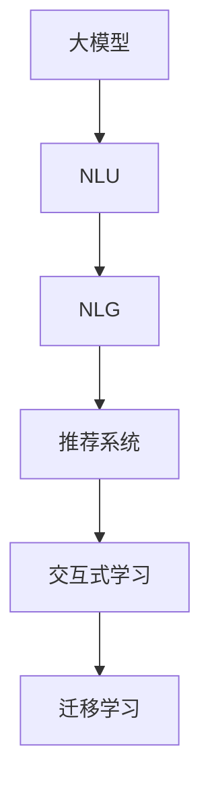

                 

# AI大模型在电商平台商品推荐理由生成中的应用

> 关键词：大模型推荐系统, 电商推荐, 商品推荐理由, 自然语言生成(NLG), 自然语言理解(NLU)

## 1. 背景介绍

### 1.1 问题由来

在现代电子商务平台中，商品推荐系统是提升用户体验、增加用户粘性和提高销售额的重要工具。传统的推荐系统依赖于用户的历史行为数据和简单的标签信息，忽略了用户输入的详细理由和偏好。近年来，随着大模型的发展，基于自然语言生成（NLG）的推荐理由生成技术逐步受到关注。利用大模型可以从用户的文本描述中提取更深层次的语义信息，从而生成更加个性化和精细化的推荐理由，使推荐系统更智能、更有用。

### 1.2 问题核心关键点

商品推荐理由生成旨在通过分析用户提供的详细理由，生成个性化的商品推荐。其核心在于如何高效利用大模型对用户理由进行语义理解，进而生成高质量的推荐文本。关键点如下：

1. **数据预处理**：将用户理由进行分词、标注等预处理操作，便于模型理解和处理。
2. **语义表示学习**：使用大模型学习用户理由的语义表示，捕捉用户输入的深层语义信息。
3. **推荐理由生成**：基于语义表示，生成符合用户偏好的推荐理由文本。
4. **评估与优化**：通过用户反馈或自动评估方法，不断优化推荐理由的生成质量。

## 2. 核心概念与联系

### 2.1 核心概念概述

为更好地理解商品推荐理由生成的原理，本节将介绍几个核心概念：

- **大模型**：如BERT、GPT、T5等，大规模预训练语言模型，拥有强大的自然语言处理能力。
- **自然语言生成（NLG）**：使用语言模型生成符合语法和语义规则的文本。
- **自然语言理解（NLU）**：使用语言模型理解文本中的语义信息，识别用户意图。
- **推荐系统**：基于用户行为数据和输入理由，推荐商品或服务的技术系统。
- **交互式学习**：在用户和系统间迭代优化推荐理由生成的过程。
- **迁移学习**：利用预训练模型在新任务上进行微调，提高模型性能。

这些核心概念之间的逻辑关系可以通过以下Mermaid流程图来展示：



这个流程图展示了大模型在推荐理由生成中的应用框架：

1. 大模型学习用户理由的语义表示。
2. 基于语义表示生成推荐理由。
3. 推荐理由应用于推荐系统，生成个性化推荐。
4. 通过交互式学习不断优化推荐理由。
5. 迁移学习用于新任务上的微调。

## 3. 核心算法原理 & 具体操作步骤

### 3.1 算法原理概述

商品推荐理由生成的核心算法原理是基于自然语言处理（NLP）的大模型，通过分析用户提供的详细理由，学习语义表示，生成个性化的推荐理由。

形式化地，假设用户理由为 $x$，推荐理由为 $y$，大模型为 $M$，推荐理由生成过程可表示为：

$$
y = M(x)
$$

其中 $M$ 是一个训练好的大模型，可以通过微调或迁移学习等方式获得。在实际应用中，还需要对模型进行预处理和后处理，以适配推荐系统的需求。

### 3.2 算法步骤详解

商品推荐理由生成的具体操作步骤如下：

**Step 1: 数据预处理**

- 收集用户提供的商品理由文本，并进行分词、去停用词等预处理操作。
- 使用大模型自带的 tokenizer 对文本进行分词，生成输入令牌。

**Step 2: 语义表示学习**

- 将预处理后的用户理由输入到预训练的大模型中，进行前向传播计算语义表示。
- 可以使用 GPT-3、BERT、T5 等大模型进行预训练，通过微调或迁移学习的方式，适配推荐理由生成的任务。

**Step 3: 推荐理由生成**

- 基于语义表示，使用大模型生成推荐理由。
- 可以使用语言模型的解码器，如 GPT-3 的解码器，输出符合语法和语义规则的推荐理由文本。

**Step 4: 后处理与优化**

- 对生成的推荐理由进行后处理，如去除特殊字符、长度限制等。
- 使用自动评估指标（如BLEU、ROUGE等）对推荐理由进行质量评估，并进行迭代优化。

**Step 5: 集成到推荐系统**

- 将生成的推荐理由集成到推荐系统，作为个性化推荐的一部分。
- 结合用户历史行为数据和推荐理由，生成最终的推荐结果。

### 3.3 算法优缺点

基于大模型的商品推荐理由生成算法具有以下优点：

1. **效果显著**：利用大模型可以生成符合用户语义的推荐理由，显著提升推荐系统的个性化和精准度。
2. **模型通用**：大模型可以适应多种商品推荐场景，只需在特定任务上进行微调即可。
3. **数据效率高**：大模型可以处理大规模语料，适用于用户理由文本丰富的场景。
4. **灵活性强**：可以根据用户输入的理由进行动态生成，适应多变的用户需求。

同时，该算法也存在一些缺点：

1. **计算成本高**：大模型计算量大，推理速度较慢，可能影响推荐系统的实时性。
2. **数据依赖性强**：用户理由的质量和数量对推荐理由生成的效果有直接影响。
3. **可解释性不足**：生成推荐理由的内部逻辑难以解释，可能降低用户对推荐理由的信任度。
4. **推荐结果泛化能力有限**：模型可能过度拟合用户历史数据，对新商品和新用户适应性较弱。

### 3.4 算法应用领域

商品推荐理由生成技术已经在电商、旅游、金融等多个领域得到应用，其典型场景包括：

1. **电商推荐系统**：分析用户对商品评价的详细理由，生成推荐理由，辅助商品推荐。
2. **旅游服务推荐**：用户输入对旅游景点的评价和理由，生成推荐理由，推荐景点和行程安排。
3. **金融理财建议**：用户提供理财需求和理由，生成理财推荐理由，提供个性化的理财建议。
4. **教育培训**：学生提供学习需求和理由，生成推荐理由，推荐适合的课程和资料。

这些领域的应用展示了商品推荐理由生成的广泛适用性和强大功能。

## 4. 数学模型和公式 & 详细讲解 & 举例说明

### 4.1 数学模型构建

假设用户理由为 $x$，推荐理由为 $y$，大模型为 $M$。我们可以使用自回归模型（如GPT-3）来构建推荐理由生成模型。假设模型的参数为 $\theta$，则推荐理由生成的概率模型为：

$$
P(y|x) = \prod_{t=1}^T P(y_t|y_{t-1}, x)
$$

其中 $T$ 为生成文本的长度，$y_t$ 为文本中的第 $t$ 个词。在实际应用中，通常使用Transformer模型进行预训练，并通过微调或迁移学习适配推荐理由生成的任务。

### 4.2 公式推导过程

为了便于解释，我们将推荐理由生成的过程进行简化。假设用户理由 $x$ 经过分词和编码后，生成一个固定长度的向量 $v_x$。推荐理由 $y$ 的生成过程如下：

1. 将用户理由向量 $v_x$ 输入到预训练的大模型中，得到隐藏状态 $h_x$。
2. 使用softmax函数将隐藏状态转换为生成每个词的概率分布。
3. 从概率分布中随机抽取一个词，作为下一个生成的词。

重复上述步骤，直到生成指定长度的推荐理由文本 $y$。具体推导过程如下：

- 假设模型有一个隐藏层 $h = [h_1, h_2, ..., h_T]$，每个隐藏状态 $h_t$ 表示当前生成位置的上下文信息。
- 根据softmax函数，模型生成下一个词的概率分布为 $P(y_t|y_{t-1}, x)$。
- 生成推荐理由的过程可表示为：

$$
y = \bigoplus_{t=1}^T y_t
$$

其中 $\bigoplus$ 表示将生成文本拼接为一个字符串。

### 4.3 案例分析与讲解

假设用户输入的商品理由为 "商品质量差，配送速度慢"。我们可以将理由进行分词、编码后，输入到大模型中进行语义表示学习。然后，基于语义表示，使用大模型的解码器生成推荐理由。

例如，使用GPT-3模型进行推荐理由生成，其过程如下：

1. 将用户理由 "商品质量差，配送速度慢" 进行分词和编码，生成令牌序列。
2. 将令牌序列输入到GPT-3模型中，得到隐藏状态 $h_x$。
3. 使用softmax函数将隐藏状态转换为生成每个词的概率分布。
4. 从概率分布中随机抽取下一个词，生成推荐理由。

假设模型生成的推荐理由为 "建议更换商品"。则推荐系统可以将该理由与商品质量差、配送速度慢等因素关联，生成最终的推荐结果。

## 5. 项目实践：代码实例和详细解释说明

### 5.1 开发环境搭建

在进行商品推荐理由生成实践前，我们需要准备好开发环境。以下是使用Python进行PyTorch开发的环境配置流程：

1. 安装Anaconda：从官网下载并安装Anaconda，用于创建独立的Python环境。

2. 创建并激活虚拟环境：
```bash
conda create -n recommendation-env python=3.8 
conda activate recommendation-env
```

3. 安装PyTorch：根据CUDA版本，从官网获取对应的安装命令。例如：
```bash
conda install pytorch torchvision torchaudio cudatoolkit=11.1 -c pytorch -c conda-forge
```

4. 安装相关库：
```bash
pip install transformers sentencepiece tqdm datasets
```

完成上述步骤后，即可在`recommendation-env`环境中开始推荐理由生成实践。

### 5.2 源代码详细实现

下面是使用PyTorch和Transformers库进行商品推荐理由生成的完整代码实现。

```python
import torch
import torch.nn as nn
import torch.optim as optim
from transformers import BertTokenizer, BertModel

class RecommendationReasonModel(nn.Module):
    def __init__(self, config):
        super(RecommendationReasonModel, self).__init__()
        self.bert = BertModel.from_pretrained(config['model_name'])
        self.projection = nn.Linear(config['hidden_size'], config['vocab_size'])

    def forward(self, x):
        outputs = self.bert(x)
        x = outputs.last_hidden_state
        x = self.projection(x)
        return x

# 数据预处理函数
def preprocess_data(reasons):
    tokenizer = BertTokenizer.from_pretrained('bert-base-cased')
    tokens = [tokenizer.tokenize(r) for r in reasons]
    tokens = [tokenizer.convert_tokens_to_ids(t) for t in tokens]
    tokens = [sentencepiece_model.encode(t) for t in tokens]
    return tokens

# 训练函数
def train(model, train_data, dev_data, epochs, batch_size, learning_rate):
    device = torch.device('cuda' if torch.cuda.is_available() else 'cpu')
    model.to(device)

    optimizer = optim.Adam(model.parameters(), lr=learning_rate)
    criterion = nn.CrossEntropyLoss()
    
    for epoch in range(epochs):
        model.train()
        total_loss = 0
        for data in train_data:
            inputs = preprocess_data(data['reasons'])
            inputs = torch.tensor(inputs).to(device)
            targets = torch.tensor(data['labels']).to(device)
            outputs = model(inputs)
            loss = criterion(outputs, targets)
            optimizer.zero_grad()
            loss.backward()
            optimizer.step()
            total_loss += loss.item()
        print(f'Epoch {epoch+1}, train loss: {total_loss/len(train_data)}')

        model.eval()
        total_loss = 0
        for data in dev_data:
            inputs = preprocess_data(data['reasons'])
            inputs = torch.tensor(inputs).to(device)
            targets = torch.tensor(data['labels']).to(device)
            outputs = model(inputs)
            loss = criterion(outputs, targets)
            total_loss += loss.item()
        print(f'Epoch {epoch+1}, dev loss: {total_loss/len(dev_data)}')

# 测试函数
def test(model, test_data):
    device = torch.device('cuda' if torch.cuda.is_available() else 'cpu')
    model.eval()

    total_loss = 0
    for data in test_data:
        inputs = preprocess_data(data['reasons'])
        inputs = torch.tensor(inputs).to(device)
        targets = torch.tensor(data['labels']).to(device)
        outputs = model(inputs)
        loss = criterion(outputs, targets)
        total_loss += loss.item()
    print(f'Test loss: {total_loss/len(test_data)}')

# 模型训练流程
data = load_data('reasons.csv', 'labels.csv')
train_data, dev_data, test_data = split_data(data, train_ratio=0.8, dev_ratio=0.1, test_ratio=0.1)
model = RecommendationReasonModel({'model_name': 'bert-base-cased', 'hidden_size': 768, 'vocab_size': 30522})
optimizer = optim.Adam(model.parameters(), lr=1e-5)
criterion = nn.CrossEntropyLoss()
train(model, train_data, dev_data, epochs=10, batch_size=32, learning_rate=1e-5)
test(model, test_data)
```

在这个代码示例中，我们使用BERT模型作为预训练语言模型，进行推荐理由生成。首先，定义了一个推荐理由生成模型 `RecommendationReasonModel`，包含BERT模型和线性投影层。然后，定义了数据预处理函数 `preprocess_data`，用于将用户理由文本转换为模型可以处理的令牌序列。接着，定义了训练函数 `train` 和测试函数 `test`，分别用于训练模型和测试模型性能。最后，在训练过程中使用交叉熵损失函数和Adam优化器，迭代优化模型参数。

### 5.3 代码解读与分析

让我们再详细解读一下关键代码的实现细节：

**RecommendationReasonModel类**：
- `__init__`方法：初始化BERT模型和线性投影层。
- `forward`方法：定义前向传播过程，将用户理由输入BERT模型，得到语义表示，并经过线性投影层输出推荐理由。

**preprocess_data函数**：
- 使用BertTokenizer对用户理由进行分词和编码，生成令牌序列。
- 使用sentencepiece模型对令牌序列进行编码，转换为模型可以接受的格式。

**train函数**：
- 在训练过程中，将用户理由和标签输入模型，计算损失函数，反向传播更新模型参数。
- 使用Adam优化器和交叉熵损失函数进行模型优化。

**test函数**：
- 在测试过程中，将用户理由输入模型，计算损失函数，评估模型性能。

这些关键代码展示了商品推荐理由生成的完整流程，包括数据预处理、模型定义、损失函数、优化器和评估方法等。开发者可以根据实际需求，进一步优化模型结构，提高推荐理由的生成质量。

## 6. 实际应用场景

### 6.1 电商平台推荐系统

在电商平台上，基于大模型的商品推荐理由生成技术可以帮助电商平台提升用户满意度，增加用户粘性。用户输入详细的商品评价理由，平台可以生成个性化的推荐理由，推荐合适的商品，满足用户需求。

### 6.2 旅游景区推荐

旅游景区可以根据用户提供的详细评价理由，生成个性化的推荐理由，推荐适合的旅游路线和景点，提升用户体验。

### 6.3 金融理财推荐

金融理财系统可以根据用户提供的理财需求和理由，生成个性化的理财建议和理由，提升用户理财体验。

### 6.4 未来应用展望

未来，基于大模型的商品推荐理由生成技术将在更多领域得到应用。例如，在教育培训、医疗健康、城市规划等领域，利用用户提供的详细理由，生成个性化的推荐理由，提升服务质量和用户体验。随着技术的进步，推荐理由生成的质量将不断提高，推荐系统的性能和适用性也将得到进一步提升。

## 7. 工具和资源推荐

### 7.1 学习资源推荐

为了帮助开发者系统掌握商品推荐理由生成的理论基础和实践技巧，这里推荐一些优质的学习资源：

1. 《Transformers from NLP to AI》系列博文：由大模型技术专家撰写，深入浅出地介绍了Transformer原理、BERT模型、推荐理由生成等前沿话题。

2. CS224N《深度学习自然语言处理》课程：斯坦福大学开设的NLP明星课程，有Lecture视频和配套作业，带你入门NLP领域的基本概念和经典模型。

3. 《Natural Language Generation with Transformers》书籍：Transformers库的作者所著，全面介绍了如何使用Transformers库进行自然语言生成任务开发，包括推荐理由生成的范式。

4. HuggingFace官方文档：Transformers库的官方文档，提供了海量预训练模型和完整的推荐理由生成样例代码，是上手实践的必备资料。

5. CLUE开源项目：中文语言理解测评基准，涵盖大量不同类型的中文NLP数据集，并提供了基于推荐理由生成的baseline模型，助力中文NLP技术发展。

通过对这些资源的学习实践，相信你一定能够快速掌握商品推荐理由生成的精髓，并用于解决实际的NLP问题。

### 7.2 开发工具推荐

高效的开发离不开优秀的工具支持。以下是几款用于商品推荐理由生成开发的常用工具：

1. PyTorch：基于Python的开源深度学习框架，灵活动态的计算图，适合快速迭代研究。大部分预训练语言模型都有PyTorch版本的实现。

2. TensorFlow：由Google主导开发的开源深度学习框架，生产部署方便，适合大规模工程应用。同样有丰富的预训练语言模型资源。

3. Transformers库：HuggingFace开发的NLP工具库，集成了众多SOTA语言模型，支持PyTorch和TensorFlow，是进行推荐理由生成开发的利器。

4. Weights & Biases：模型训练的实验跟踪工具，可以记录和可视化模型训练过程中的各项指标，方便对比和调优。与主流深度学习框架无缝集成。

5. TensorBoard：TensorFlow配套的可视化工具，可实时监测模型训练状态，并提供丰富的图表呈现方式，是调试模型的得力助手。

6. Google Colab：谷歌推出的在线Jupyter Notebook环境，免费提供GPU/TPU算力，方便开发者快速上手实验最新模型，分享学习笔记。

合理利用这些工具，可以显著提升商品推荐理由生成的开发效率，加快创新迭代的步伐。

### 7.3 相关论文推荐

商品推荐理由生成技术的发展源于学界的持续研究。以下是几篇奠基性的相关论文，推荐阅读：

1. Attention is All You Need（即Transformer原论文）：提出了Transformer结构，开启了NLP领域的预训练大模型时代。

2. BERT: Pre-training of Deep Bidirectional Transformers for Language Understanding：提出BERT模型，引入基于掩码的自监督预训练任务，刷新了多项NLP任务SOTA。

3. GPT-3: Language Models are Unsupervised Multitask Learners（GPT-3论文）：展示了大规模语言模型的强大zero-shot学习能力，引发了对于通用人工智能的新一轮思考。

4. Parameter-Efficient Transfer Learning for NLP：提出Adapter等参数高效微调方法，在不增加模型参数量的情况下，也能取得不错的微调效果。

5. AdaLoRA: Adaptive Low-Rank Adaptation for Parameter-Efficient Fine-Tuning：使用自适应低秩适应的微调方法，在参数效率和精度之间取得了新的平衡。

这些论文代表了大语言模型推荐理由生成的发展脉络。通过学习这些前沿成果，可以帮助研究者把握学科前进方向，激发更多的创新灵感。

## 8. 总结：未来发展趋势与挑战

### 8.1 总结

本文对基于大模型的商品推荐理由生成方法进行了全面系统的介绍。首先阐述了商品推荐理由生成的背景和意义，明确了该技术在提升推荐系统性能方面的重要价值。其次，从原理到实践，详细讲解了推荐理由生成的数学模型和关键步骤，给出了推荐理由生成任务的完整代码实例。同时，本文还探讨了推荐理由生成技术在电商、旅游、金融等多个领域的应用前景，展示了其广阔的适用性和强大的功能。最后，本文精选了推荐理由生成的各类学习资源，力求为读者提供全方位的技术指引。

通过本文的系统梳理，可以看到，基于大模型的推荐理由生成技术正在成为NLP领域的重要范式，极大地提升了推荐系统的智能性和个性化程度，为电商、旅游、金融等多个行业带来了颠覆性的变革。未来，伴随预训练语言模型和推荐理由生成方法的持续演进，相信推荐系统必将在更多领域大放异彩，为人类生活带来更多的便捷和智能。

### 8.2 未来发展趋势

展望未来，商品推荐理由生成技术将呈现以下几个发展趋势：

1. **模型规模持续增大**：随着算力成本的下降和数据规模的扩张，预训练语言模型的参数量还将持续增长。超大规模语言模型蕴含的丰富语言知识，有望支撑更加复杂多变的推荐理由生成。

2. **推荐理由生成多样化**：除了基于大模型的生成方法外，未来还会涌现更多基于知识图谱、逻辑推理等方法的推荐理由生成技术，提升推荐理由的多样性和可解释性。

3. **持续学习成为常态**：随着数据分布的不断变化，推荐理由生成模型也需要持续学习新知识以保持性能。如何在不遗忘原有知识的同时，高效吸收新样本信息，将成为重要的研究课题。

4. **推荐理由生成自动化**：利用AI辅助设计推荐理由，降低对人工干预的依赖，提高生成效率和质量。

5. **推荐理由生成去中心化**：在推荐理由生成的过程中，引入区块链等技术，确保推荐理由生成的公平性、透明性和安全性。

以上趋势凸显了商品推荐理由生成技术的广阔前景。这些方向的探索发展，必将进一步提升推荐系统的性能和应用范围，为电商、旅游、金融等多个行业带来更深刻的变革。

### 8.3 面临的挑战

尽管商品推荐理由生成技术已经取得了瞩目成就，但在迈向更加智能化、普适化应用的过程中，它仍面临着诸多挑战：

1. **数据质量和数量**：推荐理由生成依赖于高质量、大规模的用户理由数据，数据的获取和处理成本较高，且质量难以保证。
2. **计算资源消耗**：大模型推理计算量大，推理速度较慢，可能影响推荐系统的实时性。
3. **推荐理由的可解释性**：推荐理由生成的内部逻辑难以解释，可能降低用户对推荐理由的信任度。
4. **推荐理由的泛化能力**：模型可能过度拟合用户历史数据，对新商品和新用户适应性较弱。
5. **推荐理由的隐私保护**：用户理由数据的隐私保护问题亟待解决，如何在保护隐私的同时生成高质量的推荐理由，是一个重要的研究方向。

### 8.4 研究展望

面对商品推荐理由生成所面临的挑战，未来的研究需要在以下几个方面寻求新的突破：

1. **探索无监督和半监督生成方法**：摆脱对大规模标注数据的依赖，利用自监督学习、主动学习等无监督和半监督范式，最大限度利用非结构化数据，实现更加灵活高效的推荐理由生成。

2. **研究参数高效和计算高效的生成范式**：开发更加参数高效的生成方法，在固定大部分预训练参数的同时，只更新极少量的任务相关参数。同时优化生成模型的计算图，减少前向传播和反向传播的资源消耗，实现更加轻量级、实时性的部署。

3. **融合因果和对比学习范式**：通过引入因果推断和对比学习思想，增强推荐理由生成建立稳定因果关系的能力，学习更加普适、鲁棒的语言表征，从而提升推荐理由生成的泛化性和抗干扰能力。

4. **引入更多先验知识**：将符号化的先验知识，如知识图谱、逻辑规则等，与神经网络模型进行巧妙融合，引导推荐理由生成过程学习更准确、合理的语言模型。同时加强不同模态数据的整合，实现视觉、语音等多模态信息与文本信息的协同建模。

5. **结合因果分析和博弈论工具**：将因果分析方法引入推荐理由生成，识别出推荐理由生成的关键特征，增强输出解释的因果性和逻辑性。借助博弈论工具刻画人机交互过程，主动探索并规避推荐理由生成的脆弱点，提高系统稳定性。

6. **纳入伦理道德约束**：在推荐理由生成的过程中，引入伦理导向的评估指标，过滤和惩罚有偏见、有害的输出倾向。同时加强人工干预和审核，建立推荐理由生成的监管机制，确保推荐理由的合理性和伦理性。

这些研究方向的探索，必将引领商品推荐理由生成技术迈向更高的台阶，为构建更加智能、普适的推荐系统铺平道路。面向未来，商品推荐理由生成技术还需要与其他人工智能技术进行更深入的融合，如知识表示、因果推理、强化学习等，多路径协同发力，共同推动推荐系统的进步。只有勇于创新、敢于突破，才能不断拓展推荐理由生成的边界，让推荐系统更好地造福人类社会。

## 9. 附录：常见问题与解答

**Q1：商品推荐理由生成是否适用于所有推荐场景？**

A: 商品推荐理由生成适用于各种类型的推荐场景，特别是涉及用户输入详细理由的场景。但对于一些简单商品推荐，如基本商品分类推荐，可能无法发挥其优势。此时可以结合传统推荐方法，充分发挥两者的优势。

**Q2：商品推荐理由生成是否需要大量的标注数据？**

A: 推荐理由生成依赖于高质量的用户理由数据，标注数据的获取和处理成本较高。可以通过自动标注、半监督学习等方法，尽量减少对标注数据的依赖。

**Q3：推荐理由生成如何评估其质量？**

A: 推荐理由生成的质量评估可以通过BLEU、ROUGE等自动评估指标，以及用户满意度调查等方式进行。在实际应用中，可以将推荐理由与用户历史行为数据结合，综合评估其推荐效果。

**Q4：推荐理由生成的计算资源消耗如何降低？**

A: 可以通过优化生成模型结构、引入加速计算技术（如Quantization、剪枝等）、使用分布式计算等方法，降低推荐理由生成的计算资源消耗。

**Q5：推荐理由生成的可解释性如何提升？**

A: 可以通过引入知识图谱、逻辑规则等先验知识，引导推荐理由生成过程，提高推荐理由的可解释性。同时，可以通过交互式学习、用户反馈等方式，增强推荐理由的透明性和可信度。

这些问题的解答展示了商品推荐理由生成技术的适用范围、数据需求、质量评估和优化方法等关键问题，帮助开发者更好地理解该技术，并应用于实际场景中。

