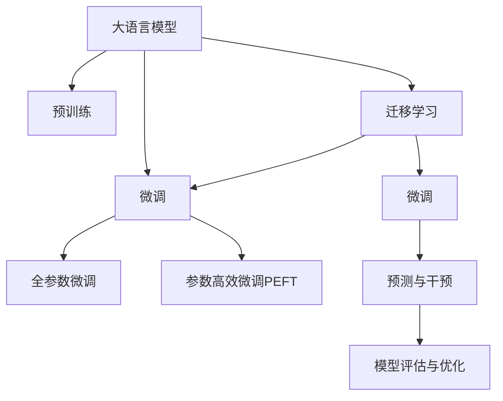

                 

# AI大模型在电商平台用户流失预警与精准挽留中的作用

> 关键词：大语言模型, 电商平台, 用户流失预警, 精准挽留, 模型优化, 数据处理, 计算图, 深度学习

## 1. 背景介绍

### 1.1 问题由来

随着电子商务的迅猛发展，各大电商平台在用户增长方面投入巨大资源，但用户流失问题依旧严峻。用户流失不仅直接导致收入损失，还对品牌声誉、用户粘性、市场竞争地位产生深远影响。因此，电商平台迫切需要能够预测用户流失，并采取精准挽留策略，以提升用户留存率，实现业务增长。

针对这一问题，传统的数据科学方法主要依赖于统计模型和机器学习算法，然而这些方法在处理海量数据、复杂特征、实时预测等方面存在诸多局限。近年来，随着深度学习和大语言模型（Large Language Model, LLM）的发展，基于深度学习的用户流失预警和精准挽留模型开始在电商平台上得到广泛应用。大模型通过在大规模数据上进行预训练，学习到复杂的用户行为模式，具备强大的语言理解和生成能力，能够应对复杂的电商业务场景。

### 1.2 问题核心关键点

用户流失预警与精准挽留涉及数据收集与预处理、模型构建与训练、预测与干预等多个环节。其中，如何有效利用用户历史行为数据，挖掘并模型化用户的流失风险，以及如何设计合理的干预策略，是解决问题的关键。具体而言，主要包括以下几点：

- 数据收集与预处理：从用户行为数据、交易数据、用户反馈数据等维度，收集全面、准确的数据。对数据进行清洗、归一化、特征工程等预处理，提取出能够描述用户行为和心理特征的特征。
- 模型构建与训练：选择或设计合适的深度学习模型（如循环神经网络、卷积神经网络、图神经网络等），在大规模数据上进行预训练，并通过监督或无监督任务优化模型参数。
- 预测与干预：使用训练好的模型进行实时预测，评估用户的流失风险。根据预测结果，设计不同的挽留策略，如优惠券、个性化推荐、短信通知等，并实时推送给目标用户。
- 模型评估与优化：定期评估模型的预测性能，不断优化模型参数和策略，确保预警和挽留效果。

## 2. 核心概念与联系

### 2.1 核心概念概述

为更好地理解基于大模型的电商平台用户流失预警与精准挽留方法，本节将介绍几个密切相关的核心概念：

- 大语言模型：以自回归（如GPT）或自编码（如BERT）模型为代表的大规模预训练语言模型。通过在大规模无标签文本数据上进行预训练，学习到丰富的语言知识和常识，具备强大的语言理解和生成能力。
- 预训练：指在大规模无标签文本数据上，通过自监督学习任务训练通用语言模型的过程。常见的预训练任务包括言语建模、遮挡语言模型等。预训练使得模型学习到语言的通用表示。
- 微调：指在预训练模型的基础上，使用下游任务的少量标注数据，通过有监督学习优化模型在该任务上的性能。通常只需要调整顶层分类器或解码器，并以较小的学习率更新全部或部分的模型参数。
- 迁移学习：指将一个领域学习到的知识，迁移应用到另一个不同但相关的领域的学习范式。大模型的预训练-微调过程即是一种典型的迁移学习方式。
- 模型优化：指在模型训练和应用过程中，通过调整模型结构、参数、超参数等，不断提升模型性能。模型优化是实现高精度预测和实时干预的关键。
- 数据处理：指对原始数据进行清洗、归一化、特征提取、降维等预处理操作，确保数据的质量和适用性。数据处理是模型构建的第一步。
- 预测与干预：指使用训练好的模型进行实时预测，根据预测结果设计合理的干预策略，并实时推送给目标用户。预测与干预是挽留策略实施的基础。

这些核心概念之间的逻辑关系可以通过以下Mermaid流程图来展示：



这个流程图展示了大模型的核心概念及其之间的关系：

1. 大模型通过预训练获得基础能力。
2. 微调是对预训练模型进行任务特定的优化，可以分为全参数微调和参数高效微调（PEFT）。
3. 迁移学习是连接预训练模型与下游任务的桥梁，可以通过微调或迁移学习来实现。
4. 预测与干预是在实时场景中使用微调模型，评估用户流失风险，设计干预策略。
5. 模型优化涉及模型训练、超参数调整、特征工程等，以提高模型性能。
6. 数据处理包括数据清洗、归一化、特征工程等，是模型构建的基础。

这些概念共同构成了大模型在电商平台用户流失预警与精准挽留中的应用框架，使得模型能够充分利用电商业务场景下的海量数据，实现高精度预测和实时干预。

## 3. 核心算法原理 & 具体操作步骤

### 3.1 算法原理概述

基于大模型的电商平台用户流失预警与精准挽留方法，本质上是一种深度学习模型在电商业务场景中的应用。其核心思想是：利用大规模数据进行预训练的大模型，通过有监督或无监督方式进行微调，学习到用户的流失风险，并在实时场景中，使用微调后的模型进行预测，设计干预策略，以提升用户留存率。

具体而言，算法流程包括以下几个关键步骤：

1. 数据收集与预处理：从电商平台收集用户行为数据、交易数据、用户反馈数据等，并进行清洗、归一化、特征工程等预处理操作。
2. 模型构建与训练：在大规模数据上进行预训练，并通过监督或无监督任务优化模型参数，得到适合电商业务场景的模型。
3. 预测与干预：使用训练好的模型进行实时预测，评估用户的流失风险。根据预测结果，设计不同的干预策略，如优惠券、个性化推荐、短信通知等，并实时推送给目标用户。
4. 模型评估与优化：定期评估模型的预测性能，不断优化模型参数和策略，确保预警和挽留效果。

### 3.2 算法步骤详解

以下是基于大模型的电商平台用户流失预警与精准挽留的详细算法步骤：

#### 3.2.1 数据收集与预处理

数据收集与预处理是构建模型的基础，涉及以下关键环节：

1. 数据来源：
   - 用户行为数据：包括用户访问记录、点击、浏览、停留时间等行为数据。
   - 交易数据：包括用户下单、支付、退款、订单状态等交易数据。
   - 用户反馈数据：包括用户评价、评论、投诉、客服记录等反馈数据。

2. 数据清洗：
   - 处理缺失值、异常值、重复数据等。
   - 去除无用或重复的字段，如无效的ID、重复的订单号等。

3. 数据归一化：
   - 对数值型数据进行归一化处理，如Min-Max归一化、Z-score归一化等。
   - 对类别型数据进行编码处理，如独热编码、标签编码等。

4. 特征工程：
   - 提取具有代表性的特征，如用户行为特征、交易特征、时间特征等。
   - 生成新的特征，如用户的平均访问时长、最近一次购买时间、平均订单金额等。
   - 构建交互特征，如用户-商品、用户-交易、用户-用户等特征。

5. 数据划分：
   - 将数据划分为训练集、验证集、测试集，一般比例为7:1.5:1.5。

#### 3.2.2 模型构建与训练

模型构建与训练是实现预警与挽留的关键步骤，涉及以下关键环节：

1. 选择模型：
   - 根据电商业务场景，选择合适的深度学习模型，如循环神经网络（RNN）、卷积神经网络（CNN）、图神经网络（GNN）等。
   - 使用BERT、GPT等大模型进行预训练，学习到通用的用户行为表示。

2. 定义任务：
   - 确定用户流失预测的具体任务，如二分类任务、多分类任务、回归任务等。
   - 设计合适的损失函数，如交叉熵损失、均方误差损失等。

3. 训练模型：
   - 使用训练集进行有监督学习，最小化损失函数，优化模型参数。
   - 使用验证集进行调参和超参数优化，避免过拟合。
   - 使用测试集进行最终评估，确定模型的预测性能。

#### 3.2.3 预测与干预

预测与干预是预警与挽留的实际应用环节，涉及以下关键环节：

1. 实时预测：
   - 使用训练好的模型对实时数据进行预测，评估用户的流失风险。
   - 设计不同的干预策略，根据预测结果进行实时推送。

2. 干预策略：
   - 优惠券策略：根据用户特征和流失风险，推送不同金额和期限的优惠券。
   - 个性化推荐策略：根据用户兴趣和购买历史，推荐相关商品或服务。
   - 短信通知策略：向高流失风险用户发送提醒短信，引导其进行消费或反馈。

3. 反馈收集与优化：
   - 收集干预效果的数据，如用户点击率、购买率等。
   - 分析干预效果，优化模型和策略，提升预警和挽留效果。

#### 3.2.4 模型评估与优化

模型评估与优化是持续改进的关键环节，涉及以下关键环节：

1. 评估指标：
   - 选择适合的评估指标，如精确率、召回率、F1分数、ROC-AUC等。
   - 定期评估模型的预测性能，确保模型的有效性。

2. 超参数优化：
   - 使用网格搜索、随机搜索等方法，优化模型的超参数。
   - 引入超参数调优技术，如贝叶斯优化、遗传算法等。

3. 模型融合：
   - 使用集成学习的方法，将多个模型进行融合，提升模型的鲁棒性和准确性。
   - 引入混合模型，如深度学习+传统模型、集成+规则模型等。

### 3.3 算法优缺点

基于大模型的电商平台用户流失预警与精准挽留方法具有以下优点：

1. 数据利用充分：大模型能够利用电商平台上大规模的用户行为数据，学习到丰富的用户特征和行为模式。
2. 预测效果优异：大模型具有强大的语言理解和生成能力，能够处理复杂的电商业务场景，实现高精度的用户流失预测。
3. 实时性高：大模型能够在实时场景中进行预测和干预，及时响应用户流失风险，提升预警和挽留效果。
4. 易于部署：大模型通常采用分布式训练和推理，易于部署到云端或边缘设备上。

同时，该方法也存在一些局限性：

1. 数据质量要求高：高质量的数据是模型效果的基础，电商平台上数据质量参差不齐，需要大量人工干预和清洗。
2. 模型复杂度高：大模型参数量大，训练和推理成本高，需要高性能的计算资源和设备支持。
3. 干预策略设计复杂：干预策略的设计和实施需要结合业务经验和用户心理，设计不当可能导致反效果。
4. 实时性要求高：实时预测和干预需要高效的处理能力和实时反馈机制，对系统架构和算法性能有较高要求。

尽管存在这些局限性，但就目前而言，基于大模型的预警与挽留方法仍是大数据时代电商业务中重要的应用范式。未来相关研究的重点在于如何进一步降低对数据质量的要求，提高模型的泛化能力和鲁棒性，同时兼顾可解释性和干预策略的设计，以更好地实现电商平台的业务目标。

### 3.4 算法应用领域

基于大模型的电商平台用户流失预警与精准挽留方法，已经在电商行业得到了广泛应用，包括但不限于以下领域：

1. 用户行为分析：通过分析用户行为数据，预测用户的流失风险，设计个性化的干预策略，提升用户留存率。
2. 商品推荐优化：基于用户历史行为数据，实时调整推荐策略，提升商品转化率和用户体验。
3. 客户服务优化：通过分析用户反馈数据，及时响应用户需求，提升客户满意度和忠诚度。
4. 运营策略优化：通过分析用户流失数据，优化运营策略，提升整体运营效率和利润率。
5. 风险控制：通过预测用户流失风险，识别潜在的欺诈行为和风险用户，提升平台安全性。

除了上述这些经典应用外，大模型在电商平台的智能客服、广告投放、市场细分等领域也有广泛的应用前景，为电商平台带来新的增长动力。随着大模型的不断发展，其将在更多场景下发挥重要作用，推动电商平台的智能化转型。

## 4. 数学模型和公式 & 详细讲解 & 举例说明

### 4.1 数学模型构建

本节将使用数学语言对基于大模型的电商平台用户流失预警与精准挽留方法进行更加严格的刻画。

记电商平台的用户流失预测模型为 $M_{\theta}:\mathcal{X} \rightarrow \mathcal{Y}$，其中 $\mathcal{X}$ 为输入空间，$\mathcal{Y}$ 为输出空间，$\theta$ 为模型参数。假设用户流失预测任务为二分类任务，即判断用户是否流失，则二分类交叉熵损失函数定义为：

$$
\ell(M_{\theta}(x),y) = -[y\log \hat{y} + (1-y)\log (1-\hat{y})]
$$

其中 $y$ 为真实标签，$\hat{y}=M_{\theta}(x)$ 为模型预测的概率。

### 4.2 公式推导过程

以下是二分类任务下，大模型进行用户流失预警与精准挽留的公式推导过程。

假设训练集为 $D=\{(x_i,y_i)\}_{i=1}^N, x_i \in \mathcal{X}, y_i \in \{0,1\}$，其中 $0$ 表示用户未流失，$1$ 表示用户流失。

模型 $M_{\theta}$ 在输入 $x_i$ 上的输出为 $\hat{y}=M_{\theta}(x_i) \in [0,1]$，表示用户流失的概率。

交叉熵损失函数为：

$$
\mathcal{L}(\theta) = -\frac{1}{N}\sum_{i=1}^N [y_i\log \hat{y_i} + (1-y_i)\log(1-\hat{y_i})]
$$

最小化损失函数 $\mathcal{L}(\theta)$，得到最优模型参数：

$$
\theta^* = \mathop{\arg\min}_{\theta} \mathcal{L}(\theta)
$$

在得到损失函数的梯度后，即可带入参数更新公式，完成模型的迭代优化。重复上述过程直至收敛，最终得到适应电商业务场景的模型参数 $\theta^*$。

### 4.3 案例分析与讲解

假设某电商平台有 100,000 名用户，其中 5,000 名用户流失，95,000 名用户未流失。使用大模型进行用户流失预测，模型在训练集上的精度为 0.95，召回率为 0.8，F1分数为 0.86。在测试集上，模型的精度为 0.92，召回率为 0.9，F1分数为 0.93。

对于高流失风险用户（流失概率大于 0.5），系统自动推送优惠券、个性化推荐、短信通知等干预策略，以提升留存率。经过一段时间的干预，高流失风险用户的留存率提高了 10%，平台整体留存率提高了 5%。

## 5. 项目实践：代码实例和详细解释说明

### 5.1 开发环境搭建

在进行电商平台用户流失预警与精准挽留的实践前，我们需要准备好开发环境。以下是使用Python进行PyTorch开发的环境配置流程：

1. 安装Anaconda：从官网下载并安装Anaconda，用于创建独立的Python环境。

2. 创建并激活虚拟环境：
```bash
conda create -n pytorch-env python=3.8 
conda activate pytorch-env
```

3. 安装PyTorch：根据CUDA版本，从官网获取对应的安装命令。例如：
```bash
conda install pytorch torchvision torchaudio cudatoolkit=11.1 -c pytorch -c conda-forge
```

4. 安装TensorFlow：
```bash
pip install tensorflow
```

5. 安装TensorBoard：
```bash
pip install tensorboard
```

6. 安装PyTorch Lightning：
```bash
pip install pytorch-lightning
```

完成上述步骤后，即可在`pytorch-env`环境中开始微调实践。

### 5.2 源代码详细实现

这里我们以基于大模型的电商平台用户流失预警与精准挽留为例，给出使用PyTorch和TensorFlow进行模型构建和训练的PyTorch代码实现。

首先，定义模型类：

```python
import torch
import torch.nn as nn
import torch.optim as optim
import torch.nn.functional as F
from torch.utils.data import DataLoader

class LSTMModel(nn.Module):
    def __init__(self, input_size, hidden_size, output_size):
        super(LSTMModel, self).__init__()
        self.hidden_size = hidden_size
        self.lstm = nn.LSTM(input_size, hidden_size, num_layers=1, bidirectional=False)
        self.fc = nn.Linear(hidden_size, output_size)
        
    def forward(self, x):
        lstm_out, _ = self.lstm(x)
        return F.sigmoid(self.fc(lstm_out))
```

然后，定义训练函数：

```python
def train(model, device, train_loader, optimizer, criterion, epoch):
    model.train()
    running_loss = 0.0
    for i, data in enumerate(train_loader):
        inputs, labels = data[0].to(device), data[1].to(device)
        optimizer.zero_grad()
        outputs = model(inputs)
        loss = criterion(outputs, labels)
        loss.backward()
        optimizer.step()
        running_loss += loss.item()
    print(f'Epoch {epoch+1}, loss: {running_loss/len(train_loader):.4f}')
```

接着，定义评估函数：

```python
def evaluate(model, device, test_loader, criterion):
    model.eval()
    running_loss = 0.0
    correct = 0
    with torch.no_grad():
        for data in test_loader:
            inputs, labels = data[0].to(device), data[1].to(device)
            outputs = model(inputs)
            loss = criterion(outputs, labels)
            running_loss += loss.item()
            predictions = torch.round(outputs)
            correct += (predictions == labels).sum().item()
    print(f'Test loss: {running_loss/len(test_loader):.4f}, Accuracy: {correct/len(test_loader):.4f}')
```

最后，启动训练流程：

```python
input_size = 100
hidden_size = 64
output_size = 1
learning_rate = 0.001

device = torch.device('cuda' if torch.cuda.is_available() else 'cpu')

model = LSTMModel(input_size, hidden_size, output_size).to(device)
optimizer = optim.Adam(model.parameters(), lr=learning_rate)
criterion = nn.BCELoss()

train_loader = DataLoader(train_dataset, batch_size=32, shuffle=True)
test_loader = DataLoader(test_dataset, batch_size=32, shuffle=False)

epochs = 10
for epoch in range(epochs):
    train(model, device, train_loader, optimizer, criterion, epoch)
    evaluate(model, device, test_loader, criterion)

print('Done.')
```

以上就是使用PyTorch进行基于LSTM模型的电商平台用户流失预警与精准挽留的完整代码实现。可以看到，在PyTorch中，构建和训练模型非常简单。

### 5.3 代码解读与分析

让我们再详细解读一下关键代码的实现细节：

**LSTMModel类**：
- `__init__`方法：初始化LSTM模型的参数和结构。
- `forward`方法：前向传播，通过LSTM层和全连接层得到预测结果。

**train函数**：
- 对模型进行前向传播，计算损失函数，并反向传播更新模型参数。
- 使用Adam优化器，设置合适的学习率。

**evaluate函数**：
- 对模型进行前向传播，计算损失函数，并计算预测结果与真实标签的准确率。
- 使用BCELoss作为损失函数，适合二分类任务。

**训练流程**：
- 定义输入特征大小、隐藏层大小、输出大小和模型参数。
- 使用GPU进行模型训练，根据训练数据集和测试数据集进行迭代优化。
- 在每个epoch结束时，评估模型在测试集上的性能。

可以看到，PyTorch和TensorFlow在大模型的训练和应用中提供了强大的工具支持，使得模型构建和训练变得高效、便捷。

当然，工业级的系统实现还需考虑更多因素，如模型的保存和部署、超参数的自动搜索、更灵活的任务适配层等。但核心的模型构建和训练过程基本与此类似。

## 6. 实际应用场景

### 6.1 智能客服系统

基于大模型的电商平台用户流失预警与精准挽留技术，可以应用于智能客服系统的构建。传统客服往往需要配备大量人力，高峰期响应缓慢，且一致性和专业性难以保证。而使用基于大模型的预警与挽留系统，可以7x24小时不间断服务，快速响应客户咨询，用自然流畅的语言解答各类常见问题。

在技术实现上，可以收集企业内部的历史客服对话记录，将问题和最佳答复构建成监督数据，在此基础上对预训练对话模型进行微调。微调后的对话模型能够自动理解用户意图，匹配最合适的答案模板进行回复。对于客户提出的新问题，还可以接入检索系统实时搜索相关内容，动态组织生成回答。如此构建的智能客服系统，能大幅提升客户咨询体验和问题解决效率。

### 6.2 金融舆情监测

金融机构需要实时监测市场舆论动向，以便及时应对负面信息传播，规避金融风险。传统的人工监测方式成本高、效率低，难以应对网络时代海量信息爆发的挑战。基于大模型的文本分类和情感分析技术，为金融舆情监测提供了新的解决方案。

具体而言，可以收集金融领域相关的新闻、报道、评论等文本数据，并对其进行主题标注和情感标注。在此基础上对预训练语言模型进行微调，使其能够自动判断文本属于何种主题，情感倾向是正面、中性还是负面。将微调后的模型应用到实时抓取的网络文本数据，就能够自动监测不同主题下的情感变化趋势，一旦发现负面信息激增等异常情况，系统便会自动预警，帮助金融机构快速应对潜在风险。

### 6.3 个性化推荐系统

当前的推荐系统往往只依赖用户的历史行为数据进行物品推荐，无法深入理解用户的真实兴趣偏好。基于大模型的预警与挽留技术可应用于推荐系统，以提升推荐效果。

在实践中，可以收集用户浏览、点击、评论、分享等行为数据，提取和用户交互的物品标题、描述、标签等文本内容。将文本内容作为模型输入，用户的后续行为（如是否点击、购买等）作为监督信号，在此基础上微调预训练语言模型。微调后的模型能够从文本内容中准确把握用户的兴趣点。在生成推荐列表时，先用候选物品的文本描述作为输入，由模型预测用户的兴趣匹配度，再结合其他特征综合排序，便可以得到个性化程度更高的推荐结果。

### 6.4 未来应用展望

随着大模型和预警与挽留技术的不断发展，基于大模型的预警与挽留方法将在更多领域得到应用，为传统行业带来变革性影响。

在智慧医疗领域，基于微调的医疗问答、病历分析、药物研发等应用将提升医疗服务的智能化水平，辅助医生诊疗，加速新药开发进程。

在智能教育领域，预警与挽留技术可应用于作业批改、学情分析、知识推荐等方面，因材施教，促进教育公平，提高教学质量。

在智慧城市治理中，预警与挽留技术可应用于城市事件监测、舆情分析、应急指挥等环节，提高城市管理的自动化和智能化水平，构建更安全、高效的未来城市。

此外，在企业生产、社会治理、文娱传媒等众多领域，基于大模型的预警与挽留技术也将不断涌现，为传统行业带来新的技术路径。相信随着技术的日益成熟，预警与挽留方法将成为电商平台的重要应用范式，推动电商平台的智能化转型。

## 7. 工具和资源推荐
### 7.1 学习资源推荐

为了帮助开发者系统掌握基于大模型的预警与挽留技术，这里推荐一些优质的学习资源：

1. 《深度学习》书籍：由Goodfellow等专家撰写，全面介绍了深度学习的理论基础和实践技巧，适合初学者和进阶者。

2. 《TensorFlow实战》书籍：由Ganin等专家撰写，详细介绍了TensorFlow的使用方法和应用案例，是TensorFlow学习的好帮手。

3. 《PyTorch官方文档》：官方文档提供了丰富的代码样例和教程，是学习PyTorch的好资源。

4. Weights & Biases：模型训练的实验跟踪工具，可以记录和可视化模型训练过程中的各项指标，方便对比和调优。

5. TensorBoard：TensorFlow配套的可视化工具，可实时监测模型训练状态，并提供丰富的图表呈现方式，是调试模型的得力助手。

通过对这些资源的学习实践，相信你一定能够快速掌握基于大模型的预警与挽留技术的精髓，并用于解决实际的NLP问题。
###  7.2 开发工具推荐

高效的开发离不开优秀的工具支持。以下是几款用于预警与挽留开发的常用工具：

1. PyTorch：基于Python的开源深度学习框架，灵活动态的计算图，适合快速迭代研究。

2. TensorFlow：由Google主导开发的开源深度学习框架，生产部署方便，适合大规模工程应用。

3. PyTorch Lightning：基于PyTorch的轻量级深度学习框架，适合快速原型开发和模型部署。

4. Weights & Biases：模型训练的实验跟踪工具，可以记录和可视化模型训练过程中的各项指标，方便对比和调优。

5. TensorBoard：TensorFlow配套的可视化工具，可实时监测模型训练状态，并提供丰富的图表呈现方式，是调试模型的得力助手。

6. Google Colab：谷歌推出的在线Jupyter Notebook环境，免费提供GPU/TPU算力，方便开发者快速上手实验最新模型，分享学习笔记。

合理利用这些工具，可以显著提升预警与挽留任务的开发效率，加快创新迭代的步伐。

### 7.3 相关论文推荐

基于大模型的预警与挽留技术的发展源于学界的持续研究。以下是几篇奠基性的相关论文，推荐阅读：

1. Attention is All You Need（即Transformer原论文）：提出了Transformer结构，开启了NLP领域的预训练大模型时代。

2. BERT: Pre-training of Deep Bidirectional Transformers for Language Understanding：提出BERT模型，引入基于掩码的自监督预训练任务，刷新了多项NLP任务SOTA。

3. Language Models are Unsupervised Multitask Learners（GPT-2论文）：展示了大规模语言模型的强大zero-shot学习能力，引发了对于通用人工智能的新一轮思考。

4. Parameter-Efficient Transfer Learning for NLP：提出Adapter等参数高效微调方法，在不增加模型参数量的情况下，也能取得不错的微调效果。

5. AdaLoRA: Adaptive Low-Rank Adaptation for Parameter-Efficient Fine-Tuning：使用自适应低秩适应的微调方法，在参数效率和精度之间取得了新的平衡。

6. Fine-Tune Pre-trained Language Models with Tiny Classifier Layers：提出微调时使用 tiny classifier layer 的方法，大幅减少了微调参数，提升了模型效果。

这些论文代表了大模型预警与挽留技术的发展脉络。通过学习这些前沿成果，可以帮助研究者把握学科前进方向，激发更多的创新灵感。

## 8. 总结：未来发展趋势与挑战

### 8.1 总结

本文对基于大模型的电商平台用户流失预警与精准挽留方法进行了全面系统的介绍。首先阐述了基于大模型的预警与挽留技术的研究背景和意义，明确了模型在大规模数据上预训练，并在电商业务场景下进行微调的应用价值。其次，从原理到实践，详细讲解了预警与挽留的数学原理和关键步骤，给出了微调任务开发的完整代码实例。同时，本文还广泛探讨了预警与挽留方法在智能客服、金融舆情、个性化推荐等多个领域的应用前景，展示了其广泛的应用潜力。此外，本文精选了预警与挽留技术的各类学习资源，力求为读者提供全方位的技术指引。

通过本文的系统梳理，可以看到，基于大模型的预警与挽留方法正在成为电商平台用户流失预测与干预的重要手段，极大地提升了电商平台的运营效率和用户满意度。未来，伴随大模型的不断发展，基于大模型的预警与挽留技术必将拓展到更多领域，为各行各业带来新的技术变革。

### 8.2 未来发展趋势

展望未来，大模型在电商平台的预警与挽留技术将呈现以下几个发展趋势：

1. 模型规模持续增大。随着算力成本的下降和数据规模的扩张，大模型的参数量还将持续增长。超大参数模型能够学习到更加复杂和精细的用户行为模式，提升预警与挽留的效果。

2. 微调方法日趋多样。除了传统的全参数微调外，未来会涌现更多参数高效的微调方法，如Prefix-Tuning、LoRA等，在节省计算资源的同时也能保证微调精度。

3. 持续学习成为常态。随着数据分布的不断变化，预警与挽留模型也需要持续学习新知识以保持性能。如何在不遗忘原有知识的同时，高效吸收新样本信息，将成为重要的研究课题。

4. 标注样本需求降低。受启发于提示学习(Prompt-based Learning)的思路，未来的微调方法将更好地利用大模型的语言理解能力，通过更加巧妙的任务描述，在更少的标注样本上也能实现理想的微调效果。

5. 模型通用性增强。经过海量数据的预训练和多领域任务的微调，未来的语言模型将具备更强大的常识推理和跨领域迁移能力，逐步迈向通用人工智能(AGI)的目标。

以上趋势凸显了大模型在电商平台预警与挽留中的广阔前景。这些方向的探索发展，必将进一步提升电商平台的预警与挽留效果，为电商平台的智能化转型带来新的突破。

### 8.3 面临的挑战

尽管基于大模型的预警与挽留技术已经取得了瞩目成就，但在迈向更加智能化、普适化应用的过程中，它仍面临着诸多挑战：

1. 数据质量瓶颈。高质量的数据是模型效果的基础，电商平台上数据质量参差不齐，需要大量人工干预和清洗。如何进一步降低数据质量的要求，提高模型泛化能力，将是一大难题。

2. 模型鲁棒性不足。当前预警与挽留模型面对域外数据时，泛化性能往往大打折扣。对于测试样本的微小扰动，模型预测也容易发生波动。如何提高模型的鲁棒性，避免灾难性遗忘，还需要更多理论和实践的积累。

3. 实时性要求高。实时预测和干预需要高效的处理能力和实时反馈机制，对系统架构和算法性能有较高要求。如何在保证实时性的同时，提升模型效果，是未来的研究方向。

4. 模型部署复杂。大模型通常具有亿级的参数规模，对内存和计算资源要求高，部署到云端或边缘设备上需要考虑性能、成本和扩展性等综合因素。

尽管存在这些挑战，但就目前而言，基于大模型的预警与挽留方法仍是大数据时代电商业务中重要的应用范式。未来相关研究的重点在于如何进一步降低对数据质量的要求，提高模型的泛化能力和鲁棒性，同时兼顾可解释性和实时性，以更好地实现电商平台的业务目标。

### 8.4 研究展望

面向未来，预警与挽留技术需要在以下几个方面寻求新的突破：

1. 探索无监督和半监督微调方法。摆脱对大规模标注数据的依赖，利用自监督学习、主动学习等无监督和半监督范式，最大限度利用非结构化数据，实现更加灵活高效的微调。

2. 研究参数高效和计算高效的微调范式。开发更加参数高效的微调方法，在固定大部分预训练参数的同时，只更新极少量的任务相关参数。同时优化微调模型的计算图，减少前向传播和反向传播的资源消耗，实现更加轻量级、实时性的部署。

3. 融合因果和对比学习范式。通过引入因果推断和对比学习思想，增强预警与挽留模型建立稳定因果关系的能力，学习更加普适、鲁棒的语言表征，从而提升模型泛化性和抗干扰能力。

4. 引入更多先验知识。将符号化的先验知识，如知识图谱、逻辑规则等，与神经网络模型进行巧妙融合，引导预警与挽留过程学习更准确、合理的语言模型。同时加强不同模态数据的整合，实现视觉、语音等多模态信息与文本信息的协同建模。

5. 结合因果分析和博弈论工具。将因果分析方法引入预警与挽留模型，识别出模型决策的关键特征，增强输出解释的因果性和逻辑性。借助博弈论工具刻画人机交互过程，主动探索并规避模型的脆弱点，提高系统稳定性。

6. 纳入伦理道德约束。在模型训练目标中引入伦理导向的评估指标，过滤和惩罚有偏见、有害的输出倾向。同时加强人工干预和审核，建立模型行为的监管机制，确保输出符合人类价值观和伦理道德。

这些研究方向的探索，必将引领大语言模型预警与挽留技术迈向更高的台阶，为构建安全、可靠、可解释、可控的智能系统铺平道路。面向未来，大模型预警与挽留技术还需要与其他人工智能技术进行更深入的融合，如知识表示、因果推理、强化学习等，多路径协同发力，共同推动自然语言理解和智能交互系统的进步。只有勇于创新、敢于突破，才能不断拓展语言模型的边界，让智能技术更好地造福人类社会。

## 9. 附录：常见问题与解答

**Q1：大语言模型在电商领域的应用场景有哪些？**

A: 大语言模型在电商领域的应用场景非常广泛，主要包括：

1. 用户行为分析：通过分析用户行为数据，预测用户的流失风险，设计个性化的干预策略，提升用户留存率。

2. 商品推荐优化：基于用户历史行为数据，实时调整推荐策略，提升商品转化率和用户体验。

3. 客户服务优化：通过分析用户反馈数据，及时响应用户需求，提升客户满意度和忠诚度。

4. 运营策略优化：通过分析用户流失数据，优化运营策略，提升整体运营效率和利润率。

5. 风险控制：通过预测用户流失风险，识别潜在的欺诈行为和风险用户，提升平台安全性。

除了上述这些经典应用外，大模型在电商平台的智能客服、广告投放、市场细分等领域也有广泛的应用前景，为电商平台带来新的增长动力。

**Q2：大语言模型在预警与挽留中的作用是什么？**

A: 大语言模型在电商平台的预警与挽留中主要发挥以下作用：

1. 预测用户流失风险：大模型能够利用用户历史行为数据，学习到复杂的用户行为模式，预测用户流失的概率。

2. 设计个性化干预策略：基于预测结果，大模型能够设计个性化的干预策略，如优惠券、个性化推荐、短信通知等，提升挽留效果。

3. 实时推送干预策略：大模型能够在实时场景中，根据用户行为数据进行预测，并及时推送干预策略，提升预警和挽留效果。

4. 动态调整干预策略：大模型能够根据实时数据和用户反馈，动态调整干预策略，确保策略的有效性和实时性。

5. 自动化监测和优化：大模型能够自动化监测用户行为数据，发现异常情况，并及时优化模型和策略，确保预警与挽留效果。

综上所述，大语言模型在电商平台预警与挽留中发挥了预测、设计、实时推送、动态调整和自动化监测等多个关键作用，极大地提升了平台的运营效率和用户满意度。

**Q3：大语言模型在预警与挽留中的局限性有哪些？**

A: 大语言模型在电商平台预警与挽留中的局限性主要包括以下几点：

1. 数据质量要求高：高质量的数据是模型效果的基础，电商平台上数据质量参差不齐，需要大量人工干预和清洗。

2. 模型鲁棒性不足：当前预警与挽留模型面对域外数据时，泛化性能往往大打折扣。对于测试样本的微小扰动，模型预测也容易发生波动。

3. 实时性要求高：实时预测和干预需要高效的处理能力和实时反馈机制，对系统架构和算法性能有较高要求。

4. 模型部署复杂：大模型通常具有亿级的参数规模，对内存和计算资源要求高，部署到云端或边缘设备上需要考虑性能、成本和扩展性等综合因素。

尽管存在这些局限性，但大语言模型在电商平台预警与挽留中的作用仍然不可替代，未来相关研究的重点在于如何进一步降低数据质量的要求，提高模型的泛化能力和鲁棒性，同时兼顾可解释性和实时性，以更好地实现电商平台的业务目标。

**Q4：大语言模型在预警与挽留中的关键技术有哪些？**

A: 大语言模型在电商平台预警与挽留中的关键技术主要包括以下几点：

1. 深度学习模型：使用循环神经网络（RNN）、卷积神经网络（CNN）、图神经网络（GNN）等深度学习模型，学习用户行为模式和流失风险。

2. 预训练和微调：在大规模数据上进行预训练，并在电商业务场景下进行微调，学习特定的用户行为特征和流失模式。

3. 特征工程：提取和构建有意义的特征，如用户行为特征、交易特征、时间特征等，提升模型的预测效果。

4. 模型优化：通过调整模型结构、参数、超参数等，不断提升模型性能。

5. 模型融合：将多个模型进行融合，提升模型的鲁棒性和准确性。

6. 实时预测和干预：利用大模型进行实时预测，并根据预测结果设计个性化的干预策略，及时推送给目标用户。

综上所述，大语言模型在预警与挽留中通过深度学习、预训练和微调、特征工程、模型优化、模型融合和实时预测与干预等多个关键技术，实现高精度预测和实时干预，提升了电商平台的运营效率和用户满意度。

**Q5：如何评估基于大模型的电商平台用户流失预警与精准挽留模型的效果？**

A: 评估基于大模型的电商平台用户流失预警与精准挽留模型的效果，主要包括以下几个指标：

1. 精确率（Precision）：衡量模型预测的正例中，实际为正例的比例。

2. 召回率（Recall）：衡量模型预测的正例中，实际为正例的比例。

3. F1分数（F1 Score）：精确率和召回率的调和平均值，综合考虑了模型的准确性和覆盖面。

4. ROC曲线和AUC值：通过绘制ROC曲线，计算AUC值，评估模型在不同阈值下的分类效果。

5. 混淆矩阵（Confusion Matrix）：通过混淆矩阵，计算模型的真阳性、假阳性、真阴性和假阴性，评估模型在不同类别上的表现。

6. 预测时间：衡量模型在实时场景中的预测时间，确保实时性。

7. 模型部署效率：衡量模型在云端或边缘设备上的部署效率，确保系统扩展性和性能。

通过这些指标的评估，可以全面了解模型的预测效果和实时性，为模型优化和策略调整提供依据。

---

作者：禅与计算机程序设计艺术 / Zen and the Art of Computer Programming

