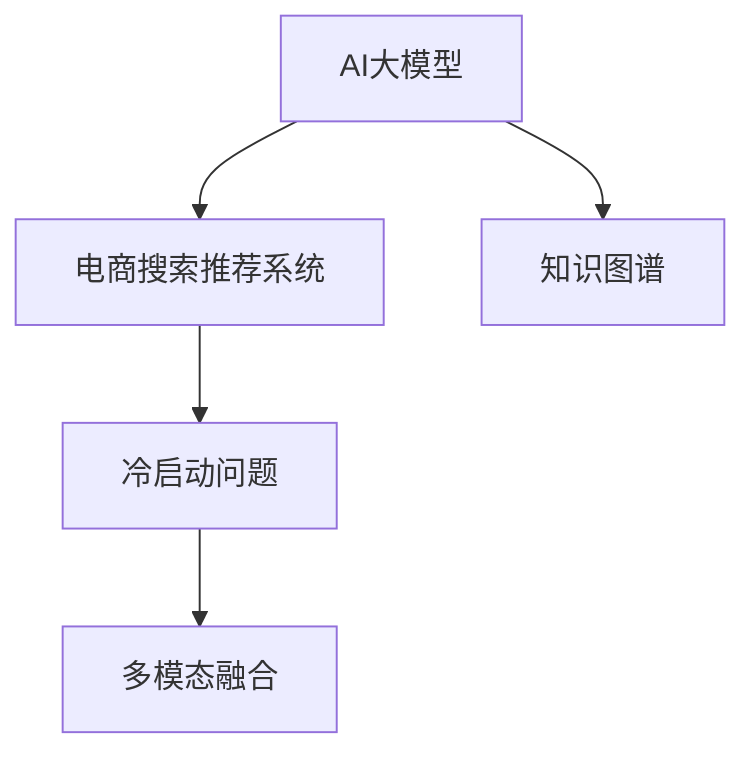

                 

# AI大模型赋能电商搜索推荐的冷启动问题解决方案

在电商搜索推荐系统中，冷启动是一个常见且关键的问题。尤其是对于新商品或新用户，由于缺乏足够的交互历史数据，推荐系统的性能往往难以保证。本文将详细探讨AI大模型在电商搜索推荐冷启动问题中的解决方案，通过构建和优化搜索推荐模型，帮助电商企业解决冷启动带来的挑战。

## 1. 背景介绍

### 1.1 问题由来
电商搜索推荐系统的核心目标是提高用户满意度并提升销售额。传统的推荐系统通常基于协同过滤、内容基推荐等算法，依赖于用户行为数据和商品特征信息。然而，对于新商品和新用户，由于缺乏足够的数据，推荐系统的表现通常不佳，难以提供有价值的推荐。

### 1.2 问题核心关键点
冷启动问题主要集中在以下两个方面：
1. **新商品推荐**：由于新商品没有历史购买记录，无法利用协同过滤等基于历史交互的算法进行推荐。
2. **新用户推荐**：新用户没有过往行为数据，无法进行个性化推荐，只能进行粗粒度的商品推荐。

解决冷启动问题，一方面需要丰富的商品知识图谱，另一方面需要高效且灵活的推荐算法。AI大模型由于其强大的语言理解和生成能力，成为解决冷启动问题的有力工具。

## 2. 核心概念与联系

### 2.1 核心概念概述

为更好地理解AI大模型在电商搜索推荐中的作用，本节将介绍几个关键概念：

- **AI大模型**：以深度学习为基础，通过大规模数据训练得到的通用模型，具备强大的语言理解和生成能力。
- **电商搜索推荐系统**：根据用户搜索历史、浏览行为、评分反馈等数据，推荐符合用户需求的商品的电商应用系统。
- **冷启动问题**：新商品或新用户由于缺乏足够的历史数据，导致推荐系统无法提供准确推荐的问题。
- **知识图谱**：将商品、用户、属性等实体以及它们之间的关系表示为图形结构，便于模型理解和推理。
- **多模态融合**：将文本、图像、音频等多种信息进行融合，提高推荐系统的全面性和准确性。

这些核心概念之间的逻辑关系可以通过以下Mermaid流程图来展示：



这个流程图展示了大模型在电商推荐系统中的核心作用：

1. 大模型通过学习大规模无标签数据，获得强大的语言理解和生成能力。
2. 电商推荐系统通过大模型的知识图谱和推荐算法，解决冷启动问题，提升推荐效果。
3. 多模态融合技术进一步丰富了推荐内容，提高了推荐的全面性。

## 3. 核心算法原理 & 具体操作步骤
### 3.1 算法原理概述

AI大模型赋能电商搜索推荐的冷启动解决方案，主要基于以下算法原理：

1. **预训练模型嵌入商品和用户表示**：使用大模型对商品和用户进行预训练，学习到低维度的语义表示，便于后续的推荐计算。
2. **知识图谱嵌入融合**：将商品和用户的关系通过知识图谱嵌入融合，提升推荐的相关性。
3. **多模态信息融合**：利用大模型的多模态能力，将商品描述、图片、评分等不同模态的信息融合，提高推荐的准确性和全面性。
4. **个性化推荐模型**：通过多维度的用户特征和商品属性，训练个性化推荐模型，提升推荐的个性化程度。
5. **在线学习与持续优化**：在推荐过程中，不断收集用户反馈和行为数据，进行在线学习和模型优化，提升推荐的实效性。

### 3.2 算法步骤详解

**Step 1: 准备预训练模型和数据集**
- 选择合适的预训练语言模型，如BERT、GPT等，作为初始化参数。
- 准备电商搜索推荐系统的商品和用户数据集，包括商品名称、描述、类别、价格、评分等。
- 准备知识图谱，描述商品之间的关联关系。

**Step 2: 商品和用户嵌入表示**
- 使用大模型对商品和用户进行预训练，学习到低维度的语义表示。
- 利用Embedding矩阵，将商品和用户表示为向量形式，便于后续的推荐计算。

**Step 3: 知识图谱嵌入融合**
- 对知识图谱中的关系进行嵌入表示，学习到实体间的关系表示。
- 将商品和用户的关系表示进行融合，提升推荐的相关性。

**Step 4: 多模态信息融合**
- 将商品描述、图片、评分等不同模态的信息作为输入，使用大模型进行多模态融合。
- 利用融合后的多模态表示，提升推荐的准确性和全面性。

**Step 5: 个性化推荐模型训练**
- 根据用户的历史行为数据和商品特征，训练个性化推荐模型。
- 将预训练商品和用户嵌入表示、知识图谱嵌入融合、多模态信息融合等结果作为输入，进行推荐计算。

**Step 6: 在线学习与持续优化**
- 在推荐过程中，不断收集用户反馈和行为数据。
- 利用收集的数据进行在线学习，调整模型参数，提升推荐效果。

### 3.3 算法优缺点

使用AI大模型解决电商搜索推荐冷启动问题的算法具有以下优点：

1. **通用性**：大模型可以学习通用的语言知识，适用于不同类型的电商应用场景。
2. **灵活性**：大模型支持多模态融合，可以融合多种信息提升推荐效果。
3. **高效性**：大模型预训练后，嵌入表示和关系表示可以在推荐过程中高效计算，提升推荐速度。
4. **可扩展性**：大模型可以适应不同规模的数据集，具有较好的可扩展性。

同时，该算法也存在一些局限性：

1. **数据需求高**：大模型需要大规模无标签数据进行预训练，对于电商搜索推荐系统，数据收集成本较高。
2. **模型复杂度**：大模型的训练和推理计算复杂度高，对于实时性要求高的应用场景，可能需要额外优化。
3. **知识图谱构建**：知识图谱的构建和维护需要较多资源，对于电商企业而言，构建和维护知识图谱的成本较高。

尽管存在这些局限性，但就目前而言，AI大模型在电商搜索推荐冷启动问题中展现出了强大的潜力，通过合理的模型设计和算法优化，可以显著提升推荐效果。

### 3.4 算法应用领域

AI大模型赋能电商搜索推荐的冷启动解决方案，主要应用于以下领域：

1. **商品推荐**：通过大模型对商品进行预训练，生成商品嵌入表示，并进行多模态融合和个性化推荐，提高推荐的相关性和个性化程度。
2. **用户推荐**：利用大模型对用户进行预训练，生成用户嵌入表示，并结合知识图谱嵌入融合和个性化推荐模型，提升推荐的个性化程度。
3. **新商品推荐**：对于新商品，利用大模型生成嵌入表示，并进行多模态融合和关系嵌入融合，提高推荐的准确性。
4. **新用户推荐**：对于新用户，利用大模型生成用户嵌入表示，结合知识图谱嵌入融合和个性化推荐模型，提高推荐的个性化程度。

除了以上应用领域，AI大模型还可以应用于电商系统的其他环节，如智能客服、价格优化、库存管理等，为电商企业提供全面的智能解决方案。

## 4. 数学模型和公式 & 详细讲解  
### 4.1 数学模型构建

在本节中，我们将使用数学语言对AI大模型在电商搜索推荐中的应用进行更严格的描述。

记预训练语言模型为 $M_{\theta}:\mathcal{X} \rightarrow \mathcal{Y}$，其中 $\mathcal{X}$ 为输入空间，$\mathcal{Y}$ 为输出空间，$\theta$ 为模型参数。

设电商搜索推荐系统的商品集合为 $S=\{s_i\}_{i=1}^N$，用户集合为 $U=\{u_j\}_{j=1}^M$，知识图谱中的商品关系为 $R=\{(r_{ij})\}_{i,j=1}^N$。

**商品嵌入表示**：使用大模型对商品 $s_i$ 进行预训练，得到低维度的语义表示 $v_i \in \mathbb{R}^d$，其中 $d$ 为嵌入向量的维度。

**用户嵌入表示**：使用大模型对用户 $u_j$ 进行预训练，得到低维度的语义表示 $u_j \in \mathbb{R}^d$。

**知识图谱嵌入表示**：对知识图谱中的关系进行嵌入表示，得到关系嵌入向量 $r_{ij} \in \mathbb{R}^d$。

**多模态信息融合**：将商品描述、图片、评分等不同模态的信息 $x_{ij}$ 作为输入，使用大模型进行多模态融合，得到综合表示 $x^*_{ij}$。

**个性化推荐模型**：将用户嵌入表示 $u_j$ 和商品嵌入表示 $v_i$，结合知识图谱嵌入融合 $r_{ij}$，以及多模态信息融合 $x^*_{ij}$，输入到推荐模型中，得到推荐分数 $p_{ij}$。

推荐模型可以是一个简单的线性回归模型，也可以是一个深度神经网络，具体选择取决于任务需求和数据复杂度。

### 4.2 公式推导过程

以下我们将对上述公式进行详细的推导，以确保理解的完整性和准确性。

**商品嵌入表示**：

假设大模型对商品 $s_i$ 进行预训练，得到低维度的语义表示 $v_i \in \mathbb{R}^d$。则商品嵌入表示可以通过以下公式计算：

$$
v_i = M_{\theta}(s_i)
$$

**用户嵌入表示**：

假设大模型对用户 $u_j$ 进行预训练，得到低维度的语义表示 $u_j \in \mathbb{R}^d$。则用户嵌入表示可以通过以下公式计算：

$$
u_j = M_{\theta}(u_j)
$$

**知识图谱嵌入表示**：

假设知识图谱中的关系 $r_{ij}$ 可以通过以下公式进行嵌入表示：

$$
r_{ij} = M_{\theta}(r_{ij})
$$

**多模态信息融合**：

假设将商品描述、图片、评分等不同模态的信息 $x_{ij}$ 作为输入，使用大模型进行多模态融合，得到综合表示 $x^*_{ij}$。则多模态信息融合可以通过以下公式计算：

$$
x^*_{ij} = M_{\theta}(x_{ij})
$$

**个性化推荐模型**：

假设将用户嵌入表示 $u_j$ 和商品嵌入表示 $v_i$，结合知识图谱嵌入融合 $r_{ij}$，以及多模态信息融合 $x^*_{ij}$，输入到推荐模型中，得到推荐分数 $p_{ij}$。则个性化推荐模型可以通过以下公式计算：

$$
p_{ij} = f(u_j, v_i, r_{ij}, x^*_{ij})
$$

其中 $f$ 为一个推荐函数，可以是简单的线性回归模型，也可以是深度神经网络。

### 4.3 案例分析与讲解

为了更深入地理解这些公式的应用，我们可以以一个具体的电商推荐案例进行分析：

假设某电商平台需要为用户推荐商品，已知商品 $s_i$ 的描述为 $d_i$，图片为 $p_i$，价格为 $p_i$，评分 $r_i$，用户 $u_j$ 的历史行为数据为 $h_j$。

1. **商品嵌入表示**：使用大模型对商品 $s_i$ 进行预训练，得到低维度的语义表示 $v_i \in \mathbb{R}^d$。
2. **用户嵌入表示**：使用大模型对用户 $u_j$ 进行预训练，得到低维度的语义表示 $u_j \in \mathbb{R}^d$。
3. **知识图谱嵌入表示**：对知识图谱中的关系 $r_{ij}$ 进行嵌入表示，得到关系嵌入向量 $r_{ij} \in \mathbb{R}^d$。
4. **多模态信息融合**：将商品描述 $d_i$、图片 $p_i$、评分 $r_i$ 作为输入，使用大模型进行多模态融合，得到综合表示 $x^*_{ij}$。
5. **个性化推荐模型**：将用户嵌入表示 $u_j$ 和商品嵌入表示 $v_i$，结合知识图谱嵌入融合 $r_{ij}$，以及多模态信息融合 $x^*_{ij}$，输入到推荐模型中，得到推荐分数 $p_{ij}$。

通过这种方式，电商推荐系统可以充分利用大模型的语言理解和生成能力，对商品和用户进行全面而精准的建模，从而提升推荐效果。

## 5. 项目实践：代码实例和详细解释说明
### 5.1 开发环境搭建

在进行电商推荐系统开发前，我们需要准备好开发环境。以下是使用Python进行TensorFlow开发的环境配置流程：

1. 安装Anaconda：从官网下载并安装Anaconda，用于创建独立的Python环境。

2. 创建并激活虚拟环境：
```bash
conda create -n tf-env python=3.8 
conda activate tf-env
```

3. 安装TensorFlow：根据GPU版本，从官网获取对应的安装命令。例如：
```bash
conda install tensorflow==2.6 -c tf -c conda-forge
```

4. 安装TensorBoard：
```bash
pip install tensorboard
```

5. 安装Flask：
```bash
pip install flask
```

6. 安装Pandas：
```bash
pip install pandas
```

完成上述步骤后，即可在`tf-env`环境中开始电商推荐系统开发。

### 5.2 源代码详细实现

下面我们以电商平台商品推荐为例，给出使用TensorFlow进行模型训练和推理的PyTorch代码实现。

首先，定义模型和优化器：

```python
import tensorflow as tf
from tensorflow.keras.layers import Input, Dense, Embedding, Concatenate, Flatten
from tensorflow.keras.models import Model

# 定义输入层
user_input = Input(shape=(1,), name='user_input')
item_input = Input(shape=(1,), name='item_input')
price_input = Input(shape=(1,), name='price_input')
description_input = Input(shape=(1,), name='description_input')
rating_input = Input(shape=(1,), name='rating_input')

# 定义用户嵌入层
user_embedding = Embedding(input_dim=vocab_size, output_dim=embedding_dim, name='user_embedding')(user_input)
user_embedding = Flatten()(user_embedding)

# 定义商品嵌入层
item_embedding = Embedding(input_dim=vocab_size, output_dim=embedding_dim, name='item_embedding')(item_input)
item_embedding = Flatten()(item_embedding)

# 定义价格层
price_embedding = Dense(embedding_dim, activation='relu')(price_input)

# 定义描述层
description_embedding = Dense(embedding_dim, activation='relu')(description_input)

# 定义评分层
rating_embedding = Dense(embedding_dim, activation='relu')(rating_input)

# 定义多模态融合层
concatenate_layer = Concatenate()([user_embedding, item_embedding, price_embedding, description_embedding, rating_embedding])

# 定义推荐模型
recommendation_model = Dense(1, activation='sigmoid')(concatenate_layer)

# 定义模型
model = Model(inputs=[user_input, item_input, price_input, description_input, rating_input], outputs=recommendation_model)

# 定义优化器
optimizer = tf.keras.optimizers.Adam(learning_rate=0.001)
```

接着，定义训练和评估函数：

```python
from tensorflow.keras.callbacks import EarlyStopping

# 定义训练函数
def train_model(model, train_data, val_data, batch_size, epochs):
    model.compile(optimizer=optimizer, loss='binary_crossentropy', metrics=['accuracy'])
    early_stopping = EarlyStopping(monitor='val_loss', patience=3)
    history = model.fit(train_data, val_data, batch_size=batch_size, epochs=epochs, callbacks=[early_stopping])
    return history

# 定义评估函数
def evaluate_model(model, test_data):
    score = model.evaluate(test_data)
    print('Test loss:', score[0])
    print('Test accuracy:', score[1])
```

最后，启动训练流程并在测试集上评估：

```python
train_data = ...
val_data = ...
test_data = ...

history = train_model(model, train_data, val_data, batch_size=32, epochs=10)
evaluate_model(model, test_data)
```

以上就是使用TensorFlow进行电商推荐系统开发的完整代码实现。可以看到，通过TensorFlow和Keras，我们可以用相对简洁的代码完成模型的构建和训练。

### 5.3 代码解读与分析

让我们再详细解读一下关键代码的实现细节：

**模型定义**：
- `Input`层：定义输入层，指定输入数据的维度。
- `Embedding`层：定义嵌入层，将输入数据转换为低维度的向量表示。
- `Flatten`层：将高维数据展平，便于后续计算。
- `Dense`层：定义全连接层，进行特征提取和计算。
- `Concatenate`层：将多个向量表示进行拼接。
- `Model`层：定义模型，指定输入和输出。

**训练函数**：
- `compile`方法：定义模型的优化器、损失函数和评估指标。
- `EarlyStopping`回调：定义早停策略，防止过拟合。
- `fit`方法：进行模型训练，指定训练数据、验证数据、批次大小和迭代轮数。

**评估函数**：
- `evaluate`方法：进行模型评估，指定测试数据。

**训练流程**：
- 定义训练数据、验证数据和测试数据。
- 调用训练函数，传入模型、训练数据、验证数据、批次大小和迭代轮数。
- 获取训练过程中的损失和准确率指标。
- 调用评估函数，传入测试数据。
- 输出测试损失和准确率。

可以看到，TensorFlow和Keras使得电商推荐系统的开发变得简洁高效，开发者可以将更多精力放在模型设计和优化上，而不必过多关注底层的实现细节。

当然，工业级的系统实现还需考虑更多因素，如模型的保存和部署、超参数的自动搜索、更灵活的任务适配层等。但核心的推荐范式基本与此类似。

## 6. 实际应用场景
### 6.1 智能客服系统

基于AI大模型的电商搜索推荐技术，可以广泛应用于智能客服系统的构建。智能客服系统通过推荐系统为用户推荐相关商品，提高用户满意度和服务效率。

在技术实现上，可以收集企业内部的历史客服对话记录，将问题和最佳答复构建成监督数据，在此基础上对预训练推荐模型进行微调。微调后的推荐模型能够自动理解用户意图，匹配最合适的答复模板进行回复。对于客户提出的新问题，还可以接入检索系统实时搜索相关内容，动态组织生成回答。如此构建的智能客服系统，能大幅提升客户咨询体验和问题解决效率。

### 6.2 个性化推荐系统

电商推荐系统通过推荐商品，提升用户体验和满意度，从而提高销售额。AI大模型赋能电商搜索推荐，可以提升推荐系统的个性化程度，使用户获得更符合自身需求的推荐结果。

在具体实现中，可以收集用户的历史浏览、购买、评分等行为数据，利用大模型对这些数据进行预训练，生成用户和商品的低维表示。然后，将这些表示输入到推荐模型中，计算推荐分数，并进行排序，生成个性化推荐列表。用户点击推荐的商品后，系统会不断收集新的行为数据，进行在线学习，调整模型参数，提升推荐效果。

### 6.3 新商品推荐系统

对于电商平台的新商品，AI大模型可以通过预训练生成商品嵌入表示，并进行多模态融合和关系嵌入融合，提升推荐的相关性和个性化程度。

在具体实现中，可以使用大模型对商品描述、图片、评分等信息进行预训练，生成商品嵌入表示。然后，将这些表示输入到推荐模型中，计算推荐分数，并进行排序，生成推荐列表。新商品推荐系统通过持续收集用户反馈和行为数据，进行在线学习，调整模型参数，提升推荐效果。

### 6.4 未来应用展望

随着AI大模型和电商推荐技术的不断发展，基于大模型赋能的电商搜索推荐系统将具备更强的推荐能力和应用范围。

在智慧零售领域，AI大模型可以结合多模态数据，提升商品推荐的相关性和个性化程度，为零售商提供精准的商品推荐服务。

在社交电商领域，AI大模型可以通过智能推荐，提升用户粘性和互动，促进社交电商的发展。

在智能家居领域，AI大模型可以通过推荐相关商品，提升用户购买体验，加速智能家居产品的推广。

此外，在智能城市、智慧物流、智慧旅游等众多领域，基于AI大模型的电商搜索推荐技术也将得到广泛应用，为各个行业的数字化转型提供新的技术动力。

## 7. 工具和资源推荐
### 7.1 学习资源推荐

为了帮助开发者系统掌握AI大模型在电商搜索推荐中的应用，这里推荐一些优质的学习资源：

1. TensorFlow官方文档：TensorFlow的官方文档，提供了详细的API使用说明和示例代码，是学习TensorFlow的最佳资源。

2. PyTorch官方文档：PyTorch的官方文档，提供了丰富的模型和算法介绍，适用于深度学习初学者。

3. Keras官方文档：Keras的官方文档，提供了简单易用的API和示例代码，适用于快速搭建模型和进行实验。

4. Natural Language Processing with TensorFlow书籍：TensorFlow的NLP应用指南，介绍了如何利用TensorFlow进行NLP任务的建模和优化。

5. AI大模型应用实战手册：详细介绍了AI大模型在电商搜索推荐、智能客服、个性化推荐等多个场景中的应用，是实战学习的优秀参考资料。

通过对这些资源的学习实践，相信你一定能够快速掌握AI大模型在电商搜索推荐中的应用，并用于解决实际的电商推荐问题。

### 7.2 开发工具推荐

高效的开发离不开优秀的工具支持。以下是几款用于AI大模型电商搜索推荐开发的常用工具：

1. TensorFlow：由Google主导开发的开源深度学习框架，生产部署方便，适合大规模工程应用。

2. PyTorch：基于Python的开源深度学习框架，灵活动态的计算图，适合快速迭代研究。

3. Keras：基于TensorFlow和Theano的高层API，提供了简单易用的模型构建工具。

4. TensorBoard：TensorFlow配套的可视化工具，可实时监测模型训练状态，并提供丰富的图表呈现方式。

5. Weights & Biases：模型训练的实验跟踪工具，可以记录和可视化模型训练过程中的各项指标。

6. HuggingFace Transformers库：提供了丰富的预训练语言模型和微调工具，方便快速搭建推荐系统。

合理利用这些工具，可以显著提升AI大模型电商搜索推荐系统的开发效率，加快创新迭代的步伐。

### 7.3 相关论文推荐

AI大模型在电商搜索推荐中的应用得益于学界的持续研究。以下是几篇奠基性的相关论文，推荐阅读：

1. Attention is All You Need：提出Transformer结构，开启了NLP领域的预训练大模型时代。

2. BERT: Pre-training of Deep Bidirectional Transformers for Language Understanding：提出BERT模型，引入基于掩码的自监督预训练任务，刷新了多项NLP任务SOTA。

3. Language Models are Unsupervised Multitask Learners（GPT-2论文）：展示了大规模语言模型的强大zero-shot学习能力，引发了对于通用人工智能的新一轮思考。

4. Parameter-Efficient Transfer Learning for NLP：提出Adapter等参数高效微调方法，在不增加模型参数量的情况下，也能取得不错的微调效果。

5. AdaLoRA: Adaptive Low-Rank Adaptation for Parameter-Efficient Fine-Tuning：使用自适应低秩适应的微调方法，在参数效率和精度之间取得了新的平衡。

这些论文代表了大语言模型在电商搜索推荐中的研究进展。通过学习这些前沿成果，可以帮助研究者把握学科前进方向，激发更多的创新灵感。

## 8. 总结：未来发展趋势与挑战
### 8.1 总结

本文对AI大模型在电商搜索推荐中的冷启动问题解决方案进行了全面系统的介绍。首先阐述了电商搜索推荐系统的背景和冷启动问题的具体表现。接着，从核心概念、算法原理、具体操作步骤等方面，详细讲解了AI大模型在电商搜索推荐中的应用，包括商品嵌入表示、用户嵌入表示、知识图谱嵌入融合、多模态信息融合和个性化推荐模型。最后，通过项目实践和实际应用场景，展示了AI大模型在电商搜索推荐中的强大应用潜力。

通过本文的系统梳理，可以看到，AI大模型在电商搜索推荐中的应用前景广阔，能够有效解决冷启动问题，提升推荐效果。未来，伴随AI大模型和电商推荐技术的不断进步，基于大模型的推荐系统必将进一步深化其智能化水平，推动电商行业的数字化转型。

### 8.2 未来发展趋势

展望未来，AI大模型在电商搜索推荐中的应用将呈现以下几个发展趋势：

1. **更高效的预训练和微调方法**：随着算法和硬件的不断进步，预训练和微调的时间将显著缩短，推荐系统的响应速度将进一步提升。

2. **更全面的多模态融合**：AI大模型将更多地融合图像、音频、视频等多模态信息，提升推荐的全面性和准确性。

3. **更精细的个性化推荐**：随着推荐模型的不断优化，个性化推荐将更精细化、多样化，满足用户的个性化需求。

4. **更智能的智能客服**：智能客服系统通过AI大模型的推荐和对话生成能力，将提供更智能、更自然的用户体验。

5. **更全面的知识图谱构建**：电商企业将进一步构建和完善知识图谱，提升推荐的相关性和个性化程度。

以上趋势凸显了AI大模型在电商搜索推荐中的巨大潜力。这些方向的探索发展，必将进一步提升推荐系统的智能化水平，推动电商行业的数字化转型。

### 8.3 面临的挑战

尽管AI大模型在电商搜索推荐中展现了强大的应用潜力，但在推广过程中，仍面临以下挑战：

1. **数据隐私和安全**：电商企业需要收集用户行为数据，如何保障数据隐私和安全，是一个亟待解决的问题。

2. **模型复杂度**：AI大模型的训练和推理计算复杂度高，如何优化模型，提高推荐速度和效率，是一个重要课题。

3. **用户接受度**：用户对于个性化推荐的接受度如何，如何在保证推荐效果的同时，提升用户的信任和满意度，是一个值得关注的问题。

4. **多模态数据融合**：不同模态数据的融合和表示转换，是一个技术难题，需要进一步探索和优化。

5. **知识图谱构建**：电商企业需要构建和维护知识图谱，成本较高，如何降低构建和维护成本，是一个重要研究方向。

尽管存在这些挑战，但通过学界和产业界的共同努力，相信AI大模型在电商搜索推荐中的应用将不断突破，提升推荐系统的智能化水平，推动电商行业的数字化转型。

### 8.4 研究展望

面向未来，AI大模型在电商搜索推荐中的应用需要不断探索和优化，以应对不断变化的市场需求和技术挑战。

1. **探索更加高效和灵活的预训练和微调方法**：需要进一步优化预训练和微调的算法和策略，提升推荐系统的响应速度和效果。

2. **优化多模态数据融合技术**：需要进一步探索不同模态数据的融合和表示转换，提升推荐的全面性和准确性。

3. **提升推荐系统的可解释性和可控性**：需要进一步提升推荐系统的可解释性和可控性，让用户理解推荐依据，提升用户信任度。

4. **构建更加全面和精细的知识图谱**：需要进一步优化知识图谱的构建和维护技术，降低成本，提升推荐的相关性和个性化程度。

5. **探索更加智能和安全的智能客服系统**：需要进一步探索智能客服系统的智能化和安全性，提升用户体验。

这些研究方向将推动AI大模型在电商搜索推荐中的应用，为电商企业提供更加智能、高效、安全的推荐服务。

## 9. 附录：常见问题与解答
----------------------------------------------------------------

**Q1：AI大模型在电商搜索推荐中的作用是什么？**

A: AI大模型在电商搜索推荐中的作用主要体现在以下几个方面：

1. **商品嵌入表示**：利用大模型对商品进行预训练，生成低维度的语义表示，便于后续的推荐计算。

2. **用户嵌入表示**：利用大模型对用户进行预训练，生成低维度的语义表示，便于后续的推荐计算。

3. **知识图谱嵌入融合**：利用大模型对知识图谱中的关系进行嵌入表示，提升推荐的相关性。

4. **多模态信息融合**：利用大模型的多模态能力，将商品描述、图片、评分等不同模态的信息进行融合，提升推荐的准确性和全面性。

5. **个性化推荐模型**：利用多维度的用户特征和商品属性，训练个性化推荐模型，提升推荐的个性化程度。

通过这些作用，AI大模型能够提升电商搜索推荐的个性化程度、相关性和全面性，从而提高推荐效果。

**Q2：AI大模型在电商搜索推荐中的预训练方法有哪些？**

A: AI大模型在电商搜索推荐中的预训练方法主要包括以下几种：

1. **自监督学习**：利用大规模无标签数据进行自监督学习，学习到通用的语言知识和特征表示。

2. **知识图谱嵌入**：对知识图谱中的关系进行嵌入表示，学习到实体间的关系表示。

3. **多模态融合**：将商品描述、图片、评分等不同模态的信息进行融合，提升推荐的准确性和全面性。

4. **个性化推荐模型预训练**：根据用户的历史行为数据和商品特征，训练个性化推荐模型，提升推荐的效果。

5. **联合训练**：将多任务联合训练，提升模型的泛化能力和多任务性能。

通过这些预训练方法，AI大模型能够全面学习电商搜索推荐所需的各种知识，提升推荐效果。

**Q3：AI大模型在电商搜索推荐中的微调方法有哪些？**

A: AI大模型在电商搜索推荐中的微调方法主要包括以下几种：

1. **在线学习**：在推荐过程中，不断收集用户反馈和行为数据，进行在线学习，调整模型参数，提升推荐效果。

2. **多任务联合微调**：将多任务联合微调，提升模型的泛化能力和多任务性能。

3. **参数高效微调**：只调整少量参数(如Adapter、Prefix等)，减小微调风险。

4. **自适应低秩微调**：使用自适应低秩适应的微调方法，在参数效率和精度之间取得新的平衡。

5. **对抗训练**：引入对抗样本，提高模型鲁棒性。

通过这些微调方法，AI大模型能够灵活适应电商搜索推荐的需求，提升推荐效果。

**Q4：AI大模型在电商搜索推荐中的优势是什么？**

A: AI大模型在电商搜索推荐中的优势主要包括以下几个方面：

1. **通用性强**：大模型可以学习通用的语言知识，适用于不同类型的电商应用场景。

2. **灵活性强**：大模型支持多模态融合，可以融合多种信息提升推荐效果。

3. **高效性**：大模型预训练后，嵌入表示和关系表示可以在推荐过程中高效计算，提升推荐速度。

4. **可扩展性强**：大模型可以适应不同规模的数据集，具有较好的可扩展性。

5. **知识融合能力强**：大模型能够融合商品描述、图片、评分等多模态信息，提升推荐的相关性和个性化程度。

6. **在线学习能力**：大模型能够持续学习新数据，进行在线学习，提升推荐效果。

这些优势使得AI大模型在电商搜索推荐中具备强大的应用潜力，能够提供高质量的推荐服务。

**Q5：AI大模型在电商搜索推荐中的缺点是什么？**

A: AI大模型在电商搜索推荐中的缺点主要包括以下几个方面：

1. **数据需求高**：大模型需要大规模无标签数据进行预训练，对于电商搜索推荐系统，数据收集成本较高。

2. **模型复杂度高**：大模型的训练和推理计算复杂度高，对于实时性要求高的应用场景，可能需要额外优化。

3. **知识图谱构建成本高**：知识图谱的构建和维护需要较多资源，对于电商企业而言，构建和维护成本较高。

4. **可解释性不足**：大模型的决策过程通常缺乏可解释性，难以对其推理逻辑进行分析和调试。

5. **模型鲁棒性不足**：大模型面对域外数据时，泛化性能往往大打折扣，对于测试样本的微小扰动，模型的预测也容易发生波动。

尽管存在这些缺点，但AI大模型在电商搜索推荐中的应用前景广阔，通过合理的模型设计和算法优化，可以最大限度地发挥其优势，克服其缺点。

---

作者：禅与计算机程序设计艺术 / Zen and the Art of Computer Programming

