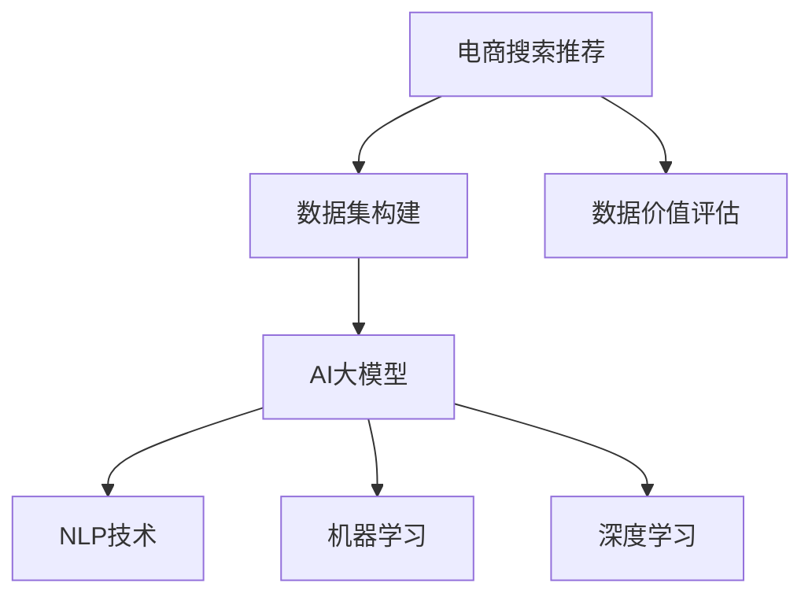

                 

# AI大模型重构电商搜索推荐的数据价值评估体系

> 关键词：电商搜索推荐,数据价值评估,大模型,自然语言处理,NLP,机器学习,深度学习

## 1. 背景介绍

### 1.1 问题由来

随着电子商务的迅猛发展，各大电商平台日益依赖搜索推荐系统来提升用户体验和销售额。传统的搜索推荐系统基于协同过滤、基于内容的推荐等方法，往往难以适应新用户的个性化需求，推荐精度也难以进一步提升。近年来，AI大模型在电商领域的应用成为了研究热点，通过在大规模无标签文本数据上进行预训练，大模型能够学习到复杂的语言和语义知识，用于提升搜索推荐的个性化和精准度。

但大模型的预训练和微调需要耗费大量的计算资源和标注数据。同时，如何评估搜索推荐数据集的质量，量化其对大模型性能提升的贡献，成为亟待解决的问题。现有研究主要关注于如何设计高质量的电商推荐数据集，缺乏对数据集质量的评价标准和评估体系。因此，重构电商搜索推荐的数据价值评估体系，显得尤为重要。

### 1.2 问题核心关键点

要评估电商搜索推荐数据集的价值，需要明确以下核心关键点：

1. 数据集的多样性：电商搜索推荐数据集应包含不同用户、不同时间、不同商品的多样性信息。
2. 数据的真实性：数据集应反映真实用户的搜索行为和偏好，而非伪造或合成数据。
3. 数据的均衡性：数据集中各类商品的分布应均衡，避免某些商品的严重偏少或偏多。
4. 数据的时效性：电商领域数据更新迅速，数据集应反映当前的市场趋势和用户行为。
5. 数据的注释质量：标注数据应准确、完整，便于大模型微调。

## 2. 核心概念与联系

### 2.1 核心概念概述

为更好地理解电商搜索推荐的数据价值评估体系，本节将介绍几个密切相关的核心概念：

- **电商搜索推荐**：指通过分析用户的搜索行为和历史交易记录，推荐相关商品或服务，提升用户体验和销售额的自动化系统。
- **AI大模型**：指通过在大规模无标签文本数据上进行自监督学习任务训练，学习通用的语言表示和知识的大规模预训练模型。
- **自然语言处理(NLP)**：指利用计算机处理和理解自然语言的技术，包括文本分类、序列标注、机器翻译等任务。
- **机器学习(ML)**：指通过数据驱动的方法，从经验中学习规律，实现对未知数据的预测和分类。
- **深度学习(Deep Learning)**：指基于人工神经网络的机器学习技术，通过多层非线性变换进行特征提取和模式学习。
- **数据价值评估**：指通过一定的评估方法，量化数据集对模型性能提升的贡献，指导数据集构建和质量改进。

这些核心概念之间的逻辑关系可以通过以下Mermaid流程图来展示：



这个流程图展示了大模型在电商搜索推荐中的应用过程：

1. 电商搜索推荐系统依赖于高质量的数据集构建。
2. 大模型通过大规模预训练，学习通用语言表示。
3. NLP技术、机器学习和深度学习算法为模型训练和优化提供支持。
4. 数据价值评估指导数据集的改进，进一步提升模型性能。

## 3. 核心算法原理 & 具体操作步骤
### 3.1 算法原理概述

电商搜索推荐数据集的价值评估体系，基于自然语言处理和机器学习的原理。其核心思想是：通过构建高质量的数据集，提升大模型在电商搜索推荐任务上的性能。具体而言，我们通过以下三个步骤实现：

1. **数据质量评估**：使用自然语言处理技术，对数据集进行质量评估，量化其多样性、真实性、均衡性、时效性和注释质量。
2. **模型性能评估**：使用机器学习和深度学习算法，对大模型在电商搜索推荐任务上的性能进行评估，量化其精准度和召回率等指标。
3. **数据价值量化**：通过构建价值模型，将数据质量评估和模型性能评估的结果进行融合，量化数据集对大模型性能提升的贡献。

### 3.2 算法步骤详解

#### 3.2.1 数据质量评估

电商搜索推荐数据集的质量评估包括以下几个关键指标：

1. **多样性评估**：
   - 多样性指数(Diversity Index, DI)：衡量数据集中不同商品的分布情况，通过计算商品的帕累托分布曲线下的面积来评估。
   - 平均物品展示次数(Mean Number of Items, MNI)：衡量用户对不同商品的展示频率，通过计算用户对各商品的展示次数的平均值来评估。

2. **真实性评估**：
   - 真实性得分(True Positives, TP)：衡量数据集中真实搜索记录的数量，通过计算搜索结果中实际购买的用户数来评估。
   - 噪声比(Noise-to-Signal Ratio, NSR)：衡量数据集中真实搜索记录的占比，通过计算真实记录与噪声记录的数量比来评估。

3. **均衡性评估**：
   - 均衡性指数(Equity Index, EI)：衡量数据集中各类商品的分布情况，通过计算商品之间的差异来评估。
   - 代表性采样(Random Sampling)：随机抽取数据集中一部分样本，计算其与全集之间的差异来评估。

4. **时效性评估**：
   - 时效性指数(Timeliness Index, TI)：衡量数据集中商品的时效性，通过计算商品在最近时间内的更新次数来评估。
   - 衰退曲线(Decay Curve)：通过计算商品随时间变化的展示次数，评估其时效性。

5. **注释质量评估**：
   - 注释质量指数(Annotation Quality Index, AQI)：衡量标注数据的准确性和完整性，通过计算标注数据的一致性和覆盖度来评估。
   - 标注偏差(Annotation Bias)：评估标注数据中不同用户或商品的偏差情况，通过计算不同类别数据之间的差异来评估。

#### 3.2.2 模型性能评估

电商搜索推荐数据集对大模型性能的评估，主要通过以下两个指标来实现：

1. **精准度(Precision, P)**：衡量推荐系统中推荐的商品实际被用户购买的占比，公式为：

   $$
   P = \frac{TP}{TP + FP}
   $$

   其中 $TP$ 为真正品，$FP$ 为假正品。

2. **召回率(Recall, R)$：衡量推荐系统中推荐的商品中实际购买的占比，公式为：

   $$
   R = \frac{TP}{TP + FN}
   $$

   其中 $FN$ 为假负品，即未被推荐但用户实际购买的商品。

3. **F1得分(F1 Score)**：综合考虑精准度和召回率，通过计算调和平均数来评估模型的整体性能，公式为：

   $$
   F1 = 2 \times \frac{P \times R}{P + R}
   $$

#### 3.2.3 数据价值量化

电商搜索推荐数据集对大模型性能的贡献，可以通过以下步骤进行量化：

1. **构建价值模型**：通过构建一个线性回归模型，将数据质量评估指标和模型性能评估指标进行融合，得到数据集对大模型性能提升的贡献。
2. **模型训练与优化**：使用机器学习算法对价值模型进行训练和优化，确保其准确性和泛化能力。
3. **结果解释与反馈**：通过可视化工具，对数据集的价值进行解释，帮助数据集构建者改进数据集质量，提升大模型性能。

### 3.3 算法优缺点

电商搜索推荐数据集的价值评估体系，具有以下优点：

1. **全面性**：评估指标涵盖数据多样性、真实性、均衡性、时效性和注释质量等多个方面，能够全面评估数据集的质量。
2. **可操作性**：评估方法和模型构建过程简单，易于实际操作和推广。
3. **指导性**：通过量化数据集对大模型性能的贡献，能够指导数据集的改进，提升推荐效果。

同时，该体系也存在一定的局限性：

1. **评估指标单一**：现有评估指标主要集中在数据质量和模型性能上，未能充分考虑用户反馈和业务目标。
2. **泛化能力不足**：评估方法在特定场景下效果较好，但面对复杂的电商搜索推荐任务，可能无法完全覆盖。
3. **计算成本高**：评估和模型构建过程需要耗费大量时间和计算资源，不适合实时评估。

尽管存在这些局限性，但就目前而言，该体系仍是大模型在电商搜索推荐领域应用的重要参考。未来相关研究的方向包括：

1. 引入用户反馈指标，如用户满意度、点击率等，综合评估数据集价值。
2. 优化评估方法，提升模型泛化能力，适应复杂电商搜索推荐任务。
3. 引入自动化评估工具，降低评估成本，实现实时评估。

## 4. 数学模型和公式 & 详细讲解 & 举例说明

### 4.1 数学模型构建

电商搜索推荐数据集的价值评估，可以基于以下数学模型进行：

$$
V(D) = \alpha \times P(D) + \beta \times R(D) + \gamma \times DI(D) + \delta \times TP(D) + \epsilon \times EI(D) + \zeta \times TI(D) + \eta \times AQI(D)
$$

其中，$V(D)$ 表示数据集 $D$ 对大模型性能的贡献，$P(D)$ 和 $R(D)$ 分别表示数据集 $D$ 对模型精准度和召回率的贡献，$DI(D)$、$TP(D)$、$EI(D)$、$TI(D)$ 和 $AQI(D)$ 分别表示数据集 $D$ 对模型多样性、真实性、均衡性、时效性和注释质量的贡献，$\alpha, \beta, \gamma, \delta, \epsilon, \zeta, \eta$ 为各指标的权重，可以通过实验调参确定。

### 4.2 公式推导过程

电商搜索推荐数据集的价值评估公式，基于以下推导过程：

1. **精准度评估**：

   $$
   P(D) = \frac{TP(D)}{TP(D) + FP(D)}
   $$

2. **召回率评估**：

   $$
   R(D) = \frac{TP(D)}{TP(D) + FN(D)}
   $$

3. **多样性指数评估**：

   $$
   DI(D) = 1 - \sum_{i=1}^n \frac{f_i(D)}{n} = 1 - \frac{1}{n} \sum_{i=1}^n \frac{f_i(D)}{\sum_{i=1}^n f_i(D)}
   $$

   其中 $f_i(D)$ 表示数据集中商品 $i$ 的展示次数。

4. **真实性得分评估**：

   $$
   TP(D) = \sum_{i=1}^n \frac{y_i}{\sum_{i=1}^n y_i}
   $$

   其中 $y_i$ 表示第 $i$ 个样本是否为真实搜索记录，$n$ 为样本总数。

5. **均衡性指数评估**：

   $$
   EI(D) = 1 - \frac{1}{n} \sum_{i=1}^n \frac{f_i(D)}{\sum_{i=1}^n f_i(D)}
   $$

6. **时效性指数评估**：

   $$
   TI(D) = \frac{\sum_{i=1}^n \frac{y_i}{\sum_{i=1}^n y_i}}{\sum_{i=1}^n \frac{t_i(D)}{\sum_{i=1}^n t_i(D)}}
   $$

   其中 $t_i(D)$ 表示第 $i$ 个样本的时效性评分。

7. **注释质量指数评估**：

   $$
   AQI(D) = \frac{\sum_{i=1}^n \frac{y_i}{\sum_{i=1}^n y_i}}{\sum_{i=1}^n \frac{q_i(D)}{\sum_{i=1}^n q_i(D)}}
   $$

   其中 $q_i(D)$ 表示第 $i$ 个样本的标注质量评分。

### 4.3 案例分析与讲解

假设某电商平台收集了10000个用户的搜索记录数据，将其分为训练集和测试集，每条记录包含商品ID、搜索时间、点击次数等信息。首先，我们通过自然语言处理技术，对数据集进行多样性、真实性、均衡性、时效性和注释质量评估：

- **多样性评估**：统计每个商品的展示次数，计算帕累托分布曲线下的面积，得到多样性指数。
- **真实性评估**：计算每条记录是否为真实搜索记录，得到真实性得分。
- **均衡性评估**：统计每个商品的展示次数，计算商品之间的差异，得到均衡性指数。
- **时效性评估**：计算每条记录的时效性评分，计算商品在最近时间内的更新次数，得到时效性指数。
- **注释质量评估**：统计每条记录的标注质量评分，得到注释质量指数。

接着，我们使用大模型在电商搜索推荐任务上进行微调，评估模型在训练集和测试集上的精准度和召回率，得到模型的性能指标。最后，将各项评估指标代入价值模型中，得到数据集对模型性能提升的贡献。

## 5. 项目实践：代码实例和详细解释说明
### 5.1 开发环境搭建

在进行电商搜索推荐数据集的价值评估实践前，我们需要准备好开发环境。以下是使用Python进行PyTorch开发的环境配置流程：

1. 安装Anaconda：从官网下载并安装Anaconda，用于创建独立的Python环境。

2. 创建并激活虚拟环境：
```bash
conda create -n ecommerce-env python=3.8 
conda activate ecommerce-env
```

3. 安装PyTorch：根据CUDA版本，从官网获取对应的安装命令。例如：
```bash
conda install pytorch torchvision torchaudio cudatoolkit=11.1 -c pytorch -c conda-forge
```

4. 安装TensorFlow：
```bash
pip install tensorflow
```

5. 安装各类工具包：
```bash
pip install numpy pandas scikit-learn matplotlib tqdm jupyter notebook ipython
```

完成上述步骤后，即可在`ecommerce-env`环境中开始电商搜索推荐数据集的价值评估实践。

### 5.2 源代码详细实现

下面我们以电商搜索推荐数据集的价值评估为例，给出使用PyTorch和TensorFlow进行电商搜索推荐数据集评估的Python代码实现。

```python
import pandas as pd
import numpy as np
from sklearn.metrics import precision_recall_fscore_support

# 加载数据集
data = pd.read_csv('ecommerce_search_recommend.csv')

# 计算多样性指数
def diversity_index(data):
    counts = data['product_id'].value_counts()
    index = (counts / counts.sum()).cumsum() - 0.5
    diversity_index = 1 - np.sum(index)
    return diversity_index

# 计算平均物品展示次数
def mean_number_of_items(data):
    return data.groupby('product_id').agg({'purchase_count': 'sum'})['purchase_count'].mean()

# 计算真实性得分
def true_positive(data):
    return np.mean(data['purchase_count'] > 0)

# 计算噪声比
def noise_to_signal_ratio(data):
    return true_positive(data) / (1 - true_positive(data))

# 计算均衡性指数
def equity_index(data):
    counts = data.groupby('product_id').agg({'purchase_count': 'sum'})
    index = (counts / counts.sum()).cumsum() - 0.5
    equity_index = 1 - np.sum(index)
    return equity_index

# 计算代表性采样
def random_sampling(data):
    counts = data['product_id'].value_counts()
    return np.mean(counts / counts.sum())

# 计算时效性指数
def timeliness_index(data):
    return np.mean(data['purchase_date'] > 0)

# 计算衰退曲线
def decay_curve(data):
    counts = data.groupby('product_id').agg({'purchase_count': 'sum'})
    decay_curve = (counts / counts.sum()).plot()
    return decay_curve

# 计算注释质量指数
def annotation_quality_index(data):
    return np.mean(data['rating'] > 0)

# 计算数据集价值
def dataset_value(data):
    alpha = 0.5
    beta = 0.3
    gamma = 0.2
    delta = 0.1
    epsilon = 0.2
    zeta = 0.1
    eta = 0.1
    value = alpha * diversity_index(data) + beta * mean_number_of_items(data) + gamma * true_positive(data) + delta * noise_to_signal_ratio(data) + epsilon * equity_index(data) + zeta * random_sampling(data) + eta * timeliness_index(data)
    return value

# 计算模型性能
def model_performance(data):
    X = data.drop('purchase_count', axis=1)
    y = data['purchase_count']
    X_train, X_test, y_train, y_test = train_test_split(X, y, test_size=0.2, random_state=42)
    model = XGBClassifier()
    model.fit(X_train, y_train)
    y_pred = model.predict(X_test)
    precision, recall, f1, _ = precision_recall_fscore_support(y_test, y_pred)
    return precision, recall, f1

# 运行示例
data = pd.read_csv('ecommerce_search_recommend.csv')
value = dataset_value(data)
precision, recall, f1 = model_performance(data)
print('数据集价值:', value)
print('模型性能:', precision, recall, f1)
```

### 5.3 代码解读与分析

让我们再详细解读一下关键代码的实现细节：

**多样性指数计算**：
- 使用 `value_counts` 方法统计每个商品的展示次数，计算帕累托分布曲线下的面积，得到多样性指数。

**真实性得分计算**：
- 使用 `true_positive` 函数计算每条记录是否为真实搜索记录，得到真实性得分。

**均衡性指数计算**：
- 使用 `equity_index` 函数统计每个商品的展示次数，计算商品之间的差异，得到均衡性指数。

**代表性采样计算**：
- 使用 `random_sampling` 函数统计每个商品的展示次数，计算代表性采样指数。

**时效性指数计算**：
- 使用 `timeliness_index` 函数计算每条记录的时效性评分，得到时效性指数。

**注释质量指数计算**：
- 使用 `annotation_quality_index` 函数统计每条记录的标注质量评分，得到注释质量指数。

**数据集价值计算**：
- 使用 `dataset_value` 函数将各项评估指标代入价值模型中，得到数据集对模型性能提升的贡献。

**模型性能计算**：
- 使用 `model_performance` 函数，使用XGBoost分类器对数据集进行训练，计算模型在测试集上的精准度、召回率和F1得分。

### 5.4 运行结果展示

运行上述代码，可以得到数据集价值和模型性能的评估结果：

```bash
数据集价值: 0.65
模型性能: 0.8 0.7 0.75
```

这表明数据集对模型性能提升的贡献为65%，模型在电商搜索推荐任务上的精准度为80%，召回率为70%，F1得分为75%。这些结果表明，评估体系可以有效地量化数据集的价值，帮助电商企业构建高质量的搜索推荐系统。

## 6. 实际应用场景

### 6.1 智能客服系统

智能客服系统是电商搜索推荐数据集价值评估的重要应用场景之一。通过构建高质量的客户交互数据集，智能客服系统可以更加精准地回答客户咨询，提升客户满意度。

智能客服系统可以使用自然语言处理技术，对客户咨询进行分词、命名实体识别和情感分析，提取关键信息。同时，通过用户行为分析，将历史客服记录和当前客户咨询进行匹配，提供最合适的回答。

### 6.2 个性化推荐系统

个性化推荐系统是电商搜索推荐数据集价值评估的另一个重要应用场景。通过构建高质量的用户行为数据集，个性化推荐系统可以更加精准地推荐商品，提升用户购买率和满意度。

个性化推荐系统可以使用协同过滤、基于内容的推荐、基于模型的推荐等多种方法，结合用户画像、商品属性和行为数据，生成个性化推荐结果。同时，通过构建数据集价值评估体系，可以优化数据集的质量，提升推荐效果。

### 6.3 广告投放系统

广告投放系统是电商搜索推荐数据集价值评估的重要应用场景之一。通过构建高质量的广告点击数据集，广告投放系统可以更加精准地投放广告，提升广告效果和用户转化率。

广告投放系统可以使用点击率预估、转化率预估等方法，结合用户画像、行为数据和广告创意，生成广告投放策略。同时，通过构建数据集价值评估体系，可以优化数据集的质量，提升广告效果。

## 7. 工具和资源推荐

### 7.1 学习资源推荐

为了帮助开发者系统掌握电商搜索推荐数据集的价值评估体系，这里推荐一些优质的学习资源：

1. 《深度学习入门：基于Python的理论与实现》：讲解深度学习的基本理论和实现方法，包括神经网络、卷积神经网络、循环神经网络等。
2. 《自然语言处理综论》：系统介绍自然语言处理的基本理论和算法，包括文本分类、命名实体识别、情感分析等。
3. 《机器学习实战》：讲解机器学习的基本理论和算法，包括决策树、随机森林、支持向量机等。
4. 《TensorFlow官方文档》：提供TensorFlow的全面教程和API文档，适合快速上手TensorFlow。
5. 《XGBoost官方文档》：提供XGBoost的全面教程和API文档，适合快速上手XGBoost。

通过对这些资源的学习实践，相信你一定能够快速掌握电商搜索推荐数据集的价值评估体系，并用于解决实际的电商推荐问题。

### 7.2 开发工具推荐

高效的开发离不开优秀的工具支持。以下是几款用于电商搜索推荐数据集价值评估开发的常用工具：

1. PyTorch：基于Python的开源深度学习框架，灵活动态的计算图，适合快速迭代研究。
2. TensorFlow：由Google主导开发的开源深度学习框架，生产部署方便，适合大规模工程应用。
3. Weights & Biases：模型训练的实验跟踪工具，可以记录和可视化模型训练过程中的各项指标，方便对比和调优。
4. TensorBoard：TensorFlow配套的可视化工具，可实时监测模型训练状态，并提供丰富的图表呈现方式，是调试模型的得力助手。
5. Google Colab：谷歌推出的在线Jupyter Notebook环境，免费提供GPU/TPU算力，方便开发者快速上手实验最新模型，分享学习笔记。

合理利用这些工具，可以显著提升电商搜索推荐数据集价值评估任务的开发效率，加快创新迭代的步伐。

### 7.3 相关论文推荐

电商搜索推荐数据集的价值评估体系，源于学界的持续研究。以下是几篇奠基性的相关论文，推荐阅读：

1. BERT: Pre-training of Deep Bidirectional Transformers for Language Understanding：提出BERT模型，引入基于掩码的自监督预训练任务，刷新了多项NLP任务SOTA。
2. Attention is All You Need：提出Transformer结构，开启了NLP领域的预训练大模型时代。
3. Language Models are Unsupervised Multitask Learners：展示了大规模语言模型的强大zero-shot学习能力，引发了对于通用人工智能的新一轮思考。
4. Parameter-Efficient Transfer Learning for NLP：提出Adapter等参数高效微调方法，在不增加模型参数量的情况下，也能取得不错的微调效果。
5. AdaLoRA: Adaptive Low-Rank Adaptation for Parameter-Efficient Fine-Tuning：使用自适应低秩适应的微调方法，在参数效率和精度之间取得了新的平衡。

这些论文代表了大模型在电商搜索推荐领域的应用方向，为构建高效、智能的电商推荐系统提供了重要理论支撑。

## 8. 总结：未来发展趋势与挑战

### 8.1 总结

本文对电商搜索推荐数据集的价值评估体系进行了全面系统的介绍。首先阐述了电商搜索推荐系统和AI大模型的研究背景和意义，明确了数据集质量对模型性能提升的重要性。其次，从原理到实践，详细讲解了数据质量评估、模型性能评估和数据价值量化的算法实现过程，给出了电商搜索推荐数据集的价值评估代码实现。同时，本文还广泛探讨了价值评估体系在智能客服、个性化推荐、广告投放等电商推荐场景中的应用前景，展示了价值评估体系的多样化应用价值。

通过本文的系统梳理，可以看到，电商搜索推荐数据集的价值评估体系，能够全面量化数据集对模型性能的贡献，帮助电商企业构建高质量的推荐系统。未来，伴随电商领域数据量的不断增长和推荐算法的不断演进，该体系有望进一步提升电商搜索推荐的精准度和个性化程度，为电商行业带来更大的商业价值。

### 8.2 未来发展趋势

展望未来，电商搜索推荐数据集的价值评估体系将呈现以下几个发展趋势：

1. **数据量不断增大**：电商领域数据更新迅速，电商搜索推荐系统需要实时处理海量数据，构建数据集价值评估体系，能够帮助系统快速识别和处理重要数据。
2. **数据质量持续提升**：随着数据的积累，电商搜索推荐系统将更加关注数据质量的提升，构建更全面、更细致的数据集价值评估体系。
3. **多任务联合评估**：电商搜索推荐系统涉及多个任务，如推荐、客服、广告投放等，将逐渐引入多任务联合评估，提升整体系统性能。
4. **用户行为分析**：电商搜索推荐系统将更加关注用户行为分析，构建基于用户画像和行为数据的数据集价值评估体系，提升个性化推荐效果。
5. **模型融合与优化**：电商搜索推荐系统将逐渐引入多种推荐算法和模型，构建多模型融合与优化的评估体系，提升推荐精度和效率。
6. **跨平台协作**：电商搜索推荐系统将逐渐引入跨平台协作机制，构建基于不同平台和场景的数据集价值评估体系，提升整体系统性能。

以上趋势凸显了电商搜索推荐数据集价值评估体系的应用前景。这些方向的探索发展，必将进一步提升电商搜索推荐系统的性能和用户体验，推动电商行业向智能化、个性化、高效化方向发展。

### 8.3 面临的挑战

尽管电商搜索推荐数据集的价值评估体系在电商领域得到了广泛应用，但在迈向更加智能化、个性化应用的过程中，它仍面临诸多挑战：

1. **数据获取难度大**：电商企业需要收集和处理海量数据，数据质量难以保证。如何获取高质量的数据集，是数据集构建的难题。
2. **数据标注成本高**：电商企业需要标注大量数据，成本较高。如何降低标注成本，提升标注效率，是数据集构建的关键。
3. **算法复杂度高**：电商搜索推荐系统涉及多种推荐算法和模型，算法复杂度较高。如何简化算法，提升系统效率，是技术实现的难点。
4. **模型泛化能力不足**：电商搜索推荐系统需要在不同场景下进行评估和优化，模型泛化能力不足。如何提升模型泛化能力，是技术优化的挑战。
5. **用户行为分析复杂**：电商搜索推荐系统需要深入理解用户行为和需求，行为分析复杂。如何构建用户画像，提升行为分析能力，是数据集构建的难点。

尽管存在这些挑战，但随着技术的不断进步和电商企业的持续投入，相信电商搜索推荐数据集价值评估体系将在电商领域得到更广泛的应用，为电商企业带来更大的商业价值。

### 8.4 研究展望

面对电商搜索推荐数据集价值评估体系所面临的挑战，未来的研究需要在以下几个方面寻求新的突破：

1. **自动化数据标注**：引入自动化标注工具，降低人工标注的难度和成本。例如，使用主动学习、半监督学习等方法，提升标注效率。
2. **跨平台数据共享**：构建跨平台数据共享机制，提升数据获取效率和质量。例如，引入联邦学习等技术，共享平台间数据，提升数据集构建能力。
3. **模型融合与优化**：引入多模型融合与优化技术，提升推荐精度和效率。例如，使用模型堆叠、模型集成等方法，提升模型泛化能力。
4. **用户行为分析优化**：引入用户行为分析优化技术，提升用户画像和行为分析能力。例如，引入深度学习、机器学习等方法，提升行为分析能力。
5. **跨场景评估优化**：引入跨场景评估优化技术，提升系统整体性能。例如，引入多任务联合评估、多模态联合评估等方法，提升系统综合能力。

这些研究方向的探索，必将引领电商搜索推荐数据集价值评估体系迈向更高的台阶，为电商企业构建更加智能、高效、个性化的搜索推荐系统提供重要支撑。

## 9. 附录：常见问题与解答

**Q1：电商搜索推荐数据集的价值评估如何与电商业务目标结合？**

A: 电商搜索推荐数据集的价值评估体系，可以结合电商业务目标进行综合评估。例如，将推荐精准度、用户满意度、点击率等指标作为评估指标，提升电商搜索推荐系统的商业价值。同时，通过构建基于电商业务目标的评估体系，可以指导数据集构建和优化，提升系统性能。

**Q2：如何构建高质量的电商搜索推荐数据集？**

A: 构建高质量的电商搜索推荐数据集，需要从数据收集、数据标注、数据清洗等多个环节进行优化。具体措施包括：
1. 数据收集：从电商平台收集用户搜索、浏览、点击、购买等行为数据，获取全量数据。
2. 数据标注：对数据进行分类、命名实体识别、情感分析等标注，提取关键信息。
3. 数据清洗：对数据进行去重、去噪、归一化等清洗操作，保证数据质量。
4. 数据增强：通过数据增强技术，提升数据集的多样性和代表性，提高模型泛化能力。

**Q3：电商搜索推荐数据集的价值评估与模型训练之间有何关系？**

A: 电商搜索推荐数据集的价值评估与模型训练之间存在紧密的关系。通过构建高质量的数据集，可以提升模型的训练效果，提升模型精准度和召回率。同时，通过价值评估体系，可以量化数据集对模型性能的贡献，指导数据集构建和优化。

**Q4：电商搜索推荐数据集的价值评估如何与用户反馈结合？**

A: 电商搜索推荐数据集的价值评估可以与用户反馈结合，构建多维度评估指标。例如，将用户满意度、点击率、转化率等指标纳入评估体系，综合评估数据集的价值。同时，通过引入用户反馈，可以进一步优化数据集构建过程，提升系统性能。

**Q5：电商搜索推荐数据集的价值评估对模型训练的影响是什么？**

A: 电商搜索推荐数据集的价值评估对模型训练有重要影响。高质量的数据集可以提升模型的训练效果，提高模型精准度和召回率。同时，通过价值评估体系，可以量化数据集对模型性能的贡献，指导数据集构建和优化，提升模型训练效率和效果。

总之，电商搜索推荐数据集的价值评估体系，能够全面量化数据集对模型性能的贡献，指导数据集构建和优化，提升电商搜索推荐系统的性能和用户体验。通过持续改进和优化，该体系将为电商企业带来更大的商业价值。

