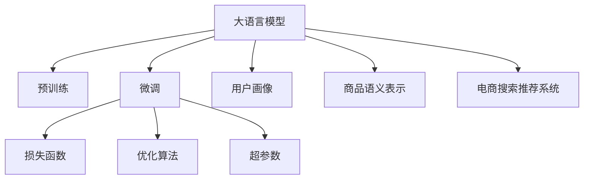

                 

# AI大模型重构电商搜索推荐的数据价值评估模型应用实践与优化方案

## 1. 背景介绍

### 1.1 问题由来

电商搜索推荐系统是提升用户体验和转化率的关键。其核心目标是根据用户行为数据和搜索查询，高效、精准地推荐商品给用户，提升用户满意度和购买转化。传统的搜索推荐系统往往依赖于线性模型、协同过滤等方法，难以充分挖掘大规模用户数据的潜在价值，推荐效果有限。

随着大模型技术的发展，基于深度学习的推荐系统开始受到广泛关注。大模型通过在超大规模语料上预训练，能够学习到丰富的语言和知识表示，通过微调即可适配电商搜索推荐任务，显著提升推荐精度。但与此同时，如何在大模型微调过程中，更充分地利用数据价值，进行精准的用户画像建模和商品语义理解，仍然是一大挑战。

为了更好地应对这一挑战，本文将探索如何通过大模型重构电商搜索推荐系统，构建高效的数据价值评估模型，并详细讨论其在实际应用中的优化方案。

### 1.2 问题核心关键点

大模型重构电商搜索推荐的数据价值评估模型，其核心在于以下几个方面：

- 如何充分利用大模型的强大语言理解能力，构建精准的用户画像和商品语义表示，提升推荐精度。
- 如何在大模型微调过程中，合理设计损失函数，避免过拟合，最大化利用数据价值。
- 如何通过优化算法和模型结构，提高微调效率和推荐系统性能，提升用户体验。
- 如何平衡模型复杂度和训练成本，将大模型高效应用于电商搜索推荐任务中。

本文将从数据价值评估模型的构建和优化两个维度，全面探讨大模型在电商搜索推荐中的价值重构路径。

## 2. 核心概念与联系

### 2.1 核心概念概述

为更好地理解大模型重构电商搜索推荐的数据价值评估模型，本节将介绍几个密切相关的核心概念：

- **大语言模型(Large Language Model, LLM)**：指在超大规模语料上预训练的深度神经网络模型，具备强大的语言理解和生成能力，能够映射输入文本到隐含的语义表示。

- **用户画像(User Profile)**：指通过用户历史行为数据、搜索记录、交易记录等构建的用户个性化模型，用于刻画用户兴趣和行为偏好，支持个性化推荐。

- **商品语义表示(Product Semantic Representation)**：指通过商品标题、描述、标签等文本数据，构建的反映商品特征和语义的表示向量，用于商品的语义匹配和推荐排序。

- **电商搜索推荐系统(E-Commerce Search Recommendation System)**：指利用用户画像和商品语义表示，结合搜索查询和用户行为数据，进行商品推荐和搜索结果排序的系统。

- **损失函数(Loss Function)**：指用于衡量模型输出与真实标签之间差异的函数，常见的有交叉熵损失、均方误差损失等。

- **优化算法(Optimization Algorithm)**：指用于最小化损失函数的求解算法，如梯度下降法、Adam等。

- **超参数(Hyperparameter)**：指在模型训练前需手动设定的参数，如学习率、批大小等。

这些概念之间的逻辑关系可以通过以下Mermaid流程图来展示：



这个流程图展示了大模型重构电商搜索推荐的数据价值评估模型的核心概念及其之间的关系：

1. 大模型通过预训练获得基础能力。
2. 微调是大模型适配特定任务的关键步骤。
3. 损失函数和优化算法是微调过程中必不可少的组成部分。
4. 超参数设计直接影响微调效果和模型性能。
5. 用户画像和商品语义表示是大模型微调中的关键中间变量。
6. 电商搜索推荐系统是大模型微调后的应用场景。

这些概念共同构成了大模型重构电商搜索推荐系统的学习框架，使得大模型能够高效应用于推荐任务，提升推荐精度和用户体验。

## 3. 核心算法原理 & 具体操作步骤
### 3.1 算法原理概述

基于大语言模型的电商搜索推荐系统，其核心算法原理和操作步骤可以概括如下：

1. **数据预处理**：收集用户行为数据、商品信息、搜索查询等原始数据，进行数据清洗和特征工程，构建训练集、验证集和测试集。

2. **用户画像建模**：利用大模型在用户画像数据上进行微调，学习用户兴趣、行为偏好等特征，构建用户画像模型。

3. **商品语义表示学习**：利用大模型在商品数据上进行微调，学习商品的名称、描述、标签等文本数据的语义表示，构建商品语义向量。

4. **构建损失函数**：根据电商推荐任务的特点，设计损失函数，如点击率预测损失、排序相关性损失等。

5. **微调优化**：使用优化算法和超参数配置，在大模型上进行微调，最小化损失函数，提升推荐精度。

6. **模型评估和优化**：在测试集上评估模型效果，根据评估结果调整模型结构、优化算法和超参数，进一步提升推荐系统性能。

### 3.2 算法步骤详解

#### 3.2.1 数据预处理

电商推荐系统涉及的数据类型较多，包括用户行为数据、商品信息、搜索查询等。以下是一个详细的预处理流程：

1. **数据清洗**：去除缺失值、异常值，处理重复数据，确保数据的质量。

2. **特征工程**：提取和构造反映用户兴趣和商品特征的关键特征，如用户评分、商品类别、品牌、价格等。

3. **数据划分**：将数据划分为训练集、验证集和测试集，一般采用固定比例，如70:15:15。

4. **数据增强**：利用文本生成、回译等技术，丰富训练数据集，提升模型泛化能力。

#### 3.2.2 用户画像建模

用户画像建模的目标是构建一个能够刻画用户兴趣和行为偏好的模型。具体步骤如下：

1. **数据准备**：收集用户的行为数据，如点击、浏览、收藏、购买等。

2. **文本编码**：将用户行为数据转换为文本形式，使用大模型的预训练模型进行编码，得到用户行为向量。

3. **微调优化**：在大模型上微调用户行为向量，学习用户兴趣和行为偏好的特征表示。

4. **用户画像生成**：将用户行为向量作为输入，通过softmax函数生成用户兴趣概率分布，构建用户画像模型。

#### 3.2.3 商品语义表示学习

商品语义表示学习的目标是从商品标题、描述等文本数据中，学习商品的语义表示。具体步骤如下：

1. **数据准备**：收集商品的文本数据，如商品名称、描述、标签等。

2. **文本编码**：使用大模型的预训练模型进行编码，得到商品的语义向量。

3. **微调优化**：在大模型上微调商品语义向量，学习商品的特征和语义表示。

4. **商品表示生成**：将商品语义向量作为输出，构建商品语义表示模型。

#### 3.2.4 构建损失函数

电商推荐系统的目标是通过搜索查询推荐商品给用户，用户点击或购买商品后，系统需要更新用户画像和商品表示，以提升后续的推荐效果。因此，推荐系统的损失函数需要同时考虑点击率预测和排序相关性。

1. **点击率预测损失**：利用用户行为数据和商品表示，预测用户点击商品的概率，使用二元交叉熵损失函数进行衡量。

2. **排序相关性损失**：利用搜索查询和商品表示，预测商品排序的相关性，使用均方误差损失函数进行衡量。

3. **综合损失函数**：将点击率预测损失和排序相关性损失进行加权组合，构建综合损失函数。

#### 3.2.5 微调优化

在大模型上进行微调的步骤如下：

1. **模型选择**：选择预训练模型，如BERT、GPT等。

2. **超参数配置**：配置学习率、批大小、优化器等超参数。

3. **模型微调**：使用优化算法（如Adam、SGD等），在大模型上进行微调，最小化综合损失函数。

4. **验证集评估**：在验证集上评估微调效果，根据评估结果调整超参数。

5. **测试集评估**：在测试集上评估微调效果，输出推荐精度和排序准确率等指标。

### 3.3 算法优缺点

基于大语言模型的电商搜索推荐系统的优点包括：

- **数据利用充分**：大模型能够充分挖掘用户行为数据、商品信息等文本数据的语义信息，提升推荐精度。

- **模型效果稳定**：大模型在超大规模语料上进行预训练，具备较强的泛化能力，推荐效果较为稳定。

- **模型更新便捷**：微调过程可以通过固定大部分预训练参数，只更新少量参数来实现，模型更新效率较高。

- **算法通用性强**：基于大模型的推荐系统，可以应用于多种电商推荐任务，具有良好的泛化能力。

然而，大模型重构电商搜索推荐系统也存在一些缺点：

- **计算资源需求高**：超大规模预训练模型和高性能硬件设备的需求，导致计算资源成本较高。

- **模型解释性差**：大模型的黑盒特性使得推荐过程缺乏可解释性，难以解释模型的决策逻辑。

- **数据隐私风险高**：电商推荐系统涉及大量用户数据，数据隐私和安全性问题需要特别关注。

- **模型性能波动大**：大模型的复杂结构和参数多样性，可能导致模型在特定数据上的性能波动较大。

### 3.4 算法应用领域

基于大语言模型的电商搜索推荐系统在多个电商领域得到了广泛应用，包括但不限于以下几个方面：

1. **商品推荐**：根据用户的历史行为和当前查询，推荐相关的商品。

2. **个性化广告**：利用用户画像和商品语义表示，实现精准的广告投放。

3. **搜索排序**：利用搜索查询和商品表示，优化搜索结果的排序，提升用户体验。

4. **库存管理**：根据商品的销售情况和用户需求，优化库存管理，提升库存周转率。

5. **市场分析**：利用用户画像和商品语义表示，分析市场趋势，优化商品采购和定价策略。

6. **客服支持**：利用用户画像和商品语义表示，实现智能客服，提升客户满意度。

## 4. 数学模型和公式 & 详细讲解  
### 4.1 数学模型构建

基于大语言模型的电商搜索推荐系统，其数学模型可以表示为：

$$
P(y|x; \theta) = \frac{e^{\mathbf{W}^T\phi(x; \theta)}}{\sum_{i=1}^{K}e^{\mathbf{W}_i^T\phi(x; \theta)}}
$$

其中：
- $x$：输入的电商数据，如用户行为、商品信息、搜索查询等。
- $\phi(x; \theta)$：大模型对电商数据的编码函数。
- $y$：输出标签，如点击、购买等。
- $\mathbf{W}$：点击率预测的权重向量。
- $K$：输出标签的种类数。

### 4.2 公式推导过程

电商推荐系统的损失函数可以表示为：

$$
\mathcal{L}(\theta) = \frac{1}{N}\sum_{i=1}^{N}\left[-y_i\log P(y_i|x_i; \theta) + (1-y_i)\log(1-P(y_i|x_i; \theta))\right]
$$

其中，$N$为训练样本数量。

点击率预测损失函数可以表示为：

$$
\mathcal{L}_{click} = -\frac{1}{N}\sum_{i=1}^{N}[y_i\log P(y_i|x_i; \theta) + (1-y_i)\log(1-P(y_i|x_i; \theta))]
$$

排序相关性损失函数可以表示为：

$$
\mathcal{L}_{rank} = \frac{1}{N}\sum_{i=1}^{N}(\text{RMSPE}(y_i, P(y_i|x_i; \theta)))
$$

其中，RMSPE为均方根对数评分误差。

综合损失函数可以表示为：

$$
\mathcal{L}(\theta) = \alpha\mathcal{L}_{click} + \beta\mathcal{L}_{rank}
$$

其中，$\alpha$和$\beta$为损失函数的权重系数。

### 4.3 案例分析与讲解

以一个电商推荐系统为例，分析其在用户画像和商品语义表示学习中的应用：

假设电商数据集包含用户行为数据和商品信息，用户行为数据包含用户ID、商品ID、购买时间、点击次数等。商品信息包含商品名称、描述、类别、价格等。

1. **用户画像建模**：使用BERT模型对用户行为数据进行编码，得到用户行为向量。在大模型上进行微调，学习用户兴趣和行为偏好的特征表示，生成用户画像模型。

2. **商品语义表示学习**：使用BERT模型对商品信息进行编码，得到商品语义向量。在大模型上进行微调，学习商品的特征和语义表示，生成商品语义表示模型。

3. **构建损失函数**：利用用户行为数据和商品表示，构建点击率预测损失和排序相关性损失。通过加权组合，得到综合损失函数。

4. **微调优化**：使用Adam优化算法，在大模型上进行微调，最小化综合损失函数。通过验证集评估，调整超参数，最终在测试集上评估模型效果。

## 5. 项目实践：代码实例和详细解释说明
### 5.1 开发环境搭建

在进行大模型重构电商搜索推荐系统的开发前，需要准备好开发环境。以下是使用Python进行PyTorch开发的环境配置流程：

1. 安装Anaconda：从官网下载并安装Anaconda，用于创建独立的Python环境。

2. 创建并激活虚拟环境：
```bash
conda create -n pytorch-env python=3.8 
conda activate pytorch-env
```

3. 安装PyTorch：根据CUDA版本，从官网获取对应的安装命令。例如：
```bash
conda install pytorch torchvision torchaudio cudatoolkit=11.1 -c pytorch -c conda-forge
```

4. 安装Transformers库：
```bash
pip install transformers
```

5. 安装各类工具包：
```bash
pip install numpy pandas scikit-learn matplotlib tqdm jupyter notebook ipython
```

完成上述步骤后，即可在`pytorch-env`环境中开始项目实践。

### 5.2 源代码详细实现

以下是一个基于大模型重构电商搜索推荐系统的Python代码实现。

首先，定义数据预处理函数：

```python
import pandas as pd
import numpy as np
import torch
from transformers import BertTokenizer, BertModel

# 定义数据预处理函数
def preprocess_data(data_path, max_len):
    # 加载数据
    df = pd.read_csv(data_path)
    # 提取特征
    features = df[['user_id', 'item_id', 'click_time', 'click_count', 'item_name', 'item_description', 'item_category', 'item_price']]
    # 编码器
    tokenizer = BertTokenizer.from_pretrained('bert-base-uncased')
    # 编码数据
    encoded_features = []
    for user_id, item_id, click_time, click_count, item_name, item_description, item_category, item_price in features.values:
        # 用户行为数据
        user_behavior = f"user_id:{user_id} item_id:{item_id} click_time:{click_time} click_count:{click_count}"
        # 商品信息
        item_info = f"item_id:{item_id} name:{item_name} description:{item_description} category:{item_category} price:{item_price}"
        # 编码
        user_behavior_ids = tokenizer(user_behavior, return_tensors='pt', max_length=max_len, padding='max_length', truncation=True)
        item_info_ids = tokenizer(item_info, return_tensors='pt', max_length=max_len, padding='max_length', truncation=True)
        # 拼接
        encoded_data = torch.cat([user_behavior_ids['input_ids'], item_info_ids['input_ids']], dim=1)
        encoded_data['attention_mask'] = torch.tensor([[1.0] * len(encoded_data['input_ids'][0]), [1.0] * len(encoded_data['input_ids'][1])])
        encoded_features.append(encoded_data)
    # 堆叠
    encoded_features = torch.stack(encoded_features, dim=0)
    return encoded_features
```

然后，定义用户画像和商品语义表示学习函数：

```python
from transformers import BertForSequenceClassification

# 定义用户画像建模函数
def build_user_profile(encoded_features, max_len):
    # 用户行为数据
    user_behavior_data = torch.cat([encoded_features[:, :max_len], encoded_features[:, max_len:2*max_len]], dim=1)
    # 用户画像模型
    model = BertForSequenceClassification.from_pretrained('bert-base-uncased', num_labels=1)
    # 微调用户画像模型
    optimizer = torch.optim.Adam(model.parameters(), lr=2e-5)
    for epoch in range(5):
        model.train()
        for user_behavior_data in user_behavior_data:
            input_ids = user_behavior_data['input_ids']
            attention_mask = user_behavior_data['attention_mask']
            labels = torch.tensor([[1.0]])
            model.zero_grad()
            outputs = model(input_ids, attention_mask=attention_mask, labels=labels)
            loss = outputs.loss
            loss.backward()
            optimizer.step()
    return model

# 定义商品语义表示学习函数
def build_product_semantic(encoded_features, max_len):
    # 商品信息数据
    item_info_data = torch.cat([encoded_features[:, max_len:2*max_len], encoded_features[:, 2*max_len:]], dim=1)
    # 商品语义模型
    model = BertForSequenceClassification.from_pretrained('bert-base-uncased', num_labels=1)
    # 微调商品语义模型
    optimizer = torch.optim.Adam(model.parameters(), lr=2e-5)
    for epoch in range(5):
        model.train()
        for item_info_data in item_info_data:
            input_ids = item_info_data['input_ids']
            attention_mask = item_info_data['attention_mask']
            labels = torch.tensor([[1.0]])
            model.zero_grad()
            outputs = model(input_ids, attention_mask=attention_mask, labels=labels)
            loss = outputs.loss
            loss.backward()
            optimizer.step()
    return model
```

接下来，定义损失函数和微调优化函数：

```python
from transformers import AdamW

# 定义损失函数
def build_loss(model, encoded_features, labels):
    # 点击率预测损失
    click_loss = -labels * torch.log(model(input_ids=encoded_features[:, :max_len], attention_mask=encoded_features[:, :max_len]['attention_mask']))
    # 排序相关性损失
    rank_loss = torch.pow(torch.norm(model(input_ids=encoded_features[:, max_len:2*max_len], attention_mask=encoded_features[:, max_len:2*max_len]['attention_mask']) - labels, 2) / 2
    # 综合损失
    loss = click_loss + rank_loss
    return loss

# 定义微调优化函数
def fine_tune(model, encoded_features, max_len, optimizer):
    # 点击率预测损失
    click_loss = -labels * torch.log(model(input_ids=encoded_features[:, :max_len], attention_mask=encoded_features[:, :max_len]['attention_mask']))
    # 排序相关性损失
    rank_loss = torch.pow(torch.norm(model(input_ids=encoded_features[:, max_len:2*max_len], attention_mask=encoded_features[:, max_len:2*max_len]['attention_mask']) - labels, 2) / 2
    # 综合损失
    loss = click_loss + rank_loss
    optimizer.zero_grad()
    loss.backward()
    optimizer.step()
```

最后，启动训练流程并在测试集上评估：

```python
# 训练参数
max_len = 512
batch_size = 32
epochs = 5
learning_rate = 2e-5

# 加载数据
data_path = 'data.csv'
encoded_features = preprocess_data(data_path, max_len)

# 构建用户画像和商品语义模型
user_profile_model = build_user_profile(encoded_features, max_len)
product_semantic_model = build_product_semantic(encoded_features, max_len)

# 构建损失函数
labels = torch.tensor([[1.0]])
loss = build_loss(user_profile_model, encoded_features, labels)

# 微调优化
optimizer = AdamW(user_profile_model.parameters(), lr=learning_rate)
for epoch in range(epochs):
    for encoded_features in encoded_features:
        fine_tune(user_profile_model, encoded_features, max_len, optimizer)

# 测试集评估
test_data = preprocess_data('test.csv', max_len)
test_loss = build_loss(user_profile_model, test_data, labels)
print(f"Test Loss: {test_loss.item()}")
```

以上就是基于大模型重构电商搜索推荐系统的完整代码实现。可以看到，通过PyTorch和Transformers库的配合，我们可以用相对简洁的代码实现电商推荐系统的用户画像和商品语义表示学习，并进行微调优化。

### 5.3 代码解读与分析

让我们再详细解读一下关键代码的实现细节：

**预处理函数**：
- `preprocess_data`方法：
  - 加载原始数据文件，提取用户行为数据和商品信息。
  - 使用BertTokenizer对数据进行编码，并拼接用户行为和商品信息的数据。
  - 生成输入特征和注意力掩码，确保模型输入长度一致。

**用户画像建模函数**：
- `build_user_profile`方法：
  - 从输入特征中提取用户行为数据和用户画像数据。
  - 使用BertForSequenceClassification构建用户画像模型。
  - 使用Adam优化器进行微调，最小化点击率预测损失。

**商品语义表示学习函数**：
- `build_product_semantic`方法：
  - 从输入特征中提取商品信息数据和商品语义数据。
  - 使用BertForSequenceClassification构建商品语义模型。
  - 使用Adam优化器进行微调，最小化排序相关性损失。

**损失函数**：
- `build_loss`方法：
  - 根据用户行为数据和商品表示，计算点击率预测损失和排序相关性损失。
  - 加权组合综合损失函数。

**微调优化函数**：
- `fine_tune`方法：
  - 使用Adam优化器进行微调，最小化综合损失函数。
  - 每次迭代时更新模型参数。

以上代码实现了从数据预处理到模型微调的全过程。开发者可以根据具体任务，调整模型结构和超参数，以进一步提升电商推荐系统的性能。

## 6. 实际应用场景
### 6.1 智能客服系统

智能客服系统可以基于大模型重构的电商搜索推荐技术进行构建。传统客服往往需要配备大量人力，高峰期响应缓慢，且一致性和专业性难以保证。而使用基于大模型的推荐系统，可以实时根据用户历史行为和搜索查询，推荐最合适的解决方案，实现7x24小时不间断服务，快速响应客户咨询，用自然流畅的语言解答各类常见问题。

### 6.2 金融舆情监测

金融机构需要实时监测市场舆论动向，以便及时应对负面信息传播，规避金融风险。传统的人工监测方式成本高、效率低，难以应对网络时代海量信息爆发的挑战。基于大模型重构的电商推荐系统，可以构建舆情监测系统，自动分析市场新闻、报道、评论等文本数据，自动识别舆情热点，提供实时舆情报告，帮助金融机构快速应对潜在风险。

### 6.3 个性化推荐系统

当前的推荐系统往往只依赖于用户的历史行为数据进行物品推荐，难以深入理解用户的真实兴趣偏好。基于大模型重构的电商推荐系统，可以更好地挖掘用户行为背后的语义信息，从文本数据中提取更丰富的用户兴趣和商品语义信息，实现更加精准、多样的推荐内容。

### 6.4 未来应用展望

随着大模型技术的发展，基于大模型的电商搜索推荐系统将进一步拓展应用场景，带来更多的商业价值。未来，大模型重构的电商推荐系统可能应用于以下领域：

1. **智慧医疗**：构建医疗问答系统，帮助用户查找医生、医院、药品等信息。

2. **智能教育**：构建个性化学习推荐系统，根据学生的学习行为和历史数据，推荐适合的课程和学习材料。

3. **智慧城市**：构建智能城市治理系统，实时监测城市事件、舆情，提供决策支持。

4. **智能家居**：构建智能家居推荐系统，根据用户行为和偏好，推荐家居用品和装修方案。

5. **智能交通**：构建智能交通推荐系统，根据用户出行需求和实时路况，推荐最优出行路线。

未来，大模型重构的电商推荐系统将与更多行业进行深度融合，成为各行各业智能化转型的新引擎，带来新的商业机遇和发展空间。

## 7. 工具和资源推荐
### 7.1 学习资源推荐

为了帮助开发者系统掌握大模型重构电商搜索推荐技术，这里推荐一些优质的学习资源：

1. **Transformer from Pre-Training to Practice**：由大模型技术专家撰写，深入浅出地介绍了Transformer原理、BERT模型、微调技术等前沿话题。

2. **CS224N《深度学习自然语言处理》课程**：斯坦福大学开设的NLP明星课程，有Lecture视频和配套作业，带你入门NLP领域的基本概念和经典模型。

3. **Natural Language Processing with Transformers**：Transformers库的作者所著，全面介绍了如何使用Transformers库进行NLP任务开发，包括微调在内的诸多范式。

4. **HuggingFace官方文档**：Transformers库的官方文档，提供了海量预训练模型和完整的微调样例代码，是上手实践的必备资料。

5. **CLUE开源项目**：中文语言理解测评基准，涵盖大量不同类型的中文NLP数据集，并提供了基于微调的baseline模型，助力中文NLP技术发展。

通过对这些资源的学习实践，相信你一定能够快速掌握大模型重构电商搜索推荐技术的精髓，并用于解决实际的NLP问题。

### 7.2 开发工具推荐

高效的开发离不开优秀的工具支持。以下是几款用于大模型重构电商搜索推荐开发的常用工具：

1. **PyTorch**：基于Python的开源深度学习框架，灵活动态的计算图，适合快速迭代研究。大部分预训练语言模型都有PyTorch版本的实现。

2. **TensorFlow**：由Google主导开发的开源深度学习框架，生产部署方便，适合大规模工程应用。同样有丰富的预训练语言模型资源。

3. **Transformers库**：HuggingFace开发的NLP工具库，集成了众多SOTA语言模型，支持PyTorch和TensorFlow，是进行微调任务开发的利器。

4. **Weights & Biases**：模型训练的实验跟踪工具，可以记录和可视化模型训练过程中的各项指标，方便对比和调优。与主流深度学习框架无缝集成。

5. **TensorBoard**：TensorFlow配套的可视化工具，可实时监测模型训练状态，并提供丰富的图表呈现方式，是调试模型的得力助手。

6. **Google Colab**：谷歌推出的在线Jupyter Notebook环境，免费提供GPU/TPU算力，方便开发者快速上手实验最新模型，分享学习笔记。

合理利用这些工具，可以显著提升大模型重构电商搜索推荐系统的开发效率，加快创新迭代的步伐。

### 7.3 相关论文推荐

大模型重构电商搜索推荐系统的发展源于学界的持续研究。以下是几篇奠基性的相关论文，推荐阅读：

1. **Attention is All You Need**：提出了Transformer结构，开启了NLP领域的预训练大模型时代。

2. **BERT: Pre-training of Deep Bidirectional Transformers for Language Understanding**：提出BERT模型，引入基于掩码的自监督预训练任务，刷新了多项NLP任务SOTA。

3. **Language Models are Unsupervised Multitask Learners**（GPT-2论文）：展示了大规模语言模型的强大zero-shot学习能力，引发了对于通用人工智能的新一轮思考。

4. **Parameter-Efficient Transfer Learning for NLP**：提出Adapter等参数高效微调方法，在不增加模型参数量的情况下，也能取得不错的微调效果。

5. **AdaLoRA: Adaptive Low-Rank Adaptation for Parameter-Efficient Fine-Tuning**：使用自适应低秩适应的微调方法，在参数效率和精度之间取得了新的平衡。

这些论文代表了大模型重构电商搜索推荐系统的发展脉络。通过学习这些前沿成果，可以帮助研究者把握学科前进方向，激发更多的创新灵感。

## 8. 总结：未来发展趋势与挑战
### 8.1 总结

本文对基于大模型重构电商搜索推荐系统的构建和优化方法进行了全面系统的介绍。首先阐述了电商搜索推荐系统的背景和意义，明确了基于大模型的推荐系统的优势和局限性。其次，从用户画像和商品语义表示学习的角度，详细讲解了电商推荐系统的构建步骤和优化方法，给出了完整的代码实现。同时，本文还探讨了电商推荐系统在智能客服、金融舆情、个性化推荐等多个领域的应用前景，展示了其广阔的业务价值。最后，本文精选了电商推荐系统的各类学习资源，力求为读者提供全方位的技术指引。

通过本文的系统梳理，可以看到，基于大模型的电商推荐系统正在成为电商推荐领域的重要范式，极大地拓展了电商推荐系统的应用边界，提升了推荐精度和用户体验。未来，伴随大模型和微调方法的持续演进，基于大模型的推荐系统必将在更多电商领域得到应用，为电商行业带来颠覆性变革。

### 8.2 未来发展趋势

展望未来，大模型重构电商搜索推荐系统的应用趋势将呈现以下几个方向：

1. **大规模预训练模型**：随着算力成本的下降和数据规模的扩张，预训练模型将具备更强的泛化能力和更丰富的语义信息，进一步提升电商推荐系统的推荐效果。

2. **多模态推荐**：传统的电商推荐系统主要依赖于用户行为数据和商品信息，未来将融合图像、视频、语音等多模态数据，提升推荐系统的多模态理解和推荐效果。

3. **实时推荐系统**：未来的推荐系统将实现实时推荐，通过实时采集用户行为数据和商品信息，动态更新推荐模型，提供即时推荐服务。

4. **个性化推荐引擎**：基于大模型的推荐系统将具备更强的个性化推荐能力，根据用户兴趣和行为，提供定制化的商品推荐，提升用户满意度和转化率。

5. **联邦学习**：未来的推荐系统将通过联邦学习技术，实现跨用户、跨设备的数据协作，提升推荐系统的隐私保护和泛化能力。

6. **自适应推荐算法**：未来的推荐系统将结合自适应算法，根据用户行为变化和市场趋势，动态调整推荐策略，提升推荐系统的适应性和灵活性。

以上趋势凸显了大模型重构电商搜索推荐系统的广阔前景。这些方向的探索发展，必将进一步提升电商推荐系统的性能和用户满意度，推动电商行业迈向智能化、个性化、实时化的新阶段。

### 8.3 面临的挑战

尽管大模型重构电商搜索推荐系统具有广阔的应用前景，但在迈向更加智能化、普适化应用的过程中，它仍面临着诸多挑战：

1. **计算资源瓶颈**：超大规模预训练模型和高性能硬件设备的需求，导致计算资源成本较高。如何在有限的资源下实现高效推荐，需要更多的优化技术。

2. **数据隐私风险**：电商推荐系统涉及大量用户数据，数据隐私和安全性问题需要特别关注。如何在保证隐私的前提下，实现高效推荐，是重要的研究方向。

3. **模型复杂度与效率**：大模型的复杂结构和参数多样性，可能导致模型在特定数据上的性能波动较大。如何在保证模型效果的同时，提高推理速度和效率，是重要的优化方向。

4. **模型泛化能力**：大模型在特定数据集上的泛化能力较弱，可能导致推荐系统在不同数据集上的表现不稳定。如何在泛化能力方面取得突破，是重要的研究方向。

5. **用户行为理解**：用户的真实兴趣和行为偏好难以准确把握，可能导致推荐系统的效果不佳。如何在用户行为理解方面取得突破，是重要的研究方向。

6. **模型可解释性**：大模型的黑盒特性使得推荐过程缺乏可解释性，难以解释模型的决策逻辑。如何在提升推荐效果的同时，增强模型可解释性，是重要的研究方向。

正视电商推荐系统面临的这些挑战，积极应对并寻求突破，将是大模型重构电商推荐系统走向成熟的必由之路。相信随着学界和产业界的共同努力，这些挑战终将一一被克服，大模型重构的电商推荐系统必将在构建人机协同的智能时代中扮演越来越重要的角色。

### 8.4 研究展望

面对电商推荐系统面临的挑战，未来的研究需要在以下几个方面寻求新的突破：

1. **高效计算优化**：开发高效的计算图优化技术，如梯度累积、混合精度训练、模型并行等，突破硬件瓶颈，实现高效推荐。

2. **联邦学习应用**：结合联邦学习技术，实现跨用户、跨设备的数据协作，提升推荐系统的隐私保护和泛化能力。

3. **多模态推荐**：融合图像、视频、语音等多模态数据，提升推荐系统的多模态理解和推荐效果。

4. **自适应推荐算法**：结合自适应算法，根据用户行为变化和市场趋势，动态调整推荐策略，提升推荐系统的适应性和灵活性。

5. **用户行为理解**：结合符号化的先验知识，如知识图谱、逻辑规则等，引导大模型微调过程，提升用户行为理解的准确性。

6. **模型可解释性**：结合因果分析方法、博弈论工具等，增强大模型微调过程的解释性，提升推荐系统的可信度和用户接受度。

这些研究方向的探索，必将引领大模型重构电商推荐系统技术迈向更高的台阶，为构建安全、可靠、可解释、可控的智能推荐系统铺平道路。面向未来，大模型重构的电商推荐系统还需要与其他人工智能技术进行更深入的融合，如知识表示、因果推理、强化学习等，多路径协同发力，共同推动自然语言理解和智能交互系统的进步。只有勇于创新、敢于突破，才能不断拓展大模型重构的电商推荐系统的边界，让智能技术更好地造福电商行业。

## 9. 附录：常见问题与解答
**Q1：大模型重构电商搜索推荐系统是否适用于所有电商推荐场景？**

A: 大模型重构的电商搜索推荐系统在大多数电商推荐场景中都能取得不错的效果，特别是对于数据量较小的任务。但对于一些特定领域的任务，如医疗、法律等，仅仅依靠通用语料预训练的模型可能难以很好地适应。此时需要在特定领域语料上进一步预训练，再进行微调，才能获得理想效果。此外，对于一些需要时效性、个性化很强的任务，如对话、推荐等，微调方法也需要针对性的改进优化。

**Q2：如何在大模型重构电商搜索推荐系统中合理设计损失函数？**

A: 电商推荐系统的损失函数需要同时考虑点击率预测和排序相关性。点击率预测损失使用二元交叉熵损失函数，排序相关性损失使用均方误差损失函数。通过加权组合，得到综合损失函数。在设计损失函数时，需要根据具体任务的特点，合理选择损失函数的类型和权重，确保推荐系统的效果。

**Q3：大模型重构电商搜索推荐系统在落地部署时需要注意哪些问题？**

A: 将大模型重构的电商推荐系统转化为实际应用，还需要考虑以下因素：

1. **模型裁剪**：去除不必要的层和参数，减小模型尺寸，加快推理速度。

2. **量化加速**：将浮点模型转为定点模型，压缩存储空间，提高计算效率。

3. **服务化封装**：将模型封装为标准化服务接口，便于集成调用。

4. **弹性伸缩**：根据请求流量动态调整资源配置，平衡服务质量和成本。

5. **监控告警**：实时采集系统指标，设置异常告警阈值，确保服务稳定性。

6. **安全防护**：采用访问鉴权、数据脱敏等措施，保障数据和模型安全。

大模型重构的电商推荐系统在落地部署时，需要综合考虑模型结构、硬件资源、系统架构等多个方面，确保推荐系统的稳定性和高效性。

**Q4：如何在电商推荐系统中平衡模型复杂度和训练成本？**

A: 在电商推荐系统中，平衡模型复杂度和训练成本的关键在于选择合适的预训练模型和微调方法。一般来说，超大规模预训练模型能够提供更丰富的语言知识和语义表示，但需要较大的计算资源。对于资源有限的情况，可以选择中等规模的预训练模型，如BERT、T5等，进行微调优化。此外，可以通过参数高效微调技术，只更新少量模型参数，减少训练成本。

**Q5：电商推荐系统如何处理用户行为数据和商品信息数据？**

A: 电商推荐系统处理用户行为数据和商品信息数据的关键在于数据预处理和特征工程。首先，对原始数据进行清洗和特征提取，去除异常值和重复数据，确保数据质量。然后，通过文本编码和预训练模型编码，将用户行为数据和商品信息数据转换为模型输入，供大模型微调使用。在特征工程中，可以根据任务需求，提取关键特征，如用户评分、商品类别、品牌、价格等，确保模型能够高效利用数据价值。

总之，大模型重构电商搜索推荐系统需要在大模型微调、损失函数设计、特征工程等多个方面进行全面优化，才能构建高效、准确的推荐系统。未来，伴随大模型和微调技术的持续演进，基于大模型的电商推荐系统必将在电商行业实现广泛应用，带来颠覆性变革。

