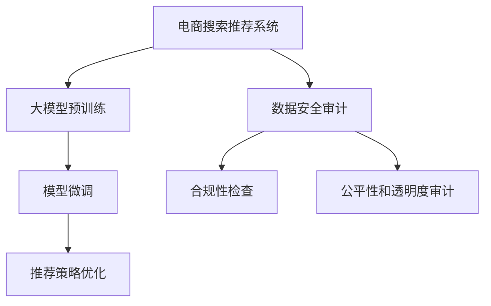

                 

# AI大模型重构电商搜索推荐的数据安全审计工具选型与应用

> 关键词：AI大模型, 电商搜索推荐, 数据安全审计, 工具选型, 应用实践

## 1. 背景介绍

### 1.1 问题由来

随着人工智能技术的飞速发展，特别是在电商领域，人工智能驱动的搜索推荐系统（Recommender Systems）已经成为提升用户体验和提高转化率的关键手段。这些系统利用大规模数据进行深度学习模型的训练，以预测用户的行为和偏好。然而，随着人工智能在电商领域应用的深入，数据安全和隐私问题愈发凸显，成为行业内外关注的焦点。

### 1.2 问题核心关键点

数据安全审计（Data Security Audit）作为确保人工智能系统公正、透明和安全运行的重要手段，对于电商搜索推荐系统尤为重要。这是因为电商搜索推荐系统处理的是用户的敏感数据，包括但不限于用户的浏览历史、购买记录、搜索关键词等，这些数据如果被滥用或泄露，可能对用户造成严重的经济损失和隐私侵害。

大模型在电商搜索推荐系统中的应用，虽然提高了系统的智能化水平，但也带来了新的数据安全风险。大模型通常依赖大量数据进行训练，可能包含数据偏见，甚至会在推荐过程中故意或无意地传播偏见，影响用户的公平性。此外，大模型的复杂性和不透明性，使得其行为难以解释和审查，给数据安全审计带来了新的挑战。

### 1.3 问题研究意义

进行电商搜索推荐系统的数据安全审计，对电商企业的合规性和用户信任度至关重要。通过数据安全审计，可以有效识别和修复系统中的安全隐患，确保系统的公正性和透明度，保护用户隐私，提升用户满意度，从而增强企业竞争力。

此外，通过数据安全审计，可以帮助企业更好地理解大模型的行为和决策机制，提高模型的透明度和可解释性，为模型持续优化和改进提供数据支持。在应对潜在的安全威胁和监管要求的同时，数据安全审计也有助于推动人工智能技术的健康发展，为电商行业乃至整个社会的数字化转型奠定坚实的基础。

## 2. 核心概念与联系

### 2.1 核心概念概述

为更好地理解电商搜索推荐系统中的数据安全审计，本节将介绍几个关键概念及其相互关系：

- **电商搜索推荐系统（Recommender Systems）**：基于用户的兴趣和行为数据，通过算法推荐用户可能感兴趣的商品或服务。大模型通过学习和理解大规模数据中的模式和规律，提升推荐准确性和多样性。

- **数据安全审计（Data Security Audit）**：通过技术和工具，对人工智能系统的数据处理和使用过程进行审查和评估，确保系统的数据安全性和合规性。

- **人工智能大模型（AI Large Models）**：指基于深度学习技术，训练规模巨大的模型，如BERT、GPT等。这些模型具有强大的语言理解和生成能力，能够在大规模数据上进行泛化学习。

- **深度学习（Deep Learning）**：一种基于神经网络的机器学习技术，通过多层非线性映射，实现对复杂模式的高级提取。

- **监督学习（Supervised Learning）**：一种利用标注数据训练模型的方法，使得模型能够学习输入与输出之间的映射关系。

- **公平性和透明度（Fairness and Transparency）**：确保人工智能系统的决策过程公平、无偏见，并具有可解释性，以便用户和监管者能够理解和审查。

### 2.2 核心概念原理和架构的 Mermaid 流程图



此流程图展示了电商搜索推荐系统中的核心概念及其相互关系：

1. **电商搜索推荐系统（A）**：接收用户输入，通过大模型（B）进行分析和预测，生成推荐结果。
2. **大模型预训练（B）**：利用大量数据进行预训练，学习语言的通用表示。
3. **数据安全审计（C）**：对推荐系统的数据处理和使用过程进行审计，确保数据安全性和合规性。
4. **模型微调（D）**：基于特定任务，对预训练模型进行调整，提高推荐效果。
5. **推荐策略优化（F）**：通过对模型和数据进行优化，提升推荐系统的准确性和多样性。
6. **公平性和透明度审计（G）**：审查模型是否存在偏见，确保推荐过程的公平性和透明度。
7. **合规性检查（E）**：确保系统符合法律法规和行业标准，保障用户隐私和数据安全。

这些概念构成了电商搜索推荐系统中的数据安全审计框架，使得系统能够在大模型驱动的智能化推荐过程中，保障数据的安全性和合规性。

## 3. 核心算法原理 & 具体操作步骤

### 3.1 算法原理概述

电商搜索推荐系统中的数据安全审计，主要涉及以下核心算法原理：

1. **数据收集与预处理**：从推荐系统的日志和行为数据中收集所需信息，并进行数据清洗和标准化处理。
2. **行为分析与特征提取**：分析用户的行为模式和特征，识别可能存在的安全风险。
3. **异常检测与风险评估**：利用机器学习算法，识别和评估系统中的异常行为和风险。
4. **模型解释与可解释性分析**：分析大模型的决策过程，提高模型的透明度和可解释性。
5. **合规性与政策遵守**：检查系统是否符合法律法规和行业标准，确保用户隐私保护。

### 3.2 算法步骤详解

#### 步骤1：数据收集与预处理

数据收集和预处理是数据安全审计的第一步。电商搜索推荐系统通常会生成大量的日志和行为数据，这些数据包含了用户的搜索历史、点击行为、购买记录等信息。对于这些数据，需要进行以下预处理步骤：

- **数据清洗**：去除无效、重复、格式不规范的数据，确保数据的准确性和一致性。
- **特征工程**：提取有用的特征，如用户的浏览时间、点击次数、购买金额等，用于后续的分析和建模。
- **标准化处理**：将数据转换为标准格式，如将日期转换为统一的时间戳格式，便于分析和处理。

#### 步骤2：行为分析与特征提取

行为分析与特征提取是识别潜在安全风险的关键步骤。通过分析用户的行为模式和特征，可以发现异常行为和潜在的安全威胁。常用的方法包括：

- **行为模式分析**：通过统计分析，识别用户行为的异常模式，如异常登录、异常购买行为等。
- **特征提取**：从用户行为数据中提取有用的特征，如用户的平均购买金额、浏览时间等，用于后续的模型训练和分析。

#### 步骤3：异常检测与风险评估

异常检测与风险评估是通过机器学习算法，识别和评估系统中的异常行为和风险。常用的方法包括：

- **异常检测算法**：如基于统计学的Z-score方法、基于规则的异常检测算法等，可以识别出异常用户行为。
- **风险评估模型**：如逻辑回归、支持向量机等，可以评估系统中的风险水平，并预测可能的安全事件。

#### 步骤4：模型解释与可解释性分析

模型解释与可解释性分析是通过解释大模型的决策过程，提高模型的透明度和可解释性。常用的方法包括：

- **可解释性模型**：如决策树、线性回归等，具有较好的可解释性，可以直观地展示模型的决策依据。
- **可解释性工具**：如LIME、SHAP等，可以提供详细的模型解释和特征贡献度分析，帮助理解模型的决策过程。

#### 步骤5：合规性与政策遵守

合规性与政策遵守是确保系统符合法律法规和行业标准的关键步骤。常用的方法包括：

- **合规性检查**：检查系统是否符合GDPR、CCPA等法律法规的要求，确保用户隐私保护。
- **政策遵守**：确保系统遵守行业标准和政策要求，如用户数据的存储、传输和处理等。

### 3.3 算法优缺点

数据安全审计中的算法具有以下优点：

1. **准确性高**：通过机器学习算法，可以有效识别出系统中的异常行为和潜在风险。
2. **自动化程度高**：利用自动化工具和算法，可以高效地处理大量数据，减少人工干预和错误。
3. **可扩展性强**：可以适应不同规模的电商搜索推荐系统，具有较强的可扩展性。

但同时，这些算法也存在以下缺点：

1. **数据依赖性强**：算法的准确性和有效性依赖于数据的完整性和质量，数据收集和预处理中的任何错误都会影响结果。
2. **模型复杂度高**：机器学习算法的复杂性较高，需要大量的计算资源和时间，对于大规模系统可能面临计算瓶颈。
3. **解释性不足**：某些高级算法（如深度学习）难以解释其决策过程，增加了审计的难度。
4. **隐私保护不足**：在数据收集和处理过程中，可能泄露用户隐私，需注意数据隐私保护。

### 3.4 算法应用领域

数据安全审计中的算法主要应用于以下领域：

1. **金融领域**：在金融交易和信用评估中，通过数据安全审计确保系统公平性和透明度，保护用户隐私。
2. **医疗领域**：在医疗诊断和治疗方案推荐中，确保系统决策的透明性和公平性，保障患者权益。
3. **政府和企业**：在政府和企业的人力资源管理和客户关系管理中，通过数据安全审计确保系统符合法律法规，保护用户数据安全。
4. **电子商务**：在电商搜索推荐系统中，通过数据安全审计确保系统公平、透明和合规，保护用户隐私。

## 4. 数学模型和公式 & 详细讲解 & 举例说明

### 4.1 数学模型构建

在电商搜索推荐系统中的数据安全审计中，我们通常会构建以下数学模型：

1. **行为分析与特征提取模型**：
   $$
   y = \alpha_1 x_1 + \alpha_2 x_2 + \ldots + \alpha_n x_n + \epsilon
   $$
   其中，$y$为行为分析结果，$x_1, x_2, \ldots, x_n$为特征向量，$\alpha_1, \alpha_2, \ldots, \alpha_n$为特征权重，$\epsilon$为误差项。

2. **异常检测模型**：
   $$
   P(y|x) = \frac{1}{1 + \exp(-\beta(x - \mu))}
   $$
   其中，$P(y|x)$为异常检测的概率，$x$为输入数据，$\beta$为模型参数，$\mu$为均值。

3. **风险评估模型**：
   $$
   y = w_1 x_1 + w_2 x_2 + \ldots + w_n x_n + b
   $$
   其中，$y$为风险评估结果，$x_1, x_2, \ldots, x_n$为特征向量，$w_1, w_2, \ldots, w_n$为特征权重，$b$为截距。

4. **可解释性模型**：
   $$
   y = f(x_1, x_2, \ldots, x_n)
   $$
   其中，$y$为输出结果，$x_1, x_2, \ldots, x_n$为输入特征，$f$为可解释性函数。

### 4.2 公式推导过程

对于行为分析与特征提取模型，假设我们有$m$个样本$(x_1, y_1), (x_2, y_2), \ldots, (x_m, y_m)$，其中$x_i$为第$i$个样本的特征向量，$y_i$为第$i$个样本的行为分析结果。我们可以使用线性回归模型来拟合这些数据：

$$
\hat{y}_i = \alpha_1 x_{i1} + \alpha_2 x_{i2} + \ldots + \alpha_n x_{in}
$$

其中，$\hat{y}_i$为第$i$个样本的行为分析结果的预测值。通过最小二乘法求解线性回归模型，可以得到特征权重$\alpha_1, \alpha_2, \ldots, \alpha_n$。

对于异常检测模型，我们可以使用高斯分布来拟合数据的分布，并计算出异常检测的概率：

$$
P(y|x) = \frac{1}{1 + \exp(-\beta(x - \mu))}
$$

其中，$\beta$和$\mu$为模型的参数，可以通过最大似然估计等方法进行求解。

对于风险评估模型，我们可以使用逻辑回归等分类模型来预测用户的行为是否异常。假设我们有$m$个样本$(x_1, y_1), (x_2, y_2), \ldots, (x_m, y_m)$，其中$x_i$为第$i$个样本的特征向量，$y_i$为第$i$个样本的标签。我们可以使用逻辑回归模型来拟合这些数据：

$$
y = \frac{1}{1 + \exp(-\beta(x - \mu))}
$$

其中，$y$为样本的预测结果，$\beta$和$\mu$为模型的参数。

对于可解释性模型，我们可以通过特征重要性分析等方法，来解释大模型的决策过程。例如，使用SHAP方法，可以得到每个特征对模型输出的贡献度：

$$
\text{SHAP}(x) = \sum_{i=1}^n \text{SHAP}_i(x)
$$

其中，$\text{SHAP}(x)$为特征$x$对模型输出的贡献度，$\text{SHAP}_i(x)$为特征$i$对模型输出的贡献度。

### 4.3 案例分析与讲解

假设我们有一个电商搜索推荐系统，记录了用户的浏览历史、点击行为、购买记录等信息。我们希望通过数据安全审计，发现系统中的潜在安全风险。

**案例1：异常行为检测**

我们可以使用异常检测模型，对用户的浏览行为进行分析，识别出异常的浏览记录。例如，假设一个用户的浏览行为突然变得异常频繁，通过异常检测模型，我们可以检测到这种异常行为，并采取相应的措施。

**案例2：风险评估**

我们可以使用风险评估模型，评估用户的购买行为是否存在风险。例如，假设一个用户的购买行为突然变得异常频繁，但并没有相应的浏览记录，通过风险评估模型，我们可以预测这种购买行为可能存在风险，并采取相应的风险控制措施。

**案例3：可解释性分析**

我们可以使用可解释性模型，分析大模型的决策过程。例如，假设一个大模型的推荐结果与用户的期望不符，通过可解释性模型，我们可以分析模型的决策依据，找出可能存在的问题，并改进模型。

## 5. 项目实践：代码实例和详细解释说明

### 5.1 开发环境搭建

在进行电商搜索推荐系统的数据安全审计时，我们需要准备好开发环境。以下是使用Python进行PyTorch和TensorFlow开发的环境配置流程：

1. 安装Anaconda：从官网下载并安装Anaconda，用于创建独立的Python环境。

2. 创建并激活虚拟环境：
```bash
conda create -n pytorch-env python=3.8 
conda activate pytorch-env
```

3. 安装PyTorch：根据CUDA版本，从官网获取对应的安装命令。例如：
```bash
conda install pytorch torchvision torchaudio cudatoolkit=11.1 -c pytorch -c conda-forge
```

4. 安装TensorFlow：从官网下载TensorFlow，根据操作系统和CUDA版本选择合适版本。例如：
```bash
pip install tensorflow
```

5. 安装各类工具包：
```bash
pip install numpy pandas scikit-learn matplotlib tqdm jupyter notebook ipython
```

完成上述步骤后，即可在`pytorch-env`环境中开始数据安全审计实践。

### 5.2 源代码详细实现

下面我们以异常行为检测为例，给出使用PyTorch进行异常检测的Python代码实现。

```python
import torch
from torch import nn
from torch.nn import functional as F

class AnomalyDetection(nn.Module):
    def __init__(self, input_dim, hidden_dim=64):
        super(AnomalyDetection, self).__init__()
        self.fc1 = nn.Linear(input_dim, hidden_dim)
        self.fc2 = nn.Linear(hidden_dim, 1)
        self.sigmoid = nn.Sigmoid()

    def forward(self, x):
        x = F.relu(self.fc1(x))
        x = self.fc2(x)
        x = self.sigmoid(x)
        return x

# 假设输入数据为一个100维的向量
input_dim = 100
anomaly_detector = AnomalyDetection(input_dim)
# 定义模型参数
parameters = list(anomaly_detector.parameters())
# 定义优化器
optimizer = torch.optim.Adam(parameters, lr=0.001)
# 定义损失函数
criterion = nn.BCELoss()

# 训练模型
for epoch in range(1000):
    x = torch.randn(100, input_dim)
    y = torch.randint(0, 2, (100, 1)).float()
    optimizer.zero_grad()
    output = anomaly_detector(x)
    loss = criterion(output, y)
    loss.backward()
    optimizer.step()
    if (epoch + 1) % 100 == 0:
        print('Epoch [{}/{}], Loss: {:.4f}'.format(epoch + 1, 1000, loss.item()))
```

以上代码实现了使用PyTorch进行异常检测的模型训练过程。可以看到，通过简单的线性模型和损失函数，就可以实现对用户行为是否异常的检测。

### 5.3 代码解读与分析

让我们再详细解读一下关键代码的实现细节：

**AnomalyDetection类**：
- `__init__`方法：初始化模型参数，包括两个全连接层和Sigmoid函数。
- `forward`方法：前向传播计算，首先通过第一个全连接层进行特征提取，再通过第二个全连接层进行二分类，最后通过Sigmoid函数输出异常检测的概率。

**参数和优化器**：
- `parameters`：模型参数，包括两个全连接层的权重和偏置。
- `optimizer`：Adam优化器，用于更新模型参数。
- `criterion`：二元交叉熵损失函数，用于计算预测结果与真实标签之间的差异。

**训练过程**：
- 在每个epoch中，随机生成100个100维的输入向量。
- 使用优化器更新模型参数，并计算损失函数。
- 每隔100个epoch输出一次训练损失，以便监控训练进度。

可以看到，PyTorch提供的框架和工具使得异常检测模型的实现变得简洁高效。开发者可以将更多精力放在数据处理、模型改进等高层逻辑上，而不必过多关注底层的实现细节。

当然，工业级的系统实现还需考虑更多因素，如模型的保存和部署、超参数的自动搜索、更灵活的任务适配层等。但核心的数据安全审计过程基本与此类似。

## 6. 实际应用场景

### 6.1 智能客服系统

在智能客服系统中，数据安全审计可以用于检测用户的异常行为，确保客服系统的公平性和透明度。例如，检测到异常频繁的客户请求，可以自动触发人工审核或报警，避免系统滥用客户信息。

### 6.2 金融交易监控

在金融交易系统中，数据安全审计可以用于检测异常交易行为，确保系统的安全性。例如，检测到异常频繁的资金交易，可以自动触发风险控制机制，防止欺诈行为的发生。

### 6.3 医疗诊断系统

在医疗诊断系统中，数据安全审计可以用于检测异常诊断结果，确保系统的公正性和透明性。例如，检测到异常频繁的诊断结果，可以自动触发二次诊断或审核机制，避免误诊或漏诊。

### 6.4 电商搜索推荐系统

在电商搜索推荐系统中，数据安全审计可以用于检测异常推荐行为，确保系统的公平性和透明性。例如，检测到异常频繁的推荐行为，可以自动触发异常处理或报警机制，避免系统滥用用户数据。

### 6.5 未来应用展望

随着数据安全审计技术的不断发展，其在电商搜索推荐系统中的应用将更加广泛。未来，数据安全审计技术将与其他人工智能技术进行更深入的融合，如知识表示、因果推理、强化学习等，为电商搜索推荐系统提供更全面的安全保障。

## 7. 工具和资源推荐

### 7.1 学习资源推荐

为了帮助开发者系统掌握数据安全审计的理论基础和实践技巧，这里推荐一些优质的学习资源：

1. 《Data Security and Privacy》课程：由斯坦福大学开设的在线课程，介绍了数据安全审计的基本概念和常用方法。
2. 《AI Security and Privacy》书籍：由MIT出版的经典书籍，系统讲解了人工智能系统中的安全和隐私问题。
3. 《Data Science and Statistical Learning》书籍：由普林斯顿大学出版的经典教材，介绍了机器学习中的数据预处理和特征提取方法。
4. 《Deep Learning》书籍：由Ian Goodfellow等人编写的经典教材，介绍了深度学习的基本概念和常用算法。
5. 《Data Mining and Statistical Learning》课程：由Johns Hopkins大学开设的在线课程，介绍了数据挖掘和统计学习的基本方法。

通过对这些资源的学习实践，相信你一定能够快速掌握数据安全审计的精髓，并用于解决实际的电商搜索推荐系统问题。

### 7.2 开发工具推荐

高效的开发离不开优秀的工具支持。以下是几款用于数据安全审计开发的常用工具：

1. Jupyter Notebook：开源的交互式编程环境，支持Python、R等多种编程语言，方便开发者进行代码实验和共享。
2. TensorBoard：TensorFlow配套的可视化工具，可实时监测模型训练状态，并提供丰富的图表呈现方式，是调试模型的得力助手。
3. Weights & Biases：模型训练的实验跟踪工具，可以记录和可视化模型训练过程中的各项指标，方便对比和调优。
4. PyTorch Lightning：基于PyTorch的高级框架，提供了自动化的训练和评估功能，方便开发者进行模型实验和部署。
5. Keras：基于TensorFlow的高级框架，提供了简单易用的API，方便开发者进行模型构建和训练。

合理利用这些工具，可以显著提升数据安全审计任务的开发效率，加快创新迭代的步伐。

### 7.3 相关论文推荐

数据安全审计技术的发展源于学界的持续研究。以下是几篇奠基性的相关论文，推荐阅读：

1. "Anomaly Detection: A Survey"：综述了异常检测的基本概念和常用方法，介绍了不同领域中的异常检测应用。
2. "Secure Data Mining and Statistical Learning"：介绍了数据安全审计的基本原理和方法，分析了不同领域中的数据安全风险。
3. "Machine Learning for Cyber Security"：介绍了机器学习在网络安全中的应用，分析了不同类型的网络攻击和防御方法。
4. "Privacy-Preserving Deep Learning"：介绍了深度学习中的隐私保护技术，分析了不同隐私保护方法和实际应用。
5. "Explainable AI"：介绍了可解释性AI的基本概念和方法，分析了不同类型的人工智能系统的解释需求。

这些论文代表了大数据安全审计技术的发展脉络。通过学习这些前沿成果，可以帮助研究者把握学科前进方向，激发更多的创新灵感。

## 8. 总结：未来发展趋势与挑战

### 8.1 总结

本文对电商搜索推荐系统的数据安全审计进行了全面系统的介绍。首先阐述了电商搜索推荐系统的背景和意义，明确了数据安全审计在确保系统公平性、透明性和合规性方面的重要性。其次，从原理到实践，详细讲解了数据安全审计的核心算法和具体操作步骤，给出了数据安全审计任务开发的完整代码实例。同时，本文还探讨了数据安全审计在电商搜索推荐系统中的应用场景，展示了数据安全审计范式的广阔前景。

通过本文的系统梳理，可以看到，数据安全审计技术在电商搜索推荐系统中的应用，不仅保障了用户隐私和数据安全，还提高了系统的公平性和透明度。未来，随着人工智能技术的不断发展和应用，数据安全审计技术也将变得更加重要，成为保障AI系统安全、可靠、公平运行的重要手段。

### 8.2 未来发展趋势

展望未来，数据安全审计技术将呈现以下几个发展趋势：

1. **自动化程度提升**：随着自动化工具和算法的不断发展，数据安全审计将变得更加高效和精准，降低人工干预和错误。
2. **深度学习与AI结合**：利用深度学习和大模型技术，提升数据安全审计的准确性和鲁棒性，解决复杂的数据安全问题。
3. **跨领域应用扩展**：数据安全审计技术将在更多领域得到应用，如医疗、金融、政府等，成为各行业安全保障的重要手段。
4. **隐私保护技术创新**：随着隐私保护技术的发展，数据安全审计将更加注重隐私保护，确保用户数据的安全性和合规性。
5. **法律法规合规性**：随着法律法规的完善，数据安全审计将更加注重合规性，确保系统符合法律法规和行业标准。

### 8.3 面临的挑战

尽管数据安全审计技术已经取得了一定的成果，但在实际应用中仍面临诸多挑战：

1. **数据质量问题**：数据的安全审计依赖于数据的质量和完整性，数据收集和预处理中的任何错误都会影响结果。
2. **模型复杂性**：机器学习算法的复杂性较高，需要大量的计算资源和时间，对于大规模系统可能面临计算瓶颈。
3. **解释性不足**：某些高级算法（如深度学习）难以解释其决策过程，增加了审计的难度。
4. **隐私保护不足**：在数据收集和处理过程中，可能泄露用户隐私，需注意数据隐私保护。

### 8.4 研究展望

面对数据安全审计技术面临的挑战，未来的研究需要在以下几个方面寻求新的突破：

1. **自动化和智能化**：利用自动化工具和算法，提升数据安全审计的效率和精准度，降低人工干预和错误。
2. **跨模态数据融合**：将视觉、语音、文本等多模态数据进行融合，提升数据安全审计的全面性和准确性。
3. **可解释性和公平性**：提高数据安全审计的透明性和可解释性，确保系统决策的公平性和公正性。
4. **隐私保护技术**：开发更加先进的隐私保护技术，确保用户数据的安全性和合规性。
5. **法律法规合规性**：确保数据安全审计符合法律法规和行业标准，保障用户隐私和数据安全。

这些研究方向将推动数据安全审计技术的发展，为电商搜索推荐系统乃至更多领域的数据安全审计提供新的解决方案和思路。

## 9. 附录：常见问题与解答

**Q1：如何选择合适的异常检测算法？**

A: 选择合适的异常检测算法需要根据具体应用场景和数据特征进行评估。一般来说，可以使用以下方法：

1. **基于统计学的Z-score方法**：适用于数据分布较为正常的应用场景，可以检测出单个数据点的异常。
2. **基于规则的异常检测算法**：适用于有明确规则和特征的应用场景，可以检测出异常行为的模式。
3. **基于机器学习的异常检测算法**：如基于神经网络的算法，适用于复杂和大规模的数据集，可以检测出异常行为的模式和趋势。

**Q2：如何进行数据安全审计的自动化？**

A: 数据安全审计的自动化主要依赖于机器学习算法和自动化工具，以下是一些常用方法：

1. **自动化工具**：如TensorBoard、Weights & Biases等，可以记录和可视化模型训练过程中的各项指标，方便对比和调优。
2. **自动化模型训练**：利用PyTorch Lightning等高级框架，可以自动进行模型训练和评估，减少人工干预和错误。
3. **自动化特征工程**：利用特征选择和特征重要性分析等方法，自动化进行特征提取和特征工程。
4. **自动化报警和处理**：利用自动化工具和算法，自动检测和处理异常行为，提高审计效率和效果。

**Q3：如何进行数据安全审计的跨模态融合？**

A: 跨模态数据融合是提高数据安全审计全面性的重要手段，以下是一些常用方法：

1. **视觉与文本融合**：通过将视觉数据和文本数据进行融合，可以全面分析用户的行为模式和特征。
2. **语音与文本融合**：通过将语音数据和文本数据进行融合，可以全面分析用户的交互行为和情感状态。
3. **多种模态融合**：通过将多种模态数据进行融合，可以全面分析用户的行为模式和特征，提升审计的全面性和准确性。

**Q4：如何进行数据安全审计的可解释性分析？**

A: 可解释性分析是提升数据安全审计透明性的重要手段，以下是一些常用方法：

1. **可解释性模型**：如决策树、线性回归等，具有较好的可解释性，可以直观地展示模型的决策依据。
2. **可解释性工具**：如LIME、SHAP等，可以提供详细的模型解释和特征贡献度分析，帮助理解模型的决策过程。
3. **可视化技术**：通过可视化技术，展示模型的决策过程和特征重要性，提升审计的可解释性和透明性。

**Q5：如何进行数据安全审计的隐私保护？**

A: 数据安全审计的隐私保护是保障用户隐私的重要手段，以下是一些常用方法：

1. **数据匿名化**：通过数据匿名化技术，去除用户的个人标识信息，保护用户隐私。
2. **差分隐私**：通过差分隐私技术，保护用户数据的隐私，防止数据泄露。
3. **联邦学习**：通过联邦学习技术，在多个数据源上协同训练模型，保护用户数据的隐私和安全。

通过这些问题和解答，可以看出，数据安全审计技术在电商搜索推荐系统中的应用前景广阔，但面临的挑战也较多。未来，随着技术和理论的不断进步，数据安全审计技术将变得更加成熟和全面，为电商搜索推荐系统乃至更多领域提供更加可靠的保障。

---

作者：禅与计算机程序设计艺术 / Zen and the Art of Computer Programming

