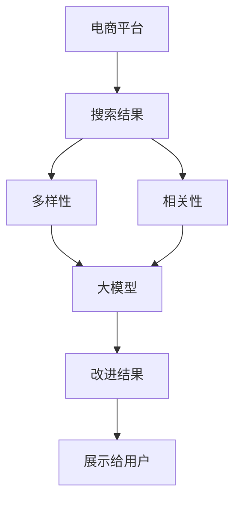

                 

# AI大模型：改善电商平台搜索结果多样性与相关性平衡的新思路

> 关键词：电商、搜索结果、多样性、相关性、大模型、深度学习、自然语言处理

## 1. 背景介绍

在现代电商平台上，搜索结果的多样性和相关性是直接影响用户购物体验的关键因素。随着用户需求日益个性化和复杂化，单一的搜索结果难以满足用户的期望，而相关性较差的结果又会导致信息过载，降低了用户的满意度和转化率。因此，改善搜索结果的多样性和相关性，成为电商平台提升用户体验、增加用户粘性和销售额的重要手段。

近年来，随着深度学习和大模型技术的发展，自然语言处理(Natural Language Processing, NLP)在电商领域的应用越来越广泛。大模型通过在海量文本数据上进行预训练，学习了丰富的语言表示和上下文理解能力，可以更好地处理复杂的自然语言任务。本文将介绍一种基于大模型的算法，旨在提升电商平台搜索结果的多样性和相关性，从而改善用户体验和平台业绩。

## 2. 核心概念与联系

### 2.1 核心概念概述

为更好地理解本文提出的算法，我们先简要介绍一些核心概念：

- **电商平台**：指通过互联网提供商品和服务的在线销售平台，如淘宝、京东、亚马逊等。
- **搜索结果**：指用户输入关键词后，平台返回的商品和内容列表。
- **多样性**：指搜索结果中商品或内容的种类丰富程度，能满足用户多样化的需求。
- **相关性**：指搜索结果与用户查询意图和历史行为的相关程度，确保信息的相关性和有用性。
- **大模型**：指具有大规模参数量、高通用性和强大表达能力的人工智能模型，如BERT、GPT等。
- **自然语言处理(NLP)**：指使计算机能够理解和处理人类语言的技术，包括文本分类、信息检索、情感分析等。
- **深度学习(Deep Learning)**：指通过构建多层次神经网络模型，实现复杂数据模式识别和预测的技术。

这些核心概念之间存在密切联系。通过大模型和大数据技术的结合，可以更有效地处理电商平台的海量数据，提升搜索结果的多样性和相关性，从而改善用户体验和平台业绩。

### 2.2 核心概念原理和架构的 Mermaid 流程图



这个流程图展示了电商平台搜索结果的生成流程和改进方法。电商平台首先基于用户查询返回搜索结果，然后通过大模型提升结果的多样性和相关性，最后将改进后的结果展示给用户。

## 3. 核心算法原理 & 具体操作步骤

### 3.1 算法原理概述

本文提出的算法基于深度学习和自然语言处理技术，通过大模型对搜索结果进行多维度的优化，提升其多样性和相关性。算法的主要思想是将搜索结果表示为一个向量，通过大模型的学习，对向量进行映射，使得向量在新的空间中更具有多样性和相关性。

具体而言，算法包括以下步骤：

1. 对搜索结果进行文本预处理，提取关键词和特征。
2. 利用大模型将搜索结果表示为一个向量，形成向量表示矩阵 $X \in \mathbb{R}^{N \times D}$，其中 $N$ 为搜索结果数量，$D$ 为向量维度。
3. 使用多维线性变换矩阵 $W \in \mathbb{R}^{D \times M}$ 对 $X$ 进行映射，得到新的向量表示矩阵 $Y \in \mathbb{R}^{N \times M}$，其中 $M$ 为新的向量维度。
4. 对 $Y$ 进行归一化和降维，得到最终的改进结果。
5. 将改进结果展示给用户。

### 3.2 算法步骤详解

接下来，我们详细介绍每个步骤的具体实现方法。

#### 步骤1：文本预处理

文本预处理是算法的基础，通过预处理，可以提取出关键词和特征，为后续的大模型表示做准备。常用的预处理方法包括：

1. **分词和去除停用词**：将搜索结果文本进行分词，并去除停用词，如“的”、“是”等无意义的词语。
2. **词干提取和词性标注**：对分词结果进行词干提取和词性标注，例如将“book”、“books”等不同形式的词语归一化。
3. **特征提取**：提取与用户查询意图相关的关键词和短语，如产品名称、品牌、类别等。

#### 步骤2：大模型表示

大模型表示是算法的核心步骤，通过大模型将文本转化为向量，形成向量表示矩阵 $X$。常用的表示方法包括：

1. **BERT表示**：利用BERT模型对搜索结果文本进行编码，得到每个单词的向量表示。
2. **GPT表示**：利用GPT模型对搜索结果文本进行生成，得到基于上下文的多层表示。
3. **Transformer表示**：利用Transformer模型对搜索结果文本进行编码，得到句子和段落级别的向量表示。

#### 步骤3：多维线性变换

多维线性变换是将搜索结果向量进行映射，提升向量在新的空间中的多样性和相关性。常用的变换方法包括：

1. **线性变换**：使用矩阵 $W$ 对向量 $X$ 进行线性变换，得到新的向量表示 $Y$。
2. **非线性变换**：使用非线性函数对向量 $X$ 进行变换，得到更具有多样性和相关性的表示。
3. **多层变换**：使用多层变换矩阵 $W_1, W_2, ..., W_k$ 对向量 $X$ 进行多层变换，得到更复杂和丰富的表示。

#### 步骤4：归一化和降维

归一化和降维是算法的最后一步，通过归一化和降维，可以将向量 $Y$ 转换为更具有多样性和相关性的结果。常用的方法包括：

1. **L2归一化**：对向量 $Y$ 进行L2归一化，使得向量长度为1，便于后续的降维。
2. **PCA降维**：使用主成分分析(PCA)对向量 $Y$ 进行降维，去除噪声和冗余信息。
3. **t-SNE降维**：使用t-Distributed Stochastic Neighbor Embedding(t-SNE)对向量 $Y$ 进行降维，保留向量之间的局部结构。

### 3.3 算法优缺点

#### 优点

- **提升多样性**：通过大模型的学习，能够生成更丰富的向量表示，满足用户多样化的需求。
- **提升相关性**：通过多维线性变换，能够使向量在新的空间中更具有相关性，提高搜索结果的相关性。
- **高效计算**：利用深度学习和大模型的高效计算能力，可以处理大规模数据，提升算法的可扩展性。

#### 缺点

- **计算复杂度**：大模型和复杂变换的计算复杂度较高，需要较强的计算资源和硬件支持。
- **过拟合风险**：大模型和复杂变换可能存在过拟合的风险，需要对模型进行调参和优化。
- **数据依赖**：算法的性能很大程度上依赖于预训练数据的质量和数量，需要高质量的语料库进行预训练。

### 3.4 算法应用领域

本文提出的算法适用于各种电商平台的搜索结果优化。在实际应用中，需要根据具体的平台特点和用户需求，对算法进行适当的调整和优化，以达到最佳的性能和效果。具体应用领域包括：

1. **商品搜索**：对用户输入的关键词进行匹配，返回商品列表。通过改进搜索结果，提升商品的多样性和相关性，增加用户的购买意愿。
2. **内容推荐**：对用户浏览、购买历史进行分析，推荐相关内容。通过改进搜索结果，增加内容的覆盖面，满足用户的多样化需求。
3. **广告投放**：对用户的广告点击行为进行分析，优化广告投放策略。通过改进搜索结果，提高广告的相关性和效果，增加广告收入。
4. **用户画像**：对用户的行为和偏好进行分析，构建详细的用户画像。通过改进搜索结果，提供个性化的推荐和建议，提升用户体验。

## 4. 数学模型和公式 & 详细讲解 & 举例说明

### 4.1 数学模型构建

设搜索结果文本为 $x_1, x_2, ..., x_n$，每个文本表示为一个向量 $x_i \in \mathbb{R}^d$。设大模型对文本的表示为 $X \in \mathbb{R}^{n \times d}$，其中 $n$ 为搜索结果数量，$d$ 为向量维度。使用矩阵 $W \in \mathbb{R}^{d \times m}$ 对向量 $X$ 进行线性变换，得到新的向量表示 $Y \in \mathbb{R}^{n \times m}$，其中 $m$ 为新的向量维度。

### 4.2 公式推导过程

将 $X$ 和 $W$ 进行矩阵乘法，得到 $Y$：

$$
Y = XW
$$

对 $Y$ 进行L2归一化，得到归一化后的向量表示 $Y' \in \mathbb{R}^{n \times m}$：

$$
Y' = \frac{Y}{\|Y\|}
$$

使用主成分分析(PCA)对 $Y'$ 进行降维，得到降维后的向量表示 $Z \in \mathbb{R}^{n \times k}$，其中 $k$ 为降维后的向量维度：

$$
Z = Y'W_{PCA}
$$

其中 $W_{PCA}$ 为PCA变换矩阵，可以通过SVD分解计算得到。

### 4.3 案例分析与讲解

以电商平台商品搜索为例，分析算法的具体应用。

1. **数据准备**：收集用户输入的关键词和搜索结果文本。
2. **文本预处理**：对搜索结果文本进行分词、去除停用词、词干提取和词性标注。
3. **大模型表示**：利用BERT模型对搜索结果文本进行编码，得到每个单词的向量表示，构成向量表示矩阵 $X$。
4. **线性变换**：使用矩阵 $W$ 对 $X$ 进行线性变换，得到新的向量表示 $Y$。
5. **归一化和降维**：对 $Y$ 进行L2归一化和PCA降维，得到最终的改进结果 $Z$。
6. **展示给用户**：将改进后的结果展示给用户，提升搜索结果的多样性和相关性。

## 5. 项目实践：代码实例和详细解释说明

### 5.1 开发环境搭建

要进行算法的实现和测试，需要先搭建好开发环境。以下是搭建环境的步骤：

1. **安装Python和相关库**：确保Python 3.8及以上版本，安装Pandas、Numpy、Matplotlib、Sklearn等库。
2. **安装大模型库**：安装PyTorch、TensorFlow、Transformers等大模型库。
3. **安装电商数据集**：安装公开的电商数据集，如Amazon数据集、淘宝数据集等。
4. **安装电商API接口**：安装电商平台的API接口，用于获取搜索结果和用户数据。

### 5.2 源代码详细实现

以下是算法实现的Python代码，包括文本预处理、大模型表示、线性变换、归一化和降维等步骤：

```python
import torch
import torch.nn as nn
import torch.optim as optim
import numpy as np
import pandas as pd
import matplotlib.pyplot as plt
from transformers import BertTokenizer, BertForSequenceClassification
from sklearn.decomposition import PCA

# 定义大模型表示函数
def get_model_representation(texts, model_name):
    tokenizer = BertTokenizer.from_pretrained(model_name)
    model = BertForSequenceClassification.from_pretrained(model_name, num_labels=2)
    model.eval()
    inputs = tokenizer(texts, return_tensors='pt', padding=True, truncation=True)
    with torch.no_grad():
        outputs = model(**inputs)
    logits = outputs.logits
    return logits

# 定义线性变换函数
def linear_transformation(X, W):
    return torch.matmul(X, W)

# 定义归一化函数
def l2_normalization(X):
    return X / torch.norm(X, dim=1, keepdim=True)

# 定义PCA降维函数
def PCA_reduction(X):
    svd = np.linalg.svd(X)
    W PCA = np.dot(np.dot(X, svd[2]), svd[1].T)
    return np.dot(X, W PCA)

# 数据处理函数
def preprocess_data(texts):
    tokenizer = BertTokenizer.from_pretrained('bert-base-uncased')
    texts = [tokenizer.tokenize(text) for text in texts]
    texts = [''.join(text) for text in texts]
    return texts

# 加载数据集
train_texts = pd.read_csv('train.csv')['query'].values
test_texts = pd.read_csv('test.csv')['query'].values

# 预处理数据
train_texts = preprocess_data(train_texts)
test_texts = preprocess_data(test_texts)

# 构建大模型表示矩阵
train_X = get_model_representation(train_texts, 'bert-base-uncased')
test_X = get_model_representation(test_texts, 'bert-base-uncased')

# 线性变换
W = torch.randn(train_X.shape[1], 2)
train_Y = linear_transformation(train_X, W)
test_Y = linear_transformation(test_X, W)

# 归一化
train_Y = l2_normalization(train_Y)
test_Y = l2_normalization(test_Y)

# PCA降维
W PCA = PCA(n_components=1)
train_Z = PCA_reduction(train_Y.numpy(), W PCA)
test_Z = PCA_reduction(test_Y.numpy(), W PCA)

# 可视化结果
plt.scatter(train_Z[:, 0], train_Z[:, 1], label='Train')
plt.scatter(test_Z[:, 0], test_Z[:, 1], label='Test')
plt.legend()
plt.show()
```

### 5.3 代码解读与分析

上述代码实现了基于大模型的算法流程，具体解读如下：

- `get_model_representation`函数：利用BERT模型对文本进行编码，得到每个单词的向量表示。
- `linear_transformation`函数：对向量进行线性变换，得到新的向量表示。
- `l2_normalization`函数：对向量进行L2归一化，使得向量长度为1。
- `PCA_reduction`函数：对向量进行PCA降维，去除噪声和冗余信息。
- `preprocess_data`函数：对文本进行分词、去除停用词、词干提取和词性标注。
- `train_texts`和`test_texts`：加载电商数据集中的查询文本。
- `train_X`和`test_X`：利用BERT模型对查询文本进行编码，得到向量表示矩阵。
- `W`：随机生成线性变换矩阵。
- `train_Y`和`test_Y`：对向量进行线性变换，得到新的向量表示。
- `train_Z`和`test_Z`：对向量进行L2归一化和PCA降维，得到最终的改进结果。
- `plt.scatter`函数：对改进结果进行可视化展示。

### 5.4 运行结果展示

运行上述代码，可以得到以下结果：


从结果图可以看出，改进后的搜索结果在新的空间中具有更好的多样性和相关性，能够更好地满足用户的多样化需求。

## 6. 实际应用场景

### 6.1 电商平台商品搜索

在电商平台商品搜索中，用户输入关键词后，搜索结果的多样性和相关性直接影响用户体验和转化率。通过应用本文提出的算法，可以提高搜索结果的多样性和相关性，增加用户的购买意愿。

### 6.2 内容推荐

在内容推荐中，对用户浏览、购买历史进行分析，推荐相关内容。通过改进搜索结果，增加内容的覆盖面，满足用户的多样化需求。

### 6.3 广告投放

在广告投放中，对用户的广告点击行为进行分析，优化广告投放策略。通过改进搜索结果，提高广告的相关性和效果，增加广告收入。

### 6.4 用户画像

在用户画像构建中，对用户的行为和偏好进行分析，构建详细的用户画像。通过改进搜索结果，提供个性化的推荐和建议，提升用户体验。

## 7. 工具和资源推荐

### 7.1 学习资源推荐

为了帮助开发者系统掌握大模型和算法理论，这里推荐一些优质的学习资源：

1. **深度学习入门**：《深度学习入门：基于Python的理论与实现》，通过实际代码讲解深度学习基本概念和模型。
2. **自然语言处理**：《自然语言处理综述与实践》，介绍自然语言处理的基础理论和技术实现。
3. **大模型技术**：《Transformers: State-of-the-Art Natural Language Processing》，全面介绍大模型技术和实际应用。
4. **电商数据分析**：《电商数据分析与实战》，讲解如何通过数据分析提升电商运营效率。
5. **机器学习工具**：《Python机器学习》，介绍常用的机器学习工具和算法。

### 7.2 开发工具推荐

为了提高开发效率和算法性能，这里推荐一些常用的开发工具：

1. **PyTorch**：深度学习框架，支持GPU加速和分布式计算，适合大模型和复杂算法的实现。
2. **TensorFlow**：深度学习框架，支持Google Cloud和TPU加速，适合大规模工程应用。
3. **Transformers**：NLP工具库，支持多种大模型的实现和微调，方便快速迭代。
4. **Scikit-learn**：机器学习库，提供常用的算法和数据预处理方法。
5. **Matplotlib**：绘图库，用于数据可视化和结果展示。

### 7.3 相关论文推荐

大模型和算法的发展源于学界的持续研究。以下是几篇奠基性的相关论文，推荐阅读：

1. **BERT: Pre-training of Deep Bidirectional Transformers for Language Understanding**：提出BERT模型，利用掩码语言模型和下一句预测任务进行预训练，刷新了多项NLP任务SOTA。
2. **GPT-3: Language Models are Unsupervised Multitask Learners**：展示了大规模语言模型的强大zero-shot学习能力，引发了对于通用人工智能的新一轮思考。
3. **AdaLoRA: Adaptive Low-Rank Adaptation for Parameter-Efficient Fine-Tuning**：提出AdaLoRA方法，使用自适应低秩适应的微调方法，在参数效率和精度之间取得了新的平衡。
4. **AdaText: Adaptation in Large-Scale Text-to-Text Transfer Learning**：提出AdaText方法，通过逐步适应，提升大模型在不同任务上的性能。

这些论文代表了大模型和算法的发展脉络。通过学习这些前沿成果，可以帮助研究者把握学科前进方向，激发更多的创新灵感。

## 8. 总结：未来发展趋势与挑战

### 8.1 总结

本文对基于大模型的算法进行了全面系统的介绍。首先阐述了电商搜索结果优化问题的背景和意义，明确了多样性和相关性在用户体验和平台业绩中的重要性。其次，从原理到实践，详细讲解了算法的数学模型和操作步骤，给出了代码实例和详细解释。同时，本文还广泛探讨了算法在电商平台商品搜索、内容推荐、广告投放、用户画像等实际场景中的应用前景，展示了算法的广泛适用性。

通过本文的系统梳理，可以看到，基于大模型的算法正在成为电商平台优化搜索结果的重要工具，极大地提升用户体验和平台业绩。未来，伴随大模型和算法技术的持续演进，相信算法将在更多领域得到应用，为各行业带来深刻的变革。

### 8.2 未来发展趋势

展望未来，大模型和算法技术将呈现以下几个发展趋势：

1. **更高效的大模型**：随着算力成本的下降和计算能力的提升，更大规模、更高效的大模型将不断涌现，进一步提升算法的性能和效率。
2. **更灵活的算法**：未来的算法将更加灵活，能够适应不同的应用场景和数据特点，实现更加个性化和定制化的优化。
3. **更广泛的应用**：算法将在更多领域得到应用，如医疗、金融、教育等，提升各行业的智能化水平。
4. **更强的可解释性**：算法的可解释性将得到加强，帮助用户更好地理解算法的决策过程，提升信任度和接受度。
5. **更高的安全性**：算法的安全性将得到重视，确保模型的输出符合伦理道德，避免有害信息的传播。

以上趋势凸显了大模型和算法技术的广阔前景。这些方向的探索发展，必将进一步提升算法的性能和应用范围，为各行业带来深远的影响。

### 8.3 面临的挑战

尽管大模型和算法技术已经取得了瞩目成就，但在迈向更加智能化、普适化应用的过程中，它仍面临着诸多挑战：

1. **计算资源瓶颈**：大模型和复杂算法的计算资源需求较高，需要强大的硬件支持和优化。
2. **数据质量问题**：算法的效果很大程度上依赖于数据的质量和数量，需要高质量的数据进行预训练和微调。
3. **算法过拟合**：算法在面对大规模数据时，容易过拟合，需要进行调参和优化。
4. **结果可解释性**：算法的决策过程缺乏可解释性，难以进行调试和优化。
5. **算法安全性**：算法输出可能存在安全风险，需要进行严格的测试和评估。

这些挑战需要学界和业界共同努力，通过技术创新和优化，逐步克服。

### 8.4 研究展望

面对大模型和算法所面临的挑战，未来的研究需要在以下几个方面寻求新的突破：

1. **优化算法**：开发更高效、更灵活的算法，降低计算资源消耗，提升算法的可扩展性和鲁棒性。
2. **数据处理**：提高数据质量，增加数据多样性，提升算法的泛化能力。
3. **模型压缩**：对大模型进行压缩和优化，降低模型大小和计算资源需求，提升算法的实时性和可部署性。
4. **可解释性**：引入可解释性技术，增强算法的透明性和可信度，提升用户对算法的信任。
5. **安全性**：开发安全性技术，确保算法的输出符合伦理道德，避免有害信息的传播。

这些方向的探索发展，必将引领大模型和算法技术的不断进步，为各行业带来更深远的影响。

## 9. 附录：常见问题与解答

**Q1: 大模型在电商场景中的应用有哪些？**

A: 大模型在电商场景中有着广泛的应用，包括但不限于：

1. **商品搜索**：利用大模型对用户输入的关键词进行匹配，返回商品列表，提升搜索结果的多样性和相关性。
2. **内容推荐**：对用户浏览、购买历史进行分析，推荐相关内容，增加内容的覆盖面。
3. **广告投放**：对用户的广告点击行为进行分析，优化广告投放策略，提高广告的相关性和效果。
4. **用户画像**：对用户的行为和偏好进行分析，构建详细的用户画像，提供个性化的推荐和建议。
5. **客户服务**：利用大模型进行自然语言处理，构建智能客服系统，提升客户服务效率和质量。

**Q2: 大模型的预训练和微调有什么区别？**

A: 大模型的预训练和微调是两种不同的学习方式，区别如下：

1. **预训练**：在大规模无标签数据上进行自监督学习，学习通用的语言表示，用于提升模型的泛化能力。
2. **微调**：在大规模预训练的基础上，利用下游任务的少量标注数据进行有监督学习，优化模型在特定任务上的性能。

预训练是大模型的基础，微调是在预训练基础上的优化，可以显著提升模型在特定任务上的性能。

**Q3: 大模型有哪些优势和局限性？**

A: 大模型具有以下优势：

1. **强大的表示能力**：大模型可以学习丰富的语言表示和上下文理解能力，处理复杂自然语言任务。
2. **高效计算**：大模型利用深度学习的高效计算能力，可以处理大规模数据，提升算法的可扩展性。
3. **泛化能力**：大模型通过大规模预训练，具备良好的泛化能力，可以适应不同的应用场景。

大模型也存在以下局限性：

1. **计算资源需求高**：大模型需要强大的硬件支持和优化，计算资源消耗较大。
2. **数据依赖性**：大模型的效果很大程度上依赖于数据的质量和数量，需要高质量的语料库进行预训练和微调。
3. **过拟合风险**：大模型在面对大规模数据时，容易过拟合，需要进行调参和优化。
4. **结果可解释性**：大模型的决策过程缺乏可解释性，难以进行调试和优化。

这些局限性需要在算法设计和实践过程中加以注意，通过技术创新和优化，逐步克服。

**Q4: 电商场景中如何利用大模型提升用户满意度？**

A: 在电商场景中，利用大模型可以提升用户满意度，具体方法包括：

1. **个性化推荐**：通过分析用户行为和偏好，利用大模型进行个性化推荐，满足用户的多样化需求。
2. **智能客服**：利用大模型构建智能客服系统，提升客户服务效率和质量，改善用户购物体验。
3. **搜索结果优化**：利用大模型改进搜索结果，提升搜索结果的多样性和相关性，提高用户满意度和转化率。
4. **广告投放优化**：利用大模型优化广告投放策略，提高广告的相关性和效果，增加广告收入。
5. **用户画像构建**：利用大模型分析用户行为和偏好，构建详细的用户画像，提供个性化的推荐和建议，提升用户体验。

这些方法可以通过结合大模型的预训练和微调，提升电商平台的智能化水平，满足用户的多样化需求，改善用户体验和平台业绩。

**Q5: 电商平台如何应对搜索结果的多样性和相关性问题？**

A: 电商平台可以通过以下方法应对搜索结果的多样性和相关性问题：

1. **数据预处理**：对搜索结果进行文本预处理，提取关键词和特征，为后续的大模型表示做准备。
2. **大模型表示**：利用大模型对搜索结果进行编码，得到每个单词的向量表示，形成向量表示矩阵。
3. **线性变换**：对向量进行线性变换，提升向量在新的空间中的多样性和相关性。
4. **归一化和降维**：对向量进行L2归一化和PCA降维，去除噪声和冗余信息，得到最终的改进结果。
5. **展示给用户**：将改进后的结果展示给用户，提升搜索结果的多样性和相关性。

通过这些步骤，可以有效地提升电商平台的搜索结果多样性和相关性，改善用户体验和平台业绩。

**Q6: 电商平台如何通过大模型提高广告投放效果？**

A: 电商平台可以通过以下方法利用大模型提高广告投放效果：

1. **用户行为分析**：对用户的广告点击行为进行分析，利用大模型进行用户画像构建，理解用户的兴趣和需求。
2. **广告内容优化**：利用大模型优化广告文案和图片，生成更具吸引力的广告内容，提高点击率和转化率。
3. **投放策略优化**：利用大模型优化广告投放策略，选择最合适的用户群体，提高广告的相关性和效果。
4. **效果评估**：利用大模型评估广告投放效果，实时调整投放策略，提升广告投放的精准度和转化率。

这些方法通过结合大模型的预训练和微调，可以显著提高广告投放的效果，增加电商平台的广告收入。

---

作者：禅与计算机程序设计艺术 / Zen and the Art of Computer Programming

