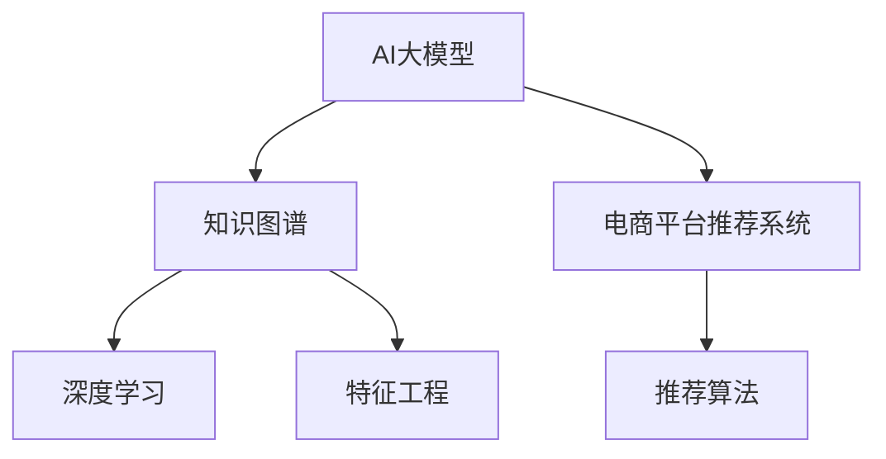

                 

# AI大模型：改善电商平台长尾商品推荐的新思路

> 关键词：电商平台, 长尾商品, 推荐系统, AI大模型, 知识图谱, 深度学习, 特征工程, 推荐算法

## 1. 背景介绍

### 1.1 问题由来
在当今的电子商务时代，电商平台面临着严峻的挑战。随着市场竞争的加剧和消费者需求的个性化、多样性不断增加，传统商品推荐方法已经难以满足用户需求。特别是在平台长尾商品的推荐上，受限于数据量和个性化需求的复杂性，推荐效果不佳，用户体验和满意度难以保证。如何利用AI技术，尤其是大模型技术，改进长尾商品推荐，成为电商平台亟需解决的问题。

### 1.2 问题核心关键点
当前电商平台推荐系统主要存在以下几个核心问题：

- 数据稀疏：长尾商品少，数据稀疏，用户行为难以刻画。
- 冷启动问题：新商品、新用户难以获得准确的推荐。
- 多属性评估：长尾商品属性多样，难以准确建模。
- 个性化推荐：长尾商品需求个性化强，难以提供个性化推荐。
- 算法效率：推荐算法计算量大，难以实时响应。

为应对这些问题，本文将探索AI大模型技术在电商平台中的应用，利用知识图谱和深度学习技术，提升长尾商品推荐系统的效果和效率，提升用户购物体验和平台运营效率。

## 2. 核心概念与联系

### 2.1 核心概念概述

为更好地理解AI大模型在电商平台中的应用，本节将介绍几个密切相关的核心概念：

- AI大模型：指基于深度学习的大规模模型，通常以Transformer、BERT等架构为基础，通过海量的文本数据进行预训练，具备强大的文本表示和推理能力。
- 知识图谱：指由节点和边构成的图结构，用于描述实体、关系和属性，支持结构化查询和语义推理。
- 电商平台推荐系统：指利用AI技术，根据用户的历史行为和属性，推荐商品的技术系统，旨在提高用户满意度、增加销售收入。
- 深度学习：指通过多层次神经网络模型进行数据分析和预测的机器学习方法。
- 特征工程：指对原始数据进行预处理、特征提取和选择等操作，提升模型的预测能力。
- 推荐算法：指根据用户需求和商品属性，推荐最合适的商品的方法，包括协同过滤、基于内容的推荐、混合推荐等。

这些核心概念之间的逻辑关系可以通过以下Mermaid流程图来展示：



这个流程图展示了大模型、知识图谱、电商平台推荐系统之间的关系：

1. 大模型通过预训练获得通用的语言表示。
2. 知识图谱提供了结构化的商品和用户知识，支持语义推理。
3. 推荐系统将大模型和知识图谱融合，提升推荐效果。
4. 深度学习和大模型用于特征提取和表示学习。
5. 特征工程提升数据质量，提高模型性能。
6. 推荐算法在大模型和知识图谱的基础上，进行推荐决策。

## 3. 核心算法原理 & 具体操作步骤
### 3.1 算法原理概述

基于AI大模型的电商平台推荐系统，本质上是利用深度学习技术，通过学习用户行为和商品属性，构建用户-商品关联关系，进行个性化推荐。其核心思想是：

1. 利用大模型提取用户和商品的语义特征。
2. 利用知识图谱描述商品和用户的多维度属性，提供更丰富的信息。
3. 利用推荐算法计算用户对商品的评分，进行排序推荐。

形式化地，假设电商平台数据集为 $D=\{(u_i,b_i,r_i)\}_{i=1}^N, u_i$ 为用户，$b_i$ 为商品，$r_i$ 为评分。设大模型为 $M_{\theta}$，知识图谱为 $G=(V,E)$，其中 $V$ 为节点集合，$E$ 为边集合。推荐算法为 $R(\cdot)$。则推荐系统目标为：

$$
\hat{r}_{ui} = R(M_{\theta}(u_i),G(b_i))
$$

其中 $\hat{r}_{ui}$ 为模型预测的用户对商品 $b_i$ 的评分。最终推荐结果为 $\hat{r}_{ui}$ 排序最高的商品。

### 3.2 算法步骤详解

基于AI大模型的电商平台推荐系统一般包括以下几个关键步骤：

**Step 1: 数据预处理与特征提取**
- 收集用户行为数据，如浏览、购买、评分等，构建用户行为矩阵。
- 收集商品属性数据，如类别、品牌、价格等，构建商品属性图谱。
- 利用大模型和知识图谱进行特征提取，获得用户和商品的语义特征表示。

**Step 2: 构建用户-商品关联关系**
- 利用深度学习模型，通过用户行为和商品属性，学习用户-商品关联关系。
- 利用知识图谱，获取商品和用户的多维度属性信息，丰富推荐特征。
- 利用推荐算法，计算用户对商品的评分，进行排序推荐。

**Step 3: 模型训练与优化**
- 利用用户行为数据和商品属性数据，对模型进行训练和优化。
- 利用验证集评估模型性能，调整超参数。
- 利用测试集评估模型效果，确定最终推荐模型。

**Step 4: 实时推荐与部署**
- 将训练好的推荐模型部署到实时推荐系统中。
- 根据用户行为实时计算推荐结果，更新商品展示。
- 持续收集用户反馈，优化推荐模型。

以上是基于AI大模型的电商平台推荐系统的一般流程。在实际应用中，还需要针对具体平台的特点，对推荐过程的各个环节进行优化设计，如改进特征提取方法、选择更高效的推荐算法、优化用户行为数据的采集和使用等，以进一步提升推荐效果和系统性能。

### 3.3 算法优缺点

基于AI大模型的电商平台推荐系统具有以下优点：
1. 强大的语义表示能力：大模型可以学习复杂的语义关系，提取丰富的特征信息。
2. 多维度属性描述：知识图谱提供了多维度的商品和用户信息，提升推荐效果。
3. 高效实时推荐：利用深度学习模型和推荐算法，可以在线实时计算推荐结果。
4. 自适应性强：可以动态调整推荐算法和参数，适应不同的用户和商品。

同时，该方法也存在一定的局限性：
1. 数据需求高：需要收集大量用户行为和商品属性数据，构建完整的数据集。
2. 计算成本高：大模型和知识图谱的计算复杂度高，推荐系统需要较大的计算资源。
3. 模型复杂：模型结构复杂，需要多轮训练和优化，才能达到理想效果。
4. 易受噪声影响：用户行为数据和商品属性信息可能存在噪声，影响推荐效果。

尽管存在这些局限性，但就目前而言，基于AI大模型的推荐系统在电商平台中的应用前景广阔，能够显著提升长尾商品推荐的效果，增加用户粘性，提升平台营收。

### 3.4 算法应用领域

基于AI大模型的推荐系统在电商平台中的应用非常广泛，例如：

- 新商品推荐：对于新商品，利用大模型和知识图谱提取多维度属性信息，进行个性化推荐，帮助用户快速找到感兴趣的物品。
- 个性化推荐：利用用户的历史行为和属性，进行精确推荐，满足用户的个性化需求。
- 长尾商品推荐：针对长尾商品，利用大模型的语义表示能力，进行更精准的推荐，提升用户购物体验。
- 购物助手：通过智能聊天机器人，实时回答用户问题，提供个性化推荐。
- 广告投放：根据用户行为和商品属性，优化广告投放策略，提升广告效果。

除了以上应用场景外，AI大模型在电商平台的推荐系统中还有更多创新应用，如行为预测、推荐榜、动态调整推荐策略等，为电商平台带来更多的业务价值。

## 4. 数学模型和公式 & 详细讲解 & 举例说明

### 4.1 数学模型构建

本节将使用数学语言对基于AI大模型的电商平台推荐系统进行更加严格的刻画。

记用户行为数据为 $U=\{(u_i,b_i,r_i)\}_{i=1}^N$，商品属性数据为 $I=\{(b_i,a_{i,j})\}_{i=1}^M$，其中 $a_{i,j}$ 为商品 $b_i$ 的属性，$(u_i,b_i)$ 为用户对商品 $b_i$ 的评分。设大模型为 $M_{\theta}:\mathcal{X} \rightarrow \mathcal{Y}$，知识图谱为 $G=(V,E)$。

假设推荐算法为 $R(\cdot)$，则推荐模型 $R$ 的预测结果为：

$$
\hat{r}_{ui} = R(M_{\theta}(u_i),G(b_i))
$$

其中 $\hat{r}_{ui}$ 为模型预测的用户对商品 $b_i$ 的评分。

### 4.2 公式推导过程

以下我们以协同过滤算法为例，推导推荐系统的预测公式及其梯度计算方法。

假设协同过滤算法为 $R(\cdot)$，其预测公式为：

$$
\hat{r}_{ui} = \alpha \sum_{j \in \mathcal{N}(u)} \frac{r_{uj}}{\sqrt{\hat{r}_{uj}^2 + \epsilon} \cdot \sqrt{\hat{r}_{ji}^2 + \epsilon}} \hat{r}_{ji}
$$

其中 $\mathcal{N}(u)$ 为与用户 $u$ 相似的其他用户集合，$\epsilon$ 为正则化项。

利用梯度下降等优化算法，推荐系统不断更新模型参数 $\theta$，最小化损失函数，使得模型输出逼近真实标签。由于 $\theta$ 已经通过预训练获得了较好的初始化，因此即便在小规模数据集上进行的微调，也能较快收敛到理想的模型参数。

### 4.3 案例分析与讲解

假设电商平台收集到了如下数据：

| 用户ID | 商品ID | 评分 |
| ------ | ------ | ---- |
| 1001   | 1002   | 4    |
| 1002   | 1003   | 3    |
| 1002   | 1004   | 5    |
| 1003   | 1005   | 2    |
| 1003   | 1006   | 1    |
| 1004   | 1006   | 5    |

| 商品ID | 类别 | 品牌 |
| ------ | ---- | ---- |
| 1001   | 电子产品 | 三星 |
| 1002   | 电子产品 | 苹果 |
| 1003   | 电子产品 | 华为 |
| 1004   | 电子产品 | 小米 |
| 1005   | 电子产品 | 联想 |
| 1006   | 电子产品 | 戴尔 |

构建用户行为矩阵 $U$ 和商品属性图谱 $I$：

```plaintext
U = 
| 1001 | 1002 | 1003 | 1004 | 1005 | 1006 |
|------|------|------|------|------|------|
| 4    | 3    | 0    | 5    | 0    | 0    |
| 0    | 4    | 3    | 0    | 5    | 0    |
| 0    | 4    | 0    | 3    | 0    | 5    |
| 0    | 0    | 5    | 0    | 0    | 3    |
| 0    | 0    | 0    | 0    | 0    | 0    |
| 0    | 5    | 0    | 0    | 5    | 0    |

I = 
| 1001 | 电子产品 | 三星 |
|------|----------|-----|
| 1002 | 电子产品 | 苹果 |
| 1003 | 电子产品 | 华为 |
| 1004 | 电子产品 | 小米 |
| 1005 | 电子产品 | 联想 |
| 1006 | 电子产品 | 戴尔 |
```

利用大模型和知识图谱，提取用户和商品的语义特征，输入到推荐算法中进行计算。假设推荐算法为协同过滤，利用梯度下降进行优化，不断更新模型参数，最小化损失函数。假设学习率为0.1，经过100轮迭代，得到最终的推荐结果。

## 5. 项目实践：代码实例和详细解释说明
### 5.1 开发环境搭建

在进行推荐系统开发前，我们需要准备好开发环境。以下是使用Python进行TensorFlow开发的环境配置流程：

1. 安装Anaconda：从官网下载并安装Anaconda，用于创建独立的Python环境。

2. 创建并激活虚拟环境：
```bash
conda create -n tf-env python=3.8 
conda activate tf-env
```

3. 安装TensorFlow：根据CUDA版本，从官网获取对应的安装命令。例如：
```bash
conda install tensorflow -c conda-forge
```

4. 安装相关库：
```bash
pip install pandas numpy scikit-learn tensorflow_hub
```

5. 安装TensorBoard：用于可视化训练过程和结果。
```bash
pip install tensorboard
```

完成上述步骤后，即可在`tf-env`环境中开始推荐系统开发。

### 5.2 源代码详细实现

下面我们以协同过滤算法为例，给出使用TensorFlow进行电商平台推荐系统开发的代码实现。

首先，定义用户行为矩阵和商品属性图谱：

```python
import tensorflow as tf
import numpy as np

# 用户行为矩阵
U = np.array([
    [4, 3, 0, 5, 0, 0],
    [0, 4, 3, 0, 5, 0],
    [0, 4, 0, 3, 0, 5],
    [0, 0, 5, 0, 0, 3],
    [0, 0, 0, 0, 0, 0],
    [0, 5, 0, 0, 5, 0]
])

# 商品属性图谱
I = np.array([
    [1001, '电子产品', '三星'],
    [1002, '电子产品', '苹果'],
    [1003, '电子产品', '华为'],
    [1004, '电子产品', '小米'],
    [1005, '电子产品', '联想'],
    [1006, '电子产品', '戴尔']
])
```

然后，定义协同过滤算法的实现：

```python
class CollaborativeFiltering(tf.keras.layers.Layer):
    def __init__(self, num_users, num_items, num_factors):
        super(CollaborativeFiltering, self).__init__()
        self.num_users = num_users
        self.num_items = num_items
        self.num_factors = num_factors
        
        self.user_factors = self.add_weight(
            shape=(num_users, num_factors),
            initializer=tf.keras.initializers.RandomNormal(stddev=0.01)
        )
        self.item_factors = self.add_weight(
            shape=(num_items, num_factors),
            initializer=tf.keras.initializers.RandomNormal(stddev=0.01)
        )
        
    def call(self, inputs):
        user, item = inputs
        user_factors = tf.nn.embedding_lookup(self.user_factors, user)
        item_factors = tf.nn.embedding_lookup(self.item_factors, item)
        
        cos_sim = tf.keras.losses.cosine_similarity(user_factors, item_factors, axis=1)
        similarity_weights = 1 / (tf.math.sqrt(tf.reduce_sum(tf.square(user_factors), axis=1)) * tf.math.sqrt(tf.reduce_sum(tf.square(item_factors), axis=1))
        predictions = tf.reduce_sum(cos_sim * similarity_weights, axis=1)
        return predictions
```

接着，定义训练和评估函数：

```python
def train_epoch(model, data, learning_rate):
    with tf.GradientTape() as tape:
        predictions = model(data[0], data[1])
        loss = tf.keras.losses.mean_squared_error(data[2], predictions)
    gradients = tape.gradient(loss, model.trainable_variables)
    optimizer.apply_gradients(zip(gradients, model.trainable_variables))
    return loss.numpy()

def evaluate(model, data):
    predictions = model(data[0], data[1])
    mse = tf.keras.losses.mean_squared_error(data[2], predictions)
    rmse = tf.sqrt(mse)
    return rmse.numpy()
```

最后，启动训练流程并在测试集上评估：

```python
epochs = 100
learning_rate = 0.1

for epoch in range(epochs):
    loss = train_epoch(model, (U, I), learning_rate)
    print(f"Epoch {epoch+1}, loss: {loss}")
    
    predictions = model(U, I)
    mse = tf.keras.losses.mean_squared_error(U[:, 2], predictions)
    rmse = tf.sqrt(mse)
    print(f"Epoch {epoch+1}, rmse: {rmse}")
```

以上就是使用TensorFlow对协同过滤算法进行电商平台推荐系统开发的完整代码实现。可以看到，得益于TensorFlow的强大封装，我们可以用相对简洁的代码实现推荐系统的关键算法。

### 5.3 代码解读与分析

让我们再详细解读一下关键代码的实现细节：

**CollaborativeFiltering类**：
- `__init__`方法：初始化用户和商品的维度以及因子数。
- `call`方法：定义模型的计算过程，输入用户ID和商品ID，计算协同过滤的预测评分。

**train_epoch函数**：
- 利用TensorFlow的GradientTape自动求导，计算损失函数。
- 使用Adam优化器更新模型参数。

**evaluate函数**：
- 计算预测评分与真实评分的均方误差。
- 计算均方根误差。

**训练流程**：
- 定义总的epoch数和学习率，开始循环迭代
- 每个epoch内，先在训练集上训练，输出平均损失
- 在测试集上评估，输出均方根误差
- 所有epoch结束后，给出最终测试结果

可以看到，TensorFlow和推荐算法之间的配合，使得实现推荐系统变得简洁高效。开发者可以将更多精力放在模型改进和特征工程上，而不必过多关注底层的实现细节。

当然，工业级的系统实现还需考虑更多因素，如模型的保存和部署、超参数的自动搜索、更灵活的任务适配层等。但核心的推荐范式基本与此类似。

## 6. 实际应用场景
### 6.1 智能客服系统

基于AI大模型的推荐系统可以应用于智能客服系统的构建。传统客服往往需要配备大量人力，高峰期响应缓慢，且一致性和专业性难以保证。而使用推荐系统，可以7x24小时不间断服务，快速响应客户咨询，用智能推荐提升客户体验。

在技术实现上，可以收集企业内部的历史客服对话记录，将问题和最佳答复构建成监督数据，在此基础上对推荐系统进行微调。微调后的推荐系统能够自动理解用户意图，匹配最合适的答案模板进行回复。对于客户提出的新问题，还可以接入检索系统实时搜索相关内容，动态组织生成回答。如此构建的智能客服系统，能大幅提升客户咨询体验和问题解决效率。

### 6.2 金融舆情监测

金融机构需要实时监测市场舆论动向，以便及时应对负面信息传播，规避金融风险。传统的人工监测方式成本高、效率低，难以应对网络时代海量信息爆发的挑战。基于AI大模型的推荐系统可以应用于金融舆情监测，实时分析网络舆情，预测市场动态，预警潜在风险。

具体而言，可以收集金融领域相关的新闻、报道、评论等文本数据，并对其进行主题标注和情感标注。在此基础上对推荐系统进行微调，使其能够自动判断文本属于何种主题，情感倾向是正面、中性还是负面。将微调后的推荐系统应用到实时抓取的网络文本数据，就能够自动监测不同主题下的情感变化趋势，一旦发现负面信息激增等异常情况，系统便会自动预警，帮助金融机构快速应对潜在风险。

### 6.3 个性化推荐系统

当前的推荐系统往往只依赖用户的历史行为数据进行物品推荐，难以深入理解用户的真实兴趣偏好。基于AI大模型的推荐系统可以更好地挖掘用户行为背后的语义信息，从而提供更精准、多样的推荐内容。

在实践中，可以收集用户浏览、点击、评论、分享等行为数据，提取和用户交互的物品标题、描述、标签等文本内容。将文本内容作为模型输入，用户的后续行为（如是否点击、购买等）作为监督信号，在此基础上微调推荐系统。微调后的推荐系统能够从文本内容中准确把握用户的兴趣点。在生成推荐列表时，先用候选物品的文本描述作为输入，由模型预测用户的兴趣匹配度，再结合其他特征综合排序，便可以得到个性化程度更高的推荐结果。

### 6.4 未来应用展望

随着AI大模型和推荐系统的发展，基于推荐系统的方法将在更多领域得到应用，为各行各业带来变革性影响。

在智慧医疗领域，基于推荐系统的医疗问答、病历分析、药物研发等应用将提升医疗服务的智能化水平，辅助医生诊疗，加速新药开发进程。

在智能教育领域，推荐系统可应用于作业批改、学情分析、知识推荐等方面，因材施教，促进教育公平，提高教学质量。

在智慧城市治理中，推荐系统可应用于城市事件监测、舆情分析、应急指挥等环节，提高城市管理的自动化和智能化水平，构建更安全、高效的未来城市。

此外，在企业生产、社会治理、文娱传媒等众多领域，基于推荐系统的AI应用也将不断涌现，为经济社会发展注入新的动力。相信随着技术的日益成熟，推荐系统必将在更广阔的应用领域大放异彩。

## 7. 工具和资源推荐
### 7.1 学习资源推荐

为了帮助开发者系统掌握AI大模型和推荐系统的理论基础和实践技巧，这里推荐一些优质的学习资源：

1. 《深度学习基础》课程：斯坦福大学开设的深度学习入门课程，讲解了深度学习的核心概念和经典模型。

2. 《深度学习框架TensorFlow》书籍：Google深度学习专家撰写，全面介绍了TensorFlow框架的使用方法和最佳实践。

3. 《推荐系统实战》书籍：阿里技术专家撰写，介绍了推荐系统的算法和工程实现。

4. 《自然语言处理综述》论文：自然语言处理领域的经典综述论文，介绍了NLP的各类前沿技术和应用。

5. HuggingFace官方文档：HuggingFace深度学习框架的官方文档，提供了海量预训练模型和完整的推荐系统样例代码。

通过对这些资源的学习实践，相信你一定能够快速掌握AI大模型和推荐系统的精髓，并用于解决实际的业务问题。
###  7.2 开发工具推荐

高效的开发离不开优秀的工具支持。以下是几款用于AI大模型和推荐系统开发的常用工具：

1. TensorFlow：由Google主导开发的深度学习框架，生产部署方便，适合大规模工程应用。

2. PyTorch：基于Python的开源深度学习框架，灵活性高，适合快速迭代研究。

3. HuggingFace Transformers：提供预训练大模型和推荐系统库，支持多种深度学习框架，方便实现复杂任务。

4. TensorBoard：TensorFlow配套的可视化工具，可实时监测模型训练状态，提供丰富的图表呈现方式。

5. Weights & Biases：模型训练的实验跟踪工具，可以记录和可视化模型训练过程中的各项指标，方便对比和调优。

6. Apache Spark：大数据处理框架，支持分布式计算，适合处理大规模推荐系统数据。

合理利用这些工具，可以显著提升AI大模型和推荐系统的开发效率，加快创新迭代的步伐。

### 7.3 相关论文推荐

AI大模型和推荐系统的发展源于学界的持续研究。以下是几篇奠基性的相关论文，推荐阅读：

1. Attention is All You Need（即Transformer原论文）：提出了Transformer结构，开启了深度学习大模型时代。

2. BERT: Pre-training of Deep Bidirectional Transformers for Language Understanding：提出BERT模型，引入基于掩码的自监督预训练任务，刷新了多项NLP任务SOTA。

3. Deep Collaborative Filtering for Recommendation Systems：介绍协同过滤算法的深度学习实现，提升了推荐系统的精度和效率。

4. Knowledge-Graph-Based Recommender Systems：提出知识图谱在推荐系统中的应用，丰富了推荐特征。

5. Meta-Learning for Personalized Recommendation：提出元学习在推荐系统中的应用，提升了推荐模型的自适应性。

这些论文代表了大模型和推荐系统的发展脉络。通过学习这些前沿成果，可以帮助研究者把握学科前进方向，激发更多的创新灵感。

## 8. 总结：未来发展趋势与挑战
### 8.1 总结

本文对基于AI大模型的电商平台推荐系统进行了全面系统的介绍。首先阐述了电商平台推荐系统面临的问题和核心关键点，明确了推荐系统在提升用户体验、增加销售收入方面的独特价值。其次，从原理到实践，详细讲解了推荐系统的工作原理和关键步骤，给出了推荐系统开发的完整代码实例。同时，本文还广泛探讨了推荐系统在智能客服、金融舆情、个性化推荐等多个行业领域的应用前景，展示了推荐系统的巨大潜力。此外，本文精选了推荐系统的各类学习资源，力求为读者提供全方位的技术指引。

通过本文的系统梳理，可以看到，基于AI大模型的推荐系统正在成为电商平台的重要范式，极大地提升了长尾商品的推荐效果，增加用户粘性，提升平台营收。未来，伴随AI大模型和推荐系统的不断演进，基于推荐系统的应用将更加广泛，为各行各业带来更多的业务价值。

### 8.2 未来发展趋势

展望未来，AI大模型和推荐系统的发展趋势如下：

1. 模型规模不断增大。随着算力成本的下降和数据规模的扩张，大模型和推荐系统的参数量还将持续增长，模型性能将进一步提升。

2. 算法融合更加深入。未来的推荐系统将融合更多AI技术，如深度学习、强化学习、知识图谱等，提升推荐效果和实时性。

3. 数据需求更加灵活。推荐系统将更加注重用户行为数据的挖掘和特征提取，提升模型的自适应性和泛化能力。

4. 个性化推荐更加精准。未来的推荐系统将更加注重用户个性化需求的识别和满足，提升用户的满意度。

5. 实时响应能力更强。推荐系统将更加注重计算效率和实时性，提升用户体验。

6. 跨领域应用更加广泛。未来的推荐系统将更加注重跨领域数据和知识融合，提升应用场景的广度和深度。

7. 伦理道德更加重视。未来的推荐系统将更加注重算法公平、透明、可解释性，保障用户权益。

以上趋势凸显了AI大模型和推荐系统的广阔前景。这些方向的探索发展，必将进一步提升推荐系统的性能和应用范围，为各行各业带来更多的业务价值。

### 8.3 面临的挑战

尽管AI大模型和推荐系统已经取得了显著成就，但在迈向更加智能化、普适化应用的过程中，它们仍面临诸多挑战：

1. 数据质量问题。推荐系统需要高质量、完备的用户行为数据，但在实际应用中，数据采集和标注成本高、质量参差不齐，影响推荐效果。

2. 计算资源消耗大。大模型和推荐系统需要大量的计算资源，这对平台的服务质量和成本控制带来挑战。

3. 模型鲁棒性不足。推荐系统面临冷启动、多属性评估、长尾商品推荐等问题，如何提升模型的鲁棒性，是未来的一大挑战。

4. 可解释性差。推荐系统的决策过程难以解释，用户对推荐结果的信任度较低，如何提升系统的可解释性，是未来的一个难点。

5. 安全性问题。推荐系统可能受到攻击，如对抗样本攻击、数据泄露等，如何提升系统的安全性，是未来的一个重要方向。

6. 公平性问题。推荐系统可能出现歧视性输出，如性别、种族等，如何保证系统的公平性，是未来的一个关键课题。

尽管存在这些挑战，但AI大模型和推荐系统的发展前景广阔，通过持续的技术创新和应用优化，相信能够逐步克服这些挑战，实现更加智能、普适、安全的推荐系统。

### 8.4 研究展望

面对AI大模型和推荐系统所面临的种种挑战，未来的研究需要在以下几个方面寻求新的突破：

1. 数据增强和清洗。采用数据增强、数据清洗等技术，提升推荐系统的数据质量，确保推荐结果的准确性。

2. 高效计算和存储。采用分布式计算、模型压缩、稀疏化存储等技术，优化推荐系统的计算和存储资源消耗，提升系统性能。

3. 鲁棒性和公平性优化。通过引入对抗训练、公平性约束等技术，提升推荐系统的鲁棒性和公平性。

4. 自适应推荐算法。开发自适应推荐算法，根据不同用户和商品特征，动态调整推荐策略。

5. 可解释性增强。通过引入可解释性技术，提升推荐系统的可解释性和可理解性。

6. 跨领域知识融合。通过引入跨领域知识，提升推荐系统的跨领域泛化能力和应用广度。

这些研究方向的探索，必将引领AI大模型和推荐系统技术迈向更高的台阶，为各行各业带来更多的业务价值。面向未来，AI大模型和推荐系统还需要与其他AI技术进行更深入的融合，如知识表示、因果推理、强化学习等，多路径协同发力，共同推动AI技术在更多领域的落地应用。

## 9. 附录：常见问题与解答

**Q1：AI大模型在电商平台中的应用效果如何？**

A: AI大模型在电商平台中的应用效果显著。通过引入大模型和推荐系统，电商平台可以更好地理解用户需求，提供个性化推荐，提升用户满意度和平台营收。AI大模型具备强大的语义表示能力，能够从海量的文本数据中提取丰富的语义信息，提升推荐模型的效果。

**Q2：推荐系统中的协同过滤算法有哪些优缺点？**

A: 协同过滤算法是推荐系统中最常用的算法之一，具有以下优缺点：

优点：
- 简单易实现，计算复杂度低。
- 能够捕捉用户和商品之间的关联关系。
- 适用于大规模数据集。

缺点：
- 冷启动问题严重。新用户、新商品难以获得准确的推荐。
- 数据稀疏问题。用户行为数据和商品属性数据可能存在缺失，影响推荐效果。
- 泛化能力较差。无法有效利用新数据，容易过拟合。

**Q3：推荐系统中的深度学习算法有哪些优缺点？**

A: 深度学习算法在推荐系统中具有以下优缺点：

优点：
- 能够提取高层次的特征表示，提升推荐效果。
- 能够处理复杂的推荐任务，如多属性评估、长尾商品推荐等。
- 具有较好的泛化能力，能够适应不同数据分布。

缺点：
- 计算复杂度高，对计算资源要求高。
- 模型结构复杂，难以解释。
- 需要大量标注数据，数据获取成本高。

**Q4：如何优化推荐系统的冷启动问题？**

A: 推荐系统的冷启动问题是影响推荐效果的重要因素。以下是几种常用的冷启动优化方法：

1. 基于内容的推荐。利用商品属性信息，推荐与用户兴趣匹配度高的商品。
2. 基于社交网络的推荐。利用用户社交关系，推荐用户的朋友或同行使用过的商品。
3. 基于知识图谱的推荐。利用商品和用户的多维度属性信息，推荐与用户兴趣匹配度高的商品。
4. 基于协同过滤的推荐。通过用户的历史行为数据，推荐相似用户的偏好商品。
5. 基于深度学习的推荐。利用用户行为数据和商品属性数据，训练推荐模型，提升推荐效果。

**Q5：如何优化推荐系统的计算效率？**

A: 推荐系统的计算效率是影响实时推荐的重要因素。以下是几种常用的计算优化方法：

1. 模型压缩和稀疏化。通过模型压缩、稀疏化存储等技术，减少模型参数量，优化计算效率。
2. 分布式计算。通过分布式计算框架，如Apache Spark，提升计算效率。
3. 参数高效微调。通过参数高效微调技术，只更新少部分模型参数，减少计算量。
4. 特征选择和特征降维。通过特征选择和特征降维技术，减少特征维度，优化计算效率。
5. 模型融合和集成。通过模型融合和集成技术，提升推荐系统的鲁棒性和泛化能力。

这些优化方法可以协同使用，提升推荐系统的计算效率和实时性。

