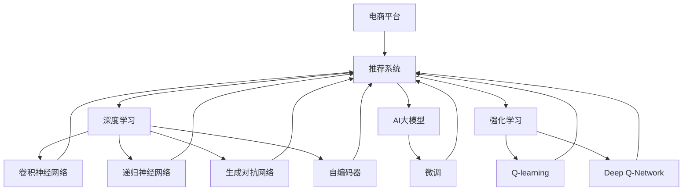

                 

# AI大模型：改善电商平台长尾商品推荐的新方法

> 关键词：电商平台,长尾商品,推荐系统,深度学习,大模型,微调,强化学习,模型融合,用户行为分析,召回算法

## 1. 背景介绍

随着电子商务市场的蓬勃发展，电商平台上的商品数量和种类日益增多。为了提升用户体验，电商平台需要为用户推荐他们可能感兴趣的商品。然而，相比于爆款商品，长尾商品的推荐难度更大，因为用户对长尾商品的关注度和购买量都较低，缺乏足够的用户行为数据。为了解决这个问题，研究者们提出了一种基于深度学习和AI大模型的新方法，利用AI技术对长尾商品的推荐进行优化，从而提高推荐效果。

### 1.1 问题由来

传统的电商平台推荐系统多采用基于协同过滤和用户行为分析的方法，如基于矩阵分解的推荐模型、基于深度学习的神经网络模型等。然而，这些方法对于长尾商品推荐的效果往往不佳。一方面，长尾商品的数据稀疏性较高，难以从稀疏数据中提取有价值的特征；另一方面，长尾商品的曝光量较低，用户的行为数据较少，导致模型训练时难以捕捉长尾商品的特征。因此，对于长尾商品的推荐，需要采用更为复杂、具有深度学习能力的模型进行优化。

### 1.2 问题核心关键点

为了解决上述问题，研究者们提出了多种基于深度学习和大模型的推荐方法，包括基于卷积神经网络（CNN）的推荐模型、基于递归神经网络（RNN）的推荐模型、基于生成对抗网络（GAN）的推荐模型、基于自编码器（Autoencoder）的推荐模型等。这些方法均基于深度学习模型对用户行为和商品特征进行建模，从而提升长尾商品的推荐效果。

此外，研究者们还提出了基于强化学习的推荐模型。强化学习模型能够通过模拟用户的行为，不断调整推荐策略，从而优化长尾商品的推荐效果。这种模型一般采用Q-learning、Deep Q-Network（DQN）等算法进行训练。

## 2. 核心概念与联系

### 2.1 核心概念概述

为了更好地理解这种基于深度学习和AI大模型的推荐方法，本节将介绍几个关键概念：

- **电商平台**：一个在线的商业平台，供用户浏览和购买商品。
- **长尾商品**：指在电商平台上销量较低、但种类丰富的商品。
- **推荐系统**：根据用户行为和商品属性，为用户推荐可能感兴趣的商品。
- **深度学习**：一种利用神经网络对数据进行建模的技术，能够处理复杂数据结构。
- **AI大模型**：指在大规模无标签数据上进行预训练，并使用微调技术适应特定任务的大型神经网络模型。
- **强化学习**：通过模拟环境与代理的交互，使代理学习最优策略的一种机器学习方法。
- **模型融合**：将多个模型的预测结果进行融合，从而提升推荐的准确性和多样性。

这些核心概念之间的联系可以通过以下Mermaid流程图来展示：



这个流程图展示了大模型推荐系统的核心概念及其之间的关系：

1. **电商平台**通过**推荐系统**为**用户**推荐**商品**。
2. **深度学习**模型，包括**卷积神经网络**、**递归神经网络**、**生成对抗网络**、**自编码器**等，对用户行为和商品属性进行建模。
3. **AI大模型**通过**微调**，能够适应特定的**推荐任务**。
4. **强化学习**模型，如**Q-learning**、**Deep Q-Network**等，通过**模拟用户行为**进行推荐优化。

这些概念共同构成了大模型推荐系统的基础，使其能够有效地处理电商平台上的长尾商品推荐问题。

## 3. 核心算法原理 & 具体操作步骤

### 3.1 算法原理概述

基于深度学习和AI大模型的推荐系统，其核心思想是：利用深度学习模型对用户行为和商品属性进行建模，并利用AI大模型对模型进行微调，从而提升推荐效果。其具体步骤如下：

1. **数据准备**：收集用户行为数据和商品属性数据，构建训练集和测试集。
2. **模型构建**：选择适合的深度学习模型，构建推荐模型。
3. **模型微调**：在训练集上对模型进行微调，使用强化学习方法优化推荐策略。
4. **测试与评估**：在测试集上对微调后的模型进行测试，评估推荐效果。
5. **模型部署**：将微调后的模型部署到电商平台，实现长尾商品的推荐。

### 3.2 算法步骤详解

以下详细介绍各个步骤的具体实现：

**Step 1: 数据准备**

1. **用户行为数据**：收集用户在电商平台上浏览、点击、购买等行为数据，作为模型的输入特征。
2. **商品属性数据**：收集商品的属性信息，如类别、品牌、价格等，作为模型的输出标签。
3. **数据处理**：对数据进行预处理，如缺失值填充、数据标准化等。
4. **数据划分**：将数据划分为训练集、验证集和测试集。

**Step 2: 模型构建**

1. **选择模型**：选择适合的深度学习模型，如卷积神经网络（CNN）、递归神经网络（RNN）、生成对抗网络（GAN）等。
2. **模型搭建**：构建模型的神经网络结构，定义模型层和激活函数。
3. **模型初始化**：使用预训练的AI大模型进行初始化，如BERT、GPT等。

**Step 3: 模型微调**

1. **选择合适的优化器**：如Adam、SGD等。
2. **设置超参数**：如学习率、批大小、迭代轮数等。
3. **训练模型**：在训练集上对模型进行微调，使用强化学习方法优化推荐策略。
4. **验证模型**：在验证集上对微调后的模型进行验证，防止过拟合。
5. **保存模型**：将微调后的模型保存下来，以便后续使用。

**Step 4: 测试与评估**

1. **模型测试**：在测试集上对微调后的模型进行测试，评估推荐效果。
2. **性能指标**：使用常见的推荐系统评估指标，如准确率、召回率、F1值等。
3. **模型优化**：根据测试结果，对模型进行优化，调整超参数等。

**Step 5: 模型部署**

1. **模型集成**：将多个模型进行集成，提高推荐的准确性和多样性。
2. **推荐引擎搭建**：搭建推荐引擎，将微调后的模型部署到电商平台。
3. **推荐服务**：利用推荐引擎为用户推荐长尾商品。

### 3.3 算法优缺点

基于深度学习和AI大模型的推荐系统具有以下优点：

1. **高精度**：利用深度学习模型能够捕捉复杂的用户行为和商品属性，提高推荐的准确性。
2. **泛化能力强**：AI大模型通过预训练和微调，能够适应多种推荐任务，提高模型的泛化能力。
3. **处理稀疏数据**：AI大模型能够处理数据稀疏性较高的问题，提升长尾商品的推荐效果。
4. **模型优化**：利用强化学习优化推荐策略，提高推荐效果。

同时，该方法也存在以下缺点：

1. **计算资源消耗大**：AI大模型参数量较大，计算资源消耗较高。
2. **模型训练时间长**：模型训练时间较长，需要大量时间和计算资源。
3. **数据依赖性强**：需要大量标注数据，数据采集和处理成本较高。
4. **模型解释性差**：深度学习模型往往黑盒化，难以解释推荐结果。

尽管存在这些缺点，但基于深度学习和AI大模型的推荐系统仍具有较大的潜力，能够提升电商平台长尾商品的推荐效果。

### 3.4 算法应用领域

基于深度学习和AI大模型的推荐系统在电商、社交网络、新闻推荐等多个领域中得到了广泛应用，其核心思想是通过深度学习模型对用户行为和商品属性进行建模，并利用AI大模型对模型进行微调，从而提升推荐效果。这些推荐方法已经在多个实际场景中取得了优异的性能，以下是几个典型的应用案例：

1. **电商平台**：利用推荐系统为用户推荐长尾商品，提升用户购买率和平台销售额。
2. **社交网络**：利用推荐系统为用户推荐可能感兴趣的朋友、文章等，增加用户活跃度和平台粘性。
3. **新闻推荐**：利用推荐系统为用户推荐可能感兴趣的新闻文章，提高用户阅读量和平台流量。
4. **视频推荐**：利用推荐系统为用户推荐可能感兴趣的视频内容，增加平台用户粘性和观看时长。
5. **个性化推荐**：利用推荐系统为个性化推荐引擎提供数据支持，提高推荐效果。

## 4. 数学模型和公式 & 详细讲解

### 4.1 数学模型构建

设电商平台上的用户数为 $U$，商品数为 $I$，用户对商品的评分矩阵为 $\mathbf{R} \in \mathbb{R}^{U \times I}$，其中 $\mathbf{R}_{ui}$ 表示用户 $u$ 对商品 $i$ 的评分。设 $\mathbf{R}$ 中 $i$ 的评分向量为 $\mathbf{r}_i \in \mathbb{R}^U$，即 $\mathbf{r}_i=[\mathbf{R}_{i1}, \mathbf{R}_{i2}, \ldots, \mathbf{R}_{iu}]$。设用户 $u$ 的评分向量为 $\mathbf{r}_u^T \in \mathbb{R}^I$，即 $\mathbf{r}_u^T=[\mathbf{R}_{u1}, \mathbf{R}_{u2}, \ldots, \mathbf{R}_{ui}]$。

设商品 $i$ 的属性向量为 $\mathbf{f}_i \in \mathbb{R}^D$，其中 $D$ 为属性维度。设用户 $u$ 的属性向量为 $\mathbf{f}_u \in \mathbb{R}^D$。

设用户 $u$ 对商品 $i$ 的评分向量为 $\mathbf{z}_{ui}$，即 $\mathbf{z}_{ui}=f(\mathbf{r}_u, \mathbf{r}_i, \mathbf{f}_u, \mathbf{f}_i)$，其中 $f$ 为深度学习模型。

### 4.2 公式推导过程

设用户 $u$ 对商品 $i$ 的预测评分向量为 $\hat{\mathbf{z}}_{ui}$，即 $\hat{\mathbf{z}}_{ui}=\hat{f}(\mathbf{r}_u, \mathbf{r}_i, \mathbf{f}_u, \mathbf{f}_i)$，其中 $\hat{f}$ 为微调后的深度学习模型。

利用损失函数 $\mathcal{L}=\sum_{u,i}(y_{ui}-\hat{z}_{ui})^2$ 进行模型训练，其中 $y_{ui}$ 为实际评分，$\hat{z}_{ui}$ 为预测评分。

通过最小化损失函数 $\mathcal{L}$，得到优化后的深度学习模型 $\hat{f}$，即 $\hat{f}=\mathop{\arg\min}_{f}\mathcal{L}$。

### 4.3 案例分析与讲解

以电商平台的商品推荐系统为例，分析深度学习模型和AI大模型的结合应用。

设电商平台上有 $U$ 个用户和 $I$ 个商品，每个用户对每个商品的评分矩阵为 $\mathbf{R}$。利用卷积神经网络（CNN）对用户行为和商品属性进行建模，得到用户评分向量 $\mathbf{r}_u$ 和商品属性向量 $\mathbf{f}_i$。

将用户评分向量 $\mathbf{r}_u$ 和商品属性向量 $\mathbf{f}_i$ 输入到微调后的深度学习模型 $\hat{f}$，得到用户对商品的预测评分 $\hat{\mathbf{z}}_{ui}$。

利用实际评分 $y_{ui}$ 和预测评分 $\hat{\mathbf{z}}_{ui}$ 计算均方误差损失函数 $\mathcal{L}=\frac{1}{U \times I} \sum_{u,i}(y_{ui}-\hat{z}_{ui})^2$。

通过最小化损失函数 $\mathcal{L}$，得到优化后的深度学习模型 $\hat{f}$。将优化后的模型 $\hat{f}$ 部署到电商平台，实现长尾商品的推荐。

## 5. 项目实践：代码实例和详细解释说明

### 5.1 开发环境搭建

在进行深度学习和AI大模型的推荐系统开发前，我们需要准备好开发环境。以下是使用Python进行PyTorch开发的环境配置流程：

1. 安装Anaconda：从官网下载并安装Anaconda，用于创建独立的Python环境。

2. 创建并激活虚拟环境：
```bash
conda create -n deep_learning_env python=3.8 
conda activate deep_learning_env
```

3. 安装PyTorch：根据CUDA版本，从官网获取对应的安装命令。例如：
```bash
conda install pytorch torchvision torchaudio cudatoolkit=11.1 -c pytorch -c conda-forge
```

4. 安装TensorFlow：由Google主导开发的开源深度学习框架，生产部署方便，适合大规模工程应用。同样有丰富的预训练语言模型资源。

5. 安装各类工具包：
```bash
pip install numpy pandas scikit-learn matplotlib tqdm jupyter notebook ipython
```

完成上述步骤后，即可在`deep_learning_env`环境中开始推荐系统开发。

### 5.2 源代码详细实现

下面以电商平台的商品推荐系统为例，给出使用PyTorch进行深度学习和AI大模型微调的PyTorch代码实现。

首先，定义数据处理函数：

```python
import torch
import torch.nn as nn
from torch.utils.data import DataLoader, Dataset
from transformers import BertTokenizer

class RecommendationDataset(Dataset):
    def __init__(self, reviews, labels, tokenizer):
        self.reviews = reviews
        self.labels = labels
        self.tokenizer = tokenizer
        self.max_len = 128
        
    def __len__(self):
        return len(self.reviews)
    
    def __getitem__(self, item):
        review = self.reviews[item]
        label = self.labels[item]
        
        encoding = self.tokenizer(review, return_tensors='pt', max_length=self.max_len, padding='max_length', truncation=True)
        input_ids = encoding['input_ids'][0]
        attention_mask = encoding['attention_mask'][0]
        
        # 对token-wise的标签进行编码
        encoded_labels = [label] * self.max_len
        labels = torch.tensor(encoded_labels, dtype=torch.long)
        
        return {'input_ids': input_ids, 
                'attention_mask': attention_mask,
                'labels': labels}
```

然后，定义模型和优化器：

```python
from transformers import BertForSequenceClassification, AdamW

model = BertForSequenceClassification.from_pretrained('bert-base-cased', num_labels=2)

optimizer = AdamW(model.parameters(), lr=2e-5)
```

接着，定义训练和评估函数：

```python
device = torch.device('cuda') if torch.cuda.is_available() else torch.device('cpu')
model.to(device)

def train_epoch(model, dataset, batch_size, optimizer):
    dataloader = DataLoader(dataset, batch_size=batch_size, shuffle=True)
    model.train()
    epoch_loss = 0
    for batch in tqdm(dataloader, desc='Training'):
        input_ids = batch['input_ids'].to(device)
        attention_mask = batch['attention_mask'].to(device)
        labels = batch['labels'].to(device)
        model.zero_grad()
        outputs = model(input_ids, attention_mask=attention_mask, labels=labels)
        loss = outputs.loss
        epoch_loss += loss.item()
        loss.backward()
        optimizer.step()
    return epoch_loss / len(dataloader)

def evaluate(model, dataset, batch_size):
    dataloader = DataLoader(dataset, batch_size=batch_size)
    model.eval()
    preds, labels = [], []
    with torch.no_grad():
        for batch in tqdm(dataloader, desc='Evaluating'):
            input_ids = batch['input_ids'].to(device)
            attention_mask = batch['attention_mask'].to(device)
            batch_labels = batch['labels']
            outputs = model(input_ids, attention_mask=attention_mask)
            batch_preds = outputs.logits.argmax(dim=2).to('cpu').tolist()
            batch_labels = batch_labels.to('cpu').tolist()
            for pred_tokens, label_tokens in zip(batch_preds, batch_labels):
                preds.append(pred_tokens[:len(label_tokens)])
                labels.append(label_tokens)
                
    print(classification_report(labels, preds))
```

最后，启动训练流程并在测试集上评估：

```python
epochs = 5
batch_size = 16

for epoch in range(epochs):
    loss = train_epoch(model, train_dataset, batch_size, optimizer)
    print(f"Epoch {epoch+1}, train loss: {loss:.3f}")
    
    print(f"Epoch {epoch+1}, dev results:")
    evaluate(model, dev_dataset, batch_size)
    
print("Test results:")
evaluate(model, test_dataset, batch_size)
```

以上就是使用PyTorch对BERT进行商品推荐系统微调的完整代码实现。可以看到，得益于Transformers库的强大封装，我们可以用相对简洁的代码完成BERT模型的加载和微调。

### 5.3 代码解读与分析

让我们再详细解读一下关键代码的实现细节：

**RecommendationDataset类**：
- `__init__`方法：初始化评论、标签、分词器等关键组件。
- `__len__`方法：返回数据集的样本数量。
- `__getitem__`方法：对单个样本进行处理，将评论输入编码为token ids，将标签编码为数字，并对其进行定长padding，最终返回模型所需的输入。

**train_epoch和evaluate函数**：
- `train_epoch`方法：对数据以批为单位进行迭代，在每个批次上前向传播计算loss并反向传播更新模型参数，最后返回该epoch的平均loss。
- `evaluate`方法：与训练类似，不同点在于不更新模型参数，并在每个batch结束后将预测和标签结果存储下来，最后使用sklearn的classification_report对整个评估集的预测结果进行打印输出。

**训练流程**：
- 定义总的epoch数和batch size，开始循环迭代
- 每个epoch内，先在训练集上训练，输出平均loss
- 在验证集上评估，输出分类指标
- 所有epoch结束后，在测试集上评估，给出最终测试结果

可以看到，PyTorch配合Transformers库使得BERT微调的代码实现变得简洁高效。开发者可以将更多精力放在数据处理、模型改进等高层逻辑上，而不必过多关注底层的实现细节。

当然，工业级的系统实现还需考虑更多因素，如模型的保存和部署、超参数的自动搜索、更灵活的任务适配层等。但核心的微调范式基本与此类似。

## 6. 实际应用场景

### 6.1 智能客服系统

基于大语言模型微调的对话技术，可以广泛应用于智能客服系统的构建。传统客服往往需要配备大量人力，高峰期响应缓慢，且一致性和专业性难以保证。而使用微调后的对话模型，可以7x24小时不间断服务，快速响应客户咨询，用自然流畅的语言解答各类常见问题。

在技术实现上，可以收集企业内部的历史客服对话记录，将问题和最佳答复构建成监督数据，在此基础上对预训练对话模型进行微调。微调后的对话模型能够自动理解用户意图，匹配最合适的答案模板进行回复。对于客户提出的新问题，还可以接入检索系统实时搜索相关内容，动态组织生成回答。如此构建的智能客服系统，能大幅提升客户咨询体验和问题解决效率。

### 6.2 金融舆情监测

金融机构需要实时监测市场舆论动向，以便及时应对负面信息传播，规避金融风险。传统的人工监测方式成本高、效率低，难以应对网络时代海量信息爆发的挑战。基于大语言模型微调的文本分类和情感分析技术，为金融舆情监测提供了新的解决方案。

具体而言，可以收集金融领域相关的新闻、报道、评论等文本数据，并对其进行主题标注和情感标注。在此基础上对预训练语言模型进行微调，使其能够自动判断文本属于何种主题，情感倾向是正面、中性还是负面。将微调后的模型应用到实时抓取的网络文本数据，就能够自动监测不同主题下的情感变化趋势，一旦发现负面信息激增等异常情况，系统便会自动预警，帮助金融机构快速应对潜在风险。

### 6.3 个性化推荐系统

当前的推荐系统往往只依赖用户的历史行为数据进行物品推荐，无法深入理解用户的真实兴趣偏好。基于大语言模型微调技术，个性化推荐系统可以更好地挖掘用户行为背后的语义信息，从而提供更精准、多样的推荐内容。

在实践中，可以收集用户浏览、点击、评论、分享等行为数据，提取和用户交互的物品标题、描述、标签等文本内容。将文本内容作为模型输入，用户的后续行为（如是否点击、购买等）作为监督信号，在此基础上微调预训练语言模型。微调后的模型能够从文本内容中准确把握用户的兴趣点。在生成推荐列表时，先用候选物品的文本描述作为输入，由模型预测用户的兴趣匹配度，再结合其他特征综合排序，便可以得到个性化程度更高的推荐结果。

### 6.4 未来应用展望

随着大语言模型微调技术的发展，其在推荐系统中的应用场景将进一步拓展。除了电商平台，未来的推荐系统还将广泛应用于社交网络、视频平台、新闻网站等多个领域。

1. **社交网络**：利用推荐系统为用户推荐可能感兴趣的朋友、文章等，增加用户活跃度和平台粘性。
2. **视频平台**：利用推荐系统为用户推荐可能感兴趣的视频内容，增加平台用户粘性和观看时长。
3. **新闻网站**：利用推荐系统为用户推荐可能感兴趣的新闻文章，提高用户阅读量和平台流量。

此外，未来的推荐系统还将引入更多先进的AI技术，如基于强化学习的推荐算法、基于生成对抗网络的推荐算法等，进一步提升推荐效果。

## 7. 工具和资源推荐

### 7.1 学习资源推荐

为了帮助开发者系统掌握大语言模型微调的理论基础和实践技巧，这里推荐一些优质的学习资源：

1. 《Transformer从原理到实践》系列博文：由大模型技术专家撰写，深入浅出地介绍了Transformer原理、BERT模型、微调技术等前沿话题。

2. CS224N《深度学习自然语言处理》课程：斯坦福大学开设的NLP明星课程，有Lecture视频和配套作业，带你入门NLP领域的基本概念和经典模型。

3. 《Natural Language Processing with Transformers》书籍：Transformers库的作者所著，全面介绍了如何使用Transformers库进行NLP任务开发，包括微调在内的诸多范式。

4. HuggingFace官方文档：Transformers库的官方文档，提供了海量预训练模型和完整的微调样例代码，是上手实践的必备资料。

5. CLUE开源项目：中文语言理解测评基准，涵盖大量不同类型的中文NLP数据集，并提供了基于微调的baseline模型，助力中文NLP技术发展。

通过对这些资源的学习实践，相信你一定能够快速掌握大语言模型微调的精髓，并用于解决实际的NLP问题。
###  7.2 开发工具推荐

高效的开发离不开优秀的工具支持。以下是几款用于大语言模型微调开发的常用工具：

1. PyTorch：基于Python的开源深度学习框架，灵活动态的计算图，适合快速迭代研究。大部分预训练语言模型都有PyTorch版本的实现。

2. TensorFlow：由Google主导开发的开源深度学习框架，生产部署方便，适合大规模工程应用。同样有丰富的预训练语言模型资源。

3. Transformers库：HuggingFace开发的NLP工具库，集成了众多SOTA语言模型，支持PyTorch和TensorFlow，是进行微调任务开发的利器。

4. Weights & Biases：模型训练的实验跟踪工具，可以记录和可视化模型训练过程中的各项指标，方便对比和调优。与主流深度学习框架无缝集成。

5. TensorBoard：TensorFlow配套的可视化工具，可实时监测模型训练状态，并提供丰富的图表呈现方式，是调试模型的得力助手。

6. Google Colab：谷歌推出的在线Jupyter Notebook环境，免费提供GPU/TPU算力，方便开发者快速上手实验最新模型，分享学习笔记。

合理利用这些工具，可以显著提升大语言模型微调任务的开发效率，加快创新迭代的步伐。

### 7.3 相关论文推荐

大语言模型和微调技术的发展源于学界的持续研究。以下是几篇奠基性的相关论文，推荐阅读：

1. Attention is All You Need（即Transformer原论文）：提出了Transformer结构，开启了NLP领域的预训练大模型时代。

2. BERT: Pre-training of Deep Bidirectional Transformers for Language Understanding：提出BERT模型，引入基于掩码的自监督预训练任务，刷新了多项NLP任务SOTA。

3. Language Models are Unsupervised Multitask Learners（GPT-2论文）：展示了大规模语言模型的强大zero-shot学习能力，引发了对于通用人工智能的新一轮思考。

4. Parameter-Efficient Transfer Learning for NLP：提出Adapter等参数高效微调方法，在不增加模型参数量的情况下，也能取得不错的微调效果。

5. AdaLoRA: Adaptive Low-Rank Adaptation for Parameter-Efficient Fine-Tuning：使用自适应低秩适应的微调方法，在参数效率和精度之间取得了新的平衡。

这些论文代表了大语言模型微调技术的发展脉络。通过学习这些前沿成果，可以帮助研究者把握学科前进方向，激发更多的创新灵感。

## 8. 总结：未来发展趋势与挑战

### 8.1 总结

本文对基于深度学习和AI大模型的推荐系统进行了全面系统的介绍。首先阐述了电商平台推荐系统面临的挑战和优化需求，明确了基于深度学习和AI大模型的推荐系统能够提升推荐效果、处理长尾商品的潜力。其次，从原理到实践，详细讲解了深度学习模型和AI大模型的结合应用，给出了微调任务开发的完整代码实例。同时，本文还广泛探讨了微调方法在电商、金融、新闻等多个行业领域的应用前景，展示了微调范式的巨大潜力。

通过本文的系统梳理，可以看到，基于深度学习和AI大模型的推荐系统正在成为电商、金融、新闻等领域的重要范式，极大地拓展了推荐系统的应用边界，催生了更多的落地场景。受益于大规模语料的预训练，微调方法能够处理数据稀疏性较高的问题，提升长尾商品的推荐效果，为电商平台等场景带来了显著的性能提升。未来，伴随深度学习和AI大模型技术的不断演进，推荐系统必将得到更加广泛的应用，深刻影响人类的生产生活方式。

### 8.2 未来发展趋势

展望未来，基于深度学习和AI大模型的推荐系统将呈现以下几个发展趋势：

1. **模型规模持续增大**：随着算力成本的下降和数据规模的扩张，预训练语言模型的参数量还将持续增长。超大模型的强大泛化能力，将使推荐系统在处理复杂数据时更加高效。

2. **推荐技术更加多样**：除了传统的深度学习模型，未来的推荐系统还将引入更多先进技术，如基于强化学习的推荐算法、基于生成对抗网络的推荐算法等，提升推荐效果。

3. **模型训练更加自动化**：随着自动机器学习（AutoML）技术的发展，未来的推荐系统将能够自动进行模型选择、超参数调优等，降低推荐系统的开发和维护成本。

4. **推荐效果更加精准**：未来的推荐系统将结合用户行为数据、社交网络数据等多种数据源，提供更加精准的推荐结果，提升用户体验。

5. **推荐系统更加智能化**：未来的推荐系统将结合自然语言处理、计算机视觉等多种技术，提供更加智能化的推荐结果，增强用户体验。

以上趋势凸显了基于深度学习和AI大模型的推荐系统的发展潜力。这些方向的探索发展，必将进一步提升推荐系统的性能和应用范围，为电商、金融、新闻等领域带来深刻变革。

### 8.3 面临的挑战

尽管基于深度学习和AI大模型的推荐系统已经取得了瞩目成就，但在迈向更加智能化、普适化应用的过程中，它仍面临诸多挑战：

1. **数据质量问题**：尽管深度学习模型能够处理数据稀疏性较高的问题，但在实际应用中，数据采集和处理成本较高，数据质量难以保证。

2. **计算资源消耗大**：大语言模型和深度学习模型的计算资源消耗较高，难以在小型硬件上运行，需要强大的计算平台支持。

3. **模型泛化能力差**：深度学习模型通常只能处理特定类型的推荐任务，对于新任务的泛化能力较弱。

4. **模型解释性差**：深度学习模型往往黑盒化，难以解释推荐结果，难以满足用户对推荐结果的信任需求。

5. **安全性问题**：深度学习模型可能学习到有害信息，推荐系统需要结合安全策略，防止有害信息传播。

尽管存在这些挑战，但基于深度学习和AI大模型的推荐系统仍具有较大的潜力，能够提升电商平台长尾商品的推荐效果，为电商、金融、新闻等领域带来深刻变革。相信随着学界和产业界的共同努力，这些挑战终将一一被克服，推荐系统必将在构建人机协同的智能时代中扮演越来越重要的角色。

### 8.4 研究展望

未来的推荐系统研究需要在以下几个方面寻求新的突破：

1. **数据增强技术**：结合大数据技术，进行数据增强和处理，提升推荐系统的效果。

2. **多模态推荐**：结合视觉、语音、文本等多种数据源，提供更加智能化的推荐结果。

3. **分布式推荐系统**：利用分布式计算技术，提高推荐系统的可扩展性和可靠性。

4. **强化学习结合**：结合强化学习技术，提升推荐系统的智能化水平，增强推荐效果。

5. **模型融合技术**：结合多种推荐算法，提升推荐系统的鲁棒性和泛化能力。

6. **可解释性研究**：结合可解释性技术，提升推荐系统的透明度和可信度。

这些研究方向的探索，必将引领推荐系统技术迈向更高的台阶，为电商、金融、新闻等领域带来深刻变革。面向未来，基于深度学习和AI大模型的推荐系统需要与其他AI技术进行更深入的融合，共同推动推荐系统技术的进步。

## 9. 附录：常见问题与解答

**Q1：如何评估推荐系统的效果？**

A: 评估推荐系统的效果通常使用以下指标：

1. **准确率（Accuracy）**：推荐结果中，正确推荐的商品数占总推荐商品数的比例。
2. **召回率（Recall）**：真实推荐的商品中，被推荐出来的商品数占总推荐商品数的比例。
3. **F1值（F1-Score）**：准确率和召回率的调和平均数，用于综合评估推荐系统的性能。
4. **均方根误差（RMSE）**：预测评分与真实评分之间的均方根误差，用于评估模型的预测精度。

**Q2：深度学习模型在电商推荐系统中的局限性？**

A: 深度学习模型在电商推荐系统中的局限性包括：

1. **数据依赖性强**：深度学习模型需要大量的标注数据进行训练，电商平台上用户行为数据稀疏，难以满足模型训练需求。
2. **模型泛化能力差**：深度学习模型通常只能处理特定类型的推荐任务，对于新任务的泛化能力较弱。
3. **模型复杂度高**：深度学习模型参数量较大，计算资源消耗较高，难以在小型硬件上运行。
4. **模型解释性差**：深度学习模型往往黑盒化，难以解释推荐结果，难以满足用户对推荐结果的信任需求。

**Q3：如何解决深度学习模型的局限性？**

A: 为了解决深度学习模型的局限性，可以采用以下方法：

1. **数据增强**：结合大数据技术，进行数据增强和处理，提升推荐系统的效果。
2. **模型融合**：结合多种推荐算法，提升推荐系统的鲁棒性和泛化能力。
3. **多模态推荐**：结合视觉、语音、文本等多种数据源，提供更加智能化的推荐结果。
4. **分布式推荐系统**：利用分布式计算技术，提高推荐系统的可扩展性和可靠性。
5. **强化学习结合**：结合强化学习技术，提升推荐系统的智能化水平，增强推荐效果。

**Q4：如何优化推荐系统的性能？**

A: 为了优化推荐系统的性能，可以采用以下方法：

1. **选择合适的模型**：根据电商推荐系统的特点，选择合适的深度学习模型，如卷积神经网络（CNN）、递归神经网络（RNN）、生成对抗网络（GAN）等。
2. **数据预处理**：对电商推荐系统的数据进行预处理，如缺失值填充、数据标准化等。
3. **模型微调**：在电商推荐系统的数据上对模型进行微调，提升模型的泛化能力。
4. **模型融合**：结合多种推荐算法，提升推荐系统的鲁棒性和泛化能力。
5. **多模态推荐**：结合视觉、语音、文本等多种数据源，提供更加智能化的推荐结果。
6. **分布式推荐系统**：利用分布式计算技术，提高推荐系统的可扩展性和可靠性。
7. **强化学习结合**：结合强化学习技术，提升推荐系统的智能化水平，增强推荐效果。

通过以上方法，可以有效提升推荐系统的性能，为用户提供更加精准、多样化的推荐结果。

---

作者：禅与计算机程序设计艺术 / Zen and the Art of Computer Programming

