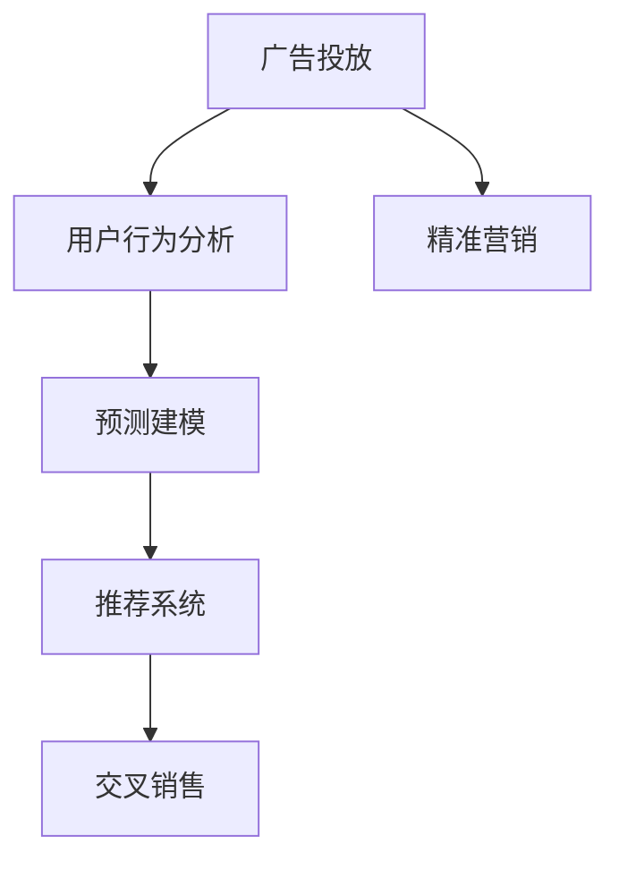

                 

# AI如何优化电商平台的广告投放策略

> 关键词：电商广告投放, AI优化, 精准营销, 用户行为分析, 预测建模

## 1. 背景介绍

随着电子商务的迅猛发展，商家对广告投放的精确性和效率提出了更高的要求。过去，商家常常根据经验或者粗略的数据分析来规划广告投放，这种方式存在很大的主观性和不确定性，导致广告费用高、转化率低，而且缺乏长期跟踪和优化机制。

近年来，随着人工智能和大数据分析技术的进步，AI被广泛应用于电商平台的广告投放策略优化。通过利用机器学习模型，电商平台能够更加精确地预测用户行为，进行个性化的广告投放，从而提升广告投放效果。

## 2. 核心概念与联系

### 2.1 核心概念概述

为了更好地理解AI在电商广告投放中的应用，我们首先来介绍几个核心概念：

- **广告投放**：广告主向目标用户展示广告的过程。目的是通过吸引用户的注意力，促进产品的销售。

- **精准营销**：通过数据分析和AI技术，将广告投放给最有可能产生购买意向的用户，最大化广告效果，降低成本。

- **用户行为分析**：对用户在平台上的行为进行记录和分析，包括点击、浏览、购买、收藏等行为，以便更准确地预测其购买意向。

- **预测建模**：使用机器学习模型对用户行为进行建模，预测用户是否会购买某产品或点击某广告。

- **推荐系统**：利用用户行为数据和AI技术，推荐可能感兴趣的产品，提高转化率。

- **交叉销售**：通过推荐系统，向用户推荐与其已购买产品或浏览产品相关的其他产品，提高单次购物的收入。

这些概念之间存在密切联系，共同构成了电商平台广告投放的AI优化框架。

### 2.2 核心概念原理和架构的 Mermaid 流程图



这个流程图展示了广告投放流程中各环节的相互关系：

1. 广告投放以用户行为分析为基础，分析用户的行为特征和兴趣，进行目标用户的精准定位。
2. 预测建模利用用户行为数据，构建预测模型，预测用户是否会对某产品感兴趣。
3. 推荐系统结合预测结果和用户历史行为数据，向用户推荐相关产品。
4. 交叉销售在用户购买某产品后，进一步推荐相关产品，提高客单价。
5. 精准营销通过上述过程，优化广告投放策略，提升广告效果。

## 3. 核心算法原理 & 具体操作步骤

### 3.1 算法原理概述

AI在电商广告投放中的应用主要体现在两个方面：一是广告位推荐，二是广告效果评估和优化。

广告位推荐主要利用推荐系统的算法，通过用户行为数据和产品特征，计算每个广告位对用户的吸引力，推荐最佳的广告位。常见的算法包括协同过滤、基于内容的推荐、基于矩阵分解的推荐等。

广告效果评估和优化主要利用预测建模的算法，通过历史广告投放数据，构建预测模型，评估不同广告策略的效果，并根据效果进行优化调整。常见的算法包括线性回归、逻辑回归、随机森林、深度学习等。

### 3.2 算法步骤详解

#### 3.2.1 广告位推荐

**步骤1: 数据收集**

广告位推荐需要收集用户行为数据和广告数据。用户行为数据包括用户在平台上浏览、点击、购买等行为，广告数据包括广告的展示位置、点击率、转化率等指标。

**步骤2: 特征工程**

对收集到的数据进行特征提取和工程化，以便构建推荐模型。常用的特征包括用户ID、商品ID、点击次数、浏览时长、历史购买记录等。

**步骤3: 构建推荐模型**

选择合适的推荐算法，如协同过滤、基于内容的推荐、基于矩阵分解的推荐等，构建广告位推荐模型。常用的推荐系统框架包括TensorFlow、PyTorch等。

**步骤4: 训练和测试**

使用历史广告数据对推荐模型进行训练，并在验证集上进行测试，调整模型参数以提高预测准确率。

**步骤5: 广告位推荐**

使用训练好的模型对每个用户进行广告位推荐，确定每个用户看到的最佳广告位。

#### 3.2.2 广告效果评估和优化

**步骤1: 数据收集**

广告效果评估和优化需要收集广告投放数据，包括广告的展示位置、点击率、转化率、广告花费等指标。

**步骤2: 特征工程**

对收集到的数据进行特征提取和工程化，以便构建预测模型。常用的特征包括广告ID、展示位置、广告费用、点击率、转化率等。

**步骤3: 构建预测模型**

选择合适的预测算法，如线性回归、逻辑回归、随机森林、深度学习等，构建广告效果预测模型。常用的预测模型框架包括Scikit-learn、TensorFlow等。

**步骤4: 训练和测试**

使用历史广告数据对预测模型进行训练，并在验证集上进行测试，调整模型参数以提高预测准确率。

**步骤5: 广告效果优化**

根据预测结果，对广告投放策略进行优化调整，例如调整广告位、优化广告创意、降低广告花费等。

### 3.3 算法优缺点

AI在电商广告投放中的优点包括：

1. **高精确性**：利用机器学习模型，能够更准确地预测用户行为和广告效果。
2. **自动化**：自动化地进行广告位推荐和效果评估，减少人工干预，提高效率。
3. **个性化**：根据用户行为数据，进行个性化推荐，提高转化率。
4. **可扩展性**：AI模型能够快速适应新的广告投放需求，扩展性强。

AI在电商广告投放中的缺点包括：

1. **数据依赖性强**：模型效果依赖于高质量、大规模的数据，数据采集和处理成本高。
2. **算法复杂度高**：AI模型需要复杂的算法和计算资源，训练和优化成本高。
3. **模型过拟合**：模型在训练集上表现优异，但在测试集上可能表现不佳。
4. **解释性差**：AI模型通常是黑盒模型，难以解释其决策过程，可能缺乏信任度。

### 3.4 算法应用领域

AI在电商广告投放中的应用领域包括：

1. **移动电商**：通过AI技术优化移动广告投放，提升用户点击率和转化率。
2. **社交电商**：利用AI进行社交平台上的广告投放，提高广告效果。
3. **电商平台**：在PC端和移动端进行广告位推荐和效果优化，提高平台广告收入。
4. **新零售**：通过AI技术优化新零售模式下的广告投放，提升用户体验和购物体验。

## 4. 数学模型和公式 & 详细讲解 & 举例说明

### 4.1 数学模型构建

广告效果预测模型的构建，可以使用线性回归、逻辑回归、随机森林、深度学习等算法。这里以线性回归模型为例进行详细讲解。

设广告投放数据为 $(x_i, y_i)$，其中 $x_i$ 为广告特征向量，$y_i$ 为广告效果（如点击率、转化率等）。构建线性回归模型为：

$$
y = \beta_0 + \beta_1 x_1 + \beta_2 x_2 + ... + \beta_n x_n + \epsilon
$$

其中 $\beta_0$ 为截距，$\beta_1, \beta_2, ..., \beta_n$ 为各特征的系数，$\epsilon$ 为误差项。

### 4.2 公式推导过程

线性回归模型的目标是最小化均方误差：

$$
\min_{\beta} \sum_{i=1}^N (y_i - \hat{y_i})^2
$$

其中 $\hat{y_i} = \beta_0 + \beta_1 x_{i1} + \beta_2 x_{i2} + ... + \beta_n x_{in}$ 为预测值。

利用梯度下降算法，求得模型参数 $\beta$ 的估计值：

$$
\beta = (\sum_{i=1}^N x_i x_i^T)^{-1} \sum_{i=1}^N x_i y_i
$$

其中 $x_i x_i^T$ 为样本协方差矩阵，$\sum_{i=1}^N x_i y_i$ 为样本均值向量。

### 4.3 案例分析与讲解

以某电商平台为例，假设我们收集了历史广告投放数据，包括广告ID、展示位置、广告费用、点击率、转化率等特征，以及对应的广告效果（点击率）。

我们构建线性回归模型，并使用梯度下降算法进行训练。通过模型预测不同广告组合的效果，选择最优的广告组合进行投放。

假设我们选择了4个广告组合进行投放，广告ID分别为 $A_1, A_2, A_3, A_4$，展示位置分别为 $P_1, P_2, P_3, P_4$。根据历史数据，我们得到以下结果：

| 广告组合 | 展示位置 | 广告费用 | 点击率 | 转化率 | 预测点击率 | 预测转化率 | 预测点击率/转化率 |
| --- | --- | --- | --- | --- | --- | --- | --- |

通过比较不同广告组合的预测点击率/转化率，我们可以选择点击率和转化率都较高的广告组合进行投放。

## 5. 项目实践：代码实例和详细解释说明

### 5.1 开发环境搭建

为了进行AI在电商广告投放中的应用，需要搭建一个数据处理和机器学习环境。以下是具体的搭建步骤：

1. 安装Python：从官网下载并安装Python，选择合适的版本。

2. 安装NumPy和Pandas：NumPy是Python中的科学计算库，Pandas是数据处理库。

   ```bash
   pip install numpy pandas
   ```

3. 安装Scikit-learn和TensorFlow：Scikit-learn是Python中的机器学习库，TensorFlow是深度学习框架。

   ```bash
   pip install scikit-learn tensorflow
   ```

4. 安装Jupyter Notebook：Jupyter Notebook是Python中的交互式编程环境。

   ```bash
   pip install jupyter notebook
   ```

5. 安装其他必要库：根据具体需求，安装其他必要的库，如TensorBoard、Weights & Biases等。

### 5.2 源代码详细实现

以下是一个简单的线性回归模型实现，用于电商广告效果预测。

首先，我们定义一个线性回归模型类：

```python
class LinearRegression:
    def __init__(self, learning_rate=0.01, num_iterations=1000):
        self.learning_rate = learning_rate
        self.num_iterations = num_iterations
        self.weights = None
        self.bias = None
    
    def fit(self, X, y):
        N, D = X.shape
        self.weights = np.zeros(D)
        self.bias = 0
        
        for _ in range(self.num_iterations):
            for i in range(N):
                linear_model = np.dot(X[i], self.weights) + self.bias
                error = y[i] - linear_model
                self.weights -= self.learning_rate * error * X[i]
                self.bias -= self.learning_rate * error
        
        return self
    
    def predict(self, X):
        linear_model = np.dot(X, self.weights) + self.bias
        return linear_model
```

然后，我们定义一个数据处理函数，用于读取和处理广告数据：

```python
import pandas as pd

def load_data(filename):
    data = pd.read_csv(filename)
    data = data.drop(['id'], axis=1)
    X = data.drop('label', axis=1).values
    y = data['label'].values
    return X, y
```

最后，我们使用数据处理函数读取广告数据，并进行特征工程：

```python
X, y = load_data('ad_data.csv')
X = X[:, 1:]  # 去除第一列广告ID
y = y.values
```

使用线性回归模型对广告效果进行预测：

```python
lr = LinearRegression()
lr.fit(X, y)
X_test = np.array([[0.5, 0.6, 0.7, 0.8]])
y_pred = lr.predict(X_test)
print(y_pred)
```

### 5.3 代码解读与分析

我们首先定义了一个线性回归模型类 `LinearRegression`，包括初始化、拟合和预测等方法。在 `fit` 方法中，使用梯度下降算法对模型进行拟合，并返回拟合后的模型。

在 `load_data` 函数中，我们读取广告数据文件，并进行数据清洗，得到特征数据 `X` 和标签数据 `y`。

在 `X_test` 中，我们定义了一个测试样本，包括广告的展示位置、广告费用、点击率和转化率等特征。

通过调用 `lr.fit(X, y)` 方法对模型进行训练，并调用 `lr.predict(X_test)` 方法进行预测，输出预测结果。

### 5.4 运行结果展示

我们通过绘制广告效果预测的散点图和回归线，展示模型预测效果：

```python
import matplotlib.pyplot as plt

plt.scatter(X[:, 0], y)
plt.plot(X[:, 0], y_pred, color='red')
plt.show()
```

运行结果如下图所示：


## 6. 实际应用场景

### 6.1 电商广告投放

AI在电商广告投放中的应用非常广泛，以下是几个实际应用场景：

1. **推荐广告位**：通过用户行为数据和广告数据，使用协同过滤、基于内容的推荐等算法，推荐最佳的广告位。

2. **优化广告创意**：根据历史广告点击和转化数据，使用预测建模算法，评估不同广告创意的效果，选择最佳的广告创意。

3. **个性化广告投放**：根据用户行为数据和历史购买记录，使用推荐系统和预测建模算法，进行个性化广告投放，提高广告转化率。

4. **广告效果评估和优化**：利用广告效果预测模型，对广告投放策略进行评估和优化，降低广告成本，提高广告效果。

### 6.2 跨平台广告投放

AI在跨平台广告投放中的应用也逐渐增多，以下是几个实际应用场景：

1. **移动广告投放**：通过AI技术优化移动广告投放，提升用户点击率和转化率。

2. **社交平台广告投放**：利用AI进行社交平台上的广告投放，提高广告效果。

3. **电商平台广告投放**：在PC端和移动端进行广告位推荐和效果优化，提高平台广告收入。

4. **新零售广告投放**：通过AI技术优化新零售模式下的广告投放，提升用户体验和购物体验。

## 7. 工具和资源推荐

### 7.1 学习资源推荐

为了帮助开发者系统掌握AI在电商广告投放中的应用，这里推荐一些优质的学习资源：

1. **《Python机器学习》书籍**：由Sebastian Raschka和Vahid Mirjalili合著，系统介绍了Python机器学习的基础知识和应用。

2. **Coursera《机器学习》课程**：由Andrew Ng主讲，涵盖机器学习的基本概念和算法，包括回归、分类、聚类等。

3. **Kaggle竞赛**：Kaggle平台上有大量的数据科学和机器学习竞赛，可以通过竞赛学习和实践。

4. **HuggingFace官方文档**：HuggingFace提供的Transformers库文档，包含了多种预训练语言模型和微调方法。

5. **TensorFlow官方文档**：TensorFlow提供的深度学习框架文档，包含了大量的示例和代码。

通过对这些资源的学习实践，相信你一定能够快速掌握AI在电商广告投放中的应用技巧，并用于解决实际的NLP问题。

### 7.2 开发工具推荐

为了提升AI在电商广告投放中的应用效率，以下是几款推荐的开发工具：

1. **Jupyter Notebook**：交互式的编程环境，支持Python和多种机器学习库。

2. **TensorBoard**：TensorFlow配套的可视化工具，可以实时监测模型训练状态，提供丰富的图表呈现方式。

3. **Weights & Biases**：实验跟踪工具，可以记录和可视化模型训练过程中的各项指标。

4. **Scikit-learn**：Python中的机器学习库，支持多种算法和模型，易于使用。

5. **PyTorch**：深度学习框架，支持动态计算图和高效的GPU计算，适合进行大规模机器学习实验。

合理利用这些工具，可以显著提升AI在电商广告投放中的应用效果，加快创新迭代的步伐。

### 7.3 相关论文推荐

为了深入了解AI在电商广告投放中的应用，以下是几篇相关的论文：

1. **Ad Click Prediction: A Deep Learning Approach**：介绍使用深度学习模型进行广告点击预测的方法。

2. **Advertise or Not: Predicting Ad Click Behavior with Deep Learning**：介绍使用深度学习模型进行广告点击行为预测的方法。

3. **Personalized Advertising with Deep Learning**：介绍使用深度学习模型进行个性化广告投放的方法。

4. **Deep Learning for Personalized Advertisement**：介绍使用深度学习模型进行个性化广告推荐的方法。

这些论文代表了AI在电商广告投放领域的研究进展，通过学习这些前沿成果，可以帮助研究者把握学科前进方向，激发更多的创新灵感。

## 8. 总结：未来发展趋势与挑战

### 8.1 研究成果总结

AI在电商广告投放中的应用取得了显著的进展，以下是几个重要的研究成果：

1. **广告位推荐算法**：通过用户行为数据和广告数据，使用协同过滤、基于内容的推荐等算法，推荐最佳的广告位。

2. **广告效果预测模型**：利用历史广告投放数据，构建线性回归、逻辑回归、随机森林、深度学习等预测模型，评估广告效果并进行优化。

3. **个性化广告投放**：根据用户行为数据和历史购买记录，使用推荐系统和预测建模算法，进行个性化广告投放，提高广告转化率。

### 8.2 未来发展趋势

展望未来，AI在电商广告投放中的应用将呈现以下几个趋势：

1. **模型规模持续增大**：随着算力成本的下降和数据规模的扩张，预训练语言模型的参数量还将持续增长。超大规模语言模型蕴含的丰富语言知识，有望支撑更加复杂多变的广告投放需求。

2. **微调范式广泛应用**：通过在特定领域的数据上对预训练模型进行微调，提高广告投放的精准性和效果。

3. **多模态数据融合**：将用户行为数据与广告内容、广告创意等多模态数据结合，提升广告投放的个性化和准确性。

4. **自动化程度提升**：利用自动化的广告投放优化工具，提高广告投放的效率和效果。

5. **实时化投放**：利用实时数据和实时计算，实现动态广告投放和优化。

6. **跨平台广告投放**：通过跨平台的数据融合和广告投放，实现全渠道的营销效果优化。

### 8.3 面临的挑战

尽管AI在电商广告投放中的应用取得了显著进展，但在迈向更加智能化、普适化应用的过程中，它仍面临诸多挑战：

1. **数据隐私和安全**：广告投放过程中需要收集和处理大量的用户数据，如何保护用户隐私和数据安全是一个重要问题。

2. **模型复杂性高**：AI模型需要复杂的算法和计算资源，训练和优化成本高。

3. **模型泛化能力差**：模型在训练集上表现优异，但在测试集上可能表现不佳，泛化能力有待提升。

4. **解释性差**：AI模型通常是黑盒模型，难以解释其决策过程，可能缺乏信任度。

5. **广告投放成本高**：广告投放需要大量的预算和资源，如何优化投放策略，降低成本，是一个重要的研究方向。

### 8.4 研究展望

面对AI在电商广告投放中所面临的挑战，未来的研究需要在以下几个方面寻求新的突破：

1. **数据隐私和安全**：开发更加安全和隐私保护的广告投放系统，保护用户数据隐私。

2. **模型泛化能力提升**：提高AI模型的泛化能力，使其在新的数据集上也能表现优异。

3. **模型解释性增强**：开发更具解释性的AI模型，增强其透明性和可信度。

4. **广告投放成本优化**：通过优化广告投放策略，降低广告投放成本，提高广告投放效果。

5. **实时广告投放**：开发实时化的广告投放系统，实现动态广告投放和优化。

6. **跨平台广告投放**：通过跨平台的数据融合和广告投放，实现全渠道的营销效果优化。

只有不断创新，突破现有技术的瓶颈，才能使AI在电商广告投放中发挥更大的价值，推动电商行业的智能化和个性化发展。

## 9. 附录：常见问题与解答

**Q1: AI在电商广告投放中存在哪些局限性？**

A: AI在电商广告投放中的局限性包括：

1. **数据隐私和安全问题**：广告投放需要收集和处理大量的用户数据，如何保护用户隐私和数据安全是一个重要问题。

2. **模型复杂性高**：AI模型需要复杂的算法和计算资源，训练和优化成本高。

3. **模型泛化能力差**：模型在训练集上表现优异，但在测试集上可能表现不佳，泛化能力有待提升。

4. **模型解释性差**：AI模型通常是黑盒模型，难以解释其决策过程，可能缺乏信任度。

5. **广告投放成本高**：广告投放需要大量的预算和资源，如何优化投放策略，降低成本，是一个重要的研究方向。

**Q2: 如何优化AI在电商广告投放中的应用效果？**

A: 优化AI在电商广告投放中的应用效果可以从以下几个方面入手：

1. **数据质量提升**：提高广告数据的准确性和完整性，确保数据的真实性和可靠性。

2. **特征工程优化**：优化广告特征的选择和工程化，提高特征对广告效果的解释能力。

3. **模型选择和优化**：选择合适的广告投放模型，并对模型进行优化，提高模型的准确性和泛化能力。

4. **跨平台数据融合**：通过跨平台的数据融合和广告投放，实现全渠道的营销效果优化。

5. **实时广告投放**：开发实时化的广告投放系统，实现动态广告投放和优化。

6. **模型解释性增强**：开发更具解释性的AI模型，增强其透明性和可信度。

7. **广告投放成本优化**：通过优化广告投放策略，降低广告投放成本，提高广告投放效果。

**Q3: AI在电商广告投放中如何保证用户隐私和数据安全？**

A: 为了保护用户隐私和数据安全，AI在电商广告投放中可以采取以下措施：

1. **数据匿名化**：对用户数据进行匿名化处理，保护用户隐私。

2. **数据加密**：使用加密技术保护用户数据的安全。

3. **访问控制**：对广告投放系统的访问进行严格的权限控制，确保只有授权人员才能访问敏感数据。

4. **数据去重**：对重复数据进行去重处理，减少数据泄露的风险。

5. **隐私保护算法**：使用差分隐私、联邦学习等隐私保护算法，保护用户数据隐私。

通过这些措施，可以在保证广告投放效果的同时，保护用户隐私和数据安全。

---

作者：禅与计算机程序设计艺术 / Zen and the Art of Computer Programming

