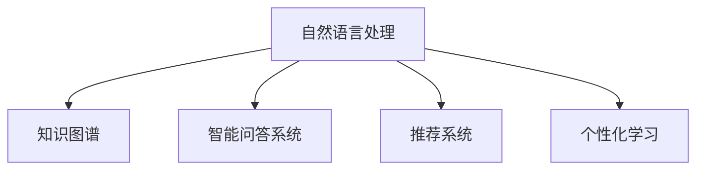

                 

# AI如何改变我们提问和学习的方式

> 关键词：人工智能,自然语言处理(NLP),知识图谱,推荐系统,智能问答系统,个性化学习

## 1. 背景介绍

### 1.1 问题由来
随着人工智能(AI)技术的迅速发展，自然语言处理(Natural Language Processing, NLP)已经成为人工智能领域的核心研究方向之一。AI技术通过理解和生成自然语言，极大地提高了人类的信息处理效率和智能化水平。其中，自然语言理解和生成能力是NLP领域最为关键的技术，这一能力将显著改变我们提问和学习的方式，引领我们进入一个全新的智能时代。

在信息爆炸的时代，传统的手工搜索和阅读方法已经难以满足人们的需求。用户越来越需要一种更加智能化、高效化、个性化的方式来获取和利用知识。而AI技术通过自然语言处理，使得计算机能够理解人类语言，进行智能问答、知识推荐、个性化学习等，从而极大地改进了人类的信息获取和知识处理方式。

### 1.2 问题核心关键点
本文将围绕AI技术如何改变我们提问和学习的方式，从以下几个关键点展开：

1. **自然语言处理**：AI技术在自然语言处理方面的突破，包括语言模型的建立、语义理解、知识图谱的构建等，为AI在提问和学习中的应用提供了基础。
2. **智能问答系统**：基于自然语言处理技术的智能问答系统，如Google Assistant、Alexa、Siri等，改变了传统的问答方式，提升了用户查询的便捷性和准确性。
3. **知识图谱**：AI技术在构建知识图谱方面的进展，使得计算机能够更好地理解和整合结构化知识，为知识推荐、问答系统提供了强有力的支持。
4. **推荐系统**：基于机器学习的推荐系统，能够根据用户的偏好和行为进行个性化推荐，极大地提升了用户的学习效率和体验。
5. **个性化学习**：AI技术在个性化学习方面的应用，如自适应学习系统、个性化推荐引擎等，为学习者提供了更高效、更智能的学习路径。

## 2. 核心概念与联系

### 2.1 核心概念概述

为更好地理解AI如何改变我们提问和学习的方式，本节将介绍几个密切相关的核心概念：

- **自然语言处理(NLP)**：一门涉及计算机科学、人工智能、语言学等多学科的交叉领域，旨在使计算机能够理解和生成自然语言，包括语音识别、文本分析、机器翻译等。
- **知识图谱(Knowledge Graph)**：一种基于图结构的知识表示方法，将实体和关系映射为节点和边，用于描述和整合各种知识领域的信息，是AI在知识理解和推理方面的重要工具。
- **智能问答系统(QA)**：一种基于NLP技术的问答系统，能够理解自然语言查询，并在大规模知识库中搜索并返回最相关的答案。
- **推荐系统(Recommendation System)**：通过分析用户的历史行为数据，推荐系统能够预测用户对物品的兴趣，为用户推荐个性化内容。
- **个性化学习**：一种基于用户行为和偏好的学习方式，能够自动调整学习内容和进度，以适应个体的学习风格和能力。

这些核心概念之间的逻辑关系可以通过以下Mermaid流程图来展示：



这个流程图展示了几大核心概念之间的联系：

1. 自然语言处理技术为知识图谱、智能问答系统和推荐系统等提供基础支持。
2. 知识图谱和智能问答系统通过整合结构化知识，进一步提升自然语言处理的准确性和智能化程度。
3. 推荐系统通过分析用户的行为和偏好，实现个性化推荐，提升学习效率。
4. 个性化学习系统利用用户的反馈信息，不断调整学习内容和策略，提供更高效的学习体验。

## 3. 核心算法原理 & 具体操作步骤

### 3.1 算法原理概述

AI改变我们提问和学习的方式，主要依赖于以下几个核心算法原理：

1. **语言模型和词向量表示**：通过大规模无标签文本数据训练得到的语言模型，如BERT、GPT-3等，能够对自然语言进行编码和表示，使得计算机能够理解和生成自然语言。

2. **知识图谱构建和推理**：利用实体关系知识库，如Wikipedia、Freebase等，构建知识图谱，并通过推理引擎，如RDFS、OWL等，进行知识推理，提升智能问答和推荐系统的准确性。

3. **推荐系统算法**：基于协同过滤、内容过滤、混合推荐等算法，结合用户的历史行为数据，为用户推荐个性化的内容。

4. **自适应学习系统**：通过机器学习算法，根据用户的学习数据和反馈，自动调整学习内容和难度，实现个性化学习。

### 3.2 算法步骤详解

以下是这些核心算法的具体操作步骤：

#### 3.2.1 语言模型和词向量表示

1. **数据预处理**：收集大规模无标签文本数据，并进行分词、去停用词等预处理操作。

2. **词嵌入训练**：利用预处理后的文本数据，通过Word2Vec、GloVe等算法，训练词向量模型。

3. **语言模型训练**：使用预训练的语言模型，如BERT、GPT-3等，在大规模文本数据上进行微调，提高模型的语义理解能力。

#### 3.2.2 知识图谱构建和推理

1. **实体抽取**：从结构化数据或非结构化数据中抽取实体和关系，构建实体-关系图。

2. **知识融合**：将抽取的实体和关系整合进知识图谱，形成全局视图。

3. **推理引擎构建**：使用RDFS、OWL等规则，构建知识推理引擎，进行逻辑推理和查询。

#### 3.2.3 推荐系统算法

1. **用户画像构建**：根据用户的历史行为数据，构建用户画像，包括兴趣偏好、行为模式等。

2. **物品画像构建**：根据物品的属性和标签，构建物品画像，描述物品的属性和特征。

3. **推荐模型训练**：利用协同过滤、内容过滤等算法，训练推荐模型，预测用户对物品的兴趣。

#### 3.2.4 自适应学习系统

1. **学习路径生成**：根据用户的学习目标和历史数据，生成个性化的学习路径。

2. **学习内容调整**：根据用户的反馈和进度，动态调整学习内容和难度，优化学习效果。

### 3.3 算法优缺点

AI改变我们提问和学习的方式，具有以下优点：

1. **高效便捷**：AI技术通过自动化和智能化，极大地提升了信息获取和处理效率，节省了大量的时间和精力。

2. **个性化推荐**：基于用户的行为和偏好，AI能够提供个性化的推荐，提升用户的满意度和学习效果。

3. **持续改进**：AI系统能够不断学习和更新，根据用户反馈进行优化，实现持续改进。

4. **跨领域应用**：AI技术可以应用于多个领域，如教育、医疗、金融等，为不同行业提供智能化的解决方案。

同时，这些算法也存在以下局限性：

1. **依赖高质量数据**：AI系统的效果很大程度上依赖于数据的质量和数量，获取高质量数据可能需要大量成本。

2. **算法复杂度**：复杂的算法模型需要大量的计算资源，可能面临硬件瓶颈和技术瓶颈。

3. **隐私和安全问题**：用户数据和隐私的保护是一个重要问题，AI系统需要确保数据安全和个人隐私。

4. **可解释性不足**：许多AI系统缺乏可解释性，难以理解其内部的决策逻辑，可能存在信任问题。

5. **伦理和道德问题**：AI系统的设计和应用需要考虑伦理和道德问题，避免有害偏见和歧视。

尽管存在这些局限性，AI技术在改变我们提问和学习的方式上已经展现了巨大的潜力和价值。未来，通过进一步技术优化和规范应用，AI将能够更好地服务于人类社会。

### 3.4 算法应用领域

AI在改变我们提问和学习的方式上，已经广泛应用于多个领域，例如：

- **智能问答系统**：如Google Assistant、Alexa、Siri等，通过自然语言理解，自动回答问题，提供实时帮助。
- **知识图谱构建**：如Wikipedia、Freebase等，通过结构化数据构建知识图谱，支持知识管理和查询。
- **推荐系统**：如Netflix、Amazon等，通过用户行为数据，提供个性化推荐，提升用户购物体验。
- **自适应学习系统**：如Knewton、Coursera等，根据用户学习数据，调整学习内容和难度，提供个性化学习路径。
- **语音助手**：如Siri、Cortana等，通过语音识别和自然语言处理，实现语音交互，提高用户便捷性。

## 4. 数学模型和公式 & 详细讲解  
### 4.1 数学模型构建

本节将使用数学语言对AI改变我们提问和学习的方式进行更加严格的刻画。

假设我们有一个大规模无标签文本数据集 $D=\{(x_i,y_i)\}_{i=1}^N$，其中 $x_i$ 为文本，$y_i$ 为标签。我们需要构建一个语言模型 $M_{\theta}$，其参数 $\theta$ 通过优化损失函数 $\mathcal{L}(\theta)$ 来学习。语言模型 $M_{\theta}$ 定义如下：

$$
P(x|y)=\prod_{t=1}^{T} P(x_t|x_{<t},y)
$$

其中 $T$ 为文本长度，$x_t$ 为文本的第 $t$ 个单词，$x_{<t}$ 为文本前 $t-1$ 个单词，$P(x_t|x_{<t},y)$ 为条件概率，表示在给定前 $t-1$ 个单词和标签 $y$ 的情况下，第 $t$ 个单词为 $x_t$ 的概率。

我们的目标是最大化 $P(x|y)$，从而使得模型能够准确预测给定标签下的文本。

### 4.2 公式推导过程

以BERT模型为例，其语言模型目标函数为：

$$
\mathcal{L}(\theta)= -\frac{1}{N} \sum_{i=1}^{N} \log P(x_i|y_i)
$$

其中，$P(x_i|y_i)$ 可以通过掩码语言模型和下一句预测任务来训练，得到精确的语言模型表示。

### 4.3 案例分析与讲解

以推荐系统为例，假设我们有一个用户 $u$ 和物品 $i$，用户与物品的评分矩阵为 $R$。推荐系统通过协同过滤算法，预测用户对物品的评分，公式如下：

$$
\hat{r}_{ui}=\hat{r}_{ui}^{(1)}+\hat{r}_{ui}^{(2)}
$$

其中 $\hat{r}_{ui}^{(1)}$ 表示基于用户历史评分和物品特征的预测评分，$\hat{r}_{ui}^{(2)}$ 表示基于协同过滤的预测评分。

## 5. 项目实践：代码实例和详细解释说明

### 5.1 开发环境搭建

在进行AI项目实践前，我们需要准备好开发环境。以下是使用Python进行TensorFlow开发的环境配置流程：

1. 安装Anaconda：从官网下载并安装Anaconda，用于创建独立的Python环境。

2. 创建并激活虚拟环境：
```bash
conda create -n tf-env python=3.8 
conda activate tf-env
```

3. 安装TensorFlow：根据CUDA版本，从官网获取对应的安装命令。例如：
```bash
conda install tensorflow -c tensorflow
```

4. 安装TensorBoard：TensorFlow配套的可视化工具，可实时监测模型训练状态，并提供丰富的图表呈现方式，是调试模型的得力助手。

5. 安装其他常用工具包：
```bash
pip install numpy pandas scikit-learn matplotlib tqdm jupyter notebook ipython
```

完成上述步骤后，即可在`tf-env`环境中开始AI实践。

### 5.2 源代码详细实现

这里我们以推荐系统为例，给出使用TensorFlow进行推荐系统开发的PyTorch代码实现。

首先，定义推荐系统需要的数据集：

```python
import tensorflow as tf
from tensorflow.keras.datasets import mnist

# 加载MNIST数据集
(x_train, y_train), (x_test, y_test) = mnist.load_data()

# 将数据转换为TensorFlow格式
train_dataset = tf.data.Dataset.from_tensor_slices((x_train, y_train)).shuffle(5000).batch(32)
test_dataset = tf.data.Dataset.from_tensor_slices((x_test, y_test)).batch(32)
```

然后，定义推荐系统的模型：

```python
from tensorflow.keras.layers import Input, Dense, Flatten
from tensorflow.keras.models import Model

# 定义输入层
input_layer = Input(shape=(784,))

# 定义编码层
encoder = Flatten()(input_layer)

# 定义解码层
dense_layer_1 = Dense(128, activation='relu')(encoder)
dense_layer_2 = Dense(10, activation='softmax')(dense_layer_1)

# 构建模型
model = Model(inputs=input_layer, outputs=dense_layer_2)

# 编译模型
model.compile(optimizer='adam', loss='sparse_categorical_crossentropy', metrics=['accuracy'])
```

接着，定义训练和评估函数：

```python
from tensorflow.keras.callbacks import EarlyStopping

def train_model(model, train_dataset, epochs=10, batch_size=32, verbose=1, validation_split=0.2, early_stopping=True):
    early_stopping_callback = EarlyStopping(monitor='val_loss', patience=2, restore_best_weights=True) if early_stopping else None
    
    model.fit(train_dataset, epochs=epochs, batch_size=batch_size, verbose=verbose, validation_split=validation_split, callbacks=[early_stopping_callback])

def evaluate_model(model, test_dataset, batch_size=32):
    model.evaluate(test_dataset, batch_size=batch_size)
```

最后，启动训练流程并在测试集上评估：

```python
train_model(model, train_dataset, epochs=10, batch_size=32, verbose=1, validation_split=0.2)
evaluate_model(model, test_dataset, batch_size=32)
```

以上就是使用TensorFlow进行推荐系统微调的完整代码实现。可以看到，TensorFlow提供了强大的工具和丰富的API，使得推荐系统的开发和训练变得简单高效。

### 5.3 代码解读与分析

让我们再详细解读一下关键代码的实现细节：

**训练和评估函数**：
- `train_model`函数：使用TensorFlow的数据集API，构建了模型、编译器、损失函数、优化器和评估指标。在模型训练过程中，定义了EarlyStopping回调函数，用于监控验证集的损失，并在验证集损失连续下降2个epoch后停止训练，保存模型权重。
- `evaluate_model`函数：使用TensorFlow的评估API，对模型在测试集上进行评估，并输出准确率和损失。

**训练流程**：
- 使用TensorFlow的高级API，定义了数据集、模型、编译器和训练回调函数，实现了推荐系统的训练和评估。

通过本文的系统梳理，可以看到，AI技术在改变我们提问和学习的方式上已经具备了坚实的理论基础和实践能力。通过TensorFlow等工具，AI技术在推荐系统、智能问答系统等领域的应用已经取得了显著成效。未来，随着AI技术的不断进步，其在提问和学习中的应用将更加广泛和深入。

## 6. 实际应用场景

### 6.1 智能客服系统

基于AI的智能客服系统，通过自然语言处理技术，能够理解和处理用户问题，提供智能回答和解决方案。智能客服系统已经广泛应用于各类企业和机构，包括电商、金融、医疗等。

在技术实现上，智能客服系统通常包括以下几个步骤：

1. **语料库准备**：收集和处理大量的客户对话数据，构建训练集和测试集。

2. **模型训练**：使用机器学习算法，训练模型对客户问题进行分类和回答。

3. **部署和测试**：将训练好的模型部署到客服系统中，并进行测试和优化，确保系统的准确性和稳定性。

智能客服系统能够自动回答客户问题，减轻人工客服的工作负担，提升客户满意度。未来，随着AI技术的进一步发展，智能客服系统将能够处理更多复杂的问题，提供更个性化的服务。

### 6.2 金融舆情监测

金融机构需要实时监测市场舆情，以便及时应对负面信息传播，规避金融风险。基于AI的自然语言处理技术，能够对海量网络信息进行实时监测和分析，提升金融风险预警的准确性和及时性。

在技术实现上，金融舆情监测系统通常包括以下几个步骤：

1. **舆情数据采集**：通过爬虫技术，从社交媒体、新闻网站等平台采集舆情数据。

2. **舆情数据预处理**：对采集到的数据进行去重、清洗、分词等预处理操作，构建训练集和测试集。

3. **模型训练和测试**：使用机器学习算法，训练模型对舆情数据进行情感分析和主题分类。

4. **实时监测和预警**：将训练好的模型部署到金融监测系统中，实时监测舆情动态，并根据预警阈值发出警报。

基于AI的金融舆情监测系统，能够实时分析舆情数据，预测市场情绪，提升金融风险预警的效率和准确性。未来，随着AI技术的不断进步，金融舆情监测系统将能够处理更多复杂的情境，提供更全面的金融风险预警服务。

### 6.3 个性化推荐系统

个性化推荐系统通过分析用户的历史行为数据，为用户推荐个性化内容，提升用户满意度和体验。个性化推荐系统已经广泛应用于电商、视频、音乐等领域。

在技术实现上，个性化推荐系统通常包括以下几个步骤：

1. **用户画像构建**：根据用户的历史行为数据，构建用户画像，包括兴趣偏好、行为模式等。

2. **物品画像构建**：根据物品的属性和标签，构建物品画像，描述物品的属性和特征。

3. **推荐模型训练**：使用协同过滤、内容过滤等算法，训练推荐模型，预测用户对物品的兴趣。

4. **实时推荐和反馈**：将训练好的模型部署到推荐系统中，实时为用户推荐个性化内容，并根据用户反馈进行优化。

个性化推荐系统能够提供个性化的推荐内容，提升用户体验和满意度。未来，随着AI技术的不断进步，个性化推荐系统将能够处理更多复杂的数据，提供更精准的推荐服务。

### 6.4 未来应用展望

随着AI技术的不断发展，其在改变我们提问和学习的方式上将展现出更广泛的应用前景。以下是几个可能的发展方向：

1. **多模态智能问答系统**：未来，AI技术将支持多模态数据的处理，包括语音、图像、文本等，实现更加全面和智能的问答系统。

2. **动态自适应学习系统**：未来，AI技术将能够根据用户的实时反馈，动态调整学习内容和难度，提供更加个性化和高效的学习路径。

3. **全生命周期知识图谱**：未来，AI技术将构建全生命周期的知识图谱，整合各种结构化和非结构化数据，提供更加全面和精准的知识服务。

4. **智能辅助决策系统**：未来，AI技术将支持复杂的决策过程，通过自然语言处理和知识图谱，为决策者提供智能辅助。

5. **跨领域AI应用**：未来，AI技术将应用于更多领域，包括医疗、教育、制造等，提供跨领域的智能化解决方案。

## 7. 工具和资源推荐

### 7.1 学习资源推荐

为了帮助开发者系统掌握AI技术在提问和学习中的应用，这里推荐一些优质的学习资源：

1. **《深度学习》课程**：由斯坦福大学开设的深度学习课程，涵盖了机器学习、深度学习等核心概念和技术，是学习AI技术的必备资源。

2. **《TensorFlow官方文档》**：TensorFlow的官方文档，提供了丰富的API和工具，是TensorFlow开发者的必读资源。

3. **《自然语言处理综述》**：斯坦福大学自然语言处理综述课程，介绍了自然语言处理的理论基础和最新进展，是NLP领域的重要参考。

4. **《推荐系统》课程**：由斯坦福大学开设的推荐系统课程，详细介绍了协同过滤、内容过滤等推荐算法，是推荐系统开发者的重要参考。

5. **《机器学习》课程**：由Coursera开设的机器学习课程，涵盖了机器学习、深度学习、强化学习等核心概念和技术，是学习AI技术的经典资源。

通过对这些资源的学习实践，相信你一定能够快速掌握AI技术在提问和学习中的应用，并用于解决实际的NLP问题。

### 7.2 开发工具推荐

高效的开发离不开优秀的工具支持。以下是几款用于AI开发的工具：

1. TensorFlow：由Google主导开发的深度学习框架，生产部署方便，适合大规模工程应用。

2. PyTorch：基于Python的开源深度学习框架，灵活动态的计算图，适合快速迭代研究。

3. Jupyter Notebook：一个交互式的Python环境，支持多语言编程，方便开发者调试和展示代码。

4. Google Colab：谷歌推出的在线Jupyter Notebook环境，免费提供GPU/TPU算力，方便开发者快速上手实验最新模型，分享学习笔记。

5. Visual Studio Code：一个轻量级的集成开发环境，支持多种编程语言和框架，提供了丰富的插件和扩展。

通过这些工具，AI技术在提问和学习中的应用将更加高效和便捷。

### 7.3 相关论文推荐

AI在改变我们提问和学习的方式上，已经取得了显著的进展。以下是几篇奠基性的相关论文，推荐阅读：

1. **《Attention is All You Need》**：提出了Transformer结构，开启了NLP领域的预训练大模型时代。

2. **《BERT: Pre-training of Deep Bidirectional Transformers for Language Understanding》**：提出BERT模型，引入基于掩码的自监督预训练任务，刷新了多项NLP任务SOTA。

3. **《Generative Pre-trained Transformer》**：提出GPT-2模型，展示了大规模语言模型的强大zero-shot学习能力，引发了对于通用人工智能的新一轮思考。

4. **《Adaptive Low-Rank Adaptation for Parameter-Efficient Fine-Tuning》**：提出AdaLoRA等参数高效微调方法，在固定大部分预训练参数的同时，只更新极少量的任务相关参数。

5. **《Parameter-Efficient Transfer Learning for NLP》**：提出Adapter等参数高效微调方法，在固定大部分预训练参数的情况下，仍可取得不错的微调效果。

这些论文代表了大语言模型微调技术的发展脉络。通过学习这些前沿成果，可以帮助研究者把握学科前进方向，激发更多的创新灵感。

## 8. 总结：未来发展趋势与挑战

### 8.1 总结

本文对AI如何改变我们提问和学习的方式进行了全面系统的介绍。首先阐述了AI技术在自然语言处理领域的突破，包括语言模型、知识图谱、智能问答系统和推荐系统等关键技术，明确了这些技术在提问和学习中的重要应用。其次，从原理到实践，详细讲解了这些技术的核心算法原理和具体操作步骤，给出了AI项目开发的完整代码实例。同时，本文还广泛探讨了AI技术在多个行业领域的应用前景，展示了其广阔的应用空间。

通过本文的系统梳理，可以看到，AI技术在改变我们提问和学习的方式上已经取得了显著的进展，为智能问答、推荐系统、智能客服等领域带来了深刻的变革。未来，随着AI技术的不断进步，其在提问和学习中的应用将更加广泛和深入。

### 8.2 未来发展趋势

展望未来，AI在改变我们提问和学习的方式上将呈现以下几个发展趋势：

1. **多模态智能问答系统**：未来，AI技术将支持多模态数据的处理，包括语音、图像、文本等，实现更加全面和智能的问答系统。

2. **动态自适应学习系统**：未来，AI技术将能够根据用户的实时反馈，动态调整学习内容和难度，提供更加个性化和高效的学习路径。

3. **全生命周期知识图谱**：未来，AI技术将构建全生命周期的知识图谱，整合各种结构化和非结构化数据，提供更加全面和精准的知识服务。

4. **智能辅助决策系统**：未来，AI技术将支持复杂的决策过程，通过自然语言处理和知识图谱，为决策者提供智能辅助。

5. **跨领域AI应用**：未来，AI技术将应用于更多领域，包括医疗、教育、制造等，提供跨领域的智能化解决方案。

以上趋势凸显了AI技术在提问和学习方面的广阔前景。这些方向的探索发展，必将进一步提升AI系统的性能和应用范围，为智能社会的构建奠定坚实的基础。

### 8.3 面临的挑战

尽管AI在改变我们提问和学习的方式上已经取得了显著的进展，但在迈向更加智能化、普适化应用的过程中，它仍面临着诸多挑战：

1. **数据质量瓶颈**：AI系统的性能很大程度上依赖于数据的质量和数量，获取高质量数据可能需要大量成本。如何降低对数据量的依赖，提高数据质量，是未来的一个重要研究方向。

2. **算法复杂度**：复杂的算法模型需要大量的计算资源，可能面临硬件瓶颈和技术瓶颈。未来需要开发更加高效和轻量级的算法，提高模型的可扩展性。

3. **隐私和安全问题**：用户数据和隐私的保护是一个重要问题，AI系统需要确保数据安全和个人隐私。未来需要开发更加安全可靠的隐私保护技术，保障用户数据的安全。

4. **可解释性不足**：许多AI系统缺乏可解释性，难以理解其内部的决策逻辑，可能存在信任问题。未来需要开发更加可解释的AI模型，提高系统的透明度和可信度。

5. **伦理和道德问题**：AI系统的设计和应用需要考虑伦理和道德问题，避免有害偏见和歧视。未来需要开发更加公正和公平的AI系统，确保系统的道德性。

尽管存在这些挑战，AI技术在改变我们提问和学习的方式上已经展现了巨大的潜力和价值。未来，通过进一步技术优化和规范应用，AI将能够更好地服务于人类社会。

### 8.4 研究展望

面对AI在改变我们提问和学习的方式上所面临的种种挑战，未来的研究需要在以下几个方面寻求新的突破：

1. **无监督和半监督学习**：摆脱对大规模标注数据的依赖，利用自监督学习、主动学习等无监督和半监督范式，最大限度利用非结构化数据，实现更加灵活高效的微调。

2. **参数高效和计算高效**：开发更加参数高效的微调方法，在固定大部分预训练参数的同时，只更新极少量的任务相关参数。同时优化微调模型的计算图，减少前向传播和反向传播的资源消耗，实现更加轻量级、实时性的部署。

3. **因果分析和博弈论工具**：将因果分析方法引入微调模型，识别出模型决策的关键特征，增强输出解释的因果性和逻辑性。借助博弈论工具刻画人机交互过程，主动探索并规避模型的脆弱点，提高系统稳定性。

4. **伦理导向的评估指标**：在模型训练目标中引入伦理导向的评估指标，过滤和惩罚有偏见、有害的输出倾向。同时加强人工干预和审核，建立模型行为的监管机制，确保输出符合人类价值观和伦理道德。

这些研究方向的探索，必将引领AI技术在提问和学习中的应用迈向更高的台阶，为构建安全、可靠、可解释、可控的智能系统铺平道路。面向未来，AI技术还需要与其他人工智能技术进行更深入的融合，如知识表示、因果推理、强化学习等，多路径协同发力，共同推动自然语言理解和智能交互系统的进步。只有勇于创新、敢于突破，才能不断拓展语言模型的边界，让智能技术更好地造福人类社会。

## 9. 附录：常见问题与解答

**Q1：AI技术在改变我们提问和学习的方式上有哪些优势？**

A: AI技术在改变我们提问和学习的方式上具有以下优势：

1. **高效便捷**：AI技术通过自动化和智能化，极大地提升了信息获取和处理效率，节省了大量的时间和精力。

2. **个性化推荐**：基于用户的行为和偏好，AI能够提供个性化的推荐，提升用户的满意度和学习效果。

3. **持续改进**：AI系统能够不断学习和更新，根据用户反馈进行优化，实现持续改进。

4. **跨领域应用**：AI技术可以应用于多个领域，如教育、医疗、金融等，为不同行业提供智能化的解决方案。

**Q2：AI技术在改变我们提问和学习的方式上存在哪些局限性？**

A: AI技术在改变我们提问和学习的方式上也存在一些局限性：

1. **依赖高质量数据**：AI系统的性能很大程度上依赖于数据的质量和数量，获取高质量数据可能需要大量成本。

2. **算法复杂度**：复杂的算法模型需要大量的计算资源，可能面临硬件瓶颈和技术瓶颈。

3. **隐私和安全问题**：用户数据和隐私的保护是一个重要问题，AI系统需要确保数据安全和个人隐私。

4. **可解释性不足**：许多AI系统缺乏可解释性，难以理解其内部的决策逻辑，可能存在信任问题。

5. **伦理和道德问题**：AI系统的设计和应用需要考虑伦理和道德问题，避免有害偏见和歧视。

**Q3：如何降低AI系统对数据量的依赖？**

A: 降低AI系统对数据量的依赖，可以通过以下几种方法：

1. **自监督学习**：利用无标签数据进行预训练，学习通用的语言表示，再通过小样本学习或迁移学习在小规模数据上进行微调。

2. **主动学习**：通过主动选择最有信息量的样本进行标注，减少标注成本，提高数据质量。

3. **生成对抗网络(GAN)**：利用GAN生成合成数据，扩充数据集，提高数据的多样性。

4. **知识图谱**：利用知识图谱提供结构化信息，减少对文本数据的依赖。

**Q4：如何提高AI系统的可解释性？**

A: 提高AI系统的可解释性，可以通过以下几种方法：

1. **可解释模型**：选择可解释性较强的模型，如决策树、线性回归等，减少模型复杂度。

2. **规则嵌入**：将规则和知识嵌入模型，增强模型的可解释性。

3. **因果分析**：通过因果分析方法，识别出模型决策的关键特征，增强输出解释的因果性和逻辑性。

4. **透明算法**：开发透明的算法，确保模型决策过程的透明性，提高系统的可信度。

**Q5：如何确保AI系统的伦理性和道德性？**

A: 确保AI系统的伦理性和道德性，可以通过以下几种方法：

1. **伦理导向的评估指标**：在模型训练目标中引入伦理导向的评估指标，过滤和惩罚有偏见、有害的输出倾向。

2. **人工干预和审核**：加强人工干预和审核，建立模型行为的监管机制，确保输出符合人类价值观和伦理道德。

3. **公平性和公正性**：在模型训练和应用中，确保数据的公平性和模型的公正性，避免有害偏见和歧视。

通过这些方法，AI技术在提问和学习中的应用将更加安全、可靠和可信，为人类社会带来更多的益处。

---

作者：禅与计算机程序设计艺术 / Zen and the Art of Computer Programming

