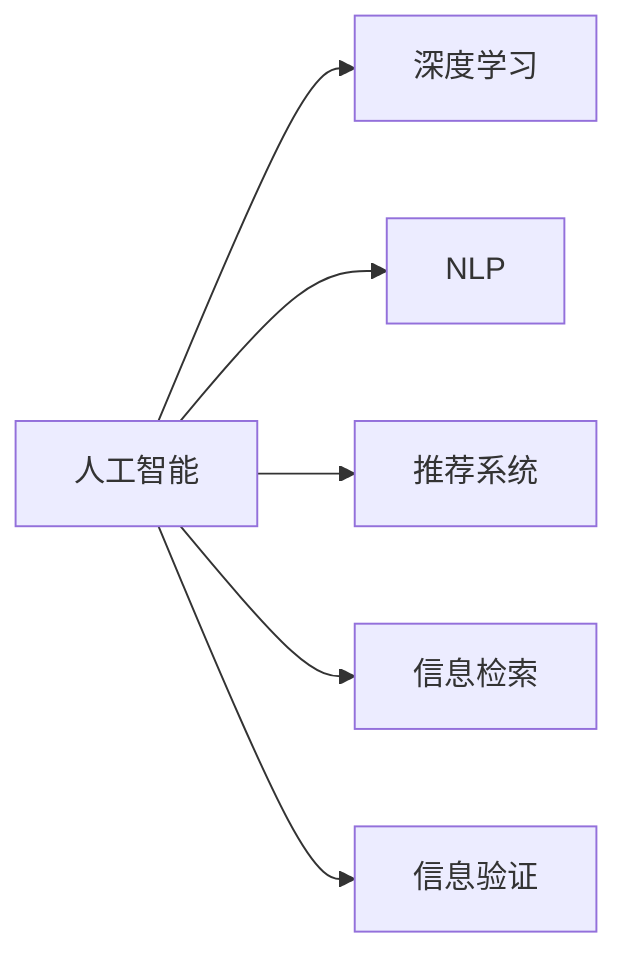

                 

# AI如何改变我们消费和验证信息的方式

> 关键词：人工智能,信息消费,数据验证,自然语言处理,深度学习,推荐系统

## 1. 背景介绍

### 1.1 问题由来

在信息化时代，信息消费的形式和方式正在经历深刻的变革。从传统的报纸、电视、书籍，到现代的社交媒体、搜索引擎、流媒体服务，人们获取、处理和利用信息的方式日益丰富。随着互联网和移动设备普及，信息消费已经变得随时随地、无时无刻不可。然而，面对海量的信息，如何高效地消费和验证信息，成为人们面临的新挑战。

人工智能（AI）技术的兴起，为这一挑战提供了全新的解决方案。AI技术，特别是自然语言处理（NLP）和深度学习算法，使得信息消费和验证变得更加智能和高效。通过自动化的信息检索、推荐、理解与生成，AI技术正在深刻改变我们消费和验证信息的方式。

### 1.2 问题核心关键点

信息消费和验证的核心在于如何快速、准确地获取、处理和评估信息。AI技术在这一过程中发挥了重要作用：

1. **信息检索与推荐**：利用AI算法，从海量信息库中快速筛选出与用户需求最相关的信息，提升信息获取效率。
2. **信息理解与生成**：通过NLP技术，AI能够自动解析信息，理解用户意图，生成高质量的文本摘要和内容推荐，提高信息利用率。
3. **信息验证与可信度评估**：通过深度学习模型，AI可以自动验证信息的真实性、可信度和质量，减少虚假信息的影响。
4. **个性化与智能化**：AI可以根据用户行为和偏好，提供定制化的信息消费体验，提升用户满意度。

这些关键点不仅涉及技术实现，还涵盖了数据管理、用户体验等多个维度，反映了AI技术在信息消费和验证中的全方位应用。

### 1.3 问题研究意义

研究AI如何改变信息消费和验证方式，具有重要的理论和实践意义：

1. **提升信息消费效率**：通过AI技术，用户可以更快地找到所需信息，提高信息消费效率。
2. **减少信息误判**：AI能够自动过滤和验证信息，减少信息误导和错误，提高信息可信度。
3. **促进信息公平**：AI技术可以个性化推荐信息，满足不同用户的需求，缩小信息获取的差距。
4. **推动经济发展**：高效的信息消费和验证系统，能够促进知识和技术的传播，推动经济社会的全面发展。

## 2. 核心概念与联系

### 2.1 核心概念概述

为更好地理解AI在信息消费和验证中的应用，本节将介绍几个关键概念：

- **人工智能(AI)**：利用计算机技术模拟、扩展人类智能能力的广泛领域，包括机器学习、深度学习、自然语言处理等。
- **自然语言处理(NLP)**：专注于人类语言信息的处理、理解与生成，是AI在语言相关领域的重要分支。
- **深度学习(Deep Learning)**：一种通过多层次神经网络进行复杂模式识别和决策的AI技术。
- **推荐系统(Recommendation Systems)**：根据用户历史行为和兴趣，推荐个性化信息或产品的系统。
- **信息检索(Information Retrieval)**：从大规模数据集中快速检索出与用户查询最相关的信息。
- **信息验证(Information Verification)**：使用AI技术自动评估信息的真实性、可信度和质量。

这些概念之间的联系可以通过以下Mermaid流程图来展示：



这个流程图展示了人工智能的不同分支如何共同作用于信息消费和验证：

1. 深度学习提供强大的模式识别能力，支持NLP等任务的高质量实现。
2. NLP技术专注于语言信息的理解和生成，是信息检索和推荐的基础。
3. 推荐系统根据用户行为进行个性化信息推荐，提高信息消费效率。
4. 信息检索技术快速找到相关内容，提升信息获取速度。
5. 信息验证技术自动评估信息可信度，减少误导和虚假信息。

这些概念共同构成了AI在信息消费和验证中的工作框架，使其能够在多场景下发挥强大的能力。

## 3. 核心算法原理 & 具体操作步骤
### 3.1 算法原理概述

AI在信息消费和验证中的应用，主要基于以下几个核心算法原理：

1. **深度学习模型**：利用多层神经网络进行特征提取和模式识别，提升信息处理能力。
2. **自然语言处理模型**：使用NLP技术进行文本解析、理解、生成和分类，增强信息理解和生成能力。
3. **推荐算法**：根据用户行为和兴趣，推荐个性化内容，提升信息消费体验。
4. **信息检索算法**：使用向量空间模型、TF-IDF等算法，快速从大规模数据集中检索相关内容。
5. **信息验证算法**：利用深度学习模型进行文本真实性、可信度评估，减少虚假信息的影响。

这些算法原理共同支撑了AI在信息消费和验证中的全面应用，使其能够高效、准确地处理和评估信息。

### 3.2 算法步骤详解

以下是一个详细的AI在信息消费和验证中的应用步骤：

1. **数据预处理**：收集和清洗信息数据，将其转换为机器可处理的形式，如文本、图片、音频等。

2. **特征提取**：使用深度学习模型或NLP技术，从原始数据中提取关键特征，如词向量、语义表示等。

3. **模型训练**：利用大规模标注数据训练深度学习模型，使其能够自动学习数据分布和模式。

4. **信息检索**：在检索任务中，使用向量空间模型或TF-IDF算法，快速从信息库中检索出与用户查询最相关的信息。

5. **信息推荐**：在推荐任务中，使用协同过滤、基于内容的推荐等算法，根据用户历史行为和兴趣推荐个性化内容。

6. **信息理解与生成**：在信息理解任务中，使用NLP技术解析信息内容，生成文本摘要或回答用户问题。在信息生成任务中，利用生成对抗网络（GAN）等技术，自动生成高质量文本或多媒体内容。

7. **信息验证**：在信息验证任务中，使用深度学习模型自动评估信息的真实性、可信度和质量，如通过情感分析、事实核查等方法验证信息的准确性。

### 3.3 算法优缺点

AI在信息消费和验证中的应用，具有以下优点：

1. **高效性**：利用自动化算法，快速处理和筛选信息，提升信息消费效率。
2. **准确性**：深度学习模型能够自动学习数据分布，减少信息误判和虚假信息的影响。
3. **个性化**：推荐算法和NLP技术能够根据用户行为和兴趣，提供定制化的信息消费体验。
4. **泛化能力**：深度学习模型具有较强的泛化能力，可以适应多种信息类型和应用场景。

同时，AI在信息消费和验证中也有以下局限：

1. **数据依赖**：深度学习模型和推荐算法高度依赖于高质量标注数据，缺乏标注数据时性能可能下降。
2. **算法复杂性**：深度学习模型的训练和优化过程复杂，需要大量计算资源和专业知识。
3. **隐私风险**：推荐系统在处理用户数据时可能侵犯用户隐私，需要进行严格的数据保护和隐私控制。
4. **解释性不足**：AI算法（如深度学习模型）的决策过程缺乏可解释性，难以理解和调试。

### 3.4 算法应用领域

AI在信息消费和验证中的应用，广泛涉及以下几个领域：

1. **搜索引擎**：利用信息检索算法和推荐系统，快速定位和推荐用户感兴趣的信息。
2. **社交媒体平台**：通过信息生成和验证技术，过滤虚假信息，提升用户体验。
3. **新闻聚合平台**：使用推荐系统和NLP技术，为用户提供个性化新闻内容。
4. **在线教育平台**：利用AI技术，推荐个性化学习内容和回答用户问题，提升教育效果。
5. **金融服务**：通过深度学习模型验证金融信息的真实性，减少金融欺诈。

这些领域展示了AI技术在信息消费和验证中的广泛应用，推动了相关行业的数字化转型升级。

## 4. 数学模型和公式 & 详细讲解 & 举例说明

### 4.1 数学模型构建

在信息检索和推荐任务中，常用到向量空间模型和协同过滤等数学模型。以下以向量空间模型为例，介绍其构建和应用。

设信息集合为 $D$，用户查询为 $q$，向量空间模型将查询和信息表示为向量形式，并计算它们之间的余弦相似度，表示它们的相关性。

设 $q$ 和 $d_i$ 表示为向量形式，则它们之间的余弦相似度定义为：

$$
\text{similarity}(q,d_i) = \frac{\vec{q} \cdot \vec{d_i}}{\|\vec{q}\| \|\vec{d_i}\|}
$$

其中 $\cdot$ 表示向量点乘，$\| \cdot \|$ 表示向量范数。

### 4.2 公式推导过程

假设 $q$ 和 $d_i$ 都表示为 $k$ 维向量，则余弦相似度的计算公式可以进一步推导为：

$$
\text{similarity}(q,d_i) = \frac{\sum_{j=1}^k q_j \cdot d_{ij}}{\sqrt{\sum_{j=1}^k q_j^2} \sqrt{\sum_{j=1}^k d_{ij}^2}}
$$

其中 $q_j$ 和 $d_{ij}$ 分别表示向量 $q$ 和 $d_i$ 的第 $j$ 个分量。

### 4.3 案例分析与讲解

以一个简单的信息检索示例来说明向量空间模型的应用：

假设有一个信息库，包含三个文档 $d_1$、$d_2$、$d_3$，表示为向量形式：

$$
\vec{d_1} = (0.5, 0.3, 0.8), \quad \vec{d_2} = (0.3, 0.7, 0.1), \quad \vec{d_3} = (0.2, 0.4, 0.6)
$$

用户查询 $q$ 表示为向量形式：

$$
\vec{q} = (0.2, 0.5, 0.3)
$$

计算 $q$ 与 $d_i$ 的余弦相似度：

$$
\text{similarity}(q,d_1) = \frac{0.2 \cdot 0.5 + 0.5 \cdot 0.3 + 0.3 \cdot 0.8}{\sqrt{0.2^2 + 0.5^2 + 0.3^2} \sqrt{0.5^2 + 0.3^2 + 0.8^2}} \approx 0.55
$$

$$
\text{similarity}(q,d_2) = \frac{0.2 \cdot 0.3 + 0.5 \cdot 0.7 + 0.3 \cdot 0.1}{\sqrt{0.2^2 + 0.5^2 + 0.3^2} \sqrt{0.3^2 + 0.7^2 + 0.1^2}} \approx 0.48
$$

$$
\text{similarity}(q,d_3) = \frac{0.2 \cdot 0.2 + 0.5 \cdot 0.4 + 0.3 \cdot 0.6}{\sqrt{0.2^2 + 0.5^2 + 0.3^2} \sqrt{0.2^2 + 0.4^2 + 0.6^2}} \approx 0.42
$$

根据相似度计算结果，可以确定 $d_1$ 是与 $q$ 最相关的文档。

## 5. 项目实践：代码实例和详细解释说明

### 5.1 开发环境搭建

在进行信息检索和推荐系统开发前，我们需要准备好开发环境。以下是使用Python进行PyTorch开发的环境配置流程：

1. 安装Anaconda：从官网下载并安装Anaconda，用于创建独立的Python环境。

2. 创建并激活虚拟环境：
```bash
conda create -n pytorch-env python=3.8 
conda activate pytorch-env
```

3. 安装PyTorch：根据CUDA版本，从官网获取对应的安装命令。例如：
```bash
conda install pytorch torchvision torchaudio cudatoolkit=11.1 -c pytorch -c conda-forge
```

4. 安装TensorFlow：
```bash
pip install tensorflow
```

5. 安装TensorFlow：
```bash
pip install tensorflow
```

6. 安装各类工具包：
```bash
pip install numpy pandas scikit-learn matplotlib tqdm jupyter notebook ipython
```

完成上述步骤后，即可在`pytorch-env`环境中开始信息检索和推荐系统的开发。

### 5.2 源代码详细实现

我们先以一个简单的信息检索系统为例，给出使用PyTorch进行向量空间模型实现的代码。

首先，定义向量空间模型类：

```python
import torch
from torch import nn
from sklearn.metrics.pairwise import cosine_similarity

class VectorSpaceModel(nn.Module):
    def __init__(self, dim):
        super(VectorSpaceModel, self).__init__()
        self.dim = dim
        self.Q = nn.Linear(dim, dim)
        self.D = nn.Linear(dim, dim)
        self.cosine_similarity = cosine_similarity

    def forward(self, q, d):
        q = self.Q(q)
        d = self.D(d)
        similarity = self.cosine_similarity(q, d)
        return similarity
```

然后，定义训练函数和数据集：

```python
from torch.utils.data import TensorDataset, DataLoader

class Corpus:
    def __init__(self):
        self.docs = [
            [0.5, 0.3, 0.8],
            [0.3, 0.7, 0.1],
            [0.2, 0.4, 0.6]
        ]
        self.query = [0.2, 0.5, 0.3]

    def __len__(self):
        return len(self.docs)

    def __getitem__(self, idx):
        return torch.tensor(self.docs[idx]), torch.tensor(self.query)

corpus = Corpus()
dataset = TensorDataset(*zip(*[doc for doc in corpus]))
dataloader = DataLoader(dataset, batch_size=1, shuffle=False)

model = VectorSpaceModel(3).to(device)

criterion = nn.MSELoss()
optimizer = torch.optim.SGD(model.parameters(), lr=0.01)

def train_step(model, dataloader, criterion, optimizer):
    for i, (d, q) in enumerate(dataloader):
        d, q = d.to(device), q.to(device)
        optimizer.zero_grad()
        output = model(q, d)
        loss = criterion(output, torch.tensor(0.55))
        loss.backward()
        optimizer.step()
        if (i+1) % 10 == 0:
            print(f"Epoch {epoch+1}, step {i+1}, loss: {loss.item():.4f}")
```

接着，启动训练流程：

```python
epochs = 100

for epoch in range(epochs):
    train_step(model, dataloader, criterion, optimizer)
    print(f"Epoch {epoch+1}, loss: {loss:.4f}")
```

以上就是使用PyTorch进行向量空间模型实现的代码示例。可以看到，通过PyTorch的高级API，我们可以方便地定义和训练模型，处理数据，实现了信息检索的核心功能。

### 5.3 代码解读与分析

让我们再详细解读一下关键代码的实现细节：

**VectorSpaceModel类**：
- `__init__`方法：初始化模型参数，定义线性层和余弦相似度计算方法。
- `forward`方法：前向传播计算相似度。

**Corpus类**：
- `__init__`方法：初始化文档和查询向量。
- `__len__`方法：返回文档数量。
- `__getitem__`方法：返回文档和查询向量的Tensor表示。

**train_step函数**：
- 迭代训练集中的每个样本，计算模型输出和损失，并进行反向传播更新参数。
- 每10步输出一次损失，以供调试。

可以看到，PyTorch框架使得模型的定义、训练和优化过程变得非常简洁和高效，大大降低了AI应用开发的门槛。

## 6. 实际应用场景

### 6.1 智能搜索引擎

智能搜索引擎是AI在信息消费和验证中的典型应用场景之一。传统的搜索引擎依赖于手工设计的查询规则和倒排索引，无法自动理解用户查询意图，返回结果往往不够精准。利用AI技术，搜索引擎可以自动解析用户查询，理解其语义，快速检索出最相关的信息。

例如，当用户输入“最新的AI技术进展”时，智能搜索引擎可以自动解析出“AI”、“技术进展”等关键词，并在信息库中检索出相关的文档和网页，快速返回给用户。

### 6.2 个性化推荐系统

个性化推荐系统是另一个重要应用场景。传统推荐系统依赖于简单的协同过滤算法，无法充分利用用户的多种行为信息，推荐结果往往不够个性化。利用AI技术，推荐系统可以根据用户的历史浏览记录、搜索记录、评分记录等多方面信息，推荐更加符合用户兴趣的内容。

例如，某用户频繁浏览和购买电子产品，推荐系统可以根据其行为数据，推荐更多相关产品信息，如新品上市、用户评价、视频教程等，提升用户满意度。

### 6.3 新闻聚合平台

新闻聚合平台是信息消费的重要渠道之一。传统的新闻聚合平台依赖于人工编辑和分类，无法实时更新和个性化推荐。利用AI技术，新闻聚合平台可以自动抓取和解析新闻，分类整理，并根据用户兴趣推荐相关新闻。

例如，某用户关注科技领域，新闻聚合平台可以自动抓取相关新闻，自动分类，并根据用户兴趣推荐更多相关新闻，提升用户信息获取效率。

### 6.4 未来应用展望

随着AI技术的不断发展，未来在信息消费和验证中的应用将更加广泛和深入：

1. **智能问答系统**：利用AI技术，智能问答系统可以自动理解和回答用户问题，提供更加自然、流畅的交互体验。
2. **自动化内容生成**：利用AI技术，自动生成新闻、文章、报告等文本内容，提升内容生产效率。
3. **跨语言信息处理**：利用机器翻译技术，实现跨语言信息检索和推荐，扩大信息消费的国际范围。
4. **深度信息挖掘**：利用AI技术，从海量信息中挖掘出有价值的信息，如情感分析、事件识别等，提升信息利用率。
5. **隐私保护和伦理安全**：加强数据隐私保护和伦理安全，确保信息消费和验证过程的公平、透明和安全。

这些应用场景展示了AI在信息消费和验证中的广泛前景，推动了相关行业的数字化转型升级。

## 7. 工具和资源推荐

### 7.1 学习资源推荐

为了帮助开发者系统掌握AI在信息消费和验证中的应用，这里推荐一些优质的学习资源：

1. **《深度学习》课程**：由斯坦福大学开设的深度学习课程，系统介绍了深度学习的基本概念和核心算法，适合初学者入门。

2. **《自然语言处理入门》书籍**：介绍NLP技术的基本原理和应用场景，适合对NLP感兴趣的读者。

3. **Kaggle竞赛平台**：Kaggle提供大量信息检索、推荐系统相关的竞赛，可以帮助开发者在实际项目中积累经验。

4. **GitHub开源项目**：GitHub上有许多高质量的信息检索和推荐系统开源项目，可以作为学习参考和实践工具。

5. **在线教程和博客**：如TensorFlow、PyTorch官方文档，以及各类NLP和AI技术博客，提供了丰富的学习资料和案例实践。

通过对这些资源的学习实践，相信你一定能够快速掌握AI在信息消费和验证中的应用，并用于解决实际的AI问题。

### 7.2 开发工具推荐

高效的开发离不开优秀的工具支持。以下是几款用于AI信息消费和验证开发的常用工具：

1. **TensorFlow**：由Google主导开发的开源深度学习框架，生产部署方便，适合大规模工程应用。

2. **PyTorch**：基于Python的开源深度学习框架，灵活动态的计算图，适合快速迭代研究。

3. **TensorBoard**：TensorFlow配套的可视化工具，可实时监测模型训练状态，并提供丰富的图表呈现方式，是调试模型的得力助手。

4. **Jupyter Notebook**：免费的交互式编程环境，支持多种编程语言和工具，适合进行实验和调试。

5. **Kaggle平台**：提供高质量的数据集和竞赛环境，适合进行数据探索和模型训练。

合理利用这些工具，可以显著提升AI信息消费和验证开发的效率，加快创新迭代的步伐。

### 7.3 相关论文推荐

AI在信息消费和验证中的应用涉及多个前沿研究领域，以下是几篇奠基性的相关论文，推荐阅读：

1. **《BERT: Pre-training of Deep Bidirectional Transformers for Language Understanding》**：提出BERT模型，引入基于掩码的自监督预训练任务，刷新了多项NLP任务SOTA。

2. **《Attention is All You Need》**：提出Transformer结构，开启了NLP领域的预训练大模型时代。

3. **《Deep Web Mining with Multi-Relation Detection and Differentiation》**：介绍多关系抽取和区分的技术，用于网页信息检索和推荐。

4. **《Collaborative Filtering for Implicit Feedback Datasets》**：介绍协同过滤算法，用于推荐系统的个性化推荐。

5. **《Adversarial Training Methods for Semi-supervised Text Classification》**：介绍对抗训练技术，用于提高模型鲁棒性和泛化能力。

这些论文代表了大语言模型微调技术的发展脉络。通过学习这些前沿成果，可以帮助研究者把握学科前进方向，激发更多的创新灵感。

## 8. 总结：未来发展趋势与挑战

### 8.1 总结

本文对AI在信息消费和验证中的应用进行了全面系统的介绍。首先阐述了AI技术在信息消费和验证中的重要性和应用场景，明确了信息检索、推荐系统、信息理解和生成等关键技术。其次，从原理到实践，详细讲解了深度学习模型、NLP模型和推荐算法的数学原理和实现细节，给出了信息检索系统的代码实现示例。同时，本文还广泛探讨了AI技术在多个行业领域的应用前景，展示了AI在信息消费和验证中的广泛应用。

通过本文的系统梳理，可以看到，AI技术正在深刻改变我们消费和验证信息的方式，为信息获取和利用带来了革命性的变化。未来，随着AI技术的不断进步，信息消费和验证系统将更加智能化、高效化和个性化，推动信息产业的全面发展。

### 8.2 未来发展趋势

展望未来，AI在信息消费和验证中的应用将呈现以下几个发展趋势：

1. **深度学习模型的进一步发展**：深度学习模型将进一步发展，能够处理更加复杂的数据类型和任务，提升信息处理能力。

2. **自然语言处理技术的突破**：NLP技术将不断突破，实现更加准确的信息理解、生成和分类，提升信息消费和验证的质量。

3. **推荐系统的个性化提升**：推荐系统将更加个性化，能够根据用户行为和偏好，提供更加精准的信息推荐。

4. **信息检索技术的优化**：信息检索技术将更加高效，能够快速定位和检索相关内容，提升信息获取速度。

5. **跨语言信息处理的普及**：跨语言信息处理技术将更加普及，实现多语言信息检索和推荐，扩大信息消费的国际范围。

6. **隐私保护和伦理安全的加强**：随着信息消费和验证应用的普及，隐私保护和伦理安全将更加受到重视，推动AI技术的健康发展。

以上趋势凸显了AI在信息消费和验证中的广阔前景。这些方向的探索发展，必将进一步提升AI系统的性能和应用范围，为信息产业带来新的突破。

### 8.3 面临的挑战

尽管AI在信息消费和验证中的应用已经取得了显著进展，但在迈向更加智能化、普适化应用的过程中，它仍面临着诸多挑战：

1. **数据依赖**：深度学习模型和推荐算法高度依赖于高质量标注数据，缺乏标注数据时性能可能下降。

2. **算法复杂性**：深度学习模型的训练和优化过程复杂，需要大量计算资源和专业知识。

3. **隐私风险**：推荐系统在处理用户数据时可能侵犯用户隐私，需要进行严格的数据保护和隐私控制。

4. **解释性不足**：AI算法（如深度学习模型）的决策过程缺乏可解释性，难以理解和调试。

5. **系统安全性**：AI系统面临恶意攻击和数据篡改的风险，需要加强安全防护。

6. **跨语言处理的挑战**：跨语言信息处理面临语言差异、文化差异等挑战，需要解决词汇映射、语义理解等问题。

正视AI在信息消费和验证中面临的这些挑战，积极应对并寻求突破，将是大语言模型微调走向成熟的必由之路。相信随着学界和产业界的共同努力，这些挑战终将一一被克服，AI信息消费和验证技术必将走向更加成熟和高效。

### 8.4 研究展望

面向未来，AI在信息消费和验证技术的研究需要在以下几个方面寻求新的突破：

1. **多模态信息融合**：将视觉、听觉等多种信息类型与文本信息进行融合，提升信息消费和验证的全面性。

2. **因果推理能力的提升**：引入因果推理技术，增强模型对事件因果关系的理解，提升信息消费和验证的准确性。

3. **隐私保护技术的发展**：开发隐私保护技术，如差分隐私、联邦学习等，保护用户隐私，提升信息消费和验证系统的可信度。

4. **跨语言处理技术的突破**：研究跨语言处理技术，提升多语言信息检索和推荐的效果，实现全球化信息消费。

5. **自动化内容生成的优化**：研究自动化内容生成技术，提升内容生成质量和速度，满足用户多样化的信息需求。

这些研究方向将推动AI信息消费和验证技术的进一步发展，为信息产业带来新的变革。

## 9. 附录：常见问题与解答

**Q1：信息检索和推荐系统的主要区别是什么？**

A: 信息检索和推荐系统的核心区别在于处理方式和输出结果。信息检索系统的主要目标是快速找到与用户查询最相关的信息，输出结果通常为搜索结果列表。推荐系统则根据用户行为和兴趣，推荐个性化内容，输出结果通常为推荐内容列表。

**Q2：在信息消费和验证中，如何处理多语言信息？**

A: 多语言信息处理是信息消费和验证中的一个重要挑战。可以通过以下方法进行处理：
1. 多语言数据收集：收集不同语言的数据，进行预处理和标注。
2. 多语言模型训练：使用多语言数据训练预训练模型，增强模型的多语言适应能力。
3. 多语言信息检索：利用跨语言信息检索技术，实现多语言信息检索。
4. 多语言信息推荐：利用跨语言推荐技术，实现多语言内容推荐。

**Q3：如何避免信息检索和推荐系统中的过拟合问题？**

A: 过拟合是信息检索和推荐系统面临的主要挑战之一。以下是一些常用的方法：
1. 数据增强：通过回译、近义替换等方式扩充训练集。
2. 正则化：使用L2正则、Dropout、Early Stopping等技术，防止模型过度拟合。
3. 对抗训练：引入对抗样本，提高模型鲁棒性。
4. 多模型集成：训练多个模型，取平均输出，抑制过拟合。
5. 参数高效微调：只调整少量参数，减少过拟合风险。

**Q4：信息检索和推荐系统在实际应用中需要注意哪些问题？**

A: 信息检索和推荐系统在实际应用中需要注意以下问题：
1. 数据质量：确保数据质量，避免数据噪声和错误。
2. 隐私保护：严格保护用户隐私，避免数据泄露和滥用。
3. 公平性：确保推荐系统对所有用户公平，避免偏见和歧视。
4. 可解释性：提高系统的可解释性，增强用户信任。
5. 系统性能：优化系统性能，提升信息检索和推荐的效率和质量。

合理利用这些工具，可以显著提升信息检索和推荐系统的开发效率，加快创新迭代的步伐。

---

作者：禅与计算机程序设计艺术 / Zen and the Art of Computer Programming

